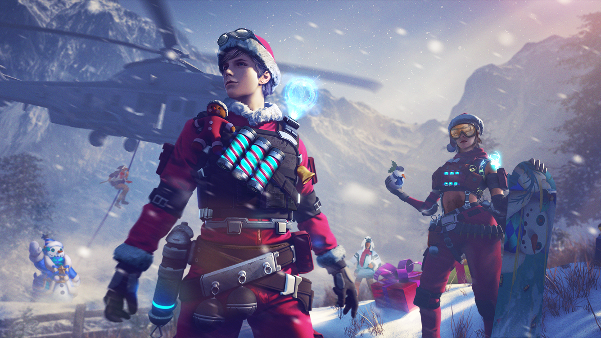
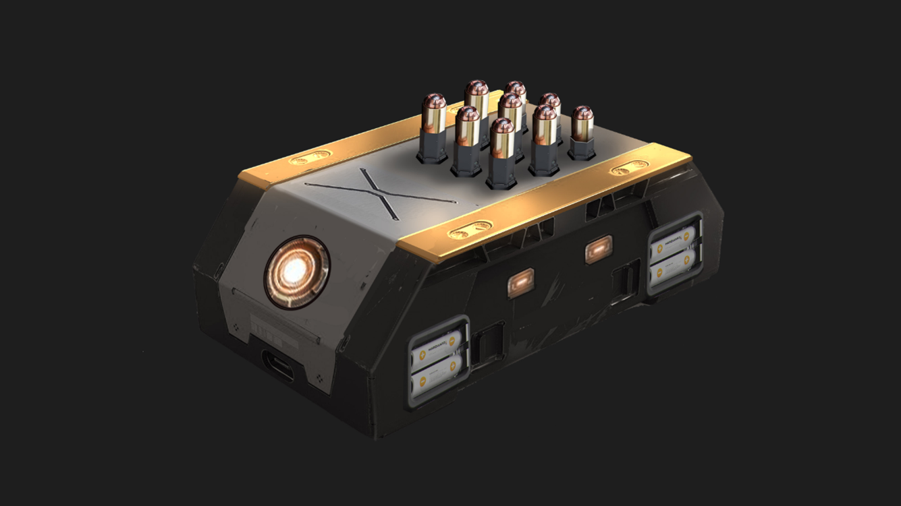
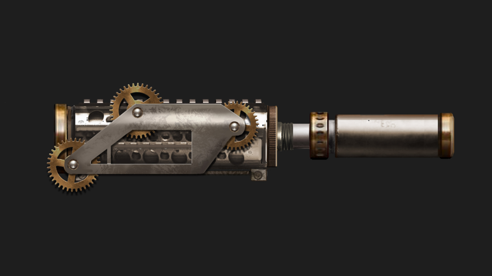
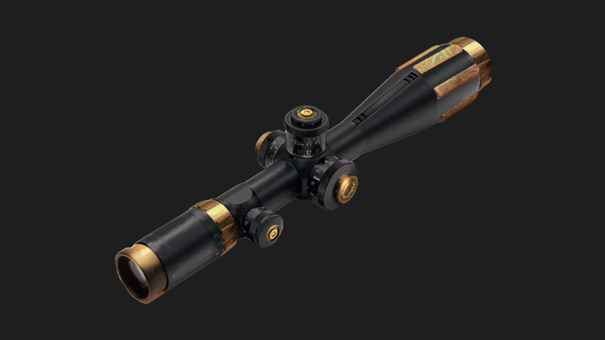

# Free Fire · OB19 · Winterlands（2019 年 12 月补丁）

- 公告日期：2019-12-10
- 官方来源：[PATCH NOTE: WINTERLANDS](https://ff.garena.com/en/article/106/)
- 审阅日期：2026-09-19
- 9 个分类小节；58 项说明及表格行；5 张官方公告插图。

本篇 BR、CS 与通用局内更新已按官方正文复核。独立玩法及局外内容另列处置；未公布的日期、范围和单位明确保留信息缺口。

正文未公布统一补丁生效时刻；以下均以公告日索引。

Winterlands 补丁版本总览图。原文：PATCH NOTE: WINTERLANDS。[官方原图](https://cdn.wildflamestudio.com/common/OB19/officialweb/patchOB19.png) · 1335×751。

## BR · 大逃杀

### VSS 持续伤害、M14 全自动与 Kar98k 辅助瞄准配件

- 归属：BR · 大逃杀 / 常规调整
- 原文小节：Advanced Attachments
- 时间：公告日索引。

VSS Ripper Bullet 官方图。原文：Advanced Attachments > VSS - Ripper Bullet。[官方原图](https://cdn.wildflamestudio.com/common/OB19/officialweb/vss.png) · 1335×751。

M14 Rage Core 官方图。原文：Advanced Attachments > M14 - Rage Core。[官方原图](https://cdn.wildflamestudio.com/common/OB19/officialweb/m14.png) · 1335×751。

Kar98k Biometric Scope 官方图。原文：Advanced Attachments > Kar98k - Biometric Scope。[官方原图](https://cdn.wildflamestudio.com/common/OB19/officialweb/kar98k%20(1).png) · 1335×751。

- 经典 BR 的 VSS 撕裂弹配件（Ripper Bullet，说明性译名）：每次造成 7 点生命值的持续伤害，共触发 3 次。
- VSS 的上述效果最多叠加 5 层。
- 经典 BR 的 M14 狂怒核心配件（Rage Core，说明性译名）使武器改为全自动。
- 上述 M14 配件同时使射速提高 26%。
- 经典 BR 的 Kar98k 生物识别瞄具（Biometric Scope，说明性译名）提供辅助瞄准。
- 上述 Kar98k 配件同时使开镜速度提高 20%。

### 百慕大动态天气

- 归属：BR · 大逃杀 / 常规调整
- 原文小节：Other Adjustments > Gameplay
- 时间：公告日索引。

- 百慕大经典模式加入动态天气。

## CS · 枪王对决

### CS 常驻、经济和倒地规则

- 归属：CS · 枪王对决 / 常规调整
- 原文小节：Gameplay > Clash Squad
- 时间：公告日索引。

- Clash Squad 成为常驻模式。
- 新增首杀效果。
- 新增多杀效果。
- 连续倒地会更快流血。
- 每回合首杀玩家获得额外 100 金币。
- 随回合推进，双方队伍每回合获得更多金币。

### CS 专属沙漠之鹰参数

- 归属：CS · 枪王对决 / 常规调整
- 原文小节：Gameplay > Clash Squad > Desert Eagle - New!
- 时间：公告日索引。

- 沙漠之鹰（Desert Eagle）仅加入 CS：伤害参数 90、射速参数 0.55、弹匣 7 发、射程参数 70；原文未标明射速和射程单位。

## 通用局内调整

### 角色升级成本与第 4 技能槽

- 归属：通用局内调整 / 常规调整
- 原文小节：Character System
- 时间：公告日索引。

- 角色第 4 技能槽开放。
- 角色升级所需碎片降低；金币和钻石成本的逐级变动见本节 3 张原始表格。
- 每局碎片掉落提高 350%。
- 每名角色每日碎片上限 100→250。

| 等级 | 金币 | 钻石 |
|---|---|---|
| 1 | 0 | 0 |
| 2 | 500 | 25→20 |
| 3 | 2000→1000 | 80→60 |
| 4 | 4500→2000 | 160→120 |
| 5 | 8000→4500 | 270→150 |
| 6 | 12000→8000 | 400→250 |
| 7 | 20000→12000 | 500→300 |
| 8 | 30000→16000 | 750→350 |

| 等级 | 碎片 |
|---|---|
| 1 | 0 |
| 2 | 100 |
| 3 | 300 |
| 4 | 500 |
| 5 | 700 |
| 6 | 1500 |
| 7 | 3000→2500 |
| 8 | 6000→4000 |

| 技能槽 | 金币 | 钻石 |
|---|---|---|
| 1 | 0 | 0 |
| 2 | 8000→2000 | 100→50 |
| 3 | 12000→5000 | 150→75 |
| 4 | 0→10000 | 0→125 |

### Notora 载具治疗技能

- 归属：通用局内调整 / 常规调整
- 原文小节：New Character - Notora
- 时间：公告日索引。

Notora 角色官方图。原文：New Character - Notora。[官方原图](https://cdn.wildflamestudio.com/common/OB19/officialweb/Notora.png) · 1335×751。

- 新增 Notora。驾驶载具时，为车上全部成员每 4.5/4/3.5/3/2.5/2 秒恢复 5 HP。
- 效果不可叠加。

### 排位物品池扩充

- 归属：通用局内调整 / 常规调整
- 原文小节：Gameplay > Weapons Added to Rank Mode
- 时间：公告日索引；未单列此项生效日期。

原文仅称 Rank Mode，没有单列 BR／CS 适用范围。

- 排位物品池加入 M60 持续射击强化配件（Spiral Charger）。
- 排位物品池加入 MP5 射速强化配件（Electrical Booster）。
- 排位物品池加入 M1887 霰弹枪。
- 排位物品池加入手炮（Hand Cannon）。
- 排位物品池加入等离子枪（Plasma Gun）。
- 排位物品池加入 4 级头盔。

### 地雷伤害与引爆时间

- 归属：通用局内调整 / 常规调整
- 原文小节：Gameplay > Landmine Explosion damage and timing adjustment
- 时间：公告日索引。

- 地雷最大伤害 300→205。
- 地雷最小伤害 100→120。
- 引爆时间增加 10%。

### 拾取、标记、战利品与局内提示

- 归属：通用局内调整 / 常规调整
- 原文小节：Other Adjustments > Gameplay
- 时间：公告日索引。

- 队友手雷不再在屏幕显示警告指示。
- 治疗枪每发显示治疗量。
- 调整瞄具 UI。
- 新增物资生成机制，具体规则未说明。
- 地雷对布设者显示更强警告指示。
- 战利品箱尺寸提高 120%，以改善可见性。
- 可标记地面物品以通知队友。
- 交战、治疗或处于危险区时显示局内提示文本。
- 空投加入 4 级头盔。

## 其他玩法与局外内容（目录摘要）

### 角色等级活动与 EP 页面

新手升级奖励、Road to Mastery、升级活动、EP 页面解锁与升级动画/页面属于进度或局外 UI。

原文目录：Newbie & Leveling

### 页面、充值和媒体 UI

返回键、EP/Media/充值页面位置或样式调整不属于局内体验。

原文目录：UI

### 角色页 UI 与宠物名称

角色页面采用新 UI；宠物名称支持两个字符。两项不改变局内操作、规则或角色技能效果。

原文目录：Character System / Other Adjustments > Gameplay

### 赛后伤害统计

赛后总结页显示队友造成的伤害；属于局外统计。

原文目录：Other Adjustments > Gameplay

## 官方图片索引

正文图片按相关小节展示，版本总览及其他章节插图另列；同一原图只嵌入一次。

- [Winterlands 补丁版本总览图](https://cdn.wildflamestudio.com/common/OB19/officialweb/patchOB19.png) · 1335×751 · 本地 `assets/ff-patches/106-01.png`
- [Notora 角色官方图](https://cdn.wildflamestudio.com/common/OB19/officialweb/Notora.png) · 1335×751 · 本地 `assets/ff-patches/106-02.png`
- [VSS Ripper Bullet 官方图](https://cdn.wildflamestudio.com/common/OB19/officialweb/vss.png) · 1335×751 · 本地 `assets/ff-patches/106-03.png`
- [M14 Rage Core 官方图](https://cdn.wildflamestudio.com/common/OB19/officialweb/m14.png) · 1335×751 · 本地 `assets/ff-patches/106-04.png`
- [Kar98k Biometric Scope 官方图](https://cdn.wildflamestudio.com/common/OB19/officialweb/kar98k%20(1).png) · 1335×751 · 本地 `assets/ff-patches/106-05.png`

## 版本关联来源

### [角色成长调整预告](https://ff.garena.com/en/article/83/)

2019-12-04
预告与106正式数值分开，不重复新增版本。

- 总升级碎片需求约减少20%，主要降低高等级门槛；每局碎片掉落增至3～4倍，每角色每日上限100→250；金币和钻石升级成本近半。106正式补丁掉落表述为+350%，两份表述保留。
- 预告第四技能槽，并降低各槽解锁成本；本篇没有逐等级碎片表，详表以106为准。

角色成长调整预告 · 原文图1。原文：角色成长调整预告。[官方原图](https://cdn.wildflamestudio.com/common/OB19/ofweb/DEV%20BLOG2.png) · 1335×751。

### [角色与宠物技能槽开发日志](https://ff.garena.com/en/article/90/)

2019-10-31
本篇为2019年10月预告，106与122分别提供后续落地证据。

- 下一补丁计划加入第四角色技能槽，另计划降低角色获取与升级负担。
- 宠物第二技能槽短期不会推出；计划允许宠物技能互换。106确认第四角色槽，122才明确宠物技能可互换，不把两个功能都写成106上线。

角色与宠物技能槽开发日志 · 原文图1。原文：角色与宠物技能槽开发日志。[官方原图](https://cdn.wildflamestudio.com/common/web_event/official/fa84fbed116af044733a76dd065d2711b8e483148bc0.jpg) · 800×800。

## 原文目录（对照用）

- Character System
- Gameplay
- Advanced Attachments
- Other Adjustments
