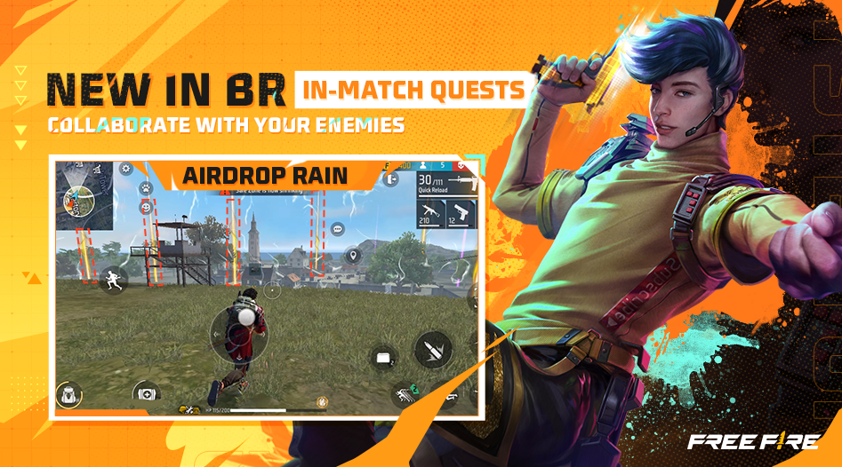
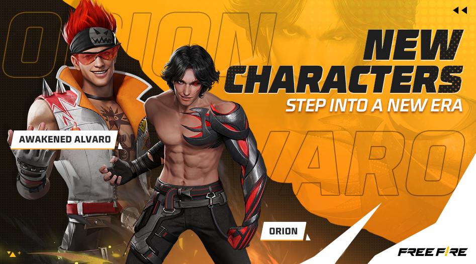
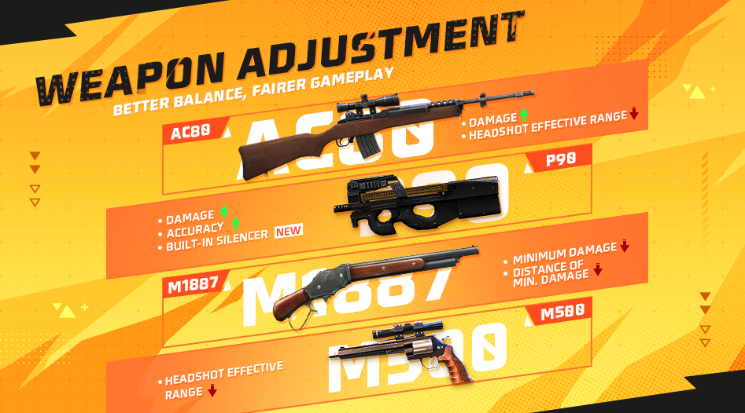

# Free Fire · OB39（2023 年 3 月更新）

- 公告日期：2023-03-21
- 官方来源：[Patch Notes](https://ff.garena.com/en/article/1120/)
- 审阅日期：2026-09-19
- 43 个分类小节；81 项说明及表格行；6 张官方公告插图。

主流程逐项复核完整正文；BR/CS和通用局内内容分线，独立玩法和局外内容逐项附录。Luna初稿漏项已修正；保留地图池两份冲突与配图Coming Soon证据。

公告日期 2023-03-21；正文未给统一精确生效时刻。

## BR · 大逃杀

### 大逃杀：对局任务与事件

- 归属：BR · 大逃杀 / 常规调整
- 原文小节：Battle Royale > In-Match Quests
- 时间：公告日期 2023-03-21；未公布独立生效时间。

按正文对应模式记录。

BR对局任务：空投雨。原文：Battle Royale。[官方原图](https://lh3.googleusercontent.com/UOCc3VE00oumzCnG7WLyYp1XhZ4aQD7dC6RxVHkP0uvBAA-y4wUF9af9f0nWhLWkbu5IvsUtOgNCWwr4MqS6HHyQanfS6h1ljsDaOe4RDmVSTthVpKowiFwKS7RLjZjISuYbvA8S80lmjbd1b_Xiej8) · 947×526。

- 对局中可能随机出现任务，完成后触发事件；部分对局含隐藏任务，完成后对应事件自动触发。
- 任务包括：在指定范围内淘汰一定数量敌人；在售货机消费指定数量FF币；在无人机下累计淘汰指定数量玩家；消耗指定数量蘑菇。
- 事件包括：售货机物品折扣；安全区内出现15个空投；复活点不会关闭；显示倒数第二个安全区位置。

### 大逃杀：超级复活

- 归属：BR · 大逃杀 / 常规调整
- 原文小节：Battle Royale > Super Revival
- 时间：公告日期 2023-03-21；未公布独立生效时间。

按正文对应模式记录。

- 售货机新增超级复活卡，价格600 FF币。使用后复活队友，返场时获得二级护甲和UMP。

### 大逃杀战备调整

- 归属：BR · 大逃杀 / 常规调整
- 原文小节：Gameplay > Loadout Adjustments > Battle Royale
- 时间：公告日期 2023-03-21；未公布独立生效时间。

按正文对应模式记录。

- 空投援助：原冷却430秒，每次淘汰减少30秒、每造成5点伤害减少1秒；新规则为空投附带三级武器，冷却600秒，每次淘汰减少60秒、每造成5点伤害减少1秒。
- 腿部口袋：落地时二级背包+100背包容量→二级背包+200背包容量。
- 秘密线索：跳伞后地图标记补给点，获得3个Gloo墙、发射台、600 FF币和治疗枪；首次搜刮后会在地图标记第二个补给点。

### BR：队友状态、飞机人数与地图操作

- 归属：BR · 大逃杀 / 常规调整
- 原文小节：Other Adjustments
- 时间：公告日期 2023-03-21；正文未给统一精确生效时刻。

按原文具体适用范围记录。

- 多人BR局内新增可查看队友状态的计分板，通过长按或点击队伍面板打开，默认关闭。
- 调整飞机舱内剩余人数显示位置，使开地图时仍可查看。
- 优化大逃杀地图缩放操作。
- 自动跳伞时朝向地图中心，而非飞机航线。

## CS · 枪王对决

### 枪王对决地图：Mill调整

- 归属：CS · 枪王对决 / 常规调整
- 原文小节：Map > Map Balancing > Mill
- 时间：公告日期 2023-03-21；未公布独立生效时间。

按正文对应模式记录。

- 移动黄色楼梯，为通往平台提供更安全路线。
- 移除可弹跳上屋顶的轮胎。
- 移除平台上的两辆车并增加箱子，降低躲在掩体后的优势。
- 增加一楼掩体并调整纸箱布局，提供更多进攻路线。
- 在山坡往返路线增加纸箱，便于返回初始位置。

### 枪王对决地图：Pochinok调整

- 归属：CS · 枪王对决 / 常规调整
- 原文小节：Map > Map Balancing > Pochinok
- 时间：公告日期 2023-03-21；未公布独立生效时间。

按正文对应模式记录。

- 在安全区通常收缩的中央空地增加掩体，让双方移动和交战更公平。
- 封闭不同建筑之间的缝隙，增加可用的交战策略。

### 枪王对决战备调整

- 归属：CS · 枪王对决 / 常规调整
- 原文小节：Gameplay > Loadout Adjustments > Clash Squad
- 时间：公告日期 2023-03-21；未公布独立生效时间。

按正文对应模式记录。

- 扫描：首个安全区开始收缩时标记所有敌人（仅使用者可见），并显示Clu技能视觉效果。
- 赏金令：每淘汰一名敌人额外获得300现金（开局选择、仅一回合）→使用后每淘汰一名敌人额外获得100现金。
- 秘密商店（Secret Bazaar）：全队补满EP费用500→300；EP转生命值由每秒5点、费用600现金改为每秒4点、费用500现金；给每名队友医疗包（400现金）改为给每名队友2个吸入器（200现金）；全队移动速度提高20%的费用2000→1500。

### 枪王对决商店九项价格调整

- 归属：CS · 枪王对决 / 常规调整
- 原文小节：Weapon and Balance > CS Store Price Adjustments
- 时间：公告日期 2023-03-21。

按正文对应模式记录。

- SVD：2000→2400；MAC10：1500→1600；AK：1800→1400；UMP：1600→1500；P90：1300→1700；MAG-7：1700→1600；AC80：1900→2000；Woodpecker：1900→2000；XM8：1600→1500。

### 枪王对决：护甲箱与轮次装备

- 归属：CS · 枪王对决 / 常规调整
- 原文小节：Gameplay > Loadout Adjustments > Clash Squad
- 时间：公告日期 2023-03-21。

按正文对应模式记录。

- 护甲箱每轮修复80%护甲耐久。
- 第2回合发放一级头盔和一级护甲；第3回合发放二级护甲；第4、5回合发放护甲生命值增强器和头盔强化器；第6、7回合发放护甲扩容器。

### CS：购买、升级图标与无人机提示

- 归属：CS · 枪王对决 / 常规调整
- 原文小节：Other Adjustments
- 时间：公告日期 2023-03-21；正文未给统一精确生效时刻。

按原文具体适用范围记录。

- 枪王对决网络不佳时不会重复购买物品，连接稳定后显示武器升级图标。
- 优化枪王对决无人机红点大小，使敌人位置更易读取。

## 通用局内调整

### 角色与宠物系统重做

- 归属：通用局内调整 / 常规调整
- 原文小节：Character System Remake
- 时间：公告日期 2023-03-21；正文未给独立生效时间。

适用范围按正文；通用章节未限定具体模式，不推定所有独立玩法均采用相同规则。

金币购买角色与最高技能强度。原文：Character System Remake。[官方原图](https://lh5.googleusercontent.com/sv538Ry6azVBE5d9I_5gnrZauHqYfZ0FXVJ68u1QOVrx3yWrwkmCF0CZ6S2Ye_0PFZk9HL-gfI8wrsLF8YoOAI9SPFiwizwk-Vpa7YGYvDH0fZ3UGutL57XDNIjZ3IisvzyAUZ1Qu6G7HKabUg-68DM) · 947×526。

- 角色和宠物技能直接解锁至最高技能强度，等级不再改变技能属性。
- 更换角色只影响外观；要快速切换技能组合，可在技能预设方案之间切换。
- 角色页面新增预设自定义区，最多可设置5套方案，每套可包含角色外观、角色技能、宠物技能和装备配置。
- 预设可绑定大逃杀、枪王对决、独狼等常用模式，进入对应模式时自动应用。
- 可将自己或他人的预设代码复制到新槽位，也可把推荐预设应用到指定槽位。
- 可勾选选项在对局中隐藏宠物；设置一次后会自动生效，无需每局重复设置。

### 新角色：Orion

- 归属：通用局内调整 / 常规调整
- 原文小节：New Character > Orion
- 时间：公告日期 2023-03-21；正文未给独立生效时间。

适用范围按正文；通用章节未限定具体模式，不推定所有独立玩法均采用相同规则。

Orion与觉醒Alvaro。原文：New Character / Awakened Character。[官方原图](https://lh6.googleusercontent.com/inm3EJFaNHR90vcykTFXwQV6rzUf9QGE1RwSV0tmUcCb_ZTgrh_rJ7-JOY2dMkOYX1hSd6ySxcbgVhxRvm4p1roXgl1HvsnoZwvdhSro9Mpc2vZmUsDgYorcdd06AnCmDhjpt9O775Dh6X4eY9rTyRo) · 947×526。

- 技能Crimson Crush以300点猩红能量取代EP。
- 消耗150点猩红能量后进入保护状态：持续3秒，期间不会受到伤害，也不能攻击敌人；会吸收5米内敌人的15点生命值。冷却时间为3秒。

### 觉醒角色：Alvaro

- 归属：通用局内调整 / 常规调整
- 原文小节：Awakened Character > Alvaro
- 时间：公告日期 2023-03-21；正文未给独立生效时间。

适用范围按正文；通用章节未限定具体模式，不推定所有独立玩法均采用相同规则。

- 原技能“爆破艺术”：爆炸武器伤害提高20%，伤害范围扩大10%。
- 觉醒技能Split Blitz：手雷爆炸前1秒额外产生3枚手雷，每枚可造成原手雷30%的伤害。

### 角色重做：Xayne

- 归属：通用局内调整 / 范围未明确
- 原文小节：Character Reworks > Xayne
- 时间：公告日2023-03-21；正文配图将这四名角色重做标为Coming Soon，未给确切开放日期。

适用范围按正文；通用章节未限定具体模式，不推定所有独立玩法均采用相同规则。

Xayne、Otho、Ford、Dasha重做：Coming Soon预告。原文：Character Reworks。[官方原图](https://lh6.googleusercontent.com/vuPVM7QK2PyeJ4yjJYmU7M3z8L2xEsQOBrTPozgFMRV2u_Ky6TRDjzoYWQVkT_vcvZXY-3ggc7OyzjYhQctLJUHSwhZEViSm5GlKktij3N8LC8vrQ6XIsWzrgPHpwTpUrvYYhxMPAEX39OB0T-DaNQQ) · 947×526。

- Xtreme Encounter重做：进入极限模式，获得50点临时生命值，持续8秒；期间生命恢复效果增强75%。冷却时间75秒。原文说明该调整取消生命值持续衰减，目标是改善近距离突击时的技能控制。

### 角色重做：Otho

- 归属：通用局内调整 / 范围未明确
- 原文小节：Character Reworks > Otho
- 时间：公告日2023-03-21；正文配图将这四名角色重做标为Coming Soon，未给确切开放日期。

适用范围按正文；通用章节未限定具体模式，不推定所有独立玩法均采用相同规则。

- Memory Mist重做：击倒敌人后，标记被击倒敌人20米范围内的敌人，并使其移动速度降低25%，持续4秒。自己被击倒时，也会标记并减速附近敌人。

### 角色重做：Dasha

- 归属：通用局内调整 / 范围未明确
- 原文小节：Character Reworks > Dasha
- 时间：公告日2023-03-21；正文配图将这四名角色重做标为Coming Soon，未给确切开放日期。

适用范围按正文；通用章节未限定具体模式，不推定所有独立玩法均采用相同规则。

- Partying On重做：淘汰敌人后进入高光模式，射速提高18%、移动速度提高12%，增益随后快速衰减；模式持续6秒。高光模式期间连续击倒敌人会重置倒计时，并使射速额外提高4%、移动速度额外提高3%。

### 角色重做：Ford

- 归属：通用局内调整 / 范围未明确
- 原文小节：Character Reworks > Ford
- 时间：公告日2023-03-21；正文配图将这四名角色重做标为Coming Soon，未给确切开放日期。

适用范围按正文；通用章节未限定具体模式，不推定所有独立玩法均采用相同规则。

- Iron Will重做：受到伤害时，每秒回复10点生命值，持续3秒；冷却20秒。原文另写“The active skill will reset immediately after you release it”，未明确重置的是哪个技能，保留该歧义。

### 角色平衡：Kenta

- 归属：通用局内调整 / 常规调整
- 原文小节：Character Balance Adjustments > Kenta
- 时间：公告日期 2023-03-21；正文未给独立生效时间。

适用范围按正文；通用章节未限定具体模式，不推定所有独立玩法均采用相同规则。

- Swordsman’s Wrath：形成宽5米的护盾，正面受到的武器伤害减免由50%提高至60%；开火时伤害减免由10%提高至20%。持续5秒，冷却时间70秒。

### 角色平衡：Alok

- 归属：通用局内调整 / 常规调整
- 原文小节：Character Balance Adjustments > Alok
- 时间：公告日期 2023-03-21；正文未给独立生效时间。

适用范围按正文；通用章节未限定具体模式，不推定所有独立玩法均采用相同规则。

- Drop the Beat：生成半径5米的光环，使移动速度提高15%，并在10秒内每秒恢复3点生命值（原为5点/秒）；效果不可叠加。冷却时间由50秒调整为45秒。

### 角色平衡：Santino

- 归属：通用局内调整 / 常规调整
- 原文小节：Character Balance Adjustments > Santino
- 时间：公告日期 2023-03-21；正文未给独立生效时间。

适用范围按正文；通用章节未限定具体模式，不推定所有独立玩法均采用相同规则。

- Shape Splitter：生成一个200点生命值的假人，假人会自行向前移动12秒；再次使用技能可传送至假人所在位置。假人在被使用后或12秒结束时销毁，冷却时间80秒。

### Guard Tower结构重做

- 归属：通用局内调整 / 常规调整
- 原文小节：Map > Map Structure Optimization
- 时间：公告日期 2023-03-21；未公布独立生效时间。

适用范围按正文；通用章节未限定具体模式，不推定所有独立玩法均采用相同规则。

- 金属板替换为可透视且可射击的栅条，降低从塔内偷袭的可能。
- 三面金属板增加凹槽：站立可向敌人射击，也会暴露在对方火力下；蹲下时无法向敌人射击。
- 降低塔的高度，避免坠落伤害。
- 将售货亭移到角落，改善通行和操作。

### 步枪：M14

- 归属：通用局内调整 / 常规调整
- 原文小节：Weapon and Balance > Weapon Balance Adjustments
- 时间：公告日期 2023-03-21；未公布独立生效时间。

适用范围按正文；通用章节未限定具体模式，不推定所有独立玩法均采用相同规则。

- 射速降低5%（I、II、III三级均适用）。

### 步枪：FAMAS

- 归属：通用局内调整 / 常规调整
- 原文小节：Weapon and Balance > Weapon Balance Adjustments
- 时间：公告日期 2023-03-21；未公布独立生效时间。

适用范围按正文；通用章节未限定具体模式，不推定所有独立玩法均采用相同规则。

- 第3发子弹伤害提高：I级+8%，II级+8%，III级+15%。

### 步枪：SCAR

- 归属：通用局内调整 / 常规调整
- 原文小节：Weapon and Balance > Weapon Balance Adjustments
- 时间：公告日期 2023-03-21；未公布独立生效时间。

适用范围按正文；通用章节未限定具体模式，不推定所有独立玩法均采用相同规则。

- 射速降低3%（I、II、III三级均适用）。

### 冲锋枪：UMP

- 归属：通用局内调整 / 常规调整
- 原文小节：Weapon and Balance > Weapon Balance Adjustments
- 时间：公告日期 2023-03-21；未公布独立生效时间。

适用范围按正文；通用章节未限定具体模式，不推定所有独立玩法均采用相同规则。

- 枪口配件槽禁用；枪王对决商店价格1600→1500。

### 冲锋枪：P90

- 归属：通用局内调整 / 常规调整
- 原文小节：Weapon and Balance > Weapon Balance Adjustments
- 时间：公告日期 2023-03-21；未公布独立生效时间。

适用范围按正文；通用章节未限定具体模式，不推定所有独立玩法均采用相同规则。

AC80、P90、M1887、M500武器调整。原文：Weapon and Balance。[官方原图](https://lh3.googleusercontent.com/7bHO31S-HNgB_Unfw5n5fsEcoJf3pC8suXcsN-j09B6CIH2uD8WKwNsaouHNGcqrgge8Cy1Ykbug60KJl_GDE4eUd3jDcmH7vnyl3J2C5M35X4PU5BDAkrLmh28RsHQbtfjpg-_xDOzenyUFnMpooD4) · 947×526。

- 伤害提高10%，精准度提高20%，内置消音器；枪王对决商店价格1300→1700。

### 射手步枪：AC80

- 归属：通用局内调整 / 常规调整
- 原文小节：Weapon and Balance > Weapon Balance Adjustments
- 时间：公告日期 2023-03-21；未公布独立生效时间。

适用范围按正文；通用章节未限定具体模式，不推定所有独立玩法均采用相同规则。

- 伤害提高20%，爆头有效距离降低20%；枪王对决商店价格1900→2000。

### 射手步枪：Woodpecker

- 归属：通用局内调整 / 常规调整
- 原文小节：Weapon and Balance > Weapon Balance Adjustments
- 时间：公告日期 2023-03-21；未公布独立生效时间。

适用范围按正文；通用章节未限定具体模式，不推定所有独立玩法均采用相同规则。

- 爆头有效距离降低20%；枪王对决商店价格1900→2000。

### 霰弹枪：M1887

- 归属：通用局内调整 / 常规调整
- 原文小节：Weapon and Balance > Weapon Balance Adjustments
- 时间：公告日期 2023-03-21；未公布独立生效时间。

适用范围按正文；通用章节未限定具体模式，不推定所有独立玩法均采用相同规则。

- 最低伤害降低10%；最低伤害对应距离（distance of minimum damage）降低25%。原文不是最低有效射程。

### 手枪：M500

- 归属：通用局内调整 / 常规调整
- 原文小节：Weapon and Balance > Weapon Balance Adjustments
- 时间：公告日期 2023-03-21；未公布独立生效时间。

适用范围按正文；通用章节未限定具体模式，不推定所有独立玩法均采用相同规则。

- 爆头有效距离降低20%。

### 狙击枪：M24

- 归属：通用局内调整 / 常规调整
- 原文小节：Weapon and Balance > Weapon Balance Adjustments
- 时间：公告日期 2023-03-21；未公布独立生效时间。

适用范围按正文；通用章节未限定具体模式，不推定所有独立玩法均采用相同规则。

- 可穿透Gloo墙对敌人造成40%伤害（类似M82B）；对Gloo墙造成普通伤害的2倍。

### 近战武器：Katana

- 归属：通用局内调整 / 常规调整
- 原文小节：Weapon and Balance > Weapon Balance Adjustments
- 时间：公告日期 2023-03-21；未公布独立生效时间。

适用范围按正文；通用章节未限定具体模式，不推定所有独立玩法均采用相同规则。

- 对Gloo墙伤害提高。

### 近战武器：Bat

- 归属：通用局内调整 / 常规调整
- 原文小节：Weapon and Balance > Weapon Balance Adjustments
- 时间：公告日期 2023-03-21；未公布独立生效时间。

适用范围按正文；通用章节未限定具体模式，不推定所有独立玩法均采用相同规则。

- 移动速度提高5%。

### 战备：篝火

- 归属：通用局内调整 / 常规调整
- 原文小节：Gameplay > Loadout Adjustments > Bonfire
- 时间：公告日期 2023-03-21；未公布独立生效时间。

适用范围按正文；通用章节未限定具体模式，不推定所有独立玩法均采用相同规则。

- 大逃杀和枪王对决中，篝火数量3→2；效果由每秒恢复15生命值和10EP改为每秒恢复10生命值和10EP。
- 连续放置篝火之间增加冷却时间，避免误触。

### 局内信息与操作优化

- 归属：通用局内调整 / 常规调整
- 原文小节：Other Adjustments
- 时间：公告日期 2023-03-21；未公布独立生效时间。

适用范围按正文；通用章节未限定具体模式，不推定所有独立玩法均采用相同规则。

- 优化物品轮盘操作。
- 特殊标记物在小地图上更醒目。
- 标记音效增加冷却，防止刷屏；标记功能本身不冷却。
- 近战攻击结束后立即恢复奔跑动画。
- 从高处跳下后更不易出现踉跄。

### 局内物理与输入调整

- 归属：通用局内调整 / 常规调整
- 原文小节：Gameplay > Auto-Aim Optimization / Jumping Disabled on Gloo Wall
- 时间：公告日期 2023-03-21；未公布独立生效时间。

适用范围按正文；通用章节未限定具体模式，不推定所有独立玩法均采用相同规则。

- 优化自动瞄准：倒地敌人在准星附近时更容易瞄准站立敌人；准星在倒地敌人上时更易切换到其他敌人。
- 禁止站在冰墙顶部跳跃；点击跳跃按钮会显示该动作未启用的提示。

### 手雷烹调提示

- 归属：通用局内调整 / 常规调整
- 原文小节：Weapon and Balance > Grenade Cooking
- 时间：公告日期 2023-03-21。

适用范围按正文；通用章节未限定具体模式，不推定所有独立玩法均采用相同规则。

- 敌人正在拉栓预热手雷（cooking）时，会发出提示音，并在小地图显示其位置。

### 组队语音频道

- 归属：通用局内调整 / 常规调整
- 原文小节：Gameplay > Group Voice Chat
- 时间：公告日期 2023-03-21。

适用范围按正文；通用章节未限定具体模式，不推定所有独立玩法均采用相同规则。

- 新增Group/All语音频道选择：Group仅与预组队好友交流；选择Group时，All频道的其他玩家听不到该组语音，Group用户也听不到All频道的其他玩家。

### 双网络连接（仅新加坡）

- 归属：通用局内调整 / 常规调整
- 原文小节：Gameplay > Duo Network Connection (SG ONLY)
- 时间：公告日期 2023-03-21。 仅新加坡地区（SG ONLY）。

适用范围按正文；通用章节未限定具体模式，不推定所有独立玩法均采用相同规则。

- 在设置中启用后，Free Fire 会在对局期间自动选择最佳网络连接。该功能会消耗移动数据。

### 高延迟解决方案II（仅新加坡）

- 归属：通用局内调整 / 常规调整
- 原文小节：Gameplay > High Ping Solution II (SG ONLY)
- 时间：公告日期 2023-03-21。 仅新加坡地区（SG ONLY）。

适用范围按正文；通用章节未限定具体模式，不推定所有独立玩法均采用相同规则。

- 高延迟且与敌人同时开火时，即使服务器判定自己已被击倒，伤害也更可能成功生效；为保证公平，仅在不影响对局结果时启用。
- 降低从其他玩家视角穿墙行走的可能。
- 设置中可选择高延迟时仅显示服务器确认的伤害数值。
- 提高Ping显示刷新率，使玩家及时了解网络波动。

### 排位地图池轮换

- 归属：通用局内调整 / 常规调整
- 原文小节：System > Map Pool Adjustment
- 时间：公告日期 2023-03-21。

适用范围按正文；通用章节未限定具体模式，不推定所有独立玩法均采用相同规则。

- BR/CS排位地图池在同篇出现两份相互冲突的说明：第一处称Purgatory暂时退出、Alpine替换，名单为Bermuda、NeXTerra、Alpine；第二处名单为Bermuda、NeXTerra、Purgatory、Alpine。HTML没有删除线或取消标记，不能自行选择其中一份作为唯一生效名单。

### 游戏环境：局内公平提示

- 归属：通用局内调整 / 常规调整
- 原文小节：Game Environment
- 时间：公告日期 2023-03-21。

适用范围按正文；通用章节未限定具体模式，不推定所有独立玩法均采用相同规则。

- 对局中检测到恶劣行为时，屏幕侧边弹窗提醒。

### 其他局内可用性调整

- 归属：通用局内调整 / 常规调整
- 原文小节：Other Adjustments
- 时间：公告日期 2023-03-21。

适用范围按正文；通用章节未限定具体模式，不推定所有独立玩法均采用相同规则。

- 修正 Rafael 技能描述，使其与实际技能效果一致。
- 自动下载在对局进行时暂停，对局结束后恢复。
- 优化设置页，使部分设置的依赖关系更易理解。
- 优化进入对局所需的加载时间。

## 其他玩法与局外内容（目录摘要）

### 角色获取、羁绊与觉醒任务

所有角色可用金币购买。羁绊通过在对局中使用该角色提升，继承原角色等级进度。角色列表新增展示美术；LINK移除，当前LINK角色在更新后10个工作日内发放。宠物入口并入角色页，点击宠物查看列表；等级7→4，仅保留奖励等级，总奖励不变并继承原数据。觉醒任务装备目标角色技能即可累计；不再每日刷新或清除进度，刷新所需金币减少。

原文目录：Character System Remake

### Pet Smash：独立宠物对战

预告在本版本后续开放，未给日期。从3只宠物中选择其一，各自有基础攻击与终极技能；2v2，率先7分或5分钟结束时分数最高者胜。攻击命中积累能量，满能量释放终极技能；被淘汰3秒后随机位置复活。低生命时脱离战斗4秒可回复生命；随机生成可拾取的属性增益。

原文目录：Other Modes > Pet Smash

### Triple Wolves：独立三队对战

Coming Soon预告；在Ice Ground地图进行2v2v2或1v1v1，共6回合，以淘汰和存活得分，总分最高队伍胜。每名玩家轮流为某回合的全体玩家选择武器；每回合发放闪光弹、Flash Freeze、二级头盔与护甲及2面冰墙。

原文目录：Other Modes > Triple Wolves

### Coin Clash：复活

可自行选择复活点；超时则在队友附近、敌人较少的位置复活。复活保留原武器和物品，但仍扣除FF币。

原文目录：Other Modes > Coin Clash

### Lone Wolf Cup：独立杯赛

在版本后续开放，未给日期。可从大厅或模式选择页进入，无需预先组队；与另外7名玩家进行3轮1v1，按胜利次数给奖励。

原文目录：Other Modes > Lone Wolf Cup

### 训练场：拟真靶

新增2个拟真目标，可配置生命与护甲；护甲可摧毁，被击倒后重新生成。

原文目录：Other Modes > Target Range

### 系统与赛后功能

武器荣耀排行榜增加地区子分区和称号。CS排位保护分上限不再固定100，超出所需值可换取额外星数；保护分来源包括队友挂机/恶劣行为、连胜、造成伤害、淘汰和MVP。CS排位新增每日挑战：首场Booyah给予额外保护分，随机挑战给予Rank Token。排位历史可查看历季数据。回放要求64位系统和至少1GB RAM，新增进度条按回合查看、暂停、退出后返回录像列表；击杀按武器和难度评定10种比赛成就。大厅录制为iOS分批功能，录制码率2.4Mb/s并自动保存手机相册。

原文目录：System

### 地图排位保护

说明强调每周末在一张非Bermuda地图的首场对局不扣分；同段引述称daily，频率表述不一致，保留周末与daily两种原文，不推算为每日均有保护。

原文目录：System > Map Protection

### 创意工坊：补位与资源下载

作者可允许中途补位并设最多补入人数。先下载基础资源包；随机匹配先匹配再下载地图，房间和创建房间需先下载，编辑器放置对象前需下载对象资源。

原文目录：Craftland

### 创意工坊：进度、引导与界面

部分游戏新增排行榜和等级/经验保存，支持持续进度。地图可添加文字和图片教程，游玩中点Help查看。地图名下和详情页展示标签；自定义参数房间标为Advanced Room。详情页显示评分和预计时长；加载页显示本地化名称/说明、标签、评分和时长。评论正负评价互斥，选择一种会取消另一种。

原文目录：Craftland

### 举报与游戏文件治理

修改游戏文件的玩家收到警告，反复忽略可能加重处罚。举报后提供反馈与补偿；排行榜支持举报昵称，语音举报提交前增加确认。局内恶劣行为侧边提示另列核心卡。

原文目录：Game Environment

### 奖励与赛后界面

Daily Chest展示稀有武器皮肤模型；BR与CS结果页UI优化；历史比赛提供更多分数细节。Rank Protection Card改为永久有效，最多持有2张。

原文目录：Other Adjustments

## 其余原文配图

以下为尚未在上述小节内展示的原文图片，包括局外章节配图。

CS排位保护分与连胜加星。原文：System。[官方原图](https://lh6.googleusercontent.com/0lR57CtUDDjw8NZM_a8Ujcw8iBqTGPBokNPjKvWT94kNprTynNvhMOhlDvfPqoomylvVOnNDdNTHopRkMscMWE1sAuwRsXtehFkd0cqMJpJ-UJSB3TOr6fxjWXIGYA3XcQITJNB_MfffD-ymWgi5NiM) · 947×526。

## 官方图片索引

正文图片按相关小节展示，版本总览及其他章节插图另列；同一原图只嵌入一次。

- [金币购买角色与最高技能强度](https://lh5.googleusercontent.com/sv538Ry6azVBE5d9I_5gnrZauHqYfZ0FXVJ68u1QOVrx3yWrwkmCF0CZ6S2Ye_0PFZk9HL-gfI8wrsLF8YoOAI9SPFiwizwk-Vpa7YGYvDH0fZ3UGutL57XDNIjZ3IisvzyAUZ1Qu6G7HKabUg-68DM) · 947×526 · 本地 `assets/ff-patches/1120-01.jpg`
- [Orion与觉醒Alvaro](https://lh6.googleusercontent.com/inm3EJFaNHR90vcykTFXwQV6rzUf9QGE1RwSV0tmUcCb_ZTgrh_rJ7-JOY2dMkOYX1hSd6ySxcbgVhxRvm4p1roXgl1HvsnoZwvdhSro9Mpc2vZmUsDgYorcdd06AnCmDhjpt9O775Dh6X4eY9rTyRo) · 947×526 · 本地 `assets/ff-patches/1120-02.jpg`
- [Xayne、Otho、Ford、Dasha重做：Coming Soon预告](https://lh6.googleusercontent.com/vuPVM7QK2PyeJ4yjJYmU7M3z8L2xEsQOBrTPozgFMRV2u_Ky6TRDjzoYWQVkT_vcvZXY-3ggc7OyzjYhQctLJUHSwhZEViSm5GlKktij3N8LC8vrQ6XIsWzrgPHpwTpUrvYYhxMPAEX39OB0T-DaNQQ) · 947×526 · 本地 `assets/ff-patches/1120-03.jpg`
- [BR对局任务：空投雨](https://lh3.googleusercontent.com/UOCc3VE00oumzCnG7WLyYp1XhZ4aQD7dC6RxVHkP0uvBAA-y4wUF9af9f0nWhLWkbu5IvsUtOgNCWwr4MqS6HHyQanfS6h1ljsDaOe4RDmVSTthVpKowiFwKS7RLjZjISuYbvA8S80lmjbd1b_Xiej8) · 947×526 · 本地 `assets/ff-patches/1120-04.jpg`
- [CS排位保护分与连胜加星](https://lh6.googleusercontent.com/0lR57CtUDDjw8NZM_a8Ujcw8iBqTGPBokNPjKvWT94kNprTynNvhMOhlDvfPqoomylvVOnNDdNTHopRkMscMWE1sAuwRsXtehFkd0cqMJpJ-UJSB3TOr6fxjWXIGYA3XcQITJNB_MfffD-ymWgi5NiM) · 947×526 · 本地 `assets/ff-patches/1120-05.jpg`
- [AC80、P90、M1887、M500武器调整](https://lh3.googleusercontent.com/7bHO31S-HNgB_Unfw5n5fsEcoJf3pC8suXcsN-j09B6CIH2uD8WKwNsaouHNGcqrgge8Cy1Ykbug60KJl_GDE4eUd3jDcmH7vnyl3J2C5M35X4PU5BDAkrLmh28RsHQbtfjpg-_xDOzenyUFnMpooD4) · 947×526 · 本地 `assets/ff-patches/1120-06.jpg`

## 版本关联来源

### [官方关联公告](https://ff.garena.com/vn/article/1003/)

官方角色系统开发日志明确称OB39，与本篇角色系统重做对应；用于版本编号证据。

### [角色系统重做开发日志](https://ff.garena.com/en/article/999/)

2023-03-08
角色重做说明与1120关联；Chrono段是历史案例。

- 角色技能可直接金币解锁，移除LINK等复杂规则；角色与宠物技能不再分等级。加入组合推荐、按团队定位筛选的技能标签、预设及技能教学视频。
- 本次Xayne重做移除生命增益衰减并强化作战持续性；正式技能值见1120。
- Chrono不再能从力场内向外开火是过去重做的回顾，不是2023年3月新改动。官方先看选用率/胜率，再决定数值调整或机制重做，也考虑玩家感知。

## 原文目录（对照用）

- Character System Remake
- New Character
- Awakened Character
- Character Reworks
- Character Balance Adjustments
- Battle Royale
- Map
- Other Modes
- System
- Game Environment
- Weapon and Balance
- Gameplay
- Other Adjustments
- Craftland
