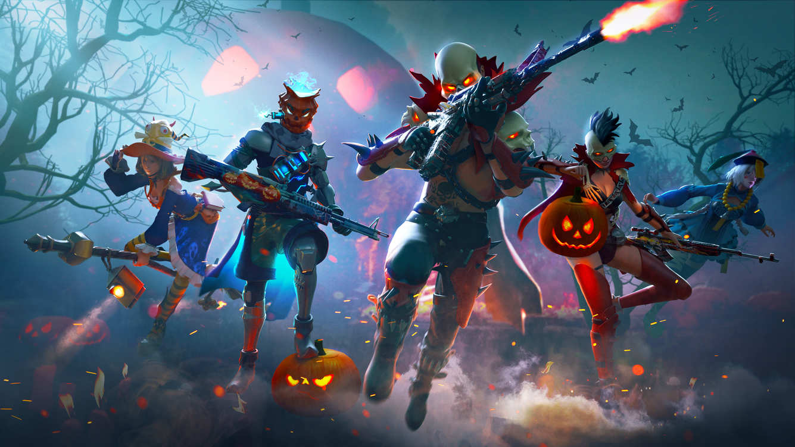
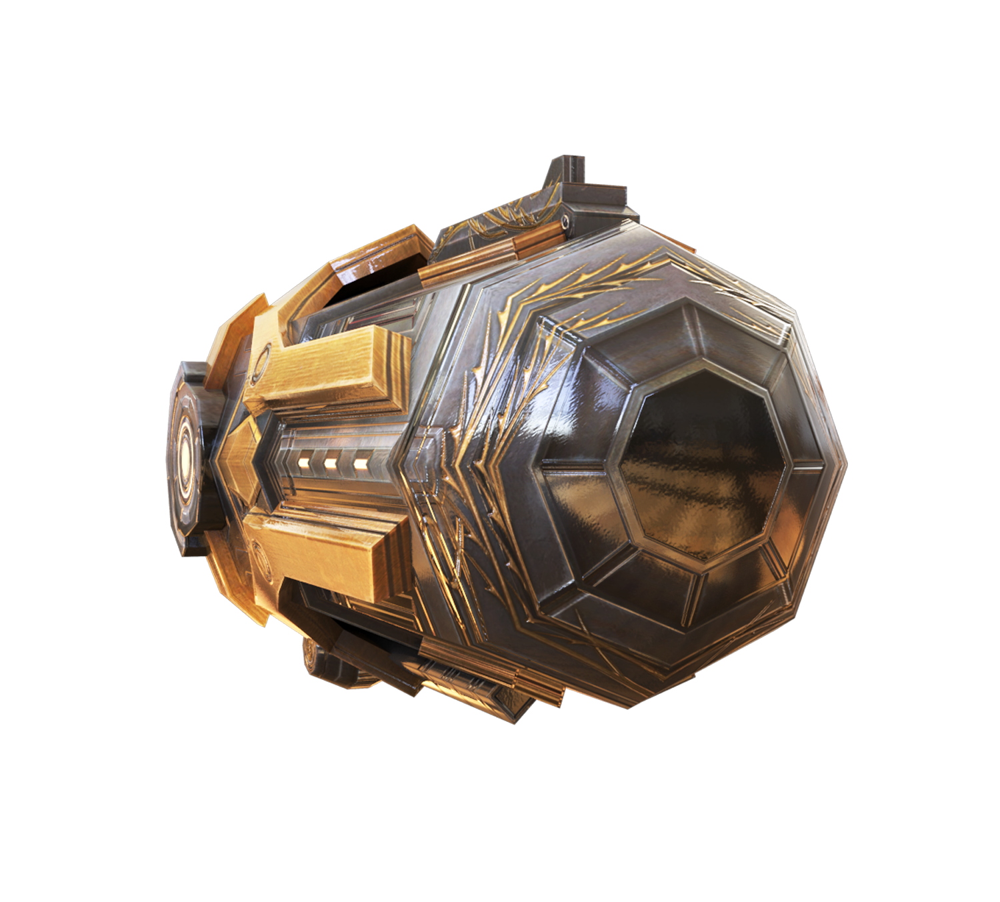
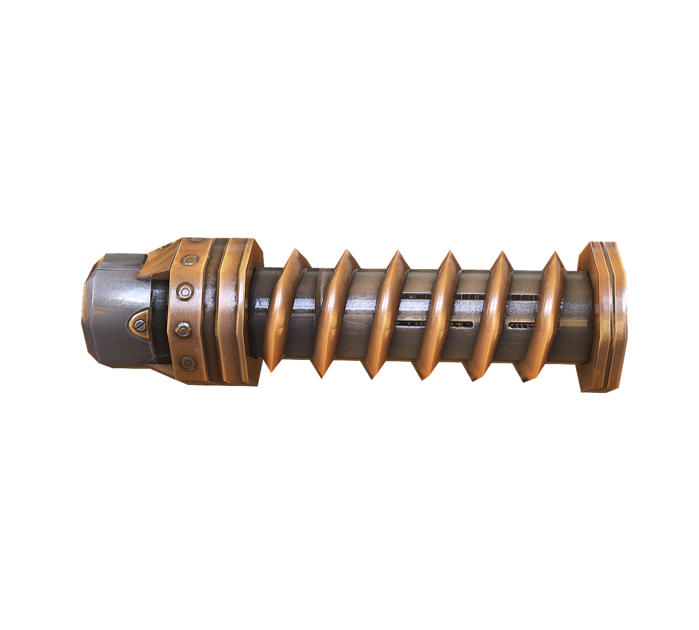
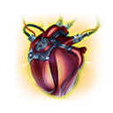
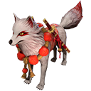
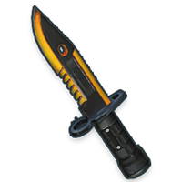

# Free Fire · Spooky Night（2019 年 10 月补丁）

- 公告日期：2019-10-14
- 官方来源：[PATCH NOTE: SPOOKY NIGHT](https://ff.garena.com/en/article/114/)
- 审阅日期：2026-09-19
- 17 个分类小节；40 项说明及表格行；10 张官方公告插图。

本篇 BR、CS 与通用局内更新已按官方正文复核。独立玩法及局外内容另列处置；未公布的日期、范围和单位明确保留信息缺口。

公告日期为 2019-10-14。除本文明确写为 Coming soon 的条目外，正文未给统一生效时间。

Spooky Night 补丁总览角色图。原文：PATCH NOTE: SPOOKY NIGHT。[官方原图](https://cdn.wildflamestudio.com/common/web_event/official/ea3049e6990a853c47599cce0dfa7918f073b0a07a4d.jpg) · 1335×751。

## BR · 大逃杀

### MP5 射速强化配件

- 归属：BR · 大逃杀 / 常规调整
- 原文小节：Advanced Attachments > MP5 - Electrical Booster
- 时间：原文写明 Available in Classic Mode；未单列日期，按公告日索引。

MP5 Electrical Booster 官方图。原文：Advanced Attachments > MP5 - Electrical Booster。[官方原图](https://cdn.wildflamestudio.com/common/web_event/official/ec86d092b8a7Mp5Golden.png) · 1500×1353。

- 经典 BR 新增 MP5 射速强化配件（Electrical Booster，说明性译法）：射速提高 31%。

### M60 持续射击强化配件

- 归属：BR · 大逃杀 / 常规调整
- 原文小节：Advanced Attachments > M60 - Spiral Charger
- 时间：原文写明 Available in Classic Mode；未单列日期，按公告日索引。

M60 Spiral Charger 官方图。原文：Advanced Attachments > M60 - Spiral Charger。[官方原图](https://cdn.wildflamestudio.com/common/web_event/official/d20c2985cfcbm60_golden.png) · 1500×1353。

- 经典 BR 新增 M60 持续射击强化配件（Spiral Charger，说明性译法）：每发伤害增加 2，最多叠加 10 层。
- 该配件每发使精度参数增加 0.015；原文未给换算单位。

### 高峰时刻试用动态天气

- 归属：BR · 大逃杀 / 常规调整
- 原文小节：Gameplay > Dynamic Weather System
- 时间：公告日索引；原文未公布精确生效日。

仅在高峰时刻（Rush Hour）这个 BR 变体中试行，不表示普通 BR 或 CS 同步生效。

- 动态天气系统在高峰时刻（Rush Hour）中试行；正文明确暂时仅适用于该模式，其他模式只是后续意向。

### 经典 BR 的爆炸弩重做

- 归属：BR · 大逃杀 / 常规调整
- 原文小节：Weapon and Balance > Explosive Crossbow
- 时间：原文写明 Available in Classic Mode；未单列日期，按公告日索引。

- 经典 BR 的弩改用可爆炸、造成范围伤害的弩箭，伤害参数为 90。
- 爆炸最大伤害为 100。
- 爆炸半径为 3 米。
- 弩改为副武器。

## CS · 枪王对决

### CS 匹配、地图与回合流程

- 归属：CS · 枪王对决 / 常规调整
- 原文小节：Gameplay > Clash Squad > Matchmaking, gameplay, and UI optimization
- 时间：公告日索引。

- CS 地图移除所有油桶。
- 冻结期允许移动。
- 购买武器后自动补满弹药。
- 每回合开始时额外获得弹药。
- 点击屏幕空白处可关闭商店。
- 比赛开始前不再进入出生岛。

### CS 连败经济、蘑菇与商店枪械

- 归属：CS · 枪王对决 / 常规调整
- 原文小节：Gameplay > Clash Squad > Matchmaking, gameplay, and UI optimization
- 时间：公告日索引。

- 连败队伍获得更多金钱。
- 新增蘑菇：使用后立即提供 EP。
- 商店加入 G18。
- 商店加入 Kar98k。
- 商店加入 AN94。
- 商店加入 CG-15。

## 通用局内调整

### Shani 的护甲耐久技能

- 归属：通用局内调整 / 常规调整
- 原文小节：Characters > New Character - Shani
- 时间：原文写明 Available in Free Fire Store；未单列日期，按公告日索引。

Shani Gear Recycle 技能图标。原文：Characters > New Character - Shani。[官方原图](https://cdn.wildflamestudio.com/common/web_event/official/1debba3826e5ui_icon_skill_JunkEngineer_L.png) · 128×128。

- 新增 Shani；Gear Recycle 在击杀时恢复护甲耐久。
- 护甲耐久超过 100% 时自动升阶，最高至 3 级。

### A124 技能冷却缩短

- 归属：通用局内调整 / 常规调整
- 原文小节：Characters > A124
- 时间：公告日索引。

A124 Thrill of Battle 技能图标。原文：Characters > A124。[官方原图](https://cdn.wildflamestudio.com/common/web_event/official/184e304182ddui_icon_skill_MadeManA_L.png) · 128×128。

- A124 的 Thrill of Battle 冷却按等级由 150/140/130/120/110/100 秒降至 90/80/75/70/65/60 秒。

### Joseph 技能支持冲刺时触发

- 归属：通用局内调整 / 常规调整
- 原文小节：Characters > Joseph
- 时间：公告日索引。

Joseph Nutty Movement 技能图标。原文：Characters > Joseph。[官方原图](https://cdn.wildflamestudio.com/common/web_event/official/b6c609fcfc70ui_icon_skill_Playboy_L.png) · 128×128。

- Joseph 的 Nutty Movement 改为可在冲刺时触发。

### 诱饵手雷的活动分期预告

- 归属：通用局内调整 / 活动覆盖
- 原文小节：Weapon and Balance > Decoy Grenade - NEW!
- 时间：正文为 Coming soon in Spooky Night，仅是预告，未公布具体日期。

正文未明确这两项活动分期对应的匹配入口；不据此认定适用于全部 BR／CS。

Decoy Grenade 官方图标（Spooky Night 预告）。原文：Weapon and Balance > Decoy Grenade - NEW!。[官方原图](https://cdn.wildflamestudio.com/common/web_event/official/bdebdbafb471Icon_weapon_DUMMY.png) · 128×128。

- 预告幽夜活动（Spooky Night，说明性译名）将加入诱饵手雷：诱饵生命值 100。
- 部署后会在地图显示红点，用于诱使敌人向错误方向开火；这是官方描述的用途。

### M1887 双管霰弹枪的活动分期预告

- 归属：通用局内调整 / 活动覆盖
- 原文小节：Weapon and Balance > M1887 - NEW!
- 时间：正文为 Coming soon in Spooky Night，仅是预告，未公布具体日期。

正文未明确这两项活动分期对应的匹配入口；不据此认定适用于全部 BR／CS。

M1887 官方图标（Spooky Night 预告）。原文：Weapon and Balance > M1887 - NEW!。[官方原图](https://cdn.wildflamestudio.com/common/web_event/official/af3579c35d49Icon_slot_M1887.png) · 512×128。

- 预告幽夜活动（Spooky Night）将加入 M1887 双管霰弹枪，伤害参数 170。
- 弹匣容量为 2 发。
- 射速参数 0.45；原文没有给单位。
- 射程参数 35；原文没有给单位。

### 银狐宠物的医疗包恢复加成

- 归属：通用局内调整 / 常规调整
- 原文小节：Other New Features > Silver Fox - New!
- 时间：公告日索引。

Silver Fox 宠物官方图标。原文：Other New Features > Silver Fox - New!。[官方原图](https://cdn.wildflamestudio.com/common/web_event/official/5ada3abfee6cIcon_Pet_Fox.png) · 128×128。

- 新增银狐宠物（Silver Fox，说明性译名）；Well Fed 技能使医疗包恢复生命值增加 4／7／10 点。

### 冰墙破裂特效

- 归属：通用局内调整 / 常规调整
- 原文小节：Other New Features > Gloo wall crack
- 时间：公告日索引。

- 冰墙即将破裂时新增特效。

### 角色语音触发

- 归属：通用局内调整 / 常规调整
- 原文小节：Other New Features > Character Voice System
- 时间：公告日索引。

- 部分角色在特定场合触发各自的语音台词。
- 该语音系统仅支持英语。

### 局内队友事件标记

- 归属：通用局内调整 / 常规调整
- 原文小节：Other New Features > Special In-game Event Marker
- 时间：公告日索引。

- 队友受伤、开火、倒地或点燃篝火时，会在对局中触发特殊标记。

### 局内图形优化

- 归属：通用局内调整 / 常规调整
- 原文小节：Other New Features > Graphics Update
- 时间：公告日索引。

- 优化树木、草地和地面图形。
- 优化天空盒图形。
- 优化海洋图形。
- 优化跳伞期间的图形。

### 击杀信息尺寸选项

- 归属：通用局内调整 / 常规调整
- 原文小节：Other New Features > Kill Feed Adjustment Option
- 时间：公告日索引。

- 可选择缩小局内击杀信息的显示尺寸。

## 其他玩法与局外内容（目录摘要）

### Resource Download Center

按需下载扩展包以节省手机存储空间，属于客户端资源管理。

原文目录：Gameplay > Resource Download Center

### 模式选择页

模式选择局外 UI。

原文目录：Other New Features > New Game Mode Selection Page

### 出生岛舞池与音乐

候机区域的舞池和音乐，未说明改变正式对局规则。

原文目录：Other New Features > Spawn Island Update

### 商店、EP、赛事、分享、抽奖与维护页面

Subscription Store、EP UI、FF CUP、Magic Cube Fragment、Share page、Grand prize、Patch note button、Name Change Card、iPhone menu bar 等为局外账户、商城、页面或赛事功能。

原文目录：Other New Features

### Road to Mastery Bug Fix、Lobby 与设置

Road to Mastery bug fix、New Lobby Background、Players’ Region Now Shows in the Settings Menu 未说明基础局内体验变化。

原文目录：Other New Features

### 冷钢（Cold Steel）的专属投掷刀预告

冷钢是独立玩法。官方预告其投掷刀 FF Knife：伤害参数 9999、最大蓄积次数 3、精度参数 100；未公开补充次数的方法、地图、胜负流程或推出日期。

原文目录：Weapon and Balance > FF Knife - NEW!

### CS 匹配系统

CS 加入 MMR 匹配；属于局外匹配规则。

原文目录：Gameplay > Clash Squad

## 其余原文配图

以下为尚未在上述小节内展示的原文图片，包括局外章节配图。

FF Knife 官方图标（Cold Steel 预告）。原文：Weapon and Balance > FF Knife - NEW!。[官方原图](https://cdn.wildflamestudio.com/common/web_event/official/ff80c1ab55b0Icon_exchange_Flying_knife.png) · 200×200。

## 官方图片索引

正文图片按相关小节展示，版本总览及其他章节插图另列；同一原图只嵌入一次。

- [Spooky Night 补丁总览角色图](https://cdn.wildflamestudio.com/common/web_event/official/ea3049e6990a853c47599cce0dfa7918f073b0a07a4d.jpg) · 1335×751 · 本地 `assets/ff-patches/114-01.jpg`
- [MP5 Electrical Booster 官方图](https://cdn.wildflamestudio.com/common/web_event/official/ec86d092b8a7Mp5Golden.png) · 1500×1353 · 本地 `assets/ff-patches/114-02.png`
- [M60 Spiral Charger 官方图](https://cdn.wildflamestudio.com/common/web_event/official/d20c2985cfcbm60_golden.png) · 1500×1353 · 本地 `assets/ff-patches/114-03.png`
- [Shani Gear Recycle 技能图标](https://cdn.wildflamestudio.com/common/web_event/official/1debba3826e5ui_icon_skill_JunkEngineer_L.png) · 128×128 · 本地 `assets/ff-patches/114-04.png`
- [A124 Thrill of Battle 技能图标](https://cdn.wildflamestudio.com/common/web_event/official/184e304182ddui_icon_skill_MadeManA_L.png) · 128×128 · 本地 `assets/ff-patches/114-05.png`
- [Joseph Nutty Movement 技能图标](https://cdn.wildflamestudio.com/common/web_event/official/b6c609fcfc70ui_icon_skill_Playboy_L.png) · 128×128 · 本地 `assets/ff-patches/114-06.png`
- [FF Knife 官方图标（Cold Steel 预告）](https://cdn.wildflamestudio.com/common/web_event/official/ff80c1ab55b0Icon_exchange_Flying_knife.png) · 200×200 · 本地 `assets/ff-patches/114-07.png`
- [Decoy Grenade 官方图标（Spooky Night 预告）](https://cdn.wildflamestudio.com/common/web_event/official/bdebdbafb471Icon_weapon_DUMMY.png) · 128×128 · 本地 `assets/ff-patches/114-08.png`
- [M1887 官方图标（Spooky Night 预告）](https://cdn.wildflamestudio.com/common/web_event/official/af3579c35d49Icon_slot_M1887.png) · 512×128 · 本地 `assets/ff-patches/114-09.png`
- [Silver Fox 宠物官方图标](https://cdn.wildflamestudio.com/common/web_event/official/5ada3abfee6cIcon_Pet_Fox.png) · 128×128 · 本地 `assets/ff-patches/114-10.png`

## 原文目录（对照用）

- Advanced Attachments
- Gameplay
- Characters
- Weapon and Balance
- Other New Features
