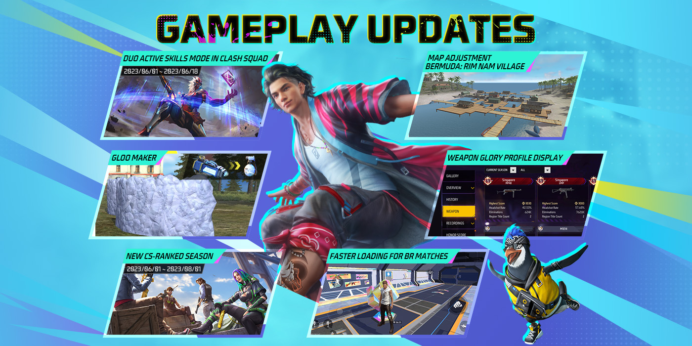
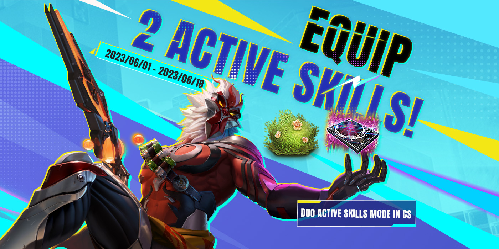
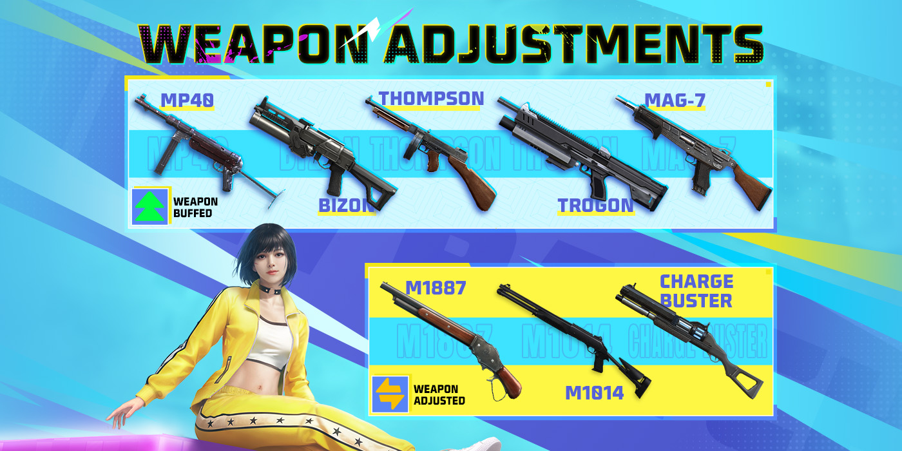
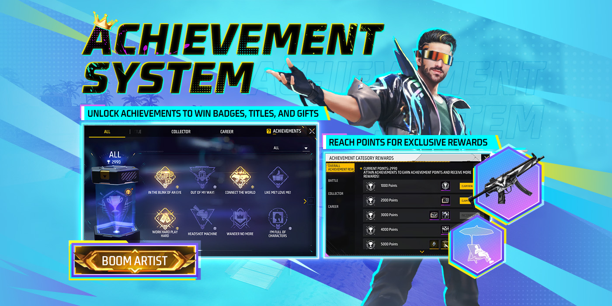

# Free Fire · OB40（2023 年 5 月更新）

- 公告日期：2023-05-30
- 官方来源：[PATCH NOTES](https://ff.garena.com/en/article/1170/)
- 审阅日期：2026-09-19
- 65 个分类小节；103 项说明及表格行；8 张官方公告插图。

逐项复核正文全部局内章节、其他玩法和局外附录；全部8张正文图已逐张查看。修正Luna错误数字、占位摘要、漏项与适用模式。

公告日2023-05-30；CS双主动技能配图明确为2023-06-01至2023-06-18。其余分期活动按小节，未推定同日开放。

本版总览：成就、双主动技能与组队。原文：PATCH NOTES。[官方原图](https://cdn.wildflamestudio.com/common/web_event/official2.ff.garena.all/20235/30882adc0fbf84b95cd54cea1a69f503.png) · 1400×700。

## BR · 大逃杀

### BR：冰墙生成器的获取与升级

- 归属：BR · 大逃杀 / 常规调整
- 原文小节：Battle Royale > Gloo Maker
- 时间：公告日2023-05-30；未另列精确生效时刻。

按原文对应模式记录。

生成器、Rim Nam、BR加载、CS活动与赛季日期。原文：Gameplay Updates。[官方原图](https://cdn.wildflamestudio.com/common/web_event/official2.ff.garena.all/20235/43b69a8f42a410cc7386c49c8eafde50.png) · 1400×700。

- 每名玩家拥有Gloo Maker，开局获得1面Gloo墙，复活后也获得1面。背包设备页显示等级和最大容量，等级也显示在生命条旁。
- 玩家被淘汰后Gloo Maker不会掉落，复活后等级不变。Gloo墙不能再拾取或购买。
- Gloo Maker会周期性提供1面Gloo墙；靠近敌方战利品箱的第一名玩家和淘汰者分别获得Gloo墙；若两者为同一人，则获得全部。
- 升级经验：Gloo Chip直接提升1级，括注400 EXP；每造成2点伤害获得1 EXP，每秒获得1 EXP。一级升二级需求另列300，保留与芯片括注400的区别。
- 芯片可从售货机以400 FF币购买，限1个；另可从空投、军械库、蓝区和战备箱取得。

### BR：冰墙生成器五级参数

- 归属：BR · 大逃杀 / 常规调整
- 原文小节：Battle Royale > Gloo Maker
- 时间：公告日2023-05-30；未另列精确生效时刻。

按原文对应模式记录。

- 1级：最多4面；每100秒生成1面；升级需300 EXP；首个接近敌人战利品箱者得1面，淘汰者得1面。
- 2级：最多5面；每85秒生成1面；升级需400 EXP；首个接近箱者得1面，淘汰者得1面。
- 3级：最多6面；每70秒生成1面；升级需400 EXP；首个接近箱者得1面，淘汰者得1面。
- 4级：最多8面；每65秒生成1面；升级需400 EXP；首个接近箱者得2面，淘汰者得1面。
- 5级：最多10面；每50秒生成1面；首个接近箱者得2面，淘汰者得2面。

### BR：Mr. Waggor提供生成器经验

- 归属：BR · 大逃杀 / 常规调整
- 原文小节：Battle Royale > Gloo Maker / Characters & Pets > Other Skill Adjustments
- 时间：公告日2023-05-30；未另列精确生效时刻。

按原文对应模式记录。

- 对局开始200秒后，给予主人200点冰墙生成器经验。两处正文为同项，仅记录一次。

### BR：超级复活补给

- 归属：BR · 大逃杀 / 常规调整
- 原文小节：Battle Royale > Super Revival Optimization
- 时间：公告日2023-05-30；未另列精确生效时刻。

按原文对应模式记录。

- 超级复活卡复活的队友除UMP、二级头盔和二级护甲外，还获得医疗包和治疗枪。

### BR：Color Cube预热任务

- 归属：BR · 大逃杀 / 活动覆盖
- 原文小节：Battle Royale > In-Match Quest - Color Cube Charge Up
- 时间：仅6th Anniversary Hype Up预热期；本篇未写起止日。

按原文对应模式记录。

- “6周年预热”期间，Color Cube Quest是BR唯一的对局任务；仅部分随机对局出现。与Color Prism互动指定次数后触发事件，Color Spirit在玩家身旁释放技能，技能使用后需休息。
- Color Spirit技能可能为：Alok恢复大量生命值；Homer向最近敌人释放无人机并减速；Clu持续扫描附近敌人；Xayne进入极限状态并获得临时生命值。
- Color Spirit强化这些角色技能，与常规技能存在差异；每局可释放的技能也可能不同，未给具体强化数值或休息时间。

### BR：Bonus Box随机补给

- 归属：BR · 大逃杀 / 活动覆盖
- 原文小节：Battle Royale > Bonus Box
- 时间：仅6周年预热期，未给起止日。

按原文对应模式记录。

- 6周年预热期间，地图分布可交互Bonus Box，互动后获得随机物资。

### BR：Color Cube浮岛返场

- 归属：BR · 大逃杀 / 活动覆盖
- 原文小节：Battle Royale > Color Cube Gameplay
- 时间：6周年正式活动开始后，BR排位及休闲在Color Cube开放期适用；未给起止日。

按原文对应模式记录。

- 6周年正式活动开始后，BR排位和休闲模式出现浮空Color Cube岛。活动期间被淘汰的玩家传送至岛上，在限定时间内移动、淘汰岛上玩家并破坏小方块累积进度；进度条满后获得复活机会并重新跳伞。

### BR：Gloo Melter和Super Med

- 归属：BR · 大逃杀 / 常规调整
- 原文小节：Battle Royale > Other Adjustments
- 时间：公告日2023-05-30；未另列精确生效时刻。

按原文对应模式记录。

- Gloo Melter对冰墙每秒伤害150→230；范围内冰墙不再受到额外的受击伤害增幅；投掷距离+30%。
- 对其他玩家伤害的数值区间10～25→5；英文为damage range，未写距离单位，不将其解读为米数。
- 医疗包轮盘自动切换Super Med的HP阈值50→75。

### BR：地面与军械库物资

- 归属：BR · 大逃杀 / 常规调整
- 原文小节：Battle Royale > Other Adjustments
- 时间：公告日2023-05-30；未另列精确生效时刻。

按原文对应模式记录。

- 增加蘑菇数量，黄色蘑菇不再出现。一级可升级武器掉率略降，分布更分散。
- 移除地图上的Heal Sniper、Heal Laser、冰墙和Bipod；蓝区FF币减少。M24掉率-25%，RGS-50掉率-16%。
- 军械库钥匙分布更随机、分散；军械库冰墙改为1个Gloo Chip。

### BR：战备箱费用与掉落

- 归属：BR · 大逃杀 / 常规调整
- 原文小节：Battle Royale > Other Adjustments
- 时间：公告日2023-05-30；未另列精确生效时刻。

按原文对应模式记录。

- War Chest开启费用300→200 FF币；二、三级箱的Horizaline概率略升；箱子有机会出现Gloo Chip。

### BR：售货机与任务专属售价

- 归属：BR · 大逃杀 / 常规调整
- 原文小节：Battle Royale > Other Adjustments
- 时间：公告日2023-05-30；未另列精确生效时刻。

按原文对应模式记录。

- 吸入器x2由免费限1次改为100 FF币不限次；医疗包x2改为1个Super Med；军火库钥匙600→800 FF币；新增Gloo Chip，400 FF币限购1次。免费物品新增Heal Sniper、Heal Laser、Katana、二级弹匣、Gloo Melter，各限购1次。
- 仅对局任务专属售货机：空投枪400→600 FF币，全局限2；M1887同为400→600 FF币，全局限2。原文未解释多个空投枪种类是否共享该额度。

### BR：安全区等待和收缩

- 归属：BR · 大逃杀 / 常规调整
- 原文小节：Battle Royale > Other Adjustments
- 时间：公告日2023-05-30；未另列精确生效时刻。

按原文对应模式记录。

- 第二圈开始收缩前等待60→40秒；收缩过程140→170秒，即收缩更慢。第三圈开始收缩前等待50→40秒。

### BR：腿部口袋、赏金与补给箱

- 归属：BR · 大逃杀 / 常规调整
- 原文小节：Gameplay > Loadout Adjustments
- 时间：公告日2023-05-30；未另列精确生效时刻。

按原文对应模式记录。

- 腿部口袋：开局获得二级Gloo Maker、三级背包和200额外容量；开局及每次复活时额外获得2面Gloo墙。
- 赏金令：首次淘汰获得400 FF币、随机配件和一把二级可升级武器。
- 补给箱：复活时获得300 FF币、Bizon和60发SMG弹药。
- 秘密线索：地图标记宝箱，内含冰墙芯片、发射台、600 FF币及其他物品；开箱后标记下一箱。

### BR：跳伞前环境与单阶段加载

- 归属：BR · 大逃杀 / 常规调整
- 原文小节：Performance > Battle Royale Overall Loading Time Optimization
- 时间：公告日2023-05-30；未另列精确生效时刻。

按原文对应模式记录。

- 重做跳伞前准备阶段环境美术；BR原两阶段加载合并为单阶段，显著减少进入对局加载时间。

### BR：淘汰信息与物资雷达设置

- 归属：BR · 大逃杀 / 常规调整
- 原文小节：Other Adjustments
- 时间：公告日2023-05-30；未另列精确生效时刻。

按原文对应模式记录。

- BR淘汰信息增加伤害来源、爆头淘汰等内容。
- 设置>辅助中可关闭、开启或定时启用Loot Radar。

## CS · 枪王对决

### CS：限时双主动技能

- 归属：CS · 枪王对决 / 活动覆盖
- 原文小节：Clash Squad > Clash Squad: Duo Active Skills Mode
- 时间：配图明确活动期2023-06-01～2023-06-18；正文称仅该玩法开放期间可在CS排位启用。

按原文对应模式记录。

CS双主动技能：2023-06-01～06-18。原文：Clash Squad。[官方原图](https://cdn.wildflamestudio.com/common/web_event/official2.ff.garena.all/20235/d8dfdf072a6466e968fdfafa1cb0d236.png) · 1400×700。

- 大厅预设的主动/被动技能会保留，预设主动技能默认选中，玩家再选择1个主动技能，也可更换默认技能；可选择所有角色的主动技能，即使尚未解锁。其他规则与普通CS相同。
- CS排位可在黄金I或以上启用；高于黄金I时默认启用；匹配优先寻找同样启用者；该模式下前两场排位失败不扣星。

### CS：商店价格和G36

- 归属：CS · 枪王对决 / 常规调整
- 原文小节：Clash Squad > Clash Squad Store Adjustments
- 时间：公告日2023-05-30；未另列精确生效时刻。

按原文对应模式记录。

- 价格调整：MP40 2000→1900；Groza 1900→1800；P90 1700→1600。新增G36，价格1200 CS Cash。

### CS：加入Rim Nam Village

- 归属：CS · 枪王对决 / 常规调整
- 原文小节：Map > Rim Nam Village Rework
- 时间：公告日2023-05-30；未另列精确生效时刻。

按原文对应模式记录。

- Rim Nam Village加入CS休闲和排位地图。

### CS：Nurek Dam

- 归属：CS · 枪王对决 / 常规调整
- 原文小节：Map > Clash Squad Map Balancing Adjustments > Nurek Dam
- 时间：公告日2023-05-30；未另列精确生效时刻。

按原文对应模式记录。

- 在双方出生点旁的斜置集装箱顶部各增加一个集装箱，防止玩家跳上斜置集装箱。

### CS：Mars Electric

- 归属：CS · 枪王对决 / 常规调整
- 原文小节：Map > Clash Squad Map Balancing Adjustments > Mars Electric
- 时间：公告日2023-05-30；未另列精确生效时刻。

按原文对应模式记录。

- 调整部分集装箱位置，增加各区域交战频率；调整双方出生点，使两队更平衡。
- 移除北侧轮胎和房屋，无法再到达北侧房屋屋顶；移除东侧轮胎，无法跳上当地建筑顶部。

### CS：Cape Town

- 归属：CS · 枪王对决 / 常规调整
- 原文小节：Map > Clash Squad Map Balancing Adjustments > Cape Town
- 时间：公告日2023-05-30；未另列精确生效时刻。

按原文对应模式记录。

- 调整区域房屋布局和朝向，所有房屋屋顶不再可跳上；一栋二层房屋替换为一层房屋。

### CS：空投援助与补给箱

- 归属：CS · 枪王对决 / 常规调整
- 原文小节：Gameplay > Loadout Adjustments
- 时间：公告日2023-05-30；未另列精确生效时刻。

按原文对应模式记录。

- 空投援助：全队在战备使用者搜刮空投后获得300额外CS现金→任意队友搜刮空投后，战备使用者获得300额外CS现金。
- 补给箱各回合额外物品：第1回合Katana；第2回合吸入器x1；第3回合冰冻弹x1；第4回合Gloo墙x1；第5回合升级芯片x1；第6回合篝火x1；第7回合Super Med x1。

### CS：商店信息、准备区标记和房间回合

- 归属：CS · 枪王对决 / 常规调整
- 原文小节：Other Adjustments
- 时间：公告日2023-05-30；未另列精确生效时刻。

按原文对应模式记录。

- 打开CS商店时点击或长按查看武器信息，拖动关闭窗口。
- 准备阶段在出生点红色边界内可标记边界外的位置。
- 自定义房CS加入与排位相同的9999现金回合。

## 通用局内调整

### 角色：Sonia

- 归属：通用局内调整 / 常规调整
- 原文小节：Characters & Pets > Sonia
- 时间：公告日2023-05-30；未另列精确生效时刻。

以原文所列模式为准；通用章节未说明是否覆盖所有独立模式。

Sonia与觉醒Alok。原文：Characters & Pets。[官方原图](https://cdn.wildflamestudio.com/common/web_event/official2.ff.garena.all/20235/5b22934ec60ed5ae3ed5635e45bd0de8.png) · 1400×700。

- 纳米生命护盾：受到致命伤害后进入0.5秒无敌且无法移动状态，随后获得150点护盾，持续3秒。护盾存在期间若击倒敌人，恢复等同于护盾数值的生命；否则角色会被淘汰。冷却180秒。

### 角色：Alok

- 归属：通用局内调整 / 常规调整
- 原文小节：Characters & Pets > Alok
- 时间：公告日2023-05-30；未另列精确生效时刻。

以原文所列模式为准；通用章节未说明是否覆盖所有独立模式。

- 原技能“节拍律动”：生成5米光环，移动速度+15%，每秒恢复3点生命，持续10秒，冷却45秒。 效果不可叠加。
- 觉醒技能“派对混音”：光环持续期间，每2秒在角色身后2米处掉落持续5秒的音符；队友拾取后每秒恢复3点生命，持续10秒。

### 角色：Dimitri

- 归属：通用局内调整 / 常规调整
- 原文小节：Characters & Pets > Dimitri
- 时间：公告日2023-05-30；未另列精确生效时刻。

以原文所列模式为准；通用章节未说明是否覆盖所有独立模式。

Dimitri、Thiva、Kapella、Olivia技能重做。原文：Characters & Pets。[官方原图](https://cdn.wildflamestudio.com/common/web_event/official2.ff.garena.all/20235/23f3259a87ec5f9dbb2b167867d1b9c7.png) · 1400×700。

- “治愈心跳”：生成半径3.5米治疗区，区域内自己和队友每秒恢复10点生命；需要时倒地队友自动开始自救。区域持续12秒，冷却60秒。 扶起队友的效果可被其他技能增强。

### 角色：Thiva

- 归属：通用局内调整 / 常规调整
- 原文小节：Characters & Pets > Thiva
- 时间：公告日2023-05-30；未另列精确生效时刻。

以原文所列模式为准；通用章节未说明是否覆盖所有独立模式。

- “生命节奏”：扶起队友速度提高70%，冷却60秒；成功扶起的队友在3秒内恢复100点生命。 说明段明确每次成功扶起均可回复队友生命，不将回复限制为加速技能冷却结束后。

### 角色：Kapella

- 归属：通用局内调整 / 常规调整
- 原文小节：Characters & Pets > Kapella
- 时间：公告日2023-05-30；未另列精确生效时刻。

以原文所列模式为准；通用章节未说明是否覆盖所有独立模式。

- “治愈之歌”：扶起队友时给予80点护盾和10%移动速度；成功扶起后增益在4秒后降低；倒地队友流血速度降低35%；效果不可叠加。

### 角色：Olivia

- 归属：通用局内调整 / 常规调整
- 原文小节：Characters & Pets > Olivia
- 时间：公告日2023-05-30；未另列精确生效时刻。

以原文所列模式为准；通用章节未说明是否覆盖所有独立模式。

- “治愈之触”：将单体治疗效果的80%分享给10米范围内队友。

### 角色：Tatsuya

- 归属：通用局内调整 / 常规调整
- 原文小节：Characters & Pets > Tatsuya
- 时间：公告日2023-05-30；未另列精确生效时刻。

以原文所列模式为准；通用章节未说明是否覆盖所有独立模式。

- “疾行冲刺”：以高速向前冲刺0.3秒；可储存次数2→3次，单次使用间冷却5→1秒，补充时间60→45秒。

### 角色：Clu

- 归属：通用局内调整 / 常规调整
- 原文小节：Characters & Pets > Clu
- 时间：公告日2023-05-30；未另列精确生效时刻。

以原文所列模式为准；通用章节未说明是否覆盖所有独立模式。

- “追踪步伐”：定位65米内非趴下或蹲下敌人，持续10秒，并与队友共享位置；冷却50→45秒。
- 被Tracing Steps扫描者的小地图和屏幕中央会显示提示。

### 角色：Homer

- 归属：通用局内调整 / 常规调整
- 原文小节：Characters & Pets > Homer
- 时间：公告日2023-05-30；未另列精确生效时刻。

以原文所列模式为准；通用章节未说明是否覆盖所有独立模式。

- “感知冲击波”：向前方100米内最近敌人释放无人机，脉冲爆炸直径5→3米，使移动速度降低60%、射速降低35%，持续5秒，造成25伤害；冷却90秒。
- Senses Shockwave现在可以触发Moco的Hacker’s Eye标记。

### 角色：Skyler

- 归属：通用局内调整 / 常规调整
- 原文小节：Characters & Pets > Skyler
- 时间：公告日2023-05-30；未另列精确生效时刻。

以原文所列模式为准；通用章节未说明是否覆盖所有独立模式。

- “潮汐节奏”：向前释放100米声波，爆炸并在半径3.5→4米内对Gloo墙造成伤害，持续4→5秒；冷却50→45秒。

### 角色：K

- 归属：通用局内调整 / 常规调整
- 原文小节：Characters & Pets > K
- 时间：公告日2023-05-30；未另列精确生效时刻。

以原文所列模式为准；通用章节未说明是否覆盖所有独立模式。

- “全能大师”：最大EP增量+20→+50。柔术模式：6米内队友EP转化率提高600%。心理学模式：每2秒恢复3EP，最多250EP。模式切换冷却3→6秒。

### 角色：Iris

- 归属：通用局内调整 / 常规调整
- 原文小节：Characters & Pets > Iris
- 时间：公告日2023-05-30；未另列精确生效时刻。

以原文所列模式为准；通用章节未说明是否覆盖所有独立模式。

- “墙体斗士”：15秒内射击Gloo墙可标记其7米内敌人，并穿透Gloo墙对标记敌人造成伤害（低于通常伤害）；有效Gloo墙数量5→3面，冷却60秒。

### 角色：Hayato

- 归属：通用局内调整 / 常规调整
- 原文小节：Characters & Pets > Hayato
- 时间：公告日2023-05-30；未另列精确生效时刻。

以原文所列模式为准；通用章节未说明是否覆盖所有独立模式。

- “武士道”：最大生命值每降低10→13%，护甲穿透提高5%。

### 角色：Andrew

- 归属：通用局内调整 / 常规调整
- 原文小节：Characters & Pets > Andrew
- 时间：公告日2023-05-30；未另列精确生效时刻。

以原文所列模式为准；通用章节未说明是否覆盖所有独立模式。

- “护甲专家”：护甲耐久损失降低20→25%。

### 角色：Andrew the Fierce

- 归属：通用局内调整 / 常规调整
- 原文小节：Characters & Pets > Andrew the Fierce
- 时间：公告日2023-05-30；未另列精确生效时刻。

以原文所列模式为准；通用章节未说明是否覆盖所有独立模式。

- “狼群”：觉醒后护甲伤害减免11→20%；每名携带该技能的队友额外伤害减免15→10%。

### 角色：Rafael

- 归属：通用局内调整 / 常规调整
- 原文小节：Characters & Pets > Rafael
- 时间：公告日2023-05-30；未另列精确生效时刻。

以原文所列模式为准；通用章节未说明是否覆盖所有独立模式。

- Dead Silent：使用狙击枪和精确射手步枪时消音；被使用者击倒的敌人流血加速比例90%→85%。原文未给固定淘汰秒数。

### 武器：XM8

- 归属：通用局内调整 / 常规调整
- 原文小节：Weapon and Balance > Weapon Balance Adjustments
- 时间：公告日2023-05-30；未另列精确生效时刻。

以原文所列模式为准；通用章节未说明是否覆盖所有独立模式。

- 精准度提高15%

### 武器：Thompson

- 归属：通用局内调整 / 常规调整
- 原文小节：Weapon and Balance > Weapon Balance Adjustments
- 时间：公告日2023-05-30；未另列精确生效时刻。

以原文所列模式为准；通用章节未说明是否覆盖所有独立模式。

SMG、霰弹枪等武器调整。原文：Weapon and Balance。[官方原图](https://cdn.wildflamestudio.com/common/web_event/official2.ff.garena.all/20235/8db821edb6d7a6a5ec9eca062e01edad.png) · 1400×700。

- 伤害提高4%

### 武器：MP40

- 归属：通用局内调整 / 常规调整
- 原文小节：Weapon and Balance > Weapon Balance Adjustments
- 时间：公告日2023-05-30；未另列精确生效时刻。

以原文所列模式为准；通用章节未说明是否覆盖所有独立模式。

- 伤害提高8%

### 武器：Bizon

- 归属：通用局内调整 / 常规调整
- 原文小节：Weapon and Balance > Weapon Balance Adjustments
- 时间：公告日2023-05-30；未另列精确生效时刻。

以原文所列模式为准；通用章节未说明是否覆盖所有独立模式。

- 伤害提高10%，并优化操作易用性

### 武器：M1887

- 归属：通用局内调整 / 常规调整
- 原文小节：Weapon and Balance > Weapon Balance Adjustments
- 时间：公告日2023-05-30；未另列精确生效时刻。

以原文所列模式为准；通用章节未说明是否覆盖所有独立模式。

- 射程降低15%，换弹速度提高10%

### 武器：M1014-I/II/III

- 归属：通用局内调整 / 常规调整
- 原文小节：Weapon and Balance > Weapon Balance Adjustments
- 时间：公告日2023-05-30；未另列精确生效时刻。

以原文所列模式为准；通用章节未说明是否覆盖所有独立模式。

- 射程降低12%，精准度提高20%，三个等级均适用

### 武器：Charge Buster

- 归属：通用局内调整 / 常规调整
- 原文小节：Weapon and Balance > Weapon Balance Adjustments
- 时间：公告日2023-05-30；未另列精确生效时刻。

以原文所列模式为准；通用章节未说明是否覆盖所有独立模式。

- 射程降低20%，弹匣容量+1

### 武器：Trogon

- 归属：通用局内调整 / 常规调整
- 原文小节：Weapon and Balance > Weapon Balance Adjustments
- 时间：公告日2023-05-30；未另列精确生效时刻。

以原文所列模式为准；通用章节未说明是否覆盖所有独立模式。

- 优化操作易用性

### 武器：MAG-7

- 归属：通用局内调整 / 常规调整
- 原文小节：Weapon and Balance > Weapon Balance Adjustments
- 时间：公告日2023-05-30；未另列精确生效时刻。

以原文所列模式为准；通用章节未说明是否覆盖所有独立模式。

- 优化操作易用性

### 武器：M1917

- 归属：通用局内调整 / 常规调整
- 原文小节：Weapon and Balance > Weapon Balance Adjustments
- 时间：公告日2023-05-30；未另列精确生效时刻。

以原文所列模式为准；通用章节未说明是否覆盖所有独立模式。

- 伤害降低13%，射速提高6%

### 配件：Marksman Grip

- 归属：通用局内调整 / 常规调整
- 原文小节：Weapon and Balance > Weapon Balance Adjustments
- 时间：公告日2023-05-30；未另列精确生效时刻。

以原文所列模式为准；通用章节未说明是否覆盖所有独立模式。

- 在原有基础上射速降低3%

### 投掷物：手雷

- 归属：通用局内调整 / 常规调整
- 原文小节：Weapon and Balance > Weapon Balance Adjustments
- 时间：公告日2023-05-30；未另列精确生效时刻。

以原文所列模式为准；通用章节未说明是否覆盖所有独立模式。

- 爆炸范围降低10%

### 觉醒Alvaro：分裂手雷

- 归属：通用局内调整 / 常规调整
- 原文小节：Characters & Pets > Other Skill Adjustments
- 时间：公告日2023-05-30；未另列精确生效时刻。

以原文所列模式为准；通用章节未说明是否覆盖所有独立模式。

- Split Blitz：爆炸前1秒产生3枚额外手雷，每枚伤害为原手雷的30%→20%。

### Falco：跳伞技能提示

- 归属：通用局内调整 / 常规调整
- 原文小节：Characters & Pets > Other Skill Adjustments
- 时间：公告日2023-05-30；未另列精确生效时刻。

以原文所列模式为准；通用章节未说明是否覆盖所有独立模式。

- 任一队友装备Skyline Spree时，离机按钮显示提示。

### Bermuda：Rim Nam Village布局重做

- 归属：通用局内调整 / 常规调整
- 原文小节：Map > Rim Nam Village Rework
- 时间：公告日2023-05-30；未另列精确生效时刻。

以原文所列模式为准；通用章节未说明是否覆盖所有独立模式。

- 调整布局，增加掩体并明确通行路线；未给具体掩体数量或坐标。

### 背包归类、堆叠与自动拾取

- 归属：通用局内调整 / 常规调整
- 原文小节：Gameplay > Backpack Management and Looting Optimization
- 时间：公告日2023-05-30；未另列精确生效时刻。

以原文所列模式为准；通用章节未说明是否覆盖所有独立模式。

- 打开背包时，治疗用品、弹药和投掷物等同类物品自动归类。
- 背包右上整理按钮改为堆叠按钮，将同类治疗品、弹药和投掷物合并显示。
- 堆叠物品的丢弃方式改为右侧滑条，可顺畅选择数量；新增“丢弃无用物”按钮，一键清理不需要的物品。
- 拾取列表中同类物品堆叠显示，但单次拾取数量仍按设定值；超出背包剩余容量时，可按可用空间选择自动或手动拾取。
- 高级配件自动拾取对象包括消音器、冲锋枪枪口、步枪弹匣、射手握把、霰弹枪枪托和狙击枪枪托。

### BR/CS：篝火回复

- 归属：通用局内调整 / 常规调整
- 原文小节：Gameplay > Loadout Adjustments
- 时间：公告日2023-05-30；未另列精确生效时刻。

以原文所列模式为准；通用章节未说明是否覆盖所有独立模式。

- 篝火效果由每秒10生命值和10EP改为每秒5生命值和20EP，持续10秒，数量为2。

### 自动瞄准站立目标

- 归属：通用局内调整 / 常规调整
- 原文小节：Gameplay > Auto-Aim on Knocked-Down Enemies Adjustments
- 时间：公告日2023-05-30；未另列精确生效时刻。

以原文所列模式为准；通用章节未说明是否覆盖所有独立模式。

- 同时接近站立和倒地敌人时，更容易瞄准站立敌人。

### 浅水移动和倒地判定

- 归属：通用局内调整 / 常规调整
- 原文小节：Gameplay > Shallow Water Area Optimization
- 时间：公告日2023-05-30；未另列精确生效时刻。

以原文所列模式为准；通用章节未说明是否覆盖所有独立模式。

- 浅水区域不再降低移动速度；修复玩家倒地后被立即淘汰的问题。

### 危险区淘汰归属

- 归属：通用局内调整 / 常规调整
- 原文小节：Gameplay > Danger Zone Elimination Rule Optimization
- 时间：公告日2023-05-30；未另列精确生效时刻。

以原文所列模式为准；通用章节未说明是否覆盖所有独立模式。

- 若玩家在受到其他玩家伤害后8秒内被危险区淘汰，淘汰归属记给最后造成伤害的玩家。

### 自定义局内快捷消息

- 归属：通用局内调整 / 常规调整
- 原文小节：System > Custom Quick Messages
- 时间：公告日2023-05-30；未另列精确生效时刻。

以原文所列模式为准；通用章节未说明是否覆盖所有独立模式。

快捷消息、组队提醒与大厅。原文：System。[官方原图](https://cdn.wildflamestudio.com/common/web_event/official2.ff.garena.all/20235/49ccf330bc2f33c9c3db8f96eaa5c186.png) · 1400×700。

- 可从50多条快捷消息中选择，入口为预设或设置页；消息可设成列表或轮盘，支持男声/女声切换。

### 语音质量、加载与后台

- 归属：通用局内调整 / 常规调整
- 原文小节：System > Voice Chat Experience Optimization
- 时间：公告日2023-05-30；未另列精确生效时刻。

以原文所列模式为准；通用章节未说明是否覆盖所有独立模式。

- 高延迟时优化语音质量；进入加载过程不再中断语音；设置中可启用设备后台保持Free Fire语音。

### 排位地图池：Kalahari回归

- 归属：通用局内调整 / 常规调整
- 原文小节：Rank > Map Pool Adjustments
- 时间：公告日2023-05-30；未另列精确生效时刻。

以原文所列模式为准；通用章节未说明是否覆盖所有独立模式。

- 排位地图池更新：Alpine暂时退出，Kalahari回归；列表为Bermuda、NeXTerra、Kalahari。

### 封禁作弊者即时移出对局

- 归属：通用局内调整 / 常规调整
- 原文小节：Game Environment > Cheaters Will Be Immediately Kicked Out of the Match
- 时间：公告日2023-05-30；未另列精确生效时刻。

以原文所列模式为准；通用章节未说明是否覆盖所有独立模式。

- 系统检测并封禁作弊者后，会立即将其踢出对局，加快处置。

### 双网络自动切换

- 归属：通用局内调整 / 常规调整
- 原文小节：Performance > Duo Network Connection
- 时间：公告日2023-05-30；未另列精确生效时刻。

以原文所列模式为准；通用章节未说明是否覆盖所有独立模式。

- 设置启用双网络连接后，对局中自动选择最佳网络；启用会消耗流量。

### 提示、宠物、标记与趴姿射击

- 归属：通用局内调整 / 常规调整
- 原文小节：Other Adjustments
- 时间：公告日2023-05-30；未另列精确生效时刻。

以原文所列模式为准；通用章节未说明是否覆盖所有独立模式。

- 空投指示更醒目，减少玩家被空投淘汰。
- 服务器断线重连后显示浮动通知，告知当前网络连接。
- 宠物默认在对局中隐藏；可在宠物页面重新启用。
- 跳伞和乘车时可以发送标记。
- 标记详情不再因点击标记而展开；标记和快捷消息连续频繁使用时冷却逐步增加。
- 治疗狙击枪、治疗手枪、治疗激光枪和射手前握把更名为Heal Sniper、Heal Pistol、Heal Laser、Marksman Grip。
- 优化趴下且面向掩体时的开火检测。
- 调高画质时增加风险提示。

## 其他玩法与局外内容（目录摘要）

### 成就与称号

新增成就系统，入口在大厅左下菜单。成就分战斗、收藏、生涯三类；普通成就有3个阶段，完成阶段获得徽章、成就点及可能的奖励。部分彩蛋成就获得前不显示。收藏和生涯读取账号历史，战斗成就从系统上线起计数。标题作为阶段奖励，分稀有、史诗、神话三档，可在个人资料装备并在组队后、角色轮盘显示。 累积总成就点可获得相应奖励。称号在个人资料装备/切换并可预览未解锁项；已装备称号会出现在资料页、入队后角色上方一段时间，也可从大厅点击角色的轮盘选择展示。

原文目录：New System: Achievement

### 角色默认服饰

已拥有及未来获得的角色默认穿专属服饰；没有穿其他服饰时显示。已取得的专属服饰保留在仓库，穿上/脱下不再改变该角色外观；部分服饰需下载。Caroline因设计问题延至下个补丁，当前仍为基础服饰。

原文目录：Characters & Pets > Character Special Outfit By Default

### 大厅重排

好友列表常驻，可看状态、邀请、请求入队和预约好友；商业广告集中到Diamond Events。重排商店、Luck Royale、Booyah Pass、任务、活动、仓库、武器、角色入口；榜单、成就、电竞中心移到左下菜单。新增模式推荐横幅直达模式；组队时Teamcode与Skills合并为Team按钮。

原文目录：System > Lobby Redesign

### 补丁快讯

活动页常驻入口展示当前补丁重点，按钮可查看详情或直接体验；提供历史补丁。

原文目录：System > Patch Express

### 队伍提醒、状态与邀请

队长可提醒未准备成员；全员准备后成员可提醒队长匹配，按钮闪烁并震动。浏览其他页面时，浮窗实时显示队伍人数/准备状态，位置可自定；全员准备发亮，否则灰色，支持提醒。邀请列表默认紧凑显示头像、昵称、在线状态，展开显示好友排名；调整Teamcode位置。

原文目录：System > Team Reminder / Team Status Window / Invitation List Optimization

### 武器荣耀展示

资料页新增Weapon区；BR出生岛展示完整Weapon Glory Title。属于称号展示，不改变战斗属性。

原文目录：System > Weapon Glory Leaderboard Optimization

### 排位遇作弊补偿

排位中被作弊者淘汰后，Solo排位玩家在作弊者受处罚后获得对应BR或CS排位分补偿，并通过游戏内邮件通知。

原文目录：Game Environment > Compensation for Cheater Encounters in Ranked Matches

### 其他局外与独狼规则

移除Friendship Network及休闲/Arena榜单；Android新增游戏内录屏；调整组队角色站位；缩短大厅进入其他核心界面的响应时间。独狼商店改为与其排位商店一致。

原文目录：Other Adjustments

### CS赛季日期（配图）

第7张正文图另列新CS排位赛季：2023-06-01～2023-08-01；不与双主动技能活动2023-06-01～06-18混用。

原文目录：Gameplay Updates（正文配图）

### Spider-Verse Parkour

联动于2023-06-09开始，未给结束日。从模式页进入，选择蜘蛛侠服装，在电影场景启发的高楼之间发射蛛丝摆荡；跑酷竞赛可用蛛丝减速对手；收集地图活动代币兑换奖励。

原文目录：Craftland > "Spider-Verse" Parkour

### Color Hide & Seek

预告7月开放，未给具体日。躲藏者正面方向锁定时仍可自由观察；搜寻者新增扫描定位；记录累计分数与计分板；新增游乐园地图。

原文目录：Craftland > Color Hide & Seek

### Color Spray

周年玩法，未给精确日。开局按队伍颜色穿服饰、持喷漆枪；给方块着色，对方可覆盖；喷枪也可淘汰对手，各队可释放不同技能；占色方块最多队伍胜。

原文目录：Craftland > Color Spray

### Mystery Town

随机分配Sheriff、Assassin、Civilian，三角色两阵营。警长找出刺客、保护平民；平民存活并协助；刺客识别同伴、淘汰其他人。收集金币解锁武器和技能，地图含营地与植物博物馆。警长淘汰会掉武器，平民可拾取继任；警长误杀平民时两者同死。

原文目录：Craftland > Mystery Town

### Fort Feud

预告夏季，未给精确日。4队、每队2人；建造空中基地，从军械库选武器、商店买全队增益；铺路至敌方区域摧毁炮塔。跌落天空会淘汰，可用Revival Tokens返场。

原文目录：Craftland > Fort Feud

### Craftland代币与其他优化

地图中收集专属代币，在商店兑换；有效期较长但未给截止日。喜爱地图更新显示NEW；周年开始后部分地图支持Cutie Kelly贴纸；限时从大厅直达新地图；房间人数容量提高，未给数值。

原文目录：Craftland > Craftland Token / Other Optimizations

## 其余原文配图

以下为尚未在上述小节内展示的原文图片，包括局外章节配图。

成就系统、称号与积分奖励。原文：New System: Achievement。[官方原图](https://cdn.wildflamestudio.com/common/web_event/official2.ff.garena.all/20235/3b81931e26ee3685c7c9b5ec17274363.jpg) · 1400×700。

## 官方图片索引

正文图片按相关小节展示，版本总览及其他章节插图另列；同一原图只嵌入一次。

- [本版总览：成就、双主动技能与组队](https://cdn.wildflamestudio.com/common/web_event/official2.ff.garena.all/20235/30882adc0fbf84b95cd54cea1a69f503.png) · 1400×700 · 本地 `assets/ff-patches/1170-01.png`
- [成就系统、称号与积分奖励](https://cdn.wildflamestudio.com/common/web_event/official2.ff.garena.all/20235/3b81931e26ee3685c7c9b5ec17274363.jpg) · 1400×700 · 本地 `assets/ff-patches/1170-02.jpg`
- [CS双主动技能：2023-06-01～06-18](https://cdn.wildflamestudio.com/common/web_event/official2.ff.garena.all/20235/d8dfdf072a6466e968fdfafa1cb0d236.png) · 1400×700 · 本地 `assets/ff-patches/1170-03.png`
- [SMG、霰弹枪等武器调整](https://cdn.wildflamestudio.com/common/web_event/official2.ff.garena.all/20235/8db821edb6d7a6a5ec9eca062e01edad.png) · 1400×700 · 本地 `assets/ff-patches/1170-04.png`
- [Sonia与觉醒Alok](https://cdn.wildflamestudio.com/common/web_event/official2.ff.garena.all/20235/5b22934ec60ed5ae3ed5635e45bd0de8.png) · 1400×700 · 本地 `assets/ff-patches/1170-05.png`
- [Dimitri、Thiva、Kapella、Olivia技能重做](https://cdn.wildflamestudio.com/common/web_event/official2.ff.garena.all/20235/23f3259a87ec5f9dbb2b167867d1b9c7.png) · 1400×700 · 本地 `assets/ff-patches/1170-06.png`
- [生成器、Rim Nam、BR加载、CS活动与赛季日期](https://cdn.wildflamestudio.com/common/web_event/official2.ff.garena.all/20235/43b69a8f42a410cc7386c49c8eafde50.png) · 1400×700 · 本地 `assets/ff-patches/1170-07.png`
- [快捷消息、组队提醒与大厅](https://cdn.wildflamestudio.com/common/web_event/official2.ff.garena.all/20235/49ccf330bc2f33c9c3db8f96eaa5c186.png) · 1400×700 · 本地 `assets/ff-patches/1170-08.png`

## 版本关联来源

### [官方关联公告](https://ff.garena.com/vn/article/1167/)

官方OB40维护预告，用于编号对应；地区维护日期不替代本篇发布日期。

### [Gloo Maker开发预告](https://ff.garena.com/en/article/1144/)

2023-05-25
5月25日预告，具体等级和数值见1170。

- BR开局每人获得Gloo Maker，周期生成冰墙，替代从地面搜集冰墙；通过造成伤害或获取Gloo Chip累积经验升级。
- 官方解释其目标是减少初期冰墙获取随机性和终盘储备差距；升级速度、生成速度、淘汰后获取数量及提示还会持续观察调整，未给新数值。

### [霰弹枪与冲锋枪平衡开发说明](https://ff.garena.com/en/article/1145/)

2023-05-24
本篇5月24日称新版本已调整，1170在5月30日发布；数值有一处差异，分别保留。

- M1887射程-15%、换弹速度+10%；Charge Buster射程-15%、弹匣+1。本篇-15%与1170的-20%不一致，不能静默合并或猜测何时改值。
- M1014-I/II/III射程-12%、精准度+20%；Trogon与MAG-7改善精准度但本篇未列幅度。
- MP40伤害+8%；Bizon伤害+10%并改善易用性；Thompson伤害+4%。目标是让霰弹枪偏超近距离、SMG偏中近距离；未来拟调整部分步枪射程，未给参数。

## 原文目录（对照用）

- New System: Achievement
- Achievement System
- Achievement Titles
- Clash Squad
- Clash Squad: Duo Active Skills Mode
- Clash Squad Store Adjustments
- Battle Royale
- Gloo Maker
- Super Revival Optimization
- In-Match Quest - Color Cube Charge Up
- Bonus Box
- Color Cube Gameplay
- Other Adjustments
- Weapon and Balance
- Weapon Balance Adjustments
- Rifle Adjustments:
- SMG Adjustments:
- Shotgun Adjustments:
- Pistol Adjustments:
- Others:
- Characters & Pets
- New Character
- Sonia
- Awakened Character
- Character Reworks
- Dimitri
- Thiva
- Kapella
- Olivia
- Character Balance Adjustments
- Active Skills:
- Passive Skills:
- Other Skill Adjustments:
- Character Special Outfit By Default
- Map
- Bermuda Adjustments
- Rim Nam Village Rework
- Clash Squad Map Balancing Adjustments
- Nurek Dam
- Mars Electric
- Cape Town
- Gameplay
- Backpack Management and Looting Optimization
- Backpack Management:
- Looting:
- Loadout Adjustments
- Auto-Aim on Knocked-Down Enemies Adjustments
- Shallow Water Area Optimization
- Danger Zone Elimination Rule Optimization
- System
- Rank
- Game Environment
- Compensation for Cheater Encounters in Ranked Matches
- Cheaters Will Be Immediately Kicked Out of the Match
- Performance
- Other Adjustments
- Craftland
