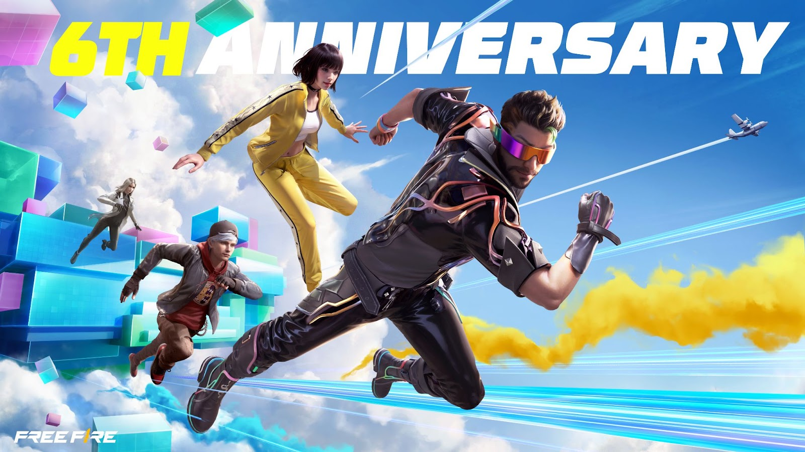
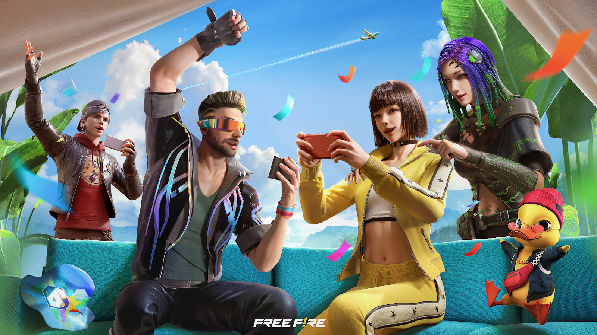
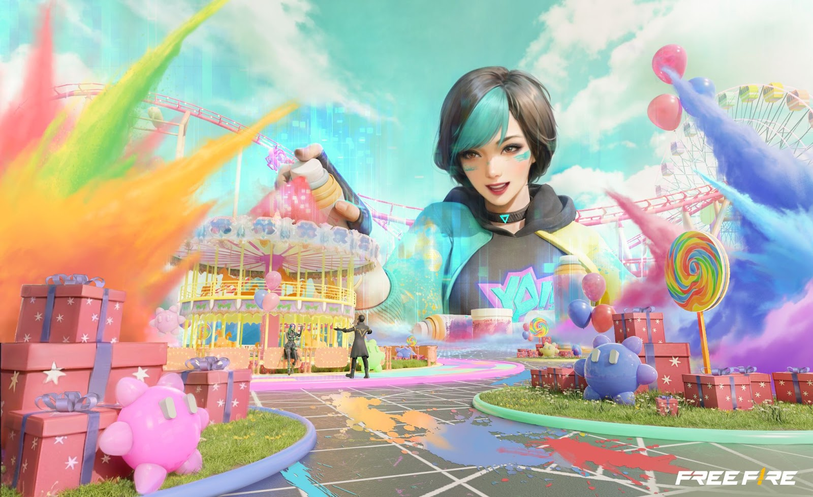
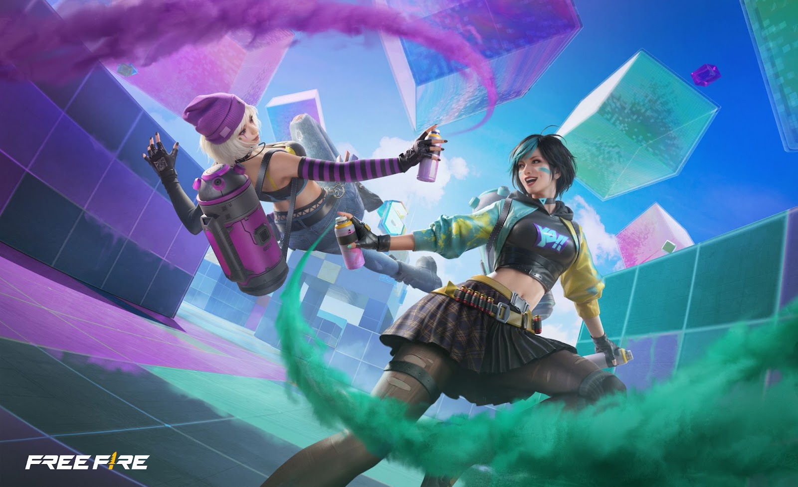

# Free Fire · 2023年6周年Color Cube活动预告

- 公告日期：2023-06-28
- 官方来源：[Free Fire 6th Anniversary: Celebrate With Awakened Alok](https://ff.garena.com/en/article/1195/)
- 审阅日期：2026-09-19
- 1 个分类小节；2 项说明及表格行；4 张官方公告插图。

主流程通读正文并逐项复核；公告日期与活动日期分开，所有正文图归档展示。未在原文核实的OB号不推算。

公告日2023-06-28；各项实际状态及活动期限见小节。

6周年Alok主题图。原文：Free Fire 6th Anniversary: Celebrate With Awakened Alok。[官方原图](https://lh3.googleusercontent.com/Op2x5kmqLvp8Rm-WtS2Sqth5WVGDoe4Oqs_oEVHQ_z7Z3zurBTMQlUkQoiNLSJz2TYM2nR0XOPBye_3-W2Bn0Zk575HK9HZiQ0SpHKvUp3iBaDJbM3NbB9UvYy0hNRE-BaJqf647LbXdI9Aq1_VwlC8) · 1600×900。

Alok与队友周年主题图。原文：Free Fire 6th Anniversary: Celebrate With Awakened Alok。[官方原图](https://lh5.googleusercontent.com/dG6yuH3fKHKvAWRpUxlUJFPkXmZ6Trr_bP2pepD-6bzjWdMObNJ1cD0n97Bb3GqgsI3_hLRp5TO57laaEFC6FK4VgE06vHf84aOJZMcyxIepRCRnBHqoK5qpiRqW2ZDM6u3b7Lk3oHQIzmUPdYhQwQo) · 1600×900。

Color Playground派对主题图。原文：Free Fire 6th Anniversary: Celebrate With Awakened Alok。[官方原图](https://lh4.googleusercontent.com/5wZVUz2AUCAm3BMH75DpZPq_O12aa4LpWil0U4w8bCVmzSYDp5L5l1bo-EMPwtKjn1lOW_XwziAtxlV_KdyEYLp_FGQX_TWWtY75zxiUtVUIX-rS7xoQwjGhY1xHiRFgBy4n6xhBXlA90i3Rc5ETdDc) · 1600×978。

## BR · 大逃杀

### Color Cube浮岛与首次淘汰返场

- 归属：BR · 大逃杀 / 活动覆盖
- 原文小节：Celebrate with Color Playground party games, anniversary souvenirs, and more > Color Cube
- 时间：6月28日预告；周年庆7月7日开始，本篇没有单列浮岛挑战完整起止日。

Color Cube浮岛主题图。原文：Celebrate with Color Playground party games, anniversary souvenirs, and more > Color Cube。[官方原图](https://lh3.googleusercontent.com/Lng357HMvXXukvuTo6buEBRaBVt9RzYjoehj8tzFSnLIwyQ-U6hFJbyjul-cLlWrMA2Y-cVs6ixVHepQW_BZr1lyB6S_F9TyvRVYcAC_viK1Z56mXCkCmAamq6SsgAHYGX2DMqzvKpZaWMPcWYjANR0) · 1600×978。

- 玩家共同收集代币给Color Cube充能；达到足够能量后变为大型浮岛。
- BR中首次被淘汰时传送到浮岛，通过完成特殊玩法获得自我复活机会；本篇未给充能阈值、挑战规则或次数以外的限制。

## CS · 枪王对决

## 通用局内调整

## 其他玩法与局外内容（目录摘要）

### Alok觉醒任务

7月7日起完成里程碑任务可觉醒Alok；音符为队友提供治疗增益，数值与机制详见1170。周年提供共同设计的男性服装、AN94枪皮和6周年表情，不把觉醒技能重复计为本公告新技能。

原文目录：Global collaboration with world-famous musician Alok

### 帽子接力、排位保护及Magic Cube

周年帽子随机分发到对局，也可通过与已拥有帽子的玩家组队获取。与老玩家组队参加BR或CS，每模式每日一次不掉星/分保护；本篇未给具体活动结束日。完成局内任务可直接取得完整Magic Cube，换指定服装。

原文目录：Hat Relay / Rank Protection / Magic Cube

### Color Playground与联动背景

每周推出迷你派对游戏，7月7日先开放Color Hide & Seek，增加增益和排行榜；为独立玩法。原文另含Alok演出、合作及公益背景和Garena简介，不是局内变更。

原文目录：Color Playground / About Alok / About Garena

## 官方图片索引

正文图片按相关小节展示，版本总览及其他章节插图另列；同一原图只嵌入一次。

- [6周年Alok主题图](https://lh3.googleusercontent.com/Op2x5kmqLvp8Rm-WtS2Sqth5WVGDoe4Oqs_oEVHQ_z7Z3zurBTMQlUkQoiNLSJz2TYM2nR0XOPBye_3-W2Bn0Zk575HK9HZiQ0SpHKvUp3iBaDJbM3NbB9UvYy0hNRE-BaJqf647LbXdI9Aq1_VwlC8) · 1600×900 · 本地 `assets/ff-patches/1195-01.jpg`
- [Alok与队友周年主题图](https://lh5.googleusercontent.com/dG6yuH3fKHKvAWRpUxlUJFPkXmZ6Trr_bP2pepD-6bzjWdMObNJ1cD0n97Bb3GqgsI3_hLRp5TO57laaEFC6FK4VgE06vHf84aOJZMcyxIepRCRnBHqoK5qpiRqW2ZDM6u3b7Lk3oHQIzmUPdYhQwQo) · 1600×900 · 本地 `assets/ff-patches/1195-02.png`
- [Color Cube浮岛主题图](https://lh3.googleusercontent.com/Lng357HMvXXukvuTo6buEBRaBVt9RzYjoehj8tzFSnLIwyQ-U6hFJbyjul-cLlWrMA2Y-cVs6ixVHepQW_BZr1lyB6S_F9TyvRVYcAC_viK1Z56mXCkCmAamq6SsgAHYGX2DMqzvKpZaWMPcWYjANR0) · 1600×978 · 本地 `assets/ff-patches/1195-03.jpg`
- [Color Playground派对主题图](https://lh4.googleusercontent.com/5wZVUz2AUCAm3BMH75DpZPq_O12aa4LpWil0U4w8bCVmzSYDp5L5l1bo-EMPwtKjn1lOW_XwziAtxlV_KdyEYLp_FGQX_TWWtY75zxiUtVUIX-rS7xoQwjGhY1xHiRFgBy4n6xhBXlA90i3Rc5ETdDc) · 1600×978 · 本地 `assets/ff-patches/1195-04.jpg`

## 版本关联来源

### [OB40技能与预热任务](https://ff.garena.com/en/article/1170/)

本篇Color Cube充能后的浮岛返场不同于1170的Color Spirit预热任务；Alok觉醒数值不重复计。

## 原文目录（对照用）

- Free Fire 6th Anniversary: Celebrate With Awakened Alok
