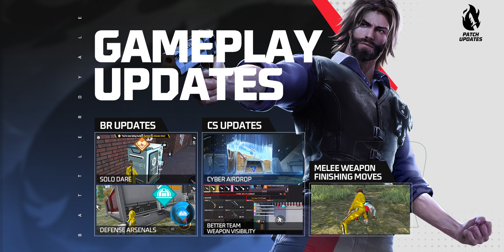
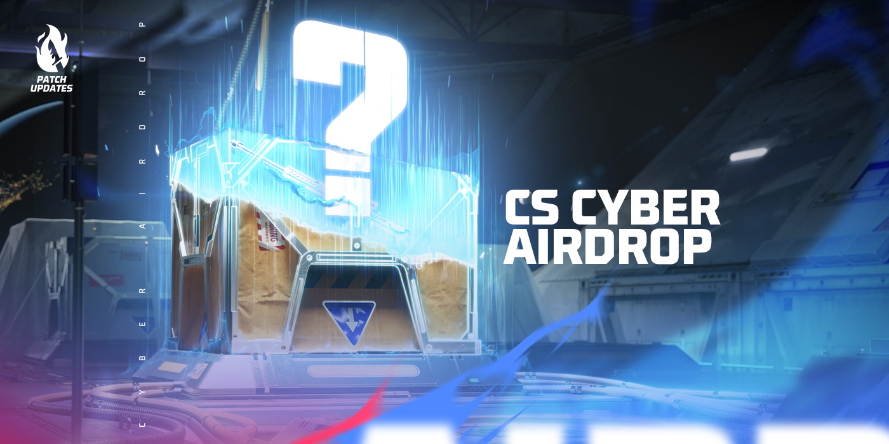
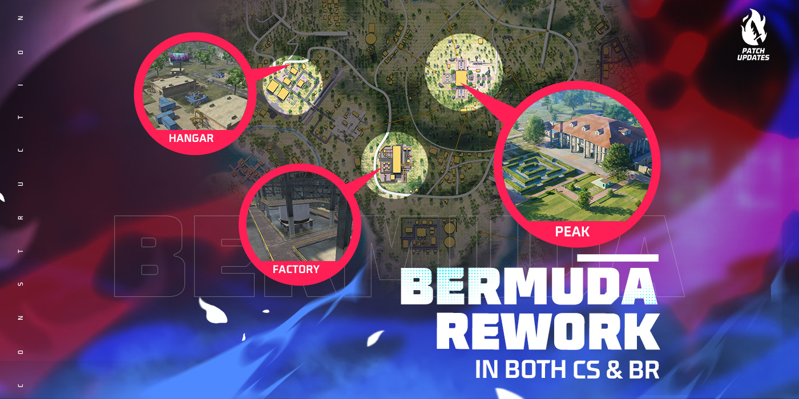
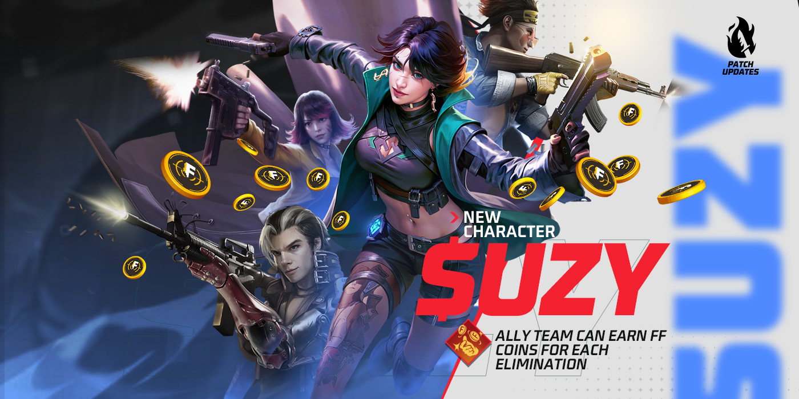
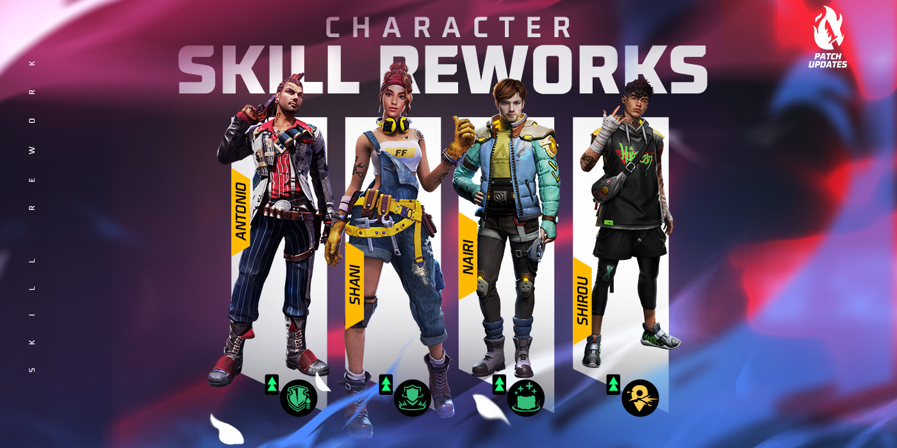
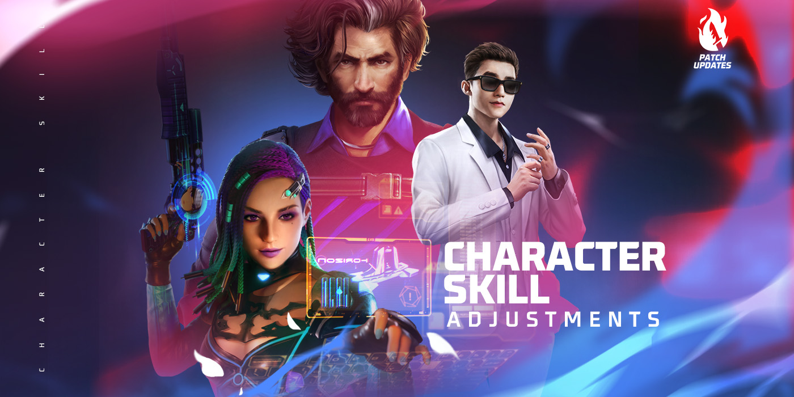
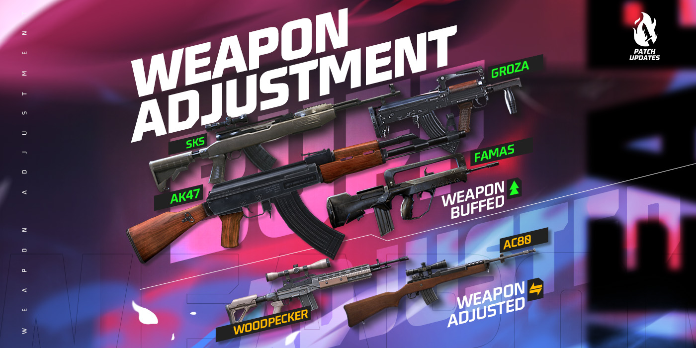
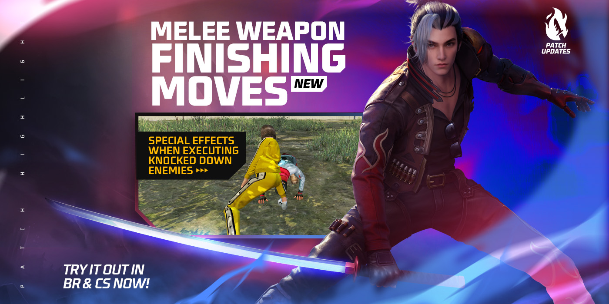
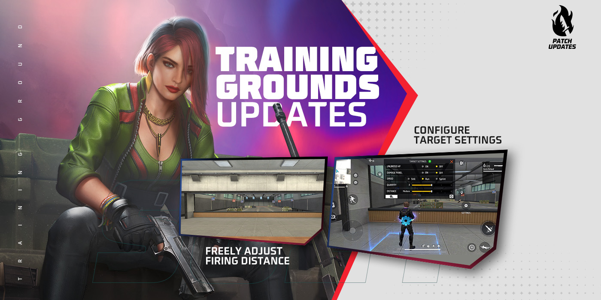
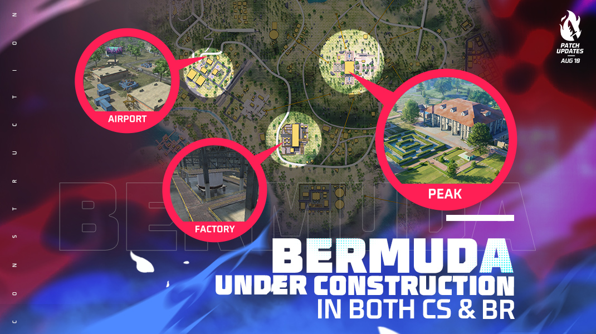

# Free Fire · OB41 · 2023 年 8 月补丁

- 公告日期：2023-08-08
- 官方来源：[Free Fire 2023 年 8 月补丁 Patch Notes](https://ff.garena.com/en/article/1213/)
- 审阅日期：2026-09-18
- 14 个分类小节；48 项说明及表格行；9 张官方公告插图。

本篇 BR、CS、地图、装备、角色武器与局内操作详细整理；其他独立玩法及局外系统保留目录摘要。不是全部历史版本。

版本节点采用公告日期。分期开启、预告及未公布日期的事项按各项备注；公告没有给出当前仍保留的承诺。

## BR · 大逃杀

### 防御军械库与守点任务

- 归属：BR · 大逃杀 / 常规调整
- 原文小节：Battle Royale > Defense Arsenal
- 时间：本项未单独提供精确生效日期；使用公告日期索引。

BR 防御军械库、单人救队挑战及补给调整。原文：Battle Royale。[官方原图](https://lh6.googleusercontent.com/_miqTtVWDB4r9_U_6Ah9DybFR4B-VKjegn45rxB7yY7crIGPHfxvyRkAOutqYuDHSPRAFh53Nj-8gDMRl4CUWlk58Ar6xVAysHTQvFpcCiW1q9_oz7cnio17MBzntcqlCa72JB-nGeu0M7KUKDLJ0vw) · 1400×700。

- 局内任务可能变为防御军械库；仅激活该任务的对局中，钥匙不再地面掉落或在商店出售。
- 进入占领区，进度达到 100% 后打开军械库；多人加速占领，有敌人在区内则暂停。
- 成功占领会启动无人机，为所属队伍扫描敌人；敌人可摧毁无人机。

### Solo Dare 单人救队挑战

- 归属：BR · 大逃杀 / 常规调整
- 原文小节：Battle Royale > Solo Dare
- 时间：本项未单独提供精确生效日期；使用公告日期索引。

- 仅双排/四排、队伍只剩一名存活者时可在普通售货机免费购买；空投售货机不提供。
- 双排存活 90 秒、四排存活 100 秒完成任务，获得 400 FF 金币和可复活全队的超级复活卡；挑战者位置在所有玩家地图上公开。
- 击杀挑战者的敌人获得神秘奖励；每局所有玩家合计最多购买 5 次。

### 蓝区、战利品与空投时序

- 归属：BR · 大逃杀 / 常规调整
- 原文小节：Battle Royale > Loot Adjustments
- 时间：本项未单独提供精确生效日期；使用公告日期索引。

- 高物资区移除手炮，限制 40mmSR（原文弹药名）掉落，全图仅低概率出现；高物资区 FF 金币数量 -15%。
- 增加 2 把 M60-I；头盔加厚件成为稀有地面物资；1 级战备箱降低高级装备、增加恢复品。
- 防御空投首次时间 140→80 秒，数量 2→4；普通空投首次 160→400 秒，双排/四排全局 3 个、单排 2 个。

### 飞船路线与跳台箱

- 归属：BR · 大逃杀 / 常规调整
- 原文小节：Battle Royale > Airships
- 时间：本项未单独提供精确生效日期；使用公告日期索引。

- 飞船改为固定路线并可通过滑索抵达；每 120 秒刷新一次宝箱，保证提供跳台。

### 冰墙融化器与无人机

- 归属：BR · 大逃杀 / 常规调整
- 原文小节：Battle Royale > Other Adjustments
- 时间：本项未单独提供精确生效日期；使用公告日期索引。

- 冰墙融化器持续时间 4→5 秒，每秒伤害 230→170。
- 轻型无人机地面光效改为紫色；地图无人机扫描范围 120→100 米，HP 200→500，持续 600 秒。

### 售货机物品替换

- 归属：BR · 大逃杀 / 常规调整
- 原文小节：Battle Royale > Vending Machine
- 时间：本项未单独提供精确生效日期；使用公告日期索引。

- MP40→AK47，FAMAS-II→FAMAS-III；免费武士刀→平底锅，免费 2 级握把→AR 弹匣，免费 UZI→轻型无人机（每人 1 个）。
- 原售卖 AR 弹匣的位置改为 300 金币消音器；移除头盔加厚件和付费轻型无人机。
- 空投售货机移除军械库钥匙；购买复活卡时按现有金币自动选可复活的队友；队伍栏显示持有钥匙的队员。

### BR 战备及排位地图池

- 归属：BR · 大逃杀 / 常规调整
- 原文小节：Gameplay > Loadout / Rank
- 时间：本项未单独提供精确生效日期；使用公告日期索引。

- 侦察战备：原 1 个轻型无人机改为轻型无人机和干扰器各 1。
- 补给箱返场：原 1 级头盔、1 级背心、Bizon、300 金币，改为 2 级头盔、2 级背心、Bizon，移除 300 金币。
- BR 排位地图为百慕大、新地平线、炼狱，卡拉哈里退出本轮地图池。

## CS · 枪王对决

### 电子空投与购买体验

- 归属：CS · 枪王对决 / 常规调整
- 原文小节：Clash Squad > Cyber Airdrop
- 时间：本项未单独提供精确生效日期；使用公告日期索引。

电子空投与团竞商店官方说明图。原文：Clash Squad。[官方原图](https://lh4.googleusercontent.com/n8eSCP9oyTsXJLe7Lptg9TI6Xoiyb_aOprp9LVO3eOCml9GFjw-2uuOt7AjYsXczewdvLYL0eHAeiYuFqONE6Fmo_ZHwPP_yyovPc7wbDxkjj0PB3wxWvjTWNOcbziYsmj1WDqlKpk9dRPEQRq9yN_M) · 1400×700。

- 第 3、4、5 回合出现电子空投；具现前透明且不阻挡，具现后可占领。
- 第 3/4 回合占领需 10 秒，第 5 回合 12 秒；分别获得 1、1、2 个电子点数。有双方争夺时须仅剩一方站在区域内。
- 累计 3 点后解锁 M1887-X 购买资格。
- 商店显示队友武器和货币沟通入口；非赛点购买阶段队友丢枪时发通知；可查看敌方被动技能，缩小回合结果提示，显示商店关闭倒计时。
- SKS 1800、MAC10 价格降低 100 的商店方案在该公告标为待定，不能当作已确认最终价格。

### 护甲箱各回合奖励

- 归属：CS · 枪王对决 / 常规调整
- 原文小节：Gameplay > Loadout > Armor Crate
- 时间：本项未单独提供精确生效日期；使用公告日期索引。

- 第 2 回合提供 1 级头盔和背心；第 3 回合提供 2 级背心。
- 第 4 回合由背心 HP 增强件和头盔加厚件改为仅头盔加厚件；第 5 回合由两者改为仅背心 HP 增强件。
- 第 6、7 回合提供背心扩展件。

## 通用局内调整

### 山顶重做与局部路线

- 归属：通用局内调整 / 常规调整
- 原文小节：Map > Peak Rework / Other Map Adjustments
- 时间：本项未单独提供精确生效日期；使用公告日期索引。

原文通用章节或明确跨模式内容；未单列 BR/CS 例外时不推定全部模式完全相同。

百慕大山顶、机库与工厂改造总览。原文：Map > Bermuda Adjustments。[官方原图](https://lh3.googleusercontent.com/rZ7bdL7qVYWcyZ9Hx3rvmutHN_TGNFS0qGyNeQbxX2OzFxzagykDC9zIEw1_bHhu2BLEi57OJ8rJHjve4oJvHa4QamPvpFKkMq07MwMiIGnNDQRN7v8a8mk5hiZJRETxn-lkA1faL6BBe5gbucuQBu0) · 1400×700。

- 百慕大山顶改为庄园，整体高度降低，增加高品质物资；同步出现在 CS 普通和排位。
- Hangar 移除路缘、重排集装箱、移除两棵树；二层调整掩体、一层新增门。
- Factory 降低三层平台并移除其掩体、缩细栏杆以减轻辅助瞄准干扰，并提高室内亮度。原文地图章节与 CS 交战空间一起说明，按地图范围记录。

### 新角色与技能平衡

- 归属：通用局内调整 / 常规调整
- 原文小节：Characters
- 时间：本项未单独提供精确生效日期；使用公告日期索引。

原文通用章节或明确跨模式内容；未单列 BR/CS 例外时不推定全部模式完全相同。

Suzy 新角色与悬赏技能。原文：Characters & Pets > New Character > Suzy。[官方原图](https://lh3.googleusercontent.com/Jttf0QPMEauZEzJ_Qqw-F838zfNsFnUSbtPKv9AVZqVqCflkCem8woapMLVM3pj9gUqQsA22ouwqE6yR4_t9qVGUq4pr59a5GXe26ag08ZfOMMVzMy4yfuRlLqlv36IFZArrK39u_gH2jTtt7ENrDyA) · 1400×700。

Antonio、Nairi、Shani、Shirou 技能重做。原文：Characters & Pets > Character Rework。[官方原图](https://lh5.googleusercontent.com/5rfIKxqbeQo9cNr3jdCu7tcJdukksRBdsvClWu3FVHUy8P8G65imF1K12Yu_v1ZuEnyNHtKC4fPEVFt3aDRlECd6GX0dV5SBrPls53cktX9WzUmPyOuOCwMnUBGniaBHT3kWwBbCOKJzoWt3SUHInw4) · 1400×700。

Andrew 与 Skyler 技能平衡。原文：Characters & Pets > Character Balance Adjustments。[官方原图](https://lh3.googleusercontent.com/0iRHohHluxzSvo6zTZJHIhYgZxya-TmJ_yESuGIokmfEJ2dv8uLWANmEWQ2IQrDp5EBPJxJCajZZc8qXbcbZ90nBBdOdErfgLVq7tX3KpASAPAte9QsUVuXCG3JCAfhvpBZZP0bGHTrzd-8S_GynsSg) · 1400×700。

- Suzy：自己或队友淘汰被标记的敌人获得 100 货币，自己淘汰再多 100。
- Antonio：40 额外 HP 改为 40 护盾，脱战 4 秒开始恢复。
- Nairi：冰墙受击后每秒恢复 250 耐久；墙周围 5 米内队友每秒恢复 20 HP，每面墙最多治疗 40；在危险区超过 10 秒不提供治疗。
- Shani：使用主动技能后，自己及 10 米内队友获得 50 护盾，5 秒后衰减，冷却 10 秒。
- Shirou：受到 100 米内敌人攻击时标记攻击者 6 秒，最多 4 名，信息可共享。
- 觉醒 Andrew：防具减伤 20%→15%，每名带同技能队友提供的额外减伤 10%→5%。
- Skyler：冲击波射程 100 米、影响半径 4 米，冰墙受持续作用时间 5→6 秒，冷却 45→40 秒。
- Moco 支持多目标标记；血条附近显示增减益；Sonia、Orion 的不能开火阶段结束后可响应提前按下的开火输入。

### 护盾与移速上限

- 归属：通用局内调整 / 常规调整
- 原文小节：Gameplay > Shield Points / Other Adjustments
- 时间：本项未单独提供精确生效日期；使用公告日期索引。

原文通用章节或明确跨模式内容；未单列 BR/CS 例外时不推定全部模式完全相同。

- 护盾优先于 HP 消耗，但危险区、跌落和流血伤害例外；护盾不受防具减伤保护。
- 在血条上方显示护盾，加入受击音效；相关角色包括 Kapella、Sonia、Antonio、Shani。
- 技能提供的移动速度增益上限为 15%。

### 枪械、近战和弹药交互

- 归属：通用局内调整 / 常规调整
- 原文小节：Weapon and Balance
- 时间：本项未单独提供精确生效日期；使用公告日期索引。

原文通用章节或明确跨模式内容；未单列 BR/CS 例外时不推定全部模式完全相同。

步枪与精确射手步枪平衡总览。原文：Weapon and Balance。[官方原图](https://lh6.googleusercontent.com/8j7JOgu8WnjfD6jze4DnUr08UH1ZEdZdG34MIa2TryvayiXRq-XI4G3WVtIZgvrNZeKbdcJcbhHL3o6HRt02t_589Qxnzz3lEzEpfqtxprkuAV2Ma0cX7hjqSBRQ9qRvndRa8UpDcMd3Rn57iandfJs) · 1400×700。

近战武器终结动作说明。原文：Gameplay > Melee Weapon Finishing Move。[官方原图](https://lh4.googleusercontent.com/ULARJisUoFN8IV9xdyP058O8OskVK8FYjCrrg0JmA9fj86-E-HlUpWv0Q-C4vD6fdjJkX9Q1XSYLeGBLWPt8eQYfy5IEbAImIF86q4KvCLy1SpU6Ssj_ZYnOO2hdI9jBfsSYrpSEXaMAj7bskzGfo_Y) · 1400×700。

- AK47：伤害 +15%，最小伤害 +30%；Groza：穿甲 +8%；G36：改进辅助瞄准。
- FAMAS：开镜速度 +50%，开镜最小伤害 +10%，穿甲 +10%；M14 改为全自动。
- AC80：射速 -20%、弹匣 -20%、最小伤害 +25%；Woodpecker：伤害 -15%、装填速度 -10%、最小伤害 +30%；SKS：弹匣 +60%、装填速度 -20%、开镜速度 +50%、射程 +20%、最小伤害 +40%。
- 近战武器耐久为 130，耗尽后破坏并消失；除平底锅外，近战可对范围内倒地敌人执行终结，动画完成后淘汰，允许打断和重新执行。
- 丢弃堆叠弹药从每次一半改为每次 30 发。

### 局内操作、信息与动画

- 归属：通用局内调整 / 常规调整
- 原文小节：Game Environment > Other Adjustments
- 时间：本项未单独提供精确生效日期；使用公告日期索引。

原文通用章节或明确跨模式内容；未单列 BR/CS 例外时不推定全部模式完全相同。

- 罗盘显示队友方向；冲刺不打断移动表情；装弹不再打断扶起队友。
- 空手捡到手雷不会立刻装备；调整 No Blood 信息显示、背包选择逻辑。
- 改进状态信息和部分动作表现，具体性能增益未量化。

## 其他玩法与局外内容（目录摘要）

### 其他玩法与局外目录

独立玩法包括 Zombie Hunt 的 Double Evil 与训练场调整；局外涵盖好友预约、亲密度、点赞、成就称号、新商店、下载与网络提示、大厅、K/D 排行榜和荣誉。Craftland 归创作工具与独立地图，不计入 BR 基础更新。

原文目录：Zombie Hunt; Training Grounds; System; Rank; Game Environment; Craftland

## 其余原文配图

以下为尚未在上述小节内展示的原文图片，包括局外章节配图。

训练场射距和靶标设置调整。原文：Mode > Training Grounds Optimization。[官方原图](https://lh6.googleusercontent.com/VBRlWmrBpsxiMJ7IT1oe7DvZ0RTytlWBEG8pKjHLTAefzkojTKXvguVES_eURkksnx1y-Yv2sJu_iAzWaxclY82UK2yzw3MdxVaEZauRAcTa1SpmA8654BvwIkQPiUshkqsaoqR4RgmGL-riLOd-YnA) · 1400×700。

## 官方图片索引

正文图片按相关小节展示，版本总览及其他章节插图另列；同一原图只嵌入一次。

- [电子空投与团竞商店官方说明图](https://lh4.googleusercontent.com/n8eSCP9oyTsXJLe7Lptg9TI6Xoiyb_aOprp9LVO3eOCml9GFjw-2uuOt7AjYsXczewdvLYL0eHAeiYuFqONE6Fmo_ZHwPP_yyovPc7wbDxkjj0PB3wxWvjTWNOcbziYsmj1WDqlKpk9dRPEQRq9yN_M) · 1400×700 · 本地 `assets/ff-patches/1213-01.jpg`
- [BR 防御军械库、单人救队挑战及补给调整](https://lh6.googleusercontent.com/_miqTtVWDB4r9_U_6Ah9DybFR4B-VKjegn45rxB7yY7crIGPHfxvyRkAOutqYuDHSPRAFh53Nj-8gDMRl4CUWlk58Ar6xVAysHTQvFpcCiW1q9_oz7cnio17MBzntcqlCa72JB-nGeu0M7KUKDLJ0vw) · 1400×700 · 本地 `assets/ff-patches/1213-02.jpg`
- [训练场射距和靶标设置调整](https://lh6.googleusercontent.com/VBRlWmrBpsxiMJ7IT1oe7DvZ0RTytlWBEG8pKjHLTAefzkojTKXvguVES_eURkksnx1y-Yv2sJu_iAzWaxclY82UK2yzw3MdxVaEZauRAcTa1SpmA8654BvwIkQPiUshkqsaoqR4RgmGL-riLOd-YnA) · 1400×700 · 本地 `assets/ff-patches/1213-03.jpg`
- [百慕大山顶、机库与工厂改造总览](https://lh3.googleusercontent.com/rZ7bdL7qVYWcyZ9Hx3rvmutHN_TGNFS0qGyNeQbxX2OzFxzagykDC9zIEw1_bHhu2BLEi57OJ8rJHjve4oJvHa4QamPvpFKkMq07MwMiIGnNDQRN7v8a8mk5hiZJRETxn-lkA1faL6BBe5gbucuQBu0) · 1400×700 · 本地 `assets/ff-patches/1213-04.jpg`
- [Suzy 新角色与悬赏技能](https://lh3.googleusercontent.com/Jttf0QPMEauZEzJ_Qqw-F838zfNsFnUSbtPKv9AVZqVqCflkCem8woapMLVM3pj9gUqQsA22ouwqE6yR4_t9qVGUq4pr59a5GXe26ag08ZfOMMVzMy4yfuRlLqlv36IFZArrK39u_gH2jTtt7ENrDyA) · 1400×700 · 本地 `assets/ff-patches/1213-05.jpg`
- [Antonio、Nairi、Shani、Shirou 技能重做](https://lh5.googleusercontent.com/5rfIKxqbeQo9cNr3jdCu7tcJdukksRBdsvClWu3FVHUy8P8G65imF1K12Yu_v1ZuEnyNHtKC4fPEVFt3aDRlECd6GX0dV5SBrPls53cktX9WzUmPyOuOCwMnUBGniaBHT3kWwBbCOKJzoWt3SUHInw4) · 1400×700 · 本地 `assets/ff-patches/1213-06.jpg`
- [Andrew 与 Skyler 技能平衡](https://lh3.googleusercontent.com/0iRHohHluxzSvo6zTZJHIhYgZxya-TmJ_yESuGIokmfEJ2dv8uLWANmEWQ2IQrDp5EBPJxJCajZZc8qXbcbZ90nBBdOdErfgLVq7tX3KpASAPAte9QsUVuXCG3JCAfhvpBZZP0bGHTrzd-8S_GynsSg) · 1400×700 · 本地 `assets/ff-patches/1213-07.jpg`
- [步枪与精确射手步枪平衡总览](https://lh6.googleusercontent.com/8j7JOgu8WnjfD6jze4DnUr08UH1ZEdZdG34MIa2TryvayiXRq-XI4G3WVtIZgvrNZeKbdcJcbhHL3o6HRt02t_589Qxnzz3lEzEpfqtxprkuAV2Ma0cX7hjqSBRQ9qRvndRa8UpDcMd3Rn57iandfJs) · 1400×700 · 本地 `assets/ff-patches/1213-08.jpg`
- [近战武器终结动作说明](https://lh4.googleusercontent.com/ULARJisUoFN8IV9xdyP058O8OskVK8FYjCrrg0JmA9fj86-E-HlUpWv0Q-C4vD6fdjJkX9Q1XSYLeGBLWPt8eQYfy5IEbAImIF86q4KvCLy1SpU6Ssj_ZYnOO2hdI9jBfsSYrpSEXaMAj7bskzGfo_Y) · 1400×700 · 本地 `assets/ff-patches/1213-09.jpg`

## 版本关联来源

### [OB41地图调整开发说明](https://ff.garena.com/en/article/1211/)

2023-08-01
本篇2023年8月1日解释地图设计与前版回顾；对应1213正式补丁。

- Hangar移除路缘高差，调整广告牌旁蓝色集装箱；减少屋顶掩体、移除中央树，针对蹲射与趴射时单侧视野优势。1213另列树木数量等具体改动。
- Factory降低三楼高度、移除屏障，调整黄色栏杆厚度以减少挡弹，增加室内亮度；此前一方更快登上高层而有视野优势。
- Peak改为庄园、迷宫花园和两个泳池区域，调整周围坡度，改善地面物资，并加入CS图池。
- 前一补丁回顾：Nurek Dam蓝色集装箱重排后不可跳上；Rim Nam Village分区更明确并加入CS，官方称4v4两侧胜率相近。不是OB41又新增一次。
- 配图右上写PATCH UPDATES / AUG 18，并写BR与CS均重建；这是图片内日期证据，未注明年份或地区，不覆盖本篇8月1日公告日及1213的8月8日公告日。

OB41地图调整开发说明 · 原文图1。原文：OB41地图调整开发说明。[官方原图](https://cdn.wildflamestudio.com/common/web_event/official2.ff.garena.all/20238/780edbbd5b79928970600f74385f650e.jpg) · 1070×600。

## 原文目录（对照用）

- Clash Squad
- Battle Royale
- New In-Match Quest: Defense Arsenal
- Solo Dare
- Other Adjustments
- Mode
- Zombie Hunt: Double Evil
- Training Grounds Optimization
- Map
- Bermuda Adjustments
- Hangar
- Factory
- Characters & Pets
- New Character
- Suzy
- Character Rework
- Antonio
- Nairi
- Shani
- Shirou
- Character Balance Adjustments
- Andrew “the Fierce”
- Skyler
- Other Skill Adjustments:
- Shield Points
- Limit on Skill Movement Speed
- Weapon and Balance
- Weapon Balance Adjustments
- Melee Weapon Adjustments - Melee Weapon HP
- Gameplay
- Melee Weapon Finishing Move
- Optimization for Merged Items in Backpack
- Loadout Adjustments
- Quickly Team Up With Friends
- Play Again Button
- Booking Optimization
- Team Up Optimization
- Custom Room Optimization
- Intimacy Scores
- Likes Outside Matches
- Achievement & Title
- Achievement System Optimization
- Title Optimization
- System Optimization
- Store Redesign
- Download Center Optimization
- Display Internet Connection Status in Lobby
- Rank
- K/D Leaderboard
- Map Pool Adjustments
- Game Environment
- Honor Score Rewards Optimization
- Other Adjustments
- Craftland
- Big Head Training Ground
- Rampage: Classic
- Head Hunt
- Clash Squad: Slay
- Shadow Hunter
- Other Optimizations
