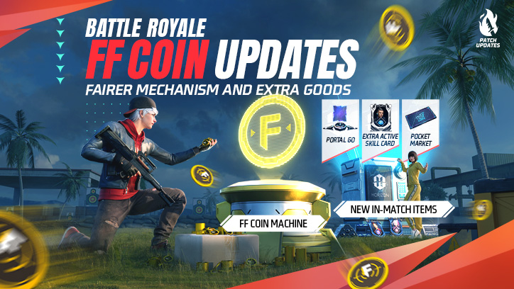
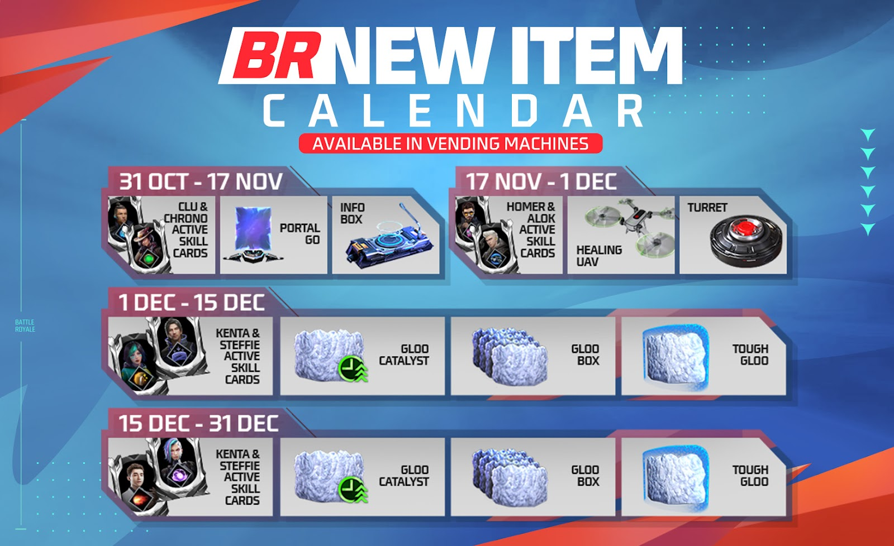
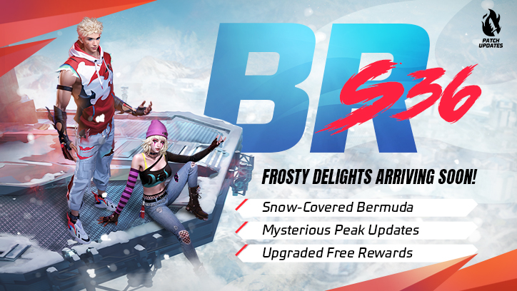
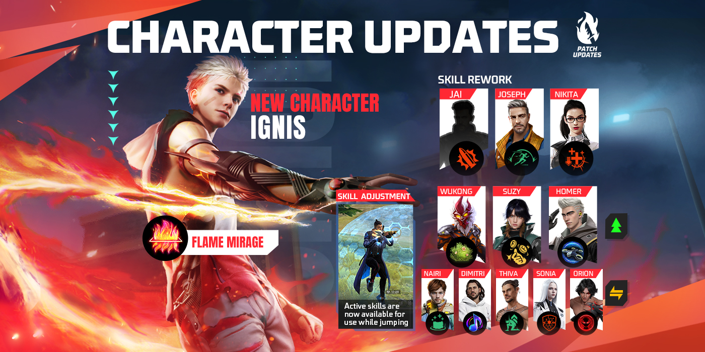
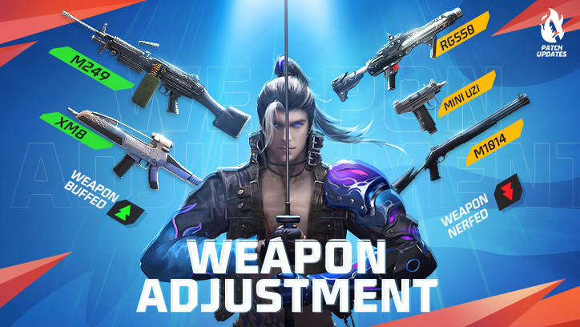
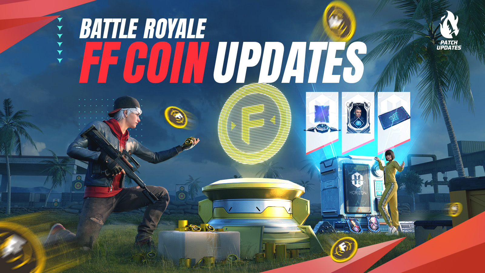

# Free Fire · OB42 · 2023 年 10 月补丁

- 公告日期：2023-10-30
- 官方来源：[Free Fire 2023 年 10 月补丁 Patch Notes](https://ff.garena.com/en/article/1266/)
- 审阅日期：2026-09-18
- 18 个分类小节；64 项说明及表格行；6 张官方公告插图。

本篇 BR、CS、地图、装备、角色武器与局内操作详细整理；其他独立玩法及局外系统保留目录摘要。不是全部历史版本。

版本节点采用公告日期。分期开启、预告及未公布日期的事项按各项备注；公告没有给出当前仍保留的承诺。 官方公告摘要给出的补丁日期为 2023-10-31；各项分期开放仍以正文说明为准。

## BR · 大逃杀

### 金币机与淘汰经济

- 归属：BR · 大逃杀 / 常规调整
- 原文小节：Battle Royale > FF Coin Machines / FF Coin Adjustments
- 时间：本项未单独提供精确生效日期；使用公告日期索引。

金币机与 BR 金币经济调整。原文：Battle Royale > Economy Adjustment。[官方原图](https://lh7-us.googleusercontent.com/uLrTzcYuw8Ix9rO2KBHrjz20C35BYW-tukHHDjET-g43mBVhqWvB0s4MTQuCaaGM4iU_f5_4IssS2qGXSsWT7aivIGMz2uyWQrCE9UaULdpmnjD_tL2c1sjUysl20fbPl5FxjWxNnPxV2y_obUK2Wwk) · 724×408。

- 金币机固定位置出现，每台每队可取一次 200 金币，其他队也能分别领取。
- 淘汰敌人获得 100 金币；淘汰掉落所持金币的 40%；复活保留 30%、最多 300 金币。

### 装置栏、技能卡与传送门

- 归属：BR · 大逃杀 / 常规调整
- 原文小节：Battle Royale > Active Skill Cards / Portal Go
- 时间：本项未单独提供精确生效日期；使用公告日期索引。

BR 新道具售货机排期表。原文：Battle Royale > New Items。[官方原图](https://lh7-us.googleusercontent.com/9pS4ijKS3PQzN1hioyC7pYd57akNjrnKbVPsxNO5Vn2oWFjhP5PIUQBKqJDrvmLqZjS2aNb_rM8m5kHBcD_2WPe1rKcxIrCGc8PatFUEs9xzqddUBD3Lbf0qHskFyJa7AmckSVvUBBRadMmujR2JKOU) · 1600×978。

- 装置只能装备一个，拾取新装置会替换旧装置。
- 主动技能卡提供一次额外主动技能，每次只持有一张，不能与当前装备主动技能相同；本版提供 Clu、Chrono、Homer、Alok、Kenta、Steffie、A124、Skyler。
- Portal Go 可供敌我使用，使用冷却 3 秒，两端发光；不可摧毁并持续存在，向上最大高差 20 米。

### 能量剂、自动炮塔与治疗无人机

- 归属：BR · 大逃杀 / 常规调整
- 原文小节：Battle Royale > Energizer / Mini Turret / Heal UAV-Lite
- 时间：同页官方排期图：治疗无人机、炮塔于 2023-11-17 至 2023-12-01 供应；正文未提供独立实装确认。

- 能量剂使用 2 秒，可在冲刺时使用；增益持续 10 秒，每秒恢复 5 HP、精度 +5%、移速 +10%。
- 自动炮塔最多部署 2 个，攻击时标记目标；每 0.5 秒 20 伤害，射程 30 米，200 HP，持续 120 秒。主人离开 30 米后 5 秒停用，再过 5 秒销毁。
- 治疗轻型无人机向面朝方向飞 10 米，半径 5 米内每秒恢复 20 HP、持续 12 秒，自身 100 HP。
- 正文提示炮塔与治疗无人机等待后续公告；同页官方排期图标注两者于 11 月 17 日—12 月 1 日进入售货机。记录为该图公布的供应排期，不等同于已核实整个模式的实际开放结果。

### 冰墙附件

- 归属：BR · 大逃杀 / 常规调整
- 原文小节：Battle Royale > Gloo Maker Attachments
- 时间：本项未单独提供精确生效日期；使用公告日期索引。

- 坚固附件使冰墙耐久 +200；箱式附件使携带上限 +4；催化附件使生成速度 +30%。

### 移动安全区与圈外治疗限制

- 归属：BR · 大逃杀 / 常规调整
- 原文小节：Battle Royale > Moving Safe Zone / Out-of-Zone
- 时间：移动安全区：开放日期未公布

- 移动安全区适用于 BR 四排普通、排位和自定义房间；第 4 圈至第 5 圈间移动，新地平线提前至第 3 圈；开放时间待后续公告。
- 处于圈外每 10 秒叠加一层治疗量 -5%，最多 6 层即 -30%；进入安全区 5 秒后清除。

### 地面、高物资区和补给节奏

- 归属：BR · 大逃杀 / 常规调整
- 原文小节：Battle Royale > Loot Adjustments
- 时间：本项未单独提供精确生效日期；使用公告日期索引。

- 地面加入能量剂；移除 100/300 金币掉落，保留 500 面额。
- 高物资区外的 3 级头盔/背心掉率 -20%，分布更分散；军械库钥匙掉率 -50%；移除 1 级背包掉落，改为出生自带。
- 四排空投售货机提前 60 秒且多 1 个；空投提前 100 秒且多 1 个；军械库移除金币。
- 高物资区提供 2 张主动技能卡；40mm/SR 弹药掉落 -50%，增加 500 金币及能量剂。

### 普通售货机完整调整

- 归属：BR · 大逃杀 / 常规调整
- 原文小节：Battle Royale > Vending Machine
- 时间：本项未单独提供精确生效日期；使用公告日期索引。

- 前两周至 11 月 17 日提供 Clu 卡 300、Chrono 卡 500；第一周 Portal Go 800，每局限购 2。
- 吸入器商品替换为 100 金币超级医疗包；3 级背心 300→400、3 级头盔 200→300。
- 移除免费治疗狙击枪、激光瞄准器和平底锅；免费超级医疗包改为吸入器（每人 1 个）。
- 情报箱购买窗口至开局 600 秒、每人限 1；复活卡至 420 秒；Solo Dare 至 600 秒。所有价格为 FF 金币。

### 空投售货机、防御空投与战备箱

- 归属：BR · 大逃杀 / 常规调整
- 原文小节：Battle Royale > Airdrop Vending Machine / Airdrop / War Chest
- 时间：本项未单独提供精确生效日期；使用公告日期索引。

- 空投售货机移除普通复活卡；超级复活卡 500→400；首周 Portal Go 800（每人 1）、免费 Chrono 卡（每人 1）；跳台 600（限 1）；M249→M249-X、售价 600；免费武器为 SKS、MP5-II。
- 普通空投移除干扰器及轻型无人机，加入 500 金币。
- 防御空投第 2 阶段升级芯片改为冰墙芯片；第 3 阶段 Horizaline 改为 Portal Go，并移除升级芯片。
- 战备箱不再给金币，有较低概率提供技能卡、装置或跳台。

### 返场、任务及移除物件

- 归属：BR · 大逃杀 / 常规调整
- 原文小节：Battle Royale > Other Adjustments
- 时间：本项未单独提供精确生效日期；使用公告日期索引。

- 增加队伍被全灭的提示；单排复活随机出现在淘汰位置 100 米内。
- 减少售货机售卖的任务；移除地面情报箱与防具升级器；移除飞船。
- Solo Dare 挑战进度对本人、阵亡队友和战利品盒增加视觉提示。

### BR 战备和排位图池

- 归属：BR · 大逃杀 / 常规调整
- 原文小节：Gameplay > Loadout Adjustments / Rank
- 时间：本项未单独提供精确生效日期；使用公告日期索引。

- 口袋商店替代侦察战备，保留物资栏，开局提供 2 个；BR 中可购买技能卡、Portal Go。
- 腿袋从 2 级冰墙生成器、3 级背包和 200 容量，改为 2 级冰墙生成器和 300 容量。
- 悬赏令武器 VSS-II/M14-II→M4A1-II/MP5-II。
- BR 排位为百慕大、新地平线、阿尔卑斯，炼狱退出本轮。

## CS · 枪王对决

### The Epic Battle 四级战斗风格

- 归属：CS · 枪王对决 / 活动覆盖
- 原文小节：Clash Squad > The Epic Battle
- 时间：预定开放：2023-12-01

- 预定 12 月 1 日开放；选择战斗风格，淘汰、助攻和扶起队友获得经验，共 4 级。
- 4 级出现终极特效，终结高等级敌人有额外团竞货币和播报；提供 2 次保护。
- Megabolt：冲刺时快速 EP 转换、Tatsuya 卡、附近击倒侦测、装填提速。
- Demolitionist：摧毁冰墙或击倒时触发冰墙爆破、Skyler 卡、冰冻闪光弹、冰墙伤害强化。
- Warding Lord：35 HP、Chrono 卡、持续 60 秒护盾、4 级背心。
- 若已装备同主动技能，Tatsuya 卡改为 Alok、Chrono 改为 Steffie、Skyler 改为 Homer。

### CS 战备与交互

- 归属：CS · 枪王对决 / 常规调整
- 原文小节：Clash Squad / Gameplay > Loadout Adjustments
- 时间：本项未单独提供精确生效日期；使用公告日期索引。

- Deca Square 传送门按钮交互加快。
- 口袋商店购买阶段后可获得免费蘑菇/超级医疗包，并以折扣购买冰墙、防具升级。
- 悬赏令每次击杀获 100 团竞货币，不再限制第一片交战区；空投援助从自己获得 300 改为全队各获 300，不叠加。

### 机库团竞交战空间

- 归属：CS · 枪王对决 / 常规调整
- 原文小节：Map > Hangar
- 时间：本项未单独提供精确生效日期；使用公告日期索引。

百慕大雪地、冰面与区域改造。原文：Map > Snow-covered Bermuda。[官方原图](https://lh7-us.googleusercontent.com/rtJomSjN_zJPBCOUcjJRheE-2LBhv2kz8jySwJQVssVn_fVHmAL3COwvZd8OrFe0JAmSx7Yhqu9m7x2nwMweDlZ08voEm5hrkdcyMQBjmHtzWZAHiFK-JIdNccmjelmp9uFm4M_ns5EK6in609Ga-MI) · 724×408。

- 调整两组集装箱位置，把梯子由中部移至边缘。

## 通用局内调整

### 百慕大雪景与山顶改造

- 归属：通用局内调整 / 活动覆盖
- 原文小节：Map > Snow in Bermuda / Peak
- 时间：本项未单独提供精确生效日期；使用公告日期索引。

原文通用章节或明确跨模式内容；未单列 BR/CS 例外时不推定全部模式完全相同。

- 约半张地图被雪覆盖，树木改变，热带树及屋顶等有例外；Rim Nam、Nurek、Sentosa 水面结冰可通行，并有冰岩掩体。公告未说明永久保留。
- 山顶屋顶下沉 1.8 米，调整梯子外观；二层新增通过梯子进入的隐藏房间，调整空投数量；水池结冰，停车场调整车辆。

### Ignis、新被动技能与宠物

- 归属：通用局内调整 / 常规调整
- 原文小节：Characters > New Character / Character Adjustments
- 时间：本项未单独提供精确生效日期；使用公告日期索引。

原文通用章节或明确跨模式内容；未单列 BR/CS 例外时不推定全部模式完全相同。

Ignis、角色重做与技能平衡总览。原文：Characters & Pets。[官方原图](https://lh7-us.googleusercontent.com/-_H_Rx3ZLJqScI11zgBb8S6cQXYFvwKgSRugNHXNmQ1bdJagyo4owdWbqJSrGmzEBlWTI8LnX375rWJlWa-WVoqyT--gGnXgtWVykJ74EH5bkVrW25IVIL-CzLe0ER5oANKtNg3K5Vo52O-ohpCyMVc) · 1400×700。

- Ignis：15 米内放置宽 10 米、持续 8 秒火墙；敌人接触先受 30 伤害，随后 2 秒每秒 10 伤害并损失 10% 防具耐久；冰墙先受 200，再每秒 200、持续 1 秒。
- Nikita：装填速度 +20%；命中使目标治疗降低 30%，持续 10 秒，最大 30%。
- Joseph：免疫减速、标记、沉默等干扰，移速 +10% 持续 5 秒，冷却 60 秒。
- Jai：击倒或使用主动技能自动补满突击步枪、手枪、冲锋枪、霰弹枪、狙击枪弹匣。
- Falco：主人跳伞时禁用敌人对其辅助瞄准；原有跳伞提速效果合入所有玩家基础跳伞速度。

### 角色平衡完整数值

- 归属：通用局内调整 / 常规调整
- 原文小节：Characters > Character Balance
- 时间：本项未单独提供精确生效日期；使用公告日期索引。

原文通用章节或明确跨模式内容；未单列 BR/CS 例外时不推定全部模式完全相同。

- Sonia：护盾 150→100；致命伤后僵直无敌 0.5 秒，随后护盾持续 3 秒，期间淘汰敌人可按剩余护盾转 HP，否则淘汰；冷却 180 秒。
- Nairi：冰墙每秒恢复 250→150，其余 5 米内每秒 20 HP、每墙最多 40 不变。
- Thiva：扶起提速 70%，冷却 60→90 秒，扶起后 3 秒恢复 60 HP；Dimitri：半径 3.5 米、每秒治疗 10、持续 12 秒并自动扶起，冷却 60→90。
- Orion：能量 300、消耗 150，3 秒不能攻击且免伤，5 米吸取 HP 15→10，忽略护盾，冷却 3 秒。
- A124：8 米电波 25 伤害，禁止主动技能并打断交互，持续 30→20 秒，冷却 75→50。
- Homer：无人机搜索 100 米，爆炸直径 3→4 米，25 伤害，减速 60%、射速降低 35%，持续 5 秒，冷却 90。
- Wukong：变身移速惩罚 10%→5%，持续 15 秒，冷却 200 秒、击倒重置。
- Iris：可穿冰墙数 3→5；15 秒内标记墙后 7 米内目标并减伤穿透射击，冷却 60。

### 技能反馈与操作

- 归属：通用局内调整 / 常规调整
- 原文小节：Characters > Other Adjustments / Gameplay
- 时间：本项未单独提供精确生效日期；使用公告日期索引。

原文通用章节或明确跨模式内容；未单列 BR/CS 例外时不推定全部模式完全相同。

- A124、Skyler 瞄准阶段可取消；Tatsuya 可蹲姿使用；跳跃时可用主动技能。
- 敌方 Orion 红色更明显；敌方 Tatsuya/Homer 改为红色；增加 Olivia 治疗特效，调整标记效果及 Paloma/Orion/Otho 描述。
- 跳伞移除加速和开伞按钮，自动控制速度；出生舱显示跳伞队长。
- 移除地图篝火图标；改善载具下坡，调整标记颜色；新增帧率增强；医疗品自动拾取优先级调整、冰墙消失特效改进、背包默认堆叠；BR 淘汰或获胜后可立即查看积分。

### 武器平衡

- 归属：通用局内调整 / 常规调整
- 原文小节：Weapon and Balance
- 时间：本项未单独提供精确生效日期；使用公告日期索引。

原文通用章节或明确跨模式内容；未单列 BR/CS 例外时不推定全部模式完全相同。

武器平衡官方总览。原文：Weapon and Balance。[官方原图](https://lh7-us.googleusercontent.com/oP6wZ-BysYdhjupJecrEa4QXzgiuyVBAzE8Sx6pt999QxYJIC6-XvsM14d84Aq_4okcy8MYIKrVS_Pftj1kyG3vJmIdrDGppEcGhi95D5VLmp7YT1N7QuBNTEhBoUZQIlmayDio-kzefN1u0B9JQbMc) · 724×408。

- XM8：弹匣 +20%、精度 +20%、伤害 +10%。
- Mini Uzi：穿甲 30→10，即降低约 66%。
- M249/M249-X：蹲姿额外伤害 5→10（该加成提高 100%），最小伤害 +20%。
- M1014-I/II/III 最小伤害 -15%；RGS50 对玩家伤害 -25%。

## 其他玩法与局外内容（目录摘要）

### 其他玩法及局外目录

公会重做及 Guild Wars 独立入口；Zombie Invasion 包括第二主动技能、军械库、箱子与圈时序调整；Triple Wolves 属独立双人竞技及商店匹配规则。另有好友/语音包/快捷消息、网络与大厅、宠物助手、排位奖励和 Craftland 创作功能；没有混入 BR 常规规则。

原文目录：Guild; Zombie Invasion; Triple Wolves; System; Rank; Craftland

## 其余原文配图

以下为尚未在上述小节内展示的原文图片，包括局外章节配图。

公会系统重做官方说明图。原文：Guild System Revamp。[官方原图](https://lh7-us.googleusercontent.com/e8TmRcsvEhlDF-hfQbb2IrXS0OEUOWViFBevPUEJ2jpQ_lGUbI0to2yK2XYexF5SzZgYwMmM9c8B7PsDQ9ZnGSBGRoeckBNbzxFWZZi7vuMMpORIPwduGu4DBTKdzJ8FMs-Zl3fntE_C-pmVUpxiEUI) · 724×408。

## 官方图片索引

正文图片按相关小节展示，版本总览及其他章节插图另列；同一原图只嵌入一次。

- [金币机与 BR 金币经济调整](https://lh7-us.googleusercontent.com/uLrTzcYuw8Ix9rO2KBHrjz20C35BYW-tukHHDjET-g43mBVhqWvB0s4MTQuCaaGM4iU_f5_4IssS2qGXSsWT7aivIGMz2uyWQrCE9UaULdpmnjD_tL2c1sjUysl20fbPl5FxjWxNnPxV2y_obUK2Wwk) · 724×408 · 本地 `assets/ff-patches/1266-01.jpg`
- [BR 新道具售货机排期表](https://lh7-us.googleusercontent.com/9pS4ijKS3PQzN1hioyC7pYd57akNjrnKbVPsxNO5Vn2oWFjhP5PIUQBKqJDrvmLqZjS2aNb_rM8m5kHBcD_2WPe1rKcxIrCGc8PatFUEs9xzqddUBD3Lbf0qHskFyJa7AmckSVvUBBRadMmujR2JKOU) · 1600×978 · 本地 `assets/ff-patches/1266-02.jpg`
- [公会系统重做官方说明图](https://lh7-us.googleusercontent.com/e8TmRcsvEhlDF-hfQbb2IrXS0OEUOWViFBevPUEJ2jpQ_lGUbI0to2yK2XYexF5SzZgYwMmM9c8B7PsDQ9ZnGSBGRoeckBNbzxFWZZi7vuMMpORIPwduGu4DBTKdzJ8FMs-Zl3fntE_C-pmVUpxiEUI) · 724×408 · 本地 `assets/ff-patches/1266-03.jpg`
- [百慕大雪地、冰面与区域改造](https://lh7-us.googleusercontent.com/rtJomSjN_zJPBCOUcjJRheE-2LBhv2kz8jySwJQVssVn_fVHmAL3COwvZd8OrFe0JAmSx7Yhqu9m7x2nwMweDlZ08voEm5hrkdcyMQBjmHtzWZAHiFK-JIdNccmjelmp9uFm4M_ns5EK6in609Ga-MI) · 724×408 · 本地 `assets/ff-patches/1266-04.jpg`
- [Ignis、角色重做与技能平衡总览](https://lh7-us.googleusercontent.com/-_H_Rx3ZLJqScI11zgBb8S6cQXYFvwKgSRugNHXNmQ1bdJagyo4owdWbqJSrGmzEBlWTI8LnX375rWJlWa-WVoqyT--gGnXgtWVykJ74EH5bkVrW25IVIL-CzLe0ER5oANKtNg3K5Vo52O-ohpCyMVc) · 1400×700 · 本地 `assets/ff-patches/1266-05.jpg`
- [武器平衡官方总览](https://lh7-us.googleusercontent.com/oP6wZ-BysYdhjupJecrEa4QXzgiuyVBAzE8Sx6pt999QxYJIC6-XvsM14d84Aq_4okcy8MYIKrVS_Pftj1kyG3vJmIdrDGppEcGhi95D5VLmp7YT1N7QuBNTEhBoUZQIlmayDio-kzefN1u0B9JQbMc) · 724×408 · 本地 `assets/ff-patches/1266-06.jpg`

## 版本关联来源

### [OB42官方编号依据](https://ff.garena.com/vn/article/1272/)

官方更新流程明确OB42及公会2.0、Ignis、BR新道具、Bermuda雪景，与本篇对应；越南地区更新10月31日，本篇公告10月30日不变。

### [BR经济调整开发预告](https://ff.garena.com/en/article/1260/)

2023-10-28
公告日期2023年10月28日；后续1266提供限额与额外规则。

- 新版本预告金币机互动后为全队生成200 FF币；淘汰敌人自动获得100 FF币；复活保留原金币30%。
- 售货机将加入主动技能卡等直接影响战斗的物品。本文未给返场金币上限，1266另列最多300；不能把预告的30%理解成无限额。

BR经济调整开发预告 · 原文图1。原文：BR经济调整开发预告。[官方原图](https://cdn.wildflamestudio.com/common/web_event/official2.ff.garena.all/202310/b6336129c8b9e8c32d5d1356da7b499f.jpg) · 1600×900。

## 原文目录（对照用）

- Battle Royale
- Economy Adjustment
- New Items
- BR Shifting Safe Zone
- Out-of-Zone Debuff
- Other Adjustments
- Ground Loot Adjustments:
- Blue Zone Loot Adjustments:
- Vending Machine Adjustments:
- Airdrop Vending Machine Adjustments:
- Airdrop Adjustments:
- War Chest Adjustments:
- Other Adjustments:
- Clash Squad
- New CS Special Mode: The Epic Battle
- Launch Time (New CS-Ranked Season: 2023-12-01)
- Other CS Adjustments
- Guild System Revamp
- Guild Activity System
- Guild Level System
- Activity System
- Guild Token and Guild Store
- Guild Interaction Feature
- Guild Wars
- Optimizations in Guild Setting and Joining
- Mode
- Zombie Invasion Optimization
- Triple Wolves Optimization
- Map
- Snow-covered Bermuda
- Snowfields
- Frozen Lakes
- Map Balance Adjustment
- Peak
- Hangar
- Characters & Pets
- New Character
- Character Rework
- Character Balance Adjustments
- Other Skill Adjustments:
- Weapon and Balance
- Weapon Balance Adjustments
- Gameplay
- Parachute Control Optimization
- Multiplayer Voice Channel (Only Available on Social Island)
- Loadout Adjustments
- System Optimization
- Customized Voice Pack
- Display Internet Connection Status in Lobby
- FF IntelliMate
- Rank
- Rank Breakthrough Rewards
- Specific Ranking on the Grandmaster Icon
- Map Pool Adjustments
- Other Adjustments
- Craftland
- Content Update
- Function Optimization
- Cross-map Teleportation Now Available!
- Map Code Upgrade
- Gameplay Sneak Peek!
- Gun King Template Now Available in Craftland Studio
- Ruins Themed Items Added in Craftland Studio
- Other Adjustments
