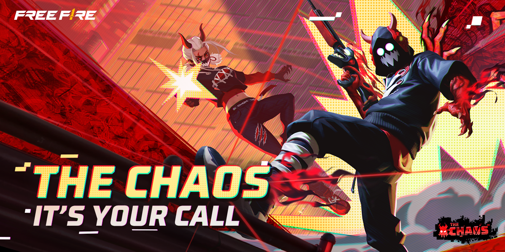
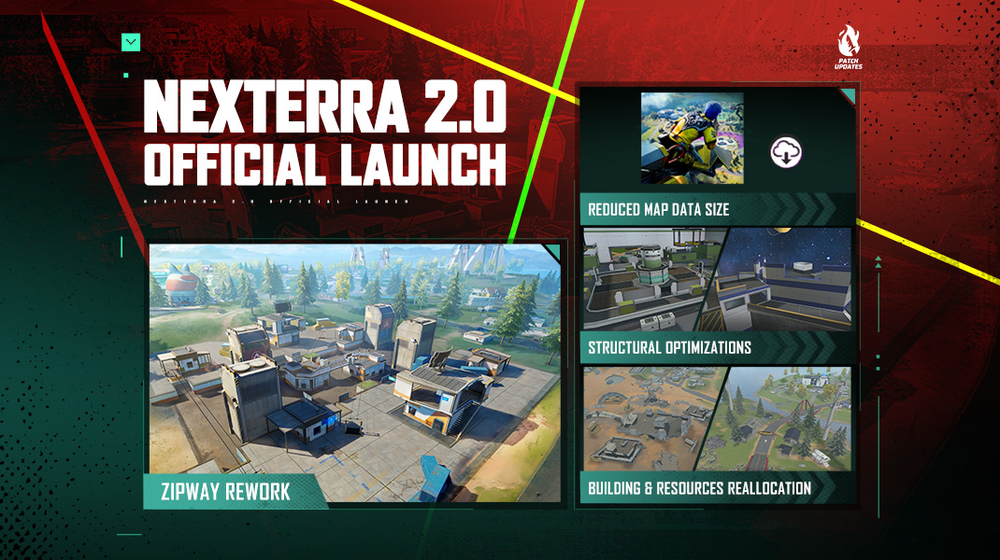
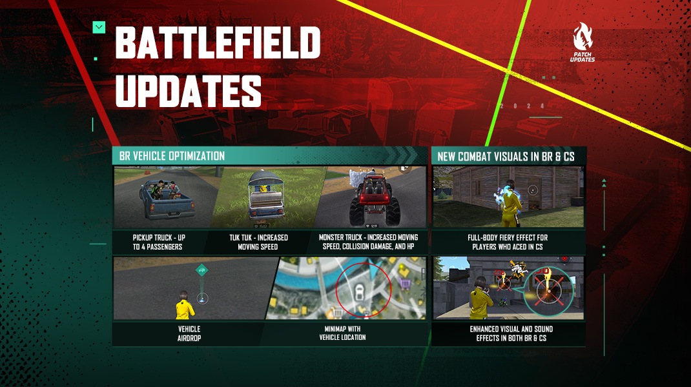
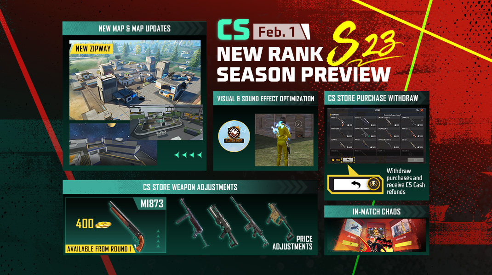
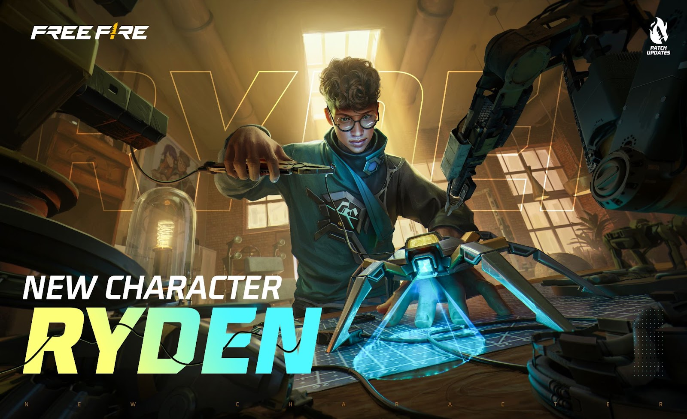
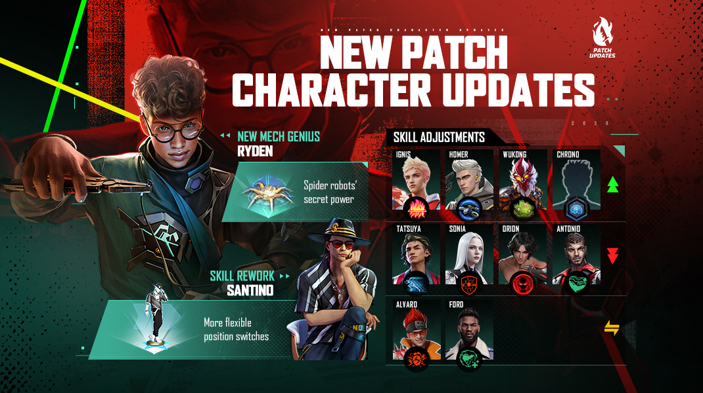
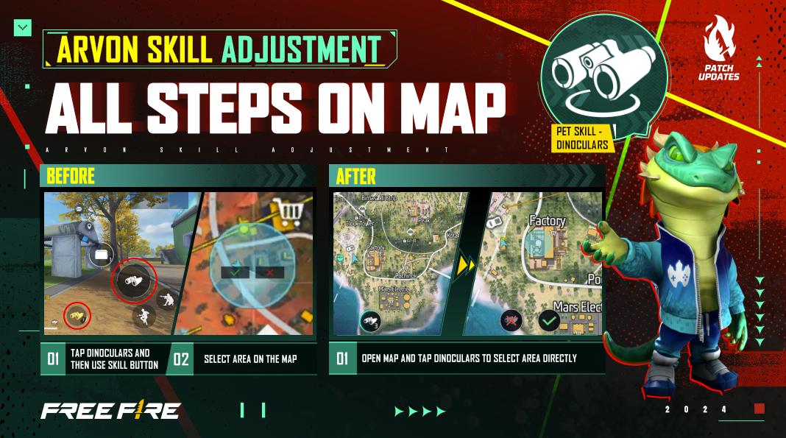
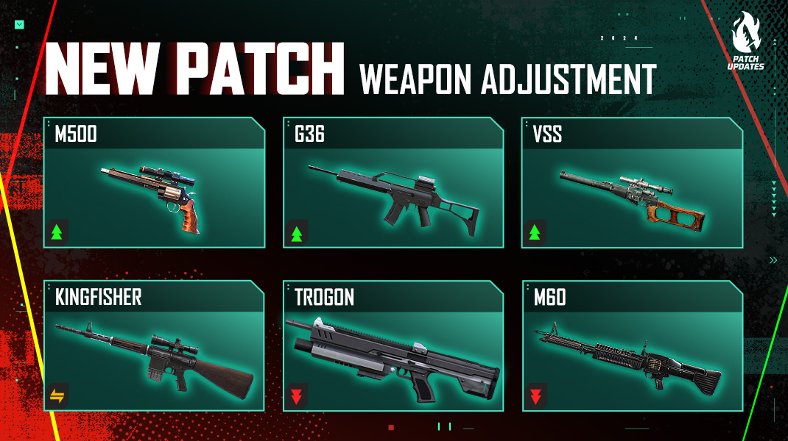

# Free Fire · OB43 · 2024 年 1 月补丁

- 公告日期：2024-01-22
- 官方来源：[Free Fire 2024 年 1 月补丁 Patch Notes](https://ff.garena.com/en/article/1306/)
- 审阅日期：2026-09-18
- 16 个分类小节；64 项说明及表格行；8 张官方公告插图。

本篇 BR、CS、地图、装备、角色武器与局内操作详细整理；其他独立玩法及局外系统保留目录摘要。不是全部历史版本。

版本节点采用公告日期。分期开启、预告及未公布日期的事项按各项备注；公告没有给出当前仍保留的承诺。 官方公告摘要给出的补丁日期为 2024-01-24；各项分期开放仍以正文说明为准。

## BR · 大逃杀

### 战斗特质：BR 五套升级奖励

- 归属：BR · 大逃杀 / 活动覆盖
- 原文小节：The Chaos > Combat Trait (Loadout Redesigned)
- 时间：上线日期未公布

Chaos 活动官方主题图。原文：Gameplay > Chaos Events。[官方原图](https://lh7-us.googleusercontent.com/nnpSOaEXuYIxV4H-_xwQjiHVvMRrXuRHJm2RagcYa52JHYcz__kcwYQ2pQB3pG4DN26SevhPwz5eS75MM1cf211CvjSw0Ei7w_oaKOqV8yTKHXpBvB8hchcGxHh84n_-MrLw2tRH-0lz_jKeojkBwWw) · 1400×700。

- 活动期间战斗特质替代旧战备，五选一、各 3 级；移动、淘汰、助攻、治疗及扶起积累经验；进场直接获得 1 级奖励，每次升级给该级物品。
- 猎人：悬赏令 → 400 金币 → 悬赏装置。
- 探索者：秘密线索 → 吉普空投 → 轻型无人机。
- 机械师：腿袋 → 400 金币 → Portal Go。
- 守护者：篝火 → 炮塔 → 新补给箱。
- 均衡者：秘密线索 → 400 金币 → Horizaline。
- 活动不消耗原有战备，结束后恢复原战备；具体上线时间待后续官方公告。

### 新地平线整体及 BR 路线

- 归属：BR · 大逃杀 / 常规调整
- 原文小节：Map > NeXTerra Rework
- 时间：本项未单独提供精确生效日期；使用公告日期索引。

新地平线地图重做总览。原文：Map > NeXTerra Rework。[官方原图](https://lh7-us.googleusercontent.com/QYn4W8OYbRWuufOyyvJYcn1XjrTomPf_7tra9pyq52HInsPLxxopL2WHrBhWGgKc-k5ZAwzbfw7drqZDy4IDrjL5rOnCs6OnRzeI4RKF79lm2MEzOCvXLZ9d1ZRxV1UMdwQBknjvSep7EYnUfIYmIw8) · 1070×600。

- Zipway 保留滑索基础，改为工业园，新增建筑和物资点；在下个 CS 赛季进入团竞。
- Mortar Ruins 缩短建筑间距离、补充路线；Farmtopia、Robo Museum、Grav Labs—Deca Square、Plazaria 左侧等外围增加或集中房屋。
- Turbine 增加建筑，Boxing Gym 成为正式命名区域；右侧沙漠缩小并增加草地；调整屋顶形状、配色，减小地图文件并优化性能，未提供性能数值。

### 七类载具调整与状态提示

- 归属：BR · 大逃杀 / 常规调整
- 原文小节：Battle Royale > Vehicle Adjustments
- 时间：本项未单独提供精确生效日期；使用公告日期索引。

BR 载具、车辆空投及 BR/CS 战斗反馈。原文：Battle Royale / Combat Feedback Optimization。[官方原图](https://lh7-us.googleusercontent.com/c1u3JjK401kAfvxxd4LZHsc2jAFKrbW9nANmhjTjhwTJl77pbi5hqoUETaxn9L6h0JX4qk3XBRiqQnKc8LjJ4Jhb-BOvHHluWsVIt4-2kO0lZ5eNTfEFunhLR0z2iMTqF2D79FXeTjBxriB4H8qwHxg) · 1070×600。

- 皮卡改为四座，增加 HP、略增撞击伤害；吉普提高速度、撞击伤害和 HP；嘟嘟车提高加速度、速度和 HP。
- 两栖车提高速度和 HP；怪物卡车大幅增加撞击伤害和 HP，可连续破坏多面冰墙，并提高加速和最高速度。
- 跑车提高 HP、略增撞击伤害；摩托车降低撞击伤害。公告未给出这些变化的数值。
- 低 HP 载具增加 UI 提示；小地图显示附近载具，并以队友颜色标识驾驶者。

### 战利品、怪物卡车空投与能量剂

- 归属：BR · 大逃杀 / 常规调整
- 原文小节：Battle Royale > Other Adjustments
- 时间：本项未单独提供精确生效日期；使用公告日期索引。

- 相邻战利品盒合并显示；出生舱地图显示航线。
- 新增怪物卡车空投道具，使用后 2 秒召唤；每个高物资区至少 1 个。
- 能量剂持续时间 10→30 秒。

### BR 战备调整

- 归属：BR · 大逃杀 / 常规调整
- 原文小节：Gameplay > Loadout Adjustments
- 时间：本项未单独提供精确生效日期；使用公告日期索引。

- 空投援助冷却 600→400 秒；淘汰减少 60 秒，每造成 5 点伤害减少 1 秒；空投提供 3 级武器。
- 秘密线索头盔/背心 2→3 级，同时提供冰墙芯片、跳台、600 金币及下一个宝箱线索。

## CS · 枪王对决

### 战斗特质：CS 五套升级奖励

- 归属：CS · 枪王对决 / 活动覆盖
- 原文小节：The Chaos > Combat Trait (Loadout Redesigned)
- 时间：上线日期未公布

- CS 每回合开始额外获得少量经验，升级机制与活动相同。
- 猎人：护甲箱 → 超级能量剂和冰枪 → 秘密集市移速增益。
- 探索者：侦察 → 轻型无人机和干扰器 → 治疗轻型无人机。
- 机械师：腿袋 → 冰冻闪光弹或冰墙融化器 → 自动炮塔。
- 守护者：篝火 → 治疗手枪和 EP 恢复增益 → 快速 EP 转换。
- 均衡者：补给箱 → 超级医疗包 → 4 级背心。
- 与 BR 特质一起限时替代原战备，具体上线时间未公布。

### 团竞点位重做

- 归属：CS · 枪王对决 / 常规调整
- 原文小节：Map > Grav Labs / Farmtopia / Deca Square / Other Adjustments
- 时间：本项未单独提供精确生效日期；使用公告日期索引。

CS 新赛季：地图、撤销购买与商店调整。原文：Clash Squad。[官方原图](https://lh7-us.googleusercontent.com/sBEoS_GcRdwMhT6EnDva9xl9vtJRjnCFdmnZz4_cDdi2zgDVv3L-4nN9KnvWNCPwmoUgKAMWD7q3AlzrqDt0Yb1OCh0VWvsEu2CC8xY4xRhosdkRqTjjpgqDTo1U_-CVPCRlx52lx71wGUm8cqBGXQo) · 1070×600。

- Grav Labs 调整高度、斜坡与障碍，增加反制高点的空间。
- Farmtopia 调整二层障碍、移动平台高度和长度，一层传送带增加掩体。
- Deca Square 调整房屋、传送门朝向和掩体；Zipway 新区域在下个 CS 赛季加入。
- 百慕大 Hangar 移除影响狙击位置的树木。

### 团竞任务与局内随机事件

- 归属：CS · 枪王对决 / 活动覆盖
- 原文小节：Clash Squad > In-Match Quests
- 时间：预定开放：2024-04-01

- 预定 4 月 1 日开放，任务可能要求远距离淘汰、所有玩家累计使用指定物品、所有玩家累计爆头或达到特定回合；以冲锋枪/霰弹枪开局的条件会对应快速缩圈等事件。
- 事件可改变安全区速度、商店、开局高级装备和随机增益；具体赛季内容等待后续公告，不补造未公开数值。

### 撤销购买、商店及空投

- 归属：CS · 枪王对决 / 常规调整
- 原文小节：Clash Squad > Undo Purchase / Other Adjustments
- 时间：撤销购买、电子空投暂时移除：2024-02-01

- 2 月 1 日开放撤销购买：按购买顺序倒序撤销，只可撤回仍在背包内、未丢弃的物品；蘑菇、秘密集市增益、口袋商店及队友代购不支持。
- 点货币按钮可告知队友当前余额；特殊模式加载时增加说明；2 月 1 日暂时移除电子空投。
- M1873 改为副武器、400；Bizon 1300→1500，Thompson 1400→1300，PARAFAL 1500→1400，Vector 2400→2200，单位为团竞货币。
- 空投援助全队奖励 300→400；悬赏令每次淘汰奖励 100→200。

### 异常对局判定

- 归属：CS · 枪王对决 / 常规调整
- 原文小节：Game Environment > Other Adjustments
- 时间：本项未单独提供精确生效日期；使用公告日期索引。

- CS 排位检测到作弊时整局无效、双方不增减星，未作弊队额外获得保护分；时长异常短的排位也判无效，胜方不得星。属于排位结算规则，不计为战斗道具。

## 通用局内调整

### Chaos 投票事件

- 归属：通用局内调整 / 活动覆盖
- 原文小节：The Chaos > Chaos Events
- 时间：本项未单独提供精确生效日期；使用公告日期索引。

原文通用章节或明确跨模式内容；未单列 BR/CS 例外时不推定全部模式完全相同。

- 玩家投票决定事件；每轮投票公布后在局内生效，持续至活动结束，活动结束后仍可能随机发生。
- 事件包括 BR/CS 空投变化、主动技能大幅缩短冷却、军械库自动开门、售货机换成技能卡和 Portal Go 等物品、首圈出现在特殊位置、补给任务回归并简化局内任务。
- 属于活动覆盖；公告没有给出所有事件的具体数值或全套开放日期。

### Ryden 与角色平衡

- 归属：通用局内调整 / 常规调整
- 原文小节：Characters
- 时间：本项未单独提供精确生效日期；使用公告日期索引。

原文通用章节或明确跨模式内容；未单列 BR/CS 例外时不推定全部模式完全相同。

Ryden 新角色与蜘蛛技能。原文：Characters > New Character。[官方原图](https://lh7-us.googleusercontent.com/pGkOgzMewFrLwNeDy1-R39HrF2C-ItE3g-NJkmWrHqp34IVr2TnIcs-dh7X-Fu8RXpDQ0pk1hcPdXf-O1R8vS_dyfvhnzFruNhnm0baSbbBa4wlXzOTwl1_SD8TPc5lGk_-fajz-desAUd6X28CYVpE) · 1600×978。

角色技能平衡总览。原文：Characters > Character Balance Adjustments。[官方原图](https://lh7-us.googleusercontent.com/54VTF-2Bb3oEPOcxZmZhqbUobdDY9rrfB5PbjbC1E5swX_MmaQytWeEYSdr7AZ2Z4VongzTMhWqOYLpisBnLPqz5SRiNYmRc4zaIS0I3wAKaV-IfGHC9UTggz4_8avxPvQ9IANIXSnuGTGfBB2yMyOI) · 1070×600。

Arvon 技能改为直接在小地图操作。原文：Characters > Other Adjustments。[官方原图](https://lh7-us.googleusercontent.com/7XEoNaBdksHc-hRgPWQm6vd-8mzwoQnA6Lr8lKkMAT4bkF2e4jjC79sKnCLrd_7612d2j6ikXFpcFxqwMgmcXjQMx-EOQR5ayzx_emDqOR-o8XkVJUHYF19E3Or-Vml0mKdfB6iistQsCorqro-rDk4) · 1068×595。

- Ryden：释放可破坏的蜘蛛，持续 30 秒，可在前 10 秒内让其停下；捕获 5 米内首个敌人，减速 80%，每秒损失 10 HP、持续 3 秒，冷却 75 秒。
- Sonia：移除护盾期间淘汰敌人自救的效果；致命伤后僵直无敌 0.4 秒，获得 50 护盾，持续 3→2 秒后淘汰，冷却 180 秒。原网页有删除线，按修改后的规则整理。
- Santino：200 HP 假人移动 12 秒；60 米内可换位，两次换位间隔 3 秒、最多 2 次；标记破坏假人的敌人 5 秒，冷却 60 秒。
- Orion：300 能量，消耗 200，3 秒免伤且不能攻击，吸取 5 米内敌人 10 HP，移速 -20%，冷却 3 秒。
- Ignis：墙宽 10→12 米、持续 8→10 秒、防具耐久损失 10%→20%，冷却 70→60 秒。
- Homer：爆炸直径 4→5 米、减速 60%→40%、射速削弱 35%→40%，持续 5 秒，25 伤害，冷却 90→60 秒，搜索 100 米。
- Tatsuya：充能 3→2 次，每次冲刺 0.3 秒、间隔 1 秒、45 秒恢复一次。
- Antonio：护盾 40→30，脱战后恢复；Chrono：冷却 110→75 秒，护盾 800、持续 6 秒，不能从内向外射击；Wukong 移除变身的 5% 移速惩罚。
- K 不再重置 Ford；Alvaro 觉醒手雷分裂轨迹变细；Arvon 无需预先选择道具，可直接在小地图使用技能；Homer 锁定后不受障碍影响；修复 Iris 穿透伤害问题。

### 武器平衡

- 归属：通用局内调整 / 常规调整
- 原文小节：Weapon and Balance
- 时间：本项未单独提供精确生效日期；使用公告日期索引。

原文通用章节或明确跨模式内容；未单列 BR/CS 例外时不推定全部模式完全相同。

武器数值调整官方总览。原文：Weapon and Balance。[官方原图](https://lh7-us.googleusercontent.com/5f49M0pKFsuBFk92TN-GImxSpyuMcSzmViJj9hq6a2leFUUT2tms-Y48VBIzjsEYuXJJt28r-U-jYpQoyltCjMbbrFFVt_oB3_dqer1ECfGYskHBKBluM4e4h2ew6Zr8vx9sdtF6ndptRd_eGX8rMvw) · 1070×600。

- Kingfisher 伤害 +7%、射程 -10%；G36 射程模式伤害 +3%、精度 +5%；M500 爆头伤害 +5%。
- M60-I/II/III 最大伤害 -10%，叠加层数 5→4；Trogon 伤害 -7%、弹匣 12→9；VSS 射速 +10%。

### 战斗反馈、倒地和地图信息

- 归属：通用局内调整 / 常规调整
- 原文小节：The Chaos > Combat Feedback Optimization / Gameplay > Other Adjustments
- 时间：本项未单独提供精确生效日期；使用公告日期索引。

原文通用章节或明确跨模式内容；未单列 BR/CS 例外时不推定全部模式完全相同。

- 连续击倒音调逐步提高，爆头击倒/淘汰有火焰特效；低于 30 HP 时击倒敌人触发特别提示。
- CS 个人单回合全歼获得角色和队伍栏火焰特效，持续至下回合购买阶段结束。
- 新增伤害明细与淘汰倒计时；倒地后可点击放弃，开火按钮改为求救。
- 优化血条视觉，BR 小地图显示附近战备箱，突出可交互物标记；百慕大和新地平线小地图高清化。
- 跳台发射延迟降低；滑索使用间隔、延迟和落地硬直降低；新地平线 Grav Labs 不再有落地硬直。

### 投掷、拾取、冲刺和自定义 HUD

- 归属：通用局内调整 / 常规调整
- 原文小节：Gameplay > Other Adjustments / System > Custom HUD Optimizations
- 时间：本项未单独提供精确生效日期；使用公告日期索引。

原文通用章节或明确跨模式内容；未单列 BR/CS 例外时不推定全部模式完全相同。

- 投掷轨迹增加落点提示并提高准确性；跳跃射击动画更流畅。
- 队友地雷显示蓝色，本人及敌人的仍是绿色；装备 Mini Uzi 自动拾取少量弹药。
- 非战斗时，低级可升级武器可被可用的更高级同类自动替换；CS 不再自动拾取 USP。
- 可设置显示/隐藏队友姓名；摇杆更短拖动距离、更大触发区域可冲刺，跳跃中也可触发，落地立即冲刺。
- HUD 控制面板可折叠，并增加按钮位置微调控制器。
- 局内可通过快捷消息显示武器荣耀称号；CS 请求代购时可展示该枪称号。

### 观战与举报入口

- 归属：通用局内调整 / 常规调整
- 原文小节：System > Friend Spectating System / Game Environment > Report System Optimization
- 时间：本项未单独提供精确生效日期；使用公告日期索引。

原文通用章节或明确跨模式内容；未单列 BR/CS 例外时不推定全部模式完全相同。

- 10 级以上可从好友列表观战并预约、点赞、发表情、复制预设；观战高段位好友另有等级/段位要求，可在设置关闭被观战。
- 被淘汰后观战存活队友时，更方便举报淘汰自己的可疑玩家；自定义房间支持公共多人语音频道。

## 其他玩法与局外内容（目录摘要）

### 局外及其他玩法目录

Lone Wolf 双主动技能和训练场战斗统计/商店归独立玩法。局外有愿望单、公会荣誉/周报、1 月 29 日 12:00 GMT+8 开放的招募推荐/快速加入/标签、离线私聊与公会记录（保存 1 周，上限 100/500 条）、排位特殊任务奖励、好友排名与休赛倒计时、违规奖励取消、账户解绑及登录提醒。Craftland 包含第一人称、狙击、团队死斗、感染 BR、愚人节地图；地图勾选列表、个人页作品、推荐通知、创作者激励/反馈、自定义观战及 CS 模板的移动圈/代购/升级物品/空投配置。

原文目录：Lone Wolf; Training Grounds; System; Rank; Game Environment; Craftland

## 官方图片索引

正文图片按相关小节展示，版本总览及其他章节插图另列；同一原图只嵌入一次。

- [Ryden 新角色与蜘蛛技能](https://lh7-us.googleusercontent.com/pGkOgzMewFrLwNeDy1-R39HrF2C-ItE3g-NJkmWrHqp34IVr2TnIcs-dh7X-Fu8RXpDQ0pk1hcPdXf-O1R8vS_dyfvhnzFruNhnm0baSbbBa4wlXzOTwl1_SD8TPc5lGk_-fajz-desAUd6X28CYVpE) · 1600×978 · 本地 `assets/ff-patches/1306-01.jpg`
- [角色技能平衡总览](https://lh7-us.googleusercontent.com/54VTF-2Bb3oEPOcxZmZhqbUobdDY9rrfB5PbjbC1E5swX_MmaQytWeEYSdr7AZ2Z4VongzTMhWqOYLpisBnLPqz5SRiNYmRc4zaIS0I3wAKaV-IfGHC9UTggz4_8avxPvQ9IANIXSnuGTGfBB2yMyOI) · 1070×600 · 本地 `assets/ff-patches/1306-02.jpg`
- [Arvon 技能改为直接在小地图操作](https://lh7-us.googleusercontent.com/7XEoNaBdksHc-hRgPWQm6vd-8mzwoQnA6Lr8lKkMAT4bkF2e4jjC79sKnCLrd_7612d2j6ikXFpcFxqwMgmcXjQMx-EOQR5ayzx_emDqOR-o8XkVJUHYF19E3Or-Vml0mKdfB6iistQsCorqro-rDk4) · 1068×595 · 本地 `assets/ff-patches/1306-03.jpg`
- [Chaos 活动官方主题图](https://lh7-us.googleusercontent.com/nnpSOaEXuYIxV4H-_xwQjiHVvMRrXuRHJm2RagcYa52JHYcz__kcwYQ2pQB3pG4DN26SevhPwz5eS75MM1cf211CvjSw0Ei7w_oaKOqV8yTKHXpBvB8hchcGxHh84n_-MrLw2tRH-0lz_jKeojkBwWw) · 1400×700 · 本地 `assets/ff-patches/1306-04.jpg`
- [新地平线地图重做总览](https://lh7-us.googleusercontent.com/QYn4W8OYbRWuufOyyvJYcn1XjrTomPf_7tra9pyq52HInsPLxxopL2WHrBhWGgKc-k5ZAwzbfw7drqZDy4IDrjL5rOnCs6OnRzeI4RKF79lm2MEzOCvXLZ9d1ZRxV1UMdwQBknjvSep7EYnUfIYmIw8) · 1070×600 · 本地 `assets/ff-patches/1306-05.jpg`
- [BR 载具、车辆空投及 BR/CS 战斗反馈](https://lh7-us.googleusercontent.com/c1u3JjK401kAfvxxd4LZHsc2jAFKrbW9nANmhjTjhwTJl77pbi5hqoUETaxn9L6h0JX4qk3XBRiqQnKc8LjJ4Jhb-BOvHHluWsVIt4-2kO0lZ5eNTfEFunhLR0z2iMTqF2D79FXeTjBxriB4H8qwHxg) · 1070×600 · 本地 `assets/ff-patches/1306-06.jpg`
- [CS 新赛季：地图、撤销购买与商店调整](https://lh7-us.googleusercontent.com/sBEoS_GcRdwMhT6EnDva9xl9vtJRjnCFdmnZz4_cDdi2zgDVv3L-4nN9KnvWNCPwmoUgKAMWD7q3AlzrqDt0Yb1OCh0VWvsEu2CC8xY4xRhosdkRqTjjpgqDTo1U_-CVPCRlx52lx71wGUm8cqBGXQo) · 1070×600 · 本地 `assets/ff-patches/1306-07.jpg`
- [武器数值调整官方总览](https://lh7-us.googleusercontent.com/5f49M0pKFsuBFk92TN-GImxSpyuMcSzmViJj9hq6a2leFUUT2tms-Y48VBIzjsEYuXJJt28r-U-jYpQoyltCjMbbrFFVt_oB3_dqer1ECfGYskHBKBluM4e4h2ew6Zr8vx9sdtF6ndptRd_eGX8rMvw) · 1070×600 · 本地 `assets/ff-patches/1306-08.jpg`

## 版本关联来源

### [OB43官方编号依据](https://ff.garena.com/en-pk/article/1312/)

官方更新流程明确OB43、NexTerra2.0、武器角色调整；地区更新1月24日，本篇公告1月22日不变。

## 原文目录（对照用）

- Characters
- New Character
- Character Rework
- Character Balance Adjustments
- Other Adjustments
- Gameplay
- Chaos Events
- Brand new Chaos Events:
- Combat Trait (Loadout Redesigned)
- Combat Feedback Optimization
- Map
- NeXTerra Rework
- Zipway
- Grav Labs
- Farmtopia
- Mortar Ruins
- Buildings in the Open Fields Are Now More Clustered
- Other Adjustments in NeXTerra
- Other Map Adjustments
- Battle Royale
- Vehicle Optimization
- Other Adjustments
- Clash Squad
- CS In-Match Quests
- CS Store Purchase Withdrawal
- Other Clash Squad Adjustments
- Weapon and Balance
- Weapon Adjustments
- Loadout Adjustments
- Mode
- Other Optimizations
- System
- Rank
- Game Environment
- Craftland
