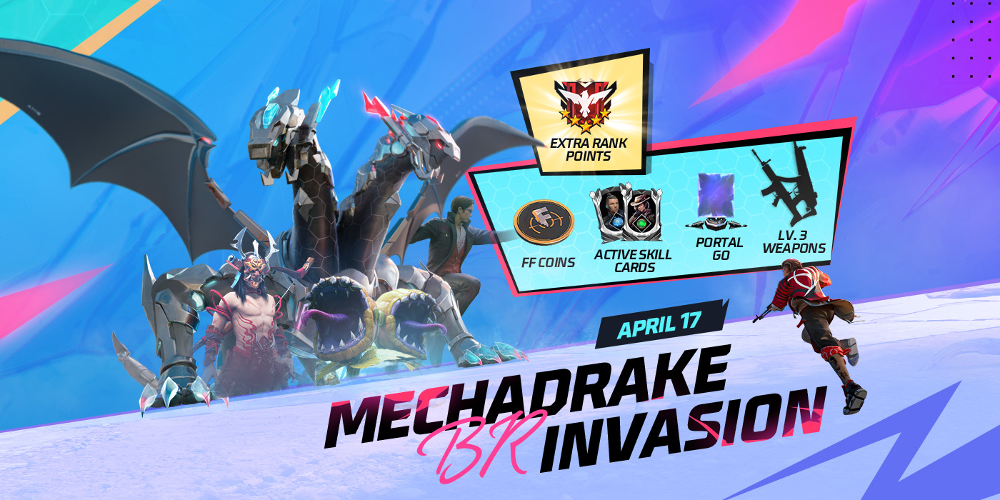
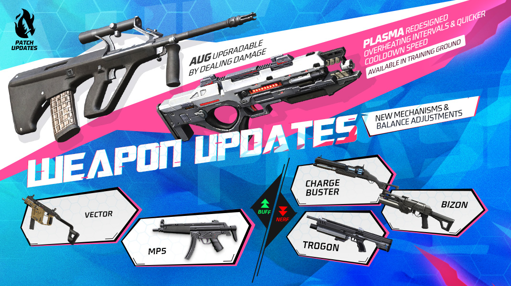
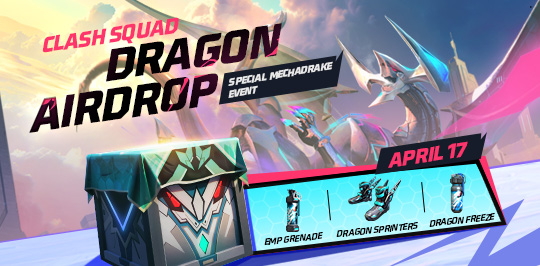
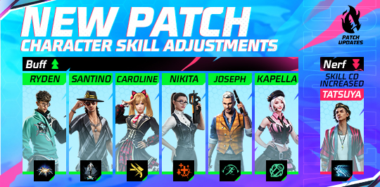
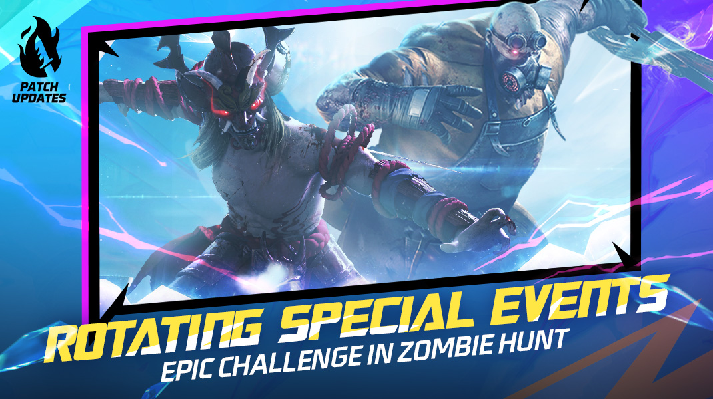
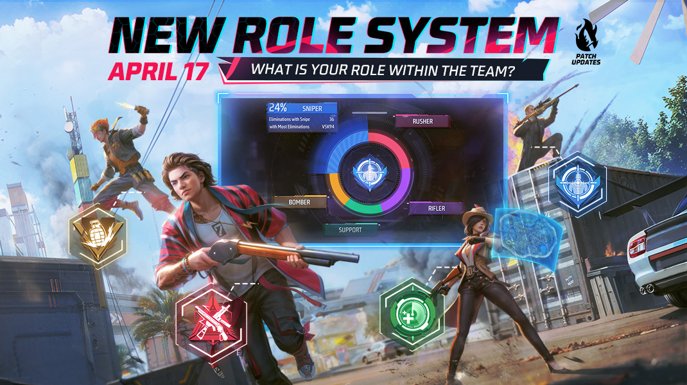

# Free Fire · OB44

- 公告日期：2024-04-16
- 官方来源：[OB44 Patch Notes](https://ff.garena.com/en/article/1332/)
- 审阅日期：2026-09-19
- 35 个分类小节；44 项说明及表格行；6 张官方公告插图。

主流程通读全篇，逐项拆分BR/CS/shared，复核数值与6张正文图；补齐局外处置，保留图内日期及PLASMA分期，历史覆盖仍未闭合。

公告日 2024-04-16；正文明确 PLASMA-X 于 4月17日进入训练场、5月1日新 BR 排位赛季开始后进入 BR；其余项目未给统一精确生效时刻。

## BR · 大逃杀

### BR：反派入侵与机甲龙试炼

- 归属：BR · 大逃杀 / 活动覆盖
- 原文小节：Battle Royale > New: Villain Conquest / New: Mechadrake Trial
- 时间：同页配图标注2024-04-17；仅BR排位Bermuda，未给结束日。

按原文明确范围，通用章节不推定全部独立玩法适用。

BR机甲龙入侵：4月17日及奖励示例。原文：Battle Royale。[官方原图](https://lh7-us.googleusercontent.com/hM2MTP-29_nkGZCBZ-2HHn2kZEksrZPfmM4kSiGrPecIsQqlLCGdR1HUZAtCNDwM3YbfPbzfv3wPYc_amdMTOFRdrX4f9Ds6wdlk1-4y2vD50p4yuy6Bq_M8K_eY9ThFKw6Lq5j_HwkiYR4tRKhE_OE) · 1400×700。

- 百慕大 BR 排位地图随机出现 3 个反派入侵点，位置会在地图上标记；玩家到达指定地点并与召唤阵互动即可召唤反派。击败反派获得局内物资和机甲龙点数；每队每局最多获得 1 点。
- 累计 3 个机甲龙点数后，下一场百慕大 BR 排位赛可启动机甲龙试炼；队内任一人拥有 3 点即可让全队启用。
- 在机甲龙试炼中吃鸡后，队伍可在赛后进入机甲龙战；击败机甲龙获得额外排位分，并将机甲龙点数清零。试炼未吃鸡扣除 1 点；试炼中击败反派仍会获得 1 点。
- 配图将战利品示例列为FF币、主动技能卡、Portal Go及三级武器；不推定每次必定全部获得。

### BR：同技能卡充能与冷却刷新

- 归属：BR · 大逃杀 / 常规调整
- 原文小节：Battle Royale > Other Adjustments
- 时间：公告日2024-04-16；未另列具体生效时刻。

按原文明确范围，通用章节不推定全部独立玩法适用。

- 可拾取与预设主动技能相同的主动技能卡：技能当前可用时，额外获得一次充能，可短时间连续使用两次；技能冷却中时，拾取同技能卡会立即刷新冷却。

### BR：Portal Go传送与Energizer

- 归属：BR · 大逃杀 / 常规调整
- 原文小节：Battle Royale > Other Adjustments
- 时间：公告日2024-04-16；未另列具体生效时刻。

按原文明确范围，通用章节不推定全部独立玩法适用。

- Portal Go传至目的地需1秒；使用Energizer不再被打断。

### BR：自动装备冰墙生成器附件

- 归属：BR · 大逃杀 / 常规调整
- 原文小节：Battle Royale > Other Adjustments
- 时间：公告日2024-04-16；未另列具体生效时刻。

按原文明确范围，通用章节不推定全部独立玩法适用。

- 拾取冰墙生成器附件后自动装入附件槽。

### BR：Kalahari售货机与地面掉落

- 归属：BR · 大逃杀 / 常规调整
- 原文小节：Battle Royale > Other Adjustments
- 时间：公告日2024-04-16；未另列具体生效时刻。

按原文明确范围，通用章节不推定全部独立玩法适用。

- Kalahari 售货机新增 Hook Gun，价格 200 FF Coins，每名玩家限购 1 把；其他物品价格也有调整，但正文未列具体价格表。
- 地面战利品移除所有 0 级可升级武器掉落，并提高 1 级可升级武器掉率；新增 VSK94 地面武器掉落；移除 M. Truck 空投落地时的光效。

### PLASMA-X重做与分期开放

- 归属：BR · 大逃杀 / 常规调整
- 原文小节：Weapon and Balance > PLASMA Rework
- 时间：训练场2024-04-17开放；BR于2024-05-01新排位赛季开始后出现，不将4月公告日视作BR上线日。

按原文明确范围，通用章节不推定全部独立玩法适用。

AUG、PLASMA-X与武器平衡。原文：Weapon and Balance。[官方原图](https://lh7-us.googleusercontent.com/YacDKWFO5W6Ynvtros7M7YW9QYwoUSOUjMv-M3oQbCZ5AOAh57aViVRJEKehOaTNC-HYa6X4Q9sKvG2gHjYd7EadtUymHWye-FwuP8aHySmQr4dXIjRYgL2IYTeaa0RzgMq7lfiPcuwSqcHOL_FPJMA) · 1070×600。

- PLASMA-X 不可升级，可从 BR 空投获得。持续使用会积累热量，热量达到 100% 后进入冷却且不能使用；冷却或闲置一段时间会逐渐降温；热量达到 50% 时伤害和射速已达最大，继续升温不再提供额外加成。
- 同页配图还说明过热间隔更长、冷却更快，未给幅度。

### BR：Evo枪Final Shot触发

- 归属：BR · 大逃杀 / 常规调整
- 原文小节：Other Adjustments
- 时间：公告日2024-04-16；未另列具体生效时刻。

按原文明确范围，通用章节不推定全部独立玩法适用。

- 在一定范围内淘汰整队可触发Final Shot特效；原文未给距离值。

## CS · 枪王对决

### CS：龙空投与四种道具

- 归属：CS · 枪王对决 / 活动覆盖
- 原文小节：Clash Squad > New: Dragon Airdrop
- 时间：正文配图标注2024-04-17；未给结束日期。

按原文明确范围，通用章节不推定全部独立玩法适用。

CS龙空投：4月17日。原文：Clash Squad。[官方原图](https://lh7-us.googleusercontent.com/BN0uL1hfptWzES-A7QEB2MTx6ZOR17Zibh9LoHLUqsbITtInzl9sQty8iTmX4qM-SVggp4bcgsQxSQIiAQ85EwLO1_WBTgjJCPF1wl_QrfURkrtP2La7PgjZHCrFOGeBACWHGLAfRoKzcspCdcclKso) · 540×266。

- 机甲龙携带特殊龙空投飞过 CS 上空；玩家射击使其生命值耗尽后会掉落空投，内含龙主题物品。
- 龙霜是强化版 Flash Freeze，命中后连续爆炸 3 次。EMP 手雷爆炸后释放电磁脉冲，在一定范围内关闭敌方小地图并禁止其使用道具。龙跃鞋允许玩家二段跳时在空中冲刺。幼龙会始终跟随玩家；每 10 秒，对成功命中的敌人降低移动速度或攻击速度，或使其持续流血。
- 说明段明确机甲龙不会攻击玩家；其生命值和EMP范围、幼龙减速/流血数值未公布。

### CS：空投保留、物品详情与助攻判定

- 归属：CS · 枪王对决 / 常规调整
- 原文小节：Clash Squad > Other Adjustments
- 时间：公告日2024-04-16；未另列具体生效时刻。

按原文明确范围，通用章节不推定全部独立玩法适用。

- CS 空投在回合结束时不再消失。CS 与训练场的售货机现在点击即可打开物品详情，无需长按；击倒敌人的助攻计时窗口延长。

### CS：购买阶段禁用主动技能

- 归属：CS · 枪王对决 / 常规调整
- 原文小节：Characters > Other Adjustments
- 时间：公告日2024-04-16；未另列具体生效时刻。

按原文明确范围，通用章节不推定全部独立玩法适用。

- CS购买阶段不可使用主动技能。

### CS：Hangar布局平衡

- 归属：CS · 枪王对决 / 常规调整
- 原文小节：Map > Balance Adjustments for Hangar
- 时间：公告日2024-04-16；未另列具体生效时刻。

按原文明确范围，通用章节不推定全部独立玩法适用。

- 调整布局以减少多方向交叉火力，提供较安全的进攻路线；未具体列出改动物件或坐标。

## 通用局内调整

### 角色：Kairos

- 归属：通用局内调整 / 范围未明确
- 原文小节：Characters > New Character > Kairos
- 时间：Paradox活动登场预告，未给日期或完整技能参数；不补入后续版本数值。

按原文明确范围，通用章节不推定全部独立玩法适用。

- 新角色 Kairos（特殊行动）将在 Paradox 活动中登场；正文只说明其在 frenzy 模式攻击会对敌人产生特殊影响，未给出正式技能数值。

### 角色：Tatsuya

- 归属：通用局内调整 / 常规调整
- 原文小节：Characters > Character Balance Adjustments > Tatsuya
- 时间：公告日2024-04-16；未另列具体生效时刻。

按原文明确范围，通用章节不推定全部独立玩法适用。

角色技能平衡。原文：Characters。[官方原图](https://lh7-us.googleusercontent.com/SSMvtpwzpJYY5BIBJUPvizh4PyrC1BHp9V6-RJW_kvFFAkVrX-nJQ9XYLx1es0BlnPr8v34hDTzZLRMwTkg9rhIf73BAYv8Nin7WEN5tHfyAhabJ8M1lCiSzRH4VSVfIhkmbqTRN_602Ur8GnKlOWGg) · 540×266。

- Tatsuya「疾袭」：冲刺持续 0.3 秒，最多储存 2 次，每次间隔冷却 1 秒；补充时间 45 秒→60 秒。

### 角色：Ryden

- 归属：通用局内调整 / 常规调整
- 原文小节：Characters > Character Balance Adjustments > Ryden
- 时间：公告日2024-04-16；未另列具体生效时刻。

按原文明确范围，通用章节不推定全部独立玩法适用。

- Spider Trap：向指定方向放出可被摧毁的爆炸蜘蛛，持续30→60秒；施放后10秒内再次点击可停止移动。捕捉其发现的5米内首个敌人，减速80%，每秒失去10 HP，流血3→5秒；冷却75→60秒。

### 角色：Santino

- 归属：通用局内调整 / 常规调整
- 原文小节：Characters > Character Balance Adjustments > Santino
- 时间：公告日2024-04-16；未另列具体生效时刻。

按原文明确范围，通用章节不推定全部独立玩法适用。

- Santino「形影分身」：生成 200 HP 人偶，自主移动 12 秒→25 秒；60 米内可换位，3 秒内只能换位一次、最多 2 次；摧毁者被标记 5 秒；冷却 75 秒→60 秒。

### 角色：Joseph

- 归属：通用局内调整 / 常规调整
- 原文小节：Characters > Character Balance Adjustments > Joseph
- 时间：公告日2024-04-16；未另列具体生效时刻。

按原文明确范围，通用章节不推定全部独立玩法适用。

- Joseph「银勺」：免疫减速、标记、技能沉默等干扰，并获得 10% 移速加成 5 秒；冷却 60 秒→45 秒。

### 角色：Nikita

- 归属：通用局内调整 / 常规调整
- 原文小节：Characters > Character Balance Adjustments > Nikita
- 时间：公告日2024-04-16；未另列具体生效时刻。

按原文明确范围，通用章节不推定全部独立玩法适用。

- Nikita「枪械专家」：换弹速度提升 20%→30%；每次命中使目标治疗效果降低 30%，持续 10 秒，最高降低 30%。

### 角色：Caroline

- 归属：通用局内调整 / 常规调整
- 原文小节：Characters > Character Balance Adjustments > Caroline
- 时间：公告日2024-04-16；未另列具体生效时刻。

按原文明确范围，通用章节不推定全部独立玩法适用。

- Caroline「敏捷」：持霰弹枪时移速加成 13%→16%。

### 角色：Kapella

- 归属：通用局内调整 / 常规调整
- 原文小节：Characters > Character Balance Adjustments > Kapella
- 时间：公告日2024-04-16；未另列具体生效时刻。

按原文明确范围，通用章节不推定全部独立玩法适用。

- Kapella「治愈之歌」：扶起队友时给予 80 HP 护盾，移速加成 10%→80%；成功扶起后效果在 4 秒内衰减；倒地队友流血速度降低 35%，效果不叠加。

### 觉醒Alok：拾取音符音效

- 归属：通用局内调整 / 常规调整
- 原文小节：Characters > Other Adjustments
- 时间：公告日2024-04-16；未另列具体生效时刻。

按原文明确范围，通用章节不推定全部独立玩法适用。

- 拾取觉醒Alok音符时新增音效。

### 战斗高光即时提示

- 归属：通用局内调整 / 常规调整
- 原文小节：Gameplay > More Instant Feedback for Your Highlight Moments
- 时间：公告日2024-04-16；未另列具体生效时刻。

按原文明确范围，通用章节不推定全部独立玩法适用。

- 新增15种战斗高光即时提示；未逐一列出触发条件。

### 情境推荐与自动快捷消息

- 归属：通用局内调整 / 常规调整
- 原文小节：Gameplay > Optimized Suggestions for In-Match Communication / More Types of Auto-Triggered Quick Messages
- 时间：公告日2024-04-16；未另列具体生效时刻。

按原文明确范围，通用章节不推定全部独立玩法适用。

- BR 与 CS 开局显示「一起吃鸡吧」快捷消息；全队回应后触发特殊动画。造成伤害时显示「敌人在这里」，点击可标记并记录最近一次造成伤害的位置。快捷消息会按当前情境推荐，例如低血量且没有医疗包时将「我需要医疗包」置顶；新增多种战斗情境和部分标记目标的自动快捷消息。

### 灵敏度与倒地标记

- 归属：通用局内调整 / 常规调整
- 原文小节：Gameplay > Other Adjustments
- 时间：公告日2024-04-16；未另列具体生效时刻。

按原文明确范围，通用章节不推定全部独立玩法适用。

- 灵敏度上限 200；增强呼救倒地队友头顶指示器；玩家倒地时 Pin 按钮自动变为红色标记按钮，用于标记发现的敌人。

### 载具交互与HUD设置

- 归属：通用局内调整 / 常规调整
- 原文小节：Gameplay > Other Adjustments
- 时间：公告日2024-04-16；未另列具体生效时刻。

按原文明确范围，通用章节不推定全部独立玩法适用。

- 载具现在可用于占领军械库、空投和复活点，也可与 Coin Machine 互动；移除载具设置中的自由视角，新增载具自定义 HUD。

### 地图涂鸦与Zipway经济设施

- 归属：通用局内调整 / 常规调整
- 原文小节：Map > Other Map Adjustments
- 时间：公告日2024-04-16；未另列具体生效时刻。

按原文明确范围，通用章节不推定全部独立玩法适用。

- Bermuda、Purgatory、NeXTerra新增FFWS主题涂鸦。
- NeXTerra的Zipway调整售货机位置并新增Coin Machines。

### AUG：伤害驱动升级

- 归属：通用局内调整 / 常规调整
- 原文小节：Weapon and Balance > The New Upgradable AUG
- 时间：公告日2024-04-16；未另列具体生效时刻。

按原文明确范围，通用章节不推定全部独立玩法适用。

- AUG 可按持有者用该枪造成的累计伤害升级：AUG-I/AUG-II/AUG-III 阈值分别为 200/400/800 DMG；不能用升级芯片升级；升级后伤害和护甲穿透提高，最高 AUG-III。

### Bizon平衡

- 归属：通用局内调整 / 常规调整
- 原文小节：Weapon and Balance > Weapon Adjustments > Bizon
- 时间：公告日2024-04-16；未另列具体生效时刻。

按原文明确范围，通用章节不推定全部独立玩法适用。

- 伤害-10%，弹匣30→25。

### Trogon平衡

- 归属：通用局内调整 / 常规调整
- 原文小节：Weapon and Balance > Weapon Adjustments > Trogon
- 时间：公告日2024-04-16；未另列具体生效时刻。

按原文明确范围，通用章节不推定全部独立玩法适用。

- 伤害-8%，射程-5%。

### Charge Buster平衡

- 归属：通用局内调整 / 常规调整
- 原文小节：Weapon and Balance > Weapon Adjustments > Charge Buster
- 时间：公告日2024-04-16；未另列具体生效时刻。

按原文明确范围，通用章节不推定全部独立玩法适用。

- 伤害-10%，最大蓄力持续时间-25%，移速-5%，满蓄力所需时间+30%。

### Double Vector平衡

- 归属：通用局内调整 / 常规调整
- 原文小节：Weapon and Balance > Weapon Adjustments > Double Vector
- 时间：公告日2024-04-16；未另列具体生效时刻。

按原文明确范围，通用章节不推定全部独立玩法适用。

- 双持弹匣20→23，精准度+5%，射程+15%。说明段称damage boost，但明细未列伤害数值；不据此补造伤害增量。

### Vector平衡

- 归属：通用局内调整 / 常规调整
- 原文小节：Weapon and Balance > Weapon Adjustments > Vector
- 时间：公告日2024-04-16；未另列具体生效时刻。

按原文明确范围，通用章节不推定全部独立玩法适用。

- 弹匣20→23。

### MP5平衡

- 归属：通用局内调整 / 常规调整
- 原文小节：Weapon and Balance > Weapon Adjustments > MP5
- 时间：公告日2024-04-16；未另列具体生效时刻。

按原文明确范围，通用章节不推定全部独立玩法适用。

- 伤害+8%；说明段指出除MP5-III外其他变体较弱，但明细未标明排除哪一级，不据此扩写每级适用范围。

### PARAFAL平衡

- 归属：通用局内调整 / 常规调整
- 原文小节：Weapon and Balance > Weapon Adjustments > PARAFAL
- 时间：公告日2024-04-16；未另列具体生效时刻。

按原文明确范围，通用章节不推定全部独立玩法适用。

- 弹匣18→20，开镜速度+10%。

### 举报语音即时屏蔽与反馈

- 归属：通用局内调整 / 常规调整
- 原文小节：Game Environment > Instant Feedback about Voice Reports
- 时间：公告日2024-04-16；未另列具体生效时刻。

按原文明确范围，通用章节不推定全部独立玩法适用。

- 优化语音违规处理和反馈速度；举报后不再听到该玩家语音。
- 处罚通过游戏邮件通知；若在本局内处罚，显示更醒目的局内弹窗。

### 推荐画质与40 FPS选项

- 归属：通用局内调整 / 常规调整
- 原文小节：Other Adjustments
- 时间：公告日2024-04-16；未另列具体生效时刻。

按原文明确范围，通用章节不推定全部独立玩法适用。

- 设置新增推荐画质及增强帧率40 FPS选项。

## 其他玩法与局外内容（目录摘要）

### 飞机舱内社交交互

飞机舱内可通过攻击或点击其他玩家查看其资料、服装，并发送表情和好友申请。

原文目录：Battle Royale > Other Adjustments

### Zombie Hunt与轮换事件

Zombie Hunt 回归并加入新章节地图、阶段和首领技能；玩家组队选择增益并共同击败首领。 Rift Raiders 为 4v4 对抗：先召唤并击败最终首领的队伍获胜。击杀僵尸收集其掉落的邪恶石，可召唤最终首领，也可把流浪僵尸部署到对方战场阻碍其召唤；传送门解锁后可进入敌方一侧直接干扰。 Hunting Spree 中击杀僵尸升级并选择更多增益，在时限内击败的首领越多，所得分数越高；Double Evil 保留同时击败两个首领的玩法；Dungeon Ascent 回归并加入新阶段和首领技能。新增 Zombie Hunt 专属奖励与成就。

原文目录：Mode > Zombie Hunt

### 训练场调整

训练场 Combat Zone 每次淘汰回复 40 HP/s；靶场现在可拾取主动技能卡以测试不同主动技能。

原文目录：Mode > Other Adjustments

### Role定位系统

Role 系统根据排位赛使用的武器、技能及其他局内行为分析五类定位：突击手、狙击手、爆破手、支援和步枪手；资料页显示各定位占比与本赛季专精等级，选定定位可显示在资料、好友邀请列表和匹配加载界面。 同页配图标注2024-04-17。

原文目录：System > Role System

### IntelliMate提醒与处理

界面重做；提醒周/月会员每日奖励并可在弹窗领取，提醒会员及Evo Access将到期；好友请求、公会邀请和申请可在弹窗处理。

原文目录：System > IntelliMate Updates

### 邀请状态与好友高光

Ready to Team自动接受组队并加入；Do Not Disturb自动拒绝；好友横幅展示近期排位连胜、MVP、大段位突破与CS Ace。

原文目录：System > Invitation List Optimization and Friends’ Recent Highlights

### 公会活动与门槛

公会组队活动点：2 名公会成员组队每分钟 10 点，每增加 1 名公会成员额外 +20%；公会战开放日改为周二、周四、周六，三时段算同一轮；新增参与奖励、Competitive/Casual 标签，降低升级及维持 Lv.6 所需活动点。

原文目录：System > Guild Optimizations

### 周/月会员与Evo Access

新增更低价Weekly Membership Lite；可用金币补领7日内钻石奖励；移除SVIP及专属商店。Evo Access独立分3日/7日/30日，7日和30日支持订阅；有效期内提供指定Evo枪、E徽章、部分角色/宠物使用权、聊天气泡、好友位及额外预设服装槽。Evo枪定期轮换，可在界面预览下一期。

原文目录：System > Weekly & Monthly Membership Optimizations / Evo Access

### Grandmaster段位

由3档细分为6档，每档新增头像、图标和横幅奖励。

原文目录：Rank > New Grandmaster Icon

### 荣誉分周结算

每周一结算；局内获赞视为正向，违规视为负向。优秀评分获得+1奖励进度及1次荣誉分处罚豁免，较差评分额外扣分。

原文目录：Game Environment > Honor Score Weekly Rating

### 成就、资料与社交尾项

新增PVE及Craftland生涯成就；资料页可预览等级奖励。邀请弹窗按来源区分颜色；玩家信息弹窗增加高光、武器榜排名和Role，并重做底部按钮；可批量删除好友。

原文目录：Other Adjustments

### Craftland好友和记录

大厅可查看好友正在游玩的 Craftland 地图，并通过 book 按钮预约好友；新增 Dreamer III、Architect III、Master Crafter III 成就。对局历史显示点数、淘汰和伤害等自定义参数，可从结果页直达经验界面；可快速删除无效地图，部分地图会隐藏小地图；达到每日经验上限时显示系统通知。

原文目录：Craftland

## 其余原文配图

以下为尚未在上述小节内展示的原文图片，包括局外章节配图。

Zombie Hunt轮换事件。原文：Mode > Zombie Hunt。[官方原图](https://lh7-us.googleusercontent.com/MtA4OWS7z9LnFhgSeRi5ECDj0cEeEgxNKkfhIZ5wbDF2_RKxSI8Cu8semJA-q7HD20-CaSEy4W3YbwadzBM7M1n4HjmTazob1DAuFWAxsTXGpaQXjrscecxG_qvX_lPEY3LpBeE7YF3ZK1ECQK7DC0U) · 1070×600。

Role定位系统：4月17日。原文：System > Role System。[官方原图](https://lh7-us.googleusercontent.com/MRBSsRe15BciEHXxuR839K1qAqMpVKP1BRpgAD5ZD-Q92cizFy98y_LQTKfrnPotSZr4BRktwObjpGiBwPriLFrsTMWt6lQaBQrykvI0vlDK903ntowY0hB6EoT9OPi1O_7BEpRrdyHfjyRFQR_h3mQ) · 1070×600。

## 官方图片索引

正文图片按相关小节展示，版本总览及其他章节插图另列；同一原图只嵌入一次。

- [BR机甲龙入侵：4月17日及奖励示例](https://lh7-us.googleusercontent.com/hM2MTP-29_nkGZCBZ-2HHn2kZEksrZPfmM4kSiGrPecIsQqlLCGdR1HUZAtCNDwM3YbfPbzfv3wPYc_amdMTOFRdrX4f9Ds6wdlk1-4y2vD50p4yuy6Bq_M8K_eY9ThFKw6Lq5j_HwkiYR4tRKhE_OE) · 1400×700 · 本地 `assets/ff-patches/1332-01.jpg`
- [CS龙空投：4月17日](https://lh7-us.googleusercontent.com/BN0uL1hfptWzES-A7QEB2MTx6ZOR17Zibh9LoHLUqsbITtInzl9sQty8iTmX4qM-SVggp4bcgsQxSQIiAQ85EwLO1_WBTgjJCPF1wl_QrfURkrtP2La7PgjZHCrFOGeBACWHGLAfRoKzcspCdcclKso) · 540×266 · 本地 `assets/ff-patches/1332-02.jpg`
- [Zombie Hunt轮换事件](https://lh7-us.googleusercontent.com/MtA4OWS7z9LnFhgSeRi5ECDj0cEeEgxNKkfhIZ5wbDF2_RKxSI8Cu8semJA-q7HD20-CaSEy4W3YbwadzBM7M1n4HjmTazob1DAuFWAxsTXGpaQXjrscecxG_qvX_lPEY3LpBeE7YF3ZK1ECQK7DC0U) · 1070×600 · 本地 `assets/ff-patches/1332-03.jpg`
- [角色技能平衡](https://lh7-us.googleusercontent.com/SSMvtpwzpJYY5BIBJUPvizh4PyrC1BHp9V6-RJW_kvFFAkVrX-nJQ9XYLx1es0BlnPr8v34hDTzZLRMwTkg9rhIf73BAYv8Nin7WEN5tHfyAhabJ8M1lCiSzRH4VSVfIhkmbqTRN_602Ur8GnKlOWGg) · 540×266 · 本地 `assets/ff-patches/1332-04.jpg`
- [AUG、PLASMA-X与武器平衡](https://lh7-us.googleusercontent.com/YacDKWFO5W6Ynvtros7M7YW9QYwoUSOUjMv-M3oQbCZ5AOAh57aViVRJEKehOaTNC-HYa6X4Q9sKvG2gHjYd7EadtUymHWye-FwuP8aHySmQr4dXIjRYgL2IYTeaa0RzgMq7lfiPcuwSqcHOL_FPJMA) · 1070×600 · 本地 `assets/ff-patches/1332-05.jpg`
- [Role定位系统：4月17日](https://lh7-us.googleusercontent.com/MRBSsRe15BciEHXxuR839K1qAqMpVKP1BRpgAD5ZD-Q92cizFy98y_LQTKfrnPotSZr4BRktwObjpGiBwPriLFrsTMWt6lQaBQrykvI0vlDK903ntowY0hB6EoT9OPi1O_7BEpRrdyHfjyRFQR_h3mQ) · 1070×600 · 本地 `assets/ff-patches/1332-06.jpg`

## 版本关联来源

### [OB44官方编号依据](https://ff.garena.com/en-pk/article/1341/)

官方更新流程明确OB44、Mechadrake、Hangar调整等，与本篇对应；4月17日更新。

## 原文目录（对照用）

- Battle Royale
- New: Villain Conquest
- New: Mechadrake Trial
- Other Adjustments
- Clash Squad
- New: Dragon Airdrop
- Other Adjustments
- Mode
- Zombie Hunt
- Other Adjustments
- Characters
- New Character
- Character Balance Adjustments
- Other Adjustments
- Gameplay
- More Instant Feedback for Your Highlight Moments
- Optimized Suggestions for In-Match Communication
- More Types of Auto-Triggered Quick Messages
- Other Adjustments
- Map
- Balance Adjustments for Hangar
- Other Map Adjustments
- Weapon and Balance
- The New Upgradable AUG
- PLASMA Rework
- Weapon Adjustments
- System
- Role System
- IntelliMate Updates
- Invitation List Optimization and Friends’ Recent Highlights
- Guild Optimizations
- Weekly & Monthly Membership Optimizations
- Evo Access
- Rank
- New Grandmaster Icon
- Game Environment
- Honor Score Weekly Rating
- Instant Feedback about Voice Reports
- Other Adjustments
- Craftland
- View Friend’s Craftland Match in Lobby
- Other Optimizations
