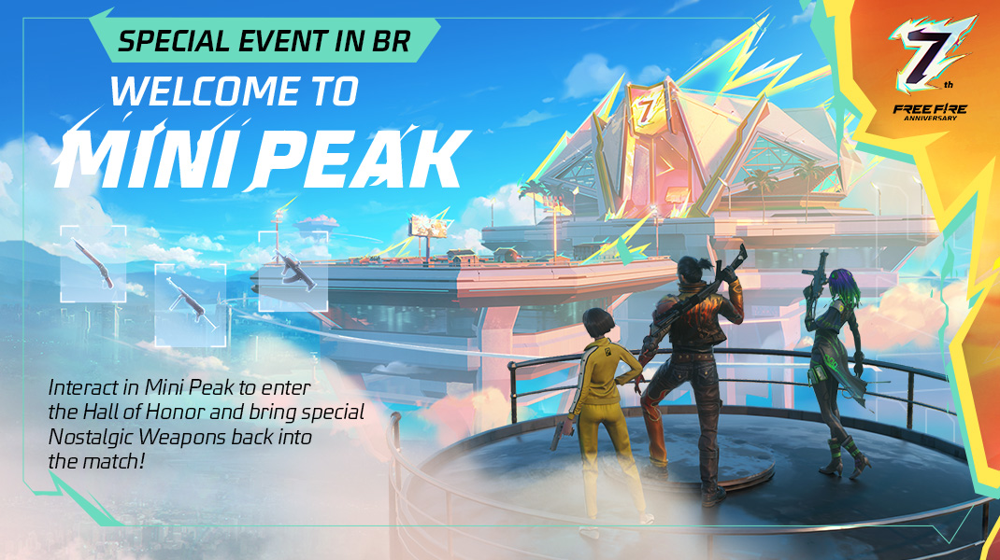
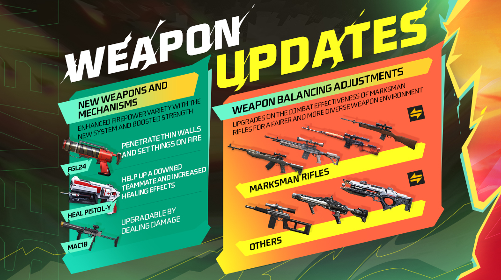
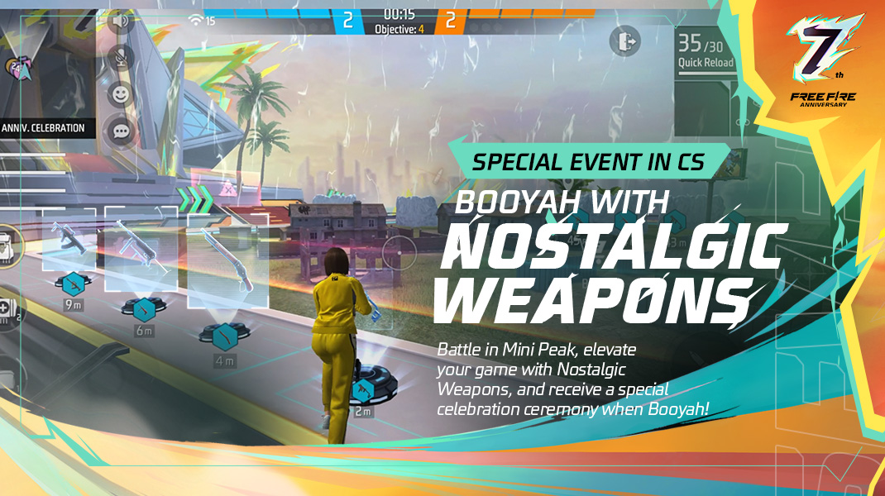
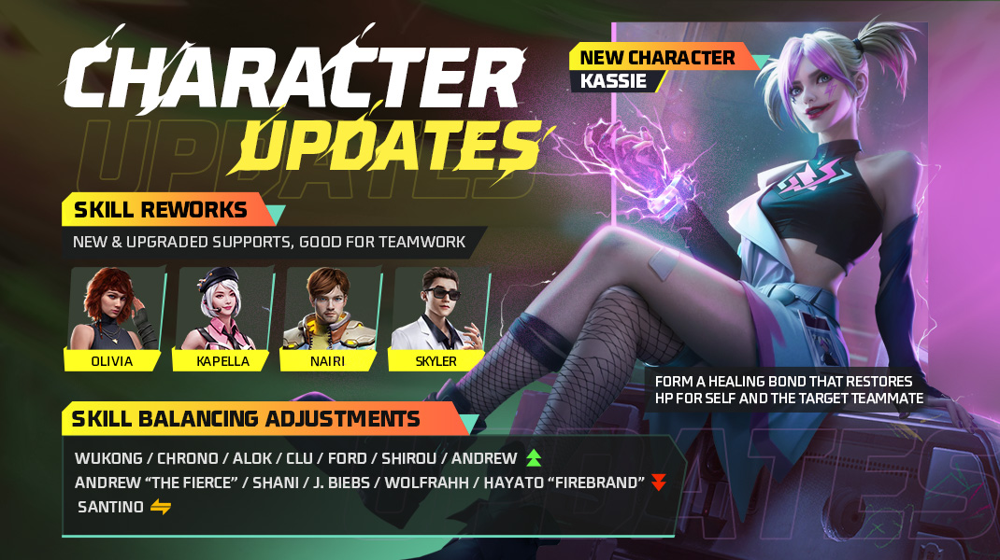
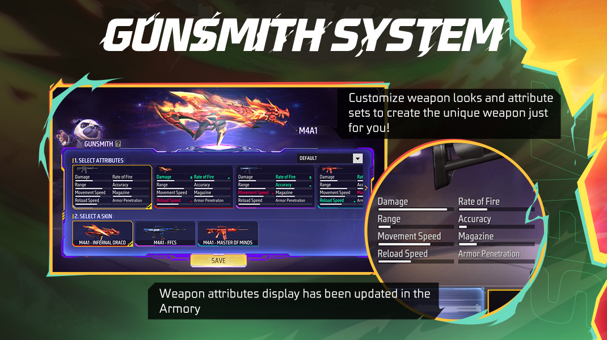
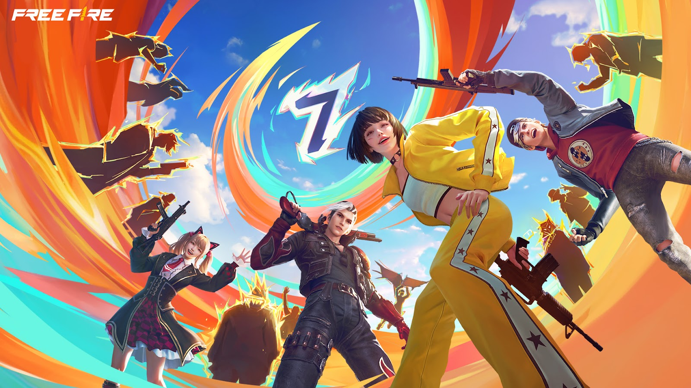
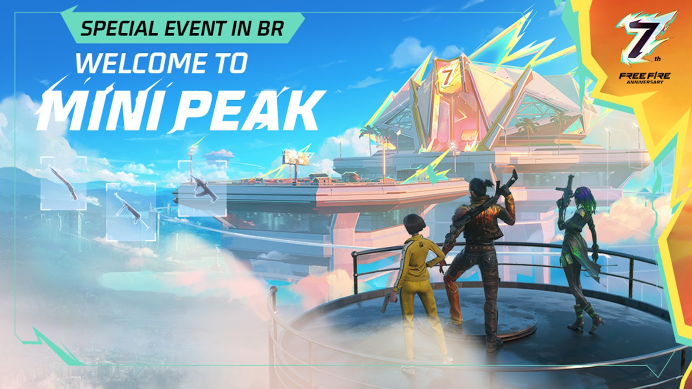

# Free Fire · OB45（7周年）

- 公告日期：2024-06-26
- 官方来源：[Patch Notes](https://ff.garena.com/en/article/1357/)
- 审阅日期：2026-09-19
- 51 个分类小节；76 项说明及表格行；5 张官方公告插图。

完整英文正文逐项复核，5张英文原图从既有官方URL审计缓存恢复，哈希/尺寸及全部图片视觉核验。西语1370只作为对照，不另计版本。

英文公告2024-06-26；官方1369更新流程指定6月26日更新。7周年活动未统一列结束日。

## BR · 大逃杀

### 迷你山峰与荣誉大厅

- 归属：BR · 大逃杀 / 活动覆盖
- 原文小节：Battle Royale > Special 7th Anniversary Event: Mini Peak
- 时间：仅7周年活动期间，公告未给确切起止日。

适用范围按原文；通用章节未明确是否适用所有独立模式。

BR周年Mini Peak、荣誉大厅与怀旧武器。原文：Battle Royale。[官方原图](https://lh7-us.googleusercontent.com/docsz/AD_4nXcQP_oX87Zoar-0Tk0vZd5trHvc185HkmUk7w2nKxNrknUlyFIycAcKqvv-4NP77FaKW3_OL6-9UE7s0ZC1QB5VyswOYYzqil_BRWjyE_xUInL_df_aYWssxFMzxrJtjnFAMEnuQlSsXyZlINhHE3jW2Xs?key=rm_bZWImXdBkcjAzWDF3_A) · 1070×600。

- 所有地图都能看到迷你山峰和荣誉大厅。
- 可通过地面的记忆传送门进入迷你山峰。

### 记忆传送门

- 归属：BR · 大逃杀 / 活动覆盖
- 原文小节：Battle Royale > Special 7th Anniversary Event: Mini Peak
- 时间：仅7周年活动期间，公告未给确切起止日。

适用范围按原文；通用章节未明确是否适用所有独立模式。

- 每局开始最多同时出现4个传送门；每个传送门只能将一支队伍送上岛，并在对局开始300秒后关闭。位置和关闭倒计时显示在小地图。

### 迷你山峰装备

- 归属：BR · 大逃杀 / 活动覆盖
- 原文小节：Battle Royale > Special 7th Anniversary Event: Mini Peak
- 时间：仅7周年活动期间，公告未给确切起止日。

适用范围按原文；通用章节未明确是否适用所有独立模式。

- 进入迷你山峰时，每名玩家获得1面Gloo墙和怀旧M1887。
- 说明段明确岛上被淘汰后可迅速重生，继续争夺记忆点；未给重生秒数。

### 记忆点与荣誉大厅

- 归属：BR · 大逃杀 / 活动覆盖
- 原文小节：Battle Royale > Special 7th Anniversary Event: Mini Peak
- 时间：仅7周年活动期间，公告未给确切起止日。

适用范围按原文；通用章节未明确是否适用所有独立模式。

- 摧毁礼盒或淘汰敌人可获得记忆点。记忆点可用于解锁荣誉大厅并兑换怀旧武器；达到指定数量后解锁大厅。大厅内可用记忆点兑换高级战利品和怀旧武器，也可通过大厅传送门乘滑翔机返回BR。

### 载具与复活提示

- 归属：BR · 大逃杀 / 常规调整
- 原文小节：Battle Royale
- 时间：公告日2024-06-26；7周年限时内容未统一写明起止日。

适用范围按原文；通用章节未明确是否适用所有独立模式。

- 载具新增自动驾驶按钮。
- 复活点和防御空投的占领图标改为类似防御军火库的占领机制；同队参与人数越多，占领速度越快。
- 新增返场敌人跳伞警报：附近一定距离内有复活敌人跳伞时，玩家收到带方向的提示。

### 周年礼盒

- 归属：BR · 大逃杀 / 活动覆盖
- 原文小节：Battle Royale > Other Adjustments
- 时间：仅7周年活动期间，公告未给确切起止日。

适用范围按原文；通用章节未明确是否适用所有独立模式。

- 7周年期间，地面随机出现特殊礼盒；打碎后获得随机战利品，小概率获得7周年怀旧武器。

### Gloo Melter

- 归属：BR · 大逃杀 / 常规调整
- 原文小节：Battle Royale
- 时间：公告日2024-06-26；7周年限时内容未统一写明起止日。

适用范围按原文；通用章节未明确是否适用所有独立模式。

- Gloo Melter对Gloo墙伤害170 HP/秒→230 HP/秒；效果范围内额外伤害100%→120%。

### BR：Pocket Market战备商店

- 归属：BR · 大逃杀 / 常规调整
- 原文小节：Battle Royale > Other Adjustments
- 时间：公告日2024-06-26；7周年限时内容未统一写明起止日。

适用范围按原文；通用章节未明确是否适用所有独立模式。

- 移除UAV-Lite、Horizaline、吸入器和Hit List的售卖。Clu和Chrono技能卡价格各降低100 FF币；Portal Go价格提高400；狙击枪弹药价格提高100。
- 移除多种配件的购买次数限制。

### 战备箱掉率

- 归属：BR · 大逃杀 / 常规调整
- 原文小节：Battle Royale
- 时间：公告日2024-06-26；7周年限时内容未统一写明起止日。

适用范围按原文；通用章节未明确是否适用所有独立模式。

- 所有等级战备箱中的Horizaline掉率降低；所有等级战备箱中的护甲掉率降低。

### BR：PLASMA替代PLASMA-X

- 归属：BR · 大逃杀 / 常规调整
- 原文小节：Weapon and Balance
- 时间：公告日2024-06-26；7周年限时内容未统一写明起止日。

适用范围按原文；通用章节未明确是否适用所有独立模式。

FGL-24、Heal Pistol-Y、MAC10与武器平衡。原文：Weapon and Balance。[官方原图](https://lh7-us.googleusercontent.com/docsz/AD_4nXdQAQGU-s2hWOiu3xzrT-poaMNvGyo41AfZGH8ToKvIy-vOUSQzQlxR52e27se4FSBX_QlQpqwOlzuP4deEBFq-sQAXpEzTE2eG1s7xd7iJQ561gzcGY0IRMS5BOMPfkkjFQ46MWA63nJDMfwJJ0EghlvXn?key=rm_bZWImXdBkcjAzWDF3_A) · 1070×600。

- PLASMA-X不再出现在对局中，改由PLASMA替代；调整后的PLASMA可在BR空投和军火库中获得。

### BR：计分板举报队友

- 归属：BR · 大逃杀 / 常规调整
- 原文小节：Other Adjustments
- 时间：公告日2024-06-26；7周年限时内容未统一写明起止日。

- 局内可通过BR计分板举报队友。

## CS · 枪王对决

### CS Mini Peak

- 归属：CS · 枪王对决 / 活动覆盖
- 原文小节：Clash Squad > 7th Anniversary CS Gameplay
- 时间：仅7周年活动期间，公告未给确切起止日。

适用范围按原文；通用章节未明确是否适用所有独立模式。

CS周年Mini Peak与怀旧武器。原文：Clash Squad。[官方原图](https://lh7-us.googleusercontent.com/docsz/AD_4nXf0DUYof2fM6XBHNADzcZi1Bo4E5mGANcJIS27G4Ir5QnuQs3dZr4F9nEZzpgsVu0ik-JmANOhDXTwW3l5K_N27CorU4yeRKlG3_MOtwuorDqd5UeO83TNHPVOmEFqxuyHlIHVS5L2jSPYThfqs32A-DwRw?key=rm_bZWImXdBkcjAzWDF3_A) · 1070×600。

- 第5和/或第6回合可能随机传送到Mini Peak；这些回合出生点范围更大，所有玩家默认获得1面Gloo墙。
- 在Mini Peak与补给装置互动可获得经典且更强力的武器。
- 其他地图的特殊7周年礼盒可打碎并获得随机战利品。

### Rim Nam Village

- 归属：CS · 枪王对决 / 常规调整
- 原文小节：Map
- 时间：公告日2024-06-26；7周年限时内容未统一写明起止日。

适用范围按原文；通用章节未明确是否适用所有独立模式。

- CS模式缩窄Rim Nam Village安全区；调整双方出生点左侧房屋结构和位置，并调整中央二楼边缘栏杆尺寸。

### Nurek Dam、Sentosa、Observatory

- 归属：CS · 枪王对决 / 常规调整
- 原文小节：Map
- 时间：公告日2024-06-26；7周年限时内容未统一写明起止日。

适用范围按原文；通用章节未明确是否适用所有独立模式。

- Nurek Dam调整长走廊屋顶边缘结构。
- Sentosa移除一个出生点围栏附近两只木箱。
- Observatory在建筑一侧屋顶边缘增加栏杆。

### CS：Trogon仅霰弹模式

- 归属：CS · 枪王对决 / 常规调整
- 原文小节：Gameplay > Other Adjustments
- 时间：公告日2024-06-26；7周年限时内容未统一写明起止日。

- CS可使用Trogon，但移除榴弹发射模式，保留霰弹模式。

## 通用局内调整

### Kassie：电疗

- 归属：通用局内调整 / 常规调整
- 原文小节：Characters
- 时间：公告日2024-06-26；7周年限时内容未统一写明起止日。

适用范围按原文；通用章节未明确是否适用所有独立模式。

Kassie及角色重做和平衡。原文：Characters。[官方原图](https://lh7-us.googleusercontent.com/docsz/AD_4nXfSmPYhW-C5ynO5Ds2ebcBGk4xDyMXy1q3Pb5oGzxEjj1U_7nw4-ewPYU-CqZyLDusZLqr_a4hGtHPZA4L_Hltj2jTFaM_9_KcW1VfhDNJuZnytKN1syEDlPg0wQf4L114wrkRE4Kj8PWzy0gD2XDaCbgpb?key=rm_bZWImXdBkcjAzWDF3_A) · 1070×600。

- 基础治疗（无冷却）：点击技能与队友形成治疗连接，自己和目标每秒恢复3点生命，效果不可叠加，最大连接距离20米；超出距离自动断开，也可手动取消。
- 集中治疗：再次使用技能立即为目标恢复100点生命；目标生命低于50时自动释放，自动释放量为手动使用的50%；冷却60秒。

### Kapella：治疗弹

- 归属：通用局内调整 / 常规调整
- 原文小节：Characters
- 时间：公告日2024-06-26；7周年限时内容未统一写明起止日。

适用范围按原文；通用章节未明确是否适用所有独立模式。

- 用弹药治疗队友，治疗量为造成伤害的20%；使用Heal Pistol治疗手枪时治疗效果提高20%。

### Olivia：治愈之触

- 归属：通用局内调整 / 常规调整
- 原文小节：Characters
- 时间：公告日2024-06-26；7周年限时内容未统一写明起止日。

适用范围按原文；通用章节未明确是否适用所有独立模式。

- 治疗效果提高30%，并将使用者单体治疗量的80%分享给15米内队友。

### Skyler：潮汐节奏

- 归属：通用局内调整 / 常规调整
- 原文小节：Characters
- 时间：公告日2024-06-26；7周年限时内容未统一写明起止日。

适用范围按原文；通用章节未明确是否适用所有独立模式。

- 向前释放最长100米声波，命中障碍物后爆炸，对4米内Gloo墙造成500伤害/秒，持续6秒；冷却45秒，最多储存2次技能。

### Nairi：冰铁

- 归属：通用局内调整 / 常规调整
- 原文小节：Characters
- 时间：公告日2024-06-26；7周年限时内容未统一写明起止日。

适用范围按原文；通用章节未明确是否适用所有独立模式。

- 部署Gloo墙后3秒内，墙体每秒恢复耐久150→160；5米内队友每秒恢复生命20→10。多面Gloo墙不能叠加治疗效果。

### Alok及觉醒

- 归属：通用局内调整 / 常规调整
- 原文小节：Characters
- 时间：公告日2024-06-26；7周年限时内容未统一写明起止日。

适用范围按原文；通用章节未明确是否适用所有独立模式。

- Drop the Beat：5米光环，移动速度+15%，每秒恢复生命3→5点，持续10秒，冷却45秒，效果不叠加。
- Party Remix：光环期间每2秒在身后2米掉落持续5秒音符；队友拾取后移动速度+15%，每秒恢复生命3→5点，持续10秒。

### Chrono：时间转换器

- 归属：通用局内调整 / 常规调整
- 原文小节：Characters
- 时间：公告日2024-06-26；7周年限时内容未统一写明起止日。

适用范围按原文；通用章节未明确是否适用所有独立模式。

- 生成阻挡800伤害的不可穿透力场，场内不能攻击外部敌人；持续时间6→8秒，冷却75秒。

### Wukong：伪装

- 归属：通用局内调整 / 常规调整
- 原文小节：Characters
- 时间：公告日2024-06-26；7周年限时内容未统一写明起止日。

适用范围按原文；通用章节未明确是否适用所有独立模式。

- 变成持续15秒的灌木；冷却200→75秒。攻击后变身结束，击倒敌人后冷却重置。

### Clu：追踪步伐

- 归属：通用局内调整 / 常规调整
- 原文小节：Characters
- 时间：公告日2024-06-26；7周年限时内容未统一写明起止日。

适用范围按原文；通用章节未明确是否适用所有独立模式。

- 定位65→80米内非趴下或蹲下敌人，持续10秒，与队友共享位置；冷却45秒。
- 地区文字差异：同版西语1370写持续5秒；本卡10秒依英文1357保留，不能视为两次版本调整。

### Ford：钢铁意志

- 归属：通用局内调整 / 常规调整
- 原文小节：Characters
- 时间：公告日2024-06-26；7周年限时内容未统一写明起止日。

适用范围按原文；通用章节未明确是否适用所有独立模式。

- 受到伤害时每秒获得10点生命，持续3→4秒；释放主动技能后被动立即重置，冷却20秒。

### Shirou：伤害传递

- 归属：通用局内调整 / 常规调整
- 原文小节：Characters
- 时间：公告日2024-06-26；7周年限时内容未统一写明起止日。

适用范围按原文；通用章节未明确是否适用所有独立模式。

- 被100米内敌人命中时，攻击者被标记6→10秒，情报与队友共享，最多4个标记。

### Andrew与狂战安德鲁

- 归属：通用局内调整 / 常规调整
- 原文小节：Characters
- 时间：公告日2024-06-26；7周年限时内容未统一写明起止日。

适用范围按原文；通用章节未明确是否适用所有独立模式。

- 护甲专家：护甲耐久损失降低25%→40%。
- 狼群觉醒：护甲伤害减免15%→5%，每名携带该技能的队友额外减免5%伤害。

### J. Biebs：寂静哨兵

- 归属：通用局内调整 / 常规调整
- 原文小节：Characters
- 时间：公告日2024-06-26；7周年限时内容未统一写明起止日。

适用范围按原文；通用章节未明确是否适用所有独立模式。

- 技能使用者及12→15米内队友可用EP阻挡12%→8%伤害；队友扣除的EP会加到技能使用者EP。

### Shani：装备回收

- 归属：通用局内调整 / 常规调整
- 原文小节：Characters
- 时间：公告日2024-06-26；7周年限时内容未统一写明起止日。

适用范围按原文；通用章节未明确是否适用所有独立模式。

- 使用主动技能时，为自己及10米内队友提供50→40护盾点；护盾5秒后衰减，之后可再次获得效果；冷却10秒。

### Wolfrahh：聚光灯

- 归属：通用局内调整 / 常规调整
- 原文小节：Characters
- 时间：公告日2024-06-26；7周年限时内容未统一写明起止日。

适用范围按原文；通用章节未明确是否适用所有独立模式。

- 每次淘汰增加1名观众，观众数不会减少；每增加1名观众，受到爆头伤害降低10%→7%（上限30%→21%），对敌人的爆头伤害提高10%（上限30%）。

### Hayato火焰忍者：刀刃艺术

- 归属：通用局内调整 / 常规调整
- 原文小节：Characters
- 时间：公告日2024-06-26；7周年限时内容未统一写明起止日。

适用范围按原文；通用章节未明确是否适用所有独立模式。

- 觉醒后，最大生命值每损失10%，正面伤害降低3%→2%。

### Orion技能音效优化

- 归属：通用局内调整 / 常规调整
- 原文小节：Characters
- 时间：公告日2024-06-26；7周年限时内容未统一写明起止日。

适用范围按原文；通用章节未明确是否适用所有独立模式。

- 优化Orion技能音效。

### Santino传送冷却

- 归属：通用局内调整 / 常规调整
- 原文小节：Characters
- 时间：公告日2024-06-26；7周年限时内容未统一写明起止日。

适用范围按原文；通用章节未明确是否适用所有独立模式。

- 使用技能后增加0.3秒冷却，避免激烈战斗中误触发第二次传送。

### 护盾伤害提示与Chrono护盾

- 归属：通用局内调整 / 常规调整
- 原文小节：Characters
- 时间：公告日2024-06-26；7周年限时内容未统一写明起止日。

适用范围按原文；通用章节未明确是否适用所有独立模式。

- 玩家对护盾造成伤害时显示新的伤害提示。
- 优化在Chrono护盾内放置Gloo墙的操作体验。

### 武器：FGL-24

- 归属：通用局内调整 / 常规调整
- 原文小节：Weapon and Balance
- 时间：公告日2024-06-26；7周年限时内容未统一写明起止日。

适用范围按原文；通用章节未明确是否适用所有独立模式。

- 可发射穿透墙体的手雷，在墙另一侧爆炸并在短暂延迟后喷出火焰。 说明段明确可穿普通墙与冰墙，命中载具也可产生火焰作用；未列燃烧伤害值。
- 击中厚墙时手雷会卡在墙内且不爆炸，短暂延迟后在墙后喷出火焰；火焰中的敌人持续受到燃烧伤害。
- 可作为地面战利品获得。

### 武器：Heal Pistol-Y

- 归属：通用局内调整 / 常规调整
- 原文小节：Weapon and Balance
- 时间：公告日2024-06-26；7周年限时内容未统一写明起止日。

适用范围按原文；通用章节未明确是否适用所有独立模式。

- 每次使用恢复25点生命。
- 特殊射击按钮可远距离扶起倒地队友；每把Heal Pistol-Y只可执行一次扶起。
- 可从售货机和空投获得。

### 武器：MAC10成长

- 归属：通用局内调整 / 常规调整
- 原文小节：Weapon and Balance
- 时间：公告日2024-06-26；7周年限时内容未统一写明起止日。

适用范围按原文；通用章节未明确是否适用所有独立模式。

- 只能通过使用MAC10造成伤害升级；MAC10-I/II/III分别需要造成200/400/800点伤害。不能用升级芯片升级。升级后的MAC10获得额外伤害和射速。
- 基础：射速-3%、精准度-5%、爆头伤害-10%；I级射速+2%、肢体伤害+15%；II级射速+4%、肢体伤害+20%；III级射速+6%、肢体伤害+25%。

### AC80

- 归属：通用局内调整 / 常规调整
- 原文小节：Weapon and Balance
- 时间：公告日2024-06-26；7周年限时内容未统一写明起止日。

适用范围按原文；通用章节未明确是否适用所有独立模式。

- 射程+10%，爆头伤害-10%

### Woodpecker

- 归属：通用局内调整 / 常规调整
- 原文小节：Weapon and Balance
- 时间：公告日2024-06-26；7周年限时内容未统一写明起止日。

适用范围按原文；通用章节未明确是否适用所有独立模式。

- 射程+10%，伤害-2%，爆头伤害-5%

### SKS

- 归属：通用局内调整 / 常规调整
- 原文小节：Weapon and Balance
- 时间：公告日2024-06-26；7周年限时内容未统一写明起止日。

适用范围按原文；通用章节未明确是否适用所有独立模式。

- 射程+8%，爆头伤害-8%

### SVD/SVD-Y

- 归属：通用局内调整 / 常规调整
- 原文小节：Weapon and Balance
- 时间：公告日2024-06-26；7周年限时内容未统一写明起止日。

适用范围按原文；通用章节未明确是否适用所有独立模式。

- 射程+12%，爆头伤害-10%

### PLASMA热态属性

- 归属：通用局内调整 / 常规调整
- 原文小节：Weapon and Balance
- 时间：公告日2024-06-26；7周年限时内容未统一写明起止日。

适用范围按原文；通用章节未明确是否适用所有独立模式。

- 未加热：射速+10%、精准度+15%、弹匣+50%；加热期间射速增益-10%。

### RGS-50：载具伤害与锁定

- 归属：通用局内调整 / 常规调整
- 原文小节：Weapon and Balance > RGS-50
- 时间：公告日2024-06-26；7周年限时内容未统一写明起止日。

适用范围按原文；通用章节未明确是否适用所有独立模式。

- 对载具伤害+50%；载具锁定时间2秒→0.6秒。

### VSK94平衡

- 归属：通用局内调整 / 常规调整
- 原文小节：Weapon and Balance > VSK94
- 时间：公告日2024-06-26；7周年限时内容未统一写明起止日。

- 伤害+3%，爆头伤害-10%。

### 背包满载替换、排序与容量

- 归属：通用局内调整 / 常规调整
- 原文小节：Gameplay > Backpack Optimization
- 时间：公告日2024-06-26；7周年限时内容未统一写明起止日。

- 背包已满时尝试拾取物品会弹出小窗，显示多余物品并可直接替换。
- 弹药、金币、医疗包等常用物品优先排列在背包前排。
- 丢弃区新增“全部丢弃”，可拖放一次丢出该物品全部数量。
- 副武器特殊弹药在对应武器丢弃前不会被判定为无用。
- 移除背包扩容配件，原本增加的容量并入默认背包。

### BR/CS：战斗高光横幅

- 归属：通用局内调整 / 常规调整
- 原文小节：Gameplay > In-Match Battle Highlight Optimization
- 时间：公告日2024-06-26；7周年限时内容未统一写明起止日。

- 满足条件时BR/CS显示带战斗高光通知的Victory或Booyah横幅；CS包括Big Comeback、Easy Game，BR包括Team Annihilator；BR新增Avenged高光。

### 跳跃装填

- 归属：通用局内调整 / 常规调整
- 原文小节：Gameplay > Other Adjustments
- 时间：公告日2024-06-26；7周年限时内容未统一写明起止日。

- 玩家可在跳跃时装填枪械。

### 自定义房：双主动技能与特殊空投

- 归属：通用局内调整 / 常规调整
- 原文小节：Gameplay > Other Adjustments
- 时间：公告日2024-06-26；7周年限时内容未统一写明起止日。

- 自定义房间可使用双主动技能模式和特殊空投玩法。

### Bermuda围栏纹理

- 归属：通用局内调整 / 常规调整
- 原文小节：Gameplay > Other Adjustments
- 时间：公告日2024-06-26；7周年限时内容未统一写明起止日。

- 替换Bermuda围栏铁丝网纹理。

### Gunsmith：外观与属性组合

- 归属：通用局内调整 / 常规调整
- 原文小节：System > The Gunsmith System
- 时间：公告日2024-06-26；7周年限时内容未统一写明起止日。

Gunsmith：武器外观与属性组合。原文：System > The Gunsmith System。[官方原图](https://lh7-us.googleusercontent.com/docsz/AD_4nXecV_mqn3rsRnnW6_Iu4b4LvbPI_mFHt4lis-FFZYzozaKruBFldOo9r7u0eFpZ1Ftpj_PDQwiLG6YpPjR8_NOlRC4LYokTllgdsvLanRZZ1uUXfC6vIcE5rwGzZ3kWUsnmVXdG74pANULUUzMLSonbZiJF?key=rm_bZWImXdBkcjAzWDF3_A) · 1070×600。

- 同枪型拥有至少2款皮肤时解锁；可将一款皮肤外观与另一套皮肤属性组合，每枪只有1个定制槽。
- 选择Evo枪属性搭配其他皮肤外观时，保留该Evo枪能力。

### 设置同步、音频平衡与特效开关

- 归属：通用局内调整 / 常规调整
- 原文小节：Other Adjustments
- 时间：公告日2024-06-26；7周年限时内容未统一写明起止日。

- 账号设置自动上传和下载。
- 改善声音设置中音频平衡的说明与可用性；部分高端设备在Smooth画质下新增collection特效开关，原文未列设备或特效清单。

## 其他玩法与局外内容（目录摘要）

### CS FPP独立变体

新增CS第一人称玩法；优化第一人称移动动作、速度、射击表现、技能显示、附近敌人视觉警报；设置中可单独调第一人称灵敏度。

原文目录：Mode > Clash Squad: FPP

### Cosmic Racer：Skyblaster

拾取经验代币后，可将起始载具升级为飞行Skyblaster或经典高性能赛车；Skyblaster驾驶员可发射范围爆破和锁定导弹，乘客可用内置机炮。

原文目录：Mode > Cosmic Racer Optimization

### 社交岛与邀请

聚拢建筑、调整地形以降低内存占用；赛道改用传送入口，避免车驶入中央广场。岛上可接收外部组队邀请；公共语音只听到附近玩家。Combat Zone邀请以聊天预约提示，Target Range与Social Island邀请以侧边弹窗显示。

原文目录：Mode > Social Island Optimization / System > Real-Time Team Invitations in Training Grounds and Social Island

### 战斗高光与公会战

赛后可看本局高光摘要，局外成就页可看已触发的所有高光；公会战新增每周地图轮换。

原文目录：Gameplay

### 武器熟练度与军械库

提高熟练度增长速度；4级专属皮肤、5级特殊开火按钮更快获取；5级后可突破继续升级，获图标与特效。枪名下显示超过的同服玩家数量。军械库新增伤害/射速/射程条形图及升级属性、获取方式详情；Final Shot可独立于皮肤装备，拥有某枪型效果即可应用其任何皮肤。

原文目录：System > Weapon Mastery Breakthrough / Enhanced Armory

### 下载中心

支持后台下载额外资源包；可自动清理长期未使用资源；推荐资源新增详细说明。未说明具体内存/帧率提升。

原文目录：System > Download Center Optimization

### CS保护分

败方Best Teammate表现突出时可能不扣星；较长对局与突出数据给予额外保护分，未给阈值。

原文目录：Rank > New Mechanism for CS Protection Points

### 赛季目标与回顾

累计排位场次获取降落伞、战利品箱、滑板皮肤；新任务提供限时冰墙皮肤，继续排位可增加其Lifetime进度。赛后优先显示淘汰相关高光；回顾新增排名百分比、场数、平均伤害、胜率、载具淘汰，并展示上季武器荣耀排名及Role。

原文目录：Rank > Rank Goals for the New Season / Match Results Optimization / Revamped Season Recap

### 成就、好友、公会与观战

成就完成视觉与进度比较提示优化，新增Rank-Year专属成就。在线高亲密好友在大厅邀请、好友列表、赠礼、BP经验发送及Buddy邀请页优先；推荐更可能接受申请的公会。调整Support/Bomber评分、Sniper统计显示。观战表情增加并显示发送者；若与被观战好友的队友互为好友，可互动。大厅可举报语音违规与榜单作弊。

原文目录：Other Adjustments

### Craftland新图和平台

周年Old Peak BR地图、新PvE僵尸地图及Trialympics、赛车、跑酷地图。Studio新增FPP模板；Score和Parkour地图新增单人选项；评论词随机展示；举报界面增加违规分类。

原文目录：Craftland

## 官方图片索引

正文图片按相关小节展示，版本总览及其他章节插图另列；同一原图只嵌入一次。

- [BR周年Mini Peak、荣誉大厅与怀旧武器](https://lh7-us.googleusercontent.com/docsz/AD_4nXcQP_oX87Zoar-0Tk0vZd5trHvc185HkmUk7w2nKxNrknUlyFIycAcKqvv-4NP77FaKW3_OL6-9UE7s0ZC1QB5VyswOYYzqil_BRWjyE_xUInL_df_aYWssxFMzxrJtjnFAMEnuQlSsXyZlINhHE3jW2Xs?key=rm_bZWImXdBkcjAzWDF3_A) · 1070×600 · 本地 `assets/ff-patches/1357-01.jpg`
- [CS周年Mini Peak与怀旧武器](https://lh7-us.googleusercontent.com/docsz/AD_4nXf0DUYof2fM6XBHNADzcZi1Bo4E5mGANcJIS27G4Ir5QnuQs3dZr4F9nEZzpgsVu0ik-JmANOhDXTwW3l5K_N27CorU4yeRKlG3_MOtwuorDqd5UeO83TNHPVOmEFqxuyHlIHVS5L2jSPYThfqs32A-DwRw?key=rm_bZWImXdBkcjAzWDF3_A) · 1070×600 · 本地 `assets/ff-patches/1357-02.jpg`
- [Kassie及角色重做和平衡](https://lh7-us.googleusercontent.com/docsz/AD_4nXfSmPYhW-C5ynO5Ds2ebcBGk4xDyMXy1q3Pb5oGzxEjj1U_7nw4-ewPYU-CqZyLDusZLqr_a4hGtHPZA4L_Hltj2jTFaM_9_KcW1VfhDNJuZnytKN1syEDlPg0wQf4L114wrkRE4Kj8PWzy0gD2XDaCbgpb?key=rm_bZWImXdBkcjAzWDF3_A) · 1070×600 · 本地 `assets/ff-patches/1357-03.jpg`
- [FGL-24、Heal Pistol-Y、MAC10与武器平衡](https://lh7-us.googleusercontent.com/docsz/AD_4nXdQAQGU-s2hWOiu3xzrT-poaMNvGyo41AfZGH8ToKvIy-vOUSQzQlxR52e27se4FSBX_QlQpqwOlzuP4deEBFq-sQAXpEzTE2eG1s7xd7iJQ561gzcGY0IRMS5BOMPfkkjFQ46MWA63nJDMfwJJ0EghlvXn?key=rm_bZWImXdBkcjAzWDF3_A) · 1070×600 · 本地 `assets/ff-patches/1357-04.jpg`
- [Gunsmith：武器外观与属性组合](https://lh7-us.googleusercontent.com/docsz/AD_4nXecV_mqn3rsRnnW6_Iu4b4LvbPI_mFHt4lis-FFZYzozaKruBFldOo9r7u0eFpZ1Ftpj_PDQwiLG6YpPjR8_NOlRC4LYokTllgdsvLanRZZ1uUXfC6vIcE5rwGzZ3kWUsnmVXdG74pANULUUzMLSonbZiJF?key=rm_bZWImXdBkcjAzWDF3_A) · 1070×600 · 本地 `assets/ff-patches/1357-05.jpg`

## 版本关联来源

### [官方关联公告](https://ff.garena.com/es/article/1370/)

同版西语镜像，5图另存本地对照。Clu持续时间西语5秒/英文10秒，Kassie半量治疗措辞和PLASMA百分号有差异；以本篇英文为主并保留地区差异，不重复计版本。

### [官方关联公告](https://ff.garena.com/en/article/1369/)

官方标题明确OB45更新流程及7周年/Kassie同版对应，6月26日更新。

### [7周年活动公告](https://ff.garena.com/en/article/1365/)

2024-06-25
与OB45同版活动关联；限时模式、奖励日程和未填写的日期单独保留。

- BR通过Memory Portal进入Mini Peak，破坏礼盒或淘汰获得Memory Points，再用Glider进入限时Hall of Honor取得怀旧MP40、M1887、Vector并带回战场；Friends’ Echoes可互动玩家剪影换局内奖励。机制详值见1357。
- CS随机回合可传到Mini Peak，出生区有特殊视觉提示；周年补给装置提供怀旧武器，礼盒提供随机战利品，胜队有Booyah庆祝仪式。
- 独立体验：CS第一人称模式；Old Peak迷你BR写with 11 other players，即包含本人共12人；Zombie Graveyard写4～5人合作对抗僵尸。这些人数不能误抄为Old Peak总计11人。
- 6月26日起可获周年男性服装、棒球棍及AC80枪皮；6月26～27日登录抽Gloo Wall接力奖励，未获奖者可与已拥有者组队完成周年BR活动取得。
- 社区组队活动6月26日至7月15日；6月29日发布动画，另有主题曲、纪录片、故事墙、Kelly最多四种姿势的AI照片及线下周边。正文数处仍写from date to date，占位日程不补造。

7周年活动公告 · 原文图1。原文：7周年活动公告。[官方原图](https://lh7-us.googleusercontent.com/docsz/AD_4nXf5v1cs4ZJmgyyK06Zwb8fWwMFZ5d4t0nO9oLP2fByAz1GoStjMm9f1J9Mwe508_LWoar4Zd3Zqs4rema900UN34whL1-KfuSpMSZGPjqxhoPhO8DuM7NP7y52KQ7JTaahVK0m_Cp9VBTkKlG380rCE0yI-?key=xo9WUVXn6Y0aO9Prjvnimg) · 1600×900。

7周年活动公告 · 原文图2。原文：7周年活动公告。[官方原图](https://lh7-us.googleusercontent.com/docsz/AD_4nXfrdJdpaH3qa5rwm8BaIB-V33lsiQO9gX7694zKoQkPXEbsZFkStYowNNAnb-dGjex0DRsmZve338heEAzTC-zexbTAENwM-MlPWOUP2bC5iB_XHFic7XB7OOOpkxGJKN1Z0jRSyVgmQWxdx3TfA-T3EqVI?key=xo9WUVXn6Y0aO9Prjvnimg) · 1600×900。

7周年活动公告 · 原文图3。原文：7周年活动公告。[官方原图](https://lh7-us.googleusercontent.com/docsz/AD_4nXfuvkIIZYRYOsGJO5QOKbnKiydWek4035SzErm5-Tkxb-YcoPBUOPGz_JACGsR8EHPio61hpQnmI-RkAQiBYLNfIESX6Bdfc4HPYT8g8Ee5susOg_vcus8A1t5NDkNzVn5JsHr4PBwxY7hrvzHNNsp1NZ-G?key=xo9WUVXn6Y0aO9Prjvnimg) · 1600×900。

## 原文目录（对照用）

- Battle Royale
- Special 7th Anniversary Event: Mini Peak
- Other Adjustments
- Clash Squad
- 7th Anniversary CS Gameplay
- Mode
- Clash Squad: FPP
- Cosmic Racer Optimization
- Social Island Optimization
- Characters
- New Character
- Character Rework
- Character Balance Adjustments
- Defensive Skill Adjustments
- Other Adjustments
- Map
- Balance Adjustments for CS Maps
- Weapon and Balance
- New Secondary Weapon: the FGL-24
- New Secondary Weapon: the Heal Pistol-Y
- New Upgradable Weapon: the MAC10
- Weapon Adjustments
- Gameplay
- Backpack Optimization
- In-Match Battle Highlight Optimization
- Other Adjustments
- System
- Weapon Mastery Breakthrough
- Download Center Optimization
- Real-Time Team Invitations in Training Grounds and Social Island
- Enhanced Armory
- The Gunsmith System
- Rank
- New Mechanism for CS Protection Points
- Rank Goals for the New Season
- Match Results Optimization
- Revamped Season Recap
- Other Adjustments
- Craftland
