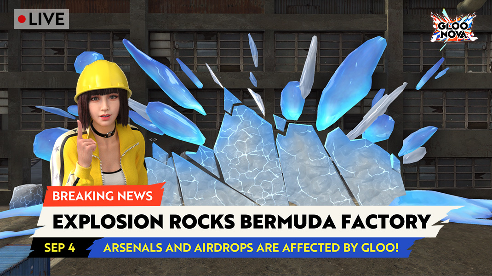
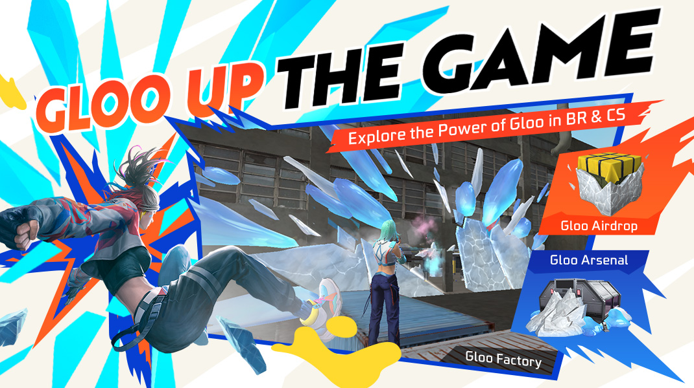
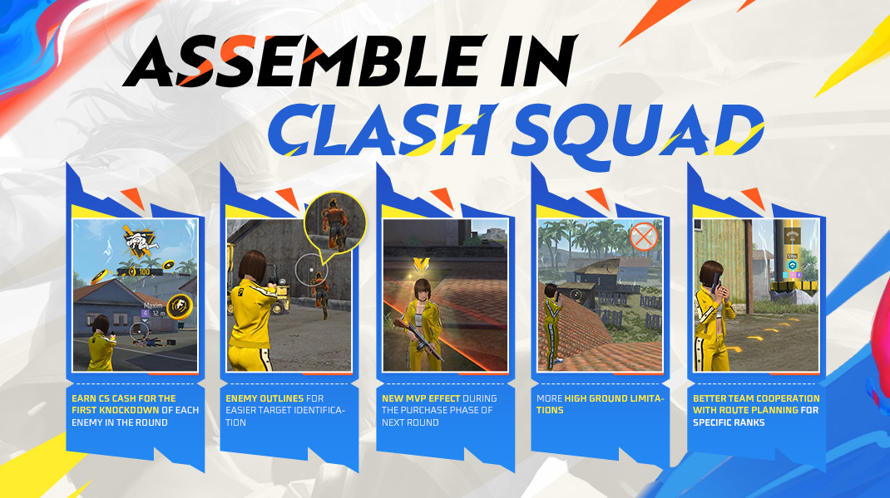
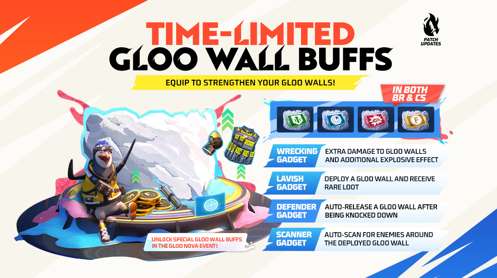
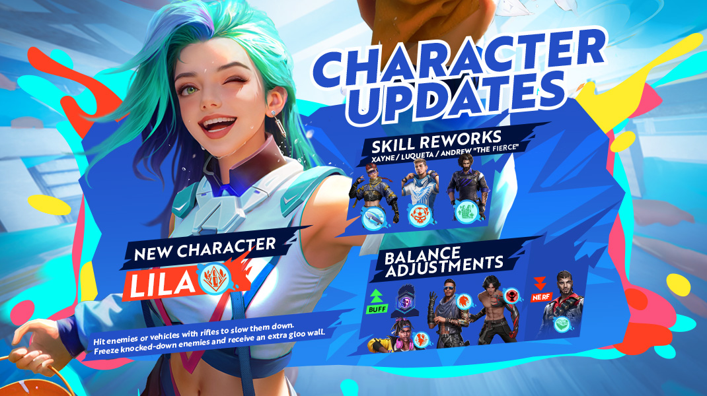
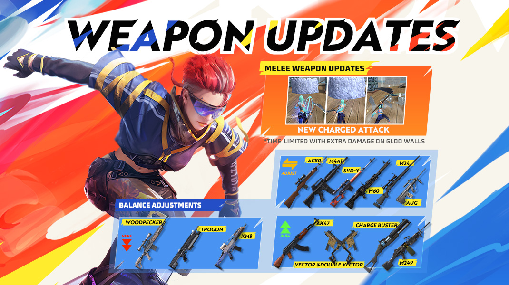

# Free Fire · OB46

- 公告日期：2024-09-01
- 官方来源：[Patch Notes](https://ff.garena.com/en/article/1385/)
- 审阅日期：2026-09-19
- 41 个分类小节；48 项说明及表格行；6 张官方公告插图。

主流程通读正文并逐张查看6张图；拆分角色武器和BR/CS卡，补齐漏项与具体限制；修正原草稿图片错配。

公告日2024-09-01；Gloo Nova配图标注2024-09-04，活动未列结束日；蓄力近战配图标有限时。

## BR · 大逃杀

### BR：冰墙军械库、空投与生成器事件

- 归属：BR · 大逃杀 / 活动覆盖
- 原文小节：Battle Royale > Gloo Nova in BR
- 时间：Gloo Nova活动期间；配图标注2024-09-04，未写结束日。

按原文明确范围；通用章节未确认全部独立玩法均适用。

Gloo Nova：9月4日Factory、军械库与空投。原文：Battle Royale。[官方原图](https://lh7-rt.googleusercontent.com/docsz/AD_4nXeppUeC5F4k749we4r_rVkSPck798Jg2nLXB6aFu-56_MBLbCi-uX5LsKgPUGGBV_OGvm27YpjvwJZDVb_2PYAU5MlPoHeDk7mBpQiG3tIvELqYIaDtPhvowHHWchDFJ6GyoNLB9bwO9Ib-4jqLHz1gX5W5?key=DmXViBkqc4SgdDA25La7WQ) · 1070×600。

BR/CS冰墙工厂、军械库与空投。原文：Battle Royale / Clash Squad。[官方原图](https://lh7-rt.googleusercontent.com/docsz/AD_4nXeEacpJkQZpylGqigUh4eQZCHxKb41-AZ-E_MJTIz_dYa3UlHxLcEB8X5DTfmIiJ3drBwcIXMKYE_svhxBA2hnuaKqSfn4qv94avGWzV2M9p1SNzjMIwLoObYNcMakx-Sh4A7D0pALjenzbEfhRi4kvhX8?key=DmXViBkqc4SgdDA25La7WQ) · 1070×600。

- 活动期间所有军械库被 Gloo 覆盖，不再需要钥匙，击碎门上的 Gloo 即可进入；普通空投被 Gloo 覆盖，击碎后取得物资并获得额外 FF Coins。Gloo Overload 使 Gloo Wall 携带上限 +2、生成速度 +30%；Gloo Voyager 通过移动获得额外 Gloo Maker 经验。

### BR：地雷与Portal Go

- 归属：BR · 大逃杀 / 常规调整
- 原文小节：Battle Royale > Other Adjustments
- 时间：公告日2024-09-01；未给本项精确生效时刻。

按原文明确范围；通用章节未确认全部独立玩法均适用。

- 地雷最大伤害 210→160，最小伤害不变；放置后触发延迟 2.7 秒→5 秒；对自身伤害 100%→20%。Portal Go 传送延迟提高至 2.5 秒，最大部署距离 100 米→80 米。

### BR：武器掉落与防御军械库

- 归属：BR · 大逃杀 / 常规调整
- 原文小节：Battle Royale > Other Adjustments
- 时间：公告日2024-09-01；未给本项精确生效时刻。

按原文明确范围；通用章节未确认全部独立玩法均适用。

- 提高武器及主动技能卡总体掉率，移除对局中的空投售货机；防御军械库可开始占领的时间 200 秒→320 秒。每个军械库固定包含 4 把空投武器和 2 把 3 级武器。

### BR：售货机武器与技能卡

- 归属：BR · 大逃杀 / 常规调整
- 原文小节：Battle Royale > Other Adjustments
- 时间：公告日2024-09-01；未给本项精确生效时刻。

按原文明确范围；通用章节未确认全部独立玩法均适用。

- 售货机可售武器为 Groza（400 FF Coins，每局限购 5）、Thompson（100）、AC80（200，每局限购 10）、Scythe（100）；Clu 技能卡替换为 Skyler（300，每人限购 1），Chrono 技能卡替换为 Tatsuya（400，每人限购 1）。

### BR：复活点时段和占领速度

- 归属：BR · 大逃杀 / 常规调整
- 原文小节：Battle Royale > Other Adjustments
- 时间：公告日2024-09-01；未给本项精确生效时刻。

按原文明确范围；通用章节未确认全部独立玩法均适用。

- Bermuda、Alpine、Kalahari、Purgatory复活点开放时段600→730秒；占领速度提高25%。

### BR：护甲箱与Pocket Market

- 归属：BR · 大逃杀 / 常规调整
- 原文小节：Battle Royale > Other Adjustments
- 时间：公告日2024-09-01；未给本项精确生效时刻。

按原文明确范围；通用章节未确认全部独立玩法均适用。

- Armor Crate 的 200 FF Coins 替换为 Shield Booster。Pocket Market 的复活卡购买时限 600 秒→410 秒，价格 800→1000 FF Coins；移除 Portal Go，新增 Launch Pad（1200 FF Coins，每人限购 1，购买时限 600 秒），并出售 Skyler/Tatsuya 技能卡（各 300/400，每人限购 1）。

### BR：空投撞击不再直接淘汰

- 归属：BR · 大逃杀 / 常规调整
- 原文小节：Battle Royale > Other Adjustments
- 时间：公告日2024-09-01；未给本项精确生效时刻。

按原文明确范围；通用章节未确认全部独立玩法均适用。

- 被落地或滚动的空投撞到时，玩家改为被击退并受伤，不再立即淘汰。

## CS · 枪王对决

### CS：Gloo空投与Gloo Surge

- 归属：CS · 枪王对决 / 活动覆盖
- 原文小节：Clash Squad > Gloo Nova in CS
- 时间：Gloo Nova活动期；未给结束日，通用装置规则见BR/CS共同卡。

按原文明确范围；通用章节未确认全部独立玩法均适用。

- CS 中 4 种 Gloo Gadget 规则与 BR 相同；工厂部分区域被 Gloo 覆盖，可用于战斗掩护。Gloo Airdrop 需击碎后获取物资，破坏后消失，替代第 1、2、6、7 回合的普通空投。Gloo Surge 每回合开始额外给 1 个 Gloo Wall（第 1 回合除外），携带上限 +1。

### CS：目标计划与路径指引

- 归属：CS · 枪王对决 / 常规调整
- 原文小节：Clash Squad > Team Objective Guidance
- 时间：公告日2024-09-01；未给本项精确生效时刻。

按原文明确范围；通用章节未确认全部独立玩法均适用。

CS首倒现金、轮廓、MVP、高点与目标路径。原文：Clash Squad / Gameplay。[官方原图](https://lh7-rt.googleusercontent.com/docsz/AD_4nXdbX9rzI-o5vLmDYpQAy8K3fJSKXNtcAd3SZZMQiroc0ZUA0eAO10dhj-pJ9X7Z7sNDxXv9xmr-Nx1V1NOfn9CMUt2OmN2gDPl4iZJ6QosRha7iAUBDP1_3NyAuWjB3n8mcY5GdjmhN4ulmBIu1kU9kCdA?key=DmXViBkqc4SgdDA25La7WQ) · 1070×600。

- Cyber Airdrop和Supply Gadget增加交互按钮；点击后在图标下显示自己编号，队友操作亦显示其编号，用于共享进攻计划。
- 选定目标后显示建议路线；只有Gold II或更低段位可见路线，原文未将前述编号共享限制为这些段位。

### CS：首倒奖励与回合MVP

- 归属：CS · 枪王对决 / 常规调整
- 原文小节：Clash Squad > Other Adjustments
- 时间：公告日2024-09-01；未给本项精确生效时刻。

按原文明确范围；通用章节未确认全部独立玩法均适用。

- 本回合首次击倒某敌人奖励 100 CS Cash；胜方回合 MVP 在下一回合购买阶段获得特殊效果。

### CS：Nurek Dam、Observatory、Sentosa高点

- 归属：CS · 枪王对决 / 常规调整
- 原文小节：Map > Other Map Adjustments
- 时间：公告日2024-09-01；未给本项精确生效时刻。

按原文明确范围；通用章节未确认全部独立玩法均适用。

- 继续调整Nurek Dam和Observatory屋顶结构。
- Sentosa调整双层楼结构，更换车旁垃圾桶，移除中部围栏附近集装箱。

### CS：黄色敌人轮廓

- 归属：CS · 枪王对决 / 常规调整
- 原文小节：Gameplay > Enemy Outline in CS Mode
- 时间：公告日2024-09-01；未给本项精确生效时刻。

按原文明确范围；通用章节未确认全部独立玩法均适用。

- 敌人显示黄色轮廓，不透明度随距离变化；可在设置关闭。

## 通用局内调整

### BR/CS：四种限时冰墙装置

- 归属：通用局内调整 / 活动覆盖
- 原文小节：Battle Royale > Gloo Nova in BR / Clash Squad > Gloo Nova in CS
- 时间：Gloo Nova活动期限定；总览图标注2024-09-04，未写结束日。

按原文明确范围；通用章节未确认全部独立玩法均适用。

四种BR/CS限时冰墙装置。原文：Battle Royale / Clash Squad。[官方原图](https://lh7-rt.googleusercontent.com/docsz/AD_4nXceiFJQbD0KzPZFsHIl3PhAc3KmATLNvVg5qAmAnW-a10w4OBE5PqI1G2idc5CO1RZB05GXQlyTgebR-9p63E994ErXwJMHGmlnYxU2JXu5v3J1UEYuaQx_xcEdVyrmqV_Wg9lEw_usLvuMBwbSHs823_E?key=DmXViBkqc4SgdDA25La7WQ) · 1070×600。

- 活动期间可为 Gloo Wall 选择 4 种 Gloo Gadget：Lavish 默认解锁，部署 Gloo Wall 时随机获得 EP、局内货币或消耗品，小概率获得主动技能卡或 Horizaline，冷却 10 秒。
- Wrecking 通过活动解锁：对 Gloo Wall 额外造成 50% 伤害；摧毁后爆炸，对范围内敌人造成 30 伤害，冷却 20 秒。Scanner 通过活动解锁：部署的 Gloo Wall 探测 35 米内敌人 6 秒，并标记 10 米内敌人 2 秒，冷却 25 秒。
- Defender 通过活动解锁：Gloo Wall 耐久 +250；装备者被击倒时，朝来袭子弹方向，在 0.6 秒后自动部署耐久 150 的 Gloo Wall，单人模式无效，冷却 25 秒。

### 新角色Lila：步枪减速

- 归属：通用局内调整 / 常规调整
- 原文小节：Characters > New Character > Lila
- 时间：公告日2024-09-01；未给本项精确生效时刻。

按原文明确范围；通用章节未确认全部独立玩法均适用。

Lila及角色技能重做和平衡。原文：Characters。[官方原图](https://lh7-rt.googleusercontent.com/docsz/AD_4nXf8uCrYbylBPTL3EaMkepZiWKN_Gqt5Fn3zI2FpXbzanj6yeuS-H8vyn9hEESFyyeX-9ZkaXIFklYrXYObD4peLoRuER6oaJokw6txM0nVwhfrB0ptVTHa6mkZecdFb2OxIwNCc7dHJyWOG7KypRsJ22nKy?key=DmXViBkqc4SgdDA25La7WQ) · 1070×600。

- 新角色 Lila「Gloo Artist」：用步枪命中敌人或载具时，使敌人移速降低 10%或载具加速度降低 50%，持续 3 秒；减速期间敌人被击倒会被冻结最多 3 秒，获得 1 个额外 Gloo Wall，并进入 10 秒技能冷却。

### 觉醒Andrew：附近队友减伤

- 归属：通用局内调整 / 常规调整
- 原文小节：Characters > Character Rework > Andrew “the Fierce”
- 时间：公告日2024-09-01；未给本项精确生效时刻。

按原文明确范围；通用章节未确认全部独立玩法均适用。

- Andrew the Fierce「Wolf Pack」觉醒：护甲伤害减免 +4%；每名 15 米内队友额外提供 1%伤害减免，限制范围为 15 米。

### Xayne：临时护盾与连续击倒

- 归属：通用局内调整 / 常规调整
- 原文小节：Characters > Maximum-HP-Related Adjustments > Xayne
- 时间：公告日2024-09-01；未给本项精确生效时刻。

按原文明确范围；通用章节未确认全部独立玩法均适用。

- Xayne「Xtreme Encounter」：进入 Xtreme 状态并立即获得 60 临时护盾点，持续 12 秒；期间每次击倒敌人都会将该技能获得的临时护盾恢复至 60，并重置持续时间；状态结束后移除，冷却 75 秒。

### Luqueta：最大护盾增加

- 归属：通用局内调整 / 常规调整
- 原文小节：Characters > Maximum-HP-Related Adjustments > Luqueta
- 时间：公告日2024-09-01；未给本项精确生效时刻。

按原文明确范围；通用章节未确认全部独立玩法均适用。

- 每次淘汰增加25最大护盾点，累计最多+50；本局持续，玩家被淘汰或回合重置后清除，不是永久账号属性。

### 护盾附件与回复速度

- 归属：通用局内调整 / 常规调整
- 原文小节：Characters > Shield-Points-Related Adjustments
- 时间：公告日2024-09-01；未给本项精确生效时刻。

按原文明确范围；通用章节未确认全部独立玩法均适用。

- Vest HP Booster改名Shield Booster，其30 HP改为30护盾点；Vest Enlarger同样30 HP→30护盾点。
- 护盾点回复速度10→5点/秒；适用于Antonio、Luqueta、Shield Booster、Vest Enlarger。

### K：EP回复与队友范围

- 归属：通用局内调整 / 常规调整
- 原文小节：Characters > Character Balance Adjustments > K
- 时间：公告日2024-09-01；未给本项精确生效时刻。

按原文明确范围；通用章节未确认全部独立玩法均适用。

- 最大EP增加50；柔术模式队友范围6→15米，EP转化率增幅600%；心理模式3 EP的回复间隔2→1秒，最多250 EP；切换模式冷却6秒。

### Orion：保护状态移速

- 归属：通用局内调整 / 常规调整
- 原文小节：Characters > Character Balance Adjustments > Orion
- 时间：公告日2024-09-01；未给本项精确生效时刻。

按原文明确范围；通用章节未确认全部独立玩法均适用。

- 300 Crimson Energy替代EP，消耗200激活保护3秒；期间不能受伤、不能攻击，吸收5米内敌人10 HP并忽略其护盾点。移速惩罚20%→10%，冷却3秒；原文未给吸收频率。

### Maro：标记目标增伤

- 归属：通用局内调整 / 常规调整
- 原文小节：Characters > Character Balance Adjustments > Maro
- 时间：公告日2024-09-01；未给本项精确生效时刻。

按原文明确范围；通用章节未确认全部独立玩法均适用。

- 距离越远伤害越高，最高+25%；对标记敌人额外伤害3.5%→5%。

### D-bee：移动射击

- 归属：通用局内调整 / 常规调整
- 原文小节：Characters > Character Balance Adjustments > D-bee
- 时间：公告日2024-09-01；未给本项精确生效时刻。

按原文明确范围；通用章节未确认全部独立玩法均适用。

- 移动射击时移速加成30%→50%，精准度加成60%。

### Factory：可破坏冰墙结构

- 归属：通用局内调整 / 活动覆盖
- 原文小节：Map > Gloo Factory
- 时间：Gloo Nova活动地图改造，配图标注2024-09-04；未写结束日。

按原文明确范围；通用章节未确认全部独立玩法均适用。

- Gloo Factory：工厂大部分掩体、平台和通路改为可破坏 Gloo；子弹、投掷物和角色技能可破坏部分 Gloo，另有不可破坏材质。

### Bermuda小地图视觉重做

- 归属：通用局内调整 / 常规调整
- 原文小节：Map > Bermuda Minimap Rework
- 时间：公告日2024-09-01；未给本项精确生效时刻。

按原文明确范围；通用章节未确认全部独立玩法均适用。

- 百慕大小地图按原始配色重做：调整地形和建筑颜色，弱化树木等次要信息；优化高级物资蓝区与 UAV-Lite 范围显示；统一军械库、空投等互动对象图标和视觉层级。

### 翻窗优化：除Kalahari

- 归属：通用局内调整 / 常规调整
- 原文小节：Map > Window Jump Optimizations (Except Kalahari)
- 时间：公告日2024-09-01；未给本项精确生效时刻。

按原文明确范围；通用章节未确认全部独立玩法均适用。

- 除 Kalahari 外优化窗户跳跃：调整百慕达部分建筑窗户尺寸，多数情况下可直接翻越，极少数极端角度仍可能蹲在窗台。

### Scythe：蓄力冲刺挥砍

- 归属：通用局内调整 / 活动覆盖
- 原文小节：Weapon and Balance > New Melee Attack: Charged Dash
- 时间：同页武器配图把新蓄力攻击标为TIME-LIMITED，未给起止日；正文未列时间。

按原文明确范围；通用章节未确认全部独立玩法均适用。

限时蓄力近战与武器平衡。原文：Weapon and Balance。[官方原图](https://lh7-rt.googleusercontent.com/docsz/AD_4nXfNrMCmPSR2s1oBtFDEWOYXAkNsgkdLNznWBkceoLFh3C2JHLO4ukOzOKW3jf0SJBz6cUDP6YkfzbMmr6nsrYULw7PM1Jsf_Rm3iC0xkduKPnlYuI2uNogXrCcPooSFsdxiKpEaeawcmw8YBvufwdiYdkU?key=DmXViBkqc4SgdDA25La7WQ) · 1070×600。

- 持有 Scythe 时可使用 Charged Dash：长按蓄力向前冲刺，最大距离 6 米；冲刺末端挥砍，并对 Gloo Wall 造成额外伤害。

### AC80平衡

- 归属：通用局内调整 / 常规调整
- 原文小节：Weapon and Balance > Weapon Adjustments > AC80
- 时间：公告日2024-09-01；未给本项精确生效时刻。

按原文明确范围；通用章节未确认全部独立玩法均适用。

- 伤害+10%，连续命中伤害加成-20%，对护盾额外伤害+20%。

### Woodpecker平衡

- 归属：通用局内调整 / 常规调整
- 原文小节：Weapon and Balance > Weapon Adjustments > Woodpecker
- 时间：公告日2024-09-01；未给本项精确生效时刻。

按原文明确范围；通用章节未确认全部独立玩法均适用。

- 伤害-5%。

### AK47平衡

- 归属：通用局内调整 / 常规调整
- 原文小节：Weapon and Balance > Weapon Adjustments > AK47
- 时间：公告日2024-09-01；未给本项精确生效时刻。

按原文明确范围；通用章节未确认全部独立玩法均适用。

- 精准度+5%，护甲穿透+10%，爆头伤害+10%。

### XM8平衡

- 归属：通用局内调整 / 常规调整
- 原文小节：Weapon and Balance > Weapon Adjustments > XM8
- 时间：公告日2024-09-01；未给本项精确生效时刻。

按原文明确范围；通用章节未确认全部独立玩法均适用。

- 伤害-5%。

### AUG平衡

- 归属：通用局内调整 / 常规调整
- 原文小节：Weapon and Balance > Weapon Adjustments > AUG
- 时间：公告日2024-09-01；未给本项精确生效时刻。

按原文明确范围；通用章节未确认全部独立玩法均适用。

- 基础、I、II：伤害+3%，护甲穿透-5%；III只列护甲穿透-5%，未列伤害增加。

### M4A1平衡

- 归属：通用局内调整 / 常规调整
- 原文小节：Weapon and Balance > Weapon Adjustments > M4A1
- 时间：公告日2024-09-01；未给本项精确生效时刻。

按原文明确范围；通用章节未确认全部独立玩法均适用。

- 伤害+6%，连续命中伤害加成-8%。

### M60平衡

- 归属：通用局内调整 / 常规调整
- 原文小节：Weapon and Balance > Weapon Adjustments > M60
- 时间：公告日2024-09-01；未给本项精确生效时刻。

按原文明确范围；通用章节未确认全部独立玩法均适用。

- 每次升级改为增加伤害，取代连续命中伤害增幅；I/II/III分别+5%/+10%/+15%；对冰墙额外伤害-20%。

### M249/M249-X平衡

- 归属：通用局内调整 / 常规调整
- 原文小节：Weapon and Balance > Weapon Adjustments > M249/M249-X
- 时间：公告日2024-09-01；未给本项精确生效时刻。

按原文明确范围；通用章节未确认全部独立玩法均适用。

- 标题列M249/M249-X，明细写M249对冰墙额外伤害+10%；未单列X数值，保留标题与明细范围差异。

### Charge Buster平衡

- 归属：通用局内调整 / 常规调整
- 原文小节：Weapon and Balance > Weapon Adjustments > Charge Buster
- 时间：公告日2024-09-01；未给本项精确生效时刻。

按原文明确范围；通用章节未确认全部独立玩法均适用。

- 蓄力速度+12%，伤害+5%。

### Trogon平衡

- 归属：通用局内调整 / 常规调整
- 原文小节：Weapon and Balance > Weapon Adjustments > Trogon
- 时间：公告日2024-09-01；未给本项精确生效时刻。

按原文明确范围；通用章节未确认全部独立玩法均适用。

- 仅榴弹发射模式弹匣4→2。

### Double Vector/Vector平衡

- 归属：通用局内调整 / 常规调整
- 原文小节：Weapon and Balance > Weapon Adjustments > Double Vector/Vector
- 时间：公告日2024-09-01；未给本项精确生效时刻。

按原文明确范围；通用章节未确认全部独立玩法均适用。

- 换弹速度+15%。

### SVD-Y平衡

- 归属：通用局内调整 / 常规调整
- 原文小节：Weapon and Balance > Weapon Adjustments > SVD-Y
- 时间：公告日2024-09-01；未给本项精确生效时刻。

按原文明确范围；通用章节未确认全部独立玩法均适用。

- 移除对冰墙额外伤害；冰墙穿透伤害+5%。

### M24平衡

- 归属：通用局内调整 / 常规调整
- 原文小节：Weapon and Balance > Weapon Adjustments > M24
- 时间：公告日2024-09-01；未给本项精确生效时刻。

按原文明确范围；通用章节未确认全部独立玩法均适用。

- 移除对冰墙额外伤害；冰墙穿透伤害+20%。

### 无人机颜色、烟雾弹与轮胎

- 归属：通用局内调整 / 常规调整
- 原文小节：Gameplay > Other Adjustments
- 时间：公告日2024-09-01；未给本项精确生效时刻。

按原文明确范围；通用章节未确认全部独立玩法均适用。

- 友方、敌方与中立UAV用不同颜色区分。
- 烟雾弹落地立即引爆。
- 单个轮胎最多连续弹跳4次。

### 局内报告队伍定位

- 归属：通用局内调整 / 常规调整
- 原文小节：System > Role System Optimization
- 时间：公告日2024-09-01；未给本项精确生效时刻。

按原文明确范围；通用章节未确认全部独立玩法均适用。

- 新增“I’ll be the Rusher/Sniper/Rifler/Bomber/Support”快捷消息，可在局内告知队友自己的定位。

## 其他玩法与局外内容（目录摘要）

### 社交岛与训练场

可在社交岛/训练场邀请好友或陌生人组队；接受位于其中的好友邀请可直接加入。社交岛FFWS奖杯旁新增一起跳舞，新增段位、连胜、公会等排行榜。训练场重生携带2吸入器、2修理包，Trogon无榴弹模式，连续淘汰触发音效。

原文目录：Mode

### 资料与Role专精

资料页可自定义统计、通行证、收藏、伙伴、成就、称号、熟练度和武器皮肤展示。Role达10级可进阶Elite并得图标；每轮首次淘汰纳入Elite Rusher/Sniper/Rifler；步枪/射手步枪爆头率纳入Rifler，狙击连续命中纳入Sniper，Dragon Freeze使用纳入Bomber；改善结果页升级动画。

原文目录：System > Profile Page Rework / Role System Optimization

### 观战

调整观战界面；好友首杀/三杀/四杀可多次点赞；赛后增加本局观众详情。

原文目录：System > Spectate System Optimization

### 排位榜称号：两份原文说明

同篇两节重复描述称号：New Rank Leaderboard Titles称同服前100立即授予、国家/省/市榜每周授予；New Ranked Glory Titles称地区前100立即授予、地区及次级地区榜每周授予。均沿用武器榜位置设置；不将同服与地区范围擅自统一。

原文目录：Rank

### 代币、背包、邀请与公会

Universal Evo Tokens可升级全部Evo武器；从OB46起新增背包皮肤只保留3级外观，旧背包不变。无可邀请好友时推荐在线玩家；过期邀请存入IntelliMate；好友请求显示来源；公会新增7级。

原文目录：Other Adjustments

### Craftland

新增2张完整设计的可编辑模板地图，基于官方模板的地图亦支持编辑。优化模式页Craftland区域；详情页可看玩法/队伍信息并直接分享好友；自定义资源支持预下载；移除主页开始按钮；Studio教程按钮直达教程网站。新增Gloo Maker、Skyblaster及可自定义四肢尺寸/服装的人物对象；对象栏新增二级搜索标签和AI搜索，右上显示已用数量；更新部分Blocks本地化说明。

原文目录：Craftland

## 官方图片索引

正文图片按相关小节展示，版本总览及其他章节插图另列；同一原图只嵌入一次。

- [Gloo Nova：9月4日Factory、军械库与空投](https://lh7-rt.googleusercontent.com/docsz/AD_4nXeppUeC5F4k749we4r_rVkSPck798Jg2nLXB6aFu-56_MBLbCi-uX5LsKgPUGGBV_OGvm27YpjvwJZDVb_2PYAU5MlPoHeDk7mBpQiG3tIvELqYIaDtPhvowHHWchDFJ6GyoNLB9bwO9Ib-4jqLHz1gX5W5?key=DmXViBkqc4SgdDA25La7WQ) · 1070×600 · 本地 `assets/ff-patches/1385-01.jpg`
- [BR/CS冰墙工厂、军械库与空投](https://lh7-rt.googleusercontent.com/docsz/AD_4nXeEacpJkQZpylGqigUh4eQZCHxKb41-AZ-E_MJTIz_dYa3UlHxLcEB8X5DTfmIiJ3drBwcIXMKYE_svhxBA2hnuaKqSfn4qv94avGWzV2M9p1SNzjMIwLoObYNcMakx-Sh4A7D0pALjenzbEfhRi4kvhX8?key=DmXViBkqc4SgdDA25La7WQ) · 1070×600 · 本地 `assets/ff-patches/1385-02.jpg`
- [四种BR/CS限时冰墙装置](https://lh7-rt.googleusercontent.com/docsz/AD_4nXceiFJQbD0KzPZFsHIl3PhAc3KmATLNvVg5qAmAnW-a10w4OBE5PqI1G2idc5CO1RZB05GXQlyTgebR-9p63E994ErXwJMHGmlnYxU2JXu5v3J1UEYuaQx_xcEdVyrmqV_Wg9lEw_usLvuMBwbSHs823_E?key=DmXViBkqc4SgdDA25La7WQ) · 1070×600 · 本地 `assets/ff-patches/1385-03.jpg`
- [CS首倒现金、轮廓、MVP、高点与目标路径](https://lh7-rt.googleusercontent.com/docsz/AD_4nXdbX9rzI-o5vLmDYpQAy8K3fJSKXNtcAd3SZZMQiroc0ZUA0eAO10dhj-pJ9X7Z7sNDxXv9xmr-Nx1V1NOfn9CMUt2OmN2gDPl4iZJ6QosRha7iAUBDP1_3NyAuWjB3n8mcY5GdjmhN4ulmBIu1kU9kCdA?key=DmXViBkqc4SgdDA25La7WQ) · 1070×600 · 本地 `assets/ff-patches/1385-04.jpg`
- [Lila及角色技能重做和平衡](https://lh7-rt.googleusercontent.com/docsz/AD_4nXf8uCrYbylBPTL3EaMkepZiWKN_Gqt5Fn3zI2FpXbzanj6yeuS-H8vyn9hEESFyyeX-9ZkaXIFklYrXYObD4peLoRuER6oaJokw6txM0nVwhfrB0ptVTHa6mkZecdFb2OxIwNCc7dHJyWOG7KypRsJ22nKy?key=DmXViBkqc4SgdDA25La7WQ) · 1070×600 · 本地 `assets/ff-patches/1385-05.jpg`
- [限时蓄力近战与武器平衡](https://lh7-rt.googleusercontent.com/docsz/AD_4nXfNrMCmPSR2s1oBtFDEWOYXAkNsgkdLNznWBkceoLFh3C2JHLO4ukOzOKW3jf0SJBz6cUDP6YkfzbMmr6nsrYULw7PM1Jsf_Rm3iC0xkduKPnlYuI2uNogXrCcPooSFsdxiKpEaeawcmw8YBvufwdiYdkU?key=DmXViBkqc4SgdDA25La7WQ) · 1070×600 · 本地 `assets/ff-patches/1385-06.jpg`

## 原文目录（对照用）

- Battle Royale
- Gloo Nova in BR
- Other Adjustments
- Clash Squad
- Gloo Nova in CS
- Team Objective Guidance
- Other Adjustments
- Mode
- Social Island & Training Grounds
- Other Adjustments
- Characters
- New Character
- Character Rework
- Maximum-HP-Related Adjustments
- Shield-Points-Related Adjustments
- Character Balance Adjustments
- Map
- Gloo Factory
- Bermuda Minimap Rework
- Window Jump Optimizations (Except Kalahari)
- Other Map Adjustments
- Weapon and Balance
- New Melee Attack: Charged Dash
- Weapon Adjustments
- Special Adjustments:
- Gameplay
- Enemy Outline in CS Mode
- Other Adjustments
- System
- Profile Page Rework
- Role System Optimization
- Spectate System Optimization
- Rank
- New Rank Leaderboard Titles
- New Ranked Glory Titles
- Other Adjustments
- Craftland
- Craftland Studio Template Edit
- Other Adjustments
