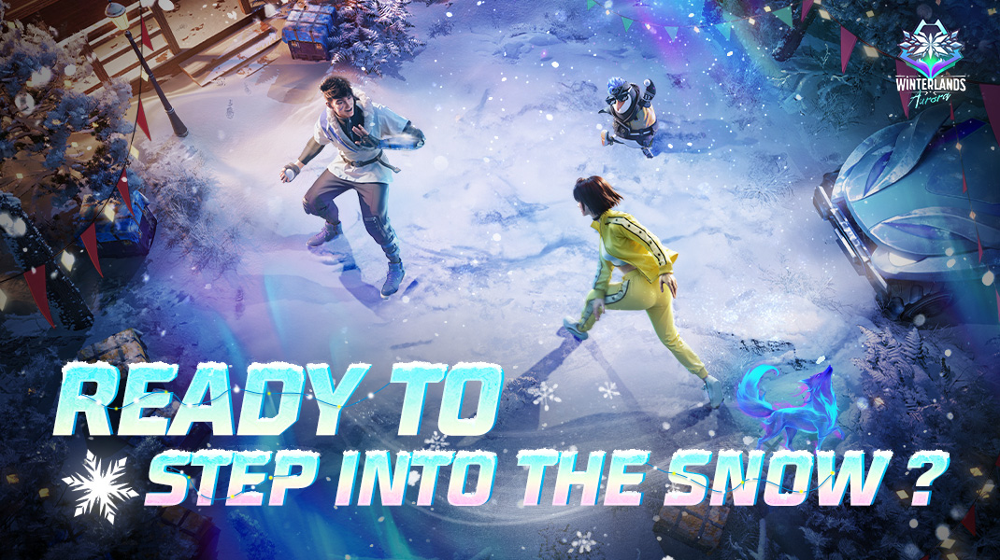
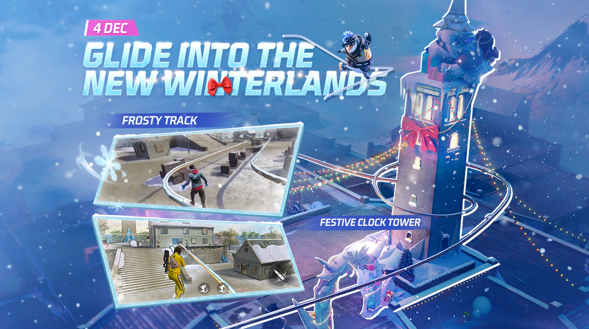
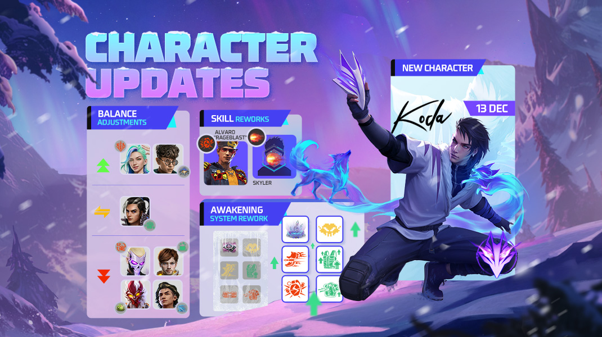
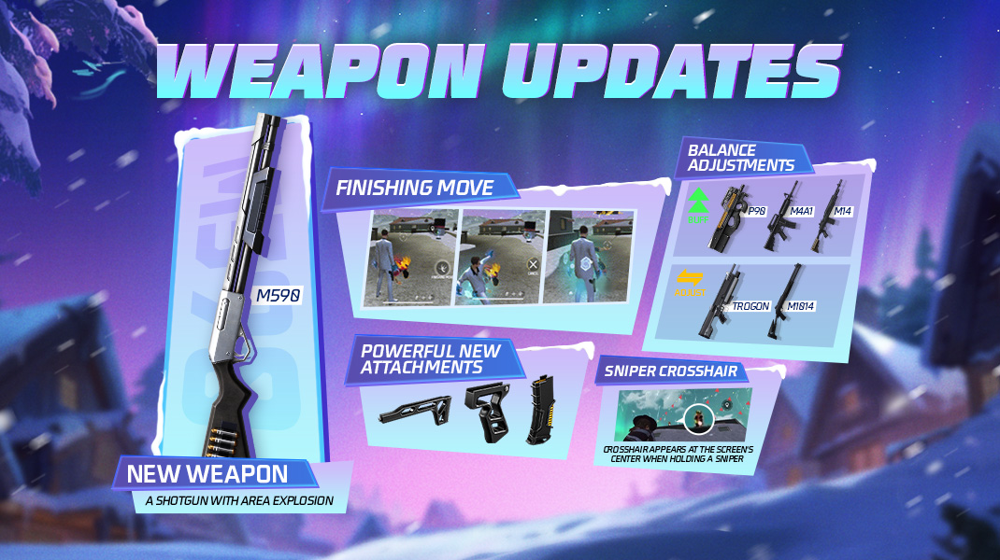
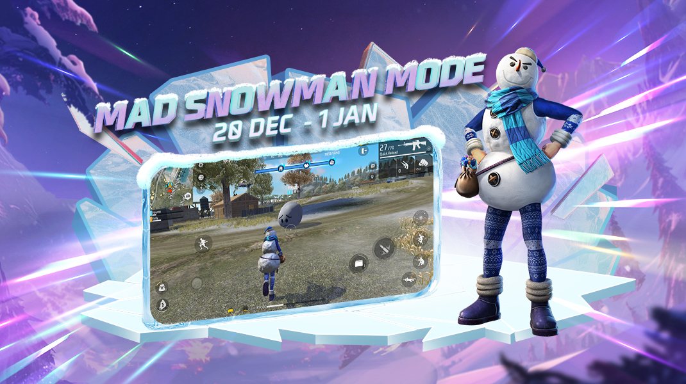
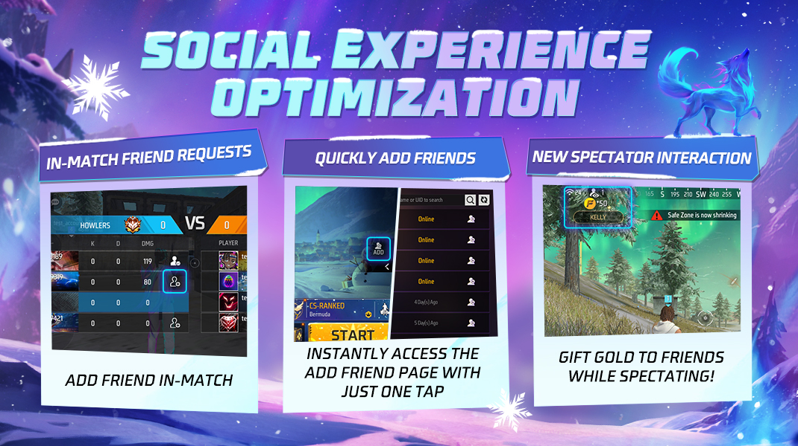

# Free Fire · OB47（Winterlands: Aurora）

- 公告日期：2024-12-02
- 官方来源：[Patch Notes](https://ff.garena.com/en/article/1424/)
- 审阅日期：2026-09-19
- 44 个分类小节；68 项说明及表格行；6 张官方公告插图。

主流程全文逐项复核、6图视觉核验；补齐配件槽、角色觉醒及尾项，保留Lila冷却冲突。官方1421同版6图SHA一致，不重复入库。

公告日2024-12-02；冬季地图配图12月4日、Koda配图12月13日、雪人模式12月20日至次年1月1日；2025排位年度另于2025-01-01生效。

Winterlands雪地与极光主题。原文：Winterlands: Aurora。[官方原图](https://lh7-rt.googleusercontent.com/docsz/AD_4nXdb6a4plGHHjZDYs5HbvGigx5oD0UK2_cgn12bFAYJAE6NAPT2MCdienyWMov8v3jH70yJw2PlJiPIPuW2-N8Wk1futBGq9u32lEDpAIqpkemPzZUWB3uLXR5jxcww3Npyl7dV-rA?key=XmDX5RryEeDAlx8KHymCO2ip) · 1070×600。

## BR · 大逃杀

### BR：Frosty Tracks与金币机

- 归属：BR · 大逃杀 / 活动覆盖
- 原文小节：Battle Royale
- 时间：Winterlands活动限定，地图配图标注2024-12-04；极光/冰霜装置随活动开放，未列结束日。

适用模式按正文，通用章节未确认全部独立玩法均适用。

Winterlands轨道与Clock Tower：12月4日。原文：Battle Royale / Map。[官方原图](https://lh7-rt.googleusercontent.com/docsz/AD_4nXePNCa6DtQ9b_djEj0HoGUTbBHw4yXEtrHQSQpfyvioWpPlpYjatO5pFgbHXQOsiAFJlO7j036fxrcjZiBHh8ZlauoC18FNFNFg2ZOwlpNnOJKHB20CxcuSXg-sxC4DxKNrZWdrvA?key=XmDX5RryEeDAlx8KHymCO2ip) · 1070×600。

- Bermuda的Peak、Katulistiwa、Clock Tower、Factory周边设置冰霜轨道；玩家可在轨道上移动、射击、转向、加速、减速和使用投掷物。
- 轨道上的特殊金币机各提供100 FF币，可在滑行时收集。
- 部分金币机受极光影响并在小地图标记；与2台极光金币机互动完成Aurora Event，Duo和Squad可由队友共同推进，并为全队提供增益：绿极光每秒恢复2EP；红极光护甲穿透+50%；蓝极光使Gloo Maker每秒额外获得0.5 EXP。该功能与Winterlands活动同步开放。 每场按极光颜色获得三者之一，不是同时获得三项。

### BR：Frosty Machines

- 归属：BR · 大逃杀 / 活动覆盖
- 原文小节：Battle Royale
- 时间：Winterlands活动限定，地图配图标注2024-12-04；极光/冰霜装置随活动开放，未列结束日。

适用模式按正文，通用章节未确认全部独立玩法均适用。

- Bermuda有三类冰霜装置并在小地图标记。冰箱互动后每3秒提供武器、医疗包、护甲和技能卡等战利品，最后一次掉落间隔6秒，总时长33秒；战利品价值随时间提高，每个冰箱只能使用一次。
- Ice Jeep生成点：互动后原地生成活动载具，乘客可开火但无辅助瞄准；1000 HP，最高45米/秒；装置冷却35秒。
- 冰雷达：互动后显示地图所有冰雷达周围敌人数，小地图显示数量但不显示精确位置，冷却30秒。

### BR：商店、物资与安全区

- 归属：BR · 大逃杀 / 常规调整
- 原文小节：Battle Royale
- 时间：公告日2024-12-02；未另列具体生效时刻。

适用模式按正文，通用章节未确认全部独立玩法均适用。

- 重做售货机物品页和界面，新增侧栏快速跳转购买区；选中物品时在右上查看说明；背包满时购买会自动丢弃低优先级物品。
- 空投移除PLASMA；RGS-50替换为FGL-24。二、三级War Chest降低一级可升级武器掉率，并加入二级可升级武器。
- 售货机移除镰刀；新增Alok技能卡300 FF币、Homer技能卡400 FF币；Heal Pistol-Y价格500→300且限购5→2；霰弹枪弹药100→200且限购3→2；狙击枪弹药100→200；MAC10-I、AUG-I各300且限购5；M590 200 FF币。

### BR：末圈移动及圈外提示

- 归属：BR · 大逃杀 / 常规调整
- 原文小节：Battle Royale > Other Adjustments
- 时间：公告日2024-12-02；未另列生效时刻。

- 不同离区等级拥有不同伤害效果；Ultra和MAX画质下安全区边缘指示更醒目。
- 最终安全区移动一次，移动前后大小不变。移动距离/时间：NeXTerra为90米/90秒；Bermuda、Kalahari、Purgatory、Alpine为60米/80秒。

### BR：跳伞提示、蘑菇与军械库

- 归属：BR · 大逃杀 / 常规调整
- 原文小节：Battle Royale > Other Adjustments
- 时间：公告日2024-12-02；未另列生效时刻。

- 跳伞阶段在小地图标点后，提示最佳离机时机。
- Cyber Mushroom可用近战武器和拳头激活。
- 军械库等待时间320→260秒；地面新增PLASMA与M590掉落。

### BR：移除一级和专属配件掉落

- 归属：BR · 大逃杀 / 常规调整
- 原文小节：Weapon and Balance > Weapon Attachment Adjustment
- 时间：公告日2024-12-02；未另列生效时刻。

- 一级配件及武器专属配件（例Marksman Grip、AR Magazine）不再在BR掉落。

## CS · 枪王对决

### CS：Frosty Tracks与极光

- 归属：CS · 枪王对决 / 活动覆盖
- 原文小节：Clash Squad
- 时间：Winterlands活动限定，地图配图标注2024-12-04；极光/冰霜装置随活动开放，未列结束日。

适用模式按正文，通用章节未确认全部独立玩法均适用。

- Bermuda的Katulistiwa、Clock Tower、Mill、Hangar周边设置冰霜轨道；可在轨道上移动、射击、转向、加速、减速和使用投掷物。CS轨道位置与BR不同。
- 部分补给装置受极光影响并在小地图标记；与1台极光补给装置互动完成Aurora Event，为全队提供增益：绿极光每秒恢复2EP；红极光护甲穿透+50%；蓝极光每回合开始获得1面Gloo墙。 每场按极光颜色获得三者之一。

### CS：商店价格

- 归属：CS · 枪王对决 / 常规调整
- 原文小节：Clash Squad
- 时间：公告日2024-12-02；未另列具体生效时刻。

适用模式按正文，通用章节未确认全部独立玩法均适用。

- M590（新）：1700 CS Cash；AC80：2000→1900；MAC10-II（Cyber Item）：1700→1600；AUG-II（Cyber Item）：1700→1600；Trogon（Cyber Item）：2000→1900。

### CS：蘑菇购买限制和收益明细

- 归属：CS · 枪王对决 / 常规调整
- 原文小节：Clash Squad
- 时间：公告日2024-12-02；未另列生效时刻。

- EP已满时，不能再购买蘑菇或请求队友代买。
- 购买阶段显示上回合CS现金收入明细。

### CS Pochinok：阳台栏杆射击修复

- 归属：CS · 枪王对决 / 常规调整
- 原文小节：Map > Other Map Adjustment
- 时间：公告日2024-12-02；未另列生效时刻。

- 修复无法射击某出生点二楼阳台栏杆后敌人的问题。

## 通用局内调整

### Koda：极光视野

- 归属：通用局内调整 / 常规调整
- 原文小节：Characters
- 时间：同页角色配图标注2024-12-13，不以12月2日公告日作为角色上线日。

适用模式按正文，通用章节未确认全部独立玩法均适用。

Koda 12月13日、角色平衡与觉醒合并。原文：Characters。[官方原图](https://lh7-rt.googleusercontent.com/docsz/AD_4nXcAz79jkoEwOwwCAEk4dnTqq6KIp91mzjFgbN0bXfxdzu-YS0-BhhWInhHNpiYnzBS_RmwU3bJUkMdVbkLYIN-lyi-8meKGYZe8UuQWBUyTiPccNh7IbbUJIW21A2VhQuWG-6CDaA?key=XmDX5RryEeDAlx8KHymCO2ip) · 1070×600。

- 极光视野：激活极光力量10秒，移动速度+10%，每秒发现50米内掩体后的敌人；不能发现蹲下或趴下敌人。冷却60秒。跳伞时可高亮视野内敌人，但队友不可见。

### Alvaro：分裂爆破

- 归属：通用局内调整 / 常规调整
- 原文小节：Characters
- 时间：公告日2024-12-02；未另列具体生效时刻。

适用模式按正文，通用章节未确认全部独立玩法均适用。

- 爆炸武器伤害+20%、范围+10%；每枚手雷爆炸后分裂3枚小手雷，每枚造成原手雷20%伤害。

### Skyler：潮汐节奏

- 归属：通用局内调整 / 常规调整
- 原文小节：Characters
- 时间：公告日2024-12-02；未另列具体生效时刻。

适用模式按正文，通用章节未确认全部独立玩法均适用。

- 声波目标可自动瞄准Gloo墙。

### Tatsuya：疾行冲刺

- 归属：通用局内调整 / 常规调整
- 原文小节：Characters
- 时间：公告日2024-12-02；未另列具体生效时刻。

适用模式按正文，通用章节未确认全部独立玩法均适用。

- 0.3秒高速冲刺，最多储存2次，连续使用间冷却1→5秒，补充时间60秒。

### Wukong：伪装

- 归属：通用局内调整 / 常规调整
- 原文小节：Characters
- 时间：公告日2024-12-02；未另列具体生效时刻。

适用模式按正文，通用章节未确认全部独立玩法均适用。

- 变成灌木15秒，冷却75→90秒；攻击或受攻击恢复原状，击倒敌人后冷却重置。
- 技能期间可交互；售货机、War Chest、Portal Go、吃蘑菇、扶队友不解除伪装；载具、滑索、Launch Pad等会解除。

### Ryden：蜘蛛陷阱

- 归属：通用局内调整 / 常规调整
- 原文小节：Characters
- 时间：公告日2024-12-02；未另列具体生效时刻。

适用模式按正文，通用章节未确认全部独立玩法均适用。

- 释放可破坏爆炸蜘蛛，持续60秒；10秒内再次点击可停止移动。蜘蛛捕捉5米内首个发现的敌人，使其减速80%并每秒失去10生命。效果5→4秒，冷却60秒，最多储存2次，使用间隔10秒。

### Kairos：防御破坏

- 归属：通用局内调整 / 常规调整
- 原文小节：Characters
- 时间：公告日2024-12-02；未另列具体生效时刻。

适用模式按正文，通用章节未确认全部独立玩法均适用。

- 防御模式持续每秒恢复2EP；EP满且首次命中有护盾/护甲敌人进入破坏模式，消耗5→10EP/秒，每次命中额外削减相当于伤害120%的护盾点/护甲耐久；EP为0回到防御模式。

### Hayato：刀刃艺术

- 归属：通用局内调整 / 常规调整
- 原文小节：Characters
- 时间：公告日2024-12-02；未另列具体生效时刻。

适用模式按正文，通用章节未确认全部独立玩法均适用。

- 每损失10%生命，护甲穿透+3.5%，正面受到伤害降低2%。

### Lila：Gloo打击

- 归属：通用局内调整 / 常规调整
- 原文小节：Characters
- 时间：公告日2024-12-02；未另列具体生效时刻。

适用模式按正文，通用章节未确认全部独立玩法均适用。

- 步枪命中敌人或载具，使敌人移动速度降低10%或载具加速度降低50%→80%，持续3秒；减速期间敌人被击倒则冻结最多3秒、获得1面额外Gloo墙并进入10秒技能冷却。
- 说明段称“removed the cooldown”，但技能明细仍写10秒冷却；两处冲突，保留差异，不自行断定冷却为0或10秒。

### Nairi：冰铁

- 归属：通用局内调整 / 常规调整
- 原文小节：Characters
- 时间：公告日2024-12-02；未另列具体生效时刻。

适用模式按正文，通用章节未确认全部独立玩法均适用。

- 部署Gloo墙后3→2秒内，墙体每秒恢复160耐久，5米内队友每秒恢复10生命；多面Gloo墙不能叠加治疗。

### M590

- 归属：通用局内调整 / 常规调整
- 原文小节：Weapon and Balance
- 时间：公告日2024-12-02；未另列具体生效时刻。

适用模式按正文，通用章节未确认全部独立玩法均适用。

M590、配件、终结技与狙击准星。原文：Weapon and Balance / Gameplay。[官方原图](https://lh7-rt.googleusercontent.com/docsz/AD_4nXeV1JNd46fWQ89QNcHpwb17_FAjkNKCZ6bv47vW1VM7Q9Qn1nr5k_nRFovKxavD4wX_Hqfg2axbVry1pAlaWFd-qB2aRkIxZRErrKnKtxOTuU876f59JUK3g5Sy6pW1iUtAEeLblA?key=XmDX5RryEeDAlx8KHymCO2ip) · 1070×600。

- 新霰弹枪；使用爆炸弹，命中敌人、墙或地面时爆炸造成范围伤害，未命中则短暂延迟后在空中爆炸。

### 配件调整

- 归属：通用局内调整 / 常规调整
- 原文小节：Weapon and Balance
- 时间：公告日2024-12-02；未另列具体生效时刻。

适用模式按正文，通用章节未确认全部独立玩法均适用。

- 弹匣：弹匣+、换弹速度+改为仅弹匣+；枪托：精准度+、移动速度+改为仅精准度+。 剩余单属性增益提高，未给数值。
- 新增神话级Fast Mag、Light Foregrip、Power Stock；分别提供弹匣+与换弹速度+、精准度+与开火移动速度+、精准度+与射速+；Power Stock不兼容霰弹枪和冲锋枪。 总述称适用于所有枪型，但Power Stock单独列上述例外。

### P90

- 归属：通用局内调整 / 常规调整
- 原文小节：Weapon and Balance
- 时间：公告日2024-12-02；未另列具体生效时刻。

适用模式按正文，通用章节未确认全部独立玩法均适用。

- 精准度+10%，伤害+5%

### M4A1

- 归属：通用局内调整 / 常规调整
- 原文小节：Weapon and Balance
- 时间：公告日2024-12-02；未另列具体生效时刻。

适用模式按正文，通用章节未确认全部独立玩法均适用。

- 护甲穿透+4%，护盾点伤害+20%，爆头距离+10%

### M14

- 归属：通用局内调整 / 常规调整
- 原文小节：Weapon and Balance
- 时间：公告日2024-12-02；未另列具体生效时刻。

适用模式按正文，通用章节未确认全部独立玩法均适用。

- 爆头距离+10%

### Trogon

- 归属：通用局内调整 / 常规调整
- 原文小节：Weapon and Balance
- 时间：公告日2024-12-02；未另列具体生效时刻。

适用模式按正文，通用章节未确认全部独立玩法均适用。

- 射程-8%，换弹速度+15%

### M1014

- 归属：通用局内调整 / 常规调整
- 原文小节：Weapon and Balance
- 时间：公告日2024-12-02；未另列具体生效时刻。

适用模式按正文，通用章节未确认全部独立玩法均适用。

- 换弹速度+7%，射程-8%

### 觉醒技能统一替换

- 归属：通用局内调整 / 常规调整
- 原文小节：Characters > Awakening System Optimization
- 时间：公告日2024-12-02；未另列生效时刻。

- 全部未觉醒技能替换为觉醒版；已持有角色在更新后进入预设页自动获得，未来购买直接获得觉醒版。
- 未觉醒和觉醒外观均保留，可自由选择。

### Homer：优先站立敌人

- 归属：通用局内调整 / 常规调整
- 原文小节：Characters > Other Adjustments
- 时间：公告日2024-12-02；未另列生效时刻。

- 优先攻击仍存活的敌人，降低锁定倒地敌人的概率。

### Winterlands：Bermuda雪景与Clock Tower

- 归属：通用局内调整 / 活动覆盖
- 原文小节：Map > Winterlands-Themed Bermuda
- 时间：同页冬季地图图标注2024-12-04；未给结束日。

- Bermuda覆盖积雪，全部河流结冰；Clock Tower和Factory持续下雪。
- Clock Tower增加灯串、礼盒、雪松及冰雕，塔结构调整、顶部Yeti作为地标。
- 不同区域铺设Frosty Tracks；极光随时间变化出现。

### 配件槽图标与瞄准镜倍率

- 归属：通用局内调整 / 常规调整
- 原文小节：Weapon and Balance > Weapon Attachment Adjustment
- 时间：公告日2024-12-02；未另列生效时刻。

- 瞄准镜HUD下方显示倍率。
- 背包附件槽视觉重做，已装备与未装备附件图标一致。

### 步枪配件槽

- 归属：通用局内调整 / 常规调整
- 原文小节：Weapon and Balance > Weapon Attachment Adjustment
- 时间：公告日2024-12-02；未另列生效时刻。

- M14、SCAR新增枪托槽；AN94新增枪口槽；PLASMA移除握把槽；G36新增握把槽。
- 原文说明满配性能整体基本不变，未给各槽替换的补偿数值。

### 狙击枪配件槽

- 归属：通用局内调整 / 常规调整
- 原文小节：Weapon and Balance > Weapon Attachment Adjustment
- 时间：公告日2024-12-02；未另列生效时刻。

- M24移除握把槽。
- 原文说明满配性能整体基本不变，未给各槽替换的补偿数值。

### 手枪配件槽

- 归属：通用局内调整 / 常规调整
- 原文小节：Weapon and Balance > Weapon Attachment Adjustment
- 时间：公告日2024-12-02；未另列生效时刻。

- USP与WSP移除枪口和弹匣槽；Desert Eagle、M500移除枪口槽；G18移除弹匣槽。
- 原文说明满配性能整体基本不变，未给各槽替换的补偿数值。

### 霰弹枪配件槽

- 归属：通用局内调整 / 常规调整
- 原文小节：Weapon and Balance > Weapon Attachment Adjustment
- 时间：公告日2024-12-02；未另列生效时刻。

- M1014新增握把槽；SPAS12移除弹匣槽、新增握把槽。
- 原文说明满配性能整体基本不变，未给各槽替换的补偿数值。

### 冲锋枪配件槽与4倍镜

- 归属：通用局内调整 / 常规调整
- 原文小节：Weapon and Balance > Weapon Attachment Adjustment
- 时间：公告日2024-12-02；未另列生效时刻。

- 冲锋枪不再能装4倍镜；MP5、UMP、MAC10新增枪托槽，Vector移除枪托槽；P90、VSS新增握把槽；Thompson新增弹匣槽。
- 原文说明满配性能整体基本不变，未给各槽替换的补偿数值。

### 淘汰回放

- 归属：通用局内调整 / 常规调整
- 原文小节：Gameplay > Elimination Replay
- 时间：公告日2024-12-02；未另列生效时刻。

- 被淘汰玩家可从淘汰者视角观看5秒回放；回放期间可举报疑似作弊。

### 磁力滑索

- 归属：通用局内调整 / 常规调整
- 原文小节：Gameplay > Zipline Optimization
- 时间：公告日2024-12-02；未另列生效时刻。

- 重做所有地图滑索，新增加速和反向按钮；滑行时可转动视角射击、使用医疗包和投掷物。

### 终结技重做

- 归属：通用局内调整 / 常规调整
- 原文小节：Gameplay > Finishing Move Rework
- 时间：公告日2024-12-02；未另列生效时刻。

- 拳头和平底锅也可执行终结技；完成后获得20点临时护盾和15%移动速度，持续4秒，冷却20秒。装备有专属终结技的近战武器时，会替换其他近战武器的终结动画。

### 准星、蓄力提示与输入预按

- 归属：通用局内调整 / 常规调整
- 原文小节：Gameplay > Other Adjustments
- 时间：公告日2024-12-02；未另列生效时刻。

- 狙击枪未开镜时准星也位于屏幕中央；移除Scythe蓄力冲刺。
- 附近敌人蓄力Charge Buster时会收到提示；切枪或落地恢复动画期间按开火可在动画结束立即射击；可提前点冲刺，在落地恢复、翻窗或射击动画结束后立即奔跑；优化HUD点击和动作触发反馈。

### 行为评分与局内禁言

- 归属：通用局内调整 / 常规调整
- 原文小节：System > Behavior Rating System
- 时间：公告日2024-12-02；未另列生效时刻。

- 根据Honor Score和局内行为评级；低评分在对局自动禁言，极低评分也禁言。排位积分奖惩另列附录。

### 自定义房：仅爆头规则

- 归属：通用局内调整 / 常规调整
- 原文小节：System > Custom Room Optimization
- 时间：公告日2024-12-02；未另列生效时刻。

- 新增Headshot开关，用于仅爆头模式；未指定模式范围。

### Ultra/MAX性能模式与特效

- 归属：通用局内调整 / 常规调整
- 原文小节：Other Adjustments
- 时间：公告日2024-12-02；未另列生效时刻。

- Ultra和Max画质新增Performance Mode，可提高FPS、降低发热并节省电量；收藏特效开关经优化后恢复。

### Travel Emote与动作衔接

- 归属：通用局内调整 / 常规调整
- 原文小节：Other Adjustments
- 时间：公告日2024-12-02；未另列生效时刻。

- Travel Emote可在冲刺中使用；跳跃及未触发落地恢复的坠落不会打断。

## 其他玩法与局外内容（目录摘要）

### Mad Snowman回归

淘汰积累进度，达到节点逐步穿雪人外观并增强基础属性，满进度完全变身。倒地变雪球，滚动指定距离可复活，附近队友可加快；雪球状态被敌人淘汰则永久出局。本页图明确活动2024-12-20～2025-01-01。

原文目录：Mode > Mad Snowman

### 独狼准备阶段与Wukong背景

独狼准备阶段禁用主动技能。Wukong背景更新：Horizon制造的改造战士遭队伍背叛，Kassie移除控制芯片后恢复意识，追查Horizon实验。

原文目录：Characters > Other Adjustments

### 独狼计分板

独狼计分板可查看对手已装备技能，属于独立玩法规则。

原文目录：Gameplay > Other Adjustments

### 账号恢复：地区限定

仅印尼和台湾地区（ID/TW）：绑定私人恢复邮箱，凭邮件验证码改绑其他社交平台账号；账号问题入口为Account FAQ。1421镜像没有该节，本篇保留。

原文目录：System > Account Recovery (for ID and TW regions only)

### 行为评分积分奖惩

高评分额外获得BR排位分/CS保护分；极低评分获得更少BR排位分/CS保护分，禁言规则另列局内卡。

原文目录：System > Behavior Rating System

### 房间管理

可启用提前退出/长期挂机惩罚，一段时间禁止加入其他房间；可保存房间预设但不含房名/密码。房间内可邀请已组队者、接收其他房间或队伍邀请；比赛中可被预约和观战；调整部分UI位置。仅爆头规则另列卡。

原文目录：System > Custom Room Optimization

### 观战互动

新增观战赠金认可，可向正在观战的好友赠送金币；增加可点赞高光，优化观战界面，独狼加入好友观战。

原文目录：System > Spectator Feature Optimization

### 跨模式奖励与2025排位年度

BR或CS达到Heroic/Master会激活另一模式的跨模式奖励：BR达成给予CS额外保护分和CS图标特效，CS达成给予BR额外排位分和BR图标特效。新赛季重置Booyah连胜计数；2025 Stormy Ascent排位年度奖励在2025-01-01新BR排位赛季开始时生效。

原文目录：Rank

### 大厅表情、愿望单与收藏

大厅双人表情可单人用，自动邀请全队且提示更明显。愿望单按加入人数显示热度，并支持Bundles；仓库最多收藏20件。

原文目录：Other Adjustments

### 好友、隐私和设置

局内计分板可加好友；存活时请求在聊天气泡，淘汰后在弹窗。好友较少者大厅有快速添加入口，未列阈值。招募页提供更细BR段位筛选。重排部分设置说明，资料隐私移到隐私设置；新增老兵回归通知开关，开启后回归上线通知好友；代币预览页新增获取与使用渠道跳转。

原文目录：Other Adjustments

### 回放高光

高光最长60秒，优先淘汰连杀，无连杀则记录爆头。

原文目录：Other Adjustments

### Craftland

新增Score和交互UI地图模板；创作者可上传封面并经人工审核后展示，可查看发布失败原因并修改重发；Studio新增补丁说明弹窗、Asset Store、搜索和My Assets管理，以及预设主题快速创建场景和对象。

原文目录：Craftland

## 其余原文配图

以下为尚未在上述小节内展示的原文图片，包括局外章节配图。

Mad Snowman：12月20日～1月1日。原文：Mode > Mad Snowman。[官方原图](https://lh7-rt.googleusercontent.com/docsz/AD_4nXffqTRFd01F63SYOKmcuc9CiH5pO6VPXAbogaHUAo-j8p_ijjhzwD-LKq7PzeO32c8peRiD9lnnFnPUD72FI2PevrM2nMXvlb0x-I49OlRI3iDC10TARKZbFoWiY8uS49pwSssIBA?key=XmDX5RryEeDAlx8KHymCO2ip) · 1070×600。

加好友与观战赠金。原文：Other Adjustments / System。[官方原图](https://lh7-rt.googleusercontent.com/docsz/AD_4nXey8hZ-v10a1XeQvCatFDVm9wuRFajGI4aNQvEniEXtowVNQZXFbdK--rdErqe0kF-QKJQyaruvu8p6eyGWw7JVb2zhGSZqAkxVhATen2DdGPe7boWB2ImujemSjSuPNX_tQshUmQ?key=XmDX5RryEeDAlx8KHymCO2ip) · 1070×600。

## 官方图片索引

正文图片按相关小节展示，版本总览及其他章节插图另列；同一原图只嵌入一次。

- [Winterlands轨道与Clock Tower：12月4日](https://lh7-rt.googleusercontent.com/docsz/AD_4nXePNCa6DtQ9b_djEj0HoGUTbBHw4yXEtrHQSQpfyvioWpPlpYjatO5pFgbHXQOsiAFJlO7j036fxrcjZiBHh8ZlauoC18FNFNFg2ZOwlpNnOJKHB20CxcuSXg-sxC4DxKNrZWdrvA?key=XmDX5RryEeDAlx8KHymCO2ip) · 1070×600 · 本地 `assets/ff-patches/1424-01.jpg`
- [Winterlands雪地与极光主题](https://lh7-rt.googleusercontent.com/docsz/AD_4nXdb6a4plGHHjZDYs5HbvGigx5oD0UK2_cgn12bFAYJAE6NAPT2MCdienyWMov8v3jH70yJw2PlJiPIPuW2-N8Wk1futBGq9u32lEDpAIqpkemPzZUWB3uLXR5jxcww3Npyl7dV-rA?key=XmDX5RryEeDAlx8KHymCO2ip) · 1070×600 · 本地 `assets/ff-patches/1424-02.jpg`
- [Mad Snowman：12月20日～1月1日](https://lh7-rt.googleusercontent.com/docsz/AD_4nXffqTRFd01F63SYOKmcuc9CiH5pO6VPXAbogaHUAo-j8p_ijjhzwD-LKq7PzeO32c8peRiD9lnnFnPUD72FI2PevrM2nMXvlb0x-I49OlRI3iDC10TARKZbFoWiY8uS49pwSssIBA?key=XmDX5RryEeDAlx8KHymCO2ip) · 1070×600 · 本地 `assets/ff-patches/1424-03.jpg`
- [Koda 12月13日、角色平衡与觉醒合并](https://lh7-rt.googleusercontent.com/docsz/AD_4nXcAz79jkoEwOwwCAEk4dnTqq6KIp91mzjFgbN0bXfxdzu-YS0-BhhWInhHNpiYnzBS_RmwU3bJUkMdVbkLYIN-lyi-8meKGYZe8UuQWBUyTiPccNh7IbbUJIW21A2VhQuWG-6CDaA?key=XmDX5RryEeDAlx8KHymCO2ip) · 1070×600 · 本地 `assets/ff-patches/1424-04.jpg`
- [M590、配件、终结技与狙击准星](https://lh7-rt.googleusercontent.com/docsz/AD_4nXeV1JNd46fWQ89QNcHpwb17_FAjkNKCZ6bv47vW1VM7Q9Qn1nr5k_nRFovKxavD4wX_Hqfg2axbVry1pAlaWFd-qB2aRkIxZRErrKnKtxOTuU876f59JUK3g5Sy6pW1iUtAEeLblA?key=XmDX5RryEeDAlx8KHymCO2ip) · 1070×600 · 本地 `assets/ff-patches/1424-05.jpg`
- [加好友与观战赠金](https://lh7-rt.googleusercontent.com/docsz/AD_4nXey8hZ-v10a1XeQvCatFDVm9wuRFajGI4aNQvEniEXtowVNQZXFbdK--rdErqe0kF-QKJQyaruvu8p6eyGWw7JVb2zhGSZqAkxVhATen2DdGPe7boWB2ImujemSjSuPNX_tQshUmQ?key=XmDX5RryEeDAlx8KHymCO2ip) · 1070×600 · 本地 `assets/ff-patches/1424-06.jpg`

## 版本关联来源

### [官方关联公告](https://ff.garena.com/en/article/1421/)

同版官方标题明确OB47。6张正文图逐张SHA-256相同；1424另有ID/TW账号恢复节，保留本篇为主源，不重复新增版本。

## 原文目录（对照用）

- Battle Royale
- Winterlands: Aurora
- Frosty Track:
- Aurora Event:
- Frosty Machine:
- Other Adjustments
- Vending Machine Optimizations:
- Out-of-Zone Display Optimizations:
- Cyber Mushroom Optimization: Cyber Mushrooms can now be activated by melee weapons and fists.
- Moving Safe Zone Returns:
- Arsenal Wait Time Adjustment: Shortened from 320s to 260s.
- Ground Loot Adjustment: PLASMA and M590 now available on the ground.
- Airdrop Adjustments:
- War Chest Adjustments:
- Vending Machine Adjustments:
- New weapons available in Vending Machines:
- Clash Squad
- Winterlands: Aurora
- Frosty Track:
- Aurora Event:
- Mushroom Purchase Limit: Once your EP reaches its maximum, you can no longer purchase mushrooms or ask teammates to buy mushrooms for you.
- CS Store Price Adjustments:
- Mode
- Mad Snowman
- Characters
- Awakening System Optimization
- New Character
- Koda
- Character Rework
- Alvaro
- Skyler
- Character Balance Adjustments
- Tatsuya
- Wukong
- Ryden
- Kairos
- Hayato
- Lila
- Nairi
- Other Adjustments
- Map
- Winterlands-Themed Bermuda
- Other Map Adjustment
- Weapon and Balance
- New Weapon: M590
- Weapon Attachment Adjustment
- Weapon Adjustments
- P90
- M4A1
- M14
- Trogon
- M1014
- Gameplay
- Elimination Replay
- Zipline Optimization
- Finishing Move Rework
- Other Adjustments
- System
- Account Recovery (for ID and TW regions only)
- Behavior Rating System
- Custom Room Optimization
- Spectator Feature Optimization
- Rank
- New Cross-Mode Bonus and 2025 Rank Year
- Other Adjustments
- Travel Emote Optimization:
- Duo Emote Optimization:
- Craftland
