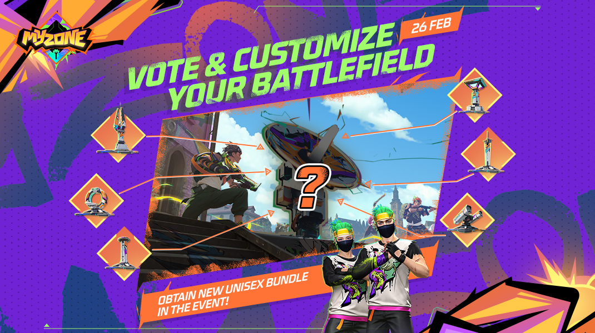
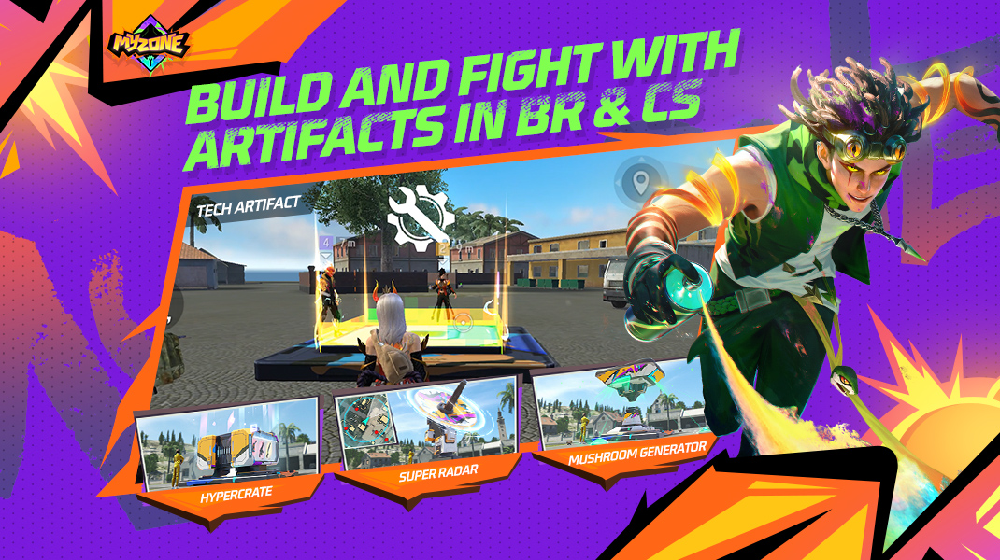
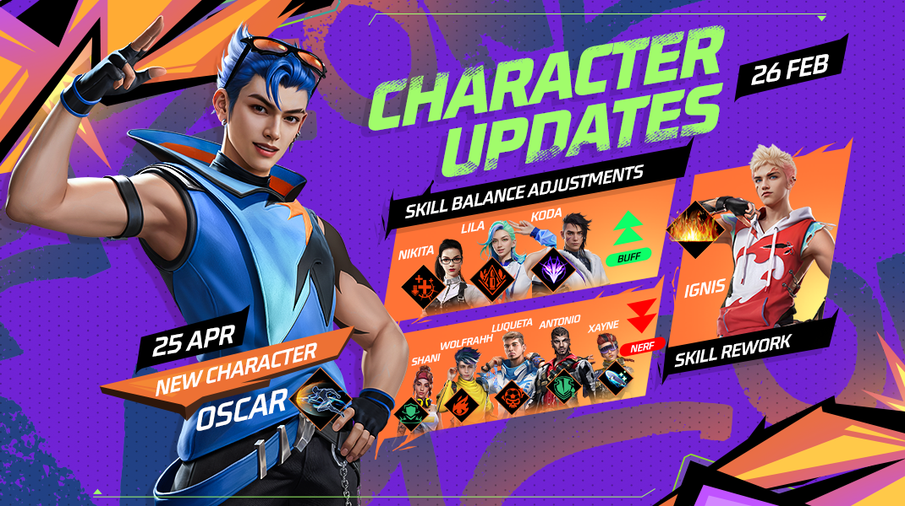
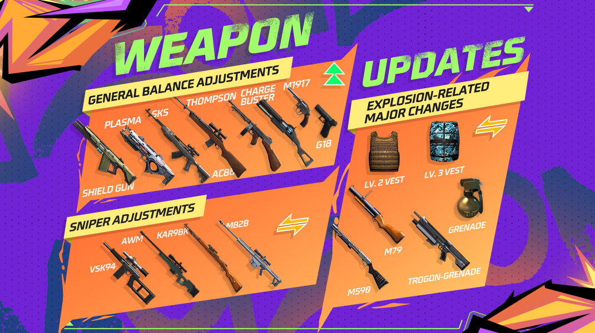

# Free Fire · OB48（MyZone）

- 公告日期：2025-02-19
- 官方来源：[Patch Notes](https://ff.garena.com/en/article/1456/)
- 审阅日期：2026-09-19
- 51 个分类小节；67 项说明及表格行；6 张官方公告插图。

主流程逐段通读完整HTML，修正草稿虚构段落、补齐局内尾项和全部局外附录；6图逐张视觉核验。

英文公告2025-02-19；MyZone投票配图明确2月26日。官方越南OB48详录1459发布日期为2月26日，地区发布日期分别保留。 角色图另注明常规角色调整2月26日、新角色Oscar4月25日。

MyZone活动总览。原文：MyZone。[官方原图](https://lh7-rt.googleusercontent.com/docsz/AD_4nXfTD2IoyKfDM004xgDxTr432i_Cd6d5gAMFmraFlRHxZVPl28khBug_0PIyLplikt7jo37DV73lMk6RHCY7GOaA2gkaWNPT3549OVyEfxvVgE_QzDDbNJf-uFvqeV8XtUNcLwhPEw?key=srvUdi2CqQzIeOGTGUessUab) · 1070×600。

## BR · 大逃杀

### BR：MyZone 创意区域

- 归属：BR · 大逃杀 / 活动覆盖
- 原文小节：Battle Royale > MyZone > Creative Zones
- 时间：活动限定；MyZone投票图注明2025-02-26，公告未统一列结束日。

正文逐项重建；适用范围按官方小节，未明确时不推断。

MyZone投票：2月26日。原文：Battle Royale / Clash Squad > MyZone。[官方原图](https://lh7-rt.googleusercontent.com/docsz/AD_4nXeOH6F409AIprs0Dmh1wURGmpyJ_dHa2SJk8dY4G82l5jfZrw73JDSkkDFZyLVsPuidiZcyXCUuFPDGL5RC3mAiXrSptggljp97TXnX5138NSDHmdnvJcFVpMJ_kh77WteoIYuQmQ?key=srvUdi2CqQzIeOGTGUessUab) · 1070×600。

BR/CS建造装置：Hypercrate、Super Radar、Mushroom Generator。原文：Battle Royale / Clash Squad > MyZone。[官方原图](https://lh7-rt.googleusercontent.com/docsz/AD_4nXcbDTlrc1mtJO2UTGlRCgwdUM2ad13AYe9R-8W_4odJKuvMJZ213kXcD6luPCS7PhOqh_bYHFv5s7SGC8bgW8UzvPHFfvS5CpLJzS6WVD6J8lrSdsDvBCX0xd7gML477NJuBy-IsA?key=srvUdi2CqQzIeOGTGUessUab) · 1070×600。

- 每张地图有 12 个 Tech Workshop，场景和小地图均有标记；互动后随机提供 3 个 Tech Artifact，花费金币建造 1 个，建成后立即出现在场景并生效；可通过 MyZone 投票解锁更强神器。
- Hypercrate：600 FF Coins；建成后等待 50 秒完全开启，获得特殊武器和物资。
- Mushroom Generator：200 FF Coins；生成 Healing、Speed、Detective 和 Wealth Mushrooms；5 秒无人互动或攻击会自动激活。Wealth Mushroom 给互动者 200 FF Coins，建造者获得促进周围生成的特殊蘑菇增益。
- Super Radar：400 FF Coins；自动扫描 200 米内敌人并在小地图标记 5 秒，冷却 50 秒。

### BR：装置物品逐项规则

- 归属：BR · 大逃杀 / 常规调整
- 原文小节：Battle Royale > Device Item Optimization
- 时间：公告日 2025-02-19；正文未另列统一生效时刻。

正文逐项重建；适用范围按官方小节，未明确时不推断。

- 所有装置物品获得地面特效、稀有度颜色和背包/商店图标；一次只能携带 1 个，并可通过主动技能卡 HUD 直接使用。
- UAV-Lite：蓝色单次使用；紫色无限使用，冷却 120 秒。
- Launch Pad：蓝色单次使用；橙色无限使用，冷却 300 秒。
- Heal UAV-Lite：蓝色单次使用；紫色无限使用，冷却 120 秒。
- 主动技能卡新增橙色无限使用版本，但冷却时间更长。
- Mini Turret：蓝色单次使用；橙色无限使用，冷却 300 秒。
- Supply Box：蓝色单次使用；部署后为队伍提供弹药和医疗物品。

### BR：背包容量与重量

- 归属：BR · 大逃杀 / 常规调整
- 原文小节：Battle Royale > Backpack Capacity Adjustment
- 时间：公告日 2025-02-19；正文未另列统一生效时刻。

正文逐项重建；适用范围按官方小节，未明确时不推断。

- 1级背包容量 60→100，官方同时写作提升 60%；2级 180→240，写作提升 30%；3级 300→360，写作提升 20%。百分比与绝对值均按原文保留，百分比与绝对数值并不完全一致，未自行改写。
- 霰弹枪弹药重量 2→3（+50%）；狙击枪弹药 2→3（+50%）；投掷物重量 3→5（+60%）。 投掷物原文+60%与3→5并不完全一致，原样保留。

### BR：地图互动点重新分布

- 归属：BR · 大逃杀 / 常规调整
- 原文小节：Map > Interactive Point Distribution Adjustments
- 时间：公告日 2025-02-19；正文未另列统一生效时刻。

正文逐项重建；适用范围按官方小节，未明确时不推断。

- 调整百慕大、炼狱、Kalahari、Alpine 军械库位置，避免集中在地图中心；百慕大 Mill、Clock Tower 新增复活点，移除 Kota Tua 复活点；Rim Nam Village、Mill 及 Alpine 的 Blue Ville、Rye、Dock 附近新增弹射器；Hangar 售货机移入区域内部。

### BR：FF币辨识

- 归属：BR · 大逃杀 / 常规调整
- 原文小节：Gameplay > Other Adjustments
- 时间：公告日2025-02-19；正文未另列生效时刻。

- 改进FF币图标和模型，使外观更一致、更易辨认。

### BR：手雷携带上限

- 归属：BR · 大逃杀 / 常规调整
- 原文小节：Gameplay > Other Adjustments
- 时间：公告日2025-02-19；正文未另列生效时刻。

- 最多携带3枚手雷。

### BR：复活默认枪改为P90

- 归属：BR · 大逃杀 / 常规调整
- 原文小节：Gameplay > Other Adjustments
- 时间：公告日2025-02-19；正文未另列生效时刻。

- 复活携带武器由Thompson改为P90。

### BR自定义房：War Chest开关

- 归属：BR · 大逃杀 / 常规调整
- 原文小节：Gameplay > Other Adjustments
- 时间：公告日2025-02-19；正文未另列生效时刻。

- 房间设置可启用或禁用War Chest。

### BR：装置掉落与售货机

- 归属：BR · 大逃杀 / 常规调整
- 原文小节：Gameplay > Other Adjustments
- 时间：公告日2025-02-19；正文未另列生效时刻。

- 空投加入紫色UAV-Lite和Heal UAV-Lite，可能随机包含其中一种；防御空投第二阶段加入橙色Launch Pad。
- 地面加入蓝色UAV-Lite、Heal UAV-Lite、Mini Turret。
- 售货机橙色主动技能卡1200 FF币，限购1；FAMAS-III 600 FF币，限购2；M1887 300 FF币，限购5。

## CS · 枪王对决

### CS：MyZone 空投活动

- 归属：CS · 枪王对决 / 活动覆盖
- 原文小节：Clash Squad > MyZone
- 时间：活动限定；MyZone投票图注明2025-02-26，公告未统一列结束日。

正文逐项重建；适用范围按官方小节，未明确时不推断。

- 活动期间 Cyber Airdrop 转为 Hypercrate Drop；占领区域扩大并增加掩体。玩家可投票把偏好的扫描效果、随机机制或增益带入 CS。

### 公会战增加CS

- 归属：CS · 枪王对决 / 常规调整
- 原文小节：Gameplay > Guild Wars Updates: CS Mode and Fairness Improvements
- 时间：公告日2025-02-19；正文未另列生效时刻。

CS公会战与公会优化。原文：Gameplay / System。[官方原图](https://lh7-rt.googleusercontent.com/docsz/AD_4nXe44CYYb6_8ybw76FDL-FwtrhquOFM7mh88Y2Aeujx5WsmhvRbHnF2-mLTJNn-LjOcRpeK15psRUJ77ABDy8WxIegVOQu1hzLAsLVAsIrwXVgX_19Dz07zTgK3T6P_9SkMljIbY7A?key=srvUdi2CqQzIeOGTGUessUab) · 1070×600。

- 公会战加入CS模式。作弊公会会受到扣分或禁赛处罚；离开公会清除本周公会战积分及活动点。

### CS：补给装置直接交互

- 归属：CS · 枪王对决 / 常规调整
- 原文小节：Gameplay > Other Adjustments
- 时间：公告日2025-02-19；正文未另列生效时刻。

- Supply Gadgets改为类似Coin Machine，玩家直接交互领取物品。

## 通用局内调整

### Oscar：Valiant Dash

- 归属：通用局内调整 / 常规调整
- 原文小节：Characters > New Character
- 时间：官方角色配图明确Oscar为2025-04-25，不以2月19日公告日作为上线日。

正文逐项重建；适用范围按官方小节，未明确时不推断。

角色调整2月26日；新角色Oscar4月25日。原文：Characters。[官方原图](https://cdn.wildflamestudio.com/common/web_event/official2.ff.garena.all/20252/d54c94a1e852e6902b8dfac0724497cc.png) · 1070×600。

- 向目标方向冲刺，引爆路径上的前3面Gloo Wall，原文同时标注25伤害；遭遇的敌人受到25伤害并被击退。冷却60秒。

### Ignis：Flame Mirage

- 归属：通用局内调整 / 常规调整
- 原文小节：Characters > Character Rework
- 时间：角色调整配图注明2025-02-26。

正文逐项重建；适用范围按官方小节，未明确时不推断。

- 部署宽 10 米、持续 10 秒、以 6 米/s 向前移动最多 5 秒的火焰屏幕；再次使用可停止。接触敌人即时造成 25 伤害，接触 Gloo Wall 即时造成 400 伤害；随后分别每秒造成 5/100 伤害，持续 2 秒；冷却 60 秒。

### 护盾点技能调整：Xayne

- 归属：通用局内调整 / 常规调整
- 原文小节：Characters > Shield-Points-Related Skill Adjustments
- 时间：角色调整配图注明2025-02-26。

正文逐项重建；适用范围按官方小节，未明确时不推断。

- Xtreme Encounter：临时护盾 60→50；持续 12 秒，期间每次击倒恢复该技能获得的临时护盾至 60→50并重置持续时间；状态结束移除；冷却 75 秒。

### 护盾点技能调整：Shani

- 归属：通用局内调整 / 常规调整
- 原文小节：Characters > Shield-Points-Related Skill Adjustments
- 时间：角色调整配图注明2025-02-26。

正文逐项重建；适用范围按官方小节，未明确时不推断。

- Gear Recycle：使用主动技能时，自己和 10 米内队友获得 40→30 护盾点；5 秒后衰减，之后可重新获得；冷却 10 秒。

### 护盾点技能调整：Luqueta

- 归属：通用局内调整 / 常规调整
- 原文小节：Characters > Shield-Points-Related Skill Adjustments
- 时间：角色调整配图注明2025-02-26。

正文逐项重建；适用范围按官方小节，未明确时不推断。

- Hat Trick：每次淘汰永久增加最大护盾点 25→20；上限 50→40；玩家被淘汰或回合重置后清除。

### 护盾点技能调整：Antonio

- 归属：通用局内调整 / 常规调整
- 原文小节：Characters > Shield-Points-Related Skill Adjustments
- 时间：角色调整配图注明2025-02-26。

正文逐项重建；适用范围按官方小节，未明确时不推断。

- Gangster's Spirit：开局额外护盾点 30→20；正文保留“战斗存活后恢复护盾点”的说明。

### Koda：Aurora Vision

- 归属：通用局内调整 / 常规调整
- 原文小节：Characters > Character Balance Adjustments
- 时间：角色调整配图注明2025-02-26。

正文逐项重建；适用范围按官方小节，未明确时不推断。

- 持续 10 秒；移速 10%→15%；每 1 秒发现 50 米内掩体后的敌人，不能发现蹲伏或趴下目标；冷却 60→45 秒。跳伞时仅高亮视野内敌人且不与队友共享。

### Wolfrahh：Limelight

- 归属：通用局内调整 / 常规调整
- 原文小节：Characters > Character Balance Adjustments
- 时间：角色调整配图注明2025-02-26。

正文逐项重建；适用范围按官方小节，未明确时不推断。

- 每次淘汰增加 1 名观众且不会减少；每名观众带来的爆头减伤 7%→4%，上限 21%→12%；对敌方爆头伤害每名 +10%，上限 +30%。

### Lila：Gloo Strike

- 归属：通用局内调整 / 常规调整
- 原文小节：Characters > Character Balance Adjustments
- 时间：角色调整配图注明2025-02-26。

正文逐项重建；适用范围按官方小节，未明确时不推断。

- 适用对象由步枪扩展为步枪与射手步枪；命中敌人使移速降低 10%，命中载具使加速度降低 50%→80%，持续 3 秒；减速期间击倒敌人可冻结最多 3 秒并获得 1 个 Gloo Wall。

### Nikita：Firearms Expert

- 归属：通用局内调整 / 常规调整
- 原文小节：Characters > Character Balance Adjustments
- 时间：角色调整配图注明2025-02-26。

正文逐项重建；适用范围按官方小节，未明确时不推断。

- 换弹速度 +30%；命中敌人后治疗削减 30%→50%，持续 10→6 秒，上限 30%→50%。

### 地图：Ramadan 与 Desert Bermuda（重复内容标记）

- 归属：通用局内调整 / 活动覆盖
- 原文小节：Map > Ramadan-Themed Map Contents / Desert-Themed Bermuda
- 时间：斋月主题活动，未列统一起止日。

正文逐项重建；适用范围按官方小节，未明确时不推断。

- Clock Tower 改为沙漠集市主题。每局有机会在 6 PM 触发斋月事件：天空转黄昏，街边摊亮灯；互动进食获得补给，吃 4 次恢复全部 EP并获得对 Gloo Wall 伤害 +100% 增益；海域改为沙漠地形，所有地图加入可互动并掉落物资的斋月骆驼。
- 原文 Ramadan-Themed Map Contents 与 Desert-Themed Bermuda 两节逐项重复同一组规则；此处合并记录一次，保留两个来源标题，不将其计为两次更新。

### 武器：SKS

- 归属：通用局内调整 / 常规调整
- 原文小节：Weapon and Balance > Weapon Adjustments
- 时间：公告日 2025-02-19；正文未另列统一生效时刻。

正文逐项重建；适用范围按官方小节，未明确时不推断。

武器平衡、爆炸伤害与防弹衣。原文：Weapon and Balance。[官方原图](https://lh7-rt.googleusercontent.com/docsz/AD_4nXfAeIPtB8G3ORIM7ld_-d1nPITTUlhjm8Mxlhfv_DKthD0QyFIVz7WTtw7ToYx0t47UNly86NrX2h04I26NanLrz03K_NuU6xwql57JcpiWGEw0QHzXNienH2PdcI5lAt2t3zMx_A?key=srvUdi2CqQzIeOGTGUessUab) · 1070×600。

- 爆头射程 +20%；精准度 -5%

### 武器：AC80

- 归属：通用局内调整 / 常规调整
- 原文小节：Weapon and Balance > Weapon Adjustments
- 时间：公告日 2025-02-19；正文未另列统一生效时刻。

正文逐项重建；适用范围按官方小节，未明确时不推断。

- 爆头射程 +20%

### 武器：PLASMA

- 归属：通用局内调整 / 常规调整
- 原文小节：Weapon and Balance > Weapon Adjustments
- 时间：公告日 2025-02-19；正文未另列统一生效时刻。

正文逐项重建；适用范围按官方小节，未明确时不推断。

- 能量恢复速度 +25%；射速 +5%；仅百慕大

### 武器：Shield Gun

- 归属：通用局内调整 / 常规调整
- 原文小节：Weapon and Balance > Weapon Adjustments
- 时间：公告日 2025-02-19；正文未另列统一生效时刻。

正文逐项重建；适用范围按官方小节，未明确时不推断。

- 护盾 HP -20%；伤害 +3%；精准度 +15%；护甲穿透 +4%；仅 NeXTerra

### 武器：AWM/AWM-Y

- 归属：通用局内调整 / 常规调整
- 原文小节：Weapon and Balance > Weapon Adjustments
- 时间：公告日 2025-02-19；正文未另列统一生效时刻。

正文逐项重建；适用范围按官方小节，未明确时不推断。

- 射速 +5%；换弹速度 -20%

### 武器：VSK94

- 归属：通用局内调整 / 常规调整
- 原文小节：Weapon and Balance > Weapon Adjustments
- 时间：公告日 2025-02-19；正文未另列统一生效时刻。

正文逐项重建；适用范围按官方小节，未明确时不推断。

- 射速 +8%

### 武器：M82B

- 归属：通用局内调整 / 常规调整
- 原文小节：Weapon and Balance > Weapon Adjustments
- 时间：公告日 2025-02-19；正文未另列统一生效时刻。

正文逐项重建；适用范围按官方小节，未明确时不推断。

- 弹匣 8→10；换弹速度 -20%

### 武器：Kar98K/Kar98K-I/II/III

- 归属：通用局内调整 / 常规调整
- 原文小节：Weapon and Balance > Weapon Adjustments
- 时间：公告日 2025-02-19；正文未另列统一生效时刻。

正文逐项重建；适用范围按官方小节，未明确时不推断。

- 换弹速度 +25%

### 武器：Thompson

- 归属：通用局内调整 / 常规调整
- 原文小节：Weapon and Balance > Weapon Adjustments
- 时间：公告日 2025-02-19；正文未另列统一生效时刻。

正文逐项重建；适用范围按官方小节，未明确时不推断。

- 伤害 +4%

### 武器：M1917

- 归属：通用局内调整 / 常规调整
- 原文小节：Weapon and Balance > Weapon Adjustments
- 时间：公告日 2025-02-19；正文未另列统一生效时刻。

正文逐项重建；适用范围按官方小节，未明确时不推断。

- 伤害 +10%；精准度 +15%

### 武器：G18

- 归属：通用局内调整 / 常规调整
- 原文小节：Weapon and Balance > Weapon Adjustments
- 时间：公告日 2025-02-19；正文未另列统一生效时刻。

正文逐项重建；适用范围按官方小节，未明确时不推断。

- 精准度 +10%

### 武器：Charge Buster

- 归属：通用局内调整 / 常规调整
- 原文小节：Weapon and Balance > Weapon Adjustments
- 时间：公告日 2025-02-19；正文未另列统一生效时刻。

正文逐项重建；适用范围按官方小节，未明确时不推断。

- 蓄力速度 +20%

### 武器：Grenade

- 归属：通用局内调整 / 常规调整
- 原文小节：Weapon and Balance > Weapon Adjustments
- 时间：公告日 2025-02-19；正文未另列统一生效时刻。

正文逐项重建；适用范围按官方小节，未明确时不推断。

- 最小伤害 40→60

### 武器：M79

- 归属：通用局内调整 / 常规调整
- 原文小节：Weapon and Balance > Weapon Adjustments
- 时间：公告日 2025-02-19；正文未另列统一生效时刻。

正文逐项重建；适用范围按官方小节，未明确时不推断。

- 最小伤害 40→60

### 武器：Trogon（榴弹）

- 归属：通用局内调整 / 常规调整
- 原文小节：Weapon and Balance > Weapon Adjustments
- 时间：公告日 2025-02-19；正文未另列统一生效时刻。

正文逐项重建；适用范围按官方小节，未明确时不推断。

- 伤害 100→60

### 武器：M590

- 归属：通用局内调整 / 常规调整
- 原文小节：Weapon and Balance > Weapon Adjustments
- 时间：公告日 2025-02-19；正文未另列统一生效时刻。

正文逐项重建；适用范围按官方小节，未明确时不推断。

- 爆炸范围 +20%；爆炸伤害 -20%

### BR/CS：特殊武器强化

- 归属：通用局内调整 / 常规调整
- 原文小节：Weapon and Balance > Special Weapon Boosts
- 时间：公告日 2025-02-19；正文未另列统一生效时刻。

正文逐项重建；适用范围按官方小节，未明确时不推断。

- Infrared：热成像与特殊瞄准镜纹理，适用 M82B；Infinite：无限弹药，适用 M60/MP5；Focused：显著提高精准度，适用 AK47/MAG-7/Bizon。BR 从 Hypercrate 获取，CS 从商店 Cyber Items 获取。

### 淘汰回放与局内反馈

- 归属：通用局内调整 / 常规调整
- 原文小节：Gameplay > Elimination Replay / Other Adjustments
- 时间：公告日 2025-02-19；正文未另列统一生效时刻。

正文逐项重建；适用范围按官方小节，未明确时不推断。

- 淘汰回放隐藏小地图，避免暴露过多敌方信息；特殊武器或机制淘汰显示更详细信息，包括 M82B/SVD-Y/Iris 穿墙伤害、VSS-III/Ryden 流血伤害。原文末尾另有“淘汰回放临时禁用”的提示，和本节优化后的规则存在时序/版本矛盾；本页未给再次启用日期，不能据优化描述判断已可用。
- 观看回放的可选时间窗口5→10秒；同页临时禁用说明优先作为可用性限制保留。

### 斜坡滑行：75°与85°阈值

- 归属：通用局内调整 / 常规调整
- 原文小节：Map > Slope Sliding Mechanism
- 时间：公告日2025-02-19；正文未另列生效时刻。

- 自然地形和环境结构坡度达到 75°开始缓慢下滑，超过 85°全速下滑；不影响玩家放置的 Gloo Wall；Kalahari 不适用。

### Santino人偶与Paloma说明

- 归属：通用局内调整 / 常规调整
- 原文小节：Characters > Other Adjustments
- 时间：角色调整配图注明2025-02-26。

- 优化Santino人偶在Gloo Wall附近无法使用的问题；调整Paloma技能描述，未列具体文本差异。

### 二三级防弹衣爆炸减伤

- 归属：通用局内调整 / 常规调整
- 原文小节：Weapon and Balance > Explosion-Related Adjustments
- 时间：公告日2025-02-19；正文未另列生效时刻。

- 2级防弹衣爆炸减伤15%→25%；3级20%→45%。

### 命中音效区分

- 归属：通用局内调整 / 常规调整
- 原文小节：Weapon and Balance > Weapon Sound Optimization
- 时间：公告日2025-02-19；正文未另列生效时刻。

- 新增命中Gloo Wall、护甲、身体、可破坏箱子的音效；优化命中载具音效。

### 无人机血条

- 归属：通用局内调整 / 常规调整
- 原文小节：Gameplay > Other Adjustments
- 时间：公告日2025-02-19；正文未另列生效时刻。

- 可被射击摧毁的所有无人机新增可见血条。

### 载具爆炸后的乘员处理

- 归属：通用局内调整 / 常规调整
- 原文小节：Gameplay > Other Adjustments
- 时间：公告日2025-02-19；正文未另列生效时刻。

- 乘员不再因载具被摧毁而立即淘汰，改为被弹出并承受爆炸伤害。

### 护盾数字显示

- 归属：通用局内调整 / 常规调整
- 原文小节：Gameplay > Other Adjustments
- 时间：公告日2025-02-19；正文未另列生效时刻。

- Information设置新增“SP number above HP”；启用后护盾显示为数字并收拢EP显示。

### 敌方蓄力提示

- 归属：通用局内调整 / 常规调整
- 原文小节：Gameplay > Other Adjustments
- 时间：公告日2025-02-19；正文未另列生效时刻。

- Charge Buster蓄力时向敌方提示。

### 局内设置归类及单步调节

- 归属：通用局内调整 / 常规调整
- 原文小节：System > Settings Page Optimization
- 时间：公告日2025-02-19；正文未另列生效时刻。

- Controls、Sensitivity等设置增加更详细的图文说明。
- 新增In-Match页，含Controls、Information、Sensitivity、Auto Pickup、Vibration五个子页，子页内选项顺序不变。
- 灵敏度和声音滑块可用按钮按1单位调节。

### 语音重连状态提示

- 归属：通用局内调整 / 常规调整
- 原文小节：Other Adjustments
- 时间：公告日2025-02-19；正文未另列生效时刻。

- 与语音服务器断连时，局内显示特殊图标，表示正在尝试重连。

## 其他玩法与局外内容（目录摘要）

### 独狼组内决斗与地图

Duel Mode可与组内好友决斗；移除部分复杂地图，新增带新资源的布局。

原文目录：Mode > Lone Wolf Mode Optimization

### Oscar背景

富裕家庭的学生，夜间作为义警行动；父母赠送定制战斗服提供突破防线能力。技能数值另列卡片。

原文目录：Characters > New Character

### 自定义房离线移除

离线过久的玩家会被自动移出自定义房，未列具体时长。

原文目录：Gameplay > Other Adjustments

### 账号恢复

不含台湾、印尼、越南地区：可绑定私人恢复邮箱，凭邮件验证码将游戏账号改绑至其他社交平台；账号问题可查Account FAQ。

原文目录：System > Account Recovery (except TW & ID & VN)

### 公会优化

新增带公会名的冰墙皮肤福利，一名成员解锁后全员可限时使用；购买者拥有专属标签及展示页。个人资料可显示公会等级、当前及往期公会战排名。钻石购买物品也可得公会活跃点；会长离开改为转交而非立即解散。邀请列表支持邀请近期在线的非好友玩家。

原文目录：System > Guild Optimization

### 技能预设页

角色页新增简化技能说明，可与详细版切换，技能标签更贴合机制。推荐预设入口及布局重做，增加推荐预设并优化配置流程。

原文目录：System > Improved Preset Page

### 排位目标提示

大厅或赛后在接近升段、赛季即将结束、即将超过好友段位、当日排位任务未完成、连败任务触发时显示目标提示弹窗。

原文目录：Rank > Ranked Goal Guidance

### 段位与点赞

新增Platinum V和Diamond V，用于根据上赛季表现更精细地重置段位；淘汰后观战可为队友或敌人点赞。

原文目录：Other Adjustments

### 藏品试用与组队推荐

购买前可试用带新特权或功能的部分武器皮肤、藏品；组队推荐弹窗优先显示KDA、爆头率、Booyah连胜、Weapon Glory排名等个人统计。

原文目录：Other Adjustments

### 违规处罚提示

检测到挂机、强退等违规且已扣Honor Score时，赛后显示处罚图标。

原文目录：Other Adjustments

### Craftland：对话剧情

可设置对话剧情及选项，触发不同逻辑分支，并配合NPC；当前仅积木可触发剧情，对话事件也仅能用于积木。

原文目录：Craftland > New plot system

### Craftland：场景与模板

新增空场景、Kalahari供编辑；新增6种几何形状和提高路径编辑效率的路点对象。组合对象可保存至Objects > My Assets > My Templates，供跨场景复用；分享模板至Asset Store为下一版本预告，非本次已上线。

原文目录：Craftland > New scene assets / Template feature

### Craftland：AI Generate

支持更多场景主题、对比连续两次生成结果，并支持大规模地图。

原文目录：Craftland > AI Generate optimization

## 官方图片索引

正文图片按相关小节展示，版本总览及其他章节插图另列；同一原图只嵌入一次。

- [MyZone活动总览](https://lh7-rt.googleusercontent.com/docsz/AD_4nXfTD2IoyKfDM004xgDxTr432i_Cd6d5gAMFmraFlRHxZVPl28khBug_0PIyLplikt7jo37DV73lMk6RHCY7GOaA2gkaWNPT3549OVyEfxvVgE_QzDDbNJf-uFvqeV8XtUNcLwhPEw?key=srvUdi2CqQzIeOGTGUessUab) · 1070×600 · 本地 `assets/ff-patches/1456-01.jpg`
- [MyZone投票：2月26日](https://lh7-rt.googleusercontent.com/docsz/AD_4nXeOH6F409AIprs0Dmh1wURGmpyJ_dHa2SJk8dY4G82l5jfZrw73JDSkkDFZyLVsPuidiZcyXCUuFPDGL5RC3mAiXrSptggljp97TXnX5138NSDHmdnvJcFVpMJ_kh77WteoIYuQmQ?key=srvUdi2CqQzIeOGTGUessUab) · 1070×600 · 本地 `assets/ff-patches/1456-02.jpg`
- [BR/CS建造装置：Hypercrate、Super Radar、Mushroom Generator](https://lh7-rt.googleusercontent.com/docsz/AD_4nXcbDTlrc1mtJO2UTGlRCgwdUM2ad13AYe9R-8W_4odJKuvMJZ213kXcD6luPCS7PhOqh_bYHFv5s7SGC8bgW8UzvPHFfvS5CpLJzS6WVD6J8lrSdsDvBCX0xd7gML477NJuBy-IsA?key=srvUdi2CqQzIeOGTGUessUab) · 1070×600 · 本地 `assets/ff-patches/1456-03.jpg`
- [角色调整2月26日；新角色Oscar4月25日](https://cdn.wildflamestudio.com/common/web_event/official2.ff.garena.all/20252/d54c94a1e852e6902b8dfac0724497cc.png) · 1070×600 · 本地 `assets/ff-patches/1456-04.png`
- [武器平衡、爆炸伤害与防弹衣](https://lh7-rt.googleusercontent.com/docsz/AD_4nXfAeIPtB8G3ORIM7ld_-d1nPITTUlhjm8Mxlhfv_DKthD0QyFIVz7WTtw7ToYx0t47UNly86NrX2h04I26NanLrz03K_NuU6xwql57JcpiWGEw0QHzXNienH2PdcI5lAt2t3zMx_A?key=srvUdi2CqQzIeOGTGUessUab) · 1070×600 · 本地 `assets/ff-patches/1456-05.jpg`
- [CS公会战与公会优化](https://lh7-rt.googleusercontent.com/docsz/AD_4nXe44CYYb6_8ybw76FDL-FwtrhquOFM7mh88Y2Aeujx5WsmhvRbHnF2-mLTJNn-LjOcRpeK15psRUJ77ABDy8WxIegVOQu1hzLAsLVAsIrwXVgX_19Dz07zTgK3T6P_9SkMljIbY7A?key=srvUdi2CqQzIeOGTGUessUab) · 1070×600 · 本地 `assets/ff-patches/1456-06.jpg`

## 版本关联来源

### [官方关联公告](https://ff.garena.com/vn/article/1459/)

官方标题明确OB48，正文MyZone及同版内容，越南地区公告日2025-02-26。

## 原文目录（对照用）

- Battle Royale
- MyZone
- Creative Zones:
- Device Item Optimization
- Backpack Capacity Adjustment
- Clash Squad
- MyZone
- Mode
- Lone Wolf Mode Optimization
- Characters
- New Character
- Oscar
- Character Rework
- Ignis
- Character Balance Adjustments
- Shield-Points-Related Skill Adjustments
- Xayne
- Shani
- Luqueta
- Antonio
- Koda
- Wolfrahh
- Lila
- Nikita
- Other Adjustments
- Map
- Interactive Point Distribution Adjustments
- Slope Sliding Mechanism
- Ramadan-Themed Map Contents
- Desert-Themed Bermuda
- Weapon and Balance
- Special Weapon Boosts
- Weapon Adjustments
- Weapon Sound Optimization
- Gameplay
- Guild Wars Updates: CS Mode and Fairness Improvements
- Elimination Replay
- Other Adjustments
- System
- Account Recovery (except TW & ID & VN)
- Guild Optimization
- Settings Page Optimization
- Improved Preset Page
- Rank
- Ranked Goal Guidance
- Other Adjustments
- Craftland
