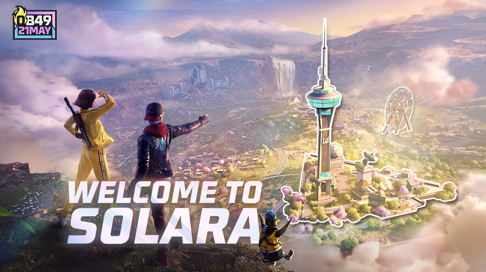
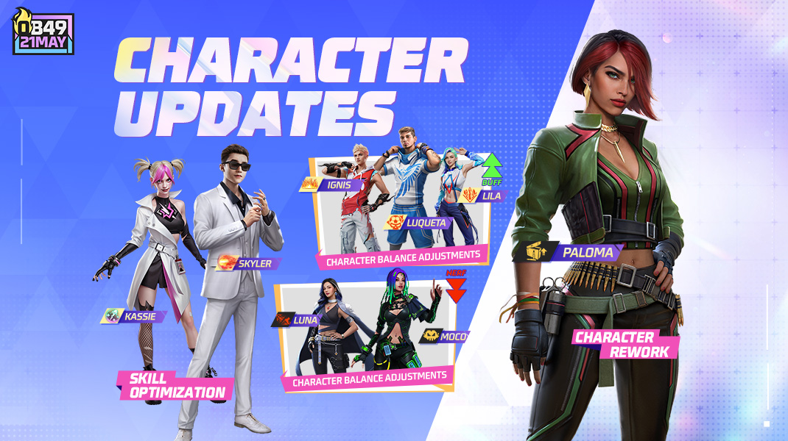
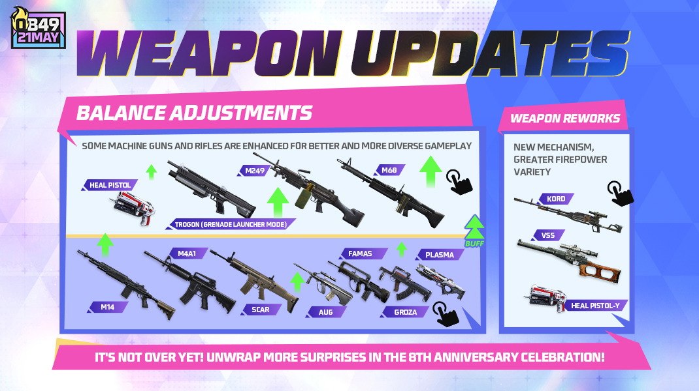
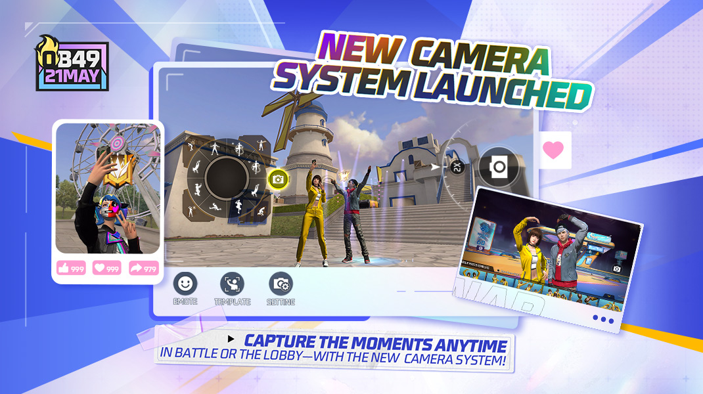
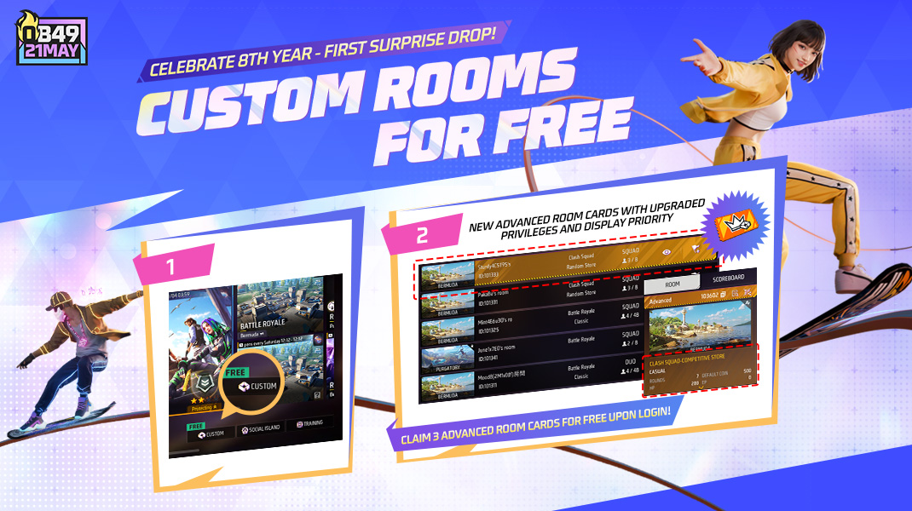

# Free Fire · OB49

- 公告日期：2025-05-21
- 官方来源：[Free Fire OB49 Patch Notes](https://ff.garena.com/en/article/1473/)
- 审阅日期：2026-09-18
- 14 个分类小节；57 项说明及表格行；5 张官方公告插图。

本篇 BR、CS、地图、装备、角色武器与局内操作详细整理；其他独立玩法及局外系统保留目录摘要。不是全部历史版本。

版本节点采用公告日期。分期开启、预告及未公布日期的事项按各项备注；公告没有给出当前仍保留的承诺。

## BR · 大逃杀

### 八周年列车、站台与无限之环

- 归属：BR · 大逃杀 / 活动覆盖
- 原文小节：8th Anniversary > Battle Royale
- 时间：本项未单独提供精确生效日期；使用公告日期索引。

- 出生舱改为无限之环，环绕列车可把人撞落。
- 地图共 8 个站台，分 4 阶段、每阶段开放 2 个；列车到站后 30 秒离站。
- 站台事件包括：冰墙生成速度变为原来的 300%；掉落可叠加的移速、伤害或护盾增益；一次自动复活；特殊无限武器空投。
- 离站时站内人数最多的队伍进入无限之环；100 米内倒地或已淘汰队友一同复活。
- 两队在环内交战，败方拿奖励后跳伞返回；胜方从四件特殊道具选一。无限冰墙：耗尽后可无限使用 15 秒，随后全部补回；无限吸入器：每 4 秒恢复 15 HP 和 20 EP；无限复活：一次携带全装备返场；无限芯片：本局全部武器伤害 +15%。

### 战备道具与口袋商店

- 归属：BR · 大逃杀 / 常规调整
- 原文小节：Battle Royale > Loadout Adjustments
- 时间：本项未单独提供精确生效日期；使用公告日期索引。

- 悬赏令奖励加入橙色 Ignis 技能卡；腿袋容量 300→240，返场冰墙 1→2；补给箱返场武器 Bizon→P90。
- 口袋商店移除复活卡及背心附件，加入吸入器、3 级头盔/背心和 Dimitri、Oscar 技能卡。
- 情报箱 600→800，超级医疗包 100→200，4 倍镜 200→100；弹药不限库存。价格单位为 FF 金币。
- 秘密线索改为每个宝箱提供 600—2000 金币；后续可能继续出现线索，或稀有 3 级头盔/4 级背心。
- 空投援助武器池为 AWM、SVD、M249、Groza。

### 新地平线单排缩圈参数

- 归属：BR · 大逃杀 / 常规调整
- 原文小节：Battle Royale > Safe Zone Adjustments
- 时间：本项未单独提供精确生效日期；使用公告日期索引。

- 分别记录圈外开始时间、安全区尺寸、等待缩圈倒计时和实际缩圈时长；横线表示该格无调整。

| 圈数 | 圈外开始时间 | 安全区尺寸 | 缩圈倒计时 | 缩圈时长 |
|---|---|---|---|---|
| 1 | 50s → 70s | 400m → 450m | 95s → 140s | - |
| 2 | - | 200m → 225m | 70s → 40s | 85s → 115s |
| 3 | - | 100m → 115m | 55s → 40s | 80s → 110s |

### 新地平线四排缩圈参数

- 归属：BR · 大逃杀 / 常规调整
- 原文小节：Battle Royale > Safe Zone Adjustments
- 时间：本项未单独提供精确生效日期；使用公告日期索引。

- 适用新地平线四排。

| 圈数 | 圈外开始时间 | 安全区尺寸 | 缩圈倒计时 | 缩圈时长 |
|---|---|---|---|---|
| 1 | 50s → 70s | 400m → 450m | 120s → 140s | 210s → 200s |
| 2 | - | 200m → 225m | 60s → 40s | 120s → 150s |
| 3 | - | 100m → 115m | 50s → 40s | 100s → 110s |

### 百慕大等四图单排缩圈参数

- 归属：BR · 大逃杀 / 常规调整
- 原文小节：Battle Royale > Safe Zone Adjustments
- 时间：本项未单独提供精确生效日期；使用公告日期索引。

- 适用百慕大、卡拉哈里、炼狱、阿尔卑斯单排。

| 圈数 | 缩圈倒计时 |
|---|---|
| 1 | 80s → 140s |
| 2 | 75s → 55s |
| 3 | 60s → 40s |
| 4 | 50s → 40s |

### 百慕大等四图四排缩圈参数

- 归属：BR · 大逃杀 / 常规调整
- 原文小节：Battle Royale > Safe Zone Adjustments
- 时间：本项未单独提供精确生效日期；使用公告日期索引。

- 适用百慕大、卡拉哈里、炼狱、阿尔卑斯四排。

| 圈数 | 缩圈倒计时 |
|---|---|
| 1 | 120s → 140s |
| 2 | 40s → 30s |
| 3 | 40s → 30s |

### 地图资源、售货机与返场资源

- 归属：BR · 大逃杀 / 常规调整
- 原文小节：Battle Royale > Other Adjustments
- 时间：本项未单独提供精确生效日期；使用公告日期索引。

- 调整金币机位置；高物资区更多分布在地图边缘并提升物资；全图总物资略减。
- 单排空投移除治疗武器；超级复活卡全局购买次数上限 15；返场保留 40% 金币、最多 400。
- 空投 M249 弹药 60→120；售货机加入 Trogon、VSS、M60-III；军械库钥匙 800→1000。
- 技能卡增加 Kenta、Skyler；卡拉哈里钩索枪取消购买数量限制。

### 装置与圈外恢复

- 归属：BR · 大逃杀 / 常规调整
- 原文小节：Battle Royale > Other Adjustments
- 时间：本项未单独提供精确生效日期；使用公告日期索引。

- 装置冷却：A124、Clu 缩短 20%；Alok、Steffie、Skyler、Iris、Tatsuya、UAV-Lite、Heal UAV 缩短 30%；Dimitri、Kenta、Mini Turret 缩短 40%；Ignis 增加 30%。
- 圈外恢复削弱的叠加上限 8→10 层；提高跳伞提示的准确性。原文没有给出量化数值。

## CS · 枪王对决

### 八周年团竞强化

- 归属：CS · 枪王对决 / 活动覆盖
- 原文小节：8th Anniversary > Clash Squad
- 时间：本项未单独提供精确生效日期；使用公告日期索引。

- 击杀及助攻给选定道具充能，三选一：无限冰墙可无限投放 15 秒；无限吸入器提供持续 15 秒的 HP/EP 恢复；无限芯片让武器伤害 +10%、持续 15 秒。
- 第 3 回合出现列车，提供增益、冰墙及特殊武器空投。

### 团竞商店

- 归属：CS · 枪王对决 / 常规调整
- 原文小节：Clash Squad
- 时间：本项未单独提供精确生效日期；使用公告日期索引。

- 新增物品描述并调整货币显示；Trogon 1900→1700；电子物品栏 VSS 1400、Kord 1400。价格单位为团竞货币。

## 通用局内调整

### 索拉拉地图与滑道

- 归属：通用局内调整 / 常规调整
- 原文小节：Map > New Map: Solara
- 时间：本项未单独提供精确生效日期；使用公告日期索引。

原文通用章节或明确跨模式内容；未单列 BR/CS 例外时不推定全部模式完全相同。

索拉拉地图与滑道官方总览。原文：Map > New Map: Solara。[官方原图](https://cdn.wildflamestudio.com/common/web_event/official2.ff.garena.all/20255/a1ca90c7d11be020775339001e767790.jpg) · 1070×600。

- Studio 的双火车沿相反方向运行；Hub 采用对称研究设施与镜像滑道；Bloomtown 的直陡路改为 S 弯；Eco Drain 有可穿行的黄色管道。
- 地图布置滑道及乘坐站；滑行时有专用环绕冰墙，附近敌人触发红色警示。
- 索拉拉加入 BR 与 CS 排位；首周每天首场失败不扣积分或星。CS 活动安排在第一回合后连续两回合同一区域交战并交换出生位置。

### 角色重做与平衡

- 归属：通用局内调整 / 常规调整
- 原文小节：Characters
- 时间：本项未单独提供精确生效日期；使用公告日期索引。

原文通用章节或明确跨模式内容；未单列 BR/CS 例外时不推定全部模式完全相同。

Paloma 重做与角色技能调整。原文：Characters。[官方原图](https://cdn.wildflamestudio.com/common/web_event/official2.ff.garena.all/20255/fa4ac632349f9f520027a28e694a88ab.jpg) · 1070×600。

- Paloma 重做：破坏冰墙后获得持续 10 秒的精度提升，原文未量化提升幅度。
- Ignis：宽 10 米、持续 10 秒的火墙以每秒 6 米移动，最大移动时间 5→8 秒，再次施放可停下。接触造成玩家 25/冰墙 400 伤害，随后 2 秒内每秒造成玩家 5、冰墙 100→150 伤害；冷却 60 秒，2 次充能，间隔 0.5 秒。
- Lila：步枪/精确射手步枪命中使敌人减速 10%，或载具加速能力降低 80%，持续 3 秒；期间击倒目标会使该目标冻结最多 3 秒，获得冰墙 1→2。
- Luqueta：每次淘汰增加护盾 20→15，上限 40→45，死亡或回合结束重置。
- Moco：普通标记 5→4 秒，觉醒移动延长上限 6.5→5.5 秒，信息共享给队友。
- Luna：射速 +8%，转换后的移速上限 15%→10%。
- Skyler 增加瞄准障碍提示；Homer、Clu 无目标时语音提示；Kassie 连线重新进入范围有缓冲，目标满血时不触发集中治疗；Arvon 宠物技能可在跳伞时使用。技能卡新增 Koda、Kassie、Oscar。

### 武器和防具平衡

- 归属：通用局内调整 / 常规调整
- 原文小节：Weapon and Balance
- 时间：本项未单独提供精确生效日期；使用公告日期索引。

原文通用章节或明确跨模式内容；未单列 BR/CS 例外时不推定全部模式完全相同。

武器、配件及重做总览。原文：Weapon and Balance。[官方原图](https://cdn.wildflamestudio.com/common/web_event/official2.ff.garena.all/20255/515c779ac9e6d1ab4109ae760ff35ac8.jpg) · 1070×600。

- M14 全系列改归精确射手步枪，穿甲 +10%，冰墙伤害 +30%。
- SCAR 全系列伤害 +3%、冰墙伤害 +30%；M4A1 全系列伤害 +5%、冰墙伤害 +30%；Groza 冰墙伤害 +30%；FAMAS/AUG 全系列冰墙伤害 +20%；Plasma 冰墙伤害 +50%。
- M60 全系列弹匣 60→70、穿甲 +8%、开火移动速度 +20%；M249 穿甲 +8%、开火移动速度 +10%；治疗手枪精度 +20%；Trogon 榴弹伤害 +15%、射程 +10%。
- 头盔强化件爆头减伤 35%→10%，头盔耐久 +10%；背心 HP 增强件护盾 30→20；背心扩展件四肢减伤 25%→10%、护盾 30→20。
- Kord：站立时连续发射 3 颗较低伤害子弹；蹲下切为中等射速的高伤害单发。
- VSS：移除流血与升级机制，改为全自动三连发，提高射速、精度、弹匣，原文未量化。
- 治疗手枪 Y：射击存活队友恢复 25 HP，射击倒地队友可扶起，不受 Thiva 技能影响，不限制扶起次数。

### 局内信息、操作和视听反馈

- 归属：通用局内调整 / 常规调整
- 原文小节：Weapon and Balance / System / Other Adjustments
- 时间：本项未单独提供精确生效日期；使用公告日期索引。

原文通用章节或明确跨模式内容；未单列 BR/CS 例外时不推定全部模式完全相同。

相机系统与局内拍摄功能。原文：System > New Camera System。[官方原图](https://cdn.wildflamestudio.com/common/web_event/official2.ff.garena.all/20255/6c435357beefef3ffd5601c138939085.jpg) · 1070×600。

- 屏幕外来弹轨迹更清楚；调整 M82B、Iris 的穿墙特效；新增冰墙、防具、身体及可破坏箱命中音效，优化载具声音。
- 相机模式隐藏敌人信息；外观预设和技能预设分开，休闲模式可自动选择接近 BR/CS/Lone Wolf 的预设。
- HUD 支持分享码，按钮尺寸 1%—200%，透明度最低 1%；载具、金币/技能、观战与自动复活按钮可自定义。
- 驾驶时可标记；智能投掷可设置自动切换；调整局内提示字体及弹窗。

## 其他玩法与局外内容（目录摘要）

### 局外系统与其他玩法

局外部分包括 Prime、免费自定义房间、Hyperbook、赛季回顾、赛季保护期限、结算实际伤害/爆头统计、违规临时封禁、个人二维码。训练场合并武器箱，淘汰 3 人补冰墙且死亡重置。Craftland 的创作与推荐功能另属编辑器/独立地图内容，不记为 BR 更新。

原文目录：System; Game Environment; Craftland

## 其余原文配图

以下为尚未在上述小节内展示的原文图片，包括局外章节配图。

免费自定义房间官方说明图。原文：System > Free Custom Rooms。[官方原图](https://cdn.wildflamestudio.com/common/web_event/official2.ff.garena.all/20255/fc3d0b92832d3bd8b49ebd42c68203ce.jpg) · 1070×600。

## 官方图片索引

正文图片按相关小节展示，版本总览及其他章节插图另列；同一原图只嵌入一次。

- [索拉拉地图与滑道官方总览](https://cdn.wildflamestudio.com/common/web_event/official2.ff.garena.all/20255/a1ca90c7d11be020775339001e767790.jpg) · 1070×600 · 本地 `assets/ff-patches/1473-01.jpg`
- [Paloma 重做与角色技能调整](https://cdn.wildflamestudio.com/common/web_event/official2.ff.garena.all/20255/fa4ac632349f9f520027a28e694a88ab.jpg) · 1070×600 · 本地 `assets/ff-patches/1473-02.jpg`
- [武器、配件及重做总览](https://cdn.wildflamestudio.com/common/web_event/official2.ff.garena.all/20255/515c779ac9e6d1ab4109ae760ff35ac8.jpg) · 1070×600 · 本地 `assets/ff-patches/1473-03.jpg`
- [相机系统与局内拍摄功能](https://cdn.wildflamestudio.com/common/web_event/official2.ff.garena.all/20255/6c435357beefef3ffd5601c138939085.jpg) · 1070×600 · 本地 `assets/ff-patches/1473-04.jpg`
- [免费自定义房间官方说明图](https://cdn.wildflamestudio.com/common/web_event/official2.ff.garena.all/20255/fc3d0b92832d3bd8b49ebd42c68203ce.jpg) · 1070×600 · 本地 `assets/ff-patches/1473-05.jpg`

## 版本关联来源

### [Solara首发与Solarush活动公告](https://ff.garena.com/en/article/1482/)

2025-05-20
5月16日是赛事首次展示，5月21日为玩家开放日；地图独有说明在本来源中补充。

- Solara尺寸1400×1400米；中心双峰山，The Hub、Studio与蓝花楹Bloomtown等区域结合自然和近未来建筑。
- 全图Slide系统可快速转点，轨道上有防护冰墙，颜色变化侦测敌人。动态天气随每局从白天变为黄昏，并改变Bloomtown、Funfair、TV Tower等区域可见度；不推定天气伤害。
- 互动及彩蛋包括Riders Club马雕像、Delta Isle地下密室、TV Tower的Kelly Show场景；5月21日起可在Kelly Show限时收集8周年代币，未列结束日。
- Solarush活动有独立界面、每日及特殊任务，探索挑战奖励含专属动画、表情、滑板、降落伞。5月16日在FFWS SEA直播首秀，不能当作玩家已可进入。

- 关联原文图片待补：原图连接超时，未取得可用缓存；不视为404。 [原图链接](https://lh7-rt.googleusercontent.com/docsz/AD_4nXdLfYis-lJ-T8lClrksVmbA4ajaKATcfBQvns8QpMibKP5WF8LikWSacIkXJibk4FZ1UObWTSCIjufbCs9PwCpAy8b4W0yhLn0Wg6RfnJJCPwjoNOZBGgJs8URYV_h9G5Oz6RgpTw?key=ttiRVf-NghXdFglfAfam8Q)

- 关联原文图片待补：原图连接超时，未取得可用缓存；不视为404。 [原图链接](https://lh7-rt.googleusercontent.com/docsz/AD_4nXfn50CUNPhEusR6mmGb0hWv7FAjoXGtNqDbkS3J4IDMs0QhikFA-snO6Ozi9U1Bm9zL1wi2LVzbXnS80821JSwnTRzRwzpV8BKOmOXosYmgEk06LFN0Ui3MQzyIl6FygJ1HUJZ4iw?key=ttiRVf-NghXdFglfAfam8Q)

## 原文目录（对照用）

- Map
- New Map: Solara
- Battle Royale
- 8th Anniversary Gameplay
- Loadout Adjustment
- Safe Zone Adjustment
- Other Adjustments
- Clash Squad
- 8th Anniversary Gameplay
- Other Adjustments
- Characters
- Character Rework
- Character Balance Adjustments
- Other Skill Adjustments
- Weapon and Balance
- Weapon Adjustments
- Attachment Adjustments
- Weapon Rework
- Others
- Weapon Sound Optimization
- System
- New Camera System
- New Prime System
- Free Custom Rooms
- Preset System Optimization
- HUD System Optimization
- Craftland Mode Selection Page Updates
- Hyperbook System Adjustments
- Other Adjustments
- Craftland
- Big News:
- Asset Store:
- Scene Editing:
- AI-Generate:
- Block Editing:
- UI Editing:
