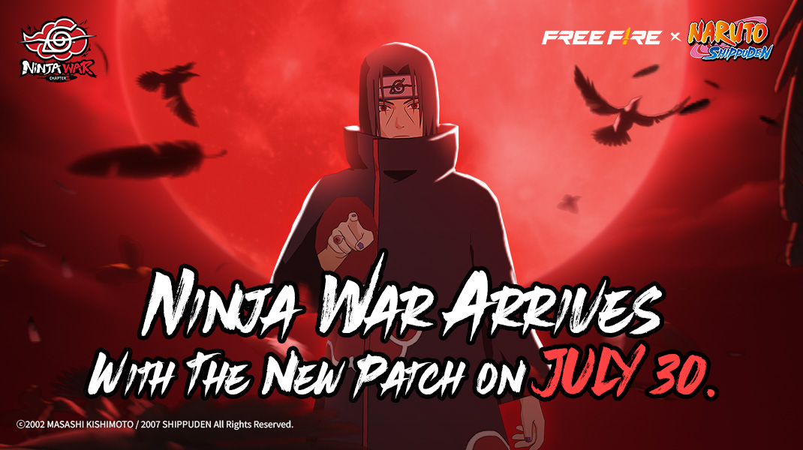
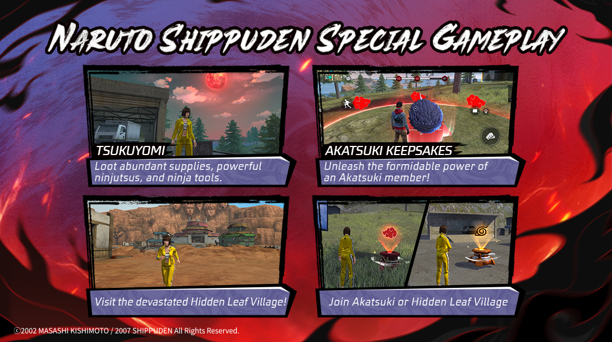
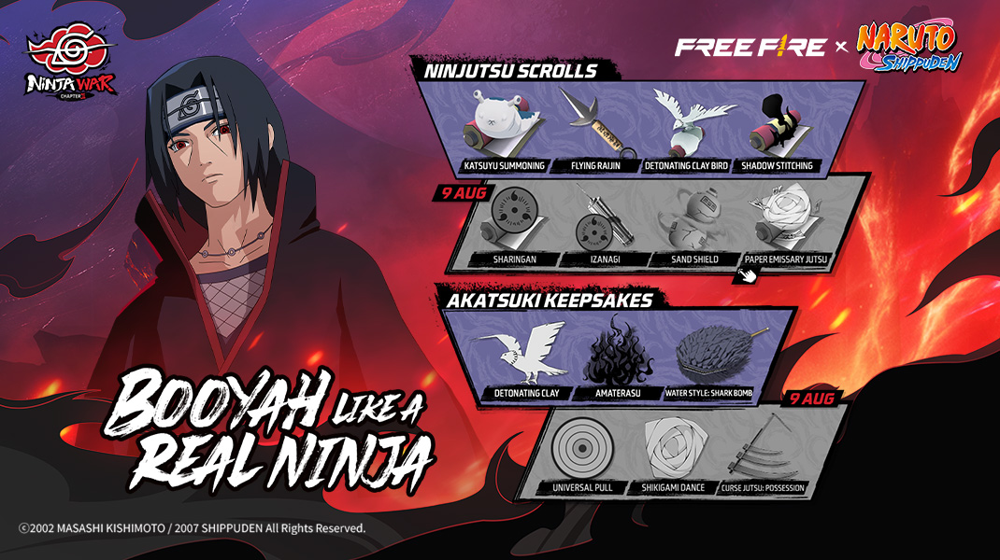
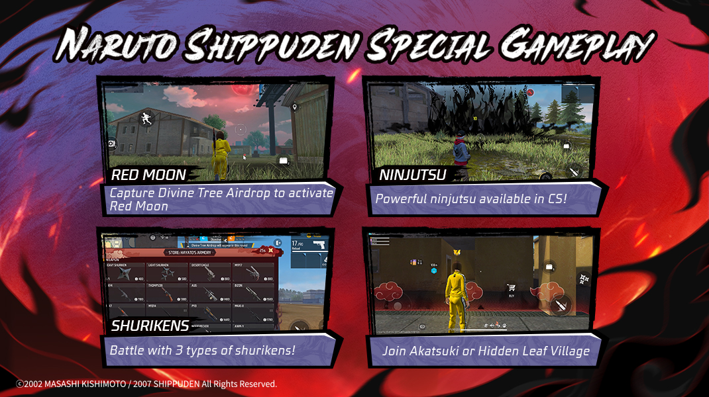
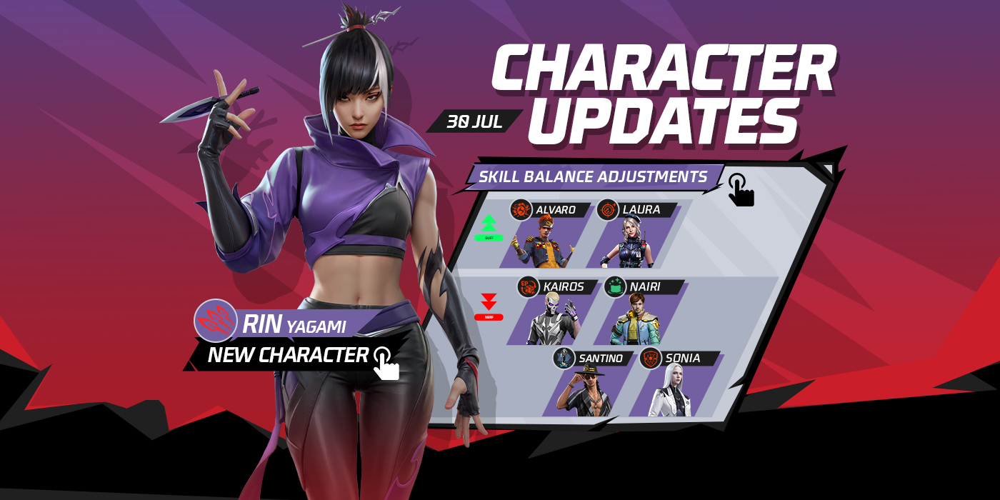
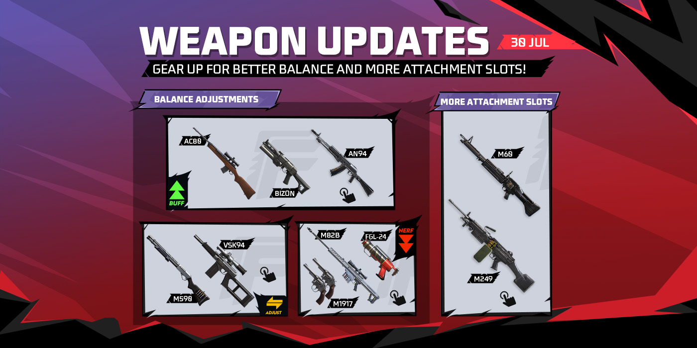

# Free Fire · OB50

- 公告日期：2025-07-30
- 官方来源：[Free Fire OB50 Patch Notes](https://ff.garena.com/en/article/1511/)
- 审阅日期：2026-09-18
- 14 个分类小节；63 项说明及表格行；6 张官方公告插图。

本篇 BR、CS、地图、装备、角色武器与局内操作详细整理；其他独立玩法及局外系统保留目录摘要。不是全部历史版本。

版本节点采用公告日期。分期开启、预告及未公布日期的事项按各项备注；公告没有给出当前仍保留的承诺。

火影忍者联动：Ninja War 官方主题图。原文：NARUTO SHIPPUDEN Collaboration。[官方原图](https://cdn.wildflamestudio.com/common/web_event/official2.ff.garena.all/20257/f9545fc3dcfb5c73ac5aae6a9eab5ce3.jpg) · 1070×600。

## BR · 大逃杀

### 月读区域、晓信物与木叶村

- 归属：BR · 大逃杀 / 活动覆盖
- 原文小节：NARUTO SHIPPUDEN Collaboration > Battle Royale
- 时间：本项未单独提供精确生效日期；使用公告日期索引。

BR 月读、晓信物、木叶村及阵营交互。原文：NARUTO SHIPPUDEN Collaboration > Battle Royale。[官方原图](https://cdn.wildflamestudio.com/common/web_event/official2.ff.garena.all/20257/806904a85d4a3db702e7c5a28ff8a247.jpg) · 1070×600。

- 所有地图出现月读区域，区域内提高忍术和忍具供给；月读结束后中心生成月读空投。
- 月读结束后所有地图可出现晓信物；完成 3 阶段占领获得特殊能力，持有者位置会在小地图公开。
- 地图上可交互晓或木叶标识选择阵营，淘汰对方阵营触发专属表现；标识覆盖所有地图。
- 百慕大木叶村变为被破坏后的布局，增加忍术和物品；该地点只在百慕大出现，并有地爆天星影响提示。
- 秽土转生主题复活点回归。

### 晓信物的六种能力

- 归属：BR · 大逃杀 / 活动覆盖
- 原文小节：NARUTO SHIPPUDEN Collaboration > Akatsuki Keepsakes
- 时间：同页忍具清单图标注万象天引、式纸之舞、咒术·附身于 2025-08-09 开放；其余信物以活动页为准。

忍术卷轴与晓信物清单，含 8 月 9 日开放标注。原文：NARUTO SHIPPUDEN Collaboration > Ninjutsu Skills & Items。[官方原图](https://cdn.wildflamestudio.com/common/web_event/official2.ff.garena.all/20257/b12ba19459fd6684d1c1a4578d3f0898.jpg) · 1070×600。

- 万象天引：增加护盾，建立球形力场吸引敌人，期间扫描敌人并持续伤害范围内冰墙。
- 式纸之舞：在范围内敌人附近生成纸炸弹，随机点燃并爆炸。
- 起爆黏土：生成可操控飞鸟，可主动引爆；未被击毁则时限结束自动爆炸，造成伤害与耳鸣效果，结束后视角回到角色位置。
- 天照：在目标区域生成黑炎墙，可无视障碍、立即摧毁冰墙并伤害敌人。
- 水遁·鲛弹：被动能力，非冷却状态下伤害敌人会召唤鲨鱼追加伤害。
- 咒术·附身：地面生成法阵，使用者位于圈内时把所受伤害反弹给攻击者，在圈内倒地可自动起身。逐项开放时间以游戏内活动页为准。

### 冰墙生成器全等级参数

- 归属：BR · 大逃杀 / 常规调整
- 原文小节：Battle Royale > Gloo Maker Adjustment
- 时间：本项未单独提供精确生效日期；使用公告日期索引。

- 整体调整：降低后期携带上限、提高升级经验需求，同时加快生成，并增加开局和复活获得的冰墙。
- 下表依次保留等级、携带上限、生成间隔、升级所需经验、开局/返场数量、每次淘汰获取量；没有箭头的格子为该版表列数值。

| 等级 | 携带上限 | 生成间隔 | 升级经验 | 开局/返场数量 | 每次淘汰获得 |
|---|---|---|---|---|---|
| 1 | 4 | 100s → 70s | 0 | 1 → 2 | 1 → 2 |
| 2 | 5 | 90s → 60s | 300 → 500 | 1 → 2 | 2 |
| 3 | 6 | 80s → 50s | 700 → 1000 | 1 → 2 | 3 → 2 |
| 4 | 7 | 60s → 40s | 1100 → 1500 | 1 → 3 | 4 → 2 |
| 5 | 10 → 7 | 50s → 30s | 1500 → 2500 | 1 → 3 | 4 → 2 |

### 跳伞与地图交互

- 归属：BR · 大逃杀 / 常规调整
- 原文小节：Battle Royale > Parachute Experience Optimization / Other Adjustments
- 时间：本项未单独提供精确生效日期；使用公告日期索引。

- 俯冲允许更陡的角度；跳伞阶段镜头可更自由调整。
- 载具碰撞可激活电子蘑菇；蹲伏或趴下时也可使用便携传送门。
- 移除科技工坊；降低钟楼、天文台和山顶等热门区域物资量，增加 Katulistiwa、Mars Electric、Pochinok 和山顶周围区域物资量。

### 售货机和悬赏名单

- 归属：BR · 大逃杀 / 常规调整
- 原文小节：Battle Royale > Other Adjustments > Vending Machine / Hit List
- 时间：本项未单独提供精确生效日期；使用公告日期索引。

- 悬赏名单售价 400→200 FF 金币；可售武器改为 MAG-7 100、MP40 200、AC80 200 FF 金币。
- Oscar 无限次技能卡 1200 FF 金币，每人限购 1；Dimitri 无限次技能卡 1200 FF 金币，每局限购 3。
- 悬赏名单扫描敌人的最小距离 100→20 米。
- 悬赏淘汰奖励：随机给 M4A1-III、MP5-III、M1014-III 之一；移除背心扩容和硬化道具；获得 3 级头盔/背心/背包的概率 33%→50%；获得 RGS-50 的概率 50%→100%。

### 道具掉落、携带与炮塔参数

- 归属：BR · 大逃杀 / 常规调整
- 原文小节：Battle Royale > Other Adjustments
- 时间：本项未单独提供精确生效日期；使用公告日期索引。

- 冰墙溶解器携带上限 3→2，掉落率降低 50%；新增 Dragon Freeze 道具，携带上限 1，原文此处未给具体效果。
- 迷你炮塔射程 30→60 米，单发伤害 20→50，射速从每秒 2 发降为每秒 1 发。
- 超级医疗道具（Super Med）拾取上限从无限改为 4。

### 单排返场、复活点与防御空投

- 归属：BR · 大逃杀 / 常规调整
- 原文小节：Battle Royale > Other Adjustments
- 时间：本项未单独提供精确生效日期；使用公告日期索引。

- 单排开局自动返场时段：索拉拉 145→420 秒；新地平线 145→390 秒；其他地图 145→385 秒。
- 复活点冷却 300→180 秒；关闭时间由第 3 次缩圈结束提前到第 2 次缩圈结束。
- 复活点占领时间：1 人 25 秒不变；2 人 20→12 秒；3 人 16→8 秒。
- 防御空投占领时间：1 人 45 秒；2 人 33→27 秒；3 人 27→19 秒；4 人 19→15 秒。

## CS · 枪王对决

### 神树空投与赤月点数

- 归属：CS · 枪王对决 / 活动覆盖
- 原文小节：NARUTO SHIPPUDEN Collaboration > Clash Squad
- 时间：本项未单独提供精确生效日期；使用公告日期索引。

CS 赤月、忍术、手里剑及阵营交互。原文：NARUTO SHIPPUDEN Collaboration > Clash Squad。[官方原图](https://cdn.wildflamestudio.com/common/web_event/official2.ff.garena.all/20257/caf159d7b6e6ee12e080510e7cb5cd56.jpg) · 1070×600。

- 信物、忍术及忍具加入团竞商店和电子空投。
- 第 3、4、5 回合出现神树空投；电子点数改为赤月点数，累计 2 点使下回合进入赤月状态，获得强化。
- 赤月可在所有 CS 地图触发；公告未逐项列出强化数值。

### 团竞商店、空投与补给装置

- 归属：CS · 枪王对决 / 常规调整
- 原文小节：Other Adjustments > CS Store Adjustments
- 时间：本项未单独提供精确生效日期；使用公告日期索引。

- M1873：400→500；AN94、G36、Kingfisher：1100→1000；VSS：1400→1500，单位均为团竞货币。
- 调整百慕大 Pochinok、Rim Nam Village 与索拉拉 Bloomtown 的电子空投位置。
- 索拉拉 CS 地图新增补给装置（Supply Gadgets）。

### CS 巅峰模式的匹配与局内规则

- 归属：CS · 枪王对决 / 常规调整
- 原文小节：System > CS-Peak
- 时间：本项未单独提供精确生效日期；使用公告日期索引。

- 赛季中期开放新的单人排队进阶排位，达到目标段位后解锁，每晚固定时段开放；公告未给明确日期及每日时段。
- 局内隐藏头像、横幅等身份信息；积分按局内表现结算。
- 商店采用赛事设置：冰墙更便宜、武器选择更多，并提供主动技能卡。
- 第 2 回合起在每回合开场展示 MVP；外部排行榜、个人展示、头像框和表情属于局外激励。

## 通用局内调整

### 联动忍术与忍具功能

- 归属：通用局内调整 / 活动覆盖
- 原文小节：NARUTO SHIPPUDEN Collaboration > Ninjutsu Skills & Items
- 时间：同页忍具清单图标注写轮眼、伊邪那岐、砂之盾、纸使者之术于 2025-08-09 开放；其余以活动页为准。

原文通用章节或明确跨模式内容；未单列 BR/CS 例外时不推定全部模式完全相同。

- 写轮眼：复制最近敌人的主动技能；蛞蝓召唤：原地召唤蛞蝓，治疗并扶起范围内队友；伊邪那岐复活：倒地后快速起身并恢复部分生命。
- 砂之盾：增加护盾及护盾恢复速度；水门苦无：投掷标记位置，再次点击传送至标记点。
- 起爆黏土鸟：操控飞行并引爆；纸使者之术：释放追踪最近敌人的纸炸弹；影缝：影子向前延伸，束缚并显著减速命中敌人。
- 三连手里剑：近距离忍具，一次扇形发射 3 枚，弹速中等。
- 自来也望远镜：原文仅描述为望远镜，未给战斗效果。全部道具开放细节以游戏内活动页为准。

### 新角色 Rin 与六名角色平衡

- 归属：通用局内调整 / 常规调整
- 原文小节：Characters
- 时间：本项未单独提供精确生效日期；使用公告日期索引。

原文通用章节或明确跨模式内容；未单列 BR/CS 例外时不推定全部模式完全相同。

Rin 新角色及角色技能调整。原文：Characters。[官方原图](https://cdn.wildflamestudio.com/common/web_event/official2.ff.garena.all/20257/9d85359a6c6ffdb99cfb18964e2fdea3.jpg) · 1400×700。

- Rin（苦无技能）：每 8 秒生成 1 枚苦无，上限 3；使用者命中敌人或冰墙后，苦无自动追踪该目标，最高 12 点伤害，距离越远伤害越高，并能显著伤害冰墙。
- Nairi：部署冰墙后的恢复时段 2→1.5 秒；每秒恢复冰墙 160 耐久不变；5 米内队友每秒治疗 10→5 HP，不因多面冰墙叠加。
- Kairos：破防状态每秒 EP 消耗 10→20；防御状态每秒恢复 2 EP，满 EP 后命中带护盾/护甲目标进入破防，对其额外削减等于伤害 120% 的护盾/护甲耐久，EP 耗尽退出。
- Sonia：致命伤后仍先进入 0.4 秒无敌且无法移动的状态；随后 2 秒护盾值 50→1 HP，护盾结束时淘汰，冷却 180 秒。
- Santino：新增假人高于本人 10 米时不能传送的限制；假人 200 HP、持续移动 25 秒、交换距离 90 米、3 秒内只能交换 1 次、最多 2 次，摧毁者标记 5 秒、冷却 60 秒。
- Laura：开镜精度加成 50%→60%；Alvaro：爆炸武器伤害 +20%、范围 +10% 保留，手雷分出的 3 枚小手雷伤害比例 20%→25%。
- Ryden、Ignis、Oscar 的施放指示适应坡度；A124 长按技能可查看弹道与爆炸范围。

### 全部武器调整

- 归属：通用局内调整 / 常规调整
- 原文小节：Weapon and Balance > Weapon Adjustments
- 时间：本项未单独提供精确生效日期；使用公告日期索引。

原文通用章节或明确跨模式内容；未单列 BR/CS 例外时不推定全部模式完全相同。

武器平衡及 M60、M249 新增配件槽位。原文：Weapon and Balance。[官方原图](https://cdn.wildflamestudio.com/common/web_event/official2.ff.garena.all/20257/f61c2da4d41357d15b9fc9ff7af0ca00.jpg) · 1400×700。

- M60、M249 新增枪口及枪托槽位。
- AC80：射速 +5%、伤害 +20%、连续命中额外伤害 -20%；AN94：精度 +10%。
- M1917：伤害 -10%；FGL24：对护甲伤害 -50%。
- M590：最低伤害 +15%、换弹速度 -20%；Bizon：精度 +10%。
- VSK94：移除辅助瞄准，射程 +10%；M82B：穿透冰墙伤害 -15%。

### 标记、姿态、瞄准与 HUD

- 归属：通用局内调整 / 常规调整
- 原文小节：Other Adjustments / System > HUD Interface
- 时间：本项未单独提供精确生效日期；使用公告日期索引。

原文通用章节或明确跨模式内容；未单列 BR/CS 例外时不推定全部模式完全相同。

- 淘汰后、进入观战前，可标记视野内敌人位置；缩短趴下后起身所需时间。
- 提高热成像镜透明度，改进局内信息面板、生命和装备信息。
- HUD 布局入口移至设置的局内栏目，分享码不再过期；快速回应、表情、宠物表情及趴下等按钮可隐藏，上车和预热手雷按钮可调整位置。
- 技能及装置旁新增关键词提示；自定义 CS 房间增加经济参数调节及高级设置。

## 其他玩法与局外内容（目录摘要）

### 其他玩法与局外目录

训练场新增技能冷却/射击灵敏度面板；战斗区开局 2 面冰墙、每 10 秒 1 面、默认上限 2，移除连杀赠墙，并移除部分栏杆。局外包含战绩分享、联动藏品总览、相册、个人装饰、工会作弊处罚通知、二维码、成就、仓库与礼品店调整、3D 大厅和 MAX 画质；Craftland 包含会员、AI 生成、素材商店等创作功能。

原文目录：Other Adjustments; System; Craftland

## 官方图片索引

正文图片按相关小节展示，版本总览及其他章节插图另列；同一原图只嵌入一次。

- [火影忍者联动：Ninja War 官方主题图](https://cdn.wildflamestudio.com/common/web_event/official2.ff.garena.all/20257/f9545fc3dcfb5c73ac5aae6a9eab5ce3.jpg) · 1070×600 · 本地 `assets/ff-patches/1511-01.jpg`
- [BR 月读、晓信物、木叶村及阵营交互](https://cdn.wildflamestudio.com/common/web_event/official2.ff.garena.all/20257/806904a85d4a3db702e7c5a28ff8a247.jpg) · 1070×600 · 本地 `assets/ff-patches/1511-02.jpg`
- [CS 赤月、忍术、手里剑及阵营交互](https://cdn.wildflamestudio.com/common/web_event/official2.ff.garena.all/20257/caf159d7b6e6ee12e080510e7cb5cd56.jpg) · 1070×600 · 本地 `assets/ff-patches/1511-03.jpg`
- [忍术卷轴与晓信物清单，含 8 月 9 日开放标注](https://cdn.wildflamestudio.com/common/web_event/official2.ff.garena.all/20257/b12ba19459fd6684d1c1a4578d3f0898.jpg) · 1070×600 · 本地 `assets/ff-patches/1511-04.jpg`
- [Rin 新角色及角色技能调整](https://cdn.wildflamestudio.com/common/web_event/official2.ff.garena.all/20257/9d85359a6c6ffdb99cfb18964e2fdea3.jpg) · 1400×700 · 本地 `assets/ff-patches/1511-05.jpg`
- [武器平衡及 M60、M249 新增配件槽位](https://cdn.wildflamestudio.com/common/web_event/official2.ff.garena.all/20257/f61c2da4d41357d15b9fc9ff7af0ca00.jpg) · 1400×700 · 本地 `assets/ff-patches/1511-06.jpg`

## 原文目录（对照用）

- NARUTO SHIPPUDEN Collaboration
- Battle Royale:
- Clash Squad:
- Battle Royale
- Characters
- New Character
- Character Balance Adjustments
- Other Character Adjustments
- Weapon and Balance
- Weapon Adjustments
- Other Adjustments
- System
- CS-Peak
- HUD Interface
- Match Result Sharing
- Collab System
- Craftland
- Craftland Membership Now Live!
- AI Generation
- Asset Store Optimization
- Other
