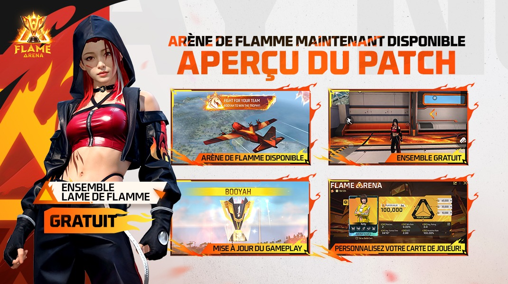
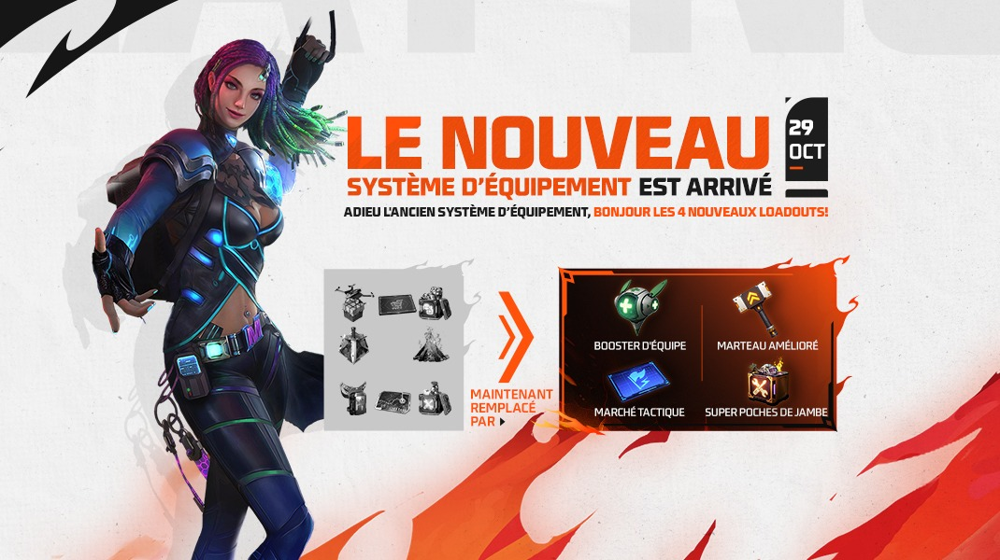
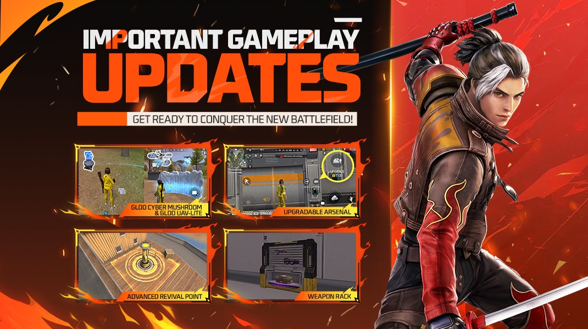
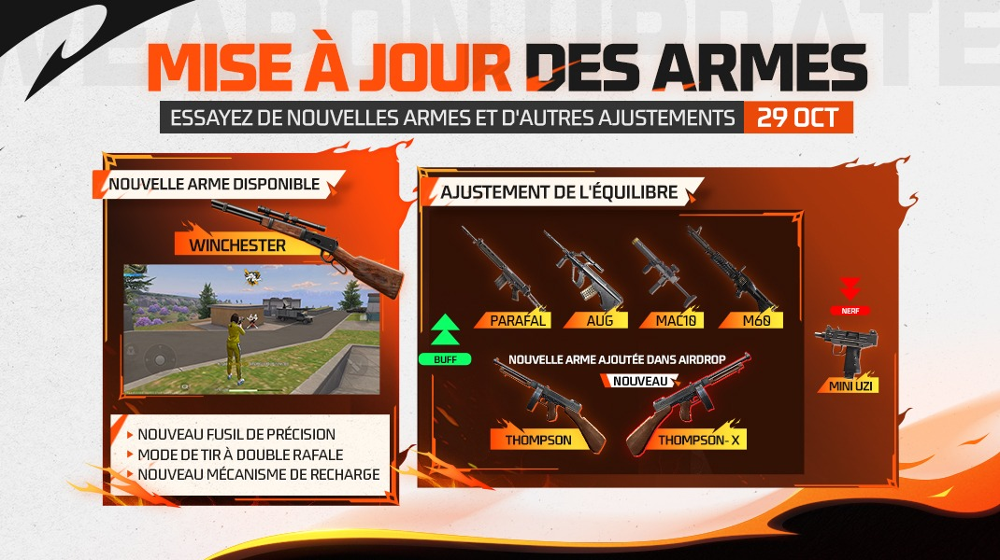
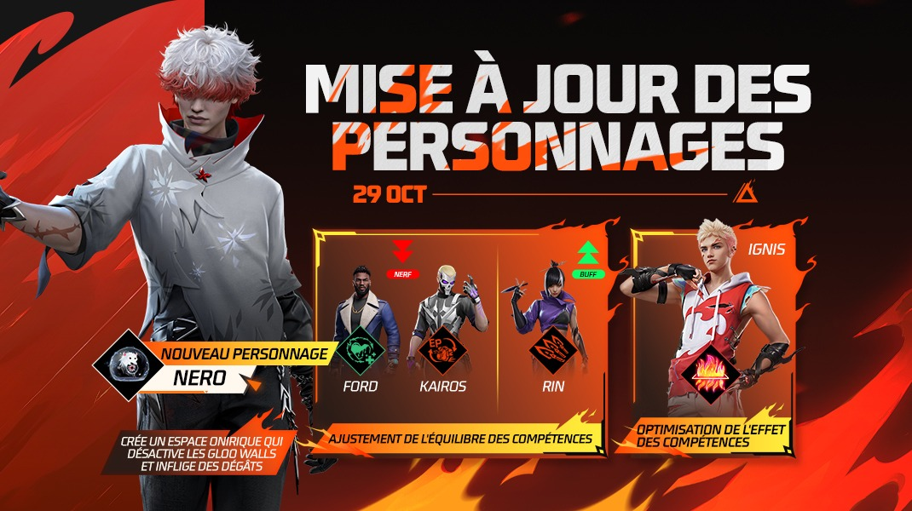

# Free Fire · OB51（2025 年 10 月更新）

- 公告日期：2025-10-29
- 官方来源：[OB51 PATCH NOTES（官网法文正文）](https://ff.garena.com/en/article/1549/)
- 审阅日期：2026-09-19
- 34 个分类小节；134 项说明及表格行；5 张官方公告插图。

逐项复核本篇 BR、CS 与通用局内章节；独立玩法和局外内容另列目录处置。未将公告日期当作统一上线日期。全部正文图已归档并按实际图像内容关联。

公告日：2025-10-29。装备、角色和武器配图标注 29 OCT；未给烈焰活动的明确起止时间。法文正文与越南/俄文存在三处冲突，见相关条目。

烈焰竞技场主题、套装与玩家卡。原文：Arène de Flammes。[官方原图](https://cdn.wildflamestudio.com/common/web_event/official2.ff.garena.all/202510/5d4bf8e19cca0350d46d013693ae728c.jpeg) · 1070×600。

## BR · 大逃杀

### 烈焰竞技场：BR 覆盖规则

- 归属：BR · 大逃杀 / 活动覆盖
- 原文小节：Arène de Flammes > Battle Royale
- 时间：公告日：2025-10-29。装备、角色和武器配图标注 29 OCT；未给烈焰活动的明确起止时间。法文正文与越南/俄文存在三处冲突，见相关条目。

- 开局时，每名玩家会随机获得一个代表其队伍、显示在天空中的旗帜；玩家为自己的旗帜作战。
- 同一旗帜下的所有队伍被淘汰后，该旗帜会在天空燃烧。
- 局内解说会播报队伍淘汰、烈焰区出现和连续多次淘汰等事件。
- 比赛进入某一阶段后，烈焰区替代常规界外区；烈焰奖杯在天空出现，剩余旗帜环绕其周。具体阶段未说明。
- 获胜队伍播放专属烈焰 Booyah 动画。

### 队伍强化（BR）

- 归属：BR · 大逃杀 / 常规调整
- 原文小节：Refonte des équipements > Renfort d’Équipe > Battle Royale
- 时间：公告日：2025-10-29。装备、角色和武器配图标注 29 OCT；未给烈焰活动的明确起止时间。法文正文与越南/俄文存在三处冲突，见相关条目。

4种Loadout替代8种旧装备；图内29 OCT。原文：Refonte des équipements。[官方原图](https://cdn.wildflamestudio.com/common/web_event/official2.ff.garena.all/202510/cb444dc530be39443c9acbd2821d2d06.jpeg) · 1070×600。

- 原有 8 种装备改为 4 种新装备；队伍强化是其中之一，公告称该重做覆盖 BR 与 CS。
- 有 3 个强化槽，可从 6 种强化中装备至多 3 种；同一强化每队只能选 1 次，效果适用于全队。
- 第 1 槽开局自动解锁；第 2、3 槽分别花费 400、800 FF 币解锁。
- 对局中可随时更换强化；解锁槽位在复活后仍保持可用。
- HP/EP 再生强化：每秒恢复 2 EP 和 1 HP。
- 加速强化：连续 4 秒没有射击且未受伤后，移动速度提高 7%。
- 强化治疗：受到的治疗提高 10%；受到界外区伤害 2 秒后效果消失。
- 界外区强化：在安全区外 EP 转换提高 200%，移动速度提高 7%。
- Gloo Wall 强化：冰墙 HP 增加 100。
- 护甲强化：每秒恢复 3% 护甲耐久。

### 强化锤（BR）

- 归属：BR · 大逃杀 / 常规调整
- 原文小节：Refonte des équipements > Marteau Renforcé > Battle Royale
- 时间：公告日：2025-10-29。装备、角色和武器配图标注 29 OCT；未给烈焰活动的明确起止时间。法文正文与越南/俄文存在三处冲突，见相关条目。

- 可在面板强化自己或队友的武器；每次强化花 600 FF 币。
- 强化后该武器所有配件升至最高等级，另有一个配件升至更高的红色等级。
- 升级配件会永久绑定在武器上，不能拆卸。

### 战术市场与雷暴发生器（BR）

- 归属：BR · 大逃杀 / 常规调整
- 原文小节：Refonte des équipements > Marché Tactique > Battle Royale
- 时间：公告日：2025-10-29。装备、角色和武器配图标注 29 OCT；未给烈焰活动的明确起止时间。法文正文与越南/俄文存在三处冲突，见相关条目。

- 战术市场可在任意地点、任意时间访问；可购买信息箱、军械库钥匙、击杀名单、战术装置、怪兽卡车和雷暴发生器。雷暴发生器每局至多 5 个，在开局 600 秒后可用。
- 雷暴发生器生成持续 30 秒的雷暴区；区内每秒随机落雷，对敌人造成 60 伤害，队友免疫。

### BR 空投与防御空投分配

- 归属：BR · 大逃杀 / 常规调整
- 原文小节：Battle Royale > Ajustement de la distribution du butin > Ajustements des largages aériens
- 时间：公告日：2025-10-29。装备、角色和武器配图标注 29 OCT；未给烈焰活动的明确起止时间。法文正文与越南/俄文存在三处冲突，见相关条目。

- 单排：270–440 秒出现黄金空投，440 秒后变红色空投；每局 6 个，NeXTerra 为 5 个。
- 双排/小队：270–460 秒出现黄金空投，460 秒后变红色空投；每局 6 个，NeXTerra 为 5 个。
- 防御空投从 180 秒开始出现；每局 4 个，NeXTerra 为 3 个。
- 黄金空投：含 1 把无限弹药的空投武器、三级头、三级甲、三级包。
- 红色空投：含 1 把无限弹药的 XY-tier 空投武器、三级头、三级甲、三级包；XY-tier 原文未定义。
- 空中支援：含 1 把无限弹药空投武器、护甲强化器和 2 个修理包。
- 防御空投：第 1 阶段为三级头和 3 个医疗包；第 2 阶段为三级甲与护甲强化器；第 3 阶段为 2 件四级甲与发射台。

### BR 战备箱、售货机与掉落池

- 归属：BR · 大逃杀 / 常规调整
- 原文小节：Battle Royale > Ajustement de la distribution du butin
- 时间：公告日：2025-10-29。装备、角色和武器配图标注 29 OCT；未给烈焰活动的明确起止时间。法文正文与越南/俄文存在三处冲突，见相关条目。

- 战备箱移除升级芯片、四级甲和空投武器；FF 币（2000→1000）、三级头、三级甲、手榴弹的出现率降低 50%。
- 售货机：升级芯片限购 2 个；移除免费配件；Ignis、Kenta 技能可以购买。
- 售货机新增/调整 Winchester-II 与 M60-II：每把均 300 FF 币、限购 5 次。
- 军械库钥匙价格 1000→600 FF 币；三级包 300→200 FF 币；三级头每局限购 5 次。
- 复活标准武器由 G18 改为 M1917；高级/上级复活武器由 P90 改为 Bizon。
- 头盔与护甲不再被完全摧毁，耐久不会低于 0；地面三级头/甲数量 20→8；移除三级武器空投。
- 怪兽卡车空投 10→5；地面出现更多 FF 币堆。
- 每次拾取修理包和吸入器均由 1→2；补给箱 20→10；空中支援空投 15→6。
- 玩家开局获得 4 个医疗包、2 个吸入器；医疗包不再占背包空间。
- 每台 FF 币机器给 200 FF 币和 2 个医疗包；淘汰时不再失去 FF 币，复活后保留 50%；淘汰奖励 100→200 FF 币。

### 高级复活点

- 归属：BR · 大逃杀 / 常规调整
- 原文小节：Battle Royale > Point de Réapparition Avancé
- 时间：公告日：2025-10-29。装备、角色和武器配图标注 29 OCT；未给烈焰活动的明确起止时间。法文正文与越南/俄文存在三处冲突，见相关条目。

Gloo蘑菇、Gloo UAV-Lite、可升级军械库、高级复活点与武器架。原文：Battle Royale。[官方原图](https://cdn.wildflamestudio.com/common/web_event/official2.ff.garena.all/202510/2387b7958b849b28211401db24a2b239.jpeg) · 1070×600。

- 每局开局有 3 个随机复活点变为带金色视觉效果的高级复活点。
- 对局 420 秒后，所有复活点都变为高级复活点。
- 从高级复活点返场会自动获得高级复活物品，并能在大地图和小地图定位复活宝箱，用于升级武器、护甲和治疗物。

### 可升级军械库

- 归属：BR · 大逃杀 / 常规调整
- 原文小节：Battle Royale > Arsenal Améliorable
- 时间：公告日：2025-10-29。装备、角色和武器配图标注 29 OCT；未给烈焰活动的明确起止时间。法文正文与越南/俄文存在三处冲突，见相关条目。

- 靠近军械库花 1500 FF 币可升级；升级后掉落更多且品质更高。
- 标准军械库和防御军械库均可升级；标准军械库仍需钥匙打开，防御军械库不需要。
- 军械库钥匙降至 600 FF 币。
- 升级后：二级头/甲及三级配件→三级头/甲及三级配件，另增加 4 把随机红色稀有度武器。

### 路线标记

- 归属：BR · 大逃杀 / 常规调整
- 原文小节：Battle Royale > Fonction Balise (Waypoint)
- 时间：公告日：2025-10-29。装备、角色和武器配图标注 29 OCT；未给烈焰活动的明确起止时间。法文正文与越南/俄文存在三处冲突，见相关条目。

- 小地图新增路线标记；最多放置 3 个点生成路线。
- 可编辑单个点或删除整条路线。
- 玩家进入某标记 15 米内后，标记在 10 秒后自动消失。

### 武器架、Gloo 蘑菇与 Gloo UAV-Lite

- 归属：BR · 大逃杀 / 常规调整
- 原文小节：Battle Royale > Râtelier d’Armes / Champignon Gloo / Gloo UAV-Lite
- 时间：公告日：2025-10-29。装备、角色和武器配图标注 29 OCT；未给烈焰活动的明确起止时间。法文正文与越南/俄文存在三处冲突，见相关条目。

- 主要区域新增 2–4 个固定武器架；每个含 2 把武器和 1 个超级医疗包。
- 新增 Gloo 蘑菇；与之交互会提高其作用范围内 Gloo 发生器的生成速度。
- 新增 Gloo UAV-Lite：部署后，作用范围内每面冰墙获得护盾，耐久显著提高；未给具体数值。

### BR：财富蘑菇

- 归属：BR · 大逃杀 / 常规调整
- 原文小节：Carte > Autres ajustements
- 时间：公告日：2025-10-29。装备、角色和武器配图标注 29 OCT；未给烈焰活动的明确起止时间。法文正文与越南/俄文存在三处冲突，见相关条目。

- BR 新增财富蘑菇；原文未列其机制。

### BR：可升级武器的地面等级

- 归属：BR · 大逃杀 / 常规调整
- 原文小节：Arme et Équilibre > Optimisation des armes améliorables
- 时间：公告日：2025-10-29。装备、角色和武器配图标注 29 OCT；未给烈焰活动的明确起止时间。法文正文与越南/俄文存在三处冲突，见相关条目。

- BR 地面掉落改为 0 级可升级武器；不再有 1 级可升级武器在地面出现。

## CS · 枪王对决

### 烈焰竞技场：CS 覆盖规则

- 归属：CS · 枪王对决 / 活动覆盖
- 原文小节：Arène de Flammes > Clash Squad
- 时间：公告日：2025-10-29。装备、角色和武器配图标注 29 OCT；未给烈焰活动的明确起止时间。法文正文与越南/俄文存在三处冲突，见相关条目。

- 两队随机获得旗帜；从第 4 回合起，烈焰区替代常规界外区，烈焰奖杯与两面旗帜出现在天空。
- CS 商店、出生区域和 Cyber 空投改为烈焰竞技场主题。
- 获胜队伍播放专属烈焰 Booyah 动画。

### 队伍强化（CS）

- 归属：CS · 枪王对决 / 常规调整
- 原文小节：Refonte des équipements > Renfort d’Équipe > Clash Squad
- 时间：公告日：2025-10-29。装备、角色和武器配图标注 29 OCT；未给烈焰活动的明确起止时间。法文正文与越南/俄文存在三处冲突，见相关条目。

- 每回合获得 1 个支援机器人；16 米内队友倒地时可远程部署救援，机器人被命中可毁。
- 支援机器人扶起队友需 7.5 秒；装备 Thiva 技能时降为 4 秒。
- CS 商店提供 Bazar secret栏目，可购买队伍增益；具体可购物品未列。

### 强化锤（CS）

- 归属：CS · 枪王对决 / 常规调整
- 原文小节：Refonte des équipements > Marteau Renforcé > Clash Squad
- 时间：公告日：2025-10-29。装备、角色和武器配图标注 29 OCT；未给烈焰活动的明确起止时间。法文正文与越南/俄文存在三处冲突，见相关条目。

- 每获得 2 次淘汰得到 1 枚锤子代币；购买阶段可用其强化 CS 商店武器，效果由队员共享。
- 锤子代币还能升级冰墙，使队伍携带上限达到 6 面。

### 战术面板装置（CS）

- 归属：CS · 枪王对决 / 常规调整
- 原文小节：Refonte des équipements > Marché Tactique > Clash Squad
- 时间：公告日：2025-10-29。装备、角色和武器配图标注 29 OCT；未给烈焰活动的明确起止时间。法文正文与越南/俄文存在三处冲突，见相关条目。

- 每回合获得战术面板；打开后从下列装置中选一种，部署到指定位置。
- 支援篝火：持续治疗 8 米内队友，并提供战斗增益；增益内容未列。
- 烟雾涡旋：生成阻断敌方视线的旋转烟雾场。
- 赛博屏障：部署大型掩体屏障。

### CS 主要奖励显示

- 归属：CS · 枪王对决 / 常规调整
- 原文小节：Carte > Autres ajustements
- 时间：公告日：2025-10-29。装备、角色和武器配图标注 29 OCT；未给烈焰活动的明确起止时间。法文正文与越南/俄文存在三处冲突，见相关条目。

- CS 对局的主要奖励现在显示得更清楚；原文未说明具体界面元素。

### CS 商店武器与价格

- 归属：CS · 枪王对决 / 常规调整
- 原文小节：Carte > Ajustements de la Boutique CS
- 时间：公告日：2025-10-29。装备、角色和武器配图标注 29 OCT；未给烈焰活动的明确起止时间。法文正文与越南/俄文存在三处冲突，见相关条目。

Winchester、Thompson-X及武器调整；图内29 OCT。原文：Arme et Équilibre。[官方原图](https://cdn.wildflamestudio.com/common/web_event/official2.ff.garena.all/202510/b0fed7e2d938eb1e2888513aa6b494b0.jpeg) · 1070×600。

- 新增 Winchester-II，价格 1700 CS 币；M1014 更换为 M1014-II，价格 1700 CS 币。
- FAMAS-II 从普通栏移除，FAMAS-III 加到 Cyber 栏，价格 1800 CS 币；M14-II 从普通栏移除，M14-III 加到 Cyber 栏，价格 1800 CS 币。
- 双持 Vector 从普通栏移到 Cyber 栏，价格 1700 CS 币；M60-II 加入 Cyber 栏，价格 1700 CS 币。
- CS 商店加入 Thompson-X，价格 2400 CS 币；该处与法文平衡段的 Thompson-V 命名冲突，越南/俄文也写 X。
- Thompson 从 Cyber 栏移至普通栏，价格 1800 CS Cash；移除 Kord。
- 价格：Thompson 1400→1800、PARAFAL 1400→1600、Bizon 1500→1400、SCAR 1500→1400 CS 币。

### CS：回合间 Thiva 技能冷却

- 归属：CS · 枪王对决 / 常规调整
- 原文小节：Personnages > Autres ajustements de personnages
- 时间：公告日：2025-10-29。装备、角色和武器配图标注 29 OCT；未给烈焰活动的明确起止时间。法文正文与越南/俄文存在三处冲突，见相关条目。

- Thiva：在 CS 一回合结束、下一回合开始前使用技能时，不会进入冷却。

### CS：Solara Hub 滑行速度

- 归属：CS · 枪王对决 / 常规调整
- 原文小节：Carte > Ajustements de Solara
- 时间：公告日：2025-10-29。装备、角色和武器配图标注 29 OCT；未给烈焰活动的明确起止时间。法文正文与越南/俄文存在三处冲突，见相关条目。

- CS Hub 的滑行速度提高。

## 通用局内调整

### 烈焰活动武器

- 归属：通用局内调整 / 活动覆盖
- 原文小节：Arène de Flammes > Arme d’événement spécial > Armes Flamer
- 时间：公告日：2025-10-29。装备、角色和武器配图标注 29 OCT；未给烈焰活动的明确起止时间。法文正文与越南/俄文存在三处冲突，见相关条目。

原文通用章节，未单列适用模式；不据此推定所有独立玩法规则相同。

- 烈焰竞技场开放时，Flamer 特殊武器出现在对局中；其火焰与榴弹造成强力范围伤害，原文未列基础伤害值。
- Trogon-Flamer：每 3 发射出 1 枚榴弹，冷却 5 秒。
- FAMAS-III-Flamer：每 3 发射出 1 枚榴弹，冷却 5 秒。
- PARAFAL-Flamer：每 3 发射出 1 枚榴弹，冷却 5 秒。
- Winchester-III-Flamer：法文正文写每 2 发射出 1 枚榴弹、冷却 5 秒；越南文 1555 与俄文 1559 均写每 3 发，地区来源数值冲突，未擅自裁定。
- AC80-Flamer：每 2 发射出 1 枚榴弹，冷却 5 秒。
- VSK94-Flamer：每发射出造成持续伤害的火焰，冷却 5 秒。
- 烈焰活动武器来源：BR 的武器架；CS 的 CS 商店。

### 超级腿包

- 归属：通用局内调整 / 常规调整
- 原文小节：Refonte des équipements > Super Poches de Jambe
- 时间：公告日：2025-10-29。装备、角色和武器配图标注 29 OCT；未给烈焰活动的明确起止时间。法文正文与越南/俄文存在三处冲突，见相关条目。

原文通用章节，未单列适用模式；不据此推定所有独立玩法规则相同。

- 旧腿包、篝火和护甲箱合并为超级腿包。
- BR 开局获得篝火、额外背包容量、额外护甲和其他未列物品。
- CS 开局获得篝火、武士刀、额外护甲和其他未列物品。

### 新角色 Nero

- 归属：通用局内调整 / 常规调整
- 原文小节：Personnages > Nouveau personnage > Nero > Esprit Glacial (Cryo Mind)
- 时间：公告日：2025-10-29。装备、角色和武器配图标注 29 OCT；未给烈焰活动的明确起止时间。法文正文与越南/俄文存在三处冲突，见相关条目。

原文通用章节，未单列适用模式；不据此推定所有独立玩法规则相同。

Nero、Ford、Kairos、Rin与Ignis；图内29 OCT。原文：Personnages。[官方原图](https://cdn.wildflamestudio.com/common/web_event/official2.ff.garena.all/202510/33c94807321e281db0c39774da30cf82.jpeg) · 1070×600。

- Nero 投出 150 HP 玩偶；持续 12 秒、无视障碍，可飞 50 米（BR 为 100 米）。
- 玩偶追踪 8 米内最近的可见敌人并爆炸，生成半径 8 米的梦境空间。
- 梦境内使用者与敌人均不能放置冰墙；敌人每秒损失 16 HP。
- 玩偶被摧毁后空间消失；摧毁者被标记 5 秒；技能冷却 45 秒。
- 介绍段另提额外伤害、眩晕及击倒能力，但后面的具体技能条款未说明其触发规则；不据介绍补造数值。

### Ford、Kairos 与 Rin 平衡

- 归属：通用局内调整 / 常规调整
- 原文小节：Personnages > Ajustements d’équilibrage des personnages
- 时间：公告日：2025-10-29。装备、角色和武器配图标注 29 OCT；未给烈焰活动的明确起止时间。法文正文与越南/俄文存在三处冲突，见相关条目。

原文通用章节，未单列适用模式；不据此推定所有独立玩法规则相同。

- Ford 的 Iron Will：受伤时每秒获得 10 HP，持续 4→3 秒；主动技能激活后该被动立即重置，冷却 20 秒。
- Kairos：防御模式持续回 2 EP/s；EP 满且对有护盾/护甲的敌人使用技能时进入破盾模式、消耗 20 EP/s。每次命中对方护盾点/护甲耐久的系数从伤害的 120%→90%；EP 到 0 后回到防御模式。
- Rin：每 8 秒召唤 1 枚苦无，最多 3 枚；会自动追踪使用者命中的敌人或冰墙，对冰墙造成大量伤害，对敌人至多 12 伤害，伤害随距离增加。
- 使用者命中目标后，苦无会更快发射；近、中距离伤害提高，远距离不变，具体增量未列。

### 其他角色与冷却显示优化

- 归属：通用局内调整 / 常规调整
- 原文小节：Personnages > Autres ajustements de personnages
- 时间：公告日：2025-10-29。装备、角色和武器配图标注 29 OCT；未给烈焰活动的明确起止时间。法文正文与越南/俄文存在三处冲突，见相关条目。

原文通用章节，未单列适用模式；不据此推定所有独立玩法规则相同。

- Ignis：己方及盟友制造的火焰屏障显示为蓝色，用以区别敌方屏障。
- Santino：技能可在 Farmtopia 的一层传送带和二层移动平台使用。
- Tatsuya：下坡时不再卡在途中。
- 界面显示技能与装置的冷却时间。

### Winchester 新武器与升级

- 归属：通用局内调整 / 常规调整
- 原文小节：Arme et Équilibre > Nouvelle arme: Winchester
- 时间：公告日：2025-10-29。装备、角色和武器配图标注 29 OCT；未给烈焰活动的明确起止时间。法文正文与越南/俄文存在三处冲突，见相关条目。

原文通用章节，未单列适用模式；不据此推定所有独立玩法规则相同。

- Winchester 是两发点射、可部分装填的远程卡宾枪；可借由造成伤害或升级芯片升级。
- Winchester：一次装填 2 发；Winchester-I/II：一次装填 4 发，射速分别为 +、++；Winchester-III：一次装填 6 发，射速 +++。符号具体数值未列。
- Winchester 来源：BR 地面掉落与售货机；CS 商店。

### 可升级武器的升级规则

- 归属：通用局内调整 / 常规调整
- 原文小节：Arme et Équilibre > Optimisation des armes améliorables
- 时间：公告日：2025-10-29。装备、角色和武器配图标注 29 OCT；未给烈焰活动的明确起止时间。法文正文与越南/俄文存在三处冲突，见相关条目。

原文通用章节，未单列适用模式；不据此推定所有独立玩法规则相同。

- M60、FAMAS、M14、M4A1、SCAR、AUG、MAC10、MP5、M1014、Kar98K 可通过累积伤害或升级芯片升级。
- 各阶段升级所需伤害：0→1 级 200，1→2 级 350，2→3 级 850；不推算从 0 级起累计阈值。

### 倒地后 HP 流失规则

- 归属：通用局内调整 / 常规调整
- 原文小节：Arme et Équilibre > Ajustement de la perte de HP après mise à terre
- 时间：公告日：2025-10-29。装备、角色和武器配图标注 29 OCT；未给烈焰活动的明确起止时间。法文正文与越南/俄文存在三处冲突，见相关条目。

原文通用章节，未单列适用模式；不据此推定所有独立玩法规则相同。

- 狙击枪、机枪、步枪造成的倒地后 HP 流失时间从 35→14 秒。
- 倒地爬行速度提高 35%。
- 装备 Ford 时，倒地后不发生 HP 流失。

### PARAFAL、Thompson 与可升级武器平衡

- 归属：通用局内调整 / 常规调整
- 原文小节：Arme et Équilibre > Ajustements d’équilibrage des armes
- 时间：公告日：2025-10-29。装备、角色和武器配图标注 29 OCT；未给烈焰活动的明确起止时间。法文正文与越南/俄文存在三处冲突，见相关条目。

原文通用章节，未单列适用模式；不据此推定所有独立玩法规则相同。

- PARAFAL：护甲穿透 +5%、伤害 +3%、精准 +5%。
- Thompson：伤害 +3%、护甲穿透 +5%、射程 +10%、精准 +5%、换弹速度 +5%，提供 2 倍镜。
- 法文把新高阶版本称为 Thompson-V：伤害 +3%、射速 +8%、护甲穿透 +10%、射程 +15%、换弹速度 +15%、精准 +5%，提供 2 倍镜；越南、俄文正文及同篇法文 CS 商店均写 Thompson-X，名称冲突，未拆为两把枪。
- SCAR/SCAR-II/SCAR-III：伤害 +3%、射速 +3%。
- M4A1/M4A1-II/M4A1-III：最小射程 +5%。原文属性写作 portée minimale，未转写为伤害。
- AUG/AUG-II/AUG-III：伤害 +5%。
- MAC10/MAC10-II/MAC10-III：射速 +6%。
- M60/M60-II/M60-III：伤害 +3%、射速 +5%。
- M14/M14-II/M14-III：射速 +10%。
- Kar98K/Kar98K-II/Kar98K-III：射速 +5%。
- FAMAS/FAMAS-II/FAMAS-III：连射伤害加成 +15%。
- Mini Uzi 弹匣容量 20→16。

### Solara 地图调整

- 归属：通用局内调整 / 常规调整
- 原文小节：Carte > Ajustements de Solara
- 时间：公告日：2025-10-29。装备、角色和武器配图标注 29 OCT；未给烈焰活动的明确起止时间。法文正文与越南/俄文存在三处冲突，见相关条目。

原文通用章节，未单列适用模式；不据此推定所有独立玩法规则相同。

- Solara 帐篷模型改为有两个开口。
- 重做 Studio、Tour TV 等多个高地。
- 轻微调整 Bloomtown 两层房屋的室内布局；调整 Bayside 小屋和周边地形。

### 着陆、准星与击杀反馈

- 归属：通用局内调整 / 常规调整
- 原文小节：Carte > Autres ajustements
- 时间：公告日：2025-10-29。装备、角色和武器配图标注 29 OCT；未给烈焰活动的明确起止时间。法文正文与越南/俄文存在三处冲突，见相关条目。

原文通用章节，未单列适用模式；不据此推定所有独立玩法规则相同。

- 使用发射台时改进落点逻辑。
- 移除“信息”下的 Hitmarker 选项；所有玩家使用新的样式。
- 提高爆头命中的反馈响应。
- 改进玩家受到坠落伤害后死亡的淘汰归属逻辑。

### 其他局内优化

- 归属：通用局内调整 / 常规调整
- 原文小节：Carte > Autres ajustements
- 时间：公告日：2025-10-29。装备、角色和武器配图标注 29 OCT；未给烈焰活动的明确起止时间。法文正文与越南/俄文存在三处冲突，见相关条目。

原文通用章节，未单列适用模式；不据此推定所有独立玩法规则相同。

- 改进角色在平面上的行为：空投降落后的恢复更快。法文未说明撞击机制，不另行补造。
- 小地图现在以玩家为中心。
- 优化 HUD 显示；法文未限定为观战 HUD。
- 修复从 Pochinok 部分建筑高窗跳出、以及 Bloomtown 与 Solara 入口跳跃后的落地问题。
- 调整 RGS-50 与 M79 的音效。
- 扩大 Bermuda 帐篷入口，避免队友堵路。

### 局内相机与 HUD 配置

- 归属：通用局内调整 / 常规调整
- 原文小节：Système > Optimisation du système de caméra / Préréglage HUD supplémentaire
- 时间：公告日：2025-10-29。装备、角色和武器配图标注 29 OCT；未给烈焰活动的明确起止时间。法文正文与越南/俄文存在三处冲突，见相关条目。

原文通用章节，未单列适用模式；不据此推定所有独立玩法规则相同。

- 局内相机新增纵向模式和纵向模板，可随时切换纵向模式来录制/捕捉对局；该项使用“系统”入口但作用于局内。
- 新增一个可自定义的 HUD 预设。
- “使用配置代码”按钮移至右下角。

### 最高画质与 HD 纹理

- 归属：通用局内调整 / 常规调整
- 原文小节：Système > Autres ajustements
- 时间：公告日：2025-10-29。装备、角色和武器配图标注 29 OCT；未给烈焰活动的明确起止时间。法文正文与越南/俄文存在三处冲突，见相关条目。

原文通用章节，未单列适用模式；不据此推定所有独立玩法规则相同。

- 新增最高图像质量和 HD 纹理设置，影响实际对局视觉；未列设备要求或性能数值。

## 其他玩法与局外内容（目录摘要）

### 孤狼 Duel 功能

独立玩法 Lone Wolf：新增 Duel，可向对手发起一对一挑战；公告未说明回合、冷却或开放日期。

原文目录：Carte > Autres ajustements

### 局外相机选项

相机在对局外新增隐藏背包、武器、宠物选项，以及表情回放功能；不归入基础局内体验。

原文目录：Système > Optimisation du système de caméra

### 新赛事系统

大厅 Esports 的 Tournoi 页可报名限时 BR 赛事；双排/小队可邀请队员、好友或向社交媒体分享队码，开赛前进入赛事房间。达到所需名次后，奖励在赛事正式结束后 24 小时内邮件发放。法文写可参加时间重叠的赛事；越南1555与俄文1559写不可，保留冲突；此规则属于赛事系统，不是烈焰竞技场。

原文目录：Système > Nouveau système de tournois

### V-Badge HUD 预设推荐

局外推荐页新增由职业选手和创作者上传、持续更新的 V-Badge 预设，并增加 V-Badge Preset 标签；可按模式、角色筛选或检索特定明星。

原文目录：Système > Recommandation de préréglage V-Badge

### 社交岛自定义房与招募

独立社交岛房间：选择社交岛模式，玩家单人加入，最多 48 人；开局后不能邀人且聊天关闭；仅房主可通过招募按钮向多个频道发邀请。

原文目录：Système > Salle personnalisée et recrutement sur l’Île Sociale

### Fairgame 举报与信誉入口

局外公平游戏入口：可查看举报与处罚记录；荣誉分和举报反馈移入 Fairgame，原网页入口仍在独立标签页。

原文目录：Système > Optimisation de Fairgame

### 排位、仓库、组队与公会界面

新增2026排位赛季奖励与成就、BR排位页面玩家评分、仓库稀有度筛选；匹配中可接受或拒绝邀请；公会大奖显示有效期，可看离线公会消息，缩短公会搜索刷新时间，不再推荐满员公会。

原文目录：Système > Autres ajustements

### Craftland：创作者中心与表演编辑器

创作者中心可管理当前及关联账号、跨地区地图与数据、已发布地图详情和数据存储占用。新增表演编辑器，按时间线编排物件、音效、相机、动画、声音触发和镜头切换。

原文目录：Craftland > Grandes nouveautés

### Craftland：积木编辑器

优化编辑器性能与结构；新增模板功能便于添加、使用、管理；部分可扩展积木可自由展开或收缩。

原文目录：Craftland > Bloc

### Craftland：场景编辑

网格新增吸附开关；出生点物件新增移动限制选项，可配置玩家离开出生区后自由探索；用组件概念重组属性面板；优化自定义属性并扩大自定义组件适用范围；自定义物件可绑定刚体等物理组件；改进Skybox并集成到天空环境系统。

原文目录：Craftland > Scène

### Craftland：调试、资源和中途加入

快速调试可跳过部分准备或调试阶段；调试窗口增加筛选；资源商店详情页增加功能报告；支持中途加入，并可设置最低人数；可统一全局物理参数。

原文目录：Craftland > Autres

## 官方图片索引

正文图片按相关小节展示，版本总览及其他章节插图另列；同一原图只嵌入一次。

- [烈焰竞技场主题、套装与玩家卡](https://cdn.wildflamestudio.com/common/web_event/official2.ff.garena.all/202510/5d4bf8e19cca0350d46d013693ae728c.jpeg) · 1070×600 · 本地 `assets/ff-patches/1549-01.jpg`
- [4种Loadout替代8种旧装备；图内29 OCT](https://cdn.wildflamestudio.com/common/web_event/official2.ff.garena.all/202510/cb444dc530be39443c9acbd2821d2d06.jpeg) · 1070×600 · 本地 `assets/ff-patches/1549-02.jpg`
- [Gloo蘑菇、Gloo UAV-Lite、可升级军械库、高级复活点与武器架](https://cdn.wildflamestudio.com/common/web_event/official2.ff.garena.all/202510/2387b7958b849b28211401db24a2b239.jpeg) · 1070×600 · 本地 `assets/ff-patches/1549-03.jpg`
- [Nero、Ford、Kairos、Rin与Ignis；图内29 OCT](https://cdn.wildflamestudio.com/common/web_event/official2.ff.garena.all/202510/33c94807321e281db0c39774da30cf82.jpeg) · 1070×600 · 本地 `assets/ff-patches/1549-04.jpg`
- [Winchester、Thompson-X及武器调整；图内29 OCT](https://cdn.wildflamestudio.com/common/web_event/official2.ff.garena.all/202510/b0fed7e2d938eb1e2888513aa6b494b0.jpeg) · 1070×600 · 本地 `assets/ff-patches/1549-05.jpg`

## 版本关联来源

### [官方关联公告](https://ff.garena.com/vn/article/1555/)

同版越南语公告，2025-10-25；仅核对三处冲突，未重复计为版本。

### [官方关联公告](https://ff.garena.com/en/article/1559/)

同版俄文公告，2025-10-29；仅核对三处冲突，未重复计为版本。

### [官方关联公告](https://ff.garena.com/en/article/1557/)

英文目录中的OB51入口；本次返回404，使用1549官方法文正文恢复，保留入口缺口。

## 原文目录（对照用）

- Arène de Flammes > Battle Royale
- Arène de Flammes > Clash Squad
- Arène de Flammes > Arme d’événement spécial
- Refonte des équipements > Renfort d’Équipe / Marteau Renforcé / Marché Tactique / Super Poches de Jambe
- Battle Royale > Ajustement de la distribution du butin / Point de Réapparition Avancé / Arsenal Améliorable / Fonction Balise / Râtelier d’Armes / Champignon Gloo / Gloo UAV-Lite
- Personnages > Nouveau personnage / Ajustements d’équilibrage des personnages / Autres ajustements de personnages
- Arme et Équilibre > Nouvelle arme: Winchester / Optimisation des armes améliorables / Ajustement de la perte de HP après mise à terre / Ajustements d’équilibrage des armes
- Carte > Ajustements de Solara / Autres ajustements / Ajustements de la Boutique CS
- Système > Optimisation du système de caméra / Nouveau système de tournois / Préréglage HUD supplémentaire / Recommandation de préréglage V-Badge / Salle personnalisée et recrutement sur l’Île Sociale / Optimisation de Fairgame / Autres ajustements
- Craftland
