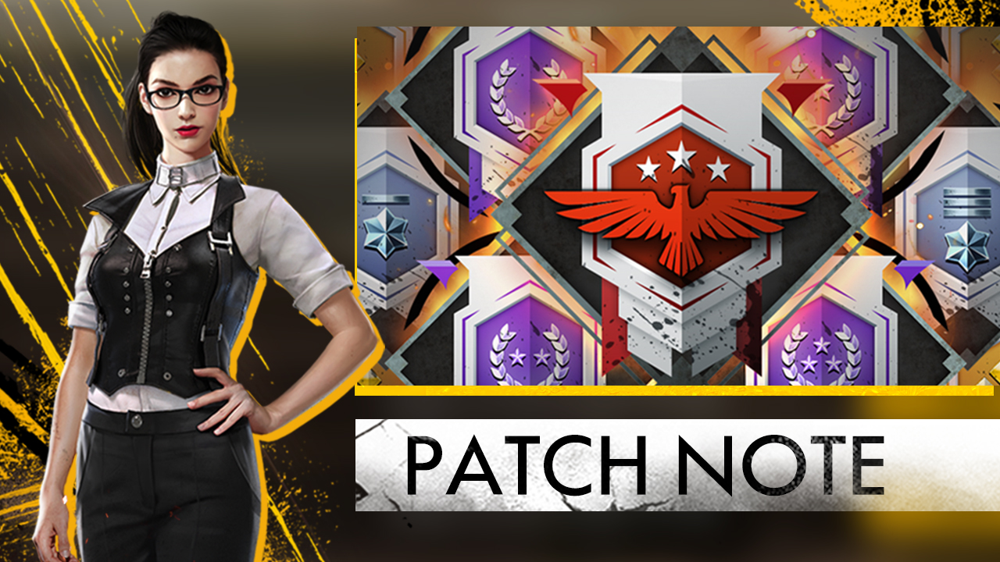

# Free Fire · 2018 年 3 月更新

- 公告日期：2018-03-20
- 官方来源：[NEW UPDATE: NEW MODE, NEW CHARACTER, NEW WEAPON AND NEW VEHICLE](https://ff.garena.com/en/article/155/)
- 审阅日期：2026-09-19
- 5 个分类小节；9 项说明及表格行；1 张官方公告插图。

本篇 BR 与通用局内更新按官方正文整理；本公告未列 CS 专属内容。独立玩法与局外内容保留目录处置，未公开的细节明确标注为未说明。

版本节点采用公告日期；原文未单列具体实装时间时保留未知。记录历史版本变化，不代表当前规则。

## BR · 大逃杀

### Sentosa 岛、游泳与排名

- 归属：BR · 大逃杀 / 常规调整
- 原文小节：New Features
- 时间：正文未单列该项实装时刻；以公告日期索引。

- 地图扩大并加入 Sentosa 岛。
- 玩家可游到 Sentosa 岛，也可在海中停留。
- BR 新增排位模式；赛季奖励属于局外结果，不另计核心机制。

### 枪械配件限制

- 归属：BR · 大逃杀 / 常规调整
- 原文小节：Balances and Improvements
- 时间：正文未单列该项实装时刻；以公告日期索引。

- VSS、G18、M1014 不再可装枪口配件；VSS 内置消音器，原文称其更不易被敌人发现。
- 沙漠之鹰不再可装弹匣配件。

### 载具受损与爆炸

- 归属：BR · 大逃杀 / 常规调整
- 原文小节：Balances and Improvements
- 时间：正文未单列该项实装时刻；以公告日期索引。

- 载具被摧毁后会短暂失控再爆炸。
- 爆炸后起火数秒，对周围造成持续范围伤害；鲁莽驾驶也会使载具受损。

### 单排淘汰后持续观战

- 归属：BR · 大逃杀 / 常规调整
- 原文小节：New Features
- 时间：原文未单列此项生效时刻；按公告日期索引，不据此推定当前仍保留。

- 单人对局淘汰后，可继续观战淘汰自己的玩家；不等于新增返场机会。

## CS · 枪王对决

## 通用局内调整

### Nikita 角色

- 归属：通用局内调整 / 常规调整
- 原文小节：New Features
- 时间：正文未单列该项实装时刻；以公告日期索引。

通用调整的适用范围未逐模式列出；该公告未提供 CS 专属说明。

Nikita 新角色与排位系统的版本总览图。原文：New Features。[官方原图](http://freefiremobile-a.akamaihd.net/ffwebsite/uploadfile/2018/0320/20180320024032554.jpg) · 1280×720。

- 新增 Nikita 角色；正文未在此页给出技能效果或数值。

## 其他玩法与局外内容（目录摘要）

### 独立玩法、局外内容与未明确范围事项

排位赛季奖励、呼号/昵称展示、邮箱、战绩及 iPhone X 支持另列局外或兼容性事项。整体画质调整未给地图布局或战斗规则细节。

原文目录：New Features / Balances and Improvements

## 官方图片索引

正文图片按相关小节展示，版本总览及其他章节插图另列；同一原图只嵌入一次。

- [Nikita 新角色与排位系统的版本总览图](http://freefiremobile-a.akamaihd.net/ffwebsite/uploadfile/2018/0320/20180320024032554.jpg) · 1280×720 · 本地 `assets/ff-patches/155-01.jpg`

## 原文目录（对照用）

- New Features
- Balances and Improvements
