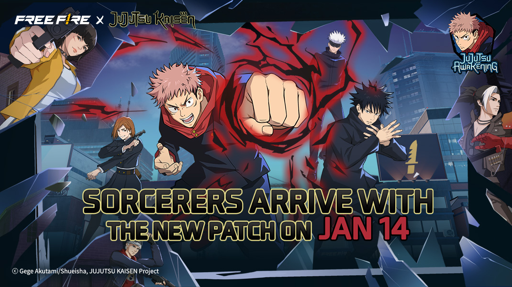
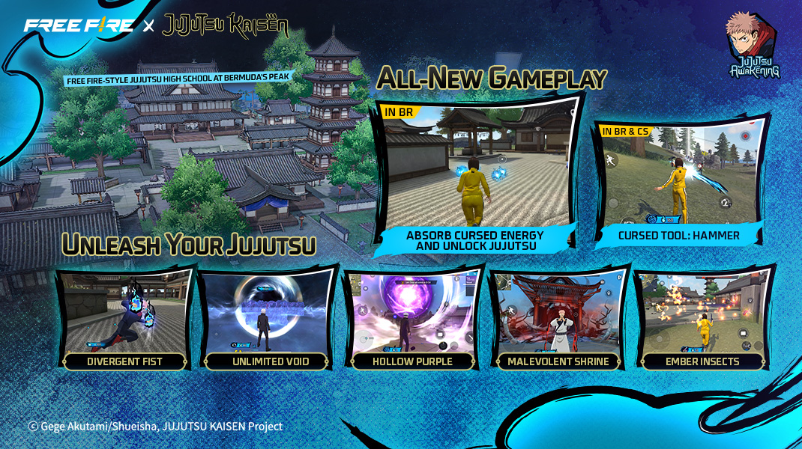
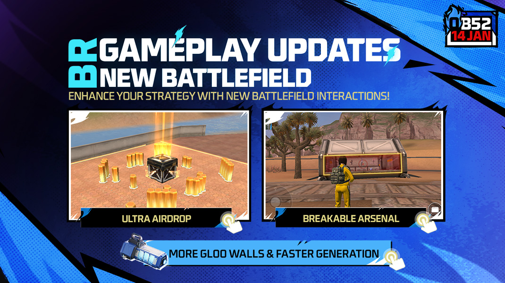
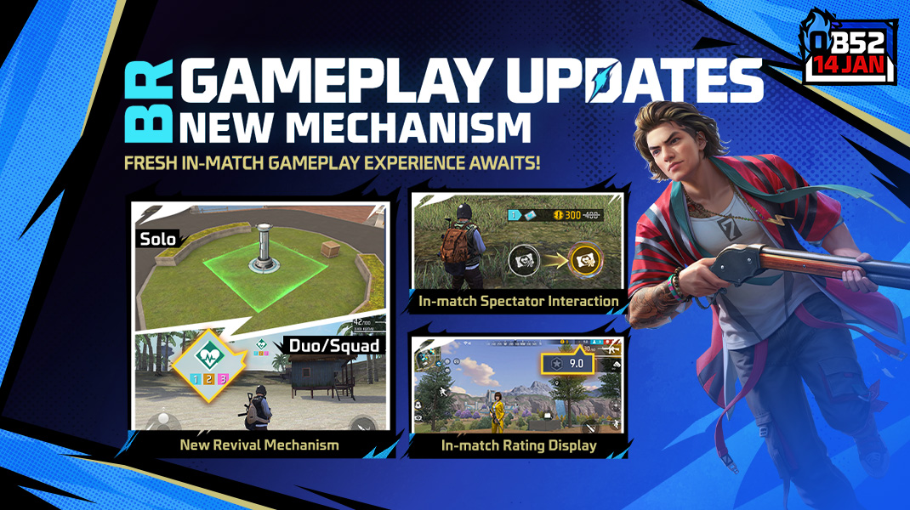
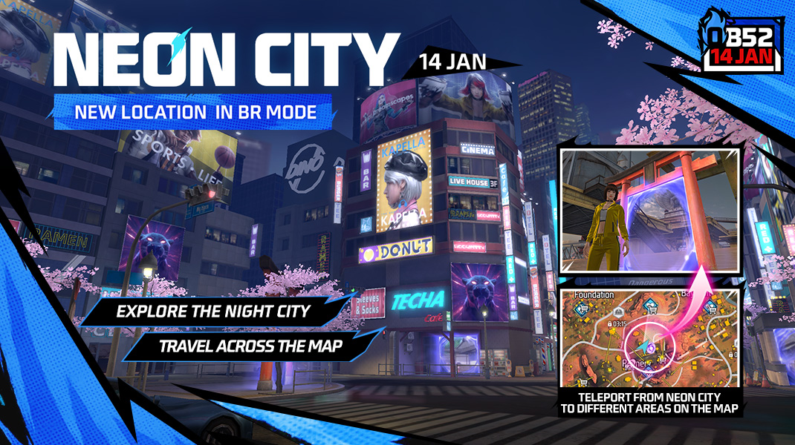
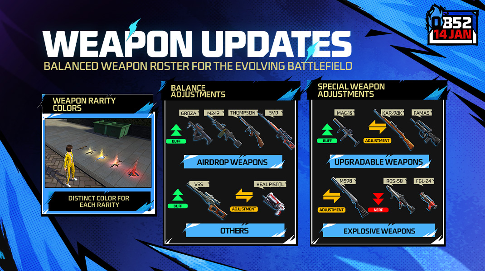
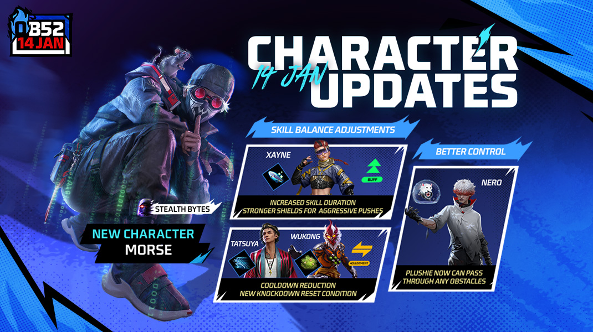
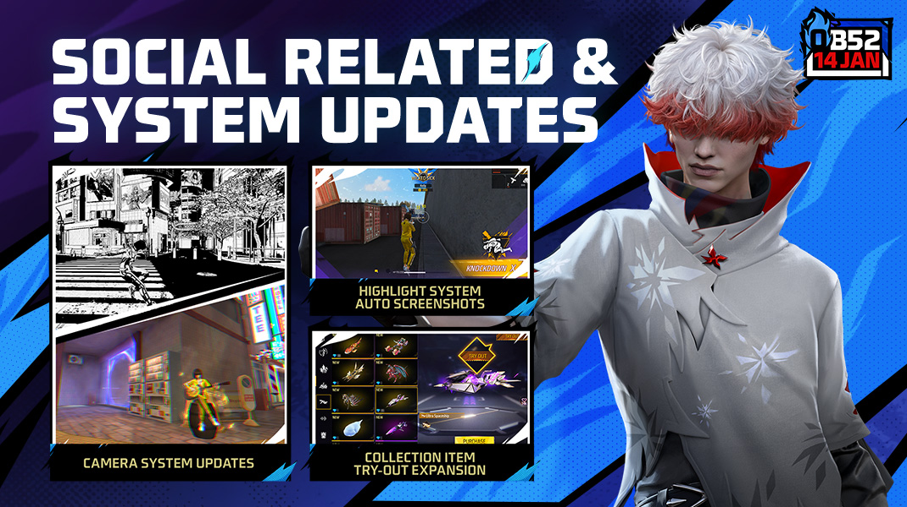

# Free Fire · OB52

- 公告日期：2026-01-09
- 官方来源：[Free Fire OB52 Patch Notes](https://ff.garena.com/en/article/1595/)
- 审阅日期：2026-09-18
- 22 个分类小节；88 项说明及表格行；8 张官方公告插图。

本篇 BR、CS、地图、装备、角色武器与局内操作详细整理；其他独立玩法及局外系统保留目录摘要。不是全部历史版本。

版本节点采用公告日期。分期开启、预告及未公布日期的事项按各项备注；公告没有给出当前仍保留的承诺。

咒术觉醒联动官方主题图。原文：Jujutsu Kaisen Collaboration Event: Jujutsu Awakening。[官方原图](https://cdn.wildflamestudio.com/common/web_event/official2.ff.garena.all/20261/dfd2ae1057a50161559dbc2770053c53.png) · 1070×600。

## BR · 大逃杀

### 咒力获取与六种术式

- 归属：BR · 大逃杀 / 活动覆盖
- 原文小节：Jujutsu Kaisen Collaboration Event > Battle Royale: Unlock Iconic Jujutsu
- 时间：本项未单独提供精确生效日期；使用公告日期索引。

BR/CS 咒术、咒具与山顶高校总览。原文：Jujutsu Kaisen Collaboration Event。[官方原图](https://cdn.wildflamestudio.com/common/web_event/official2.ff.garena.all/20261/cb4a96ec59033237d8ccf382e3d573fc.png) · 1070×600。

- 所有地图散布咒力堆，靠近自动收集，部分会再生；淘汰敌人、售货机购买也可获得咒力。
- 逕庭拳：100 咒力解锁，冲刺命中先后造成 30+30 伤害，最多伤害路径上的 3 面冰墙。
- 钉崎的锤子：无限弹药主武器，1 级解锁花费 50 咒力，升 2 级另需 50，升 3 级另需 100。
- 虚式·茈：100 咒力；沿地面前进并无视建筑与掩体，命中造成 70 伤害并击退，摧毁沿途冰墙；最远 80 米，终点爆炸追加 40 伤害。
- 无量空处：先累计花费 300 咒力，再支付 100 解锁；无视掩体把范围内单个敌人拉入 1v1 领域。施放者满血、移速 +5%、额外 30 护盾；最长 30 秒，分出胜负立即结束，败者直接淘汰。
- 火砾虫：100 咒力，自动追踪最近敌人，爆炸 25 伤害，留下半径 1 米火区，每秒 5 伤害持续 3 秒。
- 伏魔御厨子：解锁前置与无量空处相同；生成半径 10 米、持续 15 秒的领域，敌人每 0.5 秒受 5 伤害，敌方冰墙每秒受 400 伤害。
- 面板中全部术式解锁后冷却减少 10%；各地图复活点获得咒力主题。

### 可破坏军械库与物资表

- 归属：BR · 大逃杀 / 常规调整
- 原文小节：Battle Royale > Breakable Arsenal
- 时间：本项未单独提供精确生效日期；使用公告日期索引。

军械库可破坏玻璃与升级奖励。原文：Battle Royale > Breakable Arsenal。[官方原图](https://cdn.wildflamestudio.com/common/web_event/official2.ff.garena.all/20261/74a29105b7c68b7ae56279de4eab35da.jpg) · 1070×600。

- 可用合适工具打碎玻璃进入军械库，原文说明并非所有工具有效；强行进入触发无人机，向所有敌人暴露位置。
- 普通军械库武器：无限弹药 Groza、AWM、Thompson，以及 MAC10-II、M1014-II、M14-II。
- 升级军械库中央武器架：无限弹药 Groza、AWM、Thompson，以及 FAMAS、Charge Buster、M79；侧边可出现 Kar98k、FAMAS、M60-III、Winchester-III、M4A1-III、SCAR-III、MP5-III。
- 普通军械库增加 4 个 3 级背包；升级并解锁价格 1500→1200 FF 金币。

### 终极空投

- 归属：BR · 大逃杀 / 常规调整
- 原文小节：Battle Royale > Ultra Airdrop
- 时间：本项未单独提供精确生效日期；使用公告日期索引。

终极空投、占领及团队返场。原文：Battle Royale > Ultra Airdrop。[官方原图](https://cdn.wildflamestudio.com/common/web_event/official2.ff.garena.all/20261/9b0b8d57881cdd21274c27f7d8467e5b.jpg) · 1070×600。

- 开局 400 秒投放 1 处；占领时位置在小地图公开，周围升起晶柱，打碎晶柱可加速占领。
- 奖励为比 4 级防具更强的终极头盔和背心，耐久不会低于 25%；并复活已淘汰队友。记录本版 400 秒，后续 OB55 另有约 410 秒调整。

### 单排返场规则与分时段装备

- 归属：BR · 大逃杀 / 常规调整
- 原文小节：Battle Royale > Revival System > Solo
- 时间：本项未单独提供精确生效日期；使用公告日期索引。

- 复活点开放至开局 610 秒；除一次开局复活保护外，还可占领复活点 25 秒获得复活卡，淘汰时自动使用。
- 0—200 秒返场：UZI、6 个医疗包、2 个吸入器、1 级头盔、1 级背心、2 级背包。
- 200—400 秒返场：MAC10-I、6 个医疗包、2 个吸入器、2 级头盔、2 级背心、2 级背包。
- 400 秒后返场：武器升为 MAC10-II，其余同 200—400 秒。

### 双排/四排团队返场及观战援助

- 归属：BR · 大逃杀 / 常规调整
- 原文小节：Battle Royale > Revival System > Duo / Squad
- 时间：本项未单独提供精确生效日期；使用公告日期索引。

- 在队友附近落地才能激活团队返场；前 180 秒队员阵亡可触发全队共用一次的 60 秒倒计时，需保有存活队友，完成后此前阵亡队友返回。
- 普通复活点/复活卡提供 M1917、6 医疗包、2 吸入器、1 级背包；高级复活点/超级复活卡提供 MAC10-I、6 医疗包、2 吸入器、2 级背包。
- 观战队友时可点击“复活协助”气泡，为其购买复活卡提供特殊折扣；成功购买的队友还获强化。原文未给折扣和强化数值。
- 强化队友倒地/淘汰视听提示；阵亡头像变灰，并新增淘汰音效。

### 载具加速与残骸

- 归属：BR · 大逃杀 / 常规调整
- 原文小节：Battle Royale > Vehicle Speed Boost
- 时间：本项未单独提供精确生效日期；使用公告日期索引。

- 载具新增短时加速。
- 生命归零立即爆炸；缩短爆炸后燃烧表现，燃烧不再伤害玩家。
- 调整吉普残骸模型，使残骸更适合作为掩体。

### 评价、跳伞提示与局内入口

- 归属：BR · 大逃杀 / 常规调整
- 原文小节：Battle Royale > Rating Medals & Bonus Rank Points / Other Adjustments
- 时间：本项未单独提供精确生效日期；使用公告日期索引。

- 协助队友、淘汰敌人、解锁军械库和使用战备提高局内评价并触发提示；达标获得银/金勋章及额外排位分，连续多次达标可能触发跳段。排位奖励属于结算，局内行为反馈保留记录。
- 开局自带 2 级背包；新增申请成为跳伞队长，改进队友建议落点提示。
- 淘汰玩家新增复活相关快捷消息；高价值物品标记按品质着色；背包按钮旁新增战备面板快捷入口。

### 地面物资与战备价格

- 归属：BR · 大逃杀 / 常规调整
- 原文小节：Battle Royale > Other Adjustments
- 时间：本项未单独提供精确生效日期；使用公告日期索引。

- 地面不再掉落空投援助；降低 1 级背心掉率，提高 2 级背心掉率，新增 12 个 3 级头盔及 12 个 3 级背心。
- 武器架调整为两组：VSS/Woodpecker/XM8/PARAFAL/AK47，以及 MAC10-I/Bizon/Trogon/MP40/UMP。
- 超级腿袋新增悬赏名单；强化锤费用 600→400 FF 金币。
- 团队增益器：第一次升级 400→300，第二次 800→600；脱战冲刺加成 7%→4%；圈外移速加成 7%→12%；EP 转换倍率 200%→100%。
- 战术市场价格：冰墙轻型无人机 400→800；Clu、Homer 技能卡各 1200→800（每局各限购 5）；怪物卡车空投 1000→400；跳台 1400→800（限购 5）。
- 宠物技能卡 Dinoculars 300→200；情报箱 300→100（每人限购 2）；悬赏名单 400→200（限购 5）；补给箱 600→300（限购 5）；各类弹药 200→100。单位均为 FF 金币。

### 冰墙生成器携带、战利品和升级

- 归属：BR · 大逃杀 / 常规调整
- 原文小节：Battle Royale > Other Adjustments > Gloo Maker Adjustments
- 时间：本项未单独提供精确生效日期；使用公告日期索引。

- 表中 Eliminator Gain 为淘汰者获得数量，Looter Gain 为拾取者获得数量；保留原表各等级变化，不将两个字段混为同一收益。

| 等级 | 携带上限 | 淘汰者获得 | 拾取者获得 | 升级经验 |
|---|---|---|---|---|
| 1 | 4 → 5 | 1 | 1 | 0 |
| 2 | 5 → 6 | 1 | 1 | 500 → 300 |
| 3 | 6 → 7 | 1 → 2 | 1 | 1000 → 700 |
| 4 | 7 → 8 | 1 → 2 | 1 → 2 | 1500 → 1200 |
| 5 | 7 → 9 | 1 → 2 | 1 → 2 | 2500 → 1700 |

### 单排缩圈参数：百慕大等四图

- 归属：BR · 大逃杀 / 常规调整
- 原文小节：Battle Royale > Other Adjustments > Solo mode Safe Zone shrink adjustments (Bermuda, Kalahari, Purgatory, Alpine)
- 时间：本项未单独提供精确生效日期；使用公告日期索引。

- 适用于百慕大、卡拉哈里、炼狱、阿尔卑斯的单排。下表分别为等待缩圈的倒计时和实际缩圈时长，单位秒。

| 圈数 | 缩圈倒计时 | 缩圈时长 |
|---|---|---|
| 1 | 90s | 165s |
| 2 | 35s → 50s | 85s |
| 3 | 35s → 50s | 65s → 75s |
| 4 | 30s | 40s → 70s |
| 5 | 30s → 20s | 40s → 60s |
| 6 | 20s → 10s | 60 |
| 7 | 20s → 10s | 90 |

### 单排缩圈参数：新地平线

- 归属：BR · 大逃杀 / 常规调整
- 原文小节：Battle Royale > Other Adjustments > Solo mode Safe Zone shrink adjustments (NeXTerra)
- 时间：本项未单独提供精确生效日期；使用公告日期索引。

- 适用于新地平线单排；空白格表示原表未提供该项值。

| 圈数 | 安全区出现前时间 | 缩圈倒计时 | 缩圈时长 |
|---|---|---|---|
| 1 | 70s → 50s | 140s → 90s | 180s |
| 2 |  | 40s | 115s → 85s |
| 3 |  | 40s → 30s | 110s → 75s |
| 4 |  | 45s → 30s | 65s → 70s |
| 5 |  | 30s | 90s |
| 6 |  | 30s | 120s |

### 霓虹城与地图快速转移

- 归属：BR · 大逃杀 / 常规调整
- 原文小节：Map > Neon City
- 时间：本项未单独提供精确生效日期；使用公告日期索引。

霓虹城与裂隙传送门。原文：Map > Neon City。[官方原图](https://cdn.wildflamestudio.com/common/web_event/official2.ff.garena.all/20261/89eeb8cbca946e8b5da730694374d7b4.jpg) · 1070×600。

- 每张地图出现 4 个裂隙传送门，可进入霓虹城，再经城内其他传送门快速前往地图其他区域。
- 霓虹城内不能战斗，最多停留 30 秒，超时返回原进入位置。

### BR 售货机、超级复活武器与地面掉落

- 归属：BR · 大逃杀 / 常规调整
- 原文小节：Weapon and Balance > Weapon Source Adjustments > Battle Royale
- 时间：本项未单独提供精确生效日期；使用公告日期索引。

武器品质、数值和获取来源总览。原文：Weapon and Balance。[官方原图](https://cdn.wildflamestudio.com/common/web_event/official2.ff.garena.all/20261/cc9e2c5a8fb8246fa1457d033ed39de8.jpg) · 1070×600。

- Groza 800 FF 金币，每局限购 2；Trogon 400，每局限购 5；AK47 100，不限购。
- 卡拉哈里售货机移除钩索枪；超级复活武器 Bizon→MAC10。
- 移除升级机制后的 FAMAS、Kar98k 可在军械库及地面拾取；Charge Buster 加入地面物资。

## CS · 枪王对决

### 团竞术式与上架时间

- 归属：CS · 枪王对决 / 活动覆盖
- 原文小节：Clash Squad: 4V4 Jujutsu Clash
- 时间：咒具商店上架：2026-02-01；其余未单列生效日

- 虚式·茈、逕庭拳、火砾虫及两种领域进入商店和电子空投；空投及出生点采用咒术主题。
- 钉崎 3 级锤子等咒具在 2 月 1 日新赛季开启时加入 CS 商店，需与 1 月公告日期区分。

### 电子空投、折扣武器与扶起提示

- 归属：CS · 枪王对决 / 常规调整
- 原文小节：Clash Squad > Cyber Airdrop Optimization / Discounted Weapons
- 时间：本项未单独提供精确生效日期；使用公告日期索引。

- 电子空投改为两阶段解锁，每阶段都提供奖励；占领区域内玩家获得减伤，解锁第二阶段的玩家可保留减伤直到回合结束。
- 团竞商店有概率出现折扣武器，原文未提供统一折扣率。
- 被特殊道具或技能扶起时，血条显示特殊特效；回合开始丢弃 USP 后，后续回合不再自动发放；战术市场烟雾漩涡持续时间降为 40 秒。

### 卡拉哈里团竞点位

- 归属：CS · 枪王对决 / 常规调整
- 原文小节：Map > Other Map Adjustments
- 时间：本项未单独提供精确生效日期；使用公告日期索引。

- 为 CS 平衡微调炼油厂、猛犸、Santa Catarina 和 Confinement 的局部布局。

### CS 武器商店清单

- 归属：CS · 枪王对决 / 常规调整
- 原文小节：Weapon and Balance > Weapon Source Adjustments > Clash Squad
- 时间：本项未单独提供精确生效日期；使用公告日期索引。

- 普通商店：FAMAS 1800，VSS 1500，Charge Buster 1800→1600，M14-II 1700且升 III 级需另付 600。
- 电子物品区：M60-III 1600，Groza 1700，Thompson 1700。单位均为团竞货币。

## 通用局内调整

### 百慕大山顶主题改造

- 归属：通用局内调整 / 活动覆盖
- 原文小节：Jujutsu Kaisen Collaboration High School
- 时间：本项未单独提供精确生效日期；使用公告日期索引。

原文通用章节或明确跨模式内容；未单列 BR/CS 例外时不推定全部模式完全相同。

- 百慕大山顶改为百慕大高校；主题山顶同时出现在 CS。属于联动覆盖，不当作永久地形承诺。

### 地图通行与滑道

- 归属：通用局内调整 / 常规调整
- 原文小节：Map > Other Map Adjustments
- 时间：本项未单独提供精确生效日期；使用公告日期索引。

原文通用章节或明确跨模式内容；未单列 BR/CS 例外时不推定全部模式完全相同。

- 卡拉哈里部分窗户调整以改善翻越，修复特定位置伤害不生效。
- 百慕大加入 Choppy Cuts 主题理发店。
- 索拉拉优化进入和离开滑道的交互，Hub 区域滑道速度小幅提高。原文没有提供速度数值。

### Morse 与角色技能平衡

- 归属：通用局内调整 / 常规调整
- 原文小节：Characters
- 时间：本项未单独提供精确生效日期；使用公告日期索引。

原文通用章节或明确跨模式内容；未单列 BR/CS 例外时不推定全部模式完全相同。

Morse 新角色与技能平衡。原文：Characters。[官方原图](https://cdn.wildflamestudio.com/common/web_event/official2.ff.garena.all/20261/c3c76edee3a3d6fe0e9f38c0ac968f27.jpg) · 1070×600。

- 新角色 Morse：进入隐身，16 米外敌人难以看见且无法侦测，移速 +20%；4 米内仍会触发敌方辅助瞄准；最长 15 秒，不能开火，退出有 1 秒延迟，冷却 45 秒。
- Tatsuya：冲刺 0.3 秒；重置冷却由任意击倒改为施放后 10 秒内击倒；基础冷却 120→90 秒。
- Wukong：变灌木持续 10 秒、移速 -10%、攻击退出；重置冷却同样限制为施放后 10 秒内击倒；冷却 120→90 秒。
- Xayne：临时护盾 50→70、持续 12→15 秒；击倒重置持续时间并把临时护盾恢复为 70，状态结束移除，冷却 75 秒。
- Nero 玩偶可穿过掩体、地面、楼板和天花板；Santino 假人可在索拉拉 Studio 火车及轨道使用。
- 修复 Alok 实际范围与特效不一致及移速偶尔不生效；部分模式可出现技能强化器；达到一定移速触发新特效；统一增益/减益图标尺寸。

### 武器品质、平衡和操作

- 归属：通用局内调整 / 常规调整
- 原文小节：Weapon and Balance
- 时间：本项未单独提供精确生效日期；使用公告日期索引。

原文通用章节或明确跨模式内容；未单列 BR/CS 例外时不推定全部模式完全相同。

- 品质颜色从白/金/红扩为白/浅金/金/浅红/红：依次对应地面或 0 级、1 级、2 级及 M79 等特殊武器、普通空投及 3 级、高级空投武器。
- FGL24、RGS50 弹匣 3→2；M590 伤害 +10%、射程 -10%，移除溅射效果。
- Kar98k、FAMAS 移除升级机制，采用原 III 级属性；MAC10 全系列伤害 +8%、精度 +15%。
- Groza/Groza-X：伤害 +3%、穿甲 +10%、射程 +8%；SVD/SVD-Y：精度 +20%；M249/M249-X：射速和穿甲各 +5%；Thompson/Thompson-X：射速 +5%。
- VSS：穿甲 +10%、精度 +5%；治疗手枪新增队友自动瞄准，射速 +30%、治疗量 -50%、治疗能量恢复 +50%、消耗 -50%；Y 型还可同时治疗最多 2 名队友。
- 双持按钮并入射击模式切换；背包和防具拾取优先级提高，背包优先；强化锤可强化活动及空投武器。
- 公告“HP-Loss Speed”一项把精确射手步枪/机枪/突击步枪/狙击枪对应时长 14→33 秒，但未解释具体触发机制；保留原标签和数值，不推测为射速或倒地流血。

### 帧率、HUD 和局内操作

- 归属：通用局内调整 / 常规调整
- 原文小节：System > Frame Rate Enhancement / HUD Recommendation / Other Adjustments
- 时间：本项未单独提供精确生效日期；使用公告日期索引。

原文通用章节或明确跨模式内容；未单列 BR/CS 例外时不推定全部模式完全相同。

- 高帧率模式增加实验性帧率增强选项；这是客户端操作性能设置，没有量化提升承诺。
- HUD 推荐可查看并应用职业选手布局；分享方案可同时带灵敏度，应用时可选择是否同步。
- 从高处落下不再打断冲刺；麦克风新增按住说话按钮。

## 其他玩法与局外内容（目录摘要）

### 其他玩法与局外目录

训练场可试术式（无量空处除外）、咒具、Trogon 榴弹模式，观战时可买武器；社交岛新增钓鱼和联动立牌。其余涉及相机模式、高光截图、商城接力折扣、终结演出装备、结算后再组队、称号/社交/二维码/举报补偿、自定义房间提醒。Craftland 包含跑酷测试、旧百慕大、AI 主题、发布分类/短码、编辑器多选、素材类型和组件可见性等，不混入 BR 常规规则。

原文目录：Social Island; Other Weapon Adjustments; System; Craftland

## 其余原文配图

以下为尚未在上述小节内展示的原文图片，包括局外章节配图。

相机、高光截图与收藏品试用。原文：System > New Camera System Features / Highlight Photos。[官方原图](https://cdn.wildflamestudio.com/common/web_event/official2.ff.garena.all/20261/317a5f632cdd938671a26b45a549514b.jpg) · 1070×600。

## 官方图片索引

正文图片按相关小节展示，版本总览及其他章节插图另列；同一原图只嵌入一次。

- [咒术觉醒联动官方主题图](https://cdn.wildflamestudio.com/common/web_event/official2.ff.garena.all/20261/dfd2ae1057a50161559dbc2770053c53.png) · 1070×600 · 本地 `assets/ff-patches/1595-01.jpg`
- [BR/CS 咒术、咒具与山顶高校总览](https://cdn.wildflamestudio.com/common/web_event/official2.ff.garena.all/20261/cb4a96ec59033237d8ccf382e3d573fc.png) · 1070×600 · 本地 `assets/ff-patches/1595-02.jpg`
- [军械库可破坏玻璃与升级奖励](https://cdn.wildflamestudio.com/common/web_event/official2.ff.garena.all/20261/74a29105b7c68b7ae56279de4eab35da.jpg) · 1070×600 · 本地 `assets/ff-patches/1595-03.jpg`
- [终极空投、占领及团队返场](https://cdn.wildflamestudio.com/common/web_event/official2.ff.garena.all/20261/9b0b8d57881cdd21274c27f7d8467e5b.jpg) · 1070×600 · 本地 `assets/ff-patches/1595-04.jpg`
- [霓虹城与裂隙传送门](https://cdn.wildflamestudio.com/common/web_event/official2.ff.garena.all/20261/89eeb8cbca946e8b5da730694374d7b4.jpg) · 1070×600 · 本地 `assets/ff-patches/1595-05.jpg`
- [Morse 新角色与技能平衡](https://cdn.wildflamestudio.com/common/web_event/official2.ff.garena.all/20261/c3c76edee3a3d6fe0e9f38c0ac968f27.jpg) · 1070×600 · 本地 `assets/ff-patches/1595-06.jpg`
- [武器品质、数值和获取来源总览](https://cdn.wildflamestudio.com/common/web_event/official2.ff.garena.all/20261/cc9e2c5a8fb8246fa1457d033ed39de8.jpg) · 1070×600 · 本地 `assets/ff-patches/1595-07.jpg`
- [相机、高光截图与收藏品试用](https://cdn.wildflamestudio.com/common/web_event/official2.ff.garena.all/20261/317a5f632cdd938671a26b45a549514b.jpg) · 1070×600 · 本地 `assets/ff-patches/1595-08.jpg`

## 原文目录（对照用）

- Jujutsu Kaisen Collaboration Event: Jujutsu Awakening
- Battle Royale: Unlock Iconic Jujutsu
- Jujutsu Kaisen Collaboration High School
- Clash Squad: 4V4 Jujutsu Clash
- Other Adjustments:
- Battle Royale
- Breakable Arsenal
- Ultra Airdrop
- Revival System
- Enhanced Teammate Down/Elimination Alerts
- Vehicle Speed Boost
- Rating Medals & Bonus Rank Points
- Other Adjustments
- Clash Squad
- Cyber Airdrop Optimization
- Discounted Weapons
- Map
- Neon City
- Other Map Adjustments:
- Characters
- New Character
- Skill Balance Adjustments
- Other Character Adjustments
- Social Island
- Fishing Minigame
- Weapon and Balance
- Weapon Tier Optimization
- Weapon Balance Adjustments
- System
- New Camera System Features
- Highlight Photos
- Frame Rate Enhancement
- Relay Mart
- Final Shot & Finishing Move: Equip in the Vault!
- HUD Recommendation
- Assemble & Rematch Together!
- Other Adjustments
- Craftland
- Top News:
- Map Publishing:
- Scene Editing:
- Asset Store:
- Others:
