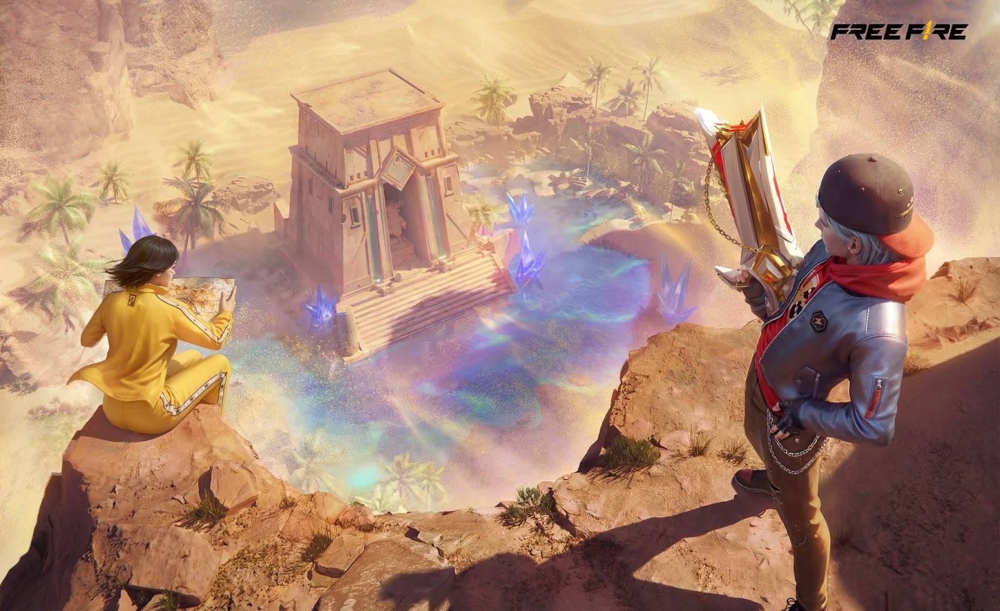
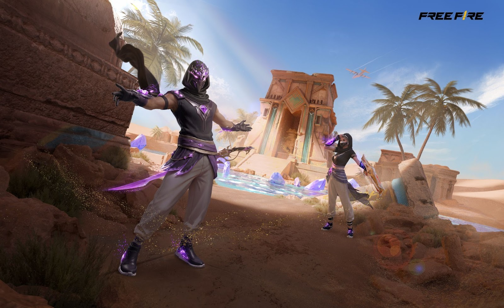

# Free Fire · 2026年Lost Treasure活动预告

- 公告日期：2026-02-16
- 官方来源：[Free Fire Sends Players on a Mysterious Desert Adventure in Its Latest Lost Treasure Campaign](https://ff.garena.com/en/article/1617/)
- 审阅日期：2026-09-19
- 3 个分类小节；3 项说明及表格行；4 张官方公告插图。

主流程通读正文并逐项复核；公告日期与活动日期分开，所有正文图归档展示。未在原文核实的OB号不推算。

公告日2026-02-16；各项实际状态及活动期限见小节。

Lost Treasure主题总览。原文：Free Fire Sends Players on a Mysterious Desert Adventure in Its Latest Lost Treasure Campaign。[官方原图](https://cdn.wildflamestudio.com/common/web_event/official2.ff.garena.all/20262/83147377fb8170386b4c58d836f45ecc.jpeg) · 1600×978。

Treasure Chaser及Treasure Seeker。原文：Free Fire Sends Players on a Mysterious Desert Adventure in Its Latest Lost Treasure Campaign。[官方原图](https://cdn.wildflamestudio.com/common/web_event/official2.ff.garena.all/20262/7cb1b8ebcae6c143ce3cb042766bd318.jpeg) · 1600×978。

Treasure Ravager。原文：Free Fire Sends Players on a Mysterious Desert Adventure in Its Latest Lost Treasure Campaign。[官方原图](https://cdn.wildflamestudio.com/common/web_event/official2.ff.garena.all/20262/0153772823c44bd5c9df8f0f6d7fef26.jpeg) · 1600×978。

## BR · 大逃杀

### Bermuda沙漠改造与Sunken Chamber

- 归属：BR · 大逃杀 / 活动覆盖
- 原文小节：All-New Map Reskin and Themed Weapons across Battle Royale and Clash Squad
- 时间：预告2026-02-20～03-06。

Sunken Chamber与Treasure Finder。原文：All-New Map Reskin and Themed Weapons across Battle Royale and Clash Squad。[官方原图](https://cdn.wildflamestudio.com/common/web_event/official2.ff.garena.all/20262/e57ecca0bd7133234d6168086463b2a2.jpeg) · 1600×978。

- Bermuda临时加入绿洲建筑和Sunken Chamber地下区域；通过特定局内行为开启通往地下的路径，正文没有说明具体触发行为。

### Sky Portal与Revival Pod

- 归属：BR · 大逃杀 / 活动覆盖
- 原文小节：All-New Map Reskin and Themed Weapons across Battle Royale and Clash Squad
- 时间：预告2026-02-20～03-06。

- 相关区域提供Sky Portal和Revival Pod功能物；原文仅称提供战术选择，未列交互步骤、费用、冷却或复活对象。

## CS · 枪王对决

### CS主题武器与技能强化卡

- 归属：CS · 枪王对决 / 活动覆盖
- 原文小节：All-New Map Reskin and Themed Weapons across Battle Royale and Clash Squad
- 时间：预告2026-02-20～03-06。

- CS加入主题武器，包括4-shot burst Trogon与FAMAS，以及技能强化卡；原文没有明确把“四连发”同时用于FAMAS，也未列价格或伤害。

## 通用局内调整

## 其他玩法与局外内容（目录摘要）

### 活动界面挖宝

使用铲子清理沙格推进里程碑，Scanner与Range Cracker帮助定位、清理路径；可协助好友清理沙块，共同推进宝藏。活动界面小游戏不记为常规BR物品。

原文目录：Treasure-digging mini-game

### 奖励、外观与音乐

常规游玩累计里程碑得Treasure Finder男女通用套装；累计登录得Trogon枪皮，另有水晶风格冰墙、表情、Skywings与Final Shots。付费主题套装为Treasure Chaser、Treasure Seeker、Treasure Ravager。Kelly寻宝故事及融合darbuka、oud、saz与FF旋律的主题曲属于宣传背景。

原文目录：Themed Collectibles for the Journey Ahead

## 官方图片索引

正文图片按相关小节展示，版本总览及其他章节插图另列；同一原图只嵌入一次。

- [Lost Treasure主题总览](https://cdn.wildflamestudio.com/common/web_event/official2.ff.garena.all/20262/83147377fb8170386b4c58d836f45ecc.jpeg) · 1600×978 · 本地 `assets/ff-patches/1617-01.jpg`
- [Sunken Chamber与Treasure Finder](https://cdn.wildflamestudio.com/common/web_event/official2.ff.garena.all/20262/e57ecca0bd7133234d6168086463b2a2.jpeg) · 1600×978 · 本地 `assets/ff-patches/1617-02.jpg`
- [Treasure Chaser及Treasure Seeker](https://cdn.wildflamestudio.com/common/web_event/official2.ff.garena.all/20262/7cb1b8ebcae6c143ce3cb042766bd318.jpeg) · 1600×978 · 本地 `assets/ff-patches/1617-03.jpg`
- [Treasure Ravager](https://cdn.wildflamestudio.com/common/web_event/official2.ff.garena.all/20262/0153772823c44bd5c9df8f0f6d7fef26.jpeg) · 1600×978 · 本地 `assets/ff-patches/1617-04.jpg`

## 原文目录（对照用）

- Free Fire Sends Players on a Mysterious Desert Adventure in Its Latest Lost Treasure Campaign
