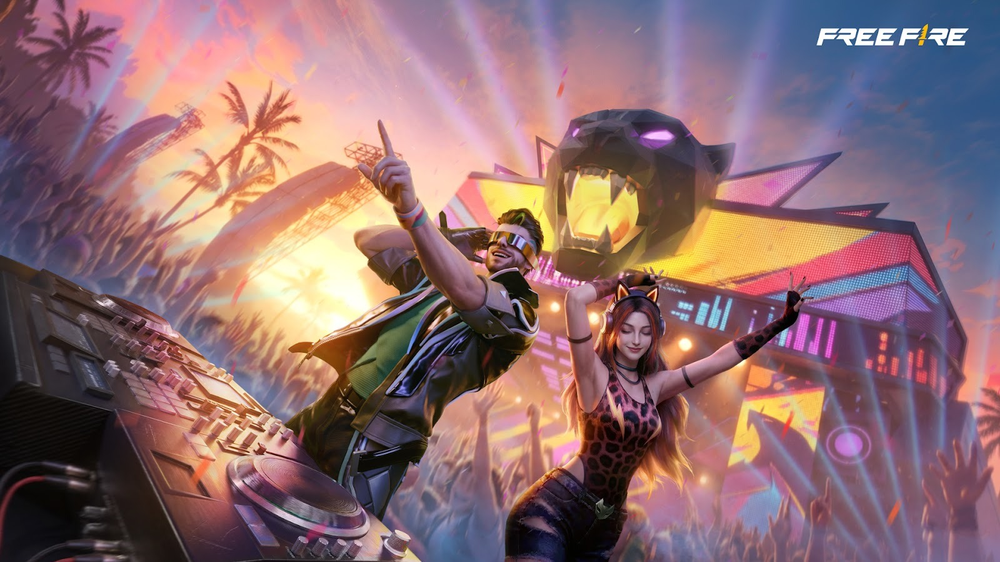
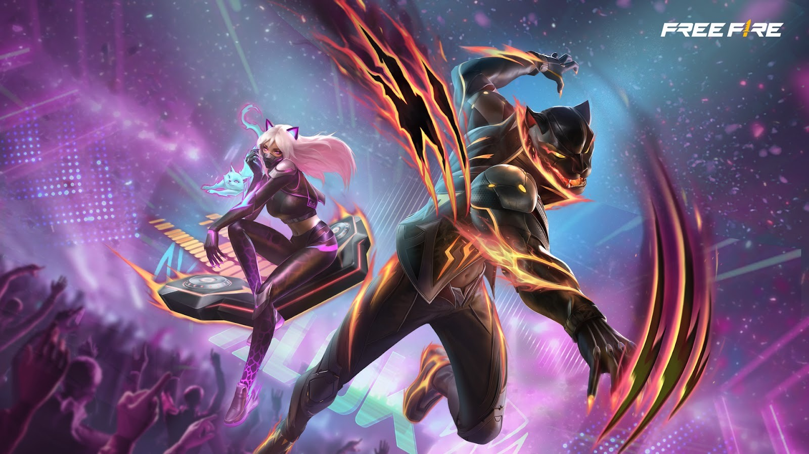
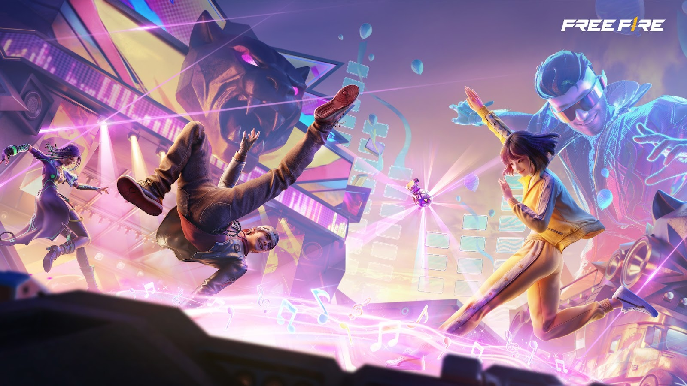

# Free Fire · 2026年Beat Carnival活动说明（日期待核）

- 公告日期：2026-03-20
- 官方来源：[Drop the Beat: Free Fire Ignites Beat Carnival with DJ Alok, New Music, and In-Game Celebrations](https://ff.garena.com/en/article/1634/)
- 审阅日期：2026-09-19
- 5 个分类小节；7 项说明及表格行；3 张官方公告插图。

主流程通读正文并逐项复核；公告日期与活动日期分开，所有正文图归档展示。未在原文核实的OB号不推算。

官网公告日期2026-03-20，正文反复写February 13–26并混用预告/已举办语气，年份按公告上下文理解但存在时序冲突。原样保留2月13～26日，不改成3月，也不据此核定实际上线日。

Beat Carnival主题图。原文：Drop the Beat: Free Fire Ignites Beat Carnival with DJ Alok, New Music, and In-Game Celebrations。[官方原图](https://cdn.wildflamestudio.com/common/web_event/official2.ff.garena.all/20263/1fbb2bc180ef75400837f4a6f072c178.jpeg) · 1600×900。

Beat Carnival主题收藏图。原文：Drop the Beat: Free Fire Ignites Beat Carnival with DJ Alok, New Music, and In-Game Celebrations。[官方原图](https://cdn.wildflamestudio.com/common/web_event/official2.ff.garena.all/20263/ea488e92bf296d446a23ab49bcf7be07.jpeg) · 1600×900。

## BR · 大逃杀

### Solara：Bloomtown舞台与天空效果

- 归属：BR · 大逃杀 / 活动覆盖
- 原文小节：A Music-Fueled Celebration Across Battle Royale and Clash Squad
- 时间：正文活动期2月13～26日；与3月20日公告日存在时序冲突，实际日程待核。

- Bloomtown舞台改为嘉年华舞台，含灯光、激光、音乐；靠近区域播放BULLETPROOF，可解锁活动奖励。
- 仅Solara：对局推进时天空转为日落，安全区外有声波，地图边缘Alok投影跳舞并出现烟花。

### 全地图派对卡车和音乐区域

- 归属：BR · 大逃杀 / 活动覆盖
- 原文小节：Panther Party Truck & themed zones (All Maps)
- 时间：正文活动期2月13～26日；与3月20日公告日存在时序冲突，实际日程待核。

- 玩家可与移动Panther Party Truck互动，跳舞获取奖励；主题区域随机出现巨型音符，触发跳舞效果。未列奖励值或刷新间隔。

## CS · 枪王对决

### CS固定声波区

- 归属：CS · 枪王对决 / 活动覆盖
- 原文小节：A Music-Fueled Celebration Across Battle Royale and Clash Squad
- 时间：正文活动期2月13～26日；与3月20日公告日存在时序冲突，实际日程待核。

- CS固定位置出现Soundwave Zones，区域内提高移动速度和HP恢复；未给幅度。

## 通用局内调整

### Dance Grenade与Speaker Trampoline

- 归属：通用局内调整 / 活动覆盖
- 原文小节：Dance Grenade / Speaker Trampoline
- 时间：正文活动期2月13～26日；与3月20日公告日存在时序冲突，实际日程待核。

Beat Carnival地图与局内活动图。原文：Dance Grenade / Speaker Trampoline。[官方原图](https://cdn.wildflamestudio.com/common/web_event/official2.ff.garena.all/20263/91841c513eb0428364e98fc711b018e7.jpeg) · 1600×900。

- Dance Grenade持有时有激光效果，爆炸形成圆形区域，受影响者被迫跳舞并暂时不能攻击；移动或其他动作可提前结束。对投掷者也生效，但不会提供额外增益。
- Speaker Trampoline用声波将玩家弹向战场其他位置，未给距离、次数或冷却。两件道具段落未明确逐模式限制，不强行填BR/CS专属。

### 强化Alok技能卡与地图投影

- 归属：通用局内调整 / 活动覆盖
- 原文小节：Free Fire launches Beat Carnival with DJ Alok
- 时间：正文活动期2月13～26日；与3月20日公告日存在时序冲突，实际日程待核。

- 活动引入强化版Alok Skill Card，本篇未列具体强化值；BR、CS地图边缘均出现Alok巨型投影。

## 其他玩法与局外内容（目录摘要）

### 音乐、任务和收藏

BULLETPROOF由Alok与CERES合作，进入大厅音乐和活动专属界面；活动奖励含女性服装、滑板、手雷/镰刀及皮卡皮肤。商店有Beat Beast、Beat Leopard、拳套/冰墙/M14皮肤、入场动画和表情。原文后半为艺人演出、公益及公司介绍，不当作局内新机制。

原文目录：Opening / More details / About Alok

## 官方图片索引

正文图片按相关小节展示，版本总览及其他章节插图另列；同一原图只嵌入一次。

- [Beat Carnival主题图](https://cdn.wildflamestudio.com/common/web_event/official2.ff.garena.all/20263/1fbb2bc180ef75400837f4a6f072c178.jpeg) · 1600×900 · 本地 `assets/ff-patches/1634-01.jpg`
- [Beat Carnival地图与局内活动图](https://cdn.wildflamestudio.com/common/web_event/official2.ff.garena.all/20263/91841c513eb0428364e98fc711b018e7.jpeg) · 1600×900 · 本地 `assets/ff-patches/1634-02.jpg`
- [Beat Carnival主题收藏图](https://cdn.wildflamestudio.com/common/web_event/official2.ff.garena.all/20263/ea488e92bf296d446a23ab49bcf7be07.jpeg) · 1600×900 · 本地 `assets/ff-patches/1634-03.jpg`

## 版本关联来源

### [OB54强化Alok技能卡返场](https://ff.garena.com/en/article/1673/)

1673明确周年返场此前Beat Carnival强化技能，并提供Speed Remix/Heal Remix数值；不把返场写成首次新增，也不用后版数值反填本篇。

## 原文目录（对照用）

- Drop the Beat: Free Fire Ignites Beat Carnival with DJ Alok, New Music, and In-Game Celebrations
