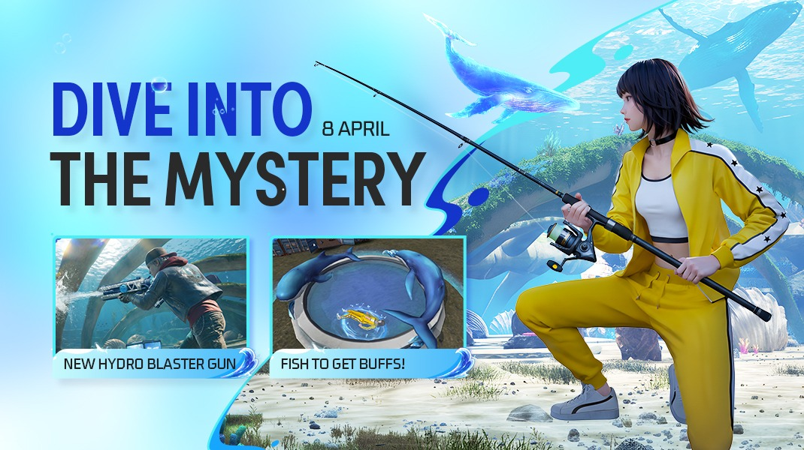
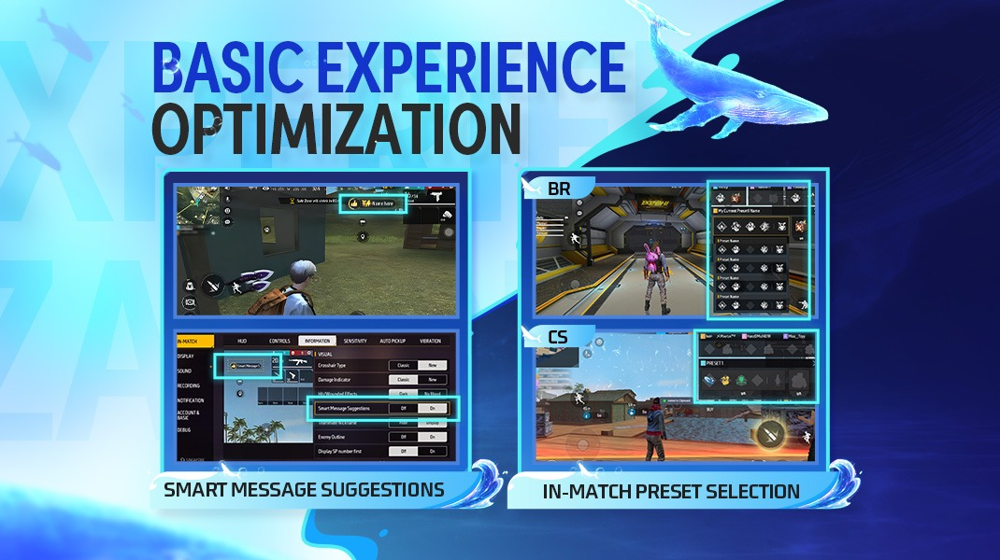
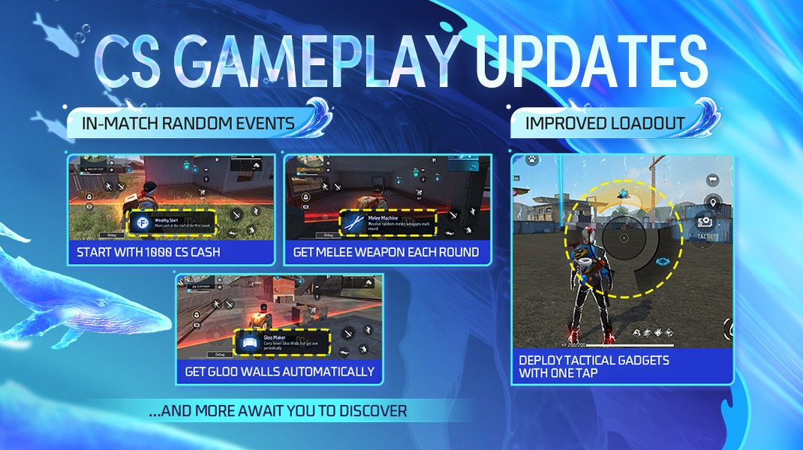
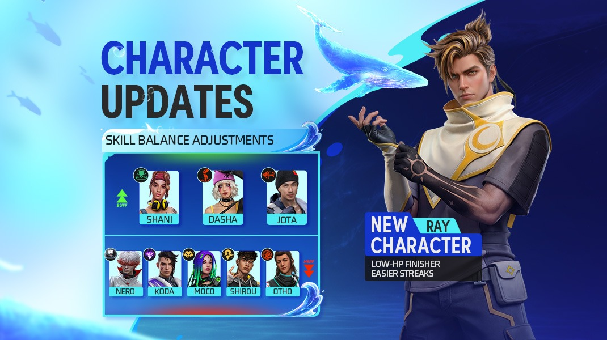
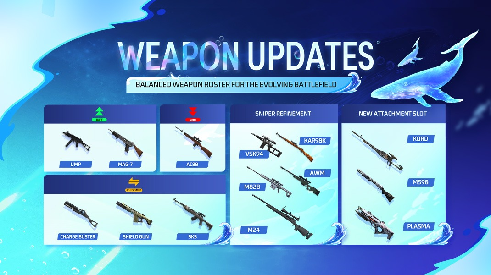
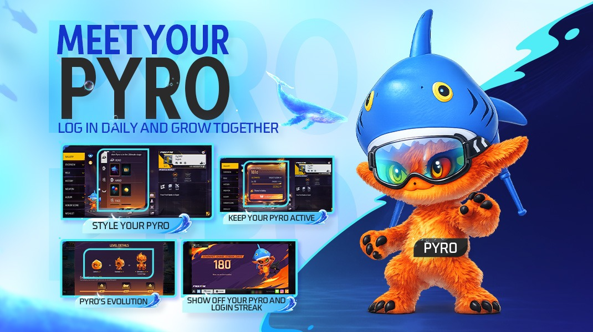
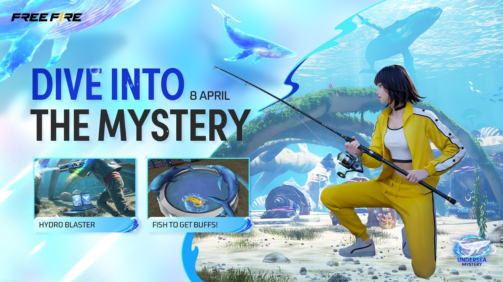
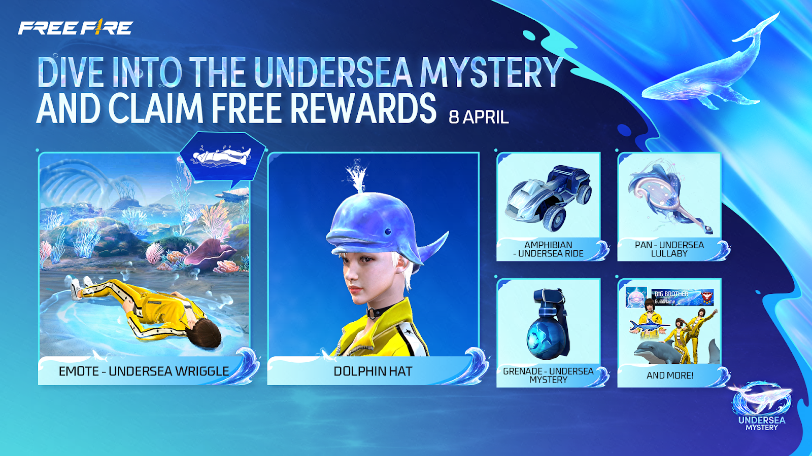
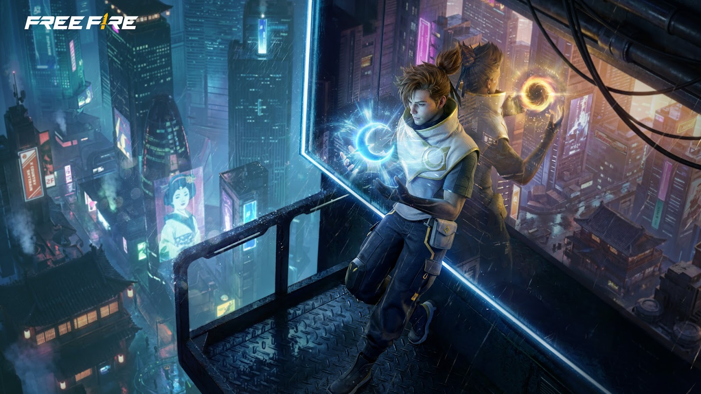

# Free Fire · OB53（2026 年 4 月更新）

- 公告日期：2026-04-02
- 官方来源：[OB53 PATCH NOTES](https://ff.garena.com/en/article/1640/)
- 审阅日期：2026-09-19
- 45 个分类小节；98 项说明及表格行；7 张官方公告插图。

逐项复核本篇 BR、CS 与通用局内章节；独立玩法和局外内容另列目录处置。未将公告日期当作统一上线日期。全部正文图已归档并按实际图像内容关联。

公告日：2026-04-02。海底主题总览与钓鱼/水枪配图标注 4 月 8 日；这不是全版本统一生效日。其他条目未列精确上线时间。

海底主题总览，图内标注 4 月 8 日。原文：Battle Royale > Undersea Mystery。[官方原图](https://cdn.wildflamestudio.com/common/web_event/official2.ff.garena.all/20264/c57c0a509dd55e527fd73a89d3aae479.jpeg) · 1070×600。

## BR · 大逃杀

### BR：鲸鱼运输机

- 归属：BR · 大逃杀 / 活动覆盖
- 原文小节：Battle Royale > Undersea Mystery
- 时间：公告日：2026-04-02；同页海底主题配图标注 4 月 8 日，未列活动结束时间。

- 对局开场飞机改为鲸鱼造型。

### BR：海底领域入口与资源

- 归属：BR · 大逃杀 / 活动覆盖
- 原文小节：Battle Royale > Undersea Mystery
- 时间：公告日：2026-04-02；同页海底主题配图标注 4 月 8 日，未列活动结束时间。

- Bermuda 的 Nurek Dam 出现入口；领域提供更丰富的资源，可交互剑雕像产出高级物资。
- 通过传送门返回地表。

### BR：水墙资源区

- 归属：BR · 大逃杀 / 活动覆盖
- 原文小节：Battle Royale > Undersea Mystery
- 时间：公告日：2026-04-02；同页海底主题配图标注 4 月 8 日，未列活动结束时间。

- 活动期间，高级资源区变为 Hydro Zone，周围有巨大水墙。
- 穿越水墙不受伤、不减速，子弹可以穿过；区域可能产出高级物资。

### BR：钓鱼池与随行鱼增益

- 归属：BR · 大逃杀 / 活动覆盖
- 原文小节：Battle Royale > Undersea Mystery
- 时间：公告日：2026-04-02；同页海底主题配图标注 4 月 8 日，未列活动结束时间。

钓鱼增益与 Hydro Blaster；图内标注 4 月 8 日。原文：Battle Royale > Undersea Mystery。[官方原图](https://cdn.wildflamestudio.com/common/web_event/official2.ff.garena.all/20264/3e044317c548dcf45a923c0d2ab41655.jpeg) · 1070×600。

- 地图各处生成钓鱼池，交互可钓到鱼或物资；不同鱼提供不同增益，并跟随捕获者。
- 淘汰敌人后，其鱼改为跟随淘汰者。
- 每局开始随机将部分池塘升级为精英钓鱼池，物资更丰富；未列具体鱼种与增益数值。

### BR：泡泡空投

- 归属：BR · 大逃杀 / 活动覆盖
- 原文小节：Battle Royale > Undersea Mystery
- 时间：公告日：2026-04-02；同页海底主题配图标注 4 月 8 日，未列活动结束时间。

- 巨鲸周期性出现于天空并投下泡泡空投，占领可取得强力物资。
- 与队友击破并为周围气泡充能，可加快占领；未列间隔与速度。

### BR：Hydro Blaster 水枪

- 归属：BR · 大逃杀 / 活动覆盖
- 原文小节：Battle Royale > Undersea Mystery
- 时间：公告日：2026-04-02；同页海底主题配图标注 4 月 8 日，未列活动结束时间。

- 按住射击，持续向准星喷射水束；持续开火后触发高压爆发，造成较高伤害。
- 弹药耗尽或手动装填时，可通过 QTE 快速装填；未给具体伤害与时间。

### BR：快捷消息触发与建议

- 归属：BR · 大逃杀 / 常规调整
- 原文小节：Battle Royale > Quick Messages Update
- 时间：公告日：2026-04-02；本项未另列精确生效时间。

智能消息建议与 BR/CS 局内预设。原文：Battle Royale > In-Match Preset Selection / Quick Messages Update。[官方原图](https://cdn.wildflamestudio.com/common/web_event/official2.ff.garena.all/20264/94ee58a5a1b0e936954c42a557768ddc.jpeg) · 1070×600。

- 新增 Group Up 图标，呼叫队友到自己位置。
- 命中敌人或受到附近敌人攻击时，自动标记其位置并触发快捷消息。
- 使用 Bonfire、Super Bonfire、Bolt Maker、Smoke Grenade 或 Horizaline 时触发自动消息。
- 选择团队增益或部署 Helper Bot 时触发自动消息。
- 智能建议：占领军械库、空投或复活点时通知队友；落地未取得主武器时提醒队友。
- 落地拾得主武器且队友正在交战时，通知队友。
- 标记敌人显示距离；自身在圈外时标记圈内位置，会提示队伍进入安全区。

### BR：装置使用次数与炮塔

- 归属：BR · 大逃杀 / 常规调整
- 原文小节：Battle Royale > Other Adjustments
- 时间：公告日：2026-04-02；本项未另列精确生效时间。

- 大多数装置改为一次性使用；Launch Pad、Portal、Mini Turret 除外。
- Mini Turret 射击间隔 1→0.5 秒，每发伤害 50→25，持续时间 120→240 秒，射程 60→100 米。

### BR：战术市场商品与限购

- 归属：BR · 大逃杀 / 常规调整
- 原文小节：Battle Royale > Other Adjustments
- 时间：公告日：2026-04-02；本项未另列精确生效时间。

- 移除 Hit List、Arsenal Key 和主动技能卡。
- Monster Truck Drop 仅能在本局前 600 秒购买。
- Dinoculars 价格 200→100 FF Coins。
- Launch Pad 改为不限使用次数，价格提高至 1400 FF Coins；未列旧价。
- UAV-Lite 改为一次性、紫色稀有度，限购 2 个。
- 新增 Heal UAV-Lite，限购 2 个。

### BR：物资、冷却与军械库价格

- 归属：BR · 大逃杀 / 常规调整
- 原文小节：Battle Royale > Other Adjustments
- 时间：公告日：2026-04-02；本项未另列精确生效时间。

- 吸入器携带上限调整为 10。
- Launch Pad 冷却 240→300 秒。
- Coin Machine 产出医疗包 2→1 个。
- 破坏 Ultra Airdrop 周围柱子的占领速度加成 10%→3%。
- 军械库升级费：单人 1200→800 FF Coins，双人 1200→1000 FF Coins。
- 降低 UAV-Lite、Heal UAV-Lite、Gloo UAV-Lite 的地面生成率；未给降幅。

### BR：资源区、声音与水中战利品

- 归属：BR · 大逃杀 / 常规调整
- 原文小节：Battle Royale > Other Adjustments
- 时间：公告日：2026-04-02；本项未另列精确生效时间。

- 优化雷电区与圈外音效；大幅降低机舱中其他玩家的音量。
- 调整部分高级资源区生成区域；未列具体地点。
- 更新地图中的可交互 FFWS 贴纸。
- 深水中的战利品箱会浮到水面，便于正常拾取。

### BR：售货机与地面武器

- 归属：BR · 大逃杀 / 常规调整
- 原文小节：Weapon and Balance > Weapon Source Adjustments
- 时间：公告日：2026-04-02；本项未另列精确生效时间。

- M24-II 与 M1014-II 各售价 600 FF Coins，每种每局限购 5 把。
- VSS 售价 100 FF Coins，不限购。
- Shield Gun 地面物资增加 Solara；此前仅在 NeXTerra 地面生成。

### BR 自定义房：跳伞时间建议

- 归属：BR · 大逃杀 / 常规调整
- 原文小节：Other Adjustments
- 时间：公告日：2026-04-02；本项未另列精确生效时间。

- 新增跳伞时机建议。

## CS · 枪王对决

### CS：海底领域与水枪商店

- 归属：CS · 枪王对决 / 活动覆盖
- 原文小节：Clash Squad > Undersea Mystery
- 时间：公告日：2026-04-02；同页海底主题配图标注 4 月 8 日，未列活动结束时间。

- Bermuda 地图池加入 Undersea Realm；CS 商店加入 Hydro Blaster。

### CS：七种随机事件

- 归属：CS · 枪王对决 / 常规调整
- 原文小节：Clash Squad > CS Random Events
- 时间：公告日：2026-04-02；本项未另列精确生效时间。

CS 随机事件与战斗期装置部署。原文：Clash Squad。[官方原图](https://cdn.wildflamestudio.com/common/web_event/official2.ff.garena.all/20264/0b4a1faa98d337705d45733891ba1d24.jpeg) · 1070×600。

- 以下为公告列出的随机事件规则，不能理解为每局同时全部生效。
- 开局获得 1000 CS Cash。
- 每回合开始用 Super Med 替代医疗包。
- 每回合开始用 Super Energizer 替代医疗包。
- 每 5 秒获得一个冰墙。
- 每回合开始获得 2 级头盔和 2 级防弹衣。
- 每回合开始获得随机近战武器。
- 上回合被淘汰者在下回合开始时，获得自己在上回合「准备阶段结束时」持有的主武器。

### CS：战斗期部署战术装置

- 归属：CS · 枪王对决 / 常规调整
- 原文小节：Clash Squad > CS Loadout and Minimap Optimization
- 时间：公告日：2026-04-02；本项未另列精确生效时间。

- 战斗阶段新增战术市场按钮：点击在当前位置部署默认或上次使用的装置；长按打开轮盘，拖到目标装置立即部署。
- 移动中也可使用战术市场；装置有效时间从准备阶段结束后开始计算。
- 优化 Bermuda 小地图视觉与布局。
- 战术市场移除 UAV-Lite，新增反扫描的 Jammer 装置。

### CS：商店武器价格

- 归属：CS · 枪王对决 / 常规调整
- 原文小节：Weapon and Balance > Weapon Source Adjustments
- 时间：公告日：2026-04-02；本项未另列精确生效时间。

- FAMAS 价格 1800→1600 CS Cash。
- Cyber Items 加入 M1014-III 与 Winchester-III，各售价 1900 CS Cash。

### CS 自定义房：电竞预设与技能禁选

- 归属：CS · 枪王对决 / 常规调整
- 原文小节：System > Ban & Pick in CS Custom Room
- 时间：公告日：2026-04-02；本项未另列精确生效时间。

- 电竞预设为 11 回合，默认开启 Cyber Airdrop 与 Ban & Pick；经济设置与电竞赛事对齐，未列具体数值。入房最低等级改为 10 级。
- 自定义房设置新增禁选开关。启用后赛前增加禁选阶段，Player 1 禁用主动技能，其他玩家从剩余主动技能中选择，不可重复。
- 选定技能后，可调整预设以匹配该主动技能。
- 禁选阶段支持房间观战、队伍文字和语音聊天。

### CS 自定义房：逐回合选择区域

- 归属：CS · 枪王对决 / 常规调整
- 原文小节：Other Adjustments
- 时间：公告日：2026-04-02；本项未另列精确生效时间。

- 可为每个回合设置地图区域。

### CS：团队加速与超级篝火

- 归属：CS · 枪王对决 / 常规调整
- 原文小节：Other Adjustments
- 时间：公告日：2026-04-02；本项未另列精确生效时间。

- Team Booster 移速增益 20%→12%。
- 战术市场 Super Bonfire 移速增益 10%→5%；离开篝火范围后，移速与射速增益消退更快，未列消退时间。

## 通用局内调整

### BR/CS：局内选择技能预设

- 归属：通用局内调整 / 常规调整
- 原文小节：Battle Royale > In-Match Preset Selection
- 时间：公告日：2026-04-02；本项未另列精确生效时间。

原文明确同时适用于 BR 与 CS。

- 进入 BR/CS 后，准备阶段可切换 Preset 与 Loadout。
- 对局开始后，可在预设 1～5 中选择并更换 Loadout，但不能修改单个主动或被动技能。
- 使用 Loadout 后，本局剩余时间锁定预设编辑。
- Heroic 及以上玩家在对局开始时自动打开预设选择页。

### Ray：Bond of Eclipse

- 归属：通用局内调整 / 常规调整
- 原文小节：Characters > Ray
- 时间：公告日：2026-04-02；未另列精确生效时间。

原文通用章节，未单列适用模式；不据此推定所有独立玩法规则相同。

Ray 与角色技能调整。原文：Characters。[官方原图](https://cdn.wildflamestudio.com/common/web_event/official2.ff.garena.all/20264/4c0562d6e793ca5fd2f0852ff4ce9c31.jpeg) · 1070×600。

- 向前30m扇形范围标记首个未倒敌10秒，并与其建立40m内仅双方可见连接；仅当使用者将标敌HP降至≤40时立即击倒；标敌被击倒或淘汰时重置技能，并总计3秒每秒回10HP；冷却45秒。

### Dasha：Partying On

- 归属：通用局内调整 / 常规调整
- 原文小节：Characters > Elimination-Streak-Related Skills (Buffed)
- 时间：公告日：2026-04-02；未另列精确生效时间。

原文通用章节，未单列适用模式；不据此推定所有独立玩法规则相同。

- 击倒后进入Highlight，射速+18%、移速+12%但快速衰减；持续6→10秒；期间连续击倒重置倒计时且额外射速+4%、移速+3%。

### Shani：Gear Recycle

- 归属：通用局内调整 / 常规调整
- 原文小节：Characters > Elimination-Streak-Related Skills (Buffed)
- 时间：公告日：2026-04-02；未另列精确生效时间。

原文通用章节，未单列适用模式；不据此推定所有独立玩法规则相同。

- 使用主动技能时，为自己和10m内队友给30 Shield Points；盾点在5→10秒后开始衰减，之后才可再次获得效果；冷却10秒。

### Jota：Sustained Raids

- 归属：通用局内调整 / 常规调整
- 原文小节：Characters > Elimination-Streak-Related Skills (Buffed)
- 时间：公告日：2026-04-02；未另列精确生效时间。

原文通用章节，未单列适用模式；不据此推定所有独立玩法规则相同。

- 枪击敌人回复部分 HP，未给数值；击倒敌人回复 20% HP 的触发条件由「使用枪械击倒」放宽为「任何方式击倒」。

### Koda：Aurora Vision

- 归属：通用局内调整 / 常规调整
- 原文小节：Characters > Information-Related Skills (Nerfed)
- 时间：公告日：2026-04-02；未另列精确生效时间。

原文通用章节，未单列适用模式；不据此推定所有独立玩法规则相同。

- Aurora持续10→8秒，移速+15%，每秒发现50m内掩体后的敌人但不侦测蹲伏/趴伏者；冷却45秒。跳伞时高亮视野内敌人但不与队友共享。

### Moco：Enigma’s Eye

- 归属：通用局内调整 / 常规调整
- 原文小节：Characters > Information-Related Skills (Nerfed)
- 时间：公告日：2026-04-02；未另列精确生效时间。

原文通用章节，未单列适用模式；不据此推定所有独立玩法规则相同。

- 命中敌人后在视野、小地图标记并与队友共享4→3秒；被标敌移动时，位置额外暴露最长5.5→4秒。

### Otho：Memory Mist

- 归属：通用局内调整 / 常规调整
- 原文小节：Characters > Information-Related Skills (Nerfed)
- 时间：公告日：2026-04-02；未另列精确生效时间。

原文通用章节，未单列适用模式；不据此推定所有独立玩法规则相同。

- 击倒敌人后标记其20m内队友并减速25%，持续4→3秒；被近处敌人击倒时标记并减速攻击者及其队友。

### Shirou：Damage Delivered

- 归属：通用局内调整 / 常规调整
- 原文小节：Characters > Information-Related Skills (Nerfed)
- 时间：公告日：2026-04-02；未另列精确生效时间。

原文通用章节，未单列适用模式；不据此推定所有独立玩法规则相同。

- 被100m内敌人命中时，攻击者标记10→8秒并与队友共享；最多4个标记。

### Nero：Cryo Mind

- 归属：通用局内调整 / 常规调整
- 原文小节：Characters > Information-Related Skills (Nerfed)
- 时间：公告日：2026-04-02；未另列精确生效时间。

原文通用章节，未单列适用模式；不据此推定所有独立玩法规则相同。

- 投150HP玩偶，持续12秒、无视障碍，飞行50m（BR100m）；追踪视线内8m最近敌人并爆成半径8m梦境区，双方不可放冰墙，敌方16→14HP/秒；玩偶毁坏后区域消失，毁坏者标记5秒，冷却45秒；离开区域后更快且更少延迟地放冰墙。

### 肢体伤害与护甲

- 归属：通用局内调整 / 常规调整
- 原文小节：Weapon and Balance > Limb Damage Adjustment
- 时间：公告日：2026-04-02；本项未另列精确生效时间。

原文通用章节，未单列适用模式；不据此推定所有独立玩法规则相同。

武器数值与配件调整。原文：Weapon and Balance。[官方原图](https://cdn.wildflamestudio.com/common/web_event/official2.ff.garena.all/20264/3ba0d1d6346380db26057a67d4460df8.jpeg) · 1070×600。

- 移除肢体伤害倍率，命中肢体与身体伤害相同；护甲默认覆盖肢体。

### M590、PLASMA、Kord 配件槽

- 归属：通用局内调整 / 常规调整
- 原文小节：Weapon and Balance > Weapon Attachments: M590/PLASMA/Kord
- 时间：公告日：2026-04-02；本项未另列精确生效时间。

原文通用章节，未单列适用模式；不据此推定所有独立玩法规则相同。

- M590 新增枪口槽，但不能装消音器。
- PLASMA 与 Kord 各新增握把和枪托槽。

### AC80

- 归属：通用局内调整 / 常规调整
- 原文小节：Weapon and Balance > Marksman Rifles: AC80/SKS
- 时间：公告日：2026-04-02；本项未另列精确生效时间。

原文通用章节，未单列适用模式；不据此推定所有独立玩法规则相同。

- 伤害 -6%；对护盾点的额外伤害 20%→0%。

### SKS

- 归属：通用局内调整 / 常规调整
- 原文小节：Weapon and Balance > Marksman Rifles: AC80/SKS
- 时间：公告日：2026-04-02；本项未另列精确生效时间。

原文通用章节，未单列适用模式；不据此推定所有独立玩法规则相同。

- 射速 +6%、射程 +15%、装填速度 +10%；弹匣 16→10 发。

### Shield Gun

- 归属：通用局内调整 / 常规调整
- 原文小节：Weapon and Balance > Underused Weapons: Shield Gun/Charge Buster
- 时间：公告日：2026-04-02；本项未另列精确生效时间。

原文通用章节，未单列适用模式；不据此推定所有独立玩法规则相同。

- 射速 +30%、精度 -10%、移速 -8%、装填速度 -40%；弹匣 30→25 发。

### Charge Buster

- 归属：通用局内调整 / 常规调整
- 原文小节：Weapon and Balance > Underused Weapons: Shield Gun/Charge Buster
- 时间：公告日：2026-04-02；本项未另列精确生效时间。

原文通用章节，未单列适用模式；不据此推定所有独立玩法规则相同。

- 弹丸数 8→7，新增握把槽；移速 +6%、肢体伤害 +25%。

### M24：本体与三级升级

- 归属：通用局内调整 / 常规调整
- 原文小节：Weapon and Balance > Sniper Rifles: M24/AWM/AWM-Y/VSK94/M82B/Kar98k
- 时间：公告日：2026-04-02；本项未另列精确生效时间。

原文通用章节，未单列适用模式；不据此推定所有独立玩法规则相同。

- M24 改为可升级武器。基础款伤害 +60%、装填速度 -25%、移速 -20%、弹匣 15→5 发；不再穿透冰墙。
- Headshot Rate 字段 5.5→2.5；原文未给单位，不将它改写为爆头概率。
- M24-I、M24-II、M24-III 各列射速 +4%、穿甲 +20%；原文未解释是否按等级累加。

### AWM 等狙击枪

- 归属：通用局内调整 / 常规调整
- 原文小节：Weapon and Balance > Sniper Rifles: M24/AWM/AWM-Y/VSK94/M82B/Kar98k
- 时间：公告日：2026-04-02；本项未另列精确生效时间。

原文通用章节，未单列适用模式；不据此推定所有独立玩法规则相同。

- AWM/AWM-Y、M82B、VSK94、Kar98k 各列穿甲 +20%、肢体伤害 +50%。

### MAG-7

- 归属：通用局内调整 / 常规调整
- 原文小节：Weapon and Balance > Other Balance Adjustments: MAG-7/UMP
- 时间：公告日：2026-04-02；本项未另列精确生效时间。

原文通用章节，未单列适用模式；不据此推定所有独立玩法规则相同。

- 切枪速度 +15%、射速 +5%、移速 +5%。

### UMP

- 归属：通用局内调整 / 常规调整
- 原文小节：Weapon and Balance > Other Balance Adjustments: MAG-7/UMP
- 时间：公告日：2026-04-02；本项未另列精确生效时间。

原文通用章节，未单列适用模式；不据此推定所有独立玩法规则相同。

- 射程 +5%，新增枪口槽。

### 治疗、物品名与对局状态显示

- 归属：通用局内调整 / 常规调整
- 原文小节：Weapon and Balance > Other Gameplay Adjustments
- 时间：公告日：2026-04-02；本项未另列精确生效时间。

原文通用章节，未单列适用模式；不据此推定所有独立玩法规则相同。

- 冲刺中使用医疗包或 Super Med 时，停止冲刺并开始治疗。
- 长物品名改为滚动展示，不再缩小字体。
- 优化罗盘及冲刺、蹲伏等持续状态的 UI。
- 优化 Helper Bot 增益显示与扶起倒地队友时的进度显示。

### HUD 分享与智能调整

- 归属：通用局内调整 / 常规调整
- 原文小节：System > HUD System Optimization
- 时间：公告日：2026-04-02；本项未另列精确生效时间。

原文通用章节，未单列适用模式；不据此推定所有独立玩法规则相同。

- 可在社交媒体、游戏好友之间分享 HUD，也可通过链接与二维码分享。
- Smart Adjust 分析屏幕点击数据和 HUD 使用习惯，给出布局调整建议。

### 高帧率模式：实验性帧率增强

- 归属：通用局内调整 / 常规调整
- 原文小节：System > Frame Rate Enhancement
- 时间：公告日：2026-04-02；本项未另列精确生效时间。

原文通用章节，未单列适用模式；不据此推定所有独立玩法规则相同。

- High FPS Mode 新增 Experimental Frame Rate Boost 开关，开启后进一步提升帧率；未列具体 FPS 或支持设备。

### 局内文字与语音转文字

- 归属：通用局内调整 / 常规调整
- 原文小节：Other Adjustments
- 时间：公告日：2026-04-02；本项未另列精确生效时间。

原文通用章节，未单列适用模式；不据此推定所有独立玩法规则相同。

- 快捷消息支持局内文字聊天与语音转文字；仅行为评分为 Excellent 的玩家可使用。

### Alok：同技能光环叠加限制

- 归属：通用局内调整 / 常规调整
- 原文小节：Other Adjustments
- 时间：公告日：2026-04-02；本项未另列精确生效时间。

原文通用章节，未单列适用模式；不据此推定所有独立玩法规则相同。

- 自身 Alok 技能激活期间，不再受益于队友 Alok 技能光环。

## 其他玩法与局外内容（目录摘要）

### Lone Wolf：最终回合未选武器

最终回合未选武器的玩家会被随机分配一把枪；独立模式，不归入 CS。

原文目录：Weapon and Balance > Other Gameplay Adjustments

### Pyro 连续登录系统

每日登录积累 EXP，Pyro 可成长至 3 个阶段；出现在资料页与大厅，可拖动或隐藏。最终阶段解锁 Pyro’s Vault 外观奖励。漏登一天会变暗，长时间不活跃会进入 inactive；可切换已解锁外观，变暗或失活前一天收到推送。

原文目录：System > Login Streak System: Pyro

### 拍摄滤镜

新增 Cyberpunk 高对比蓝紫霓虹滤镜与 Golden Era 金色日落滤镜。

原文目录：System > New Camera Filters

### 社交、预约组队与熟练度修复

赛前快捷消息支持展示近期高光数据。好友接受预约即加入队伍，当前对局结束后自动返回预约者大厅。新玩家好友过少时推荐好友；优化 Veteran Return 与 Dynamic Duo Online 弹窗邀请按钮。修复 USP-2 缺少武器熟练度。

原文目录：Other Adjustments

### Craftland：推荐与社交

按偏好与游玩习惯改进地图推荐；新玩家展示热门地图并按偏好推荐。地图支持聊天、好友列表和查看玩家详情。

原文目录：Other Adjustments > Platform

### Craftland：场景编辑

加快进入编辑器时物件加载；选中物件以金色轮廓高亮；新增马匹载具；物件支持隐藏外观；碰撞组件支持查看碰撞形状。

原文目录：Other Adjustments > Scene Editing

### Craftland：资源商店

支持下载和分享积木脚本及 UI 模板。

原文目录：Other Adjustments > Asset Store

### Craftland：跨局自动保存

玩家组件自定义属性支持自动保存至下一局，支持基本类型与整数列表等列表类型；单属性上限 4KB，超长可能丢失数据。Creator Center 可查看和编辑保存数据，必须在玩家离线后编辑，否则不生效。

原文目录：Other Adjustments > Autosave Feature

### Craftland：工程管理

Studio 区分本地草稿与已发布/在线地图；提高工程文件数量限制，未列新上限；本地草稿不限数量。

原文目录：Other Adjustments > Others

## 其余原文配图

以下为尚未在上述小节内展示的原文图片，包括局外章节配图。

Pyro 连续登录奖励。原文：System > Login Streak System: Pyro。[官方原图](https://cdn.wildflamestudio.com/common/web_event/official2.ff.garena.all/20264/9b2bbcac1e66e364bc88e4fa95753b58.jpeg) · 1070×600。

## 官方图片索引

正文图片按相关小节展示，版本总览及其他章节插图另列；同一原图只嵌入一次。

- [海底主题总览，图内标注 4 月 8 日](https://cdn.wildflamestudio.com/common/web_event/official2.ff.garena.all/20264/c57c0a509dd55e527fd73a89d3aae479.jpeg) · 1070×600 · 本地 `assets/ff-patches/1640-01.jpg`
- [钓鱼增益与 Hydro Blaster；图内标注 4 月 8 日](https://cdn.wildflamestudio.com/common/web_event/official2.ff.garena.all/20264/3e044317c548dcf45a923c0d2ab41655.jpeg) · 1070×600 · 本地 `assets/ff-patches/1640-02.jpg`
- [CS 随机事件与战斗期装置部署](https://cdn.wildflamestudio.com/common/web_event/official2.ff.garena.all/20264/0b4a1faa98d337705d45733891ba1d24.jpeg) · 1070×600 · 本地 `assets/ff-patches/1640-03.jpg`
- [Ray 与角色技能调整](https://cdn.wildflamestudio.com/common/web_event/official2.ff.garena.all/20264/4c0562d6e793ca5fd2f0852ff4ce9c31.jpeg) · 1070×600 · 本地 `assets/ff-patches/1640-04.jpg`
- [武器数值与配件调整](https://cdn.wildflamestudio.com/common/web_event/official2.ff.garena.all/20264/3ba0d1d6346380db26057a67d4460df8.jpeg) · 1070×600 · 本地 `assets/ff-patches/1640-05.jpg`
- [Pyro 连续登录奖励](https://cdn.wildflamestudio.com/common/web_event/official2.ff.garena.all/20264/9b2bbcac1e66e364bc88e4fa95753b58.jpeg) · 1070×600 · 本地 `assets/ff-patches/1640-06.jpg`
- [智能消息建议与 BR/CS 局内预设](https://cdn.wildflamestudio.com/common/web_event/official2.ff.garena.all/20264/94ee58a5a1b0e936954c42a557768ddc.jpeg) · 1070×600 · 本地 `assets/ff-patches/1640-07.jpg`

## 版本关联来源

### [Undersea Mystery活动上线说明](https://ff.garena.com/en/article/1649/)

2026-04-08
4月8日活动公告承接OB53；不重复增加水下地图、Ray和Hydro Blaster版本节点。

- 活动从4月8日开始；BR大坝漩涡进入Undersea Realm，地图随机钓鱼池提供增益，Blue Zone替为Hydro Zone并藏高级装备，另有泡泡空投与鲸鱼飞机。Blue Zone指资源区域，不能理解成毒圈。
- CS有Undersea Realm地图、主题出生点和Cyber Airdrops；Hydro Blaster在BR与CS均可用。本篇没有武器数值，详机制以1640为准。
- Ray首个命中敌人被标记并建立临时连接；由Ray把目标HP压到阈值可立即击倒，随后回血并重置冷却。本篇未给阈值，1640另有详值。
- 活动界面通过任务赚代币、召唤海洋生物并解锁鱼种；稀有遭遇随时间生成奖励代币，累计足够召唤解锁主题表情。
- 登录连续进度激活Pyro并逐步解锁外观配件；持续登录提高高阶奖励机会。免费收藏含海豚头饰、两栖车皮肤和平底锅；高级收藏含Undersea Ripples/Beauty服装、Undersea Echo刀、海兽M1014特效及五阶段跳伞动画。

Undersea Mystery活动上线说明 · 原文图1。原文：Undersea Mystery活动上线说明。[官方原图](https://cdn.wildflamestudio.com/common/web_event/official2.ff.garena.all/20264/e9d86cb6372eb1a24a0a73e248a417b3.jpeg) · 1600×900。

Undersea Mystery活动上线说明 · 原文图2。原文：Undersea Mystery活动上线说明。[官方原图](https://cdn.wildflamestudio.com/common/web_event/official2.ff.garena.all/20264/98c90c806629c427b524bfaf111acd6a.jpeg) · 1600×900。

Undersea Mystery活动上线说明 · 原文图3。原文：Undersea Mystery活动上线说明。[官方原图](https://cdn.wildflamestudio.com/common/web_event/official2.ff.garena.all/20264/0b46b840036439889d6c0b6bcfb386e4.jpeg) · 1600×900。

Undersea Mystery活动上线说明 · 原文图4。原文：Undersea Mystery活动上线说明。[官方原图](https://cdn.wildflamestudio.com/common/web_event/official2.ff.garena.all/20264/bd142a27bdd3323e780ae36b4782b468.png) · 1600×900。

Undersea Mystery活动上线说明 · 原文图5。原文：Undersea Mystery活动上线说明。[官方原图](https://cdn.wildflamestudio.com/common/web_event/official2.ff.garena.all/20264/cdd4dcdbce02cd2be35618f390c8d31b.jpeg) · 1600×900。

Undersea Mystery活动上线说明 · 原文图6。原文：Undersea Mystery活动上线说明。[官方原图](https://cdn.wildflamestudio.com/common/web_event/official2.ff.garena.all/20264/22fa4b1309881c526abaa5ff04ec322e.jpeg) · 1600×900。

## 原文目录（对照用）

- Patch Notes
- Battle Royale
- Undersea Mystery
- In-Match Preset Selection
- Quick Messages Update
- Other Adjustments
- Clash Squad
- Undersea Mystery
- CS Random Events
- CS Loadout and Minimap Optimization
- Characters
- New Character
- Ray
- Skill Balance Adjustments
- Elimination-Streak-Related Skills (Buffed)
- Information-Related Skills (Nerfed)
- Weapon and Balance
- Limb Damage Adjustment
- Weapon Attachments: M590/PLASMA/Kord
- Marksman Rifles: AC80/SKS
- Underused Weapons: Shield Gun/Charge Buster
- Sniper Rifles: M24/AWM/AWM-Y/VSK94/M82B/Kar98k
- Other Balance Adjustments: MAG-7/UMP
- Weapon Source Adjustments
- Other Gameplay Adjustments
- System
- Login Streak System: Pyro
- HUD System Optimization
- Ban & Pick in CS Custom Room
- Frame Rate Enhancement
- New Camera Filters
- Other Adjustments
- Craftland
- Platform
- Scene Editing
- Asset Store
- Autosave Feature
- Others
