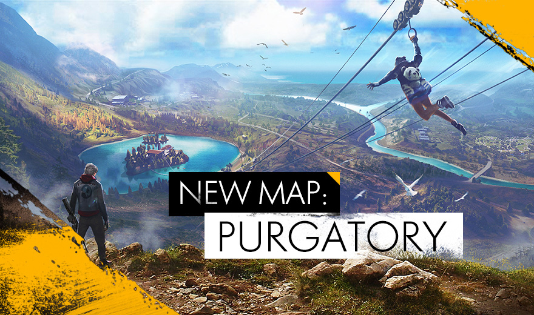
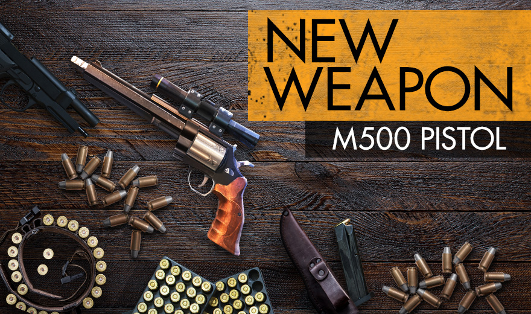

# Free Fire · 2018 年 5 月更新

- 公告日期：2018-05-24
- 官方来源：[NEW UPDATE: NEW MAP & FIRE PASS](https://ff.garena.com/en/article/165/)
- 审阅日期：2026-09-19
- 6 个分类小节；10 项说明及表格行；3 张官方公告插图。

本篇 BR 与通用局内更新按官方正文整理；本公告未列 CS 专属内容。独立玩法与局外内容保留目录处置，未公开的细节明确标注为未说明。

版本节点采用公告日期；原文未单列具体实装时间时保留未知。记录历史版本变化，不代表当前规则。

## BR · 大逃杀

### 炼狱地图与滑索

- 归属：BR · 大逃杀 / 常规调整
- 原文小节：New Features
- 时间：正文未单列该项实装时刻；以公告日期索引。

炼狱地图与滑索官方图。原文：New Features。[官方原图](https://cdn.wildflamestudio.com/common/web_event/official/56d8971a132102.jpg) · 880×520。

- 炼狱（Purgatory）地图完整开放。
- 滑索仅在炼狱可用，用于快速移动。
- 地图增加可跳上的轮胎。

### M500 与扫描战备

- 归属：BR · 大逃杀 / 常规调整
- 原文小节：New Features
- 时间：正文未单列该项实装时刻；以公告日期索引。

M500 左轮手枪官方图。原文：New Features。[官方原图](https://cdn.wildflamestudio.com/common/web_event/official/db7662d885ae04.jpg) · 880×520。

- 新增 M500 左轮手枪。
- 新增扫描器战备（Scanner）；原文未在此页展开其效果。

### 组队死亡观战与举报

- 归属：BR · 大逃杀 / 常规调整
- 原文小节：New Features
- 时间：原文未单列此项生效时刻；按公告日期索引，不据此推定当前仍保留。

- 组队对局新增死亡观战和举报；原文未列视角、时长或额外信息权限。

## CS · 枪王对决

## 通用局内调整

### Maxim 角色

- 归属：通用局内调整 / 常规调整
- 原文小节：New Features
- 时间：正文未单列该项实装时刻；以公告日期索引。

通用调整的适用范围未逐模式列出；该公告未提供 CS 专属说明。

Maxim 新角色官方图。原文：New Features。[官方原图](https://cdn.wildflamestudio.com/common/web_event/official/5728fa63275f03.jpg) · 880×520。

- 新增 Maxim 角色；正文未在此页给出技能效果或数值。

### M14、Kar98k 与沙漠之鹰

- 归属：通用局内调整 / 常规调整
- 原文小节：Balances and Improvements
- 时间：正文未单列该项实装时刻；以公告日期索引。

通用调整的适用范围未逐模式列出；该公告未提供 CS 专属说明。

- M14 和 Kar98k 小幅增强，公告未给出数值。
- 沙漠之鹰暂时从游戏中移除。

### 道具使用音画反馈

- 归属：通用局内调整 / 常规调整
- 原文小节：Balances and Improvements
- 时间：正文未单列该项实装时刻；以公告日期索引。

通用调整的适用范围未逐模式列出；该公告未提供 CS 专属说明。

- 新增道具使用的多种音效和动画。

## 其他玩法与局外内容（目录摘要）

### 独立玩法、局外内容与未明确范围事项

Fire Pass 任务徽章奖励、公会荣耀/扩容/排行榜、自定义冲浪板和大厅/商店 UI 属局外进度或外观。死亡观战/举报单独留在组队局内信息小节。

原文目录：New Features / Balances and Improvements

## 官方图片索引

正文图片按相关小节展示，版本总览及其他章节插图另列；同一原图只嵌入一次。

- [炼狱地图与滑索官方图](https://cdn.wildflamestudio.com/common/web_event/official/56d8971a132102.jpg) · 880×520 · 本地 `assets/ff-patches/165-01.jpg`
- [Maxim 新角色官方图](https://cdn.wildflamestudio.com/common/web_event/official/5728fa63275f03.jpg) · 880×520 · 本地 `assets/ff-patches/165-02.jpg`
- [M500 左轮手枪官方图](https://cdn.wildflamestudio.com/common/web_event/official/db7662d885ae04.jpg) · 880×520 · 本地 `assets/ff-patches/165-03.jpg`

## 原文目录（对照用）

- New Features
- Balances and Improvements
