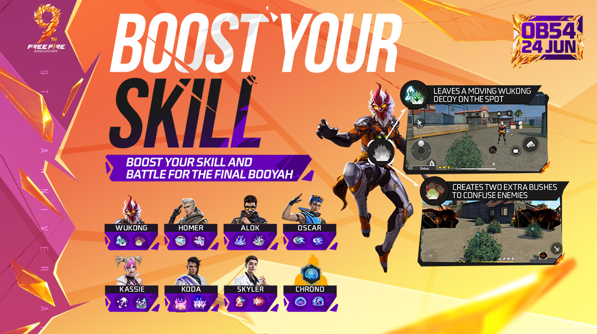
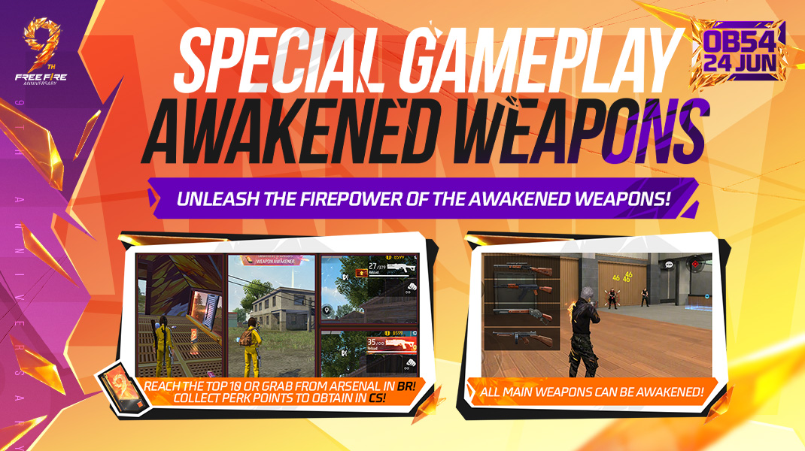
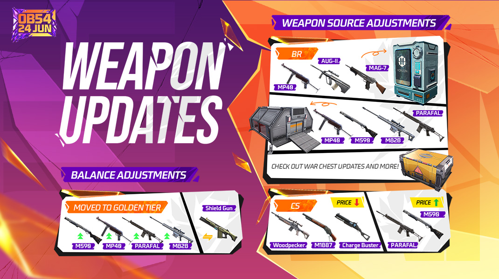
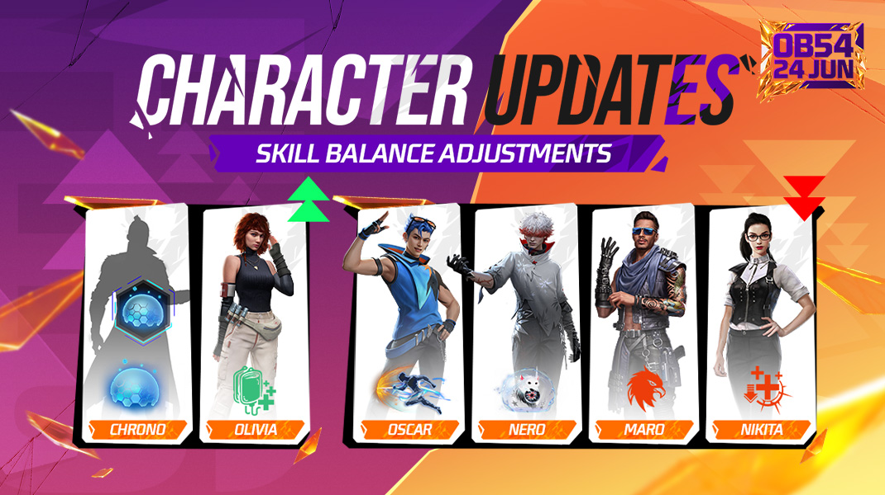

# Free Fire · OB54（2026 年 6 月更新）

- 公告日期：2026-06-23
- 官方来源：[OB54 PATCH NOTES](https://ff.garena.com/en/article/1673/)
- 审阅日期：2026-09-19
- 44 个分类小节；100 项说明及表格行；6 张官方公告插图。

逐项复核本篇 BR、CS 与通用局内章节；独立玩法和局外内容另列目录处置。未将公告日期当作统一上线日期。全部正文图已归档并按实际图像内容关联。

公告日：2026-06-23；六张官方配图均标注 OB54 / 24 JUN，作为 2026-06-24 版本日期证据。周年内容是活动覆盖，未给结束时间；未列各项精确开放时刻。

9 周年总览；OB54，6 月 24 日。原文：Battle Royale > 9th Anniversary Event。[官方原图](https://cdn.wildflamestudio.com/common/web_event/official2.ff.garena.all/20266/c5221298ce80aebe19f4b270160181ab.jpg) · 1080×600。

## BR · 大逃杀

### BR：周年区域任务

- 归属：BR · 大逃杀 / 活动覆盖
- 原文小节：Battle Royale > 9th Anniversary Event / Anniversary Quests
- 时间：公告日：2026-06-23；六张官方配图均标注 OB54 / 24 JUN，作为 2026-06-24 版本日期证据。周年内容是活动覆盖，未给结束时间；未列各项精确开放时刻。

- 活动期间每个地图区域随机生成一个任务；进入区域后，通过售货机或专用任务点接受，与队友共同完成。
- 三种任务：射击并收集周年碎片，组成完整周年水晶；守卫并占领 Knight’s Sword，逐步修复剑；使用跳台收集空中金币。

### BR：区域任务奖励与设施升级

- 归属：BR · 大逃杀 / 活动覆盖
- 原文小节：Battle Royale > Anniversary Quests
- 时间：公告日：2026-06-23；六张官方配图均标注 OB54 / 24 JUN，作为 2026-06-24 版本日期证据。周年内容是活动覆盖，未给结束时间；未列各项精确开放时刻。

- 奖励包括全队增益、高价值地面物资及 Coin Jar。投掷 Coin Jar 后落点形成金币圈，圈内玩家跳舞积累进度，进度满后获得 FF Coins。
- 区域金币机刷新，已取用的可再次使用；售货机升级并提供折扣。
- 区域复活点刷新冷却，升级为 Advanced Revival Point，并提高占领速度；未给加速比例。

### BR：技能强化的积累与选择

- 归属：BR · 大逃杀 / 活动覆盖
- 原文小节：Battle Royale > Skill Boost & Weapon Awakening
- 时间：公告日：2026-06-23；六张官方配图均标注 OB54 / 24 JUN，作为 2026-06-24 版本日期证据。周年内容是活动覆盖，未给结束时间；未列各项精确开放时刻。

8 名角色双选技能强化；6 月 24 日。原文：Battle Royale > Skill Boost & Weapon Awakening。[官方原图](https://cdn.wildflamestudio.com/common/web_event/official2.ff.garena.all/20266/35dddcb72bd4cfc38232f248f8b65ac1.jpg) · 1070×600。

- 通过存活、造成伤害和淘汰累积 Skill Boost Energy，进度满后选择强化所装备的角色技能。
- 支持 Alok、Koda、Homer、Chrono、Kassie、Skyler、Wukong、Oscar；每个技能有两个强化选项，只能选一个。
- 使用其他主动技能者，改为获得 15% 技能冷却缩减。

### BR：武器觉醒与获得方式

- 归属：BR · 大逃杀 / 活动覆盖
- 原文小节：Battle Royale > Weapon Awakening:
- 时间：公告日：2026-06-23；六张官方配图均标注 OB54 / 24 JUN，作为 2026-06-24 版本日期证据。周年内容是活动覆盖，未给结束时间；未列各项精确开放时刻。

觉醒武器；BR 军械库或剩余 10 人，CS 使用成长点数。原文：Battle Royale > Weapon Awakening: / Clash Squad > CS Perk Points。[官方原图](https://cdn.wildflamestudio.com/common/web_event/official2.ff.garena.all/20266/9345c8bb88e6f1bebbba12fd98e84434.jpg) · 1070×600。

- 使用 Weapon Awakener 升级芯片使武器觉醒；近战和副武器除外。
- 觉醒后属性整体增强，其中一个属性额外加成，未列倍率。弹药无限，但榴弹武器和榴弹模式除外。
- 可从升级军械库获得；本局仅剩 10 名玩家时，每名存活者自动获得 1 个。

### BR：原地复活

- 归属：BR · 大逃杀 / 活动覆盖
- 原文小节：Battle Royale > Weapon Awakening:
- 时间：公告日：2026-06-23；六张官方配图均标注 OB54 / 24 JUN，作为 2026-06-24 版本日期证据。周年内容是活动覆盖，未给结束时间；未列各项精确开放时刻。

- 每名玩家可原地复活一次；第 4 个安全区之后不可用；复活耗时 10 秒。
- 复活后自动取回自己战利品箱内尚未被他人拿走的物品。
- 本项在正文中紧接 Weapon Awakening，独立粗体标题为 On-the-Spot Revival: More Tactical Choices。

### BR：Factory 临时替换为周年会场

- 归属：BR · 大逃杀 / 活动覆盖
- 原文小节：Battle Royale > 9th Anniversary Party Venue: A Brand-New Playable Area
- 时间：公告日：2026-06-23；六张官方配图均标注 OB54 / 24 JUN，作为 2026-06-24 版本日期证据。周年内容是活动覆盖，未给结束时间；未列各项精确开放时刻。

- 活动期间，Bermuda 的 Factory 临时替换为周年会场，采用新布局和视觉设计；未列逐个掩体位置。

### BR：地点物资等级提示

- 归属：BR · 大逃杀 / 常规调整
- 原文小节：Battle Royale > BR Area Loot Tier Display
- 时间：公告日：2026-06-23；六张官方配图均标注 OB54 / 24 JUN，作为 2026-06-24 版本日期证据。周年内容是活动覆盖，未给结束时间；未列各项精确开放时刻。

- 跳伞时，各主要区域名称下方按物资等级显示红、金、紫色提示。

### BR：碰拳交互

- 归属：BR · 大逃杀 / 常规调整
- 原文小节：Battle Royale > Fist Bump
- 时间：公告日：2026-06-23；六张官方配图均标注 OB54 / 24 JUN，作为 2026-06-24 版本日期证据。周年内容是活动覆盖，未给结束时间；未列各项精确开放时刻。

- 快捷消息新增表情页，可向附近队友或敌人发起碰拳。
- 淘汰敌人且附近有队友时，自动显示碰拳按钮；可点击回应队友请求，多人可一起参与。

### BR：随机事件池调整

- 归属：BR · 大逃杀 / 常规调整
- 原文小节：Battle Royale > Other Adjustments
- 时间：公告日：2026-06-23；六张官方配图均标注 OB54 / 24 JUN，作为 2026-06-24 版本日期证据。周年内容是活动覆盖，未给结束时间；未列各项精确开放时刻。

- 公告列出开局持 MAG-7、售货机折扣、雷暴区、物资升级、武器强化相关事件；未给概率或轮换时间。

### BR：复活时限与保留金币

- 归属：BR · 大逃杀 / 常规调整
- 原文小节：Battle Royale > Other Adjustments
- 时间：公告日：2026-06-23；六张官方配图均标注 OB54 / 24 JUN，作为 2026-06-24 版本日期证据。周年内容是活动覆盖，未给结束时间；未列各项精确开放时刻。

- 淘汰后观战队友时，禁用复活卡折扣功能。
- 复活卡购买窗口 420→355 秒。
- 复活后保留 FF Coins 的上限为 600。

### BR：商品价格与资源来源

- 归属：BR · 大逃杀 / 常规调整
- 原文小节：Battle Royale > Other Adjustments
- 时间：公告日：2026-06-23；六张官方配图均标注 OB54 / 24 JUN，作为 2026-06-24 版本日期证据。周年内容是活动覆盖，未给结束时间；未列各项精确开放时刻。

- Enhance Hammer 价格 400→600 FF Coins；战术市场 Bolt Maker 限购调整为 1。
- 售货机新增 Skill Enhancer，每种卡每名玩家限购 1 张。
- 移除地面主动技能卡和 Wealth Mushroom。
- 金币机不再产出医疗包，增加医疗包地面掉落；调整金币机数量，未列新数量。
- 武器架加入弹药。

### BR：冰墙、马匹与操作调整

- 归属：BR · 大逃杀 / 常规调整
- 原文小节：Battle Royale > Other Adjustments
- 时间：公告日：2026-06-23；六张官方配图均标注 OB54 / 24 JUN，作为 2026-06-24 版本日期证据。周年内容是活动覆盖，未给结束时间；未列各项精确开放时刻。

- Gloo Maker 每级的冰墙上限增加 1；淘汰及战利品箱获得的冰墙数量统一为 1。
- Misha 技能现在对马匹生效。
- 自动快捷消息与智能建议增加触发场景，原文未逐个列出。
- 优化受到伤害打断售货机交互的情况，原文未给所有中断条件。

### BR：售货机武器

- 归属：BR · 大逃杀 / 常规调整
- 原文小节：Weapon and Balance > Weapon Source Adjustments
- 时间：公告日：2026-06-23；六张官方配图均标注 OB54 / 24 JUN，作为 2026-06-24 版本日期证据。周年内容是活动覆盖，未给结束时间；未列各项精确开放时刻。

武器数值、稀有度、BR 产出与 CS 价格。原文：Weapon and Balance。[官方原图](https://cdn.wildflamestudio.com/common/web_event/official2.ff.garena.all/20266/b2e87b0ecc4846572a8d2c2bf66ba9dd.jpg) · 1070×600。

- AUG-II 600 FF Coins，每局限购 2；MP40 400，每局限购 5；MAG-7 200，每局限购 5。

### BR：军械库产出

- 归属：BR · 大逃杀 / 常规调整
- 原文小节：Weapon and Balance > Weapon Source Adjustments
- 时间：公告日：2026-06-23；六张官方配图均标注 OB54 / 24 JUN，作为 2026-06-24 版本日期证据。周年内容是活动覆盖，未给结束时间；未列各项精确开放时刻。

- 基础军械库护甲：4 套 2 级衣盔→2 套 2 级加 2 套 3 级；移除 Thompson/Groza/AWM，新增 PARAFAL/MP40/M590/M82B。
- 升级军械库护甲：2 套 2 级加 2 套 3 级→4 套 3 级；移除 FAMAS/Charge Buster/Kar98k，新增 PARAFAL/MP40/M590/M82B。
- 高级资源区提高 MP40、PARAFAL、M82B、M590 掉率，未列比例。

### BR：三级战备箱物资

- 归属：BR · 大逃杀 / 常规调整
- 原文小节：Weapon and Balance > Weapon Source Adjustments
- 时间：公告日：2026-06-23；六张官方配图均标注 OB54 / 24 JUN，作为 2026-06-24 版本日期证据。周年内容是活动覆盖，未给结束时间；未列各项精确开放时刻。

- 1 级箱高概率：0 级可升级武器、白色武器、2 级衣盔；低概率：1 级可升级武器。
- 2 级箱高概率：1 级可升级武器、白色武器、2 级衣盔；低概率：2 级可升级武器、金色武器、3 级衣盔。
- 3 级箱高概率：2 级可升级武器、金色武器、2 级衣盔；低概率：3 级可升级武器、空投武器、3 级衣盔、4 级衣盔。
- 未列各档数值概率。Kar98k、FAMAS、Charge Buster 的物品显示等级由金色改为白色。

## CS · 枪王对决

### CS：Perk Points 与逐级强化

- 归属：CS · 枪王对决 / 常规调整
- 原文小节：Clash Squad > 9th Anniversary Event / CS Perk Points
- 时间：公告日：2026-06-23；六张官方配图均标注 OB54 / 24 JUN，作为 2026-06-24 版本日期证据。周年内容是活动覆盖，未给结束时间；未列各项精确开放时刻。

- Perk Points 取代 Cyber Points，可通过占领 Cyber Airdrop 获得；特定回合额外给点数，未列回合与数值。
- 后续购买阶段选择升级物品，之后每回合免费获得。
- 1 级：Skill Boost 或技能增益；2、3 级：特殊增益；4 级：觉醒武器。
- 周年活动通过 Perk Points 解锁技能强化与武器觉醒。

### CS：团队 EP、快捷购买与篝火范围

- 归属：CS · 枪王对决 / 常规调整
- 原文小节：Clash Squad > Other Adjustments
- 时间：公告日：2026-06-23；六张官方配图均标注 OB54 / 24 JUN，作为 2026-06-24 版本日期证据。周年内容是活动覆盖，未给结束时间；未列各项精确开放时刻。

- 购买 Team EP 时，根据队友本回合已买蘑菇数量返还多余 CS Cash，未列换算比例。
- 双击购买槽位可直接购买。
- Super Bonfire 覆盖整个出生区域，并新增范围轮廓特效。

### CS：价格与武器来源

- 归属：CS · 枪王对决 / 常规调整
- 原文小节：Weapon and Balance > Weapon Source Adjustments
- 时间：公告日：2026-06-23；六张官方配图均标注 OB54 / 24 JUN，作为 2026-06-24 版本日期证据。周年内容是活动覆盖，未给结束时间；未列各项精确开放时刻。

- PARAFAL、M590 各 1500→1600 CS Cash；Charge Buster 1600→1500；M1887 1900→1800；Woodpecker 2000→1900。
- 移除 M24-III，改为出售 M24-II，售价 1600 CS Cash，升级费 600。
- Supply Gadget 可获得 M82B。

### CS：Solara 护栏与 Kalahari 滑索

- 归属：CS · 枪王对决 / 常规调整
- 原文小节：Map
- 时间：公告日：2026-06-23；六张官方配图均标注 OB54 / 24 JUN，作为 2026-06-24 版本日期证据。周年内容是活动覆盖，未给结束时间；未列各项精确开放时刻。

- Solara Hub 出生点附近滑道增加护栏。
- 移除 Kalahari 的所有滑索；本项明确仅 CS。

## 通用局内调整

### Chrono：两种周年技能强化

- 归属：通用局内调整 / 活动覆盖
- 原文小节：Battle Royale > Skill Boost & Weapon Awakening
- 时间：公告日：2026-06-23；六张官方配图均标注 OB54 / 24 JUN，作为 2026-06-24 版本日期证据。周年内容是活动覆盖，未给结束时间；未列各项精确开放时刻。

本篇 BR 说明具体效果，CS 章节明确引入 Skill Boost 并通过 Perk Points 解锁；Homer 原文另列 BR/CS 范围。

- Time Veil：生成不可透视、可挡 1000 伤害的力场。
- Time Drift：力场随使用者移动，可挡 600 伤害；生效中再次点击技能可停止移动。

### Homer：两种周年技能强化

- 归属：通用局内调整 / 活动覆盖
- 原文小节：Battle Royale > Skill Boost & Weapon Awakening
- 时间：公告日：2026-06-23；六张官方配图均标注 OB54 / 24 JUN，作为 2026-06-24 版本日期证据。周年内容是活动覆盖，未给结束时间；未列各项精确开放时刻。

本篇 BR 说明具体效果，CS 章节明确引入 Skill Boost 并通过 Perk Points 解锁；Homer 原文另列 BR/CS 范围。

- UAV Shockwave：技能命中后在指定区域扫描一次，范围 BR 120 米、CS 30 米；范围内敌人小地图位置暴露 5 秒。
- Super Drone：发射强化无人机并开始滑翔，速度加成 15%，持续 15 秒。

### Oscar：两种周年技能强化

- 归属：通用局内调整 / 活动覆盖
- 原文小节：Battle Royale > Skill Boost & Weapon Awakening
- 时间：公告日：2026-06-23；六张官方配图均标注 OB54 / 24 JUN，作为 2026-06-24 版本日期证据。周年内容是活动覆盖，未给结束时间；未列各项精确开放时刻。

本篇 BR 说明具体效果，CS 章节明确引入 Skill Boost 并通过 Perk Points 解锁；Homer 原文另列 BR/CS 范围。

- Phantom Dash：召唤幻影扩大冲刺范围，未列距离。
- Sustained Dash：冲刺持续延长至 8 秒，初始冲刺速度较低并随时间提高，未列具体速度。

### Wukong：两种周年技能强化

- 归属：通用局内调整 / 活动覆盖
- 原文小节：Battle Royale > Skill Boost & Weapon Awakening
- 时间：公告日：2026-06-23；六张官方配图均标注 OB54 / 24 JUN，作为 2026-06-24 版本日期证据。周年内容是活动覆盖，未给结束时间；未列各项精确开放时刻。

本篇 BR 说明具体效果，CS 章节明确引入 Skill Boost 并通过 Perk Points 解锁；Homer 原文另列 BR/CS 范围。

- Camo Decoy：原位置留下移动诱饵，受到 10 伤害、经过 10 秒或使用者恢复人形时消失。
- Cloned Camo：变成灌木的同时再生成两个灌木，持续 10 秒。

### Kassie：两种周年技能强化

- 归属：通用局内调整 / 活动覆盖
- 原文小节：Battle Royale > Skill Boost & Weapon Awakening
- 时间：公告日：2026-06-23；六张官方配图均标注 OB54 / 24 JUN，作为 2026-06-24 版本日期证据。周年内容是活动覆盖，未给结束时间；未列各项精确开放时刻。

本篇 BR 说明具体效果，CS 章节明确引入 Skill Boost 并通过 Perk Points 解锁；Homer 原文另列 BR/CS 范围。

- Mutual Focus：手动或自动触发 Focused Therapy 时，为队友治疗的同时回复自身 60 HP。
- Echoed Bond：自身和目标队友身后各生成小型 Kassie；对应玩家命中时，小型 Kassie 造成 5 伤害，冷却 0.2 秒。

### Skyler：两种周年技能强化

- 归属：通用局内调整 / 活动覆盖
- 原文小节：Battle Royale > Skill Boost & Weapon Awakening
- 时间：公告日：2026-06-23；六张官方配图均标注 OB54 / 24 JUN，作为 2026-06-24 版本日期证据。周年内容是活动覆盖，未给结束时间；未列各项精确开放时刻。

本篇 BR 说明具体效果，CS 章节明确引入 Skill Boost 并通过 Perk Points 解锁；Homer 原文另列 BR/CS 范围。

- Sticky Rhythm：命中后生成持续区域，锁定最近目标并跟随，对范围内冰墙持续造成伤害；未列数值。
- Split Rhythm：搜索 75 米内冰墙，锁定 15 秒；声波最多同时攻击其中 3 面墙。

### Alok：两种周年技能强化

- 归属：通用局内调整 / 活动覆盖
- 原文小节：Battle Royale > Skill Boost & Weapon Awakening
- 时间：公告日：2026-06-23；六张官方配图均标注 OB54 / 24 JUN，作为 2026-06-24 版本日期证据。周年内容是活动覆盖，未给结束时间；未列各项精确开放时刻。

本篇 BR 说明具体效果，CS 章节明确引入 Skill Boost 并通过 Perk Points 解锁；Homer 原文另列 BR/CS 范围。

- Speed Remix：光环范围提高至 10 米，圈内队友移速 +16%。
- Heal Remix：技能生效期间回复 20 HP/秒。
- 此前 Beat Carnival 活动中的强化在本版返场，不计为首次新增。

### Koda：两种周年技能强化

- 归属：通用局内调整 / 活动覆盖
- 原文小节：Battle Royale > Skill Boost & Weapon Awakening
- 时间：公告日：2026-06-23；六张官方配图均标注 OB54 / 24 JUN，作为 2026-06-24 版本日期证据。周年内容是活动覆盖，未给结束时间；未列各项精确开放时刻。

本篇 BR 说明具体效果，CS 章节明确引入 Skill Boost 并通过 Perk Points 解锁；Homer 原文另列 BR/CS 范围。

- Synced Vision：标记第一轮探测发现的敌人 3 秒，并与队友共享。
- Imprinted Vision：每次发现敌人给其叠加印记，最多 3 层；攻击激活印记，每层额外造成 10 伤害。
- 此前 Lost Treasure 活动中的强化在本版返场，不计为首次新增。

### Nero：常规技能调整

- 归属：通用局内调整 / 常规调整
- 原文小节：Character Balance Adjustments
- 时间：公告日：2026-06-23；六张官方配图均标注 OB54 / 24 JUN，作为 2026-06-24 版本日期证据。周年内容是活动覆盖，未给结束时间；未列各项精确开放时刻。

原文通用章节，未单列适用模式；不据此推定所有独立玩法规则相同。

Chrono、Olivia、Oscar、Nero、Maro、Nikita 常规平衡。原文：Character Balance Adjustments。[官方原图](https://cdn.wildflamestudio.com/common/web_event/official2.ff.garena.all/20266/46df1912e43f24c1f737f10de43fc801.jpg) · 1070×600。

- 玩偶生命 150→1 HP，持续 12 秒；忽略障碍，飞行上限 50 米（BR 100 米）。
- 追踪视线内 8 米最近敌人，爆炸生成半径 8 米区域；使用者和敌人均不能放冰墙，敌人持续失血 10→6 HP/秒。
- 玩偶被摧毁后区域消失，摧毁者被标记 5 秒，技能冷却 45 秒。
- 本篇旧值为 10 HP/秒；OB53 正文曾记录 16→14，不据此补造中间调整日期。

### Chrono：常规技能调整

- 归属：通用局内调整 / 常规调整
- 原文小节：Character Balance Adjustments
- 时间：公告日：2026-06-23；六张官方配图均标注 OB54 / 24 JUN，作为 2026-06-24 版本日期证据。周年内容是活动覆盖，未给结束时间；未列各项精确开放时刻。

原文通用章节，未单列适用模式；不据此推定所有独立玩法规则相同。

- 力场挡 1000 伤害；内部无法攻击外部敌人，持续 10 秒；冷却 60→45 秒。

### Maro：常规技能调整

- 归属：通用局内调整 / 常规调整
- 原文小节：Character Balance Adjustments
- 时间：公告日：2026-06-23；六张官方配图均标注 OB54 / 24 JUN，作为 2026-06-24 版本日期证据。周年内容是活动覆盖，未给结束时间；未列各项精确开放时刻。

原文通用章节，未单列适用模式；不据此推定所有独立玩法规则相同。

- 随距离增加的伤害加成上限 25%→20%；对被标记敌人的伤害另增 5%。

### Oscar：常规技能调整

- 归属：通用局内调整 / 常规调整
- 原文小节：Character Balance Adjustments
- 时间：公告日：2026-06-23；六张官方配图均标注 OB54 / 24 JUN，作为 2026-06-24 版本日期证据。周年内容是活动覆盖，未给结束时间；未列各项精确开放时刻。

原文通用章节，未单列适用模式；不据此推定所有独立玩法规则相同。

- 向目标方向冲刺，以 25 伤害引爆路径前 3 面冰墙，并对遇到的敌人造成 25 伤害及击退；冷却 45→60 秒。

### Nikita：常规技能调整

- 归属：通用局内调整 / 常规调整
- 原文小节：Character Balance Adjustments
- 时间：公告日：2026-06-23；六张官方配图均标注 OB54 / 24 JUN，作为 2026-06-24 版本日期证据。周年内容是活动覆盖，未给结束时间；未列各项精确开放时刻。

原文通用章节，未单列适用模式；不据此推定所有独立玩法规则相同。

- 装填速度加成 30%→20%；命中敌人后施加 50% 治疗削减，持续 6 秒，削减上限 50%。

### Olivia：常规技能调整

- 归属：通用局内调整 / 常规调整
- 原文小节：Character Balance Adjustments
- 时间：公告日：2026-06-23；六张官方配图均标注 OB54 / 24 JUN，作为 2026-06-24 版本日期证据。周年内容是活动覆盖，未给结束时间；未列各项精确开放时刻。

原文通用章节，未单列适用模式；不据此推定所有独立玩法规则相同。

- 治疗效果增加 30%；将自身单体治疗量的 80%→90% 传递给半径 15→20 米内队友。

### PARAFAL

- 归属：通用局内调整 / 常规调整
- 原文小节：Weapon and Balance > Weapon Adjustments: PARAFAL/MP40/M590/M82B
- 时间：公告日：2026-06-23；六张官方配图均标注 OB54 / 24 JUN，作为 2026-06-24 版本日期证据。周年内容是活动覆盖，未给结束时间；未列各项精确开放时刻。

原文通用章节，未单列适用模式；不据此推定所有独立玩法规则相同。

- 穿甲 +5%，稀有度改为金色。

### MP40

- 归属：通用局内调整 / 常规调整
- 原文小节：Weapon and Balance > Weapon Adjustments: PARAFAL/MP40/M590/M82B
- 时间：公告日：2026-06-23；六张官方配图均标注 OB54 / 24 JUN，作为 2026-06-24 版本日期证据。周年内容是活动覆盖，未给结束时间；未列各项精确开放时刻。

原文通用章节，未单列适用模式；不据此推定所有独立玩法规则相同。

- 穿甲 +10%、精度 +5%、切枪速度 +25%，稀有度改为金色。

### M590

- 归属：通用局内调整 / 常规调整
- 原文小节：Weapon and Balance > Weapon Adjustments: PARAFAL/MP40/M590/M82B
- 时间：公告日：2026-06-23；六张官方配图均标注 OB54 / 24 JUN，作为 2026-06-24 版本日期证据。周年内容是活动覆盖，未给结束时间；未列各项精确开放时刻。

原文通用章节，未单列适用模式；不据此推定所有独立玩法规则相同。

- 爆头伤害衰减距离 +15%、切枪速度 +20%，稀有度改为金色。

### M82B

- 归属：通用局内调整 / 常规调整
- 原文小节：Weapon and Balance > Weapon Adjustments: PARAFAL/MP40/M590/M82B
- 时间：公告日：2026-06-23；六张官方配图均标注 OB54 / 24 JUN，作为 2026-06-24 版本日期证据。周年内容是活动覆盖，未给结束时间；未列各项精确开放时刻。

原文通用章节，未单列适用模式；不据此推定所有独立玩法规则相同。

- 伤害 +6%、穿甲 +10%、射程 +20%，稀有度改为金色。

### 护盾枪与砍刀

- 归属：通用局内调整 / 常规调整
- 原文小节：Weapon and Balance > Other Balance Adjustments
- 时间：公告日：2026-06-23；六张官方配图均标注 OB54 / 24 JUN，作为 2026-06-24 版本日期证据。周年内容是活动覆盖，未给结束时间；未列各项精确开放时刻。

原文通用章节，未单列适用模式；不据此推定所有独立玩法规则相同。

- Shield Gun 原先以 128 护盾点阻挡 100% 伤害，改为护盾点无限、仅减少 5% 所受伤害。
- Parang 可在跑动中攻击。

### 地图：窗户、建筑边缘与地图移除

- 归属：通用局内调整 / 常规调整
- 原文小节：Map
- 时间：公告日：2026-06-23；六张官方配图均标注 OB54 / 24 JUN，作为 2026-06-24 版本日期证据。周年内容是活动覆盖，未给结束时间；未列各项精确开放时刻。

原文通用章节，未单列适用模式；不据此推定所有独立玩法规则相同。

- 改进部分建筑翻窗操作。
- 优化建筑外缘，不能再悬站于边缘移动或射击；例子包括 Bermuda 的 Nurek Dam 桥外缘和 NeXTerra 的 Grav Labs 外部楼梯边缘。
- 从游戏中移除 Bermuda 2.0 与 Alpine。

### 伤害、占领与武器信息

- 归属：通用局内调整 / 常规调整
- 原文小节：Other Gameplay Adjustments
- 时间：公告日：2026-06-23；六张官方配图均标注 OB54 / 24 JUN，作为 2026-06-24 版本日期证据。周年内容是活动覆盖，未给结束时间；未列各项精确开放时刻。

原文通用章节，未单列适用模式；不据此推定所有独立玩法规则相同。

- 伤害数字随数值大小缩放，较高伤害显示更大。
- 复活点、Defense Airdrop、Ultra Airdrop、Cyber Airdrop 的占领提示优化，敌人进入占领区时警示更明显。
- 优化 CS 商店武器 UI；CS 商店与背包选择武器时显示可视化属性。
- 修复 AK47、Desert Eagle、Kar98k、M1873、Bizon、XM8 装填音效不匹配。

### 瞄准、穿墙与自动拾取

- 归属：通用局内调整 / 常规调整
- 原文小节：Other Gameplay Adjustments
- 时间：公告日：2026-06-23；六张官方配图均标注 OB54 / 24 JUN，作为 2026-06-24 版本日期证据。周年内容是活动覆盖，未给结束时间；未列各项精确开放时刻。

原文通用章节，未单列适用模式；不据此推定所有独立玩法规则相同。

- 地面存在当前武器的强化版时，自动换装该强化版。
- 倒地敌人与站立敌人重叠时，辅助瞄准优先站立者。
- M82B、SVD-Y 穿透冰墙留下痕迹，瞄准冰墙时准星改变；优化向右瞄准时「无法穿透射击」提示。
- 弹药堆自动拾取至设置的弹药上限。

### 协助自救与状态显示

- 归属：通用局内调整 / 常规调整
- 原文小节：Other Gameplay Adjustments
- 时间：公告日：2026-06-23；六张官方配图均标注 OB54 / 24 JUN，作为 2026-06-24 版本日期证据。周年内容是活动覆盖，未给结束时间；未列各项精确开放时刻。

原文通用章节，未单列适用模式；不据此推定所有独立玩法规则相同。

- 可协助正在自救的队友，加快复活，未列加速值。
- 对敌人施加减速、治疗削减或破坏其衣盔时，新增专用提示；自身被减速或治疗削减时，角色出现专用特效。
- 设置移速上限，技能、物品、活动增益合计不得超出；达到上限有特效。原文未给上限值。

### 固定移动摇杆

- 归属：通用局内调整 / 常规调整
- 原文小节：Other System Adjustments
- 时间：公告日：2026-06-23；六张官方配图均标注 OB54 / 24 JUN，作为 2026-06-24 版本日期证据。周年内容是活动覆盖，未给结束时间；未列各项精确开放时刻。

原文通用章节，未单列适用模式；不据此推定所有独立玩法规则相同。

- 移动摇杆新增 Fixed 选项，启用后不再跟随左手移动。

### 淘汰后观战的物品信息

- 归属：通用局内调整 / 常规调整
- 原文小节：Other System Adjustments
- 时间：公告日：2026-06-23；六张官方配图均标注 OB54 / 24 JUN，作为 2026-06-24 版本日期证据。周年内容是活动覆盖，未给结束时间；未列各项精确开放时刻。

原文通用章节，未单列适用模式；不据此推定所有独立玩法规则相同。

- 观战好友或淘汰后观战时，可查看被观战者的医疗包、吸入器等治疗物品，以及投掷物、冰墙和装置。

## 其他玩法与局外内容（目录摘要）

### 训练场武器界面

训练场改进武器 UI，选择武器时展示可视化属性。

原文目录：Other Gameplay Adjustments

### 周年派对大厅

首次登录仍进入经典大厅，可通过顶部切换或右上活动入口进入派对大厅，随时切换。周年区提供活动和限时交互物；Arena Showdown 为排队 1v1，胜者留场；Dance Party 可独舞或加入他人舞蹈。新增 Saddle Brawl 双人组队小游戏，下方玩家骑独轮车控制移动与瞄准，上方玩家攻击；可创建自己的派对大厅房间。 同页派对图还列出变大/变小与大锤交互，正文未给具体规则。

原文目录：System > 9th Anniversary Party Lobby

### BR 赛后复盘

完成 BR 排位或自定义赛后，可从结算或战绩启动自动播放的复盘，展示全队移动路径、交战/复活/军械库占领等关键事件、附近敌人活动与全局敌方热图；可分享到外部平台。

原文目录：System > BR Match Review

### Pyro 外观

新增橙、紫、蓝、粉、深红、青色毛色；每次升级获得一次免费配饰抽取。

原文目录：System > New Pyro Rewards

### 资料页社交链接

可关联并选择展示 Facebook、TikTok、YouTube 等社交账号链接。

原文目录：System > Social Media Info Display

### 自定义房观战

新增自由视角；附近信息面板显示一定范围队伍数，点击切换对应玩家；可点击地图队伍图标切换。未列范围。

原文目录：System > Improved Room Spectating

### 其他社交、分享与相机调整

相机新增动态滤镜。Assemble 移至右侧弹窗，接受后与上局随机队友组队，原队任何成员接受会将全队加入。新增好友后收到组队通知；招募过滤 AFK 队长并支持 Quick Switch。CS/LW 自定义赛后生成分享图，对手为房主好友时显示过去 7 天交手战绩。

原文目录：Other System Adjustments

### Craftland：创作者系统

新增创作者等级、专属图标，随等级可获特权与官方支持；重做资料页，支持关注与地图发布/更新通知。创作者可展示社交账号链接。

原文目录：Other System Adjustments > Big News:

### Craftland：平台

更新品牌色、页面结构与交互；满足条件可加入好友房间或直接加入其对局，地图游玩中可邀请好友；展示地图游玩场次数。

原文目录：Other System Adjustments > Platform:

### Craftland：编辑器

反馈支持上传截图；地图封面比例统一 20:9；创建地图的模式选择底部新增 Tutorial Level 新手教程；双指缩放不再误选积木。

原文目录：Other System Adjustments > Editor:

## 其余原文配图

以下为尚未在上述小节内展示的原文图片，包括局外章节配图。

派对大厅：竞技场、舞蹈、大小变化、大锤与 Saddle Brawl。原文：System > 9th Anniversary Party Lobby。[官方原图](https://cdn.wildflamestudio.com/common/web_event/official2.ff.garena.all/20266/2f7d2bc65c4d3ace93c44c1fc635a6c3.jpg) · 1070×600。

## 官方图片索引

正文图片按相关小节展示，版本总览及其他章节插图另列；同一原图只嵌入一次。

- [9 周年总览；OB54，6 月 24 日](https://cdn.wildflamestudio.com/common/web_event/official2.ff.garena.all/20266/c5221298ce80aebe19f4b270160181ab.jpg) · 1080×600 · 本地 `assets/ff-patches/1673-01.jpg`
- [8 名角色双选技能强化；6 月 24 日](https://cdn.wildflamestudio.com/common/web_event/official2.ff.garena.all/20266/35dddcb72bd4cfc38232f248f8b65ac1.jpg) · 1070×600 · 本地 `assets/ff-patches/1673-02.jpg`
- [觉醒武器；BR 军械库或剩余 10 人，CS 使用成长点数](https://cdn.wildflamestudio.com/common/web_event/official2.ff.garena.all/20266/9345c8bb88e6f1bebbba12fd98e84434.jpg) · 1070×600 · 本地 `assets/ff-patches/1673-03.jpg`
- [Chrono、Olivia、Oscar、Nero、Maro、Nikita 常规平衡](https://cdn.wildflamestudio.com/common/web_event/official2.ff.garena.all/20266/46df1912e43f24c1f737f10de43fc801.jpg) · 1070×600 · 本地 `assets/ff-patches/1673-04.jpg`
- [武器数值、稀有度、BR 产出与 CS 价格](https://cdn.wildflamestudio.com/common/web_event/official2.ff.garena.all/20266/b2e87b0ecc4846572a8d2c2bf66ba9dd.jpg) · 1070×600 · 本地 `assets/ff-patches/1673-05.jpg`
- [派对大厅：竞技场、舞蹈、大小变化、大锤与 Saddle Brawl](https://cdn.wildflamestudio.com/common/web_event/official2.ff.garena.all/20266/2f7d2bc65c4d3ace93c44c1fc635a6c3.jpg) · 1070×600 · 本地 `assets/ff-patches/1673-06.jpg`

## 原文目录（对照用）

- Patch Notes:
- Battle Royale
- 9th Anniversary Event
- Anniversary Quests
- Skill Boost & Weapon Awakening
- Weapon Awakening:
- 9th Anniversary Party Venue: A Brand-New Playable Area
- BR Area Loot Tier Display
- Fist Bump
- Other Adjustments
- Clash Squad
- 9th Anniversary Event
- CS Perk Points
- Other Adjustments
- Character Balance Adjustments
- Weapon and Balance
- Weapon Adjustments: PARAFAL/MP40/M590/M82B
- Other Balance Adjustments
- Weapon Source Adjustments
- Map
- Other Gameplay Adjustments
- System
- 9th Anniversary Party Lobby
- BR Match Review
- New Pyro Rewards
- Social Media Info Display
- Improved Room Spectating
- Other System Adjustments
- Craftland
- Big News:
- Platform:
- Editor:
