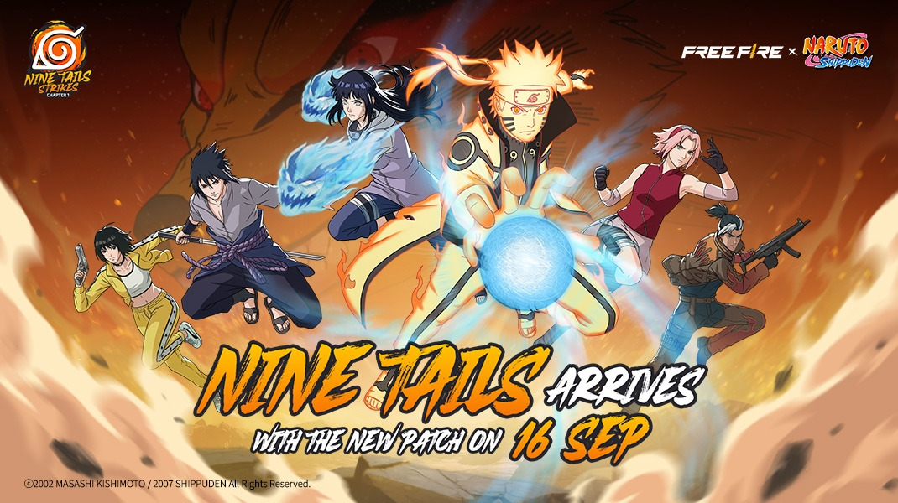
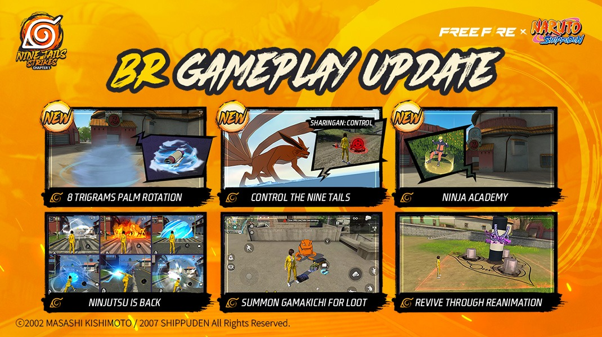
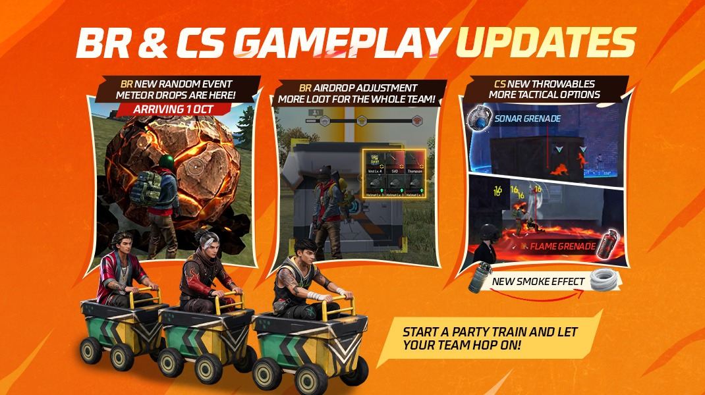
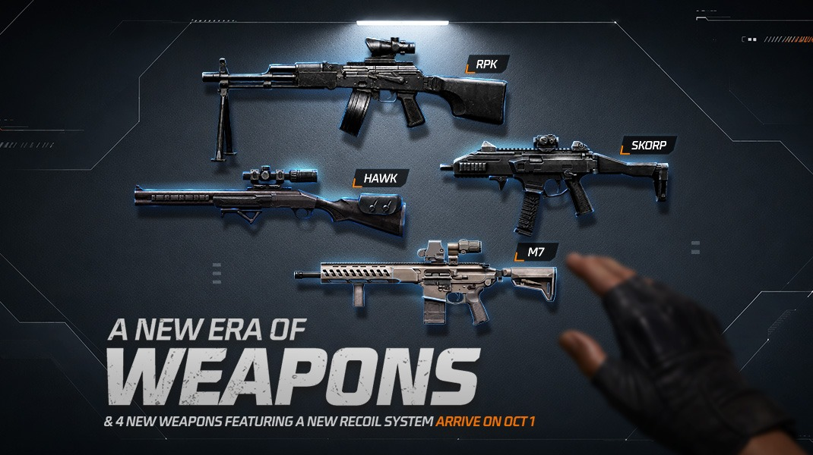
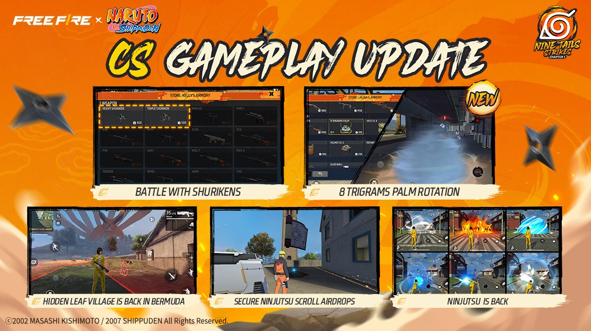
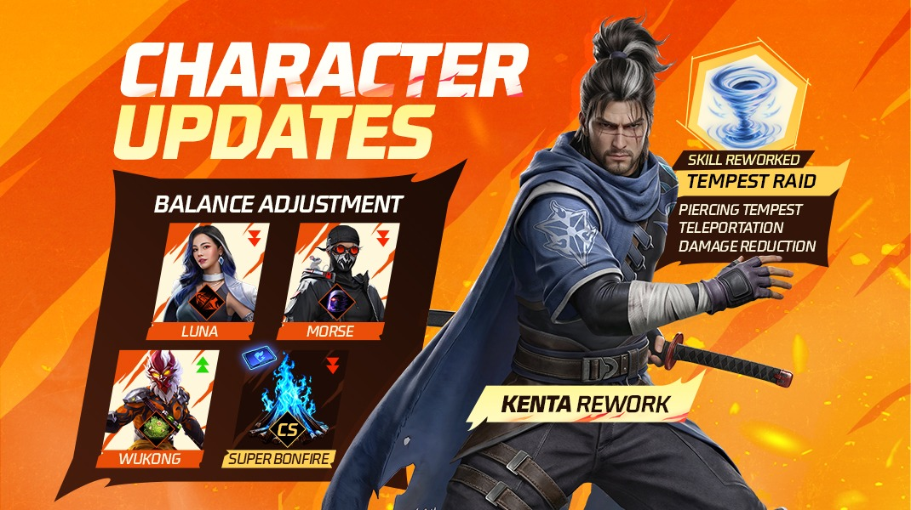

# Free Fire · OB55

- 公告日期：2026-09-10
- 官方来源：[Free Fire OB55 Patch Notes](https://ff.garena.com/en/article/1712/)
- 审阅日期：2026-09-18
- 21 个分类小节；81 项说明及表格行；6 张官方公告插图。

本篇 BR、CS、地图、装备、角色武器与局内操作详细整理；其他独立玩法及局外系统保留目录摘要。不是全部历史版本。

版本节点采用公告日期。分期开启、预告及未公布日期的事项按各项备注；公告没有给出当前仍保留的承诺。 正文第 1 张九尾回归官方配图（16 Sep）给出的补丁日期为 2026-09-16；各项分期开放仍以正文说明为准。

九尾回归官方主题图，注明 9 月 16 日推出。原文：NARUTO SHIPPUDEN Chapter 1 Returns。[官方原图](https://cdn.wildflamestudio.com/common/web_event/official2.ff.garena.all/20269/97ef11e9b9a48933b40695952fcd0793.jpeg) · 1070×600。

## BR · 大逃杀

### 九尾事件

- 归属：BR · 大逃杀 / 活动覆盖
- 原文小节：NARUTO SHIPPUDEN Chapter 1 Returns > Battle Royale > Nine Tails Event
- 时间：本项未单独提供精确生效日期；使用公告日期索引。

BR 九尾控制、木叶村、忍术、召唤及返场。原文：NARUTO SHIPPUDEN Chapter 1 Returns > Battle Royale。[官方原图](https://cdn.wildflamestudio.com/common/web_event/official2.ff.garena.all/20269/d94d9ba1323d9065ec948f0a2202e7a3.jpeg) · 1070×600。

- 开局随机事件：运输机着火后倒计时强制跳伞；或九尾炸开军械库使其免钥匙进入；或制造带物资的弹坑。后两项仅百慕大地图。
- 对局中可争夺“写轮眼·控制”并指定轰炸区域。目标区预警 5 秒，尾兽玉对 100 米内玩家造成 60 点爆炸伤害。
- 爆炸后随机生成 8—10 处半径 4 米的火区，持续 5—10 秒，每 0.5 秒造成 5 点伤害；离开后仍每秒受 1 点伤害，持续 2 秒。

### 木叶村、复活点与蛤蟆吉召唤

- 归属：BR · 大逃杀 / 活动覆盖
- 原文小节：NARUTO SHIPPUDEN Chapter 1 Returns > Battle Royale
- 时间：本项未单独提供精确生效日期；使用公告日期索引。

- 木叶村新增忍者学校与门前秋千；使用秋千获得 5% 移速加成。原文称永久加成，但未说明跨对局保留，不按账号永久属性解读。
- 木叶村成为所有地图的默认候机区域。百慕大上的村庄可在对局中探索。
- 占领秽土转生主题复活点后，队友从棺木中复活，替代常规跳伞返场，并获得短暂保护与相应返场物资。
- 地图散布蛤蟆吉召唤卷轴，交互后获得战斗物资。

### 忍术技能卡逐项效果

- 归属：BR · 大逃杀 / 活动覆盖
- 原文小节：Ninjutsu Skills & Ninja Tools > Ninjutsu Skill Cards
- 时间：本项未单独提供精确生效日期；使用公告日期索引。

- 八卦掌·回天：前冲并生成持续 2 秒的旋转护盾，击退范围内敌人并造成 50 点伤害，可吸收子弹并弹开部分投掷物。
- 豪火球：碰撞后在 4 米内造成 30 点伤害，并让敌人及冰墙每秒受 5 点燃烧伤害，持续 5 秒。
- 水龙弹：碰撞后在 5 米内造成 30 点伤害，并短暂遮挡视野。
- 大突破：4 米爆炸范围、30 点伤害，敌人移速降低 50%、射速降低 20%。
- 螺旋丸：冲刺命中造成 50 点伤害，敌人移速降低 50%、射速降低 20%。
- 千鸟：高速冲刺命中造成 70 点伤害，使目标 3 秒内无法部署冰墙或使用小地图。
- 樱花冲：冲刺命中造成 25 点伤害并击退。上述列表在公告中明确写为 BR 拾取；CS 商店可获得忍术，但逐种供应范围仍以商店为准。

### 随机事件池与分期开放

- 归属：BR · 大逃杀 / 常规调整
- 原文小节：Battle Royale > New Random Events
- 时间：含补丁开放项与 2026-10-01 预定项，按上文分别记录

BR 随机事件、空投、跟随与 CS 新投掷物。原文：Battle Royale / Clash Squad。[官方原图](https://cdn.wildflamestudio.com/common/web_event/official2.ff.garena.all/20269/4916366f5b345410dde655a038c7aa93.jpeg) · 1070×600。

- 补丁开放：火影联动随机事件；百慕大山顶狂热（Peak Mania）提高山顶冲锋枪、霰弹枪和近战武器数量；毁灭风暴（Razing Storm）要求玩家进入房屋躲避。
- 武器强化事件分别包括：突击步枪散布减小、突击步枪穿甲提高、冲锋枪穿甲提高、冲锋枪精度提高；另保留“无随机事件”。
- 10 月 1 日预定追加：普通空投变为陨石坠落；黑色星期五让售货机增加商品并提供折扣。两项保留预告状态，不能与补丁当日内容混记。

### 三类空投的数量、时间与标记

- 归属：BR · 大逃杀 / 常规调整
- 原文小节：Battle Royale > Airdrop Adjustments
- 时间：本项未单独提供精确生效日期；使用公告日期索引。

- 普通空投：约开局 160 秒起投放，每局共 4 个；改进小地图图标、光柱和标记。处于圈外 45 秒后标识消失；主奖励被取走 10 秒后移除地图标记，物资全部取完则立即移除。
- 防御空投：开局 410 秒同时落下 2 个，增加物资数量和品质，面向整支小队补给；强化光柱和落地时的 HUD 提示。
- 终极空投：约开局 410 秒投放，每局 1 个；占领后仍提供 5 级护甲并复活阵亡队友。与 OB52 的 400 秒相比，本版记录更新为约 410 秒。

### 主动与被动装置分槽

- 归属：BR · 大逃杀 / 常规调整
- 原文小节：Battle Royale > Device System Adjustment
- 时间：本项未单独提供精确生效日期；使用公告日期索引。

- 由只能装备 1 个装置，改为主动、被动各装备 1 个。
- 主动类：主动技能卡、跳台（Launch Pad）、补给箱（Supply Box）、轻型无人机（UAV-Lite）、迷你炮塔、便携传送门。
- 被动类：Dragon Sprinters（被动装置）、干扰器（Jammer）和新增 Horizaline（被动装置）。本小节未逐项说明两个专名装置的效果，不能由名称推测。

### 自动跟随与队列中断条件

- 归属：BR · 大逃杀 / 常规调整
- 原文小节：Battle Royale > New Follow Mechanic
- 时间：本项未单独提供精确生效日期；使用公告日期索引。

- 附近有可加入的队列时 HUD 显示跟随按钮，点击后自动移动并加入最近的队列；可从表情轮盘使用火车表情发起队列。
- 队长旗标仅本人和队友可见，敌人不可见；社交岛要求先有一人成为队长。
- 切换武器、开镜、射击、使用投掷物或部分技能、受击、倒地、淘汰、乘车、翻窗和传送等行为会中断跟随。
- 使用医疗包或吸入器、跳跃、表情和圈外伤害不会中断；只影响一人的中断动作只使该玩家退出，其余成员继续跟随。

### 返场、救援与局内操作

- 归属：BR · 大逃杀 / 常规调整
- 原文小节：Battle Royale > Other Adjustments
- 时间：本项未单独提供精确生效日期；使用公告日期索引。

- 复活跳伞过程中可预览和切换武器；使用医疗包时可同时扶起队友；团队返场新增提示。
- 开局单排复活窗口由 540 秒缩短为 410 秒。
- 优化航线外建议落点的展示、下坡移动、滑道上冰墙特效；候机时地图已显示复活点及售货机，便于规划落点。
- 售货机界面强化物品说明和特殊物品标记；使用吸入器或能量道具进入交互范围时，购买按钮仍保留。
- 敌人标记语音按距离变化；调整情报箱购买时限，但本段未提供新时限数值。
- 地面物资新增金币罐；索拉拉缩圈时序与其他地图对齐；武器现在能够打碎军械库玻璃直接进入。

### BR 武器来源与售货机

- 归属：BR · 大逃杀 / 常规调整
- 原文小节：Weapon and Balance > Weapon Source Adjustments > Battle Royale
- 时间：AWM 属本次补丁；新枪分 2026 年 10 月初及 10 月 1 日预告，详见逐项说明

M7、Skorp、RPK、Hawk 四款新枪预告。原文：Weapon and Balance > New Weapons。[官方原图](https://cdn.wildflamestudio.com/common/web_event/official2.ff.garena.all/20269/f2088183bc327d892b3ab2de8f242cf3.jpeg) · 1070×600。

- 本次补丁：AWM 售价 600 FF 金币，每局限购 3 把。
- 10 月初上架预告：M7、Hawk 各 400 FF 金币，每局各限购 5；Skorp 100 FF 金币，不限购。“10 月初”保留为模糊时间，不强行换成 10 月 1 日。
- 10 月 1 日预告：M7 来自稀有地面掉落、高级蓝区及军械库；Skorp、RPK、Hawk 来自地面物资和武器架；Skorp 还将成为超级复活默认武器。

## CS · 枪王对决

### 火影联动团竞规则

- 归属：CS · 枪王对决 / 活动覆盖
- 原文小节：NARUTO SHIPPUDEN Chapter 1 Returns > Clash Squad
- 时间：本项未单独提供精确生效日期；使用公告日期索引。

CS 忍术商店、卷轴空投与木叶村。原文：NARUTO SHIPPUDEN Chapter 1 Returns > Clash Squad。[官方原图](https://cdn.wildflamestudio.com/common/web_event/official2.ff.garena.all/20269/663e6059f5350b2d54d037b7583bb32f.jpeg) · 1070×600。

- 团竞商店出售忍术与苦无；第 1 回合的手枪替换为手里剑。
- 电子空投替换为忍术卷轴空投；木叶村加入团竞地图池。

### 火焰、声呐与烟雾投掷物

- 归属：CS · 枪王对决 / 常规调整
- 原文小节：Clash Squad > New Throwables in CS
- 时间：本项未单独提供精确生效日期；使用公告日期索引。

- 火焰手雷：火区 1 秒扩散完成、持续 6 秒；敌人每 0.5 秒受 16 点伤害和 10% 护甲耐久损失；友军每 0.5 秒受 8 点伤害和 10% 护甲耐久损失；冰墙每 0.5 秒受 100 点伤害。
- 声呐手雷：扫描半径 10 米，暴露敌人位置 3 秒。
- 烟雾手雷：烟雾表现调整为与战术市场的烟雾漩涡一致。

### 团竞地图与可达区域

- 归属：CS · 枪王对决 / 常规调整
- 原文小节：Clash Squad > Other Adjustments
- 时间：本项未单独提供精确生效日期；使用公告日期索引。

- 卡拉哈里和炼狱地图的小地图提高局部布局细节。
- 卡拉哈里部分建筑移除狭窄栏杆，修正栏后敌人偶尔无法被瞄准的问题；猛犸区域新增掩体。
- 百慕大部分建筑外沿调整，玩家不能再在这些边缘移动或射击。

### 战术市场超级篝火削弱

- 归属：CS · 枪王对决 / 常规调整
- 原文小节：Character Rework and Balance Adjustments > Super Bonfire (Tactical Market in CS)
- 时间：本项未单独提供精确生效日期；使用公告日期索引。

Kenta 重做、角色平衡与 CS 超级篝火。原文：Character Rework and Balance Adjustments。[官方原图](https://cdn.wildflamestudio.com/common/web_event/official2.ff.garena.all/20269/eec6289cb66cedb3ea07206a4bc4c773.jpeg) · 1070×600。

- 每秒 EP 恢复 20→10；射击间隔缩减 15%→8%。这是 CS 战术市场物品调整，不能作为 BR 专属改动。

### CS 武器价格与上架日期

- 归属：CS · 枪王对决 / 常规调整
- 原文小节：Weapon and Balance > Weapon Source Adjustments > Clash Squad
- 时间：AWM 属本次补丁；新枪预定 2026-10-01 上架

- 本次补丁 AWM：2200→2100 团竞货币。
- 10 月 1 日预告：M7 1600、Skorp 1500、RPK 1500、Hawk 1700 团竞货币。

## 通用局内调整

### 手里剑与苦无

- 归属：通用局内调整 / 活动覆盖
- 原文小节：Ninjutsu Skills & Ninja Tools > Shuriken & Kunai
- 时间：本项未单独提供精确生效日期；使用公告日期索引。

原文通用章节或明确跨模式内容；未单列 BR/CS 例外时不推定全部模式完全相同。

- 轻型手里剑：近距离副武器，一次连续发射 3 枚，每枚伤害 17—28，超过一定距离衰减；可切换为 3 枚同时发射。
- 重型手里剑：中距离副武器，每次 1 枚高速弹体，伤害 30—60，随距离衰减。
- 火焰苦无：命中后延迟爆炸，5 米内造成 50—80 点伤害；随后 3 秒内每秒造成 10 点燃烧伤害并损失 10% 护甲耐久。
- 雷电苦无：命中后延迟爆炸，使受影响敌人 3 秒内无法使用投掷物和小地图。
- 风遁苦无：使范围内敌人移速降低 20%—50%，持续 3 秒，越接近爆心减速越强。

### 角色改动与技能修复

- 归属：通用局内调整 / 常规调整
- 原文小节：Character Rework and Balance Adjustments
- 时间：本项未单独提供精确生效日期；使用公告日期索引。

原文通用章节或明确跨模式内容；未单列 BR/CS 例外时不推定全部模式完全相同。

- Kenta（风暴位移与护盾技能）重做：释放穿过冰墙的移动风暴，持续 8 秒、命中造成 25 点伤害；再次施放可传送到风暴位置，获得持续 5 秒、减伤 20% 的护盾，风暴随即消失；冷却 45 秒。
- Morse（隐身技能）：隐身状态下可触发敌人辅助瞄准的距离 4→12 米；最长隐身 15→13 秒。
- Luna（射速转移速）：射速加成 8%→5%；命中后把射速转移速的机制不变。
- Wukong（变身）：冷却 90→75 秒。
- Santino：修复碰撞体积使人进入异常区域、卡住或利用漏洞的问题；Nero：修复玩偶卡入地下；Jammer：更新说明、强化对侦测技能和物品的对抗，并新增成功屏蔽反馈；Skyler：特效可见距离与实际超过 100 米的作用范围一致。

### 四款新武器与新后坐力系统

- 归属：通用局内调整 / 常规调整
- 原文小节：Weapon and Balance > New Weapons
- 时间：2026-10-01 预定；到期须核实实装

原文通用章节或明确跨模式内容；未单列 BR/CS 例外时不推定全部模式完全相同。

- M7：全自动突击步枪，连续射击时准星持续上抬，需主动压枪；面向中远距离。
- Skorp：高射速、带穿甲能力的冲锋枪，使用与 M7 类似的后坐力系统。
- RPK：全自动轻机枪，使用新后坐力系统，兼顾机枪持续火力与突击步枪式机动性。
- Hawk：仅装 2 发的高射速狙击枪，快速连续射击时准星也会上抬；强调两发连续命中的爆发。四款均预定 2026-10-01 推出。

### 冲锋枪与霰弹枪数值

- 归属：通用局内调整 / 常规调整
- 原文小节：Weapon and Balance > Weapon Adjustments > SMGs / Shotguns
- 时间：2026-10-01 预定

原文通用章节或明确跨模式内容；未单列 BR/CS 例外时不推定全部模式完全相同。

- MP5 全升级系列：最低伤害 -15%，射程 -20%，移速 +15%，射击移速 +25%。
- MAC10 全升级系列：穿甲 +5%，射程 -15%，移速 +5%，射击移速 +25%。
- MP40：射程 -15%、移速 +5%、射击移速 +15%；P90：射程 -15%、移速 +13%、射击移速 +25%。
- Bizon：精度 +10%；UMP：射程 -8%、射击移速 +40%；Vector：射程 -30%、射击移速 +20%。
- M1014 全升级系列：移速 +3%、射击移速 +5%；M1887/M1887-X：射程与换弹速度均 +10%。
- MAG-7：移速 +1%、射击移速 +2%；M590：射程 -25%、最低伤害 +120%。

### 突击步枪数值

- 归属：通用局内调整 / 常规调整
- 原文小节：Weapon and Balance > Weapon Adjustments > Assault Rifles
- 时间：2026-10-01 预定

原文通用章节或明确跨模式内容；未单列 BR/CS 例外时不推定全部模式完全相同。

- M4A1 全系列：穿甲 +4%、精度 +7%；SCAR 全系列：精度 +10%；Groza/Groza-X：射击移速 +50%；FAMAS：射程 +15%。
- XM8：换弹速度 +6%、精度 -8%；AN94：穿甲 +12%、换弹速度 -6%、精度 +6%。
- AUG：穿甲 +4%、精度 +8%；AUG-I/II/III：精度 +8%。
- Kingfisher：穿甲 +8%、换弹速度 +8%、精度 +21%；G36 远程形态：精度 +14%。

### 狙击枪、精确射手步枪与机枪数值

- 归属：通用局内调整 / 常规调整
- 原文小节：Weapon and Balance > Weapon Adjustments
- 时间：2026-10-01 预定

原文通用章节或明确跨模式内容；未单列 BR/CS 例外时不推定全部模式完全相同。

- AWM/AWM-Y、Kar98k：移速及射击移速均 -8%；M82B、M24 全系列：射击移速 -10%；VSK94：移速 -15%、射击移速 -10%。
- M14 全系列：移速和射击移速均 -5%；Winchester 全系列：移速 -5%、射击移速 -7%、对护甲额外伤害 -60%。
- SKS、SVD/SVD-Y、Woodpecker：移速 -5%、射击移速 -12%；AC80：移速 -5%、射击移速 -17%。
- 机枪站立与蹲伏时伤害一致，站立射击精度更低，蹲伏获得最高精度。
- M249/M249-X：伤害 +30%、最低伤害 +18%、穿甲 +5%、精度 -10%、换弹速度 -12%、移速 -10%、射击移速 -6%。
- M60 全系列：射速 +25%、穿甲 +8%、弹匣标注 +20%（70→85）、精度 -10%、换弹速度 -10%、移速 -10%、射击移速 -4%。原文百分比与 70→85 不严格相等，保留原文两者并标记差异。
- Kord：穿甲 +8%、弹匣 +20%（50→60）、换弹速度 -10%、移速 -5%、射击移速 -9%。

### 武器成长与其他局内调整

- 归属：通用局内调整 / 常规调整
- 原文小节：Weapon Source Adjustments > Others / Other Gameplay Adjustments
- 时间：本项未单独提供精确生效日期；使用公告日期索引。

原文通用章节或明确跨模式内容；未单列 BR/CS 例外时不推定全部模式完全相同。

- 可升级武器的累计伤害门槛：200/400/800→400/600/800。原文将此项列在 Others，未另列独立生效时间。
- 马匹新增短时加速按钮；按住急停按钮时可滑屏快速转向；生命值 400→300。
- 距离彼此 5 米以内的敌人标记自动合并为一个。

## 其他玩法与局外内容（目录摘要）

### 训练场、独立模式及局外目录

独狼荣誉决斗含 LW 和自定义 CS 1v1 入口、局内表情及胜利记录，不归入常规 BR；训练场可在预设箱切换方案。局外有 Pyro 好友、充值返利、仓库试穿与搜索、匹配时换装、好友队码、成就与外观展示。Craftland 调整封面比例 20:9、属性命名校验、加载页、自定义地图结算与详情页。

原文目录：Mode; Other Gameplay Adjustments; System; Other System Adjustments; Craftland

## 官方图片索引

正文图片按相关小节展示，版本总览及其他章节插图另列；同一原图只嵌入一次。

- [九尾回归官方主题图，注明 9 月 16 日推出](https://cdn.wildflamestudio.com/common/web_event/official2.ff.garena.all/20269/97ef11e9b9a48933b40695952fcd0793.jpeg) · 1070×600 · 本地 `assets/ff-patches/1712-01.jpg`
- [BR 九尾控制、木叶村、忍术、召唤及返场](https://cdn.wildflamestudio.com/common/web_event/official2.ff.garena.all/20269/d94d9ba1323d9065ec948f0a2202e7a3.jpeg) · 1070×600 · 本地 `assets/ff-patches/1712-02.jpg`
- [CS 忍术商店、卷轴空投与木叶村](https://cdn.wildflamestudio.com/common/web_event/official2.ff.garena.all/20269/663e6059f5350b2d54d037b7583bb32f.jpeg) · 1070×600 · 本地 `assets/ff-patches/1712-03.jpg`
- [BR 随机事件、空投、跟随与 CS 新投掷物](https://cdn.wildflamestudio.com/common/web_event/official2.ff.garena.all/20269/4916366f5b345410dde655a038c7aa93.jpeg) · 1070×600 · 本地 `assets/ff-patches/1712-04.jpg`
- [Kenta 重做、角色平衡与 CS 超级篝火](https://cdn.wildflamestudio.com/common/web_event/official2.ff.garena.all/20269/eec6289cb66cedb3ea07206a4bc4c773.jpeg) · 1070×600 · 本地 `assets/ff-patches/1712-05.jpg`
- [M7、Skorp、RPK、Hawk 四款新枪预告](https://cdn.wildflamestudio.com/common/web_event/official2.ff.garena.all/20269/f2088183bc327d892b3ab2de8f242cf3.jpeg) · 1070×600 · 本地 `assets/ff-patches/1712-06.jpg`

## 原文目录（对照用）

- NARUTO SHIPPUDEN Chapter 1 Returns
- Battle Royale
- Nine Tails Event
- Hidden Leaf Village
- Reanimation Revival Points
- Gamakichi Summoning
- Clash Squad
- Ninjutsu Skills & Ninja Tools
- Ninjutsu Skill Cards
- Shuriken & Kunai
- Battle Royale
- New Random Events
- Airdrop Adjustments
- Regular Airdrop
- Defense Airdrop
- Ultra Airdrop
- Device System Adjustment
- New Follow Mechanic
- Other Adjustments
- Clash Squad
- New Throwables in CS
- Other Adjustments
- Character Rework and Balance Adjustments
- Kenta Rework
- Morse
- Luna
- Wukong
- Super Bonfire (Tactical Market in CS)
- Other Adjustments
- Weapon and Balance
- New Weapons
- M7
- Skorp
- RPK
- Hawk
- Weapon Adjustments
- SMGs
- Shotguns
- Assault Rifles
- Sniper Rifles
- Marksman Rifles
- Machine Guns
- Weapon Source Adjustments
- Mode
- Lone Wolf: Duel of Honor
- Other Gameplay Adjustments
- System
- Pyro Pals
- Prime Diamond
- Vault Optimization
- Other System Adjustments
- Craftland
- Platform
