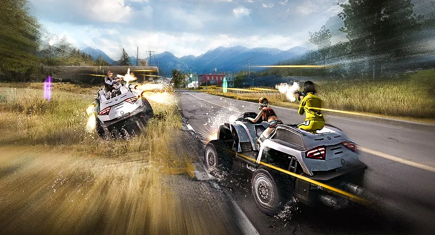

# Free Fire · 2018 年 4 月更新

- 公告日期：2018-04-17
- 官方来源：[NEW UPDATE: NEW MODE, NEW CHARACTER, NEW WEAPON AND NEW VEHICLE](https://ff.garena.com/en/article/175/)
- 审阅日期：2026-09-19
- 6 个分类小节；13 项说明及表格行；1 张官方公告插图。

本篇 BR 与通用局内更新按官方正文整理；本公告未列 CS 专属内容。独立玩法与局外内容保留目录处置，未公开的细节明确标注为未说明。

版本节点采用公告日期；原文未单列具体实装时间时保留未知。记录历史版本变化，不代表当前规则。

## BR · 大逃杀

### 蘑菇食物与能量

- 归属：BR · 大逃杀 / 常规调整
- 原文小节：New Features
- 时间：正文未单列该项实装时刻；以公告日期索引。

- 食用地图蘑菇可获得能量，并随时间恢复 HP。

### 翻窗、两栖摩托与空中滑行

- 归属：BR · 大逃杀 / 常规调整
- 原文小节：New Features
- 时间：正文未单列该项实装时刻；以公告日期索引。

- 角色可以翻越窗户。
- 新增两栖摩托车。
- 新增空中滑行选项。

### M79、配件继承与耐久耗尽

- 归属：BR · 大逃杀 / 常规调整
- 原文小节：New Features / Balances and Improvements
- 时间：正文未单列该项实装时刻；以公告日期索引。

- 新增 M79 榴弹发射器。
- 捡起新武器时，旧武器配件会自动装到新武器。
- 耐久为 0 的装备会消失。

### 安全区与视距

- 归属：BR · 大逃杀 / 常规调整
- 原文小节：Balances and Improvements
- 时间：正文未单列该项实装时刻；以公告日期索引。

- 调整安全区机制，原文目标为不再出现不合理安全区。
- 视距提高 25%，可看见更远敌人。

## CS · 枪王对决

## 通用局内调整

### Misha 与角色等级上限

- 归属：通用局内调整 / 常规调整
- 原文小节：New Features / Balances and Improvements
- 时间：原文未单列此项生效时刻；按公告日期索引，不据此推定当前仍保留。

通用调整的适用范围未逐模式列出；该公告未提供 CS 专属说明。

- 新增赛车女王 Misha；此公告未给技能细节。
- 角色可升级到 7 级；公告未逐级列技能数值或升级费用。

### 断线重连与掩体射击修复

- 归属：通用局内调整 / 常规调整
- 原文小节：New Features / Balances and Improvements
- 时间：原文未单列此项生效时刻；按公告日期索引，不据此推定当前仍保留。

通用调整的适用范围未逐模式列出；该公告未提供 CS 专属说明。

- 断线玩家可重新连接对局。
- 修复右手持枪导致角色看起来能从掩体内射击的问题；原文未给受影响武器、地图或具体触发条件。

## 其他玩法与局外内容（目录摘要）

### 独立玩法、局外内容与未明确范围事项

Death Race 是 40 人、仅双人组队、以载具和强化物为核心的独立模式，关联模式资料处理；敌人掉落盒和背包自定义外观不计基础局内规则。

原文目录：New Features / Balances and Improvements

## 其余原文配图

以下为尚未在上述小节内展示的原文图片，包括局外章节配图。

Death Race 独立玩法宣传图。原文：独立玩法 Death Race。[官方原图](https://cdn.wildflamestudio.com/common/web_event/official/f623f24c946102.jpg) · 890×480。

## 官方图片索引

正文图片按相关小节展示，版本总览及其他章节插图另列；同一原图只嵌入一次。

- [Death Race 独立玩法宣传图](https://cdn.wildflamestudio.com/common/web_event/official/f623f24c946102.jpg) · 890×480 · 本地 `assets/ff-patches/175-01.jpg`

## 原文目录（对照用）

- New Features
- Balances and Improvements
