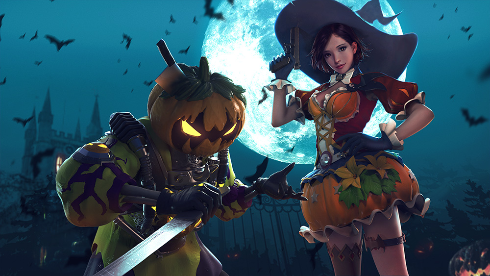
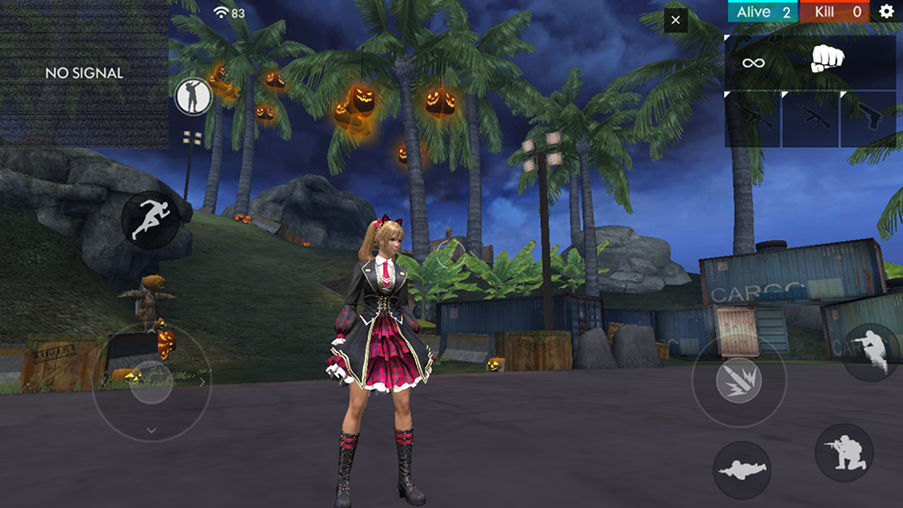
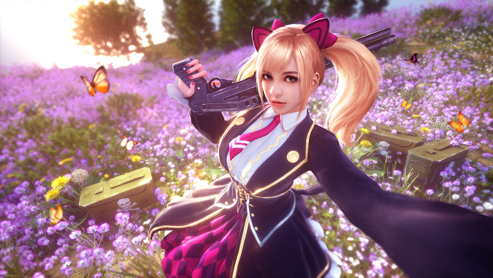
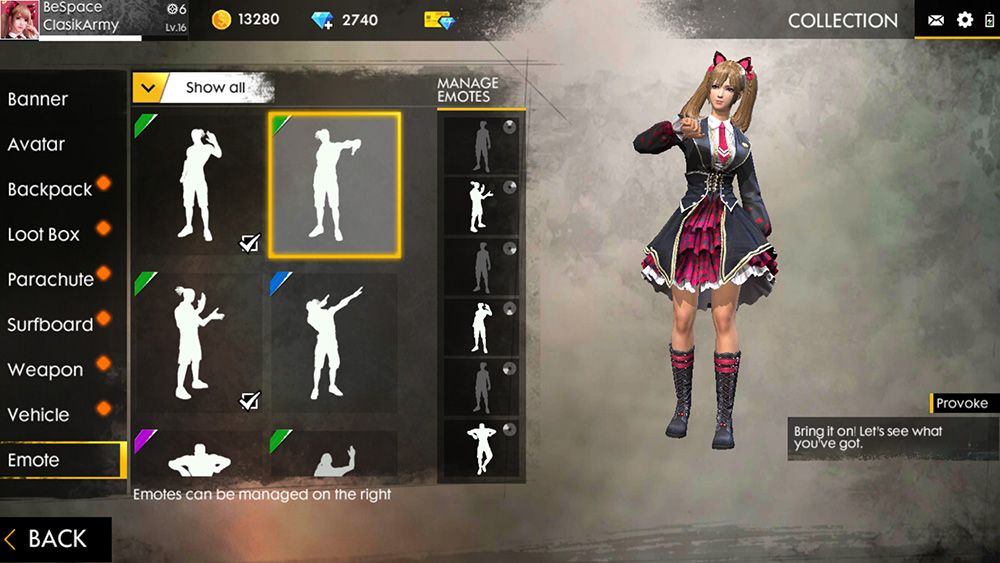
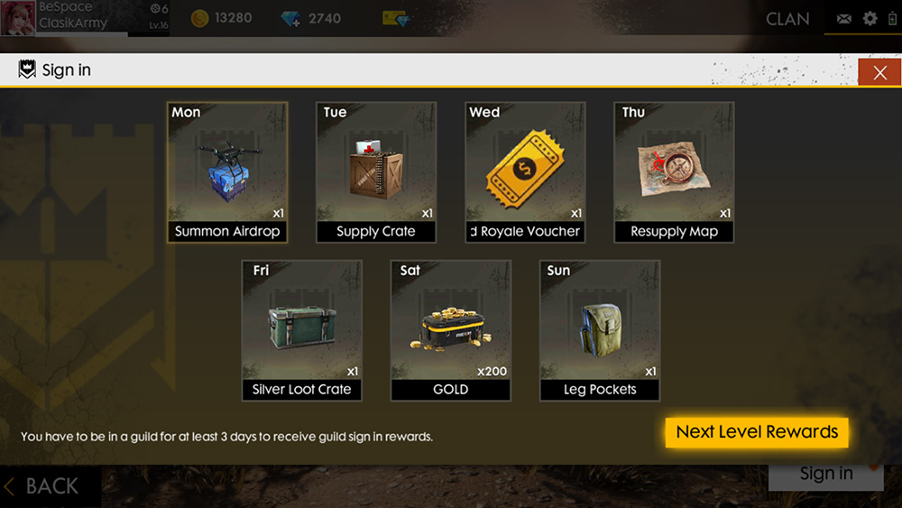

# Free Fire · Halloween Candy Rush（2018 年 10 月更新）

- 公告日期：2018-10-16
- 官方来源：[HALLOWEEN CANDY RUSH](https://ff.garena.com/en/article/186/)
- 审阅日期：2026-09-19
- 5 个分类小节；8 项说明及表格行；5 张官方公告插图。

主流程逐条核对官方正文并逐张查看全部正文图；图片内数值及适用限制单独标明。独立玩法与局外内容另列处置，未公布的时限和参数不补造。

公告日索引。

万圣节主题插画：南瓜头角色与女巫造型。原文：Features > Bermuda & Purgatory。[官方原图](https://cdn.wildflamestudio.com/common/web_event/official/b85b14c39dd302.jpg) · 1000×563。

## BR · 大逃杀

### 百慕大与炼狱万圣节覆盖

- 归属：BR · 大逃杀 / 活动覆盖
- 原文小节：Features > Bermuda & Purgatory
- 时间：公告未给活动终止日。

- 百慕大与炼狱加入南瓜灯、稻草人等万圣节主题地图元素。

## CS · 枪王对决

## 通用局内调整

### 候机岛夜间僵尸

- 归属：通用局内调整 / 活动覆盖
- 原文小节：Features > Starting Island
- 时间：公告日索引。

原文仅指候机岛。

候机岛夜景与万圣节南瓜装饰实机画面。原文：Features > Starting Island。[官方原图](https://cdn.wildflamestudio.com/common/web_event/official/02008e9541f703.jpg) · 1000×563。

- 候机岛加入夜间模式，等待起飞时僵尸持续出现。

### Caroline

- 归属：通用局内调整 / 常规调整
- 原文小节：Features > Characters - Caroline
- 时间：公告日索引；原文未提供技能说明。

原文只宣布角色可用，没有逐项标明适用模式或技能效果。

Caroline 官方角色插画。原文：Features > Characters - Caroline。[官方原图](https://cdn.wildflamestudio.com/common/web_event/official/35c359ef817804.jpg) · 1000×563。

- Caroline 可用；原文未说明技能或数值。

### 武器模型与淘汰播报

- 归属：通用局内调整 / 常规调整
- 原文小节：Features > Weapons
- 时间：公告日索引。

原文未单列模式。

- 更新 M249 和 M60 的模型。
- 使用传说级武器皮肤淘汰玩家时新增局内播报。

### 局内表情与高帧率选项

- 归属：通用局内调整 / 常规调整
- 原文小节：Features > Emotes / Miscellaneous
- 时间：公告日索引。

表情原文明确可在候机岛和对局中使用；帧率解锁适用于高 RAM 和性能较好的设备。

表情管理界面与角色动作预览。原文：Features > Emotes。[官方原图](https://cdn.wildflamestudio.com/common/web_event/official/4d7cf22a452a05.jpg) · 1000×563。

- 表情可购买和装备，并可在候机岛及对局中使用。
- 高 RAM 和性能较好的设备可解锁帧率以获得更高 FPS。
- 更新部分地图的本地化内容；原文未给出语言、具体文本或位置。

## 其他玩法与局外内容（目录摘要）

### 移动端自定义房开放预告

原文预告未来几周逐步向所有用户开放移动端创建自定义房的权限；没有公布具体日期和局内参数变化。

原文目录：Features > Custom Rooms

### 大厅、主题界面、商城与通行证

大厅持枪角色预览的待机动画更流畅；多处界面换为万圣节主题。商城重做分类与标签，Fire Pass 升级界面重做并加入地区徽章排行榜。

原文目录：Features > Weapons / Halloween! / Store / Fire Pass

### 公会签到与快捷邀请

公会增加随等级变化的签到奖励，以及邀请公会好友入队的快捷入口。同页公会截图注明：加入公会至少3天才能领取签到奖励。

原文目录：Features > Guild

### 榜单、好友、内置浏览器与其他显示

更新排行榜与排位奖励展示，榜单可查看玩家资料；好友列表增加上次在线时间，可快速复制用户ID。内置浏览器改为全屏并在使用时静音游戏；修正套装内物品动画，增加消息字数限制。

原文目录：Miscellaneous

## 其余原文配图

以下为尚未在上述小节内展示的原文图片，包括局外章节配图。

公会签到奖励界面，注明入会至少3天后可领取。原文：Features > Guild。[官方原图](https://cdn.wildflamestudio.com/common/web_event/official/5132eee50aaa07.jpg) · 1000×563。

## 官方图片索引

正文图片按相关小节展示，版本总览及其他章节插图另列；同一原图只嵌入一次。

- [万圣节主题插画：南瓜头角色与女巫造型](https://cdn.wildflamestudio.com/common/web_event/official/b85b14c39dd302.jpg) · 1000×563 · 本地 `assets/ff-patches/186-01.jpg`
- [候机岛夜景与万圣节南瓜装饰实机画面](https://cdn.wildflamestudio.com/common/web_event/official/02008e9541f703.jpg) · 1000×563 · 本地 `assets/ff-patches/186-02.jpg`
- [Caroline 官方角色插画](https://cdn.wildflamestudio.com/common/web_event/official/35c359ef817804.jpg) · 1000×563 · 本地 `assets/ff-patches/186-03.jpg`
- [表情管理界面与角色动作预览](https://cdn.wildflamestudio.com/common/web_event/official/4d7cf22a452a05.jpg) · 1000×563 · 本地 `assets/ff-patches/186-04.jpg`
- [公会签到奖励界面，注明入会至少3天后可领取](https://cdn.wildflamestudio.com/common/web_event/official/5132eee50aaa07.jpg) · 1000×563 · 本地 `assets/ff-patches/186-05.jpg`

## 原文目录（对照用）

- Features
