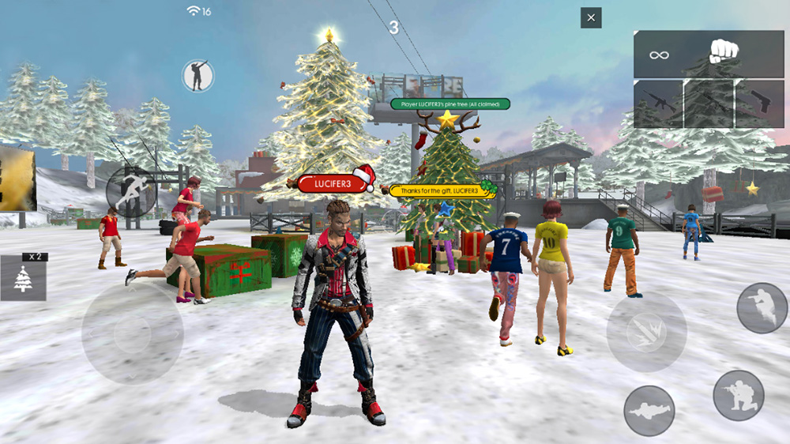
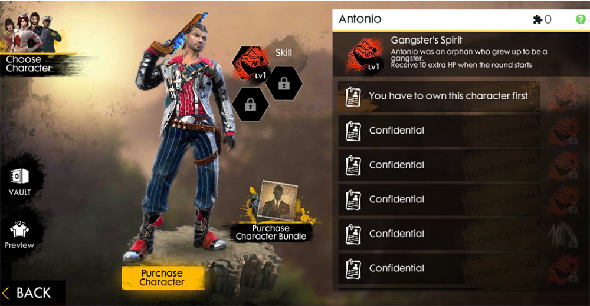
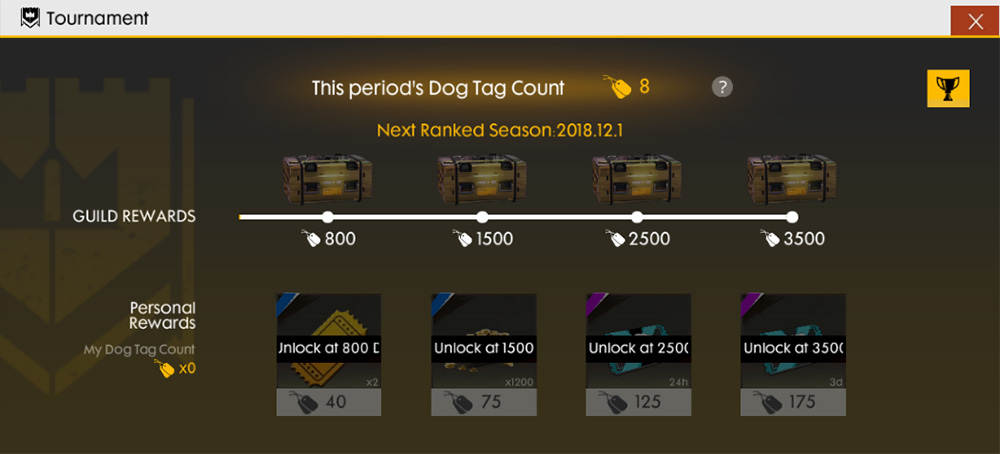
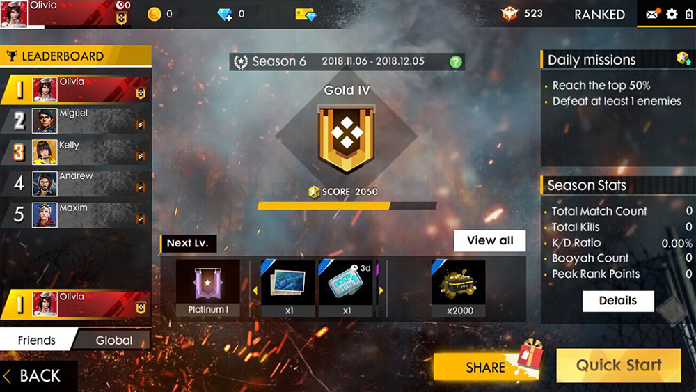
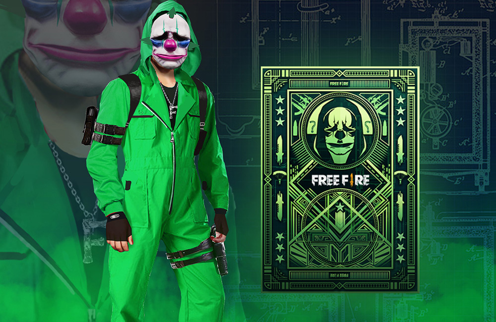

# Free Fire · Winterlands（2018 年 12 月更新）

- 公告日期：2018-12-05
- 官方来源：[WINTERLANDS](https://ff.garena.com/en/article/192/)
- 审阅日期：2026-09-19
- 7 个分类小节；11 项说明及表格行；7 张官方公告插图。

主流程逐条核对官方正文并逐张查看全部正文图；图片内数值及适用限制单独标明。独立玩法与局外内容另列处置，未公布的时限和参数不补造。

公告日索引。

## BR · 大逃杀

### 冬季地图覆盖

- 归属：BR · 大逃杀 / 活动覆盖
- 原文小节：Features > Winter and festive elements
- 时间：原文未给活动结束日。

属于当次冬季主题覆盖；不据此推定所有常规地图机制都限时。

冬季候机岛实机画面：积雪、节日树与礼物。原文：Features > Winter and festive elements。[官方原图](https://cdn.wildflamestudio.com/common/web_event/official/e8310e8d370e02.jpg) · 1000×562。

- 地图加入冬季与节庆装饰；同页截图展示积雪、节日树与礼物。

### 百慕大 Sentosa 新增4条滑索

- 归属：BR · 大逃杀 / 常规调整
- 原文小节：Features > Sentosa
- 时间：本项未单列生效日，按公告日索引；未说明移除时间或永久承诺。

- 百慕大 Sentosa 新增4条滑索，改善该区域的可达性；原文未列各条起终点。

## CS · 枪王对决

## 通用局内调整

### Antonio、技能槽与碎片

- 归属：通用局内调整 / 常规调整
- 原文小节：Features > New Character - Antonio / The 3rd skill slot / Additional fragments
- 时间：公告日索引。

原文未单列模式。

Antonio 官方角色插画。原文：Features > New Character - Antonio。[官方原图](https://cdn.wildflamestudio.com/common/web_event/official/1c912d799d5705.jpg) · 1000×563。

Antonio 一级技能与技能槽界面：开局额外10 HP。原文：Features > The 3rd skill slot。[官方原图](https://cdn.wildflamestudio.com/common/web_event/official/e80d119362a106.jpg) · 1000×520。

- 新增 Antonio，开局获得额外生命值。依据同页角色界面配图，一级 Gangster’s Spirit 的效果为额外10 HP；其他等级数值未给出。
- 第3技能槽可解锁。
- 根据已装备技能获得额外碎片，数量未说明。

### 4级防弹衣与烟雾桶

- 归属：通用局内调整 / 常规调整
- 原文小节：Features > Vests / Smoke barrels
- 时间：公告日索引。

原文未单列模式或地图，按通用局内条目记录。

- 背心可升级至4级，提升保护和耐久。
- 烟雾桶加入对局；被摧毁时产生烟雾以遮蔽踪迹。

### 候机岛雪球形态

- 归属：通用局内调整 / 活动覆盖
- 原文小节：Features > Starting island snowball
- 时间：公告日索引。

原文明确限定候机岛；按冬季主题交互记录。

- 候机岛可以变身为巨型雪球；正文未说明进入对局后是否保留，也未给战斗参数。

### M249 对可破坏目标伤害

- 归属：通用局内调整 / 常规调整
- 原文小节：Miscellaneous
- 时间：公告日索引。

原文未单列模式。

- M249 对载具、冰墙和桶的伤害提高50%。

### 物品局内特效与实时阴影

- 归属：通用局内调整 / 常规调整
- 原文小节：Features > Rare items / Miscellaneous
- 时间：本项未单列日期，按公告日索引。

原文未按模式区分；实时阴影只说明部分设备支持，未列设备或性能数据。

- 稀有物品新增局内特效；全屏动画的播放场景未明确，另列在外观附录。
- 部分设备可显示更多实时阴影。

## 其他玩法与局外内容（目录摘要）

### 冬季界面与音乐

大厅、游戏界面和应用图标加入节日元素，背景音乐也作调整；原文没有细分音乐的播放场景。

原文目录：Features > Winter and festive elements

### 公会赛事与排位界面

每周公会赛累计狗牌，个人与公会按数量领取奖励。排位页面重做，加入每日任务和排位代币商店。截图中的2018-12-01及第6赛季2018-11-06至12-05是界面示例日期，不作为本篇补丁生效日期。

原文目录：Features > Guild Tournaments / Ranked mode revamp

### 稀有物品动画、兑换及外观系统

稀有物品新增全屏动画和特效，未明确播放场景。魔方可从幸运抽奖获得并兑换奖励；Workshop 支持用进化石重制物品。礼品店改版，聊天增加表情，幸运卡更新卡背与奖品。

原文目录：Features > Rare items / Magic Cube / Workshop / Gift shop / Lucky card

### 其他外观展示与界面提醒

部分武器皮肤可在大厅看到并仅带入候机岛；增加免费 Gold Royale 抽奖提醒和 Fire Pass 视频按钮。

原文目录：Miscellaneous

## 其余原文配图

以下为尚未在上述小节内展示的原文图片，包括局外章节配图。

公会赛事狗牌与奖励界面；所示日期为界面示例。原文：Features > Guild Tournaments。[官方原图](https://cdn.wildflamestudio.com/common/web_event/official/cca38e95a37003.jpg) · 1000×454。

排位界面、每日任务及战绩；所示第6赛季日期为界面示例。原文：Features > Ranked mode revamp。[官方原图](https://cdn.wildflamestudio.com/common/web_event/official/90c3d1cc84ac04.jpg) · 1000×563。

Workshop 进化石与角色外观宣传图。原文：Features > Workshop。[官方原图](https://cdn.wildflamestudio.com/common/web_event/official/80c2a5d53f0107.jpg) · 1000×563。

幸运卡卡背与奖品角色外观宣传图。原文：Features > Lucky card - new prizes。[官方原图](https://cdn.wildflamestudio.com/common/web_event/official/851036aedb3a08.jpg) · 1000×650。

## 官方图片索引

正文图片按相关小节展示，版本总览及其他章节插图另列；同一原图只嵌入一次。

- [冬季候机岛实机画面：积雪、节日树与礼物](https://cdn.wildflamestudio.com/common/web_event/official/e8310e8d370e02.jpg) · 1000×562 · 本地 `assets/ff-patches/192-01.jpg`
- [公会赛事狗牌与奖励界面；所示日期为界面示例](https://cdn.wildflamestudio.com/common/web_event/official/cca38e95a37003.jpg) · 1000×454 · 本地 `assets/ff-patches/192-02.jpg`
- [排位界面、每日任务及战绩；所示第6赛季日期为界面示例](https://cdn.wildflamestudio.com/common/web_event/official/90c3d1cc84ac04.jpg) · 1000×563 · 本地 `assets/ff-patches/192-03.jpg`
- [Antonio 官方角色插画](https://cdn.wildflamestudio.com/common/web_event/official/1c912d799d5705.jpg) · 1000×563 · 本地 `assets/ff-patches/192-04.jpg`
- [Antonio 一级技能与技能槽界面：开局额外10 HP](https://cdn.wildflamestudio.com/common/web_event/official/e80d119362a106.jpg) · 1000×520 · 本地 `assets/ff-patches/192-05.jpg`
- [Workshop 进化石与角色外观宣传图](https://cdn.wildflamestudio.com/common/web_event/official/80c2a5d53f0107.jpg) · 1000×563 · 本地 `assets/ff-patches/192-06.jpg`
- [幸运卡卡背与奖品角色外观宣传图](https://cdn.wildflamestudio.com/common/web_event/official/851036aedb3a08.jpg) · 1000×650 · 本地 `assets/ff-patches/192-07.jpg`

## 原文目录（对照用）

- Features
- Miscellaneous
