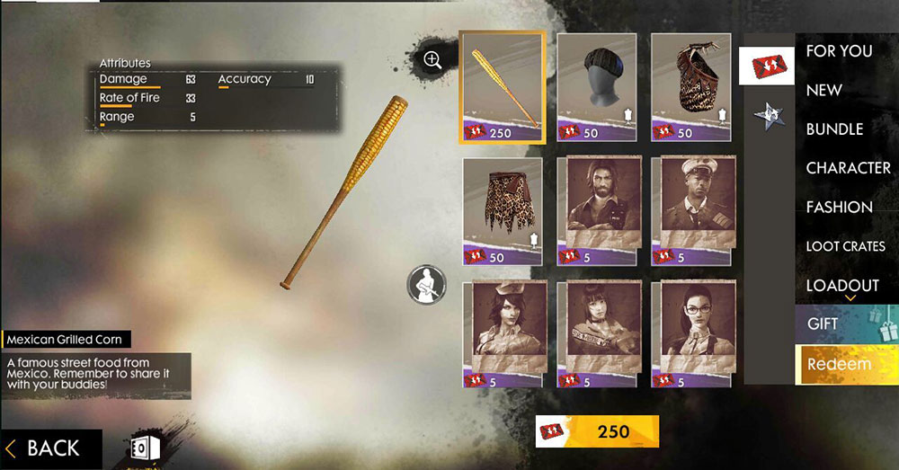

# Free Fire · 2018 年 9 月更新

- 公告日期：2018-09-12
- 官方来源：[NEW UPDATE:NEW CHARACTER, NEW VEHICLE,NEW WEAPON](https://ff.garena.com/en/article/198/)
- 审阅日期：2026-09-19
- 6 个分类小节；9 项说明及表格行；3 张官方公告插图。

本篇 BR 与通用局内更新按官方正文整理；本公告未列 CS 专属内容。独立玩法与局外内容保留目录处置，未公开的细节明确标注为未说明。

版本节点采用公告日期；原文未单列具体实装时间时保留未知。记录历史版本变化，不代表当前规则。

## BR · 大逃杀

### 百慕大机场、炼狱建筑与物资

- 归属：BR · 大逃杀 / 常规调整
- 原文小节：New Content
- 时间：正文未单列该项实装时刻；以公告日期索引。

- 重做百慕大机场区域。
- 优化炼狱与百慕大的物资和建筑分布。

### 篝火每秒恢复

- 归属：BR · 大逃杀 / 常规调整
- 原文小节：Improvements and fixes
- 时间：正文未单列该项实装时刻；以公告日期索引。

- 篝火以每秒 10 的速度为自己和队友恢复 EP 与 HP。

### 冰墙防护与扫描器飞行路线

- 归属：BR · 大逃杀 / 常规调整
- 原文小节：Improvements and fixes
- 时间：正文未单列该项实装时刻；以公告日期索引。

- 冰墙可从更多角度保护使用者。
- 扫描器在跳机后仍显示飞机航线。

## CS · 枪王对决

## 通用局内调整

### Miguel 角色

- 归属：通用局内调整 / 常规调整
- 原文小节：New Content
- 时间：正文未单列该项实装时刻；以公告日期索引。

通用调整的适用范围未逐模式列出；该公告未提供 CS 专属说明。

Miguel 新角色官方图。原文：New Content。[官方原图](https://cdn.wildflamestudio.com/common/web_event/official/f73538cd71ed02.jpg) · 1000×563。

- 新增 Miguel 角色；正文未在此页给出技能效果或数值。

### 战备限时无限使用卡

- 归属：通用局内调整 / 常规调整
- 原文小节：New Content
- 时间：原文未单列此项生效时刻；按公告日期索引，不据此推定当前仍保留。

通用调整的适用范围未逐模式列出；该公告未提供 CS 专属说明。

- 新增战备使用卡（Loadout Playcards）：在指定期限内不限次数使用战备。
- 公告未列有效天数、适用战备清单或获取条件；使用次数无限不等于永久有效。

### 局内徽章播报

- 归属：通用局内调整 / 常规调整
- 原文小节：Improvements and fixes
- 时间：原文未单列此项生效时刻；按公告日期索引，不据此推定当前仍保留。

通用调整的适用范围未逐模式列出；该公告未提供 CS 专属说明。

- 对局中播报徽章数量最多的玩家；原文未说明播报时机、次数或是否暴露坐标。

## 其他玩法与局外内容（目录摘要）

### 独立玩法、局外内容与未明确范围事项

Solo Death Race 属独立玩法；赠礼、赛后限时特惠、重复物品换代币/星星与对局奖励星星、兑换商店及仓库/活动/公告 UI 属局外进度。战备使用卡影响可用战备，局内徽章播报影响对局信息，已单独记录。

原文目录：New Content / Improvements and fixes

## 其余原文配图

以下为尚未在上述小节内展示的原文图片，包括局外章节配图。

赛后特惠界面图。原文：赛后特惠。[官方原图](https://cdn.wildflamestudio.com/common/web_event/official/1b51bc208baa03.jpg) · 1000×568。

兑换商店界面图。原文：兑换商店。[官方原图](https://cdn.wildflamestudio.com/common/web_event/official/9f5a9878ef1304.jpg) · 1000×523。

## 官方图片索引

正文图片按相关小节展示，版本总览及其他章节插图另列；同一原图只嵌入一次。

- [Miguel 新角色官方图](https://cdn.wildflamestudio.com/common/web_event/official/f73538cd71ed02.jpg) · 1000×563 · 本地 `assets/ff-patches/198-01.jpg`
- [赛后特惠界面图](https://cdn.wildflamestudio.com/common/web_event/official/1b51bc208baa03.jpg) · 1000×568 · 本地 `assets/ff-patches/198-02.jpg`
- [兑换商店界面图](https://cdn.wildflamestudio.com/common/web_event/official/9f5a9878ef1304.jpg) · 1000×523 · 本地 `assets/ff-patches/198-03.jpg`

## 原文目录（对照用）

- New Content
- Improvements and fixes
