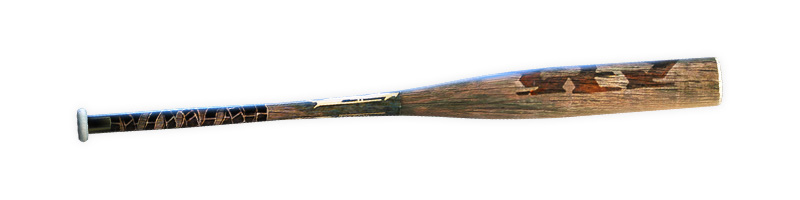

# Free Fire · 2018 年 7 月更新

- 公告日期：2018-07-26
- 官方来源：[NEW CHARACTER, NEW AIRDROP VEHICLE](https://ff.garena.com/en/article/204/)
- 审阅日期：2026-09-19
- 5 个分类小节；7 项说明及表格行；3 张官方公告插图。

本篇 BR 与通用局内更新按官方正文整理；本公告未列 CS 专属内容。独立玩法与局外内容保留目录处置，未公开的细节明确标注为未说明。

版本节点采用公告日期；原文未单列具体实装时间时保留未知。记录历史版本变化，不代表当前规则。

## BR · 大逃杀

### 空投怪兽卡车

- 归属：BR · 大逃杀 / 常规调整
- 原文小节：New Content
- 时间：正文未单列该项实装时刻；以公告日期索引。

空投怪兽卡车官方图。原文：New Content。[官方原图](https://cdn.wildflamestudio.com/common/web_event/official/808d77a3889e02.jpg) · 800×450。

- 新增怪兽卡车，只会在空投中出现。

### 冰墙与球棒

- 归属：BR · 大逃杀 / 常规调整
- 原文小节：New Content
- 时间：正文未单列该项实装时刻；以公告日期索引。

球棒近战武器官方图。原文：New Content。[官方原图](https://cdn.wildflamestudio.com/common/web_event/official/2eb4143d812704.jpg) · 800×200。

- 新增冰墙（Gloo Wall），可即时建造临时掩体。
- 新增近战球棒。

### 危险区伤害递增

- 归属：BR · 大逃杀 / 常规调整
- 原文小节：Fixes and Improvements
- 时间：正文未单列该项实装时刻；以公告日期索引。

- 调整安全区外伤害：在危险区停留越久，受到的伤害越高。

## CS · 枪王对决

## 通用局内调整

### Paloma 角色

- 归属：通用局内调整 / 常规调整
- 原文小节：New Content
- 时间：正文未单列该项实装时刻；以公告日期索引。

通用调整的适用范围未逐模式列出；该公告未提供 CS 专属说明。

Paloma 新角色官方图。原文：New Content。[官方原图](https://cdn.wildflamestudio.com/common/web_event/official/37217218ed4e03.jpg) · 800×450。

- 新增 Paloma 角色；正文未在此页给出技能效果或数值。

### 自动拾取与小队 HUD

- 归属：通用局内调整 / 常规调整
- 原文小节：Fixes and Improvements
- 时间：正文未单列该项实装时刻；以公告日期索引。

通用调整的适用范围未逐模式列出；该公告未提供 CS 专属说明。

- 实现部分道具的自动拾取，设置中可开关。
- 改进小队局内 HUD。

## 其他玩法与局外内容（目录摘要）

### 独立玩法、局外内容与未明确范围事项

赠礼、扩展个人资料、观战点赞及个人页统计、月卡/周卡、幸运转盘概率进度与中奖昵称广播、Elite Pass 加 50 徽章礼包属于局外进度/社交。

原文目录：New Content / Fixes and Improvements

## 官方图片索引

正文图片按相关小节展示，版本总览及其他章节插图另列；同一原图只嵌入一次。

- [空投怪兽卡车官方图](https://cdn.wildflamestudio.com/common/web_event/official/808d77a3889e02.jpg) · 800×450 · 本地 `assets/ff-patches/204-01.jpg`
- [Paloma 新角色官方图](https://cdn.wildflamestudio.com/common/web_event/official/37217218ed4e03.jpg) · 800×450 · 本地 `assets/ff-patches/204-02.jpg`
- [球棒近战武器官方图](https://cdn.wildflamestudio.com/common/web_event/official/2eb4143d812704.jpg) · 800×200 · 本地 `assets/ff-patches/204-03.jpg`

## 原文目录（对照用）

- New Content
- Fixes and Improvements
