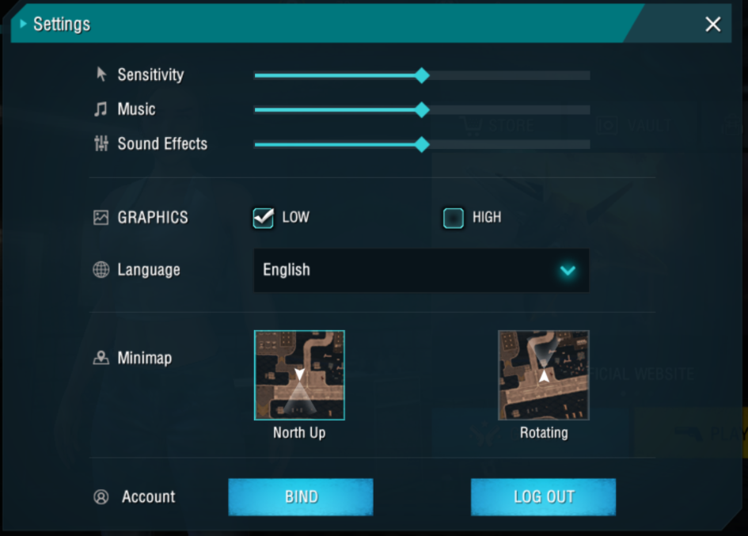

# Free Fire · 1.2.17

- 公告日期：2017-11-04
- 官方来源：[PATCH UPDATE 1.2.17](https://ff.garena.com/en/article/22/)
- 审阅日期：2026-09-19
- 1 个分类小节；2 项说明及表格行；1 张官方公告插图。

全文复核后改正此前的局外排除：设置入口位于大厅，但画质档位改变游戏运行体验，列为操作与体验优化；不宣称新增玩法或性能提升幅度。

2017-11-04 官方公告称已发布 1.2.17；没有给精确生效时刻。

## BR · 大逃杀

## CS · 枪王对决

## 通用局内调整

### Android 低画质选项

- 归属：通用局内调整 / 常规调整
- 原文小节：PATCH UPDATE 1.2.17（正文未分小节）
- 时间：2017-11-04 官方公告称已发布 1.2.17；没有给精确生效时刻。

面向部分 Android 设备的运行表现；原文未按模式区分。设置入口在大厅不改变其服务于对局画质和性能的用途。

1.2.17 官方设置截图：Graphics 低画质选项。原文：PATCH UPDATE 1.2.17 > Graphics 设置截图。[官方原图](http://freefiremobile-a.akamaihd.net/ffwebsite/uploadfile/2017/1104/20171104051454154.png) · 945×677。

- 1.2.17 增加降低画质的选项，用于缓解部分 Android 设备的性能问题；官方没有公布帧率、延迟或提升百分比。
- 在大厅打开设置，在 Graphics（画质）项选择 Low（低）；同页配图展示该开关位置。

## 其他玩法与局外内容（目录摘要）

## 官方图片索引

正文图片按相关小节展示，版本总览及其他章节插图另列；同一原图只嵌入一次。

- [1.2.17 官方设置截图：Graphics 低画质选项](http://freefiremobile-a.akamaihd.net/ffwebsite/uploadfile/2017/1104/20171104051454154.png) · 945×677 · 本地 `assets/ff-patches/22-01.png`

## 原文目录（对照用）

- PATCH UPDATE 1.2.17
