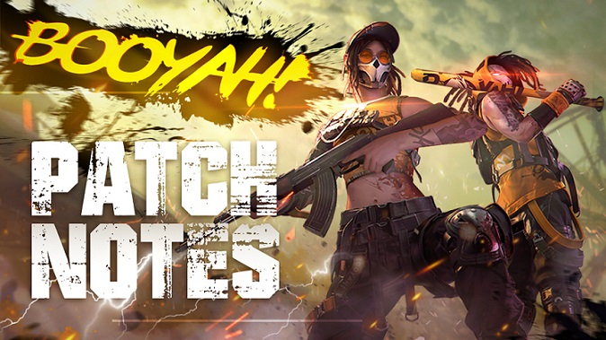

# Free Fire · OB24 · BOOYAH DAY（2020 年 9 月补丁）

- 公告日期：2020-09-23
- 官方来源：[PATCH NOTES: BOOYAH DAY](https://ff.garena.com/en/article/322/)
- 审阅日期：2026-09-19
- 8 个分类小节；24 项说明及表格行；1 张官方公告插图。

逐项对照本篇官方正文复核，包括局内操作配置、载具模型及技能修复。唯一正文图为补丁主题图，直接展示；独立玩法与局外结算另列处置。

公告日为 2020-09-23；CS Season 3 于 09/24 17:00 SGT。

BOOYAH DAY 补丁总览图。原文：PATCH NOTES: BOOYAH DAY。[官方原图](http://dl.dir.freefiremobile.com/common/web_event/officialwebsite/news/OB24_pn.jpg) · 674×379。

## BR · 大逃杀

## CS · 枪王对决

### CS 第三赛季商店与购买音效

- 归属：CS · 枪王对决 / 常规调整
- 原文小节：Clash Squad
- 时间：Season 3 于 2020-09-24 17:00 SGT 开始。

- CS 商店调整；原文未列具体商品或价格变化。
- 购买蘑菇和倒地自救包（Horizaline，说明性译名）时新增音效。

## 通用局内调整

### PARAFAL 与手雷机制

- 归属：通用局内调整 / 常规调整
- 原文小节：Weapon and Balance
- 时间：PARAFAL 原文称 after the patch 可用，未给日期。

PARAFAL 明确适用 Classic 与 CS；手雷未单列模式。

- PARAFAL 在经典 BR 与 CS 提供：伤害参数 48、弹匣 30 发、射速参数 0.245；原文未给射速单位。可装枪口、枪托、弹匣、握把和瞄具。
- 手雷投射显示调整为匹配实际投掷距离。
- 允许投掷前预热手雷，以缩短投出后的引爆时间；过晚投掷也可能在手中爆炸，原文未给预热上限秒数。

### P90、M14、PLASMA 与 Kar98k 配件调整

- 归属：通用局内调整 / 常规调整
- 原文小节：Weapon and Balance
- 时间：公告日索引。

原文未逐项标明模式。

- P90 射速+3%、最大扩散-10%。
- M14 伤害58→59、最低伤害30→25。
- M14 狂怒核心配件（Rage Core，说明性译名）射速 -11%。
- PLASMA 精准射击4→6、移动时扩散-11%。
- Kar98k 生物识别瞄具（Biometric Scope，说明性译名）的辅助瞄准半径 -35%。

### 滑翔机与扫描

- 归属：通用局内调整 / 常规调整
- 原文小节：Weapon and Balance > Glider / Scan
- 时间：公告日索引。

原文未单列模式。

- 滑翔机最大飞行高度参数 38→14；原文未标单位。
- 扫描会在地图上揭示载具。

### Jai 与 Clu 技能

- 归属：通用局内调整 / 常规调整
- 原文小节：Characters
- 时间：公告日索引。

原文未单列模式。

- Jai 装填容量回复10/13/16/19/22/25%→30/33/36/39/42/45%。
- Jai 技能适用武器从突击步枪、手枪、冲锋枪扩展为同时支持霰弹枪。
- 修复 Clu 启用技能时向敌人暴露自身位置的问题；不表示角色模型获得隐身能力。

### The Arena 候机岛

- 归属：通用局内调整 / 常规调整
- 原文小节：Gamemode > The Arena
- 时间：公告日索引。

原文写明 Available in Classic and Rank Mode。

- Classic 与 Rank Mode 的候机岛更换为 The Arena。

### BR 与 CS Classic 队友助跳

- 归属：通用局内调整 / 常规调整
- 原文小节：Gameplay > Team Boost
- 时间：公告日索引。

原文写明 Available in Battle Royale and Clash Squad Classic。

- 在 BR 与 CS 休闲模式中，可从蹲伏队友身上起跳以跳得更高；提供助跳的队友需要在地面保持静止。

### 背包排序与局内操作修复

- 归属：通用局内调整 / 常规调整
- 原文小节：System / Bug Fix and Optimizations
- 时间：公告日索引。

背包排序明确 all Modes；其余未单列模式。

- 所有模式可在局内整理背包。
- 冰墙不再推挤玩家模型。
- 蘑菇可被标记。
- 观战或死亡时可打开设置菜单。
- 优化局内主动技能显示。
- 设置菜单支持向 Free Fire 云端上传、下载和覆盖操作设置与 HUD 配置，便于恢复原有局内布局。
- 优化 Jeep 载具模型；没有给出速度、碰撞或性能变化。

## 其他玩法与局外内容（目录摘要）

### Flamethrower 与 Training Ground 更新

火焰喷射器仅在训练场提供：伤害参数 15、最低伤害 10、射程参数 4、射速参数 0.06，不可换弹；射程和射速未标单位。训练场社交区改为相近出生，载具增加复位和喇叭，两栖摩托可用氮气和跳跃；另有 Target Arcade 小游戏及私人影院。

原文目录：Weapon and Balance / Gamemode > Training Ground

### 军械库与近战模式 MVP 展示

大厅军械库独立为新页，调整排序、增加武器皮肤 360 度预览与截图分享，商店军械库筛选优化。近战模式调整胜负双方 MVP 展示。

原文目录：System / Bug Fix and Optimizations

### CS 第三赛季奖励及段位结算

达到黄金 III 及以上可获 Golden FAMAS。断线后重新加入并赢得此前离开的对局不再掉星；白金段位后获得的段位保护积分减少。

原文目录：Clash Squad > Rank Season 3

## 官方图片索引

正文图片按相关小节展示，版本总览及其他章节插图另列；同一原图只嵌入一次。

- [BOOYAH DAY 补丁总览图](http://dl.dir.freefiremobile.com/common/web_event/officialwebsite/news/OB24_pn.jpg) · 674×379 · 本地 `assets/ff-patches/322-01.jpg`

## 原文目录（对照用）

- Clash Squad
- Weapon and Balance
- Characters
- Gamemode
- Gameplay
- System
- Bug Fix and Optimizations
