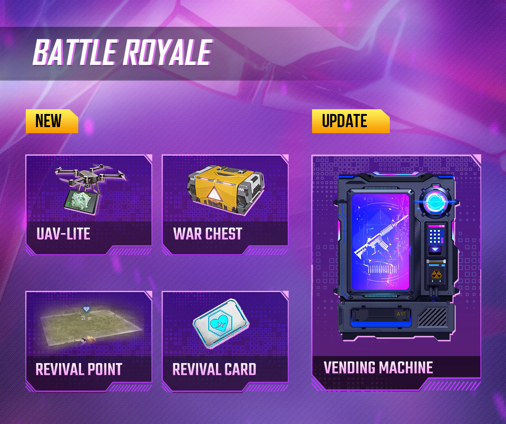
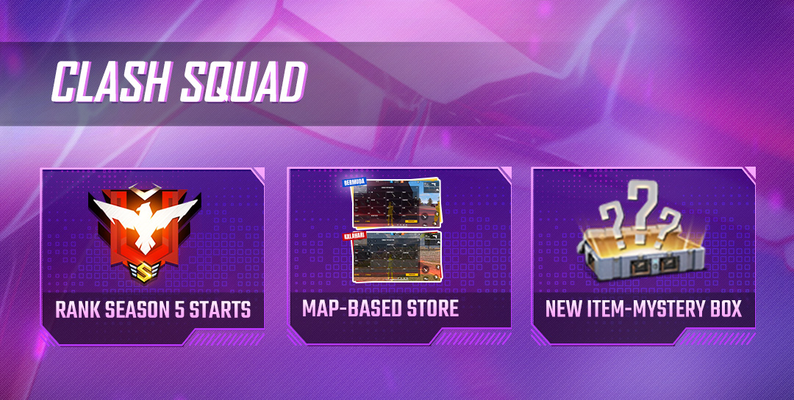
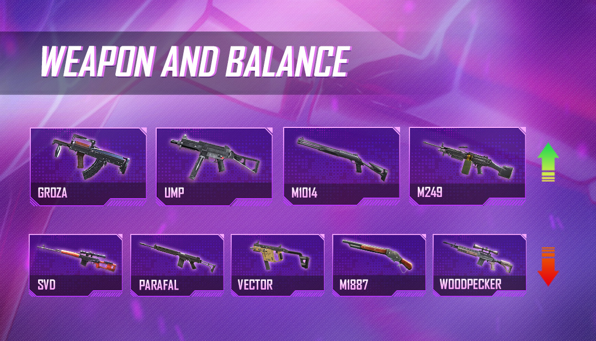
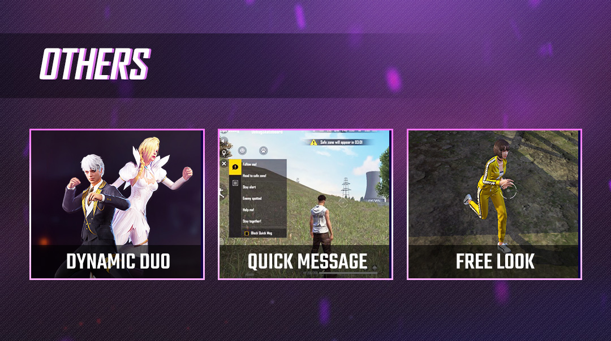
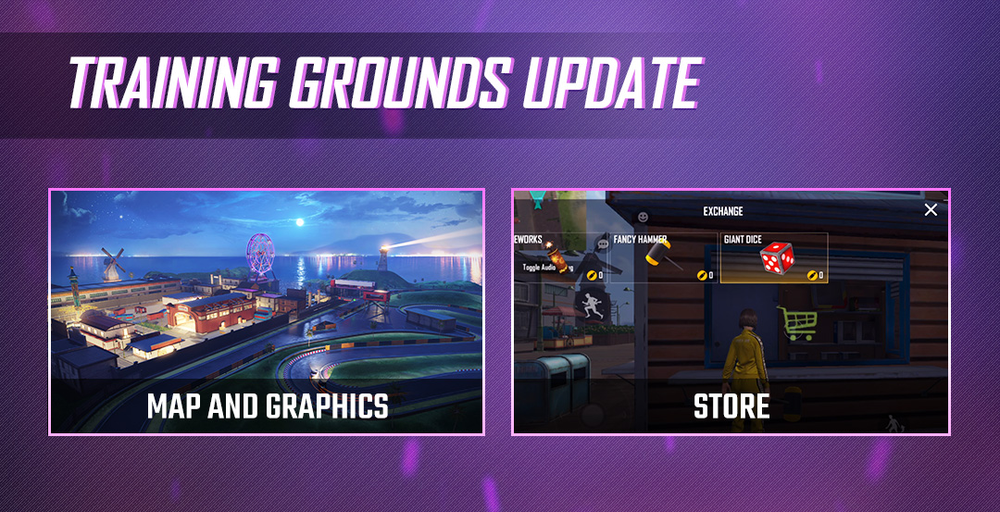

# Free Fire · OB26 · Project Cobra（2021 年 2 月补丁）

- 公告日期：2021-02-04
- 官方来源：[PATCH NOTE: PROJECT COBRA](https://ff.garena.com/en/article/351/)
- 审阅日期：2026-09-19
- 29 个分类小节；64 项说明及表格行；5 张官方公告插图。

主流程逐项对照完整正文与HTML，复核全部5张官方正文图。BR、CS和通用更新分线记录；训练场、排位奖励、社交与账号功能另列处置，不称整篇逐项全译。

公告日：2021-02-04；正文未列本次补丁统一实际生效时间。

## BR · 大逃杀

### 经典 BR 自动售货机的代币与价格

- 归属：BR · 大逃杀 / 常规调整
- 原文小节：Battle Royale > Vending Machine Update
- 时间：公告日：2021-02-04；正文未列本次补丁统一实际生效时间。

原文将本项列为 Battle Royale，且明确 Classic Casual & Ranked。

BR更新总览：个人无人机、战利品箱、复活点、复活卡与售货机。原文：Battle Royale。[官方原图](https://cdn.wildflamestudio.com/common/web_event/officialwebsite/news/OB26/1.jpg) · 1080×904。

- Classic 的 Casual 与 Ranked 调整售货机商品价格；官方称将按物品性能调整，未列各物品价格。
- 增加地图上的代币数量，具体增量、地图和刷新规则未说明。
- UAV-Lite 加入售货机。

### UAV-Lite 个人无人机扫描

- 归属：BR · 大逃杀 / 常规调整
- 原文小节：Battle Royale > New Item - UAV-Lite
- 时间：公告日：2021-02-04；正文未列本次补丁统一实际生效时间。

原文明确 Classic Casual & Ranked。

- UAV-Lite（Personal UAV）在 Classic Casual 与 Ranked 提供。
- UAV-Lite 可扫描周围是否有敌人；官方建议在移动前作为无人机确认小队安全，未说明扫描距离、时长、冷却或暴露风险。

### 新增战利品箱 War Chest

- 归属：BR · 大逃杀 / 常规调整
- 原文小节：Battle Royale > New Item - War Chest
- 时间：公告日：2021-02-04；正文未列本次补丁统一实际生效时间。

原文明确适用 Classic Casual 与 Ranked。

- 战利品箱（War Chest，说明性译名）加入经典BR休闲与排位模式。
- War Chest 放置于若干地点，帮助玩家在室外区域寻找和定位战利品；具体地点、数量与物资表未说明。

### 新增全队复活点

- 归属：BR · 大逃杀 / 常规调整
- 原文小节：Battle Royale > New System - Revival Point
- 时间：公告日：2021-02-04；正文未列本次补丁统一实际生效时间。

原文明确 Classic Casual。

- 复活点（Revival Point）仅在经典BR休闲模式提供。
- 占领并激活复活点可让整支小队复活。
- 复活点位于掩体较少的位置。
- 激活 Revival Point 时会向附近敌人发出信号；信号范围、占领时长和复活条件未说明。

### 新增售货机复活卡

- 归属：BR · 大逃杀 / 常规调整
- 原文小节：Battle Royale > New Item - Revival Card
- 时间：公告日：2021-02-04；正文未列本次补丁统一实际生效时间。

原文明确 Classic Casual。

- 复活卡（Revival Card）仅在经典BR休闲模式提供，可从售货机购买。
- 队友购买 Revival Card 后，玩家可重新部署至战场。
- 只要队伍至少有 1 名成员仍站立，就有机会使用此返场机制。
- 返场机会在最终安全区出现前提供；具体安全区阶段、价格与返场装备未说明。

### FF Knife 投掷刀

- 归属：BR · 大逃杀 / 常规调整
- 原文小节：Weapon and Balance > FF Knife
- 时间：公告日：2021-02-04；正文未列本次补丁统一实际生效时间。

“0.5”未说明单位。

- FF Knife 加入 Classic Casual 与 Ranked。
- FF Knife 基础伤害 50、弹药 3、射速 0.5、护甲穿透 100%。

### 经典 BR 载具鸣笛

- 归属：BR · 大逃杀 / 常规调整
- 原文小节：Optimizations
- 时间：公告日：2021-02-04；正文未列本次补丁统一实际生效时间。

原文明确 Classic Mode。

- Classic Mode 的载具可以鸣笛。

### 跳伞时显示地图标记

- 归属：BR · 大逃杀 / 常规调整
- 原文小节：Optimizations
- 时间：公告日：2021-02-04；正文未列本次补丁统一实际生效时间。

原文未列具体队列；跳伞阶段按 BR 记录。

- 跳伞期间在地图上显示局内标记（in-game markers）。

### FAMAS-X 加入 Classic

- 归属：BR · 大逃杀 / 常规调整
- 原文小节：Optimizations
- 时间：公告日：2021-02-04；正文未列本次补丁统一实际生效时间。

原文未细分 Casual/Ranked。

- FAMAS-X 加入 Classic Mode。

## CS · 枪王对决

### CS 地图分组商店

- 归属：CS · 枪王对决 / 常规调整
- 原文小节：Clash Squad > Map-Based Store
- 时间：公告日：2021-02-04；正文未列本次补丁统一实际生效时间。

适用 Clash Squad；原文未给出商品、价格或每局经济规则。

CS更新总览：第5排位赛季、地图分组商店与神秘箱。原文：Clash Squad。[官方原图](https://cdn.wildflamestudio.com/common/web_event/officialwebsite/news/OB26/5.jpg) · 1080×545。

- Clash Squad Season 5 按地图启用不同的商店组；官方称此举会使更多武器可在 Clash Squad 使用。
- Bermuda 与 Bermuda Remastered 使用同一套商店。
- Kalahari 使用另一套商店。

### CS休闲加入三选一神秘箱

- 归属：CS · 枪王对决 / 常规调整
- 原文小节：Clash Squad > New Item - Mystery Box
- 时间：公告日：2021-02-04；正文未列本次补丁统一实际生效时间。

原文明确 Clash Squad Casual，未扩展到 CS 排位。

- 神秘箱（Mystery Box，说明性译名）仅在CS休闲模式提供。
- Mystery Box 的设计意图是给落后队伍翻盘机会；原文未说明购买资格只限于落后方。
- 每个 Mystery Box 提供 3 件物品。
- 购买者从 3 件物品中选择 1 件带入战斗；物品池、价格和落后判定未说明。

### CS 记分板队友战斗状态

- 归属：CS · 枪王对决 / 常规调整
- 原文小节：Optimizations
- 时间：公告日：2021-02-04；正文未列本次补丁统一实际生效时间。

原文明确 Clash Squad。

- Clash Squad 记分板显示队友战斗状态。

## 通用局内调整

### MAG-7 属性

- 归属：通用局内调整 / 常规调整
- 原文小节：Weapon and Balance > New Weapon - MAG-7
- 时间：公告日：2021-02-04；正文未列本次补丁统一实际生效时间。

原文明确 Classic & Clash Squad；“0.2”未说明单位。

- MAG-7 加入 Classic 与 Clash Squad，是一把高射速霰弹枪；基础伤害 20、弹匣 8、射速 0.2，可装握把与枪托。

### Vector 双持射程、精度与伤害调整

- 归属：通用局内调整 / 常规调整
- 原文小节：Weapon and Balance > Vector
- 时间：公告日：2021-02-04；正文未列本次补丁统一实际生效时间。

原文未单列模式；最大射程−4未注明单位，不是−4%。

武器平衡总览：九把武器的调整方向。原文：Weapon and Balance。[官方原图](https://cdn.wildflamestudio.com/common/web_event/officialwebsite/news/OB26/3.jpg) · 1080×618。

- Vector 最低伤害 -1。
- 双持 Vector 最大射程 -4。
- 双持 Vector 精度 -18%。

### M1014 伤害、射速与开火音效

- 归属：通用局内调整 / 常规调整
- 原文小节：Weapon and Balance > M1014
- 时间：公告日：2021-02-04；正文未列本次补丁统一实际生效时间。

原文未单列模式。

- M1014 加入新的开火音效。
- M1014 最低伤害 +3。
- M1014 射速 +5%。

### M1887 射程下调

- 归属：通用局内调整 / 常规调整
- 原文小节：Weapon and Balance > M1887
- 时间：公告日：2021-02-04；正文未列本次补丁统一实际生效时间。

原文未单列模式。

- M1887 最大射程 -3%。

### PARAFAL 后坐、射程与弹匣槽调整

- 归属：通用局内调整 / 常规调整
- 原文小节：Weapon and Balance > PARAFAL
- 时间：公告日：2021-02-04；正文未列本次补丁统一实际生效时间。

正文称将提高稳定性（giving it more stability），但明细写后坐力+9%。这里保留两者差异，未据说明文字反转数值方向。

- PARAFAL 后坐力 +9%。
- PARAFAL 最大射程 -15%。
- 移除 PARAFAL 弹匣配件槽。

### Woodpecker 射速降低并移除弹匣槽

- 归属：通用局内调整 / 常规调整
- 原文小节：Weapon and Balance > Woodpecker
- 时间：公告日：2021-02-04；正文未列本次补丁统一实际生效时间。

原文未单列模式。

- Woodpecker 射速 -8%。
- 移除 Woodpecker 弹匣配件槽。

### UMP 伤害与穿甲加强

- 归属：通用局内调整 / 常规调整
- 原文小节：Weapon and Balance > UMP
- 时间：公告日：2021-02-04；正文未列本次补丁统一实际生效时间。

原文未单列模式。

- UMP 护甲穿透 +5%；正文说明目标为 30%，但未直接列出改前数值。
- UMP 最低伤害 +1。

### M249 开火移动速度、射程与移动精度

- 归属：通用局内调整 / 常规调整
- 原文小节：Weapon and Balance > M249
- 时间：公告日：2021-02-04；正文未列本次补丁统一实际生效时间。

“最低射程”按原文 Minimum Range 直译，未说明该属性的精确计算。

- M249 开火时移动速度 +10%。
- M249 最低射程 +4%。
- M249 移动时精度 -4%。

### SVD 射速与躯干额外伤害下调

- 归属：通用局内调整 / 常规调整
- 原文小节：Weapon and Balance > SVD
- 时间：公告日：2021-02-04；正文未列本次补丁统一实际生效时间。

原文未单列模式。

- SVD 射速 -9%。
- SVD 对躯干的额外伤害由 50% 降至 40%。

### Groza 伤害输出与四肢伤害调整

- 归属：通用局内调整 / 常规调整
- 原文小节：Weapon and Balance > Groza
- 时间：公告日：2021-02-04；正文未列本次补丁统一实际生效时间。

原文未单列模式。

- Groza 射速 +8%。
- Groza 最低伤害 +3。
- Groza 后坐力 -6%。
- Groza 对手臂和腿部造成 100% 伤害。

### 局内快捷消息

- 归属：通用局内调整 / 常规调整
- 原文小节：Others > Quick Message
- 时间：公告日：2021-02-04；正文未列本次补丁统一实际生效时间。

原文明确 Available in all modes。

其他更新总览：双人关系、局内快捷消息与自由视角。原文：Others。[官方原图](https://cdn.wildflamestudio.com/common/web_event/officialwebsite/news/OB26/4.jpg) · 1080×604。

- 所有模式加入局内快捷消息（Quick Messages），便于未使用麦克风时与队友沟通行动。

### 冲刺时可使用自由视角观察

- 归属：通用局内调整 / 常规调整
- 原文小节：Others > Free Look
- 时间：公告日：2021-02-04；正文未列本次补丁统一实际生效时间。

原文明确 Available in all modes。

- 所有模式加入自由视角（Free Look），冲刺时可以转头观察周围；可从设置菜单启用。

### 蹲起不再打断救援

- 归属：通用局内调整 / 常规调整
- 原文小节：Optimizations
- 时间：公告日：2021-02-04；正文未列本次补丁统一实际生效时间。

原文未单列模式。

- 下蹲或起身不再中断救援队友。

### 队友识别、观战与战斗反馈

- 归属：通用局内调整 / 常规调整
- 原文小节：Optimizations
- 时间：公告日：2021-02-04；正文未列本次补丁统一实际生效时间。

原文未单列模式；K 技能仅描述视觉显示。

- 准星附近的队友名称改为半透明显示（原文 half visible）。
- 修复命中伤害未登记的问题。
- 优化 K 的技能视觉显示。
- 观战时可查看队友装备和技能。
- 加入敌人护甲和头盔破裂音效。
- 加入爆头音效。

### 吸入器可将生命值恢复至200 HP以上

- 归属：通用局内调整 / 常规调整
- 原文小节：Optimizations
- 时间：公告日：2021-02-04；正文未列本次补丁统一实际生效时间。

原文未给出治疗上限、每次回复量或适用模式。

- 对最大生命值超过200的角色，吸入器（Inhaler）可将生命值恢复至200 HP以上。

### 赏金代币的奖励显示在小地图

- 归属：通用局内调整 / 常规调整
- 原文小节：Optimizations
- 时间：公告日：2021-02-04；正文未列本次补丁统一实际生效时间。

原文未单列模式。

- 赏金代币（Bounty Tokens）产生的赏金会标在小地图上；原文未解释该赏金标记的具体对象、持续时间或适用模式。

### 更多设备支持高帧率选项

- 归属：通用局内调整 / 常规调整
- 原文小节：Optimizations
- 时间：公告日：2021-02-04；正文未列本次补丁统一实际生效时间。

画质/性能选项会影响实际对局体验，故保留。

- 更多设备可使用高 FPS 选项；原文未给出帧率、设备名单或模式限制。

## 其他玩法与局外内容（目录摘要）

### Clash Squad Rank Season 5：开季

CS 排位第 5 赛季于 02/05 17:00 SGT 开始。

原文目录：Clash Squad > Rank Season 5

### Clash Squad Rank Season 5：赛季区间

新排位赛季开放 02/05~04/14；年份与时区在该句未单列。

原文目录：Clash Squad > Rank Season 5

### Clash Squad Rank Season 5：Golden MP5 奖励

达到 Gold III 或以上可获得 Clash Squad 专属 Golden MP5，属段位奖励。

原文目录：Clash Squad > Rank Season 5

### Training Grounds：Batou 岛与社交区

训练场迁至 Batou 岛；Social Zone 加入摩天轮、Bunny Race 和电竞名人堂，属独立训练玩法，未并入 BR/CS/shared。

原文目录：Training Grounds > Map and Graphics Update

### Training Grounds：赛道

训练场加入赛道，玩家可与朋友在岛上高速行驶，属独立训练玩法。

原文目录：Training Grounds > Map and Graphics Update

### Training Grounds：新射击场

训练场加入新 Shooting Range，属独立训练玩法。

原文目录：Training Grounds > New Mini Games Available

### Training Grounds：Gloo Wall Training

训练场加入 Gloo Wall Training，属独立训练玩法。

原文目录：Training Grounds > New Mini Games Available

### Training Grounds Store：Fancy Hammer

训练场商店加入 Fancy Hammer，可用 engagement coins 购买；属独立训练玩法商店。

原文目录：Training Grounds > Training Grounds Store Update

### Training Grounds Store：Giant Dice

训练场商店加入 Giant Dice，可用 engagement coins 购买；属独立训练玩法商店。

原文目录：Training Grounds > Training Grounds Store Update

### Dynamic Duo：上线时间

Dynamic Duo 于 02/09 15:00 GMT+8 提供，属社交关系系统。

原文目录：Others > Dynamic Duo

### Dynamic Duo：Golden Vow

与朋友购买 Free Fire Store 的 Golden Vow 后建立 Dynamic Duo，属商城/社交流程。

原文目录：Others > Dynamic Duo

### Dynamic Duo：里程碑与成就

Dynamic Duo 会按共同游玩时间解锁里程碑和成就，属社交成就系统。

原文目录：Others > Dynamic Duo

### 社交系统：Friend’s Network

Social System Update 明示 Available in all modes；Friend’s Network 属该社交系统。

原文目录：Others > Social System Update

### 社交系统：预邀请

可预先邀请正在游戏中的好友，属队伍大厅功能。

原文目录：Others > Social System Update

### 社交系统：个人资料与名牌

加入新个人资料与 name badge，属社交展示。

原文目录：Others > Social System Update

### 社交系统：排行榜

优化排行榜显示，属局外统计展示。

原文目录：Others > Social System Update

### 社交系统：Team Lobby

加入 Team Lobby，属匹配前社交入口。

原文目录：Others > Social System Update

### Twitter 登录

支持 Twitter 登录，属账号登录。

原文目录：Optimizations

### 多开 Loot Boxes

加入一键打开多个 loot boxes 的功能，属开箱流程。

原文目录：Optimizations

### Training Grounds：Bunny Race

训练场加入 Bunny Race，属独立训练玩法。

原文目录：Training Grounds > New Mini Games Available

### Training Grounds：电竞名人堂

训练场加入 esports Hall of Fame，属独立训练玩法。

原文目录：Training Grounds > New Mini Games Available

### Training Grounds：摩天轮

训练场加入 Ferris Wheel，属独立训练玩法。

原文目录：Training Grounds > New Mini Games Available

## 其余原文配图

以下为尚未在上述小节内展示的原文图片，包括局外章节配图。

训练场地图与商店更新总览。原文：Training Grounds。[官方原图](https://cdn.wildflamestudio.com/common/web_event/officialwebsite/news/OB26/2.jpg) · 1080×553。

## 官方图片索引

正文图片按相关小节展示，版本总览及其他章节插图另列；同一原图只嵌入一次。

- [CS更新总览：第5排位赛季、地图分组商店与神秘箱](https://cdn.wildflamestudio.com/common/web_event/officialwebsite/news/OB26/5.jpg) · 1080×545 · 本地 `assets/ff-patches/351-01.jpg`
- [BR更新总览：个人无人机、战利品箱、复活点、复活卡与售货机](https://cdn.wildflamestudio.com/common/web_event/officialwebsite/news/OB26/1.jpg) · 1080×904 · 本地 `assets/ff-patches/351-02.jpg`
- [训练场地图与商店更新总览](https://cdn.wildflamestudio.com/common/web_event/officialwebsite/news/OB26/2.jpg) · 1080×553 · 本地 `assets/ff-patches/351-03.jpg`
- [武器平衡总览：九把武器的调整方向](https://cdn.wildflamestudio.com/common/web_event/officialwebsite/news/OB26/3.jpg) · 1080×618 · 本地 `assets/ff-patches/351-04.jpg`
- [其他更新总览：双人关系、局内快捷消息与自由视角](https://cdn.wildflamestudio.com/common/web_event/officialwebsite/news/OB26/4.jpg) · 1080×604 · 本地 `assets/ff-patches/351-05.jpg`

## 原文目录（对照用）

- Clash Squad
- Battle Royale
- Training Grounds
- Weapon and Balance
- Others
- Optimizations
