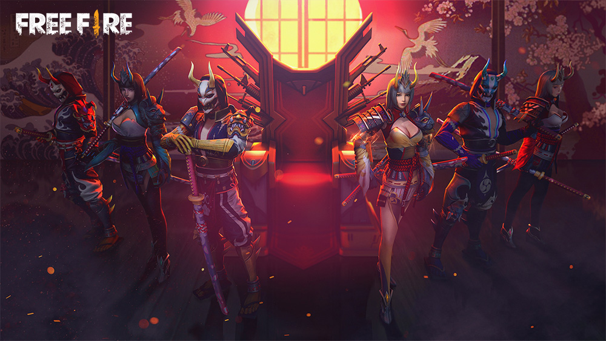
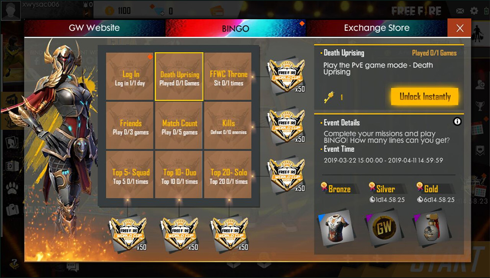

# Free Fire · 2019年3月更新（World Cup）

- 公告日期：2019-03-20
- 官方来源：[Join the Free Fire World Cup!](https://ff.garena.com/en/article/38/)
- 审阅日期：2026-09-19
- 10 个分类小节；10 项说明及表格行；4 张官方公告插图。

完整公告逐项复核；四张正文图全部核验。公告未直接写OB号，保留日期索引。

公告2019-03-20；World Cup与Death Uprising为Coming Soon。BINGO界面配图列3月22日15:00～4月11日14:59:59，时区未注明，不能泛化为所有内容起止日。

World Cup活动主题图。原文：New Features。[官方原图](https://cdn.wildflamestudio.com/common/web_event/official/65f97516594e02.jpg) · 1000×563。

## BR · 大逃杀

### World Cup王座

- 归属：BR · 大逃杀 / 活动覆盖
- 原文小节：New Features > Free Fire World Cup Thrones
- 时间：公告日2019-03-20；未另列确切生效时刻。

World Cup王座主题图。原文：New Features。[官方原图](https://cdn.wildflamestudio.com/common/web_event/official/38834cfa78d804.jpg) · 1000×563。

- 所有地图增加World Cup王座；配图BINGO有坐王座任务。正文未列其他收益、数量或生成点。

### 地图弹射台施工

- 归属：BR · 大逃杀 / 范围未明确
- 原文小节：New Features > Andrew has began the construction of launch pads
- 时间：公告日2019-03-20；未另列确切生效时刻。

- 原文称Andrew已开始在地图建造弹射台，未列点位、使用规则或完工日。

### Bermuda新增Observatory

- 归属：BR · 大逃杀 / 常规调整
- 原文小节：New Features > New area in Bermuda - Observatory
- 时间：公告日2019-03-20；未另列确切生效时刻。

- Bermuda新增Observatory区域；未列布局细节。

### 出生岛巨蛋

- 归属：BR · 大逃杀 / 范围未明确
- 原文小节：New Features > A giant egg appeared on the spawn island!
- 时间：公告日2019-03-20；未另列确切生效时刻。

- 出生岛出现巨蛋；未说明交互效果或期限。

## CS · 枪王对决

## 通用局内调整

### 新角色Hayato

- 归属：通用局内调整 / 常规调整
- 原文小节：New Features > New Character - Hayato
- 时间：公告日2019-03-20；未另列确切生效时刻。

新角色Hayato配图。原文：New Features。[官方原图](https://cdn.wildflamestudio.com/common/web_event/official/448a7c668a3305.jpg) · 1000×563。

- Bushido：生命降低时提高造成的伤害；原文未给比例或阈值，不用后续版本技能回填。

### 新增Katana近战武器

- 归属：通用局内调整 / 常规调整
- 原文小节：New Features > New weapon - Katana
- 时间：公告日2019-03-20；未另列确切生效时刻。

- 新增Katana；未列伤害或其他数值。

### AN94平衡

- 归属：通用局内调整 / 常规调整
- 原文小节：New Features > AN94 Buff
- 时间：公告日2019-03-20；未另列确切生效时刻。

- 伤害35→37；Rate of fire参数0.20→0.185，原文未列单位，虽数值下降但文字称提高；有效射程36→32，未列单位。

### VSS平衡

- 归属：通用局内调整 / 常规调整
- 原文小节：New Features > VSS Buff
- 时间：公告日2019-03-20；未另列确切生效时刻。

- 伤害25→27。

### Misha载具减伤

- 归属：通用局内调整 / 常规调整
- 原文小节：New Features > Character Skill Rework - Misha
- 时间：公告日2019-03-20；未另列确切生效时刻。

- Misha在载具内受到更少伤害；未列比例。

### 设置页UI优化

- 归属：通用局内调整 / 常规调整
- 原文小节：New Features > UI optimization at the settings page
- 时间：公告日2019-03-20；未另列确切生效时刻。

- 设置页UI优化；未说明具体选项或布局变化。

## 其他玩法与局外内容（目录摘要）

### World Cup预告与BINGO

World Cup局内活动标Coming Soon；完成FFWC任务推进BINGO。图片中活动期2019-03-22 15:00～04-11 14:59:59，未给时区；任务示例包括登录、Death Uprising、坐王座、好友、场数、淘汰及各队伍规模排名。

原文目录：New Features > Special in-game events / FF World Cup BINGO

### Death Uprising预告与开放安排

抵御多波僵尸并存活；掉落的僵尸徽章可兑换专属服装。Lucky Cards移至此玩法。Death Race的原开放时间被Zombie Invasion替代。正文未明确Death Uprising与Zombie Invasion是否同一名称，不自行合并。

原文目录：New Features > New Gamemode - Death Uprising

### Elite Pass与大厅展示

Elite Pass新增任务；大厅新增背景音乐；新增登录画面、大厅和加载图片。

原文目录：New Features > New missions / New BGM / New login screen

## 其余原文配图

以下为尚未在上述小节内展示的原文图片，包括局外章节配图。

BINGO任务界面及3月22日～4月11日时间。原文：New Features。[官方原图](https://cdn.wildflamestudio.com/common/web_event/official/a55bf38a9ca803.jpg) · 1000×567。

## 官方图片索引

正文图片按相关小节展示，版本总览及其他章节插图另列；同一原图只嵌入一次。

- [World Cup活动主题图](https://cdn.wildflamestudio.com/common/web_event/official/65f97516594e02.jpg) · 1000×563 · 本地 `assets/ff-patches/38-01.jpg`
- [BINGO任务界面及3月22日～4月11日时间](https://cdn.wildflamestudio.com/common/web_event/official/a55bf38a9ca803.jpg) · 1000×567 · 本地 `assets/ff-patches/38-02.jpg`
- [World Cup王座主题图](https://cdn.wildflamestudio.com/common/web_event/official/38834cfa78d804.jpg) · 1000×563 · 本地 `assets/ff-patches/38-03.jpg`
- [新角色Hayato配图](https://cdn.wildflamestudio.com/common/web_event/official/448a7c668a3305.jpg) · 1000×563 · 本地 `assets/ff-patches/38-04.jpg`

## 原文目录（对照用）

- New Features
