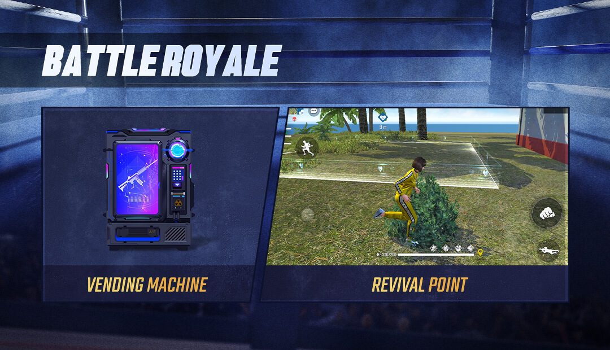
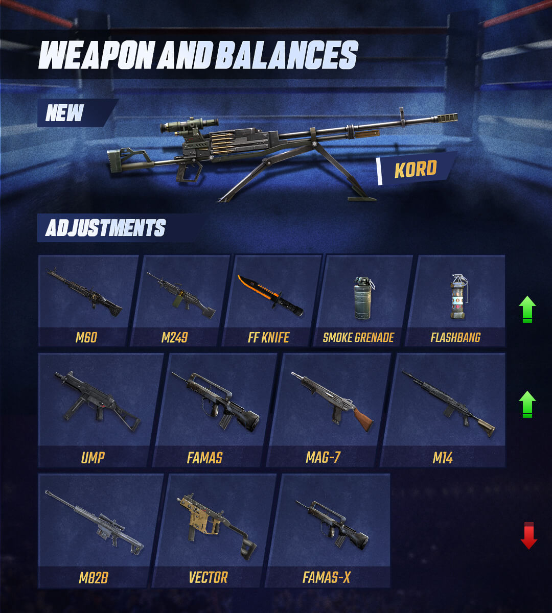
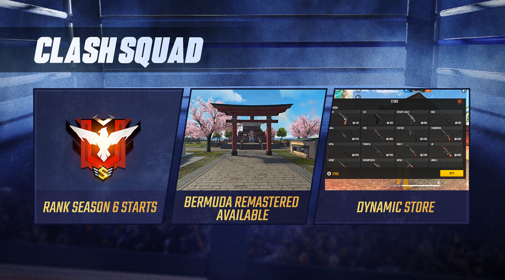
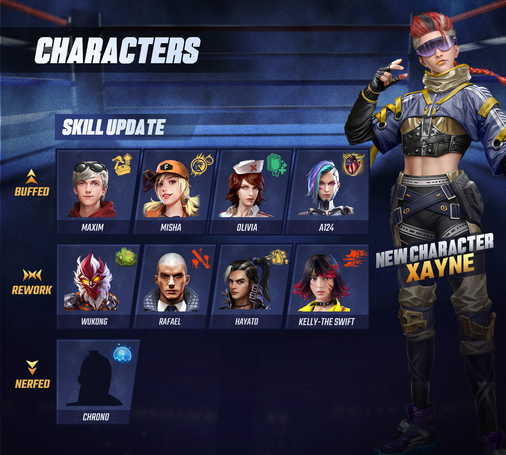
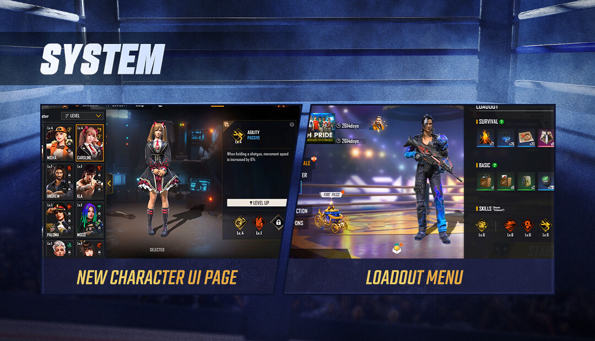

# Free Fire · OB27 · World Series（2021 年 4 月补丁）

- 公告日期：2021-04-14
- 官方来源：[PATCH NOTE: WORLD SERIES](https://ff.garena.com/en/article/428/)
- 审阅日期：2026-09-19
- 30 个分类小节；92 项说明及表格行；5 张官方公告插图。

主流程逐项对照完整正文与HTML，并核看5张正文图；正文、图片所示的局内调整均记录，图片特有信息注明依据。BR、CS及通用分线，训练场与局外内容另列处置。

公告日：2021-04-14；正文未列本次补丁统一实际生效时间。

## BR · 大逃杀

### 经典 BR 售货机可见性与全地图

- 归属：BR · 大逃杀 / 常规调整
- 原文小节：Battle Royale (Classic) > Vending Machine
- 时间：公告日：2021-04-14；正文未列本次补丁统一实际生效时间。

Battle Royale (Classic) 章节；未单列 Casual/Ranked。

BR售货机与复活点总览。原文：Battle Royale (Classic)。[官方原图](https://cdn.wildflamestudio.com/common/web_event/aswqooiwd/27_3.1.jpg) · 1080×620。

- 售货机位置在地图上可见。
- 安全区伤害不再打断使用售货机。
- 售货机在所有地图提供。

### BR休闲复活点扩展至全部地图

- 归属：BR · 大逃杀 / 常规调整
- 原文小节：Battle Royale (Classic) > Revival Point
- 时间：公告日：2021-04-14；正文未列本次补丁统一实际生效时间。

原文不表示 BR 排位同样可用。

- 复活点（Revival Point）扩展至全部地图。
- 复活机制在 Battle Royale Casual 提供。

### 烟雾弹扩散、投掷与BR空投

- 归属：BR · 大逃杀 / 常规调整
- 原文小节：Weapon and Balances > Smoke Grenade
- 时间：公告日：2021-04-14；正文未列本次补丁统一实际生效时间。

原文未给具体数值。

武器更新总览：Kord与各项调整，含正文未单列的FAMAS-X下调。原文：Weapon and Balances。[官方原图](https://cdn.wildflamestudio.com/common/web_event/aswqooiwd/27_4.1.jpg) · 1080×1200。

- 加快烟雾扩散速度。
- 提高投掷距离。
- BR模式空投加入烟雾弹。

## CS · 枪王对决

### CS每局使用一套动态商店

- 归属：CS · 枪王对决 / 常规调整
- 原文小节：Clash Squad > Dynamic Store
- 时间：公告日：2021-04-14；正文未列本次补丁统一实际生效时间。

原文未列各商店商品、价格或选择概率。

CS总览：第6排位赛季、百慕大重制版与动态商店。原文：Clash Squad。[官方原图](https://cdn.wildflamestudio.com/common/web_event/aswqooiwd/27_1.1.jpg) · 1080×600。

- CS 每局会为双方队伍选择一套商店，并在整局内保持该套商店。
- CS 可用 Store Alpha。
- CS 可用 Store Beta。
- CS 可用 Store Charlie。
- CS 可用 Store Delta。
- Mysterious商店仅在CS休闲模式可用。

### CS加入百慕大重制版

- 归属：CS · 枪王对决 / 常规调整
- 原文小节：Clash Squad > New Map Available: Bermuda Remastered
- 时间：公告日：2021-04-14；正文未列本次补丁统一实际生效时间。

- 百慕大重制版（Bermuda Remastered）加入CS休闲与排位模式。
- 公告特别提到可在Samurai Garden交战，未展开该区域的布局改动。

### CS 武器与配件固定绑定

- 归属：CS · 枪王对决 / 常规调整
- 原文小节：Clash Squad > Weapon Attachments
- 时间：公告日：2021-04-14；正文未列本次补丁统一实际生效时间。

- CS武器与其配件改为固定绑定；拾取和丢弃武器时配件随枪保留。

### CS 每回合动态最终安全区

- 归属：CS · 枪王对决 / 常规调整
- 原文小节：Clash Squad > Dynamic Playzone
- 时间：公告日：2021-04-14；正文未列本次补丁统一实际生效时间。

- CS每回合的最终安全区会略有不同。官方称目的在于减少提前占据圈中心并一直避战的做法，未公布具体变化规则。

## 通用局内调整

### 角色等级与觉醒技能规则

- 归属：通用局内调整 / 常规调整
- 原文小节：Character & Pets > Character System
- 时间：公告日：2021-04-14；正文未列本次补丁统一实际生效时间。

角色页 UI 重做另作局外处置；原文未给碎片需求。

角色调整总览：Xayne与各角色技能方向，含正文未单列的Kelly觉醒重做。原文：Character & Pets。[官方原图](https://cdn.wildflamestudio.com/common/web_event/hash/1ae867df05460dac22a47836bd05921fjpg) · 1080×970。

- 角色最高等级由 8 降至 6。
- 觉醒角色技能现在包含原角色技能效果。
- 升级角色等级不再消耗金币和钻石。
- 拥有足够碎片后可直接在角色菜单升级；等级上限调整旨在使每次升级都提升技能等级。
- 依据同页角色总览图，Kelly-TheSwift列在重做组；正文未单列她的重做参数，仅说明本版觉醒技能包含原角色技能效果。

### Maro：距离与标记伤害加成

- 归属：通用局内调整 / 常规调整
- 原文小节：Character & Pets > New Character - Maro
- 时间：公告日：2021-04-14；正文未列本次补丁统一实际生效时间。

原文未单列模式或距离阈值。

- 伤害随距离提高，1～6级分别最多增加5/7/10/14/19/25%；达到最大增幅的距离未说明。
- 对被标记敌人的伤害额外增加1/1.5/2/2.5/3/3.5%，对应1～6级。

### Xayne：临时生命值与冰墙/护盾伤害

- 归属：通用局内调整 / 常规调整
- 原文小节：Character & Pets > New Character - Xayne
- 时间：公告日：2021-04-14；正文未列本次补丁统一实际生效时间。

原文未单列模式。

- Xayne 使用 Xtreme Encounter 时临时获得 80 HP。
- 技能使对冰墙（Gloo Walls）与护盾的伤害提高40/50/61/73/86/100%，对应1～6级。
- 效果持续 10 秒；冷却为 150/140/130/120/110/100 秒。

### Chrono：力场、移速与冷却调整

- 归属：通用局内调整 / 常规调整
- 原文小节：Character & Pets > Chrono
- 时间：公告日：2021-04-14；正文未列本次补丁统一实际生效时间。

原文未单列模式；半径2→2.5和力场持续时间两组数值未在对应行标单位。

- Time Turner 力场生命值为 600。
- 力场半径由 2 提高到 2.5。
- 力场持续时间由 4/5/6/7/8/9 降至 3/4/5/6/7/8。
- 自身移动速度由 15/18/21/24/27/30% 降至 5/7/9/11/13/15%。
- 移除队友移动速度效果。
- 冷却由 40 秒改为 200/192/185/179/174/170 秒。

### Wukong：伪装取消与冷却重置

- 归属：通用局内调整 / 常规调整
- 原文小节：Character & Pets > Wukong
- 时间：公告日：2021-04-14；正文未列本次补丁统一实际生效时间。

原文未单列模式。

- Camouflage 变形持续 10/11/12/13/14/15 秒。
- 开火会取消 Camouflage 效果。
- 击败敌人会重置冷却（原文 taking down an enemy，未进一步区分击倒或淘汰）。
- 冷却为 300/280/260/240/220/200；原文未在该行标单位。

### Rafael：Dead Silent 改为被动

- 归属：通用局内调整 / 常规调整
- 原文小节：Character & Pets > Rafael
- 时间：公告日：2021-04-14；正文未列本次补丁统一实际生效时间。

原文未单列模式。

- Dead Silent 改为被动技能。
- 使用狙击枪和射手步枪时获得消音效果；被命中并倒地的敌人 HP 损失加快 20/23/27/32/38/45%。

### Hayato Firebrand：Art of Blades 改被动

- 归属：通用局内调整 / 常规调整
- 原文小节：Character & Pets > Hayato "Firebrand"
- 时间：公告日：2021-04-14；正文未列本次补丁统一实际生效时间。

原文未单列模式。

- Art of Blades 改为被动技能。
- 每损失 10% 最大 HP，正面伤害降低 1/1.5/2/2.5/3/3.5%。

### A124：EP 转 HP

- 归属：通用局内调整 / 常规调整
- 原文小节：Character & Pets > A124
- 时间：公告日：2021-04-14；正文未列本次补丁统一实际生效时间。

原文未单列模式。

- 每次快速转换的 EP→HP 由 25/30/35/40/45/50 改为 20/26/33/41/50/60。
- EP转为HP的转换时间由5秒缩短为4秒。
- 冷却由 90/80/75/70/65/60 秒改为 10 秒。

### Misha：驾车速度、减伤与瞄准

- 归属：通用局内调整 / 常规调整
- 原文小节：Character & Pets > Misha
- 时间：公告日：2021-04-14；正文未列本次补丁统一实际生效时间。

原文未单列模式。

- 驾驶速度提升由 2/4/6/8/10/12% 改为 5/6/8/11/15/20%。
- 车内承受伤害降低由 5/10/15/20/25/30% 改为 5/8/12/17/23/30%。
- Misha驾驶时更难被瞄准；原文未解释具体判定或参数。

### Olivia：救起额外 HP

- 归属：通用局内调整 / 常规调整
- 原文小节：Character & Pets > Olivia
- 时间：公告日：2021-04-14；正文未列本次补丁统一实际生效时间。

原文未单列模式。

- Healing Touch 的救起额外 HP 由 6/12/18/24/30/40 改为 30/36/43/51/60/70。

### Maxim：进食与医疗包使用速度

- 归属：通用局内调整 / 常规调整
- 原文小节：Character & Pets > Maxim
- 时间：公告日：2021-04-14；正文未列本次补丁统一实际生效时间。

原文未单列模式。

- 进食和使用医疗包的速度加成由2/4/6/8/10/12%改为15/18/22/27/33/40%，对应1～6级。

### 新增Kord机枪

- 归属：通用局内调整 / 常规调整
- 原文小节：Weapon and Balances > New Weapon - Kord
- 时间：公告日：2021-04-14；正文未列本次补丁统一实际生效时间。

“0.21”未说明单位；BR 与 CS 均明确。

- Kord 加入 Battle Royale 与 Clash Squad；基础伤害 35、射速 0.21、弹匣 80、配件槽为瞄具。
- Kord可在蹲下时启动机枪模式；同篇机枪模式小节补充趴下也可触发。

### FAMAS 属性调整

- 归属：通用局内调整 / 常规调整
- 原文小节：Weapon and Balances > FAMAS
- 时间：公告日：2021-04-14；正文未列本次补丁统一实际生效时间。

原文未单列模式。

- 基础伤害由 28 改为 30。
- 最低伤害由 11 改为 12。
- 点射速度 +11%。
- 后坐累积 +20%。

### UMP 属性调整

- 归属：通用局内调整 / 常规调整
- 原文小节：Weapon and Balances > UMP
- 时间：公告日：2021-04-14；正文未列本次补丁统一实际生效时间。

原文未单列模式。

- 基础伤害由 24 改为 25。
- 射速 -5%。
- Precise Shots属性+1；原文未解释该属性的判定或计算。
- 精度 +25%。
- 移动精度 +13%。
- 射击时移动速度 +21%。

### 投掷刀对倒地敌人的伤害提高

- 归属：通用局内调整 / 常规调整
- 原文小节：Weapon and Balances > FF Knife
- 时间：公告日：2021-04-14；正文未列本次补丁统一实际生效时间。

原文未单列模式。

- FF Knife 对倒地敌人的伤害 +80；原文未说明单位或改前值。

### MAG-7 精度与后坐

- 归属：通用局内调整 / 常规调整
- 原文小节：Weapon and Balances > MAG-7
- 时间：公告日：2021-04-14；正文未列本次补丁统一实际生效时间。

原文未单列模式。

- 精度 +8%。
- 移动精度 +4%。
- 最大后坐 -14%。

### Vector Akimbo 下调

- 归属：通用局内调整 / 常规调整
- 原文小节：Weapon and Balances > Vector
- 时间：公告日：2021-04-14；正文未列本次补丁统一实际生效时间。

原文提到双持 Vector 在 CS 很强，但本数值段未明示仅限 CS。

- 爆头倍率由 550% 降至 400%。
- 双持有效射程 -10%。
- 双持后坐 +10%。
- 双持最大后坐 +50%。
- 装填速度 -25%。
- 移除枪口配件槽。
- 弹匣容量由 30 降至 25。

### M82B 对物体与冰墙后目标的伤害

- 归属：通用局内调整 / 常规调整
- 原文小节：Weapon and Balances > M82B
- 时间：公告日：2021-04-14；正文未列本次补丁统一实际生效时间。

原文未单列模式。

- Ballistic Rounds弹药效果对载具、桶与冰墙的额外伤害参数由1降至0.6；原文未给这组数值标单位。
- 对冰墙后玩家的伤害倍率由 0.8 降至 0.6。

### M14 最低伤害

- 归属：通用局内调整 / 常规调整
- 原文小节：Weapon and Balances > M14
- 时间：公告日：2021-04-14；正文未列本次补丁统一实际生效时间。

原文未单列模式。

- 最低伤害由 25 改为 30。

### 闪光弹可提前拉环计时

- 归属：通用局内调整 / 常规调整
- 原文小节：Weapon and Balances > Flashbang
- 时间：公告日：2021-04-14；正文未列本次补丁统一实际生效时间。

原文未单列模式。

- 闪光弹可在投出前拉环计时（cook），便于控制投出后引爆的时机。
- 致盲持续时间由 8 改为 2.2；原文未标单位。

### 机枪模式的姿态条件与各枪效果

- 归属：通用局内调整 / 常规调整
- 原文小节：Weapon and Balances > Machine Gun Mode
- 时间：公告日：2021-04-14；正文未列本次补丁统一实际生效时间。

原文称适用 All Machine Guns，未单列模式。

- 所有机枪可在蹲下或趴下时启动机枪模式（Machine Gun Mode）。
- M60 的 Machine Gun Mode 射速 +28%。
- M249 的 Machine Gun Mode 伤害 +5。
- Kord 的 Machine Gun Mode 射速 +5%，且一次射出 3 发。

### 背包排序、地图、观战与 HUD

- 归属：通用局内调整 / 常规调整
- 原文小节：System > Optimizations
- 时间：公告日：2021-04-14；正文未列本次补丁统一实际生效时间。

原文未为除小地图外的条目逐项列模式。

- 可按升序或降序排列局内背包。
- 优化所有模式的小地图显示。
- 观战时可看到其他玩家的主动技能。
- 转为观战时优先观战仍存活的玩家。
- 优化持续伤害（DoT）的伤害显示。
- 尝试修复命中却不造成伤害的 bug。
- 优化载具鸣笛按钮。
- 优化局内 HUD 菜单。
- 可在HUD菜单隐藏表情、宠物表情、趴下、标记和传奇服装按钮。

### FAMAS-X调整方向（配图信息）

- 归属：通用局内调整 / 常规调整
- 原文小节：Weapon and Balances > 官方武器总览配图
- 时间：公告日：2021-04-14；正文未列本次补丁统一实际生效时间。

仅记录配图明确的方向，不将FAMAS正文数值套到FAMAS-X。

- 依据同页官方武器总览图，FAMAS-X列在下调组；正文未单列它的调整属性、数值或适用模式。

## 其他玩法与局外内容（目录摘要）

### CS Rank Season 6：开季

CS 排位第 6 赛季 04/15 17:00 SGT 开始。

原文目录：Clash Squad > Rank Season 6

### CS Rank Season 6：赛季区间

新排位赛季开放 04/15~06/10；年份与时区未在该行单列。

原文目录：Clash Squad > Rank Season 6

### CS Rank Season 6：Golden M500

达到 Gold III 或以上可获得 Golden M500，属段位奖励。

原文目录：Clash Squad > Rank Season 6

### CS MVP 展示

双方 MVP 在每局结束时展示，属赛后展示。

原文目录：Clash Squad > MVP Display

### 角色系统 UI

角色系统加入新 UI，属角色页面。

原文目录：Character & Pets > Character System

### Training Grounds：Boxing Ring

训练场加入可进行1v1战斗的拳击场（Boxing Ring），属于独立训练玩法。

原文目录：Training Grounds > Boxing Ring

### Training Grounds：Target Arcade 排名

训练场 Target Arcade 加入排名，属独立训练玩法。

原文目录：Training Grounds > Optimizations

### Training Grounds：Social Zone 加好友

训练场 Social Zone 可互加好友，属独立训练玩法社交功能。

原文目录：Training Grounds > Optimizations

### Training Grounds：Social Zone 武器声音

降低 Social Zone 武器声音，属独立训练玩法。

原文目录：Training Grounds > Optimizations

### Training Grounds：Combat Zone 战斗统计

Combat Zone 加入战斗统计，属独立训练玩法。

原文目录：Training Grounds > Optimizations

### Loadout Menu UI

Loadout Menu 加入新 UI，属对局前配置界面。

原文目录：System > Loadout Menu

### Heroic Emblem

Heroic Emblem 追踪各排位赛季成就，属成就展示。

原文目录：System > Heroic Emblem

### Team Lobby 排位界面

Team Lobby 支持排位界面，属大厅。

原文目录：System > Optimizations

### World Chat 不当行为举报

世界聊天可举报不当行为，属社交管理。

原文目录：System > Optimizations

## 其余原文配图

以下为尚未在上述小节内展示的原文图片，包括局外章节配图。

角色页和对局前战备菜单的新界面。原文：System。[官方原图](https://cdn.wildflamestudio.com/common/web_event/aswqooiwd/27_5.1.jpg) · 1080×620。

## 官方图片索引

正文图片按相关小节展示，版本总览及其他章节插图另列；同一原图只嵌入一次。

- [CS总览：第6排位赛季、百慕大重制版与动态商店](https://cdn.wildflamestudio.com/common/web_event/aswqooiwd/27_1.1.jpg) · 1080×600 · 本地 `assets/ff-patches/428-01.jpg`
- [角色调整总览：Xayne与各角色技能方向，含正文未单列的Kelly觉醒重做](https://cdn.wildflamestudio.com/common/web_event/hash/1ae867df05460dac22a47836bd05921fjpg) · 1080×970 · 本地 `assets/ff-patches/428-02.jpg`
- [BR售货机与复活点总览](https://cdn.wildflamestudio.com/common/web_event/aswqooiwd/27_3.1.jpg) · 1080×620 · 本地 `assets/ff-patches/428-03.jpg`
- [武器更新总览：Kord与各项调整，含正文未单列的FAMAS-X下调](https://cdn.wildflamestudio.com/common/web_event/aswqooiwd/27_4.1.jpg) · 1080×1200 · 本地 `assets/ff-patches/428-04.jpg`
- [角色页和对局前战备菜单的新界面](https://cdn.wildflamestudio.com/common/web_event/aswqooiwd/27_5.1.jpg) · 1080×620 · 本地 `assets/ff-patches/428-05.jpg`

## 原文目录（对照用）

- Clash Squad
- Character & Pets
- Battle Royale (Classic)
- Training Grounds
- Weapon and Balances
- System
