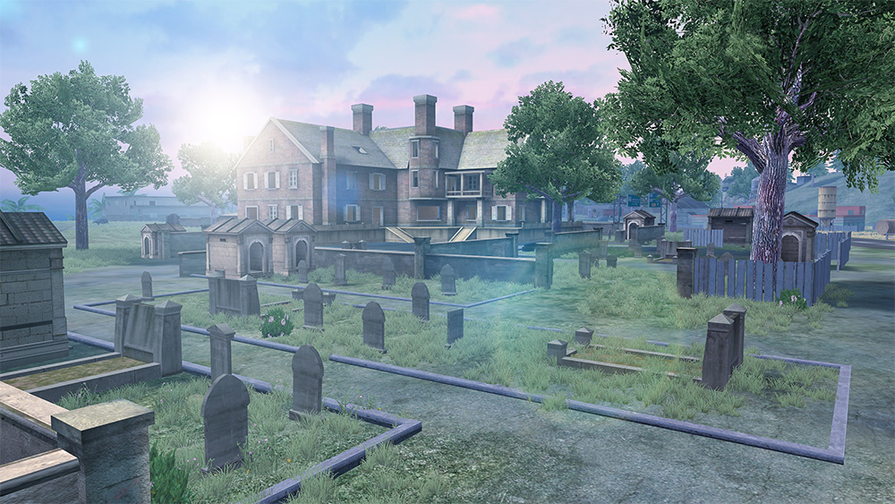
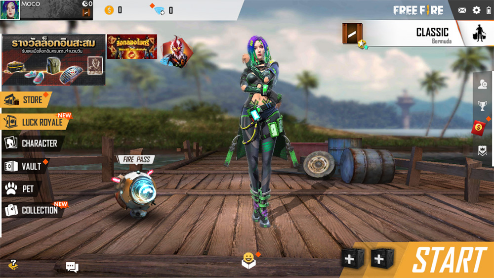

# Free Fire · 2019 年 1 月更新

- 公告日期：2019-01-22
- 官方来源：["GRAVEYARD" ON BERMUDA!](https://ff.garena.com/en/article/44/)
- 审阅日期：2026-09-19
- 6 个分类小节；13 项说明及表格行；4 张官方公告插图。

主流程已逐条对照正文及四张官方正文图复核；候机岛、通用操作和百慕大地图范围分开记录，未公布参数保留未知。

公告日索引。

## BR · 大逃杀

### 百慕大新增墓园

- 归属：BR · 大逃杀 / 常规调整
- 原文小节：New Features > Map Revamp
- 时间：公告日索引。

百慕大新增墓园：主建筑、围墙和墓地区域。原文：New Features > Map Revamp - Bermuda。[官方原图](https://cdn.wildflamestudio.com/common/web_event/official/1292c9b6a8f902.jpg) · 1000×563。

- 百慕大新增墓园（Graveyard，说明性译名）区域；原文没有公布面积、物资量或其他数值。

## CS · 枪王对决

## 通用局内调整

### 候机岛火车回归与冬季装饰移除

- 归属：通用局内调整 / 常规调整
- 原文小节：New Features > Spawn Island
- 时间：本项未单列日期，按公告日索引。

火车明确位于候机岛；紧邻的积雪和装饰移除条目未另外指明作用范围。

- 候机岛火车回归。
- 移除积雪和其他装饰；原文未细分具体场景或地图。

### AN94、治疗枪、近战武器与弩

- 归属：通用局内调整 / 常规调整
- 原文小节：New Features > Weapon/ Accessories
- 时间：公告日索引。

原文未单列模式。

- 新增 AN94，未在本篇列参数。
- 新增治疗枪（Treatment Gun，说明性译名），未在本篇列参数。
- 优化近战武器，未说明具体方式或数值。
- 弩提高伤害和箭矢速度，未公布改前改后数值。

### 宠物互动与表情

- 归属：通用局内调整 / 常规调整
- 原文小节：New Features > Pet System
- 时间：公告日索引。

原文明确宠物在对局和主大厅互动；皮肤/大厅部分未纳入。

宠物与角色外观官方插画。原文：New Features > Pet System。[官方原图](https://cdn.wildflamestudio.com/common/web_event/official/482ac5bec37003.jpg) · 1000×563。

- 宠物可在对局中与玩家互动。
- 宠物表情可在对局中使用。

### 断线重连

- 归属：通用局内调整 / 常规调整
- 原文小节：New Features > Disconnection Improvements
- 时间：公告日索引。

原文指候机岛及观战状态。

- 在候机岛断线后可重连。
- 观战时可重连。

### Moco 敌人标记

- 归属：通用局内调整 / 常规调整
- 原文小节：New Contents > New Character - Moco
- 时间：公告日索引。

原文未单列模式。

Moco 官方角色插画。原文：New Contents > New Character - Moco。[官方原图](https://cdn.wildflamestudio.com/common/web_event/official/ae963875a78c04.jpg) · 1000×563。

- 新增 Moco；射中敌人后，短时间标记该敌人。
- 队友可在地图上看到 Moco 标记的敌人；具体持续时间未说明。

## 其他玩法与局外内容（目录摘要）

### 宠物成长及局外外观

宠物升级可解锁新皮肤和表情，并可在大厅互动；另有新服装及收藏品。宠物对局互动和表情另见局内小节。

原文目录：New Features > Pet System / New Contents

### 大厅、商城与操作界面

优化主大厅、队伍菜单与商店界面，限时商店增加每日限时折扣，重做充值菜单。另优化组队邀请、Fire Pass、收藏标签、活动标签和私信界面。

原文目录：System / Optimization

## 其余原文配图

以下为尚未在上述小节内展示的原文图片，包括局外章节配图。

新版主大厅界面示例。原文：System > UI Improvement。[官方原图](https://cdn.wildflamestudio.com/common/web_event/official/0e46c5b40f6305.jpg) · 1000×562。

## 官方图片索引

正文图片按相关小节展示，版本总览及其他章节插图另列；同一原图只嵌入一次。

- [百慕大新增墓园：主建筑、围墙和墓地区域](https://cdn.wildflamestudio.com/common/web_event/official/1292c9b6a8f902.jpg) · 1000×563 · 本地 `assets/ff-patches/44-01.jpg`
- [宠物与角色外观官方插画](https://cdn.wildflamestudio.com/common/web_event/official/482ac5bec37003.jpg) · 1000×563 · 本地 `assets/ff-patches/44-02.jpg`
- [Moco 官方角色插画](https://cdn.wildflamestudio.com/common/web_event/official/ae963875a78c04.jpg) · 1000×563 · 本地 `assets/ff-patches/44-03.jpg`
- [新版主大厅界面示例](https://cdn.wildflamestudio.com/common/web_event/official/0e46c5b40f6305.jpg) · 1000×562 · 本地 `assets/ff-patches/44-04.jpg`

## 原文目录（对照用）

- New Features
- New Contents
- System
- Optimization
