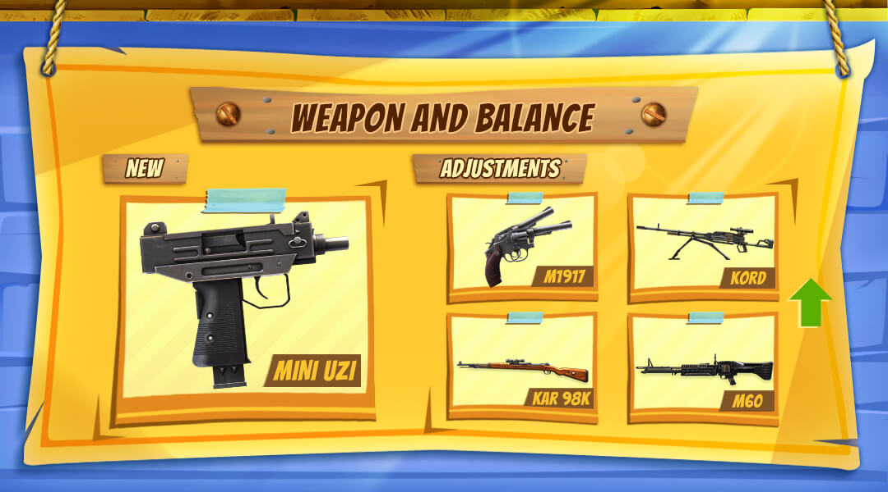
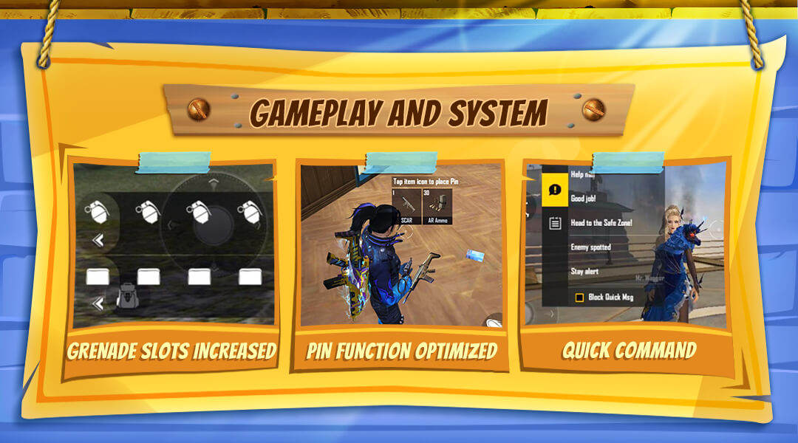

# Free Fire · OB28 · Rampage（2021 年 6 月补丁）

- 公告日期：2021-06-08
- 官方来源：[PATCH NOTE: RAMPAGE](https://ff.garena.com/en/article/459/)
- 审阅日期：2026-09-19
- 16 个分类小节；38 项说明及表格行；6 张官方公告插图。

逐项复核本篇 BR、CS 与通用局内章节；独立玩法和局外内容另列目录处置。未将公告日期当作统一上线日期。全部正文图已归档并按实际图像内容关联。

公告日：2021-06-08；正文未列统一生效时间。 预告角色、宠物或独立玩法另按各项时间说明记录。

## BR · 大逃杀

### 售货机弹药、修甲包与购买限制

- 归属：BR · 大逃杀 / 常规调整
- 原文小节：Battle Royale > Vending Machine
- 时间：公告日：2021-06-08；正文未列统一生效时间。

- BR 售货机新增弹药（Ammo）与护甲修理包（Armor Repair Kit）。
- 说明段表示为部分消耗品和高价值物品增加个人购买限制；明细同时写“提高部分物品购买上限”。原文未列物品和限额，保留这两处不同表述。
- 调整地面物资，避免与售货机重复（原文 overlap）；未列出具体物资清单或位置。

### 复活点：占领时间、冷却与数量

- 归属：BR · 大逃杀 / 常规调整
- 原文小节：Battle Royale > Revival Points
- 时间：公告日：2021-06-08；正文未列统一生效时间。

- 复活点占领时间由 14 秒改为 33 秒。
- 复活点冷却由 150 秒改为 180 秒。
- 每局复活点由 9 个降至 8 个。

## CS · 枪王对决

## 通用局内调整

### Ice Grenade：冰霜区域效果

- 归属：通用局内调整 / 常规调整
- 原文小节：Weapon and Balance > New Grenade - Ice Grenade
- 时间：公告日：2021-06-08；正文未列统一生效时间。

原文通用章节，未单列适用模式；不据此推定所有独立玩法规则相同。

- Ice Grenade 加入 BR 与 CS；爆炸伤害 100、爆炸半径 5m、冰霜半径 5m、冰霜持续 10 秒。
- 冰霜区内玩家移速降低 10%、射速降低 20%；按身处冰霜区的时长受到 5～10 点伤害，原文未注明伤害结算间隔。
- Ice Frost 影响友军。

### Mini UZI

- 归属：通用局内调整 / 常规调整
- 原文小节：Weapon and Balance > New Weapon - Mini UZI
- 时间：公告日：2021-06-08；正文未列统一生效时间。

0.055 未标单位。

Mini UZI 与 M1917、Kord、Kar98k、M60 调整。原文：Weapon and Balance。[官方原图](https://cdn.wildflamestudio.com/common/web_event/aswqooiwd/28_6.jpg) · 1080×600。

- Mini UZI 加入 BR 与 CS，是使用 SMG 弹药的副武器；基础伤害 17、射速 0.055、弹匣 18、无配件。

### M1917 调整

- 归属：通用局内调整 / 常规调整
- 原文小节：Weapon and Balance > M1917
- 时间：公告日：2021-06-08；正文未列统一生效时间。

原文通用章节，未单列适用模式；不据此推定所有独立玩法规则相同。

- 最低伤害由 36 改为 45。
- 有效射程 +25%。

### Kord 调整

- 归属：通用局内调整 / 常规调整
- 原文小节：Weapon and Balance > Kord
- 时间：公告日：2021-06-08；正文未列统一生效时间。

原文通用章节，未单列适用模式；不据此推定所有独立玩法规则相同。

- 精度 +28%。
- Machine Gun Mode 射速 +25%。
- 对冰墙、油桶和载具的伤害倍率原文由“+100”改为“+120%”；旧值处未写百分号，未补推计算公式。

### M60 Machine Gun Mode

- 归属：通用局内调整 / 常规调整
- 原文小节：Weapon and Balance > M60
- 时间：公告日：2021-06-08；正文未列统一生效时间。

原文通用章节，未单列适用模式；不据此推定所有独立玩法规则相同。

- 机枪模式（Machine Gun Mode）明细写伤害 +5；前面的说明段却写提高射速，两处属性不一致，不能将 +5 改写成射速或百分比。
- 对冰墙、油桶和载具的伤害倍率 +60%。

### Kar98k 调整

- 归属：通用局内调整 / 常规调整
- 原文小节：Weapon and Balance > Kar98k
- 时间：公告日：2021-06-08；正文未列统一生效时间。

原文通用章节，未单列适用模式；不据此推定所有独立玩法规则相同。

- 对手臂与腿部伤害 +25%。
- 对躯干伤害 -10%。
- 护甲穿透由 0% 改为 +40%。

### 双手雷槽与语音快捷消息

- 归属：通用局内调整 / 常规调整
- 原文小节：Gameplay and System > Additional Utilities & Grenade Slot / In-Game Voice Commands
- 时间：公告日：2021-06-08；正文未列统一生效时间。

原文通用章节，未单列适用模式；不据此推定所有独立玩法规则相同。

双手雷槽、地面物品标记与快捷语音。原文：Gameplay and System / Optimization and Bug Fixes。[官方原图](https://cdn.wildflamestudio.com/common/web_event/aswqooiwd/28_4.jpg) · 1080×600。

- 设置菜单新增“双手雷槽”（Two Grenade Slots），用于在 HUD 上更快切换和使用不同手雷；本项未改写背包携带上限。
- 局内快捷消息增加语音播报。

### D-Bee：Bullet Beats（预告）

- 归属：通用局内调整 / 范围未明确
- 原文小节：Characters and Pets > New Character: D-Bee
- 时间：公告日：2021-06-08；本项为 Available Soon 预告，未公布具体上线日期。

原文通用章节，未单列适用模式；不据此推定所有独立玩法规则相同。

- D-Bee 标为 Available Soon，尚无本篇确认上线日期。
- 移动中开火时，移速增加 5/7/9/11/13/15%，精度增加 10/13/17/22/28/35%。

### Dr. Beanie（预告）

- 归属：通用局内调整 / 范围未明确
- 原文小节：Characters and Pets > New Pet - Dr. Beanie
- 时间：公告日：2021-06-08；本项为 Available Soon 预告，未公布具体上线日期。

原文通用章节，未单列适用模式；不据此推定所有独立玩法规则相同。

- Dr. Beanie 标为 Available Soon，尚无本篇确认上线日期。
- 下蹲时移速增加 30/40/60%。

### Paloma：各类弹药的背包空间豁免

- 归属：通用局内调整 / 常规调整
- 原文小节：Characters and Pets > Paloma
- 时间：公告日：2021-06-08；正文未列统一生效时间。

原文通用章节，未单列适用模式；不据此推定所有独立玩法规则相同。

Laura、Paloma 与 Clu 技能调整。原文：Characters and Pets。[官方原图](https://cdn.wildflamestudio.com/common/web_event/aswqooiwd/28_3.jpg) · 1080×600。

- Arms Dealing 对除 40mm Ammo 外的所有弹药类型生效。
- 不占背包空间的弹药数量由 30/60/90/120/150/180 改为 45/60/75/90/105/120。

### Clu：Tracing Steps

- 归属：通用局内调整 / 常规调整
- 原文小节：Characters and Pets > Clu
- 时间：公告日：2021-06-08；正文未列统一生效时间。

原文通用章节，未单列适用模式；不据此推定所有独立玩法规则相同。

- 扫描半径由 30/35/40/40/45/50m 改为 50/55/60/65/70/75m。 原文旧数组第 3、4 级均为 40 米。
- 扫描持续由 5/5.5/6/6/6.5/7s 改为 5/5.5/6/6.5/7/7.5s。 原文旧数组第 3、4 级均为 6 秒。
- 冷却由 50s 改为 75/72/69/66/63/60s。
- 敌人位置共享给队友的等级由 4 改为 1。

### Laura：Sharpshooter

- 归属：通用局内调整 / 常规调整
- 原文小节：Characters and Pets > Laura
- 时间：公告日：2021-06-08；正文未列统一生效时间。

原文通用章节，未单列适用模式；不据此推定所有独立玩法规则相同。

- 开镜时精度增加由 10/14/18/22/26/30% 改为 10/13/17/22/28/35%。 按数组保留各级变化，不概括为所有等级均提高。

### 局内标记、HUD 与小地图开关

- 归属：通用局内调整 / 常规调整
- 原文小节：Optimization and Bug Fixes
- 时间：公告日：2021-06-08；正文未列统一生效时间。

原文通用章节，未单列适用模式；不据此推定所有独立玩法规则相同。

- 优化局内物品标记（ping）。
- 优化武士刀（Katana）动画显示。
- 优化局内 HUD 按钮。
- 小地图可开关售货机与复活点的显示。

### 觉醒取消等级要求

- 归属：通用局内调整 / 常规调整
- 原文小节：Optimization and Bug Fixes
- 时间：公告日：2021-06-08；正文未列统一生效时间。

原文通用章节，未单列适用模式；不据此推定所有独立玩法规则相同。

- 角色觉醒不再要求等级。

## 其他玩法与局外内容（目录摘要）

### CS 排位第7赛季：时间

CS 排位第 7 赛季：2021-06-09 17:00（GMT+8）开始，公告列出的赛季日期范围为 2021-06-09～2021-08-05。

原文目录：Clash Squad > Clash Squad - Rank Season 7

### CS 排位第7赛季：奖励与 Grandmaster

Gold III 及以上奖励 Golden M1014；Heroic 前 1000 名晋升 Grandmaster。按原文保留分段：I 为第 1～100 名、II 为第 101～300 名、III 为第 301～1000 名。属于段位和奖励。

原文目录：Clash Squad > Clash Squad - Rank Season 7

### BR Rank Points

提高各段位每局总排位积分产出，属排位结算。

原文目录：Battle Royale > Rank Points Adjustment

### Training Grounds 更新

训练场人数 20→25；经喷泉旁传送门进入社交区飞船（配图标注 1v1）；新增聊天表情、赛道碰碰车和圈速计时器，Combat Zone 增加排行榜。独立训练内容，不计入 BR/CS 基础规则。

原文目录：Training Grounds > Map and Mini Games Update

### Pet Rumble 更新

Pet Rumble 于 2021-06-09 开放匹配；Scientists 的任务新增 4 个小游戏，Pranksters 获得 Trap 技能（同页配图称 Mini Trap）。独立玩法。

原文目录：Pet Rumble > Game Features Update

### 大厅/角色页/排位展示

Vault 设置展示背包、模式选择、角色页背景、BR/CS排位属性与排位展示均为大厅/展示。

原文目录：Optimization and Bug Fixes

### CS Rank Shield bug

修复 CS Rank Shield 超过100的 bug，属排位界面/系统。

原文目录：Optimization and Bug Fixes

## 其余原文配图

以下为尚未在上述小节内展示的原文图片，包括局外章节配图。

CS 第 7 排位赛季与 Grandmaster 段位。原文：Clash Squad。[官方原图](https://cdn.wildflamestudio.com/common/web_event/aswqooiwd/28_5.jpg) · 1080×600。

训练场：飞船 1v1、聊天表情与碰碰车。原文：Training Grounds。[官方原图](https://cdn.wildflamestudio.com/common/web_event/aswqooiwd/28_1.jpg) · 1080×600。

Pet Rumble：新增小游戏与 Mini Trap。原文：Pet Rumble。[官方原图](https://cdn.wildflamestudio.com/common/web_event/aswqooiwd/28_2.jpg) · 1080×600。

## 官方图片索引

正文图片按相关小节展示，版本总览及其他章节插图另列；同一原图只嵌入一次。

- [CS 第 7 排位赛季与 Grandmaster 段位](https://cdn.wildflamestudio.com/common/web_event/aswqooiwd/28_5.jpg) · 1080×600 · 本地 `assets/ff-patches/459-01.jpg`
- [训练场：飞船 1v1、聊天表情与碰碰车](https://cdn.wildflamestudio.com/common/web_event/aswqooiwd/28_1.jpg) · 1080×600 · 本地 `assets/ff-patches/459-02.jpg`
- [Pet Rumble：新增小游戏与 Mini Trap](https://cdn.wildflamestudio.com/common/web_event/aswqooiwd/28_2.jpg) · 1080×600 · 本地 `assets/ff-patches/459-03.jpg`
- [Mini UZI 与 M1917、Kord、Kar98k、M60 调整](https://cdn.wildflamestudio.com/common/web_event/aswqooiwd/28_6.jpg) · 1080×600 · 本地 `assets/ff-patches/459-04.jpg`
- [双手雷槽、地面物品标记与快捷语音](https://cdn.wildflamestudio.com/common/web_event/aswqooiwd/28_4.jpg) · 1080×600 · 本地 `assets/ff-patches/459-05.jpg`
- [Laura、Paloma 与 Clu 技能调整](https://cdn.wildflamestudio.com/common/web_event/aswqooiwd/28_3.jpg) · 1080×600 · 本地 `assets/ff-patches/459-06.jpg`

## 版本关联来源

### [OB28官方编号依据](https://ff.garena.com/vn/article/568/)

越南官方标题明确OB28；CS第7赛季6月9日至8月5日、复活及角色改动对应。本页2021年12月28日为转载日期，不覆盖英文原公告日期。

## 原文目录（对照用）

- Clash Squad
- Clash Squad - Rank Season 7
- Battle Royale
- Vending Machine
- Revival Points
- Rank Points Adjustment
- Training Grounds
- Map and Mini Games Update
- Pet Rumble
- Game Features Update
- Weapon and Balance
- New Grenade - Ice Grenade
- New Weapon - Mini UZI
- M1917
- Kord
- M60
- Kar98k
- Gameplay and System
- Additional Utilities & Grenade Slot
- In-Game Voice Commands
- Characters and Pets
- New Character: D-Bee
- New Pet - Dr. Beanie
- Paloma
- Clu
- Laura
- Optimization and Bug Fixes
