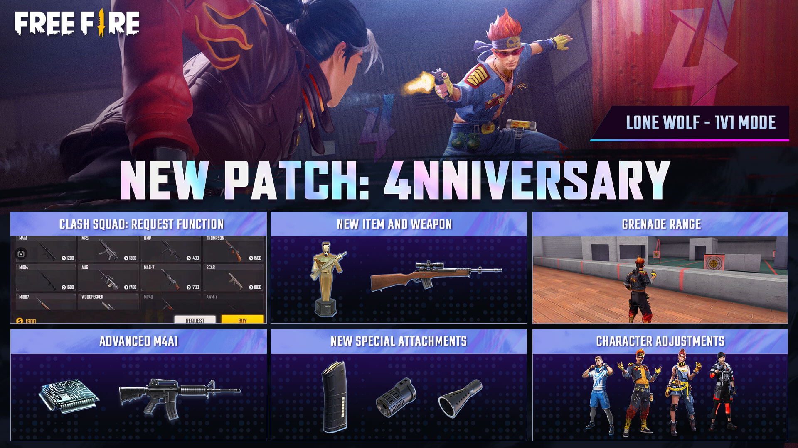
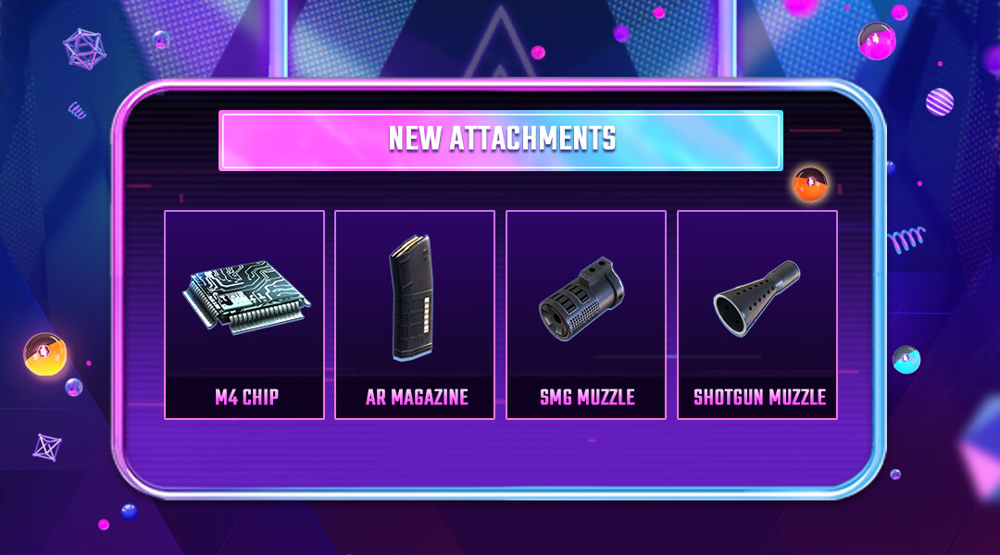
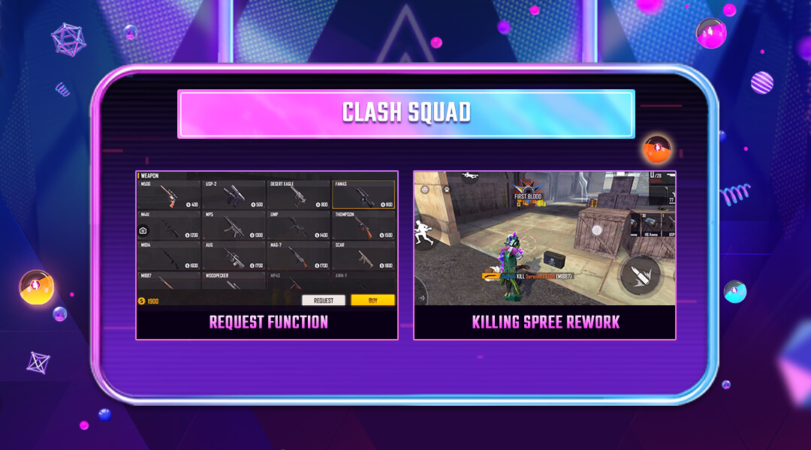
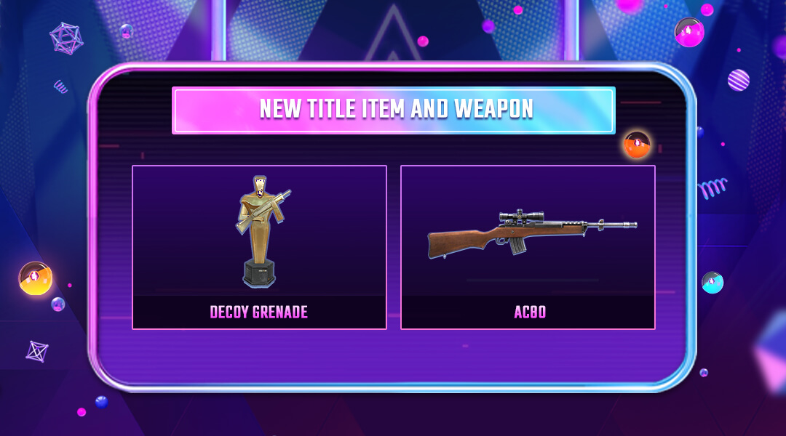
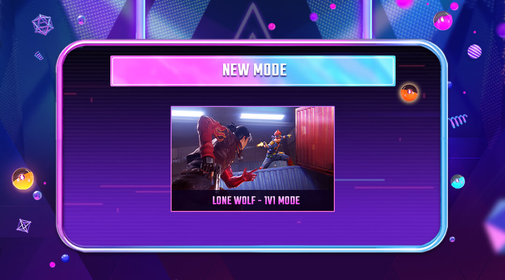
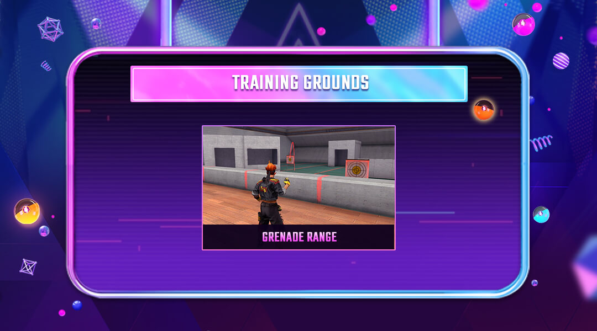

# Free Fire · OB29 · 4NNIVERSARY（2021 年 8 月补丁）

- 公告日期：2021-08-04
- 官方来源：[PATCH NOTE: ANNIVERSARY](https://ff.garena.com/en/article/485/)
- 审阅日期：2026-09-19
- 25 个分类小节；38 项说明及表格行；6 张官方公告插图。

逐项复核本篇 BR、CS 与通用局内章节；独立玩法和局外内容另列目录处置。未将公告日期当作统一上线日期。全部正文图已归档并按实际图像内容关联。

公告日：2021-08-04；正文未列统一生效时间。 预告角色、宠物或独立玩法另按各项时间说明记录。

4 周年版本总览：Lone Wolf、CS 请求、AC80 与附件等。原文：PATCH NOTE: 4NNIVERSARY。[官方原图](https://cdn.wildflamestudio.com/common/web_event/aswqooiwd/ob29img/en-0.jpg) · 1920×1080。

## BR · 大逃杀

### FF Tokens 背包计数

- 归属：BR · 大逃杀 / 常规调整
- 原文小节：Battle Royale > FF Tokens
- 时间：公告日：2021-08-04；正文未列统一生效时间。

- 背包菜单显示 FF Token 数量。

### BR：霰弹枪枪口附件

- 归属：BR · 大逃杀 / 常规调整
- 原文小节：Weapon and Balance > Special Attachments
- 时间：公告日：2021-08-04；正文未列统一生效时间。

M4 芯片、AR 弹匣、SMG 枪口与霰弹枪枪口。原文：Weapon and Balance。[官方原图](https://cdn.wildflamestudio.com/common/web_event/aswqooiwd/ob29img/en-4.jpg) · 1080×600。

- BR 新增 Shotgun Muzzle，仅用于指定类别的武器；每发霰弹增加 1 颗霰弹丸。

### BR：SMG 枪口附件

- 归属：BR · 大逃杀 / 常规调整
- 原文小节：Weapon and Balance > Special Attachments
- 时间：公告日：2021-08-04；正文未列统一生效时间。

- 新增 SMG Muzzle，仅适配指定类别：最低伤害射程 +1、射程 +1，原文均未写单位；每第 3 发造成 1.2 倍伤害。

### BR：AR 弹匣附件

- 归属：BR · 大逃杀 / 常规调整
- 原文小节：Weapon and Balance > Special Attachments
- 时间：公告日：2021-08-04；正文未列统一生效时间。

- 新增 AR Magazine，仅适配指定类别：提高射速（未给数值），弹匣容量减少 15%。

## CS · 枪王对决

### CS：请求队友购买物品

- 归属：CS · 枪王对决 / 常规调整
- 原文小节：Clash Squad > Item Request
- 时间：公告日：2021-08-04；正文未列统一生效时间。

CS 请求购买与连杀提示调整。原文：Clash Squad / Optimization and Bug Fixes。[官方原图](https://cdn.wildflamestudio.com/common/web_event/aswqooiwd/ob29img/en-1.jpg) · 1080×600。

- CS Casual 与 Ranked 可向队友请求直接购买物品进入自己背包。

### CS 等待提示、商店名与简化击杀提示

- 归属：CS · 枪王对决 / 常规调整
- 原文小节：Optimization and Bug Fixes
- 时间：公告日：2021-08-04；正文未列统一生效时间。

- 修复双方队伍已满员，CS 仍显示“等待玩家”的提示。
- 为各个 CS 武器商店增加名称。
- CS 支持简化击杀信息（killfeed）。

## 通用局内调整

### Dimitri Healing Heartbeat（预告）

- 归属：通用局内调整 / 范围未明确
- 原文小节：Character and Pets > New - Dimitri
- 时间：公告日：2021-08-04；本项为 Available Soon 预告，未公布具体上线日期。

原文通用章节，未单列适用模式；不据此推定所有独立玩法规则相同。

- Dimitri 标为 Available Soon。
- 创建3.5m治疗区；区域内自己与友军每秒回复3HP，倒地时可自救起身；持续10/11/12/13/14/15s，冷却85/80/75/70/65/60s。

### Thiva Vital Vibes（预告）

- 归属：通用局内调整 / 范围未明确
- 原文小节：Character and Pets > New - Thiva
- 时间：公告日：2021-08-04；本项为 Available Soon 预告，未公布具体上线日期。

原文通用章节，未单列适用模式；不据此推定所有独立玩法规则相同。

- Thiva 标为 Available Soon。
- 救援速度提高5/8/11/14/17/20%；成功救援后，使用者在5秒内回复15/20/25/30/35/40HP。

### Jota Sustained Raids

- 归属：通用局内调整 / 常规调整
- 原文小节：Character and Pets > Jota
- 时间：公告日：2021-08-04；正文未列统一生效时间。

原文通用章节，未单列适用模式；不据此推定所有独立玩法规则相同。

- 用枪命中敌人可回复自身部分HP；击倒敌人回复自身10/12/14/16/18/20%最大HP。 普通命中的回复量未公布。

### Luqueta Hat Trick

- 归属：通用局内调整 / 常规调整
- 原文小节：Character and Pets > Luqueta
- 时间：公告日：2021-08-04；正文未列统一生效时间。

原文通用章节，未单列适用模式；不据此推定所有独立玩法规则相同。

- 每次击杀带来的最大 HP 增量：8/10/12/14/16/18→10/13/16/19/22/25；累计最大 HP 增量上限：35→50。这里的上限是技能增加值，不是角色总生命上限。

### Shani Gear Recycle

- 归属：通用局内调整 / 常规调整
- 原文小节：Character and Pets > Shani
- 时间：公告日：2021-08-04；正文未列统一生效时间。

原文通用章节，未单列适用模式；不据此推定所有独立玩法规则相同。

- 每次击杀后恢复护甲耐久由10/12/14/16/18/20%改为10/12/15/19/24/30%。
- 额外耐久可将护甲升至3级。

### Alvaro Art of Demolition

- 归属：通用局内调整 / 常规调整
- 原文小节：Character and Pets > Alvaro
- 时间：公告日：2021-08-04；正文未列统一生效时间。

原文通用章节，未单列适用模式；不据此推定所有独立玩法规则相同。

- 爆炸武器伤害提高由6/8/10/12/14/16%改为10/12/14/16/18/20%。

### Sensei Tig Nimble Ninja（预告）

- 归属：通用局内调整 / 范围未明确
- 原文小节：Character and Pets > New Pet - Sensei Tig
- 时间：公告日：2021-08-04；本项为 Available Soon 预告，未公布具体上线日期。

原文通用章节，未单列适用模式；不据此推定所有独立玩法规则相同。

- Sensei Tig 标为 Available Soon。
- 降低敌方标记技能持续时间；数值未说明。

### AC80 Piercing Shots

- 归属：通用局内调整 / 常规调整
- 原文小节：Weapon and Balance > New Weapon - AC80
- 时间：公告日：2021-08-04；正文未列统一生效时间。

0.45未标单位。

AC80 与 Decoy Grenade 官方配图。原文：Weapon and Balance。[官方原图](https://cdn.wildflamestudio.com/common/web_event/aswqooiwd/ob29img/en-2.jpg) · 1080×600。

- AC80 精确射手步枪加入 BR 与 CS：基础伤害 50、射速字段 0.45（未列单位）、弹匣 10，可装枪口、握把和枪托。
- 每第 2 次由 AC80 造成的伤害触发额外伤害；原文未给额外伤害数值。

### M4A1 X/Y/Z

- 归属：通用局内调整 / 常规调整
- 原文小节：Weapon and Balance > M4A1 (X/Y/Z)
- 时间：公告日：2021-08-04；正文未列统一生效时间。

原文通用章节，未单列适用模式；不据此推定所有独立玩法规则相同。

- 拾取或购买 M4 Chip，可将 M4A1 升级为 X、Y、Z 版本；原文未逐级列出额外数值。

### UZI：伤害、弹匣与射程

- 归属：通用局内调整 / 常规调整
- 原文小节：Weapon and Balance > UZI
- 时间：公告日：2021-08-04；正文未列统一生效时间。

各同名武器小节未单列模式。

- 最低伤害 +8%、弹匣容量 +2、有效射程 +10%。

### XM8：射速与后坐力

- 归属：通用局内调整 / 常规调整
- 原文小节：Weapon and Balance > XM8
- 时间：公告日：2021-08-04；正文未列统一生效时间。

原文通用章节，未单列适用模式；不据此推定所有独立玩法规则相同。

- 射速 +10%、后坐力 +5%。

### SPAS12：配件槽与射程

- 归属：通用局内调整 / 常规调整
- 原文小节：Weapon and Balance > SPAS12
- 时间：公告日：2021-08-04；正文未列统一生效时间。

原文通用章节，未单列适用模式；不据此推定所有独立玩法规则相同。

- 新增枪口与瞄准镜配件槽；射程 +15%。

### Vector：射程与移动速度

- 归属：通用局内调整 / 常规调整
- 原文小节：Weapon and Balance > Vector
- 时间：公告日：2021-08-04；正文未列统一生效时间。

原文通用章节，未单列适用模式；不据此推定所有独立玩法规则相同。

- 射程 +5%、移动速度 +10%。说明段讨论双持机动性，但明细未将适用范围限定为双持。

### M1887：穿甲、射程与射速

- 归属：通用局内调整 / 常规调整
- 原文小节：Weapon and Balance > M1887
- 时间：公告日：2021-08-04；正文未列统一生效时间。

原文通用章节，未单列适用模式；不据此推定所有独立玩法规则相同。

- 护甲穿透 -6%、射程 -8%、射速 -5%。

### SMG 与枪口附件的射程

- 归属：通用局内调整 / 常规调整
- 原文小节：Weapon and Balance > SMGs with "Muzzle" Attachment Slots / Muzzle Attachment
- 时间：公告日：2021-08-04；正文未列统一生效时间。

原文通用章节，未单列适用模式；不据此推定所有独立玩法规则相同。

- 提高具备枪口槽的 MP40、P90、Thompson、Vector、MP5 的有效射程；原文未给增量。说明段强调拾到配件前的表现。
- 降低枪口附件为霰弹枪和 SMG 提供的有效射程增益；未给数值。

### 双弹匣容量增益

- 归属：通用局内调整 / 常规调整
- 原文小节：Weapon and Balance > Double Magazine
- 时间：公告日：2021-08-04；正文未列统一生效时间。

原文通用章节，未单列适用模式；不据此推定所有独立玩法规则相同。

- Double Magazine 的弹匣容量增益：+60%→+40%。

### Decoy Grenade 重做

- 归属：通用局内调整 / 常规调整
- 原文小节：Weapon and Balance > Decoy Grenade
- 时间：公告日：2021-08-04；正文未列统一生效时间。

正文是 Decoy Grenade 调整；同页配图将其列在“新道具与武器”中，保留差异，不据图片将其记为首次新增。

- Decoy Grenade 部署后会制造噪音，并在小地图显示。

### 拖动摇杆进入冲刺

- 归属：通用局内调整 / 常规调整
- 原文小节：Gameplay and System > Drag to Sprint
- 时间：公告日：2021-08-04；正文未列统一生效时间。

原文通用章节，未单列适用模式；不据此推定所有独立玩法规则相同。

- 设置菜单新增 Drag to Sprint：拖动摇杆可进入冲刺。

### 弹药、宠物显示与战斗提示

- 归属：通用局内调整 / 常规调整
- 原文小节：Optimization and Bug Fixes
- 时间：公告日：2021-08-04；正文未列统一生效时间。

原文通用章节，未单列适用模式；不据此推定所有独立玩法规则相同。

- 修改 SMG 弹药的 3D 模型，使之与弹药图标一致。
- 隐藏自己的宠物时，也会隐藏队友的宠物。
- 库存界面显示无法使用的弹药类型。
- 移除地图上的高级配件界面标识。
- 优化多重击杀提示；同页 CS 配图将这一项称为 Killing Spree Rework，正文未列更细的触发变化。
- Deadly Velocity 激活时不再弹出提示。

## 其他玩法与局外内容（目录摘要）

### Lone Wolf预告

预告 Lone Wolf（coming soon）：Iron Cage 地图，1v1，九局五胜。该公告未给出确切上线日；关联独立模式。

原文目录：Lone Wolf

### CS Rank Season 8

CS 排位第 8 赛季从 2021-08-05 17:00（GMT+8）开始，日期范围为 2021-08-05～2021-09-29；Gold III 及以上可获得 Golden AN94。

原文目录：Clash Squad > Clash Squad - Rank Season 8

### CS 背包展示

Vault中选择在CS展示背包，属外观展示。

原文目录：Clash Squad > Backpack

### BR Rank Points

提高BR总排位积分产出，属排位结算。

原文目录：Battle Royale > Rank Points Adjustment

### Training Grounds Grenade Range

训练场加入Grenade Range，属独立训练玩法。

原文目录：Training Grounds > Grenade Range

### 大厅/Fire Pass/赛后与训练场

重做大厅 UI，调整功能入口位置并放大按钮；Fire Pass 的活动任务与奖励合并；赛后结果增加点赞和 Battle Style 徽章展示。训练场禁止携带 Air Hammer 进入 Combat Zone，并在 1v1 擂台增加排队。

原文目录：Gameplay and System / Optimization and Bug Fixes

### Bomb Squad：炸弹显示

降低 Bomb Squad 炸弹的透明度。属于独立爆破玩法，不归为 CS。

原文目录：Optimization and Bug Fixes

### 队长匹配提示音

队长开始匹配时增加提示音，属于队伍和匹配界面。

原文目录：Optimization and Bug Fixes

## 其余原文配图

以下为尚未在上述小节内展示的原文图片，包括局外章节配图。

Lone Wolf：1v1 独立模式预告。原文：Lone Wolf。[官方原图](https://cdn.wildflamestudio.com/common/web_event/aswqooiwd/ob29img/en-5.jpg) · 1080×600。

训练场新增手雷练习区。原文：Training Grounds。[官方原图](https://cdn.wildflamestudio.com/common/web_event/aswqooiwd/ob29img/en-3.jpg) · 1080×600。

## 官方图片索引

正文图片按相关小节展示，版本总览及其他章节插图另列；同一原图只嵌入一次。

- [4 周年版本总览：Lone Wolf、CS 请求、AC80 与附件等](https://cdn.wildflamestudio.com/common/web_event/aswqooiwd/ob29img/en-0.jpg) · 1920×1080 · 本地 `assets/ff-patches/485-01.jpg`
- [Lone Wolf：1v1 独立模式预告](https://cdn.wildflamestudio.com/common/web_event/aswqooiwd/ob29img/en-5.jpg) · 1080×600 · 本地 `assets/ff-patches/485-02.jpg`
- [CS 请求购买与连杀提示调整](https://cdn.wildflamestudio.com/common/web_event/aswqooiwd/ob29img/en-1.jpg) · 1080×600 · 本地 `assets/ff-patches/485-03.jpg`
- [训练场新增手雷练习区](https://cdn.wildflamestudio.com/common/web_event/aswqooiwd/ob29img/en-3.jpg) · 1080×600 · 本地 `assets/ff-patches/485-04.jpg`
- [AC80 与 Decoy Grenade 官方配图](https://cdn.wildflamestudio.com/common/web_event/aswqooiwd/ob29img/en-2.jpg) · 1080×600 · 本地 `assets/ff-patches/485-05.jpg`
- [M4 芯片、AR 弹匣、SMG 枪口与霰弹枪枪口](https://cdn.wildflamestudio.com/common/web_event/aswqooiwd/ob29img/en-4.jpg) · 1080×600 · 本地 `assets/ff-patches/485-06.jpg`

## 原文目录（对照用）

- Lone Wolf
- New Mode - Lone Wolf
- Clash Squad
- Clash Squad - Rank Season 8
- Item Request
- Backpack
- Battle Royale
- Rank Points Adjustment
- FF Tokens
- Training Grounds
- Grenade Range
- Character and Pets
- New - Dimitri
- New - Thiva
- Jota
- Luqueta
- Shani
- Alvaro
- New Pet - Sensei Tig
- Weapon and Balance
- New Weapon - AC80
- M4A1 (X/Y/Z)
- UZI
- XM8
- SPAS12
- Vector
- M1887
- Special Attachments
- SMGs with "Muzzle" Attachment Slots
- Muzzle Attachment
- Double Magazine
- Decoy Grenade
- Gameplay and System
- Lobby Rework
- Drag to Sprint
- Fire Pass Missions
- Optimization and Bug Fixes
