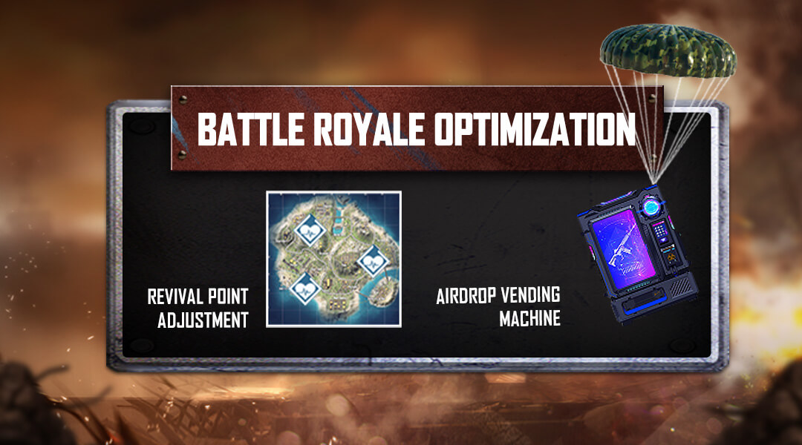
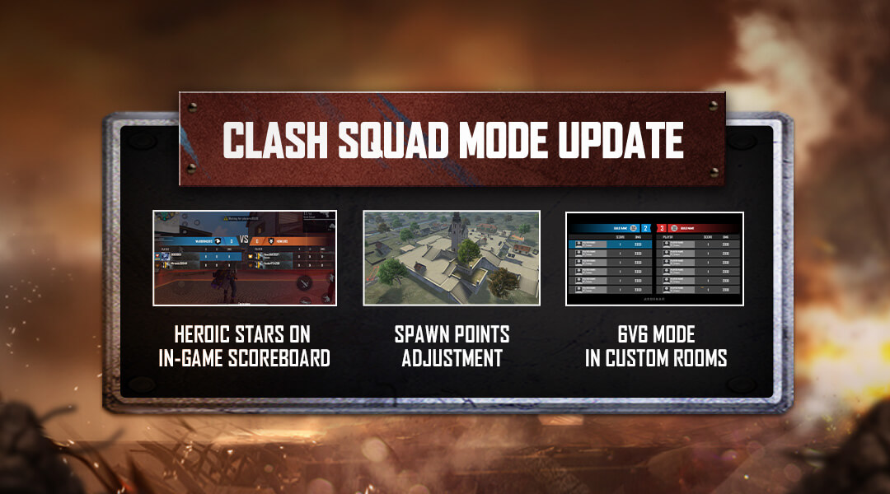
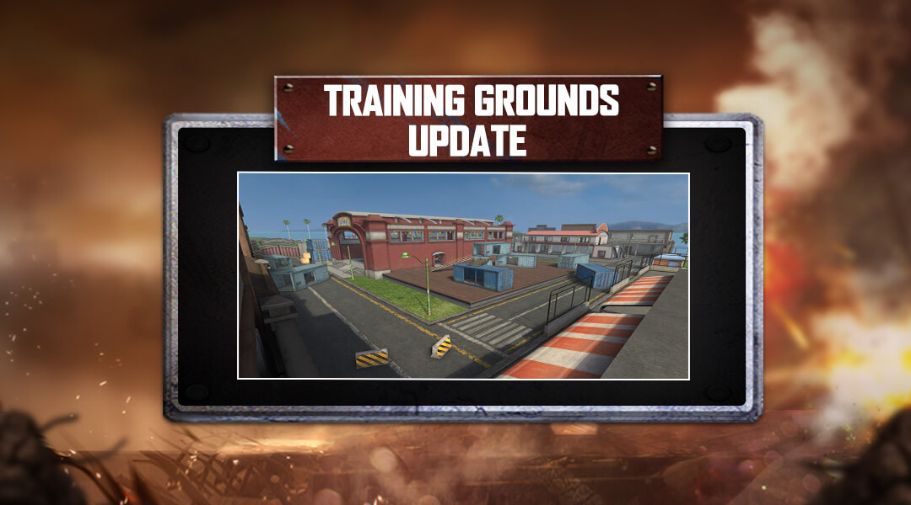
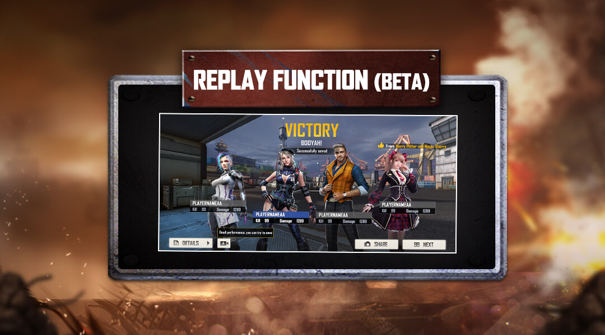

# Free Fire · OB30 · BOOYAH DAY（2021 年 9 月补丁）

- 公告日期：2021-09-28
- 官方来源：[PATCH NOTE: BOOYAH DAY](https://ff.garena.com/en/article/505/)
- 审阅日期：2026-09-19
- 19 个分类小节；29 项说明及表格行；4 张官方公告插图。

逐项复核本篇 BR、CS 与通用局内章节；独立玩法和局外内容另列目录处置。未将公告日期当作统一上线日期。全部正文图已归档并按实际图像内容关联。

公告日：2021-09-28；正文未列统一生效时间。

## BR · 大逃杀

### BR：空投售货机

- 归属：BR · 大逃杀 / 常规调整
- 原文小节：Battle Royale > Airdrop Vending Machine
- 时间：公告日：2021-09-28；正文未列统一生效时间。

BR：复活点提示与空投售货机。原文：Battle Royale。[官方原图](https://cdn.wildflamestudio.com/common/web_event/aswqooiwd/GltZw/en_2.jpg) · 1080×600。

- BR 普通与排位加入空投售货机，玩家可在更多位置使用 FF Coins。

### BR：复活点提示与占领

- 归属：BR · 大逃杀 / 常规调整
- 原文小节：Battle Royale > Revival Points
- 时间：公告日：2021-09-28；正文未列统一生效时间。

- 新增本局复活点关闭倒计时。
- 地图新增复活点冷却倒计时。
- 地图显示正在被占领的复活点。
- 玩家占领过程中，复活点不再中途消失。
- 观战正在占领复活点的玩家时，优化 HUD 显示。

### BR：安全区外伤害

- 归属：BR · 大逃杀 / 常规调整
- 原文小节：Battle Royale > Play Zone Adjustment
- 时间：公告日：2021-09-28；正文未列统一生效时间。

- 安全区外伤害提高 10%；原文称 play zone damage，说明段明确针对留在安全区外等待其他玩家被淘汰的行为。
- 伤害增长提高 3%；原文未给出增长周期和具体计算公式。

### BR：防爆护甲附件

- 归属：BR · 大逃杀 / 常规调整
- 原文小节：Weapon and Balance > Armor Attachments
- 时间：公告日：2021-09-28；正文未列统一生效时间。

- 新增 Vest Thickener，装备在防弹衣上，降低爆炸伤害；该公告未给减伤值。

### BR：生命值护甲附件

- 归属：BR · 大逃杀 / 常规调整
- 原文小节：Weapon and Balance > Armor Attachments
- 时间：公告日：2021-09-28；正文未列统一生效时间。

- 新增 Vest HP Booster，装备在防弹衣上，增加 HP；该公告未给增量。

### BR：Treatment Sniper 治疗狙击枪

- 归属：BR · 大逃杀 / 常规调整
- 原文小节：Weapon and Balance > Treatment Sniper
- 时间：公告日：2021-09-28；正文未列统一生效时间。

- 新增可治疗队友的 Treatment Sniper：基础伤害 70、治疗强度 50、射速字段 0.45（未列单位）。

## CS · 枪王对决

### CS：Clock Tower 与 Mars Electric

- 归属：CS · 枪王对决 / 常规调整
- 原文小节：Clash Squad > Map Adjustment
- 时间：公告日：2021-09-28；正文未列统一生效时间。

CS：出生点调整、局内段位星数与自定义 6v6。原文：Clash Squad。[官方原图](https://cdn.wildflamestudio.com/common/web_event/aswqooiwd/GltZw/en_1.jpg) · 1080×600。

- Bermuda 的 Clock Tower 调整双方出生点；说明指出低处出生方此前较难交战。
- Mars Electric 调整作战区域，使仓库位于区域中央。原文合并列出两处的区域与出生点调整，未给具体坐标。

## 通用局内调整

### Chrono：移速、持续与冷却

- 归属：通用局内调整 / 常规调整
- 原文小节：Character and Pets > Chrono
- 时间：公告日：2021-09-28；正文未列统一生效时间。

原文通用章节，未单列适用模式；不据此推定所有独立玩法规则相同。

- Time Turner 的移动速度增益：5/7/9/11/13/15%→5/6/7/8/9/10%。
- 持续时间：3/4/5/6/7/8 秒→3/3/4/4/5/5 秒。
- 冷却：200/192/185/179/174/170 秒→250/242/235/229/224/220 秒。

### Wukong：伪装期间移动

- 归属：通用局内调整 / 常规调整
- 原文小节：Character and Pets > Wukong
- 时间：公告日：2021-09-28；正文未列统一生效时间。

原文通用章节，未单列适用模式；不据此推定所有独立玩法规则相同。

- 激活 Camouflage 时，移动速度降低 20%。

### 觉醒 Andrew：减伤

- 归属：通用局内调整 / 常规调整
- 原文小节：Character and Pets > Andrew "The Fierce"
- 时间：公告日：2021-09-28；正文未列统一生效时间。

原文通用章节，未单列适用模式；不据此推定所有独立玩法规则相同。

- Wolfpack 减伤：8/9/10/11/12/14%→5/7/8/9/10/11%。

### Shirou：技能冷却

- 归属：通用局内调整 / 常规调整
- 原文小节：Character and Pets > Shirou
- 时间：公告日：2021-09-28；正文未列统一生效时间。

原文通用章节，未单列适用模式；不据此推定所有独立玩法规则相同。

- Damage Delivered 冷却：35/34/32/29/25/20 秒→25/24/22/19/15/10 秒。

### SPAS-12：射程

- 归属：通用局内调整 / 常规调整
- 原文小节：Weapon and Balance > SPAS-12
- 时间：公告日：2021-09-28；正文未列统一生效时间。

原文通用章节，未单列适用模式；不据此推定所有独立玩法规则相同。

- 射程 +10%。

### FF-Knife：伤害与射速

- 归属：通用局内调整 / 常规调整
- 原文小节：Weapon and Balance > FF-Knife
- 时间：公告日：2021-09-28；正文未列统一生效时间。

原文通用章节，未单列适用模式；不据此推定所有独立玩法规则相同。

- 基础伤害 +50%、射速 +20%。

### 手雷：最大伤害

- 归属：通用局内调整 / 常规调整
- 原文小节：Weapon and Balance > Grenade
- 时间：公告日：2021-09-28；正文未列统一生效时间。

原文通用章节，未单列适用模式；不据此推定所有独立玩法规则相同。

- 最大伤害降低 25%。

### P90：射程

- 归属：通用局内调整 / 常规调整
- 原文小节：Weapon and Balance > P90
- 时间：公告日：2021-09-28；正文未列统一生效时间。

原文通用章节，未单列适用模式；不据此推定所有独立玩法规则相同。

- 射程 +10%。

### AWM：护甲穿透

- 归属：通用局内调整 / 常规调整
- 原文小节：Weapon and Balance > AWM
- 时间：公告日：2021-09-28；正文未列统一生效时间。

原文通用章节，未单列适用模式；不据此推定所有独立玩法规则相同。

- 护甲穿透 +8%。

### SKS：开镜伤害

- 归属：通用局内调整 / 常规调整
- 原文小节：Weapon and Balance > SKS
- 时间：公告日：2021-09-28；正文未列统一生效时间。

原文通用章节，未单列适用模式；不据此推定所有独立玩法规则相同。

- 开镜时最低伤害 +25%。

### Vector：装填与双持数值

- 归属：通用局内调整 / 常规调整
- 原文小节：Weapon and Balance > Vector
- 时间：公告日：2021-09-28；正文未列统一生效时间。

原文通用章节，未单列适用模式；不据此推定所有独立玩法规则相同。

- 装填时间减少 20%；射速降低 5%；弹药数量减少 5（原文字段为 Ammo，未进一步注明容量含义）。
- 双持射速降低 20%，双持移动速度降低 4%；与上一条单列的射速变化分别保留，原文未解释二者叠加方式。

### 拆分丢弃与诱饵小地图

- 归属：通用局内调整 / 常规调整
- 原文小节：Optimization and Bug Fixes
- 时间：公告日：2021-09-28；正文未列统一生效时间。

原文通用章节，未单列适用模式；不据此推定所有独立玩法规则相同。

- 丢弃物品时可以拆分数量。
- 优化 Decoy Grenade 在小地图上的显示。

## 其他玩法与局外内容（目录摘要）

### CS 6v6 自定义房

新增 6v6 CS，仅在自定义房间提供；作为已有独立规则变体关联。

原文目录：Clash Squad > New - 6v6 Clash Squad!

### 训练场战斗区布局

移除 Combat Zone 的部分物件，提高敌人的可见性；未列逐个物件或坐标。独立训练场更新。

原文目录：Training Grounds > Combat Zone

### Jai 技能芯片获取

商城新增 Jai 的芯片，用于获得其 Raging Reload 技能。此处只改变获取途径，未公布技能规则调整。

原文目录：Character and Pets > Jai"s Microchip

### 回放系统 Beta

个人资料页新增回放 Beta，仅面向部分设备；未列具体设备清单。

原文目录：Gameplay and System > Replay System (Beta)

### 公会界面与箱子

更新公会 UI；新增可与队伍成员分享的公会箱子。

原文目录：Gameplay and System > Guild System

### 排位星数与组队气泡

局内 CS 排行榜增加玩家排位星数（配图称 Heroic Stars）；组队菜单新增聊天气泡。分别属于排名展示和组队社交。

原文目录：Optimization and Bug Fixes

## 其余原文配图

以下为尚未在上述小节内展示的原文图片，包括局外章节配图。

训练场 Combat Zone 布局。原文：Training Grounds。[官方原图](https://cdn.wildflamestudio.com/common/web_event/aswqooiwd/GltZw/en_6.jpg) · 1080×600。

个人资料页回放 Beta。原文：Gameplay and System > Replay System (Beta)。[官方原图](https://cdn.wildflamestudio.com/common/web_event/aswqooiwd/GltZw/en_5.jpg) · 1080×600。

## 官方图片索引

正文图片按相关小节展示，版本总览及其他章节插图另列；同一原图只嵌入一次。

- [CS：出生点调整、局内段位星数与自定义 6v6](https://cdn.wildflamestudio.com/common/web_event/aswqooiwd/GltZw/en_1.jpg) · 1080×600 · 本地 `assets/ff-patches/505-01.jpg`
- [BR：复活点提示与空投售货机](https://cdn.wildflamestudio.com/common/web_event/aswqooiwd/GltZw/en_2.jpg) · 1080×600 · 本地 `assets/ff-patches/505-02.jpg`
- [训练场 Combat Zone 布局](https://cdn.wildflamestudio.com/common/web_event/aswqooiwd/GltZw/en_6.jpg) · 1080×600 · 本地 `assets/ff-patches/505-03.jpg`
- [个人资料页回放 Beta](https://cdn.wildflamestudio.com/common/web_event/aswqooiwd/GltZw/en_5.jpg) · 1080×600 · 本地 `assets/ff-patches/505-04.jpg`

## 版本关联来源

### [官方关联公告](https://ff.garena.com/en/article/617/)

同日期补丁镜像；正文数字和4张正文图一致，另有 COMMON FEATURES 标题及标点差异，不重复计为一个版本。

### [OB30官方编号依据](https://ff.garena.com/vn/article/574/)

越南官方摘要明确OB30，标题标注2021年9月28日；CS 6v6与Chrono数值改动对应。页面2021年12月30日为转载日期。

## 原文目录（对照用）

- Clash Squad
- New - 6v6 Clash Squad!
- Map Adjustment
- Battle Royale
- Airdrop Vending Machine
- Revival Points
- Play Zone Adjustment
- Training Grounds
- Combat Zone
- Character and Pets
- Chrono
- Wukong
- Andrew "The Fierce"
- Shirou
- Jai"s Microchip
- Weapon and Balance
- Armor Attachments
- Treatment Sniper
- SPAS-12
- FF-Knife
- Grenade
- P90
- AWM
- SKS
- Vector
- Gameplay and System
- Replay System (Beta)
- Guild System
- Optimization and Bug Fixes
