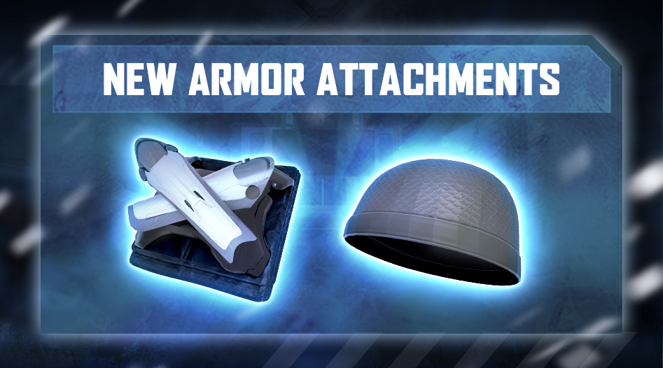
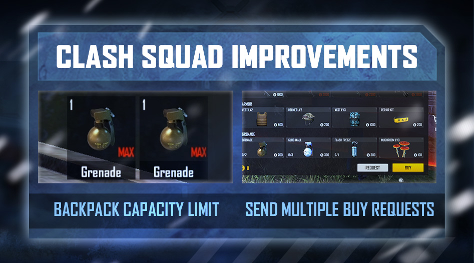
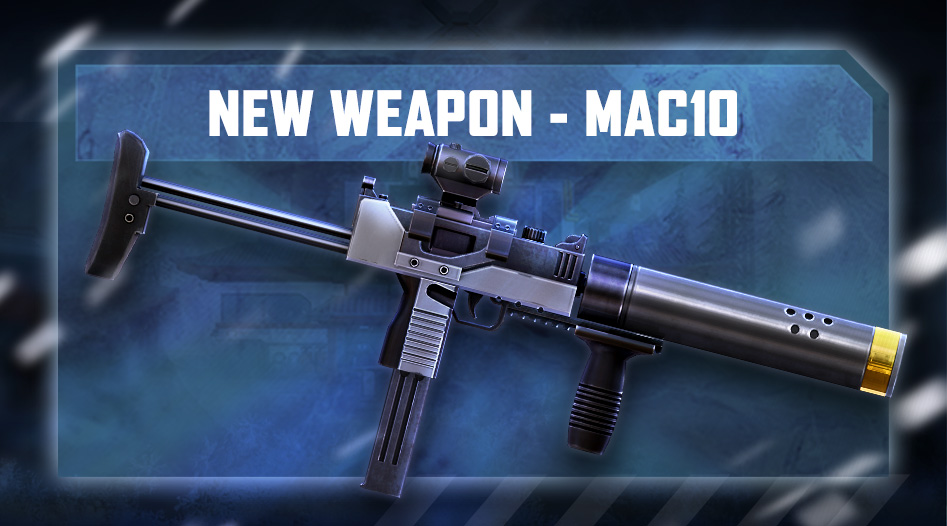
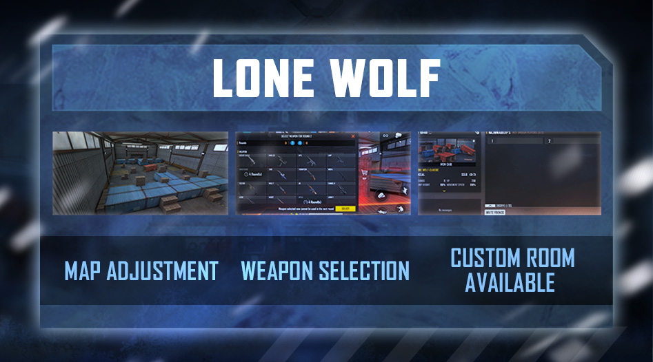

# Free Fire · OB31 · New Age（2021 年 12 月补丁）

- 公告日期：2021-12-01
- 官方来源：[PATCH NOTE: NEW AGE](https://ff.garena.com/en/article/541/)
- 审阅日期：2026-09-19
- 32 个分类小节；47 项说明及表格行；5 张官方公告插图。

逐项复核本篇 BR、CS 与通用局内章节；独立玩法和局外内容另列目录处置。未将公告日期当作统一上线日期。全部正文图已归档并按实际图像内容关联。

公告日：2021-12-01；正文未列统一生效时间。

## BR · 大逃杀

### BR：FF Coins 掉落

- 归属：BR · 大逃杀 / 常规调整
- 原文小节：Battle Royale > FF Coins
- 时间：公告日：2021-12-01；正文未列统一生效时间。

- 增加地图上的金币掉落，最低金币堆数量调整为 100。
- 金币堆外观随该堆数量变化。
- 小节副标题还提到售货机物品调整，但正文未列物品清单或价格，未补造具体商品变动。

### BR：四肢减伤护甲附件

- 归属：BR · 大逃杀 / 常规调整
- 原文小节：Battle Royale > Armor Attachments
- 时间：公告日：2021-12-01；正文未列统一生效时间。

BR：Vest Enlarger 与 Helmet Thickener。原文：Battle Royale > Armor Attachments。[官方原图](https://cdn.wildflamestudio.com/common/web_event/aswqooiwd/ac68c/en_3.jpg) · 947×526。

- 新增 Vest Enlarger，四肢所受伤害减少 25%。

### BR：爆头减伤头盔附件

- 归属：BR · 大逃杀 / 常规调整
- 原文小节：Battle Royale > Armor Attachments
- 时间：公告日：2021-12-01；正文未列统一生效时间。

- 新增 Helmet Thickener，所受爆头伤害减少 36%。

### BR：跳伞地面地点名

- 归属：BR · 大逃杀 / 常规调整
- 原文小节：Optimizations
- 时间：公告日：2021-12-01；正文未列统一生效时间。

- BR 跳伞时，地面上显示地点名称。

## CS · 枪王对决

### CS：连续请求购买物品

- 归属：CS · 枪王对决 / 常规调整
- 原文小节：Clash Squad > Item Request
- 时间：公告日：2021-12-01；正文未列统一生效时间。

CS：投掷物携带限制与连续购买请求。原文：Clash Squad。[官方原图](https://cdn.wildflamestudio.com/common/web_event/aswqooiwd/ac68c/en_1.jpg) · 947×526。

- 上一次请求已满足后，可以继续发送物品购买请求。
- 发送物品请求时触发无线电指令。

### CS：Academy 与 Mill 地图调整

- 归属：CS · 枪王对决 / 常规调整
- 原文小节：Clash Squad > Map Balancing
- 时间：公告日：2021-12-01；正文未列统一生效时间。

- 调整 Academy 与 Mill 区域；说明指出 Mill 低处出生方此前需要向高处交战。原文未列具体掩体、坐标或通路改法。

### CS：投掷物携带上限

- 归属：CS · 枪王对决 / 常规调整
- 原文小节：Clash Squad > Backpack Limit
- 时间：公告日：2021-12-01；正文未列统一生效时间。

- 回合内和带入下一回合的功能投掷物数量都不能超过上限；说明意图是携带数量不高于允许购买数量。
- 原文以此前能携带超过 3 个冰墙或功能投掷物说明问题，但未给所有道具的统一新上限；不将“3”泛化为全部道具限制。

### CS：自定义房间动态安全区

- 归属：CS · 枪王对决 / 常规调整
- 原文小节：Optimizations
- 时间：公告日：2021-12-01；正文未列统一生效时间。

- CS 自定义房间加入动态安全区（Dynamic play zone）；原文未列缩圈参数。

## 通用局内调整

### Chrono：双向阻挡力场

- 归属：通用局内调整 / 常规调整
- 原文小节：Character > Chrono
- 时间：公告日：2021-12-01；正文未列统一生效时间。

原文通用章节，未单列适用模式；不据此推定所有独立玩法规则相同。

- Time Turner 可阻挡伤害：600→800；伤害来源由敌人改为所有来源。
- 持续时间：3/3/4/4/5/5 秒→4/4/5/5/6/6 秒；冷却：250/242/235/229/224/220 秒→180/164/150/138/128/120 秒。
- 移除从力场内向外射击的能力，力场阻挡来自内外两侧的所有伤害。
- 移除原先 5/6/7/8/9/10% 的移动速度增益。

### Maxim：食物与医疗包使用速度

- 归属：通用局内调整 / 常规调整
- 原文小节：Character > Maxim
- 时间：公告日：2021-12-01；正文未列统一生效时间。

原文通用章节，未单列适用模式；不据此推定所有独立玩法规则相同。

- Gluttony 的进食和医疗包使用加速：15/18/22/27/33/40%→5/8/12/17/23/30%。

### K：EP 回复量、间隔与上限

- 归属：通用局内调整 / 常规调整
- 原文小节：Character > K
- 时间：公告日：2021-12-01；正文未列统一生效时间。

原文通用章节，未单列适用模式；不据此推定所有独立玩法规则相同。

- Psychology Mode 每次回复：2→3 EP。
- 各级回复间隔：3/2.8/2.6/2.4/2.2/2 秒→2.2/2/1.8/1.6/1.4/1 秒。
- 各级 EP 上限：100/110/120/130/140/150→150/170/190/210/230/250。

### D-Bee：射击精度

- 归属：通用局内调整 / 常规调整
- 原文小节：Character > D-Bee
- 时间：公告日：2021-12-01；正文未列统一生效时间。

原文通用章节，未单列适用模式；不据此推定所有独立玩法规则相同。

- Bullet Beats 的精度增益：10/13/17/22/28/35%→20/23/27/32/38/45%。

### Thiva：救援速度

- 归属：通用局内调整 / 常规调整
- 原文小节：Character > Thiva
- 时间：公告日：2021-12-01；正文未列统一生效时间。

原文通用章节，未单列适用模式；不据此推定所有独立玩法规则相同。

- Vital Vibes 的扶起队友速度增益：5/8/11/14/17/20%→10/13/16/19/22/25%。原文数值是速度增益，未改写为救援耗时减少比例。

### MAC10：新增带消音器的 SMG

- 归属：通用局内调整 / 常规调整
- 原文小节：Weapon and Balance > New Weapon MAC10
- 时间：公告日：2021-12-01；正文未列统一生效时间。

原文通用章节，未单列适用模式；不据此推定所有独立玩法规则相同。

新增 MAC10 及其消音器。原文：Weapon and Balance > New Weapon MAC10。[官方原图](https://cdn.wildflamestudio.com/common/web_event/aswqooiwd/ac68c/en_5.jpg) · 947×526。

- 基础伤害 24、射速字段 0.09（未列单位），自带 Dead Silent 消音器。说明称可应对重甲敌人，但未给护甲穿透数值。

### UMP：射程与装填时间

- 归属：通用局内调整 / 常规调整
- 原文小节：Weapon and Balance > Range Adjustments / UMP and XM8
- 时间：公告日：2021-12-01；正文未列统一生效时间。

射程调整的说明段明确写适用于所有游戏模式；其他属性按其各自小节记录。

- 有效射程降低 5%；装填时间增加 5%。

### MP5：有效射程

- 归属：通用局内调整 / 常规调整
- 原文小节：Weapon and Balance > Range Adjustments
- 时间：公告日：2021-12-01；正文未列统一生效时间。

射程调整的说明段明确写适用于所有游戏模式；其他属性按其各自小节记录。

- 有效射程降低 3%。

### Thompson：有效射程

- 归属：通用局内调整 / 常规调整
- 原文小节：Weapon and Balance > Range Adjustments
- 时间：公告日：2021-12-01；正文未列统一生效时间。

射程调整的说明段明确写适用于所有游戏模式；其他属性按其各自小节记录。

- 有效射程降低 3%。

### UZI：有效射程

- 归属：通用局内调整 / 常规调整
- 原文小节：Weapon and Balance > Range Adjustments
- 时间：公告日：2021-12-01；正文未列统一生效时间。

射程调整的说明段明确写适用于所有游戏模式；其他属性按其各自小节记录。

- 有效射程降低 5%。

### MAG-7：有效射程

- 归属：通用局内调整 / 常规调整
- 原文小节：Weapon and Balance > Range Adjustments
- 时间：公告日：2021-12-01；正文未列统一生效时间。

射程调整的说明段明确写适用于所有游戏模式；其他属性按其各自小节记录。

- 有效射程降低 3%。

### SCAR：后坐力

- 归属：通用局内调整 / 常规调整
- 原文小节：Weapon and Balance > SCAR
- 时间：公告日：2021-12-01；正文未列统一生效时间。

原文通用章节，未单列适用模式；不据此推定所有独立玩法规则相同。

- 后坐力降低 10%。

### M60：机枪模式后坐力

- 归属：通用局内调整 / 常规调整
- 原文小节：Weapon and Balance > M60
- 时间：公告日：2021-12-01；正文未列统一生效时间。

原文通用章节，未单列适用模式；不据此推定所有独立玩法规则相同。

- 下蹲或趴下进入机枪模式时，后坐力降低 30%。

### XM8：装填时间

- 归属：通用局内调整 / 常规调整
- 原文小节：Weapon and Balance > UMP and XM8
- 时间：公告日：2021-12-01；正文未列统一生效时间。

原文通用章节，未单列适用模式；不据此推定所有独立玩法规则相同。

- 装填时间增加 5%，即装填变慢。

### MP5-X：射速

- 归属：通用局内调整 / 常规调整
- 原文小节：Weapon and Balance > MP5-X
- 时间：公告日：2021-12-01；正文未列统一生效时间。

原文通用章节，未单列适用模式；不据此推定所有独立玩法规则相同。

- 射速提高 5%。

### Kar98k：射速

- 归属：通用局内调整 / 常规调整
- 原文小节：Weapon and Balance > Kar98k
- 时间：公告日：2021-12-01；正文未列统一生效时间。

原文通用章节，未单列适用模式；不据此推定所有独立玩法规则相同。

- 射速提高 10%。

### Groza：护甲穿透

- 归属：通用局内调整 / 常规调整
- 原文小节：Weapon and Balance > Groza
- 时间：公告日：2021-12-01；正文未列统一生效时间。

原文通用章节，未单列适用模式；不据此推定所有独立玩法规则相同。

- 护甲穿透提高 20%。

### 换枪时间

- 归属：通用局内调整 / 常规调整
- 原文小节：Weapon and Balance > Weapon Swap Time
- 时间：公告日：2021-12-01；正文未列统一生效时间。

原文通用章节，未单列适用模式；不据此推定所有独立玩法规则相同。

- 不同武器类型使用不同换枪时间；原文说明拔出手枪最快，未给各类武器的具体时间。

### 闪光弹：被致盲目标提示

- 归属：通用局内调整 / 常规调整
- 原文小节：Weapon and Balance > Flashbang
- 时间：公告日：2021-12-01；正文未列统一生效时间。

原文通用章节，未单列适用模式；不据此推定所有独立玩法规则相同。

- 加强被闪光弹致盲目标的显示标识，便于使用者、队友及其他玩家识别。

### 协助击倒通知

- 归属：通用局内调整 / 常规调整
- 原文小节：Gameplay > Assist Notifications
- 时间：公告日：2021-12-01；正文未列统一生效时间。

原文通用章节，未单列适用模式；不据此推定所有独立玩法规则相同。

- 协助队友击倒自己攻击过的敌人时，在 HUD 上显示助攻通知。

### 物品标记与敌人提醒

- 归属：通用局内调整 / 常规调整
- 原文小节：Gameplay > Pin Marker
- 时间：公告日：2021-12-01；正文未列统一生效时间。

原文通用章节，未单列适用模式；不据此推定所有独立玩法规则相同。

- 可标记游戏中的对象、载具和物品。
- 双击标记按钮，提醒队友附近有敌人；不是自动探测敌人。

### 自由视角显示条件

- 归属：通用局内调整 / 常规调整
- 原文小节：Gameplay > Free Look
- 时间：公告日：2021-12-01；正文未列统一生效时间。

原文通用章节，未单列适用模式；不据此推定所有独立玩法规则相同。

- 新增设置：仅在跳伞或驾驶时启用自由视角；这是可选设置，未移除其他使用方式。

### 拖动与点击冲刺

- 归属：通用局内调整 / 常规调整
- 原文小节：Gameplay > Sprint Options
- 时间：公告日：2021-12-01；正文未列统一生效时间。

原文通用章节，未单列适用模式；不据此推定所有独立玩法规则相同。

- 冲刺设置可同时采用拖动与点击两种操作。

### 战斗界面、动画与声音

- 归属：通用局内调整 / 常规调整
- 原文小节：Optimizations
- 时间：公告日：2021-12-01；正文未列统一生效时间。

原文通用章节，未单列适用模式；不据此推定所有独立玩法规则相同。

- 使用无线电指令的玩家会在小地图上闪烁。
- 优化近战武器动画。
- 优化安全区外画面，提高可见性。
- 优化个人空投的冷却显示。
- 设置菜单可调整连杀通知音量。
- 战斗中不再触发武器与皮肤的特效。

## 其他玩法与局外内容（目录摘要）

### Lone Wolf限时规则

Lone Wolf 限时返场，未列起止日。每两回合，双方轮流选择自己及对手要用的武器；被选武器再次可选前有冷却，未给时长。扩大 Iron Cage 部分区域，说明以 2v2 空间不足为原因。同页配图还标注支持自定义房间。

原文目录：Lone Wolf

### Master段位

Heroic后可达到Master，属排位系统。

原文目录：Rank Mode

### Guild申请段位

Guild leaders/elders设置申请人的最低CS段位。

原文目录：Optimizations

### Training Grounds自动冰墙

训练场combat zone自动获得Gloo Walls。

原文目录：Optimizations

### Universal Fragments与Battle tags

优化升级菜单中的通用碎片显示，以及 Battle Tags 特效；后者原文未解释触发场景，按展示项留目录记录。

原文目录：Optimizations

### 好友别名与Hardcore房间

可给好友添加别名；Hardcore 模式支持自定义房间，属于独立玩法候选，原文未列新规则。

原文目录：Optimizations

## 其余原文配图

以下为尚未在上述小节内展示的原文图片，包括局外章节配图。

Lone Wolf：区域扩大、轮流选武器及自定义房间。原文：Lone Wolf。[官方原图](https://cdn.wildflamestudio.com/common/web_event/aswqooiwd/ac68c/en_2.jpg) · 947×526。

新增 Master 段位。原文：Rank Mode。[官方原图](https://cdn.wildflamestudio.com/common/web_event/aswqooiwd/ac68c/en_4.jpg) · 947×526。

## 官方图片索引

正文图片按相关小节展示，版本总览及其他章节插图另列；同一原图只嵌入一次。

- [Lone Wolf：区域扩大、轮流选武器及自定义房间](https://cdn.wildflamestudio.com/common/web_event/aswqooiwd/ac68c/en_2.jpg) · 947×526 · 本地 `assets/ff-patches/541-01.jpg`
- [新增 Master 段位](https://cdn.wildflamestudio.com/common/web_event/aswqooiwd/ac68c/en_4.jpg) · 947×526 · 本地 `assets/ff-patches/541-02.jpg`
- [CS：投掷物携带限制与连续购买请求](https://cdn.wildflamestudio.com/common/web_event/aswqooiwd/ac68c/en_1.jpg) · 947×526 · 本地 `assets/ff-patches/541-03.jpg`
- [BR：Vest Enlarger 与 Helmet Thickener](https://cdn.wildflamestudio.com/common/web_event/aswqooiwd/ac68c/en_3.jpg) · 947×526 · 本地 `assets/ff-patches/541-04.jpg`
- [新增 MAC10 及其消音器](https://cdn.wildflamestudio.com/common/web_event/aswqooiwd/ac68c/en_5.jpg) · 947×526 · 本地 `assets/ff-patches/541-05.jpg`

## 版本关联来源

### [OB31官方编号依据](https://ff.garena.com/vn/article/581/)

越南官方标题明确OB31：NEW AGE；Chrono护盾600→800、K及MAC10对应。2021年12月30日为地区转载日期，保留英文12月1日公告日期。

## 原文目录（对照用）

- Character
- Chrono
- Maxim
- K
- D-Bee
- Thiva
- Lone Wolf
- Store Adjustments
- Map Adjustments
- Rank Mode
- New Rank - Master
- Clash Squad
- Item Request
- Map Balancing
- Backpack Limit
- Battle Royale
- FF Coins
- Armor Attachments
- Weapon and Balance
- New Weapon MAC10
- Range Adjustments
- SCAR
- M60
- UMP and XM8
- MP5-X
- Kar98k
- Groza
- Weapon Swap Time
- Flashbang
- Gameplay
- Assist Notifications
- Pin Marker
- Free Look
- Sprint Options
- Optimizations
