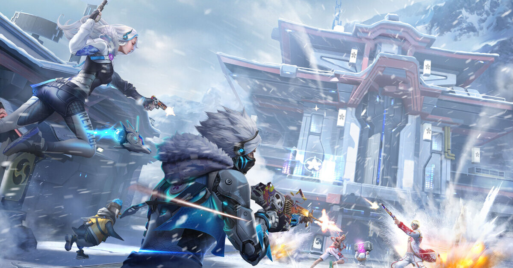
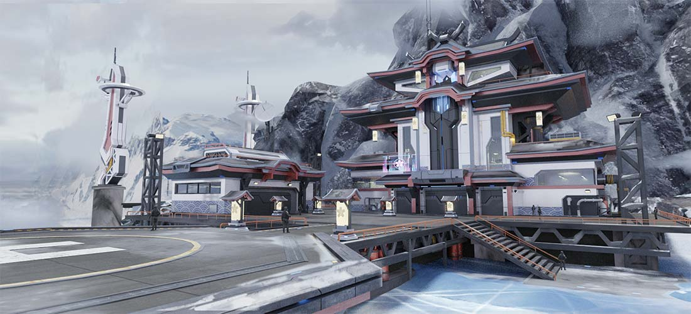
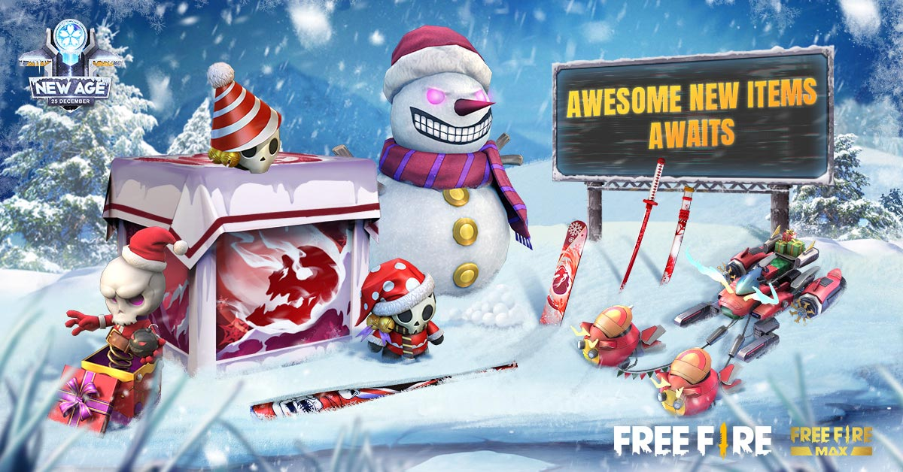

# Free Fire · 2021年New Age活动预告

- 公告日期：2021-12-13
- 官方来源：[[NEW AGE] IT"S COMING SOON](https://ff.garena.com/en/article/550/)
- 审阅日期：2026-09-19
- 1 个分类小节；1 项说明及表格行；4 张官方公告插图。

主流程通读正文并逐项复核；公告日期与活动日期分开，所有正文图归档展示。未在原文核实的OB号不推算。

公告日2021-12-13；各项实际状态及活动期限见小节。

New Age主题图。原文：[NEW AGE] IT"S COMING SOON。[官方原图](https://cdn.wildflamestudio.com/common/web_event/hash/50daba2776b6672d3ceb86f4cf470180jpg) · 1200×628。

New Age角色服装。原文：[NEW AGE] IT"S COMING SOON。[官方原图](https://cdn.wildflamestudio.com/common/web_event/hash/f02d513b7e5fe366da3c4bded6da0fc2jpg) · 960×540。

Alpine雪景建筑预览。原文：[NEW AGE] IT"S COMING SOON。[官方原图](https://cdn.wildflamestudio.com/common/web_event/hash/518a3a3758c7b6d324d6e1f06bf88018jpg) · 1100×500。

冬季服装与宠物主题图。原文：[NEW AGE] IT"S COMING SOON。[官方原图](https://cdn.wildflamestudio.com/common/web_event/hash/41a36f851de16fc4330d9d254e5425dajpg) · 1200×628。

## BR · 大逃杀

## CS · 枪王对决

## 通用局内调整

### 出生岛雪球互动

- 归属：通用局内调整 / 活动覆盖
- 原文小节：New ways to enjoy New Age: new activities, modes, and features
- 时间：活动预告2021-12-17～2022-01-09；本篇没有逐项独立期限。

- New Age活动期间，出生岛新增雪球功能，玩家准备进入比赛时可与其他玩家打雪仗；未给伤害、冷却或雪球数量。

## 其他玩法与局外内容（目录摘要）

### Alpine预告与剧情

预告Alpine为新永久地图；本篇未给地图开放日。剧情为Wolfrahh、Misha、Mr. Waggor运送的能量核心被偷，岛屿陷入暴风雪；剧情不当作对局天气数值。

原文目录：New Age: An icy turn of events

### 资源经营活动

新增活动要求管理资源、建设营地、向Alpine居民运送物资，完成后获得主题道具；没有证据它在常规BR对局运行。

原文目录：New ways to enjoy New Age

### 独狼排位与Iron Cage

12月20日独狼引入排位系统；1v1与2v2在更大的Iron Cage回归。独立玩法不归入CS。

原文目录：New ways to enjoy New Age

### 主题收藏

活动含限定服装、皮肤及新宠物，更多细节后续发布；本篇未给宠物技能。

原文目录：Deck out in your favourite winter ensemble

## 官方图片索引

正文图片按相关小节展示，版本总览及其他章节插图另列；同一原图只嵌入一次。

- [New Age主题图](https://cdn.wildflamestudio.com/common/web_event/hash/50daba2776b6672d3ceb86f4cf470180jpg) · 1200×628 · 本地 `assets/ff-patches/550-01.jpg`
- [New Age角色服装](https://cdn.wildflamestudio.com/common/web_event/hash/f02d513b7e5fe366da3c4bded6da0fc2jpg) · 960×540 · 本地 `assets/ff-patches/550-02.jpg`
- [Alpine雪景建筑预览](https://cdn.wildflamestudio.com/common/web_event/hash/518a3a3758c7b6d324d6e1f06bf88018jpg) · 1100×500 · 本地 `assets/ff-patches/550-03.jpg`
- [冬季服装与宠物主题图](https://cdn.wildflamestudio.com/common/web_event/hash/41a36f851de16fc4330d9d254e5425dajpg) · 1200×628 · 本地 `assets/ff-patches/550-04.jpg`

## 版本关联来源

### [Alpine开放日及POI详解](https://ff.garena.com/en/article/569/)

后续公告确认2022年1月1日地图开放；本篇12月17日是活动开始，不作为地图实装日。

### [New Age春季阶段预告](https://ff.garena.com/en/article/562/)

12月27日至1月9日为春季阶段；12月27日的VR地图体验位于活动网站，不是常规BR地图已实装。

## 原文目录（对照用）

- [NEW AGE] IT"S COMING SOON
