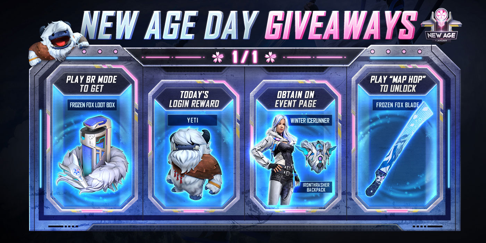
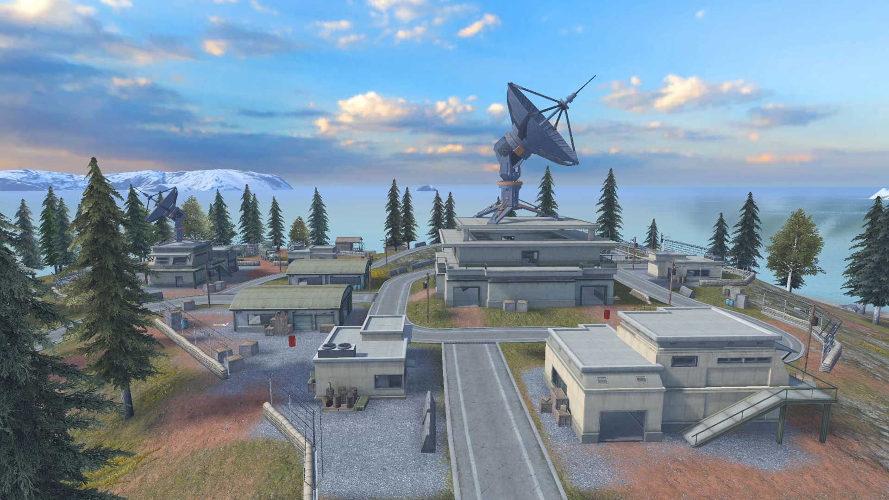
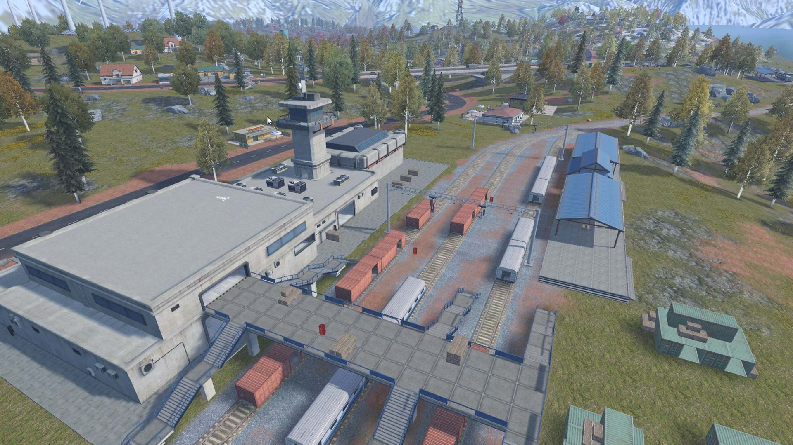
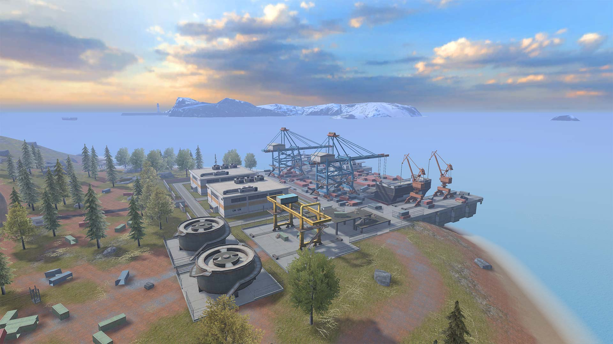
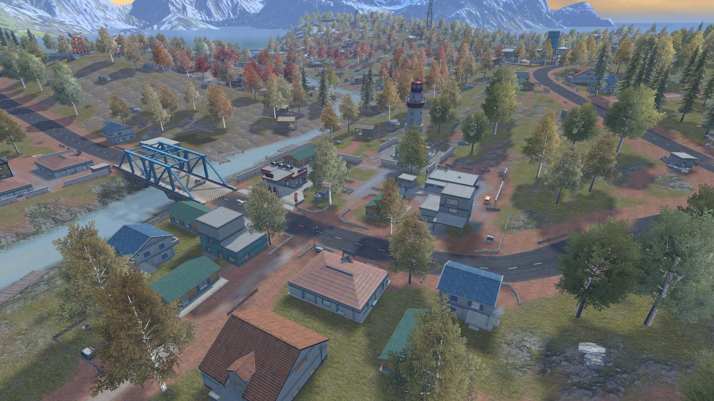
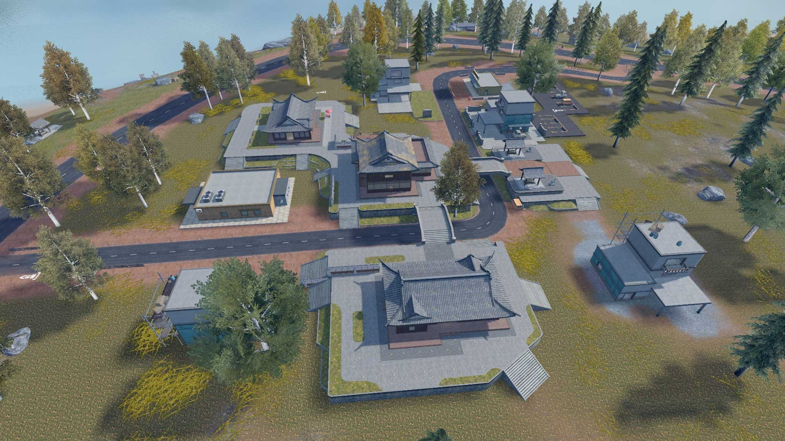

# Free Fire · 2022年Alpine地图开放预告

- 公告日期：2021-12-29
- 官方来源：[[NEW AGE] THE NEW AGE DAY](https://ff.garena.com/en/article/569/)
- 审阅日期：2026-09-19
- 6 个分类小节；6 项说明及表格行；6 张官方公告插图。

主流程通读正文并逐项复核；公告日期与活动日期分开，所有正文图归档展示。未在原文核实的OB号不推算。

公告日2021-12-29；各项实际状态及活动期限见小节。

1月1日New Age Day奖励总览。原文：[NEW AGE] THE NEW AGE DAY。[官方原图](https://cdn.wildflamestudio.com/common/web_event/hash/e71fcfaa06d3f449b7d8a007d0cbcf3djpg) · 1400×700。

## BR · 大逃杀

### Alpine永久地图开放日

- 归属：BR · 大逃杀 / 常规调整
- 原文小节：A new island for Survivors to explore and discover
- 时间：2021-12-29公告预告2022-01-01开放。

- Alpine预定2022年1月1日开放，原文明示为永久地图；本篇没有明确列出BR排位与CS各自的开放安排。

### Alpine：Vantage

- 归属：BR · 大逃杀 / 常规调整
- 原文小节：Vantage
- 时间：地图预告2022-01-01开放。

Vantage区域。原文：Vantage。[官方原图](https://cdn.wildflamestudio.com/common/web_event/hash/19f6940e9524b70813cae2fbe7be0c28jpg) · 1920×1080。

- 由多种结构的建筑与贯穿其间的宽阔道路构成，中央仓库是重要争夺位置。

### Alpine：Railroad

- 归属：BR · 大逃杀 / 常规调整
- 原文小节：Railroad
- 时间：地图预告2022-01-01开放。

Railroad区域。原文：Railroad。[官方原图](https://cdn.wildflamestudio.com/common/web_event/hash/8237311179fbbeb0223dd7bb83273b3bjpg) · 1920×1080。

- 以车站为中心，站台设有小屋，天桥制高点是争夺位置。原文称there is no safe zone in this area，是区域危险描述，没有足够证据把它解释成毒圈永不覆盖该POI。

### Alpine：Dock

- 归属：BR · 大逃杀 / 常规调整
- 原文小节：Dock
- 时间：地图预告2022-01-01开放。

Dock区域。原文：Dock。[官方原图](https://cdn.wildflamestudio.com/common/web_event/hash/62e37d8f2bb5bc156e88d724b80bdeb6jpg) · 1920×1080。

- 除两座仓库外没有其他建筑，大量集装箱构成主要结构。

### Alpine：River Mouth

- 归属：BR · 大逃杀 / 常规调整
- 原文小节：River Mouth
- 时间：地图预告2022-01-01开放。

River Mouth区域。原文：River Mouth。[官方原图](https://cdn.wildflamestudio.com/common/web_event/hash/6f8567f8b32bf02e0a0dd82cc4479657jpg) · 1920×1080。

- 房屋分布紧密有序，可搜集装备资源，街角容易遇敌；未列具体物资等级与掉率。

### Alpine：Fusion

- 归属：BR · 大逃杀 / 常规调整
- 原文小节：Fusion
- 时间：地图预告2022-01-01开放。

Fusion区域。原文：Fusion。[官方原图](https://cdn.wildflamestudio.com/common/web_event/hash/493bdd4a21f1bc6b5f4e4f17f850ed52jpg) · 1920×1080。

- 中央大厅为争夺中心，周围有附属建筑；层叠结构使玩家不能直接从地面接近入口，需要先从台阶进入地基区域。

## CS · 枪王对决

## 通用局内调整

## 其他玩法与局外内容（目录摘要）

### 登录、代币与宠物

1月1日登录可得Yeti宠物；本篇未写技能。参与对局有机会获得超过100个Magic Cube碎片，可在兑换商店换物品；New Age代币可兑换包括Winter Icerunner在内的限时服装。

原文目录：Battle it out with New Age’s new ranked season and snag exclusive collectibles

### 图片补充奖励信息

配图标1月1日：BR对局得Frozen Fox战利品箱，登录得Yeti，活动页含Winter Icerunner与Northstar背包；Map Hop可解锁Frozen Fox Blade。本图未列玩法规则或奖励战斗属性。

原文目录：New Age Day Giveaways

### 背景及站外体验

Alpine从渔村变为冬季战争的军事前哨，为故事背景；公告另提供Free Fire Winterland站外沉浸探索和Mr. Waggor音乐视频，不当作局内新机制。

原文目录：Opening / A new island

## 官方图片索引

正文图片按相关小节展示，版本总览及其他章节插图另列；同一原图只嵌入一次。

- [1月1日New Age Day奖励总览](https://cdn.wildflamestudio.com/common/web_event/hash/e71fcfaa06d3f449b7d8a007d0cbcf3djpg) · 1400×700 · 本地 `assets/ff-patches/569-01.jpg`
- [Vantage区域](https://cdn.wildflamestudio.com/common/web_event/hash/19f6940e9524b70813cae2fbe7be0c28jpg) · 1920×1080 · 本地 `assets/ff-patches/569-02.jpg`
- [Railroad区域](https://cdn.wildflamestudio.com/common/web_event/hash/8237311179fbbeb0223dd7bb83273b3bjpg) · 1920×1080 · 本地 `assets/ff-patches/569-03.jpg`
- [Dock区域](https://cdn.wildflamestudio.com/common/web_event/hash/62e37d8f2bb5bc156e88d724b80bdeb6jpg) · 1920×1080 · 本地 `assets/ff-patches/569-04.jpg`
- [River Mouth区域](https://cdn.wildflamestudio.com/common/web_event/hash/6f8567f8b32bf02e0a0dd82cc4479657jpg) · 1920×1080 · 本地 `assets/ff-patches/569-05.jpg`
- [Fusion区域](https://cdn.wildflamestudio.com/common/web_event/hash/493bdd4a21f1bc6b5f4e4f17f850ed52jpg) · 1920×1080 · 本地 `assets/ff-patches/569-06.jpg`

## 版本关联来源

### [New Age活动预告](https://ff.garena.com/en/article/550/)

12月17日为活动开始，地图开放时间以本篇1月1日预告记录。

## 原文目录（对照用）

- [NEW AGE] THE NEW AGE DAY
