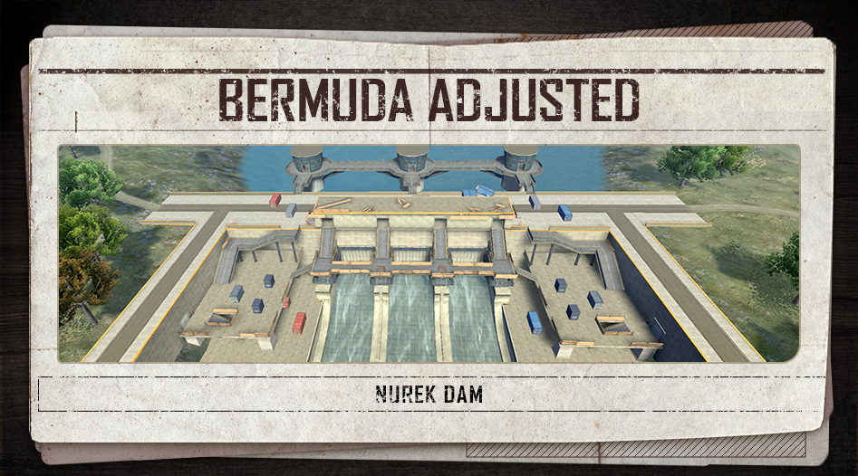
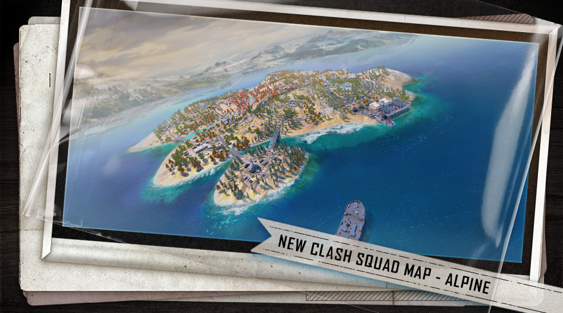
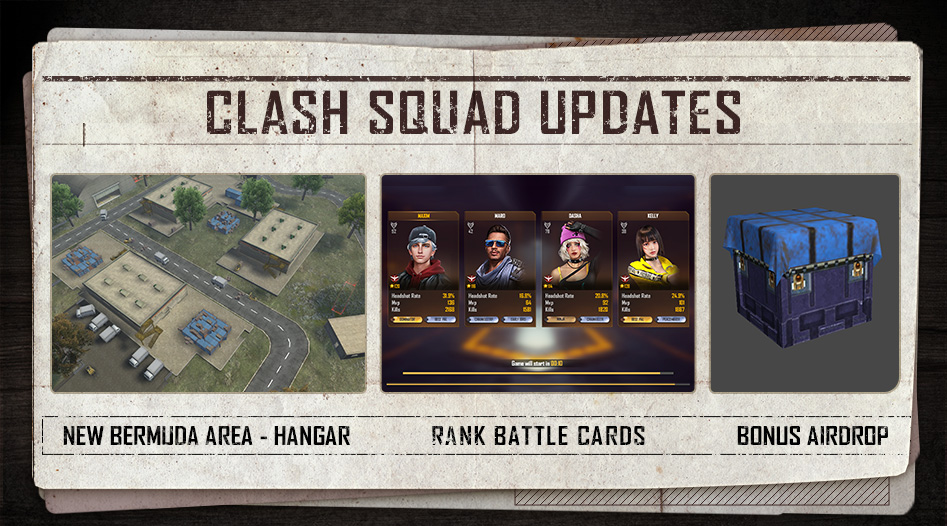
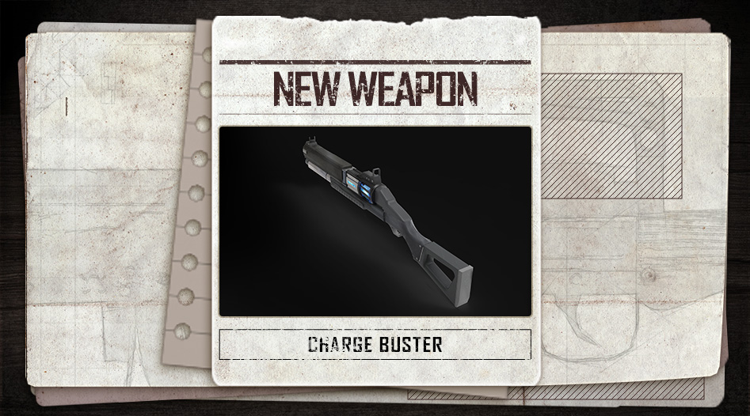
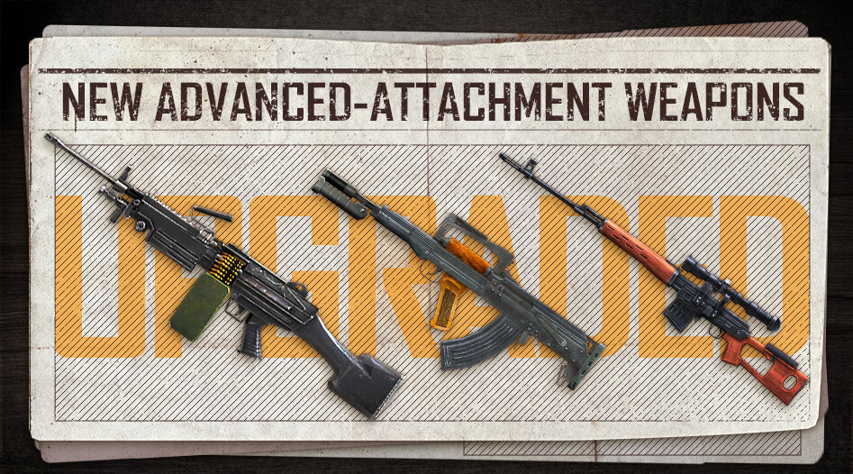
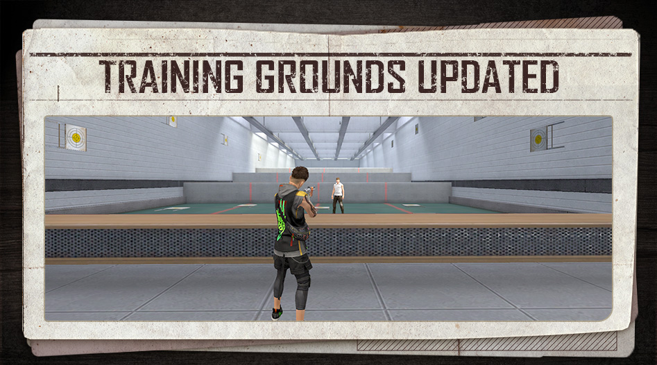

# Free Fire · OB32 · Illuminate（2022 年 1 月补丁）

- 公告日期：2022-01-19
- 官方来源：[PATCH NOTE: ILLUMINATE](https://ff.garena.com/en/article/598/)
- 审阅日期：2026-09-19
- 37 个分类小节；52 项说明及表格行；6 张官方公告插图。

逐项复核本篇 BR、CS 与通用局内章节；独立玩法和局外内容另列目录处置。未将公告日期当作统一上线日期。全部正文图已归档并按实际图像内容关联。

公告日：2022-01-19；原文未列全版本统一的精确生效时刻。

## BR · 大逃杀

### BR：前期缩圈节奏

- 归属：BR · 大逃杀 / 常规调整
- 原文小节：Battle Royale > Safe Zone Pace Adjustment
- 时间：公告日：2022-01-19；原文未列全版本统一的精确生效时刻。

- 仅普通 BR：调整前几次安全区缩圈的时间和速度，加快开局阶段；未给具体阶段秒数或移动速度。

### BR：Nurek Dam 区域重做

- 归属：BR · 大逃杀 / 常规调整
- 原文小节：Battle Royale > Nurek Dam Rework
- 时间：公告日：2022-01-19；原文未列全版本统一的精确生效时刻。

Bermuda 的 Nurek Dam 区域布局。原文：Clash Squad > New Area / Battle Royale > Nurek Dam Rework。[官方原图](https://cdn.wildflamestudio.com/common/web_event/aswqooiwd/e296c/en_3.jpg) · 947×526。

- 将 Bermuda Remastered 版本的 Nurek Dam 布局加入 Bermuda，更新该区域；原文未逐项列出几何变化。

### BR：售货机折扣与动态物资品质

- 归属：BR · 大逃杀 / 常规调整
- 原文小节：Battle Royale > In-game Events
- 时间：公告日：2022-01-19；原文未列全版本统一的精确生效时刻。

- 空投售货机新增折扣商品，未列折扣幅度及具体商品。
- War Chests 随对局推进产出更好的装备。
- 空投装备的稀有度随对局推进提高；原文未公布阶段或概率表。

### BR：复活装备与跳伞朝向

- 归属：BR · 大逃杀 / 常规调整
- 原文小节：Battle Royale > Revival Mechanism Optimization
- 时间：公告日：2022-01-19；原文未列全版本统一的精确生效时刻。

- 复活返场的玩家默认携带 1 级头盔、1 级防弹衣及一把手枪。
- 复活后跳伞时默认朝向安全区。

## CS · 枪王对决

### CS：加入 Alpine 地图

- 归属：CS · 枪王对决 / 常规调整
- 原文小节：Clash Squad > New Map
- 时间：公告日：2022-01-19；原文未列全版本统一的精确生效时刻。

Alpine 加入 CS 地图池。原文：Clash Squad > New Map。[官方原图](https://cdn.wildflamestudio.com/common/web_event/aswqooiwd/e296c/en_2.jpg) · 947×526。

- Alpine 加入普通 CS 与 CS 排位的地图池。

### CS：新增 Hangar 与 Nurek Dam 区域

- 归属：CS · 枪王对决 / 常规调整
- 原文小节：Clash Squad > New Area
- 时间：公告日：2022-01-19；原文未列全版本统一的精确生效时刻。

CS：Hangar、排位战斗卡与额外空投。原文：Clash Squad。[官方原图](https://cdn.wildflamestudio.com/common/web_event/aswqooiwd/e296c/en_1.jpg) · 947×526。

- Bermuda 的 CS 作战区域新增 Hangar 和 Nurek Dam。

### CS：Bermuda 掩体与区域调整

- 归属：CS · 枪王对决 / 常规调整
- 原文小节：Clash Squad > Map Balancing
- 时间：公告日：2022-01-19；原文未列全版本统一的精确生效时刻。

- 调整 Bermuda 的 Katulistiwa、Mars Electric 与 Mill。说明段提到在部分开阔位置增加掩体，未逐处列出具体位置和数量。

### CS：每回合额外空投

- 归属：CS · 枪王对决 / 常规调整
- 原文小节：Clash Squad > Bonus Airdrop
- 时间：公告日：2022-01-19；原文未列全版本统一的精确生效时刻。

- 仅普通 CS：每个回合都有空投落到地图上。
- 说明提到空投可能包含可射击 3 发的 M1887，未给出现概率。

## 通用局内调整

### Skyler：长按瞄准技能

- 归属：通用局内调整 / 常规调整
- 原文小节：Character > Skyler
- 时间：公告日：2022-01-19；原文未列全版本统一的精确生效时刻。

原文通用章节，未单列适用模式；不据此推定所有独立玩法规则相同。

- Riptide Rhythm 的技能按钮新增长按瞄准操作。

### Olivia：扶起队友后的额外 HP

- 归属：通用局内调整 / 常规调整
- 原文小节：Character > Olivia
- 时间：公告日：2022-01-19；原文未列全版本统一的精确生效时刻。

原文通用章节，未单列适用模式；不据此推定所有独立玩法规则相同。

- Healing Touch 扶起队友后提供的额外 HP：30/36/43/51/60/70→30/40/50/60/70/80。

### Xayne：临时生命值与增伤

- 归属：通用局内调整 / 常规调整
- 原文小节：Character > Xayne
- 时间：公告日：2022-01-19；原文未列全版本统一的精确生效时刻。

原文通用章节，未单列适用模式；不据此推定所有独立玩法规则相同。

- Xtreme Encounter 提供 80 点随时间衰减的临时 HP；对冰墙和护盾的伤害增益：40/50/61/73/86/100%→80/90/100/110/120/130%。
- 技能持续时间：10→15 秒。
- 冷却时间列为 150/140/130/120/110/100 秒。小节说明称冷却缩短，但明细未列旧值，因此不补推改前数组。

### Maxim：进食和治疗加速

- 归属：通用局内调整 / 常规调整
- 原文小节：Character > Maxim
- 时间：公告日：2022-01-19；原文未列全版本统一的精确生效时刻。

原文通用章节，未单列适用模式；不据此推定所有独立玩法规则相同。

- Gluttony 的进食及医疗包使用加速：5/8/12/17/23/30%→5/9/13/17/21/25%。小节说明称降低加速，但数组中部分中间等级增加，按各级原值和新值保留。

### Charge Buster：蓄力霰弹枪

- 归属：通用局内调整 / 常规调整
- 原文小节：Weapon and Balance > New Weapon: Charge Buster
- 时间：公告日：2022-01-19；原文未列全版本统一的精确生效时刻。

原文通用章节，未单列适用模式；不据此推定所有独立玩法规则相同。

新增蓄力霰弹枪 Charge Buster。原文：Weapon and Balance > New Weapon: Charge Buster。[官方原图](https://cdn.wildflamestudio.com/common/web_event/aswqooiwd/e296c/en_4.jpg) · 947×526。

- 基础伤害15；射速0.3（原文未标单位）；弹匣3。
- 按住开火蓄力，松手后发射；蓄力提高射程和伤害、减少散布。
- 原文提醒蓄力过久可能反噬，但未列惩罚参数。

### M1014

- 归属：通用局内调整 / 常规调整
- 原文小节：Weapon and Balance > Weapon Adjustments
- 时间：公告日：2022-01-19；原文未列全版本统一的精确生效时刻。

原文通用章节，未单列适用模式；不据此推定所有独立玩法规则相同。

- 有效射程-5%，远距离爆头伤害-20%。

### SPAS12

- 归属：通用局内调整 / 常规调整
- 原文小节：Weapon and Balance > Weapon Adjustments
- 时间：公告日：2022-01-19；原文未列全版本统一的精确生效时刻。

原文通用章节，未单列适用模式；不据此推定所有独立玩法规则相同。

- 有效射程-5%，远距离爆头伤害-20%。

### M1887

- 归属：通用局内调整 / 常规调整
- 原文小节：Weapon and Balance > Weapon Adjustments
- 时间：公告日：2022-01-19；原文未列全版本统一的精确生效时刻。

原文通用章节，未单列适用模式；不据此推定所有独立玩法规则相同。

- 有效射程-5%，远距离爆头伤害-20%。

### MAG-7

- 归属：通用局内调整 / 常规调整
- 原文小节：Weapon and Balance > Weapon Adjustments
- 时间：公告日：2022-01-19；原文未列全版本统一的精确生效时刻。

原文通用章节，未单列适用模式；不据此推定所有独立玩法规则相同。

- 有效射程-5%，远距离爆头伤害-20%。

### UMP

- 归属：通用局内调整 / 常规调整
- 原文小节：Weapon and Balance > Weapon Adjustments
- 时间：公告日：2022-01-19；原文未列全版本统一的精确生效时刻。

原文通用章节，未单列适用模式；不据此推定所有独立玩法规则相同。

- 有效射程-5%，远距离爆头伤害-20%。

### MP5

- 归属：通用局内调整 / 常规调整
- 原文小节：Weapon and Balance > Weapon Adjustments
- 时间：公告日：2022-01-19；原文未列全版本统一的精确生效时刻。

原文通用章节，未单列适用模式；不据此推定所有独立玩法规则相同。

- 有效射程-5%，远距离爆头伤害-20%。

### MP40

- 归属：通用局内调整 / 常规调整
- 原文小节：Weapon and Balance > Weapon Adjustments
- 时间：公告日：2022-01-19；原文未列全版本统一的精确生效时刻。

原文通用章节，未单列适用模式；不据此推定所有独立玩法规则相同。

- 有效射程-5%，远距离爆头伤害-20%。

### P90

- 归属：通用局内调整 / 常规调整
- 原文小节：Weapon and Balance > Weapon Adjustments
- 时间：公告日：2022-01-19；原文未列全版本统一的精确生效时刻。

原文通用章节，未单列适用模式；不据此推定所有独立玩法规则相同。

- 有效射程-5%，远距离爆头伤害-20%。

### Thompson

- 归属：通用局内调整 / 常规调整
- 原文小节：Weapon and Balance > Weapon Adjustments
- 时间：公告日：2022-01-19；原文未列全版本统一的精确生效时刻。

原文通用章节，未单列适用模式；不据此推定所有独立玩法规则相同。

- 有效射程-5%，远距离爆头伤害-20%。

### MAC10

- 归属：通用局内调整 / 常规调整
- 原文小节：Weapon and Balance > Weapon Adjustments
- 时间：公告日：2022-01-19；原文未列全版本统一的精确生效时刻。

原文通用章节，未单列适用模式；不据此推定所有独立玩法规则相同。

- 有效射程-5%，远距离爆头伤害-20%。

### Vector

- 归属：通用局内调整 / 常规调整
- 原文小节：Weapon and Balance > Weapon Adjustments
- 时间：公告日：2022-01-19；原文未列全版本统一的精确生效时刻。

原文通用章节，未单列适用模式；不据此推定所有独立玩法规则相同。

- 远距离爆头伤害-20%。

### M500

- 归属：通用局内调整 / 常规调整
- 原文小节：Weapon and Balance > Weapon Adjustments
- 时间：公告日：2022-01-19；原文未列全版本统一的精确生效时刻。

原文通用章节，未单列适用模式；不据此推定所有独立玩法规则相同。

- 远距离爆头伤害-20%。

### Mini Uzi

- 归属：通用局内调整 / 常规调整
- 原文小节：Weapon and Balance > Weapon Adjustments
- 时间：公告日：2022-01-19；原文未列全版本统一的精确生效时刻。

原文通用章节，未单列适用模式；不据此推定所有独立玩法规则相同。

- 有效射程-5%，远距离爆头伤害-20%，护甲穿透-20%。

### SCAR

- 归属：通用局内调整 / 常规调整
- 原文小节：Weapon and Balance > Weapon Adjustments
- 时间：公告日：2022-01-19；原文未列全版本统一的精确生效时刻。

原文通用章节，未单列适用模式；不据此推定所有独立玩法规则相同。

- 伤害+4%，有效射程+6%。

### AUG

- 归属：通用局内调整 / 常规调整
- 原文小节：Weapon and Balance > Weapon Adjustments
- 时间：公告日：2022-01-19；原文未列全版本统一的精确生效时刻。

原文通用章节，未单列适用模式；不据此推定所有独立玩法规则相同。

- 伤害+2%，有效射程+3%。

### Kingfisher

- 归属：通用局内调整 / 常规调整
- 原文小节：Weapon and Balance > Weapon Adjustments
- 时间：公告日：2022-01-19；原文未列全版本统一的精确生效时刻。

原文通用章节，未单列适用模式；不据此推定所有独立玩法规则相同。

- 弹匣+2。

### 闪光弹：直接伤害

- 归属：通用局内调整 / 常规调整
- 原文小节：Weapon and Balance > Weapon Adjustments
- 时间：公告日：2022-01-19；原文未列全版本统一的精确生效时刻。

原文通用章节，未单列适用模式；不据此推定所有独立玩法规则相同。

- 伤害1→5。

### Helmet Thickener：爆头减伤

- 归属：通用局内调整 / 常规调整
- 原文小节：Weapon and Balance > Weapon Adjustments
- 时间：公告日：2022-01-19；原文未列全版本统一的精确生效时刻。

原文通用章节，未单列适用模式；不据此推定所有独立玩法规则相同。

- 爆头减伤效果降低 20%（原文 Headshot reduction -20%）；未列改后绝对值，不将其直接解释为减少 20 个百分点。

### 防弹衣：新增爆炸防护

- 归属：通用局内调整 / 常规调整
- 原文小节：Weapon and Balance > Vests
- 时间：公告日：2022-01-19；原文未列全版本统一的精确生效时刻。

原文通用章节，未单列适用模式；不据此推定所有独立玩法规则相同。

- 1 级防弹衣：爆炸防护 +10%。
- 2 级防弹衣：爆炸防护 +15%。
- 3 级防弹衣：爆炸防护 +20%。

### 新增空投武器：Groza-X

- 归属：通用局内调整 / 常规调整
- 原文小节：Weapon and Balance > New Airdrop Weapons
- 时间：公告日：2022-01-19；原文未列全版本统一的精确生效时刻。

原文通用章节，未单列适用模式；不据此推定所有独立玩法规则相同。

空投新增 Groza-X、M249-X 与 SVD-Y。原文：Weapon and Balance > New Airdrop Weapons。[官方原图](https://cdn.wildflamestudio.com/common/web_event/aswqooiwd/e296c/en_5.jpg) · 947×526。

- 空投加入带高级配件的 Groza-X；伤害+10%。

### 新增空投武器：M249-X

- 归属：通用局内调整 / 常规调整
- 原文小节：Weapon and Balance > New Airdrop Weapons
- 时间：公告日：2022-01-19；原文未列全版本统一的精确生效时刻。

原文通用章节，未单列适用模式；不据此推定所有独立玩法规则相同。

- 空投加入带高级配件的 M249-X；伤害+5%，射速+12%。

### 新增空投武器：SVD-Y

- 归属：通用局内调整 / 常规调整
- 原文小节：Weapon and Balance > New Airdrop Weapons
- 时间：公告日：2022-01-19；原文未列全版本统一的精确生效时刻。

原文通用章节，未单列适用模式；不据此推定所有独立玩法规则相同。

- 空投加入带高级配件的 SVD-Y；可穿透冰墙，伤害降低但原文未给数值。

### 背包内武器标签

- 归属：通用局内调整 / 常规调整
- 原文小节：Gameplay > Weapon Tags
- 时间：公告日：2022-01-19；原文未列全版本统一的精确生效时刻。

原文通用章节，未单列适用模式；不据此推定所有独立玩法规则相同。

- 背包新增武器标签（Weapon Tags），可快速查看武器特点和使用信息。

### 地图流畅性、拾取与战斗显示

- 归属：通用局内调整 / 常规调整
- 原文小节：Optimizations
- 时间：公告日：2022-01-19；原文未列全版本统一的精确生效时刻。

原文通用章节，未单列适用模式；不据此推定所有独立玩法规则相同。

- 优化 Alpine 的游戏体验与流畅性，未公布性能指标。
- 调整霰弹枪与手枪弹药图标。
- 队友获得首杀、三杀或四杀时，提供点赞按钮。
- 自动拾取设置可调整物品拾取优先级。
- 对局中可选择屏蔽全部消息，或仅屏蔽语音。
- 准星与背包皮肤重叠时，背包皮肤变半透明，避免遮挡视野。

## 其他玩法与局外内容（目录摘要）

### Training Grounds人形靶

人形靶按命中身体部位提供伤害反馈，属独立训练玩法。

原文目录：Training Grounds > Shooting Practice Enhancements

### Training Grounds武器箱自动装备

训练场武器箱获得物品自动装备，属独立训练玩法。

原文目录：Optimizations

### Craftland匹配

Craftland 新增匹配：选择 Creative Mode 后，从热榜 14 张地图中随机分配 1 张；属于独立工坊玩法。

原文目录：Craftland > Matchmaking Function

### Bomb Squad爆炸

增强 Bomb Squad 的爆炸效果；属于独立爆破玩法。

原文目录：Optimizations

### Collections Vault

Collections移入Vault，属局外界面。

原文目录：Optimizations

### 试衣间预设

试衣间和最多2套服装预设，属外观界面。

原文目录：Optimizations

### 自动回放

开启回放自动保存最近10局，属赛后系统。

原文目录：Optimizations

### BR Ranked首胜

BR 排位每日首胜任务：击杀和助攻都可满足计入条件；原文未列其他任务条件。

原文目录：Optimizations

### CS Battle Cards

CS Ranked加载页Battle Cards可自定义战斗统计和battle tags。

原文目录：Clash Squad > Rank Battle Card

### CS Rank Icons

CS Ranked专属新段位图标，属展示。

原文目录：Clash Squad > New Rank Icon

## 其余原文配图

以下为尚未在上述小节内展示的原文图片，包括局外章节配图。

训练场新增人形靶。原文：Training Grounds。[官方原图](https://cdn.wildflamestudio.com/common/web_event/aswqooiwd/e296c/en_6.jpg) · 947×526。

## 官方图片索引

正文图片按相关小节展示，版本总览及其他章节插图另列；同一原图只嵌入一次。

- [CS：Hangar、排位战斗卡与额外空投](https://cdn.wildflamestudio.com/common/web_event/aswqooiwd/e296c/en_1.jpg) · 947×526 · 本地 `assets/ff-patches/598-01.jpg`
- [Alpine 加入 CS 地图池](https://cdn.wildflamestudio.com/common/web_event/aswqooiwd/e296c/en_2.jpg) · 947×526 · 本地 `assets/ff-patches/598-02.jpg`
- [Bermuda 的 Nurek Dam 区域布局](https://cdn.wildflamestudio.com/common/web_event/aswqooiwd/e296c/en_3.jpg) · 947×526 · 本地 `assets/ff-patches/598-03.jpg`
- [新增蓄力霰弹枪 Charge Buster](https://cdn.wildflamestudio.com/common/web_event/aswqooiwd/e296c/en_4.jpg) · 947×526 · 本地 `assets/ff-patches/598-04.jpg`
- [空投新增 Groza-X、M249-X 与 SVD-Y](https://cdn.wildflamestudio.com/common/web_event/aswqooiwd/e296c/en_5.jpg) · 947×526 · 本地 `assets/ff-patches/598-05.jpg`
- [训练场新增人形靶](https://cdn.wildflamestudio.com/common/web_event/aswqooiwd/e296c/en_6.jpg) · 947×526 · 本地 `assets/ff-patches/598-06.jpg`

## 版本关联来源

### [OB32官方编号依据](https://ff.garena.com/vn/article/599/)

越南官方标题明确OB32，同为2022年1月19日；Charge Buster及Alpine CS调整对应。

## 原文目录（对照用）

- Character
- Skyler
- Olivia
- Xayne
- Maxim
- Clash Squad
- New Map
- New Area
- Map Balancing
- Rank Battle Card
- Bonus Airdrop
- New Rank Icon
- Battle Royale
- Safe Zone Pace Adjustment
- Nurek Dam Rework
- In-game Events
- Revival Mechanism Optimization
- Weapon and Balance
- New Weapon: Charge Buster
- Weapon Adjustments
- Vests
- New Airdrop Weapons
- Training Grounds
- Shooting Practice Enhancements
- Gameplay
- Weapon Tags
- Craftland
- Matchmaking Function
- Optimizations
