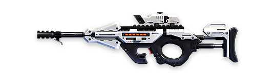
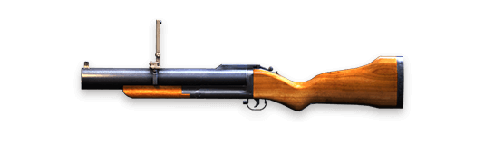
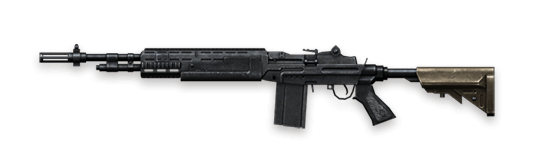
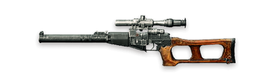
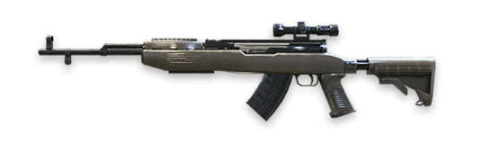
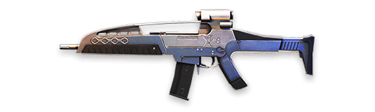
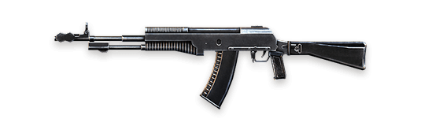
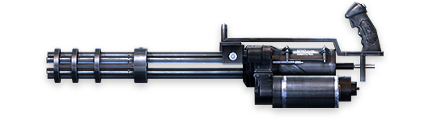

# Free Fire · OB16 · Road to Grand Master（2019 年 6 月补丁）

- 公告日期：2019-06-25
- 官方来源：[ROAD TO GRAND MASTER](https://ff.garena.com/en/article/60/)
- 审阅日期：2026-09-19
- 18 个分类小节；28 项说明及表格行；9 张官方公告插图。

主流程对照整篇正文及9张官方插图复核；武器逐种保留属性与数值，自定义房控制参数与普通匹配区分。特殊模式及局外系统另列处置，不称整篇逐项全译。

公告日索引。

Road to Grand Master 补丁主题插画。原文：ROAD TO GRAND MASTER（正文首图）。[官方原图](https://cdn.wildflamestudio.com/common/web_event/official/fba47a8e76df01.jpg) · 1000×563。

## BR · 大逃杀

### 两张地图的非排位模式新增修理包

- 归属：BR · 大逃杀 / 常规调整
- 原文小节：Gameplay > New Item - Repair Kit
- 时间：未单列生效日，按公告日索引。

原文明示 both maps 的 Casual Mode；即两张地图的非排位模式，非本篇预告的独立特殊模式。

- 两张地图的非排位模式加入修理包（Repair Kit，说明性译名）。
- 可为头盔和防弹衣修复100点耐久；原文未列使用时间、携带上限等参数。

### 百慕大非排位新增毒区

- 归属：BR · 大逃杀 / 常规调整
- 原文小节：Gameplay > Toxic Zone
- 时间：未单列生效日，按公告日索引。

原文明示仅百慕大非排位（Bermuda - Casual）。

- 毒区（Toxic Zone，说明性译名）可能随机替代红区出现。
- 毒区会腐蚀玩家护甲。
- 护甲耗尽后继续损失生命值；原文未给腐蚀或扣血速度。

### 炼狱非排位新增高物资热区

- 归属：BR · 大逃杀 / 常规调整
- 原文小节：Gameplay > Hot Zone
- 时间：未单列生效日，按公告日索引。

原文明示 Purgatory - Casual。

- 高物资热区（Hot Zone，说明性译名）扩展到炼狱非排位；官方说明其中提供较高等级物资，未列数量。

## CS · 枪王对决

## 通用局内调整

### 自动拾取选项

- 归属：通用局内调整 / 常规调整
- 原文小节：Gameplay > Auto Pickup
- 时间：公告日索引。

原文未单列模式。

- 自动拾取可选择具体自动拾取物品。

### Rafael 技能隐藏地图枪声标记

- 归属：通用局内调整 / 常规调整
- 原文小节：Gameplay > New Character - Rafael
- 时间：公告日索引。

原文未单列模式。

- 新增 Rafael；主动技能使地图上的枪声标记在数秒内隐蔽，但枪声仍可被听见。

### CG-15 移出常规对局

- 归属：通用局内调整 / 常规调整
- 原文小节：Weapon and Balance > CG-15
- 时间：公告日索引。

原文明示移出 Casual 和 Rank；改后狙击形态参数只针对仍提供该枪的特殊模式，另列附录。

CG-15 官方武器图。原文：Weapon and Balance > CG-15。[官方原图](https://cdn.wildflamestudio.com/common/web_event/official/93e7f6488959CG15.png) · 535×160。

- CG-15 从非排位与排位模式移除，只保留在特殊模式。

### 狙击枪伤害、射速与判定

- 归属：通用局内调整 / 常规调整
- 原文小节：Weapon and Balance > Sniper Rifles
- 时间：公告日索引。

原文未单列模式。

- Kar98k 躯干伤害+40%、射速-10%。
- AWM 躯干伤害+50%、射速-10%。
- 狙击枪爆头伤害不变。
- 优化狙击枪子弹命中判定；原文说明弹体命中箱略增。

### 每局武器掉落池

- 归属：通用局内调整 / 常规调整
- 原文小节：Other New Features > Weapon Drop
- 时间：公告日索引。

原文未单列模式。

- 每局仅从弩（Crossbow）、M1873、M500、G18 中选出一种出现在武器池。
- 每局仅出现 XM8、AN94、M14 中的两种。

### 击杀信息、热区与墙体射击修复

- 归属：通用局内调整 / 常规调整
- 原文小节：Misc.
- 时间：公告日索引。

原文写明两图热区；其余未单列模式。

- 调整两张地图的高物资热区尺寸；原文未给改前改后面积。
- 击杀信息纳入红区、毒区和桶。
- 修复榴弹发射器可穿墙射击的问题。
- 活动物品不再显示地图红点，准星也不再自动吸附。

### M79 改为空投限定

- 归属：通用局内调整 / 常规调整
- 原文小节：Weapon and Balance > M79
- 时间：本项未单列生效日，按公告日索引。

原文未单列适用模式。

M79 官方武器图。原文：Weapon and Balance > M79。[官方原图](https://cdn.wildflamestudio.com/common/web_event/official/5f83d4b70eb6M79.png) · 535×160。

- M79 从地图普通物资中移除，只在空投出现；官方明确并非每个空投必定包含 M79。

### M14 参数调整

- 归属：通用局内调整 / 常规调整
- 原文小节：Weapon and Balance > M14
- 时间：本项未单列生效日，按公告日索引。

原文未单列适用模式。

M14 官方武器图。原文：Weapon and Balance > M14。[官方原图](https://cdn.wildflamestudio.com/common/web_event/official/fe62d12652e9M14.png) · 535×160。

- M14 射速提高10%。

### VSS 参数调整

- 归属：通用局内调整 / 常规调整
- 原文小节：Weapon and Balance > VSS
- 时间：本项未单列生效日，按公告日索引。

原文未单列适用模式。

VSS 官方武器图。原文：Weapon and Balance > VSS。[官方原图](https://cdn.wildflamestudio.com/common/web_event/official/eeae35fefe5cVSS.png) · 535×160。

- VSS 伤害参数提高10%。

### SKS 参数调整

- 归属：通用局内调整 / 常规调整
- 原文小节：Weapon and Balance > SKS
- 时间：本项未单列生效日，按公告日索引。

原文未单列适用模式。

SKS 官方武器图。原文：Weapon and Balance > SKS。[官方原图](https://cdn.wildflamestudio.com/common/web_event/official/d6663b2266b2SKS.png) · 535×160。

- SKS 射速提高10%。

### XM8 参数调整

- 归属：通用局内调整 / 常规调整
- 原文小节：Weapon and Balance > XM8
- 时间：本项未单列生效日，按公告日索引。

原文未单列适用模式。

XM8 官方武器图。原文：Weapon and Balance > XM8。[官方原图](https://cdn.wildflamestudio.com/common/web_event/official/2fafc6221bc6XM8.png) · 535×160。

- XM8 精度提高5%。

### AN94 参数调整

- 归属：通用局内调整 / 常规调整
- 原文小节：Weapon and Balance > AN94
- 时间：本项未单列生效日，按公告日索引。

原文未单列适用模式。

AN94 官方武器图。原文：Weapon and Balance > AN94。[官方原图](https://cdn.wildflamestudio.com/common/web_event/official/d51b97c205ddAN94.png) · 535×160。

- AN94 后坐力恢复时间降低100%，伤害参数提高3%；按原文保留，不另推导未说明的恢复机制。

### 自定义房的局内规则开关

- 归属：通用局内调整 / 常规调整
- 原文小节：Gameplay > Custom Rooms
- 时间：本项未单列生效日，按公告日索引。

只适用于房主配置的自定义房，不能据此认定普通匹配默认规则同步变化。

- 自定义房新增无限弹药、坠落伤害、角色技能、战备和空投配置选项；原文未列各参数的可调范围。

### 夏季主题候机岛

- 归属：通用局内调整 / 活动覆盖
- 原文小节：Other New Features > Spawn Island
- 时间：本项未单列生效日，按公告日索引。

原文未单列适用模式。

- 新增夏季主题候机岛，原文未给活动结束日期。

### 植被与吉利服图形更新

- 归属：通用局内调整 / 常规调整
- 原文小节：Other New Features > Graphics Update
- 时间：本项未单列生效日，按公告日索引。

原文未单列适用模式。

- 棕榈树更换模型；植被和吉利服的图形表现更新，未公布具体性能数据。

## 其他玩法与局外内容（目录摘要）

### 段位与生涯奖励系统

新增宗师（Grandmaster）段位，每个地区每日前300名进入；调整钻石及以上排位分算法，加入宗师动画横幅／头像与排位商店物品。大厅新增 Free Fire Manual，以武器、交互和账户进度给予奖励。

原文目录：Gameplay > Rank Mode / Free Fire Manual

### 特殊模式加特林与 CG-15 参数

Spray and Pray 独立模式新增加特林：伤害参数93、射速56、射程68、换弹62、弹匣1200发、精度73；未列参数换算单位。仅特殊模式保留的 CG-15 狙击形态伤害参数91→999，新增握把槽。

原文目录：Weapon and Balance > Gatling Gun / CG-15

### Zombie Invasion 与 Death Uprising

Zombie Invasion 新增可在目标区域生成僵尸的空袭式僵尸空投、远程僵尸。Death Uprising 略增可玩区域、新增 Inferno 难度及能挡伤害的 Shielder；Hard／Inferno 增加 Undead Agent。新增无限弹药及致命伤保留1HP两种局内增益，该模式加入手雷。

原文目录：Other New Features > Zombie Invasion / Death Uprising

### 通行证与其他局外界面

Fire Pass 增加任务、特殊挑战及额外徽章机制。优化赛后总结、每日登录奖励；赛后增加广告观看按钮，移除简体中文语言选项。

原文目录：Other New Features > Elite Pass / Misc.

## 其余原文配图

以下为尚未在上述小节内展示的原文图片，包括局外章节配图。

Gatling 官方武器图。原文：Weapon and Balance > Gatling。[官方原图](https://cdn.wildflamestudio.com/common/web_event/official/e0f04809bc99Gatling.png) · 535×160。

## 官方图片索引

正文图片按相关小节展示，版本总览及其他章节插图另列；同一原图只嵌入一次。

- [Road to Grand Master 补丁主题插画](https://cdn.wildflamestudio.com/common/web_event/official/fba47a8e76df01.jpg) · 1000×563 · 本地 `assets/ff-patches/60-01.jpg`
- [Gatling 官方武器图](https://cdn.wildflamestudio.com/common/web_event/official/e0f04809bc99Gatling.png) · 535×160 · 本地 `assets/ff-patches/60-02.png`
- [CG-15 官方武器图](https://cdn.wildflamestudio.com/common/web_event/official/93e7f6488959CG15.png) · 535×160 · 本地 `assets/ff-patches/60-03.png`
- [M79 官方武器图](https://cdn.wildflamestudio.com/common/web_event/official/5f83d4b70eb6M79.png) · 535×160 · 本地 `assets/ff-patches/60-04.png`
- [M14 官方武器图](https://cdn.wildflamestudio.com/common/web_event/official/fe62d12652e9M14.png) · 535×160 · 本地 `assets/ff-patches/60-05.png`
- [VSS 官方武器图](https://cdn.wildflamestudio.com/common/web_event/official/eeae35fefe5cVSS.png) · 535×160 · 本地 `assets/ff-patches/60-06.png`
- [SKS 官方武器图](https://cdn.wildflamestudio.com/common/web_event/official/d6663b2266b2SKS.png) · 535×160 · 本地 `assets/ff-patches/60-07.png`
- [XM8 官方武器图](https://cdn.wildflamestudio.com/common/web_event/official/2fafc6221bc6XM8.png) · 535×160 · 本地 `assets/ff-patches/60-08.png`
- [AN94 官方武器图](https://cdn.wildflamestudio.com/common/web_event/official/d51b97c205ddAN94.png) · 535×160 · 本地 `assets/ff-patches/60-09.png`

## 原文目录（对照用）

- Gameplay
- Weapon and Balance
- Other New Features
- Misc.
