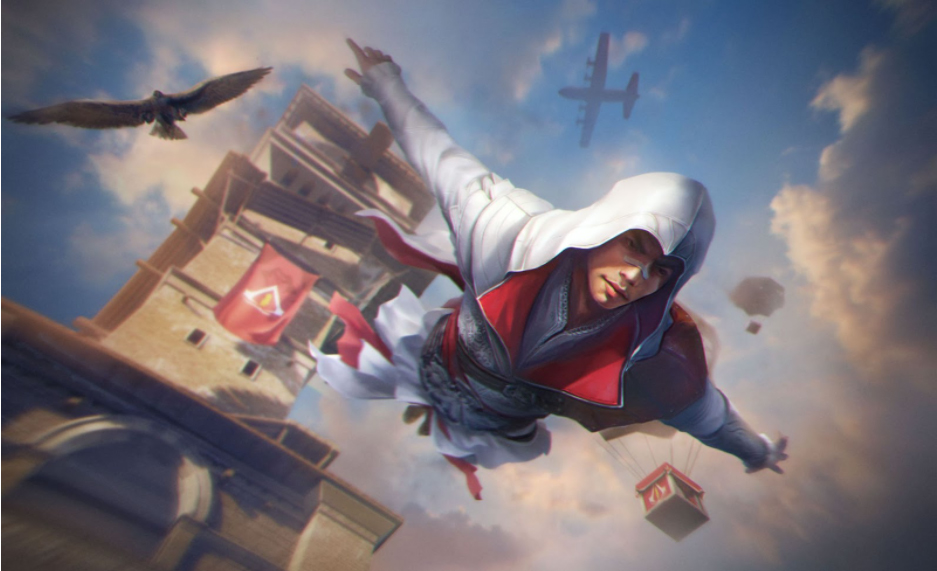
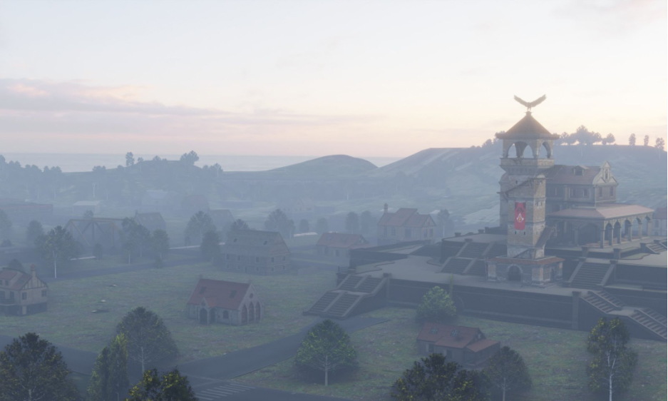
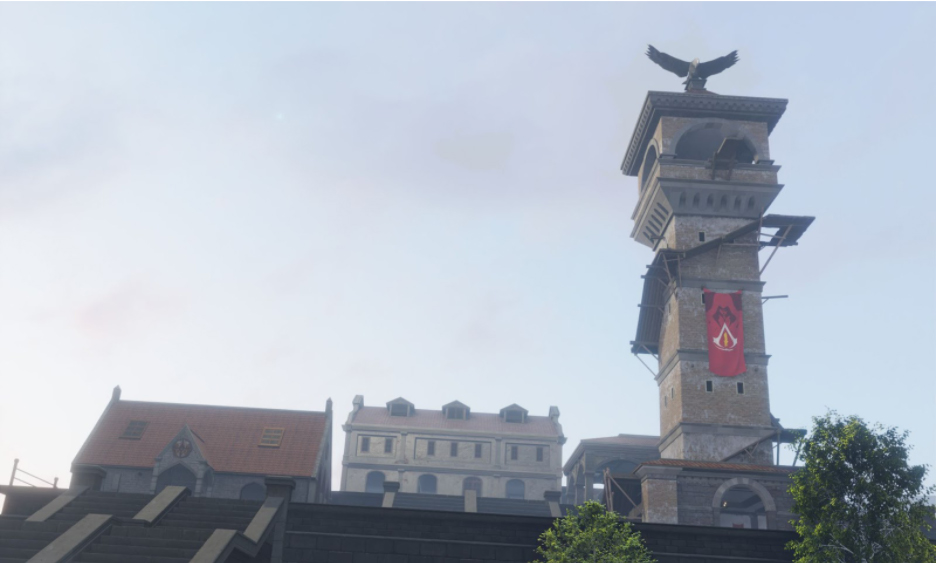

# Free Fire · 2022年Assassin’s Creed联动地图更新

- 公告日期：2022-03-03
- 官方来源：[Enjoy the Leap of Faith with Free Fire’s latest crossover with Assassin’s Creed](https://ff.garena.com/en/article/635/)
- 审阅日期：2026-09-19
- 2 个分类小节；3 项说明及表格行；4 张官方公告插图。

主流程通读正文并逐项复核；公告日期与活动日期分开，所有正文图归档展示。未在原文核实的OB号不推算。

公告日2022-03-03；各项实际状态及活动期限见小节。

Leap of Faith主题宣传画。原文：Enjoy the Leap of Faith with Free Fire’s latest crossover with Assassin’s Creed。[官方原图](https://cdn.wildflamestudio.com/common/web_event/hash/1985dfebee8a985e89ff725317f22afcjpg) · 937×571。

联动收藏主题宣传画。原文：Enjoy the Leap of Faith with Free Fire’s latest crossover with Assassin’s Creed。[官方原图](https://cdn.wildflamestudio.com/common/web_event/hash/fbaedb5d9d6f0e81a4a25276ec13d558jpg) · 936×572。

## BR · 大逃杀

### Bermuda新增Sanctuary建筑

- 归属：BR · 大逃杀 / 活动覆盖
- 原文小节：Look out for the Sanctuary in Bermuda and perform the iconic Leap of Faith
- 时间：2022-03-03公告称联动已上线；没有公布结束日期。

Bermuda Sanctuary建筑远景。原文：Look out for the Sanctuary in Bermuda and perform the iconic Leap of Faith。[官方原图]( https://cdn.wildflamestudio.com/common/web_event/hash/f5fac0e936bc99401af37de05d0a0454jpg) · 937×562。

Bermuda Sanctuary建筑。原文：Look out for the Sanctuary in Bermuda and perform the iconic Leap of Faith。[官方原图](https://cdn.wildflamestudio.com/common/web_event/hash/67c2417bb3074fc018994ce7cc948ea3jpg) · 937×563。

- Bermuda加入联动专属Sanctuary建筑，可进入寻找物资；没有公布物资等级、生成数量或固定坐标。
- 玩家可以在Sanctuary顶部执行Leap of Faith（信仰之跃）；未说明免摔伤、移动距离或其他收益，不补造效果。

## CS · 枪王对决

## 通用局内调整

### 售货机、飞艇与飞机联动外观

- 归属：通用局内调整 / 活动覆盖
- 原文小节：Complete the Free Fire x Assassin’s Creed visual experience
- 时间：公告时已上线；未列结束日。

- 售货机、飞艇和飞机换为联动主题外观；原文未说明功能、属性或使用规则改变。

## 其他玩法与局外内容（目录摘要）

### 主题音乐与收藏

发布交响乐主题曲The Creed of Fire，结合两作旋律；登录宣传横幅、联动收藏品与主题美术同步出现。本篇没有说明该音乐属于局内新增交互。

原文目录：Listen to the specially composed collaboration theme song

## 官方图片索引

正文图片按相关小节展示，版本总览及其他章节插图另列；同一原图只嵌入一次。

- [Bermuda Sanctuary建筑远景]( https://cdn.wildflamestudio.com/common/web_event/hash/f5fac0e936bc99401af37de05d0a0454jpg) · 937×562 · 本地 `assets/ff-patches/635-01.jpg`
- [Bermuda Sanctuary建筑](https://cdn.wildflamestudio.com/common/web_event/hash/67c2417bb3074fc018994ce7cc948ea3jpg) · 937×563 · 本地 `assets/ff-patches/635-02.jpg`
- [Leap of Faith主题宣传画](https://cdn.wildflamestudio.com/common/web_event/hash/1985dfebee8a985e89ff725317f22afcjpg) · 937×571 · 本地 `assets/ff-patches/635-03.jpg`
- [联动收藏主题宣传画](https://cdn.wildflamestudio.com/common/web_event/hash/fbaedb5d9d6f0e81a4a25276ec13d558jpg) · 936×572 · 本地 `assets/ff-patches/635-04.jpg`

## 版本关联来源

### [Assassin’s Creed联动预告](https://ff.garena.com/en/article/601/)

601仅预告3月合作；本篇提供Bermuda建筑和可执行互动，不把预告重复算新机制。

## 原文目录（对照用）

- Enjoy the Leap of Faith with Free Fire’s latest crossover with Assassin’s Creed
