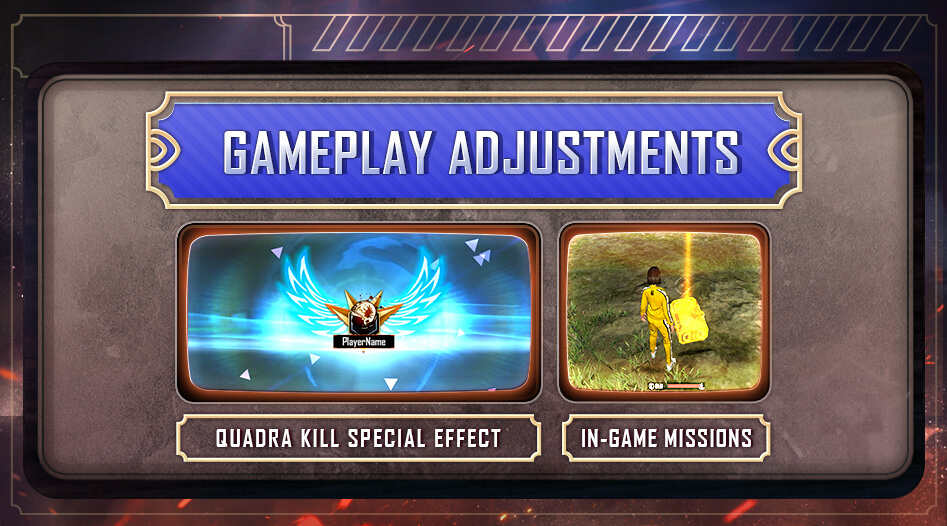
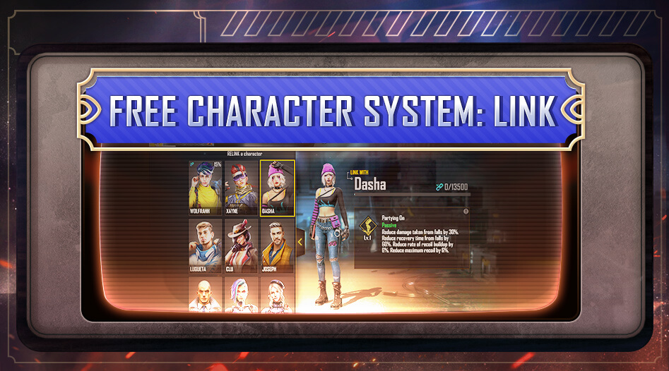
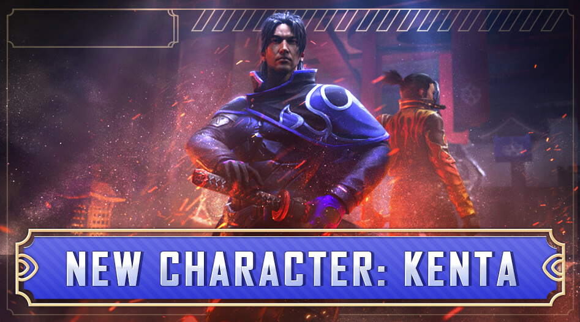
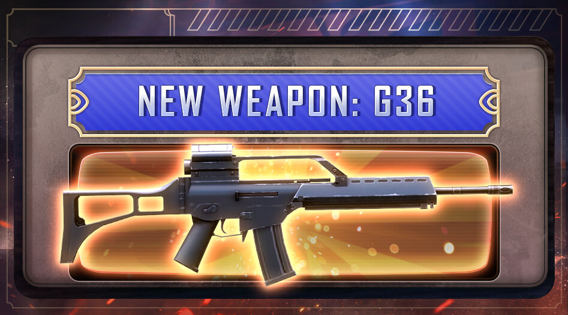
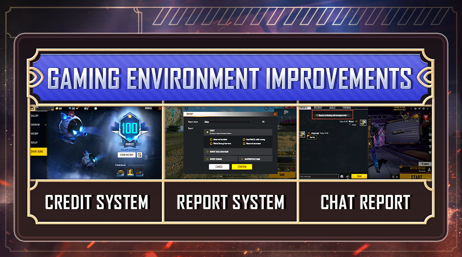
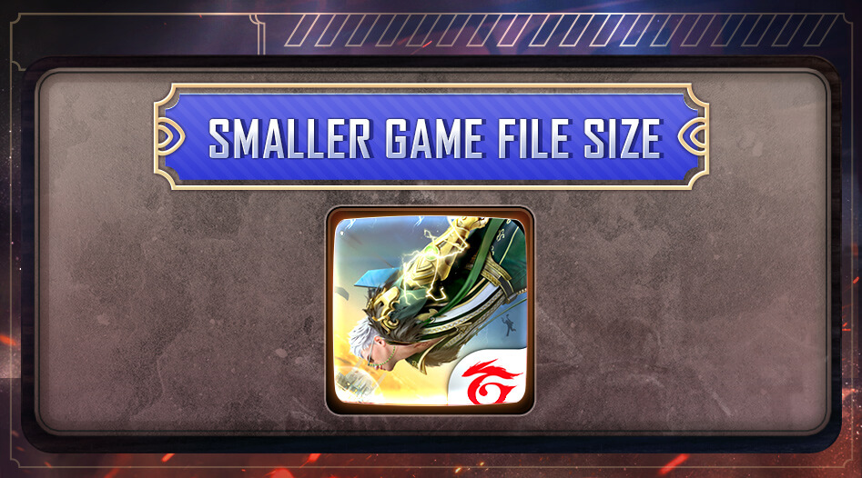

# Free Fire · OB33 · Heroes Arise（2022 年 3 月补丁）

- 公告日期：2022-03-23
- 官方来源：[PATCH NOTE: HEROES ARISE](https://ff.garena.com/en/article/655/)
- 审阅日期：2026-09-19
- 47 个分类小节；66 项说明及表格行；6 张官方公告插图。

逐项复核本篇 BR、CS 与通用局内章节；独立玩法和局外内容另列目录处置。未将公告日期当作统一上线日期。全部正文图已归档并按实际图像内容关联。

公告日：2022-03-23；信用系统与语音举报预告于 2022-03-25 11:00（GMT+8）开放，不能将其记为公告当天已上线。其余项目未列统一精确生效时刻。

## BR · 大逃杀

### BR局内限时任务

- 归属：BR · 大逃杀 / 常规调整
- 原文小节：Battle Royale > New In-game Missions
- 时间：公告日：2022-03-23；原文未列本项统一精确生效时刻。

CS 四杀视觉效果与 BR 局内任务。原文：Clash Squad / Battle Royale > New In-game Missions。[官方原图](https://cdn.wildflamestudio.com/common/web_event/aswqooiwd/1ae86/en/4.jpg) · 947×526。

- 悬赏目标任务（Hit List）：在售货机用 FF 金币购买，在时限内淘汰指定目标。
- 补给跑点任务（Supply Run）：在地图上免费获取，在时限内抵达指定位置。
- 完成限时目标可获得奖励；该公告未列任务价格、时限秒数或奖励明细。

### BR终极武器升级

- 归属：BR · 大逃杀 / 常规调整
- 原文小节：Battle Royale > Ultimate Weapons Now Upgradable
- 时间：公告日：2022-03-23；原文未列本项统一精确生效时刻。

- 除空投终极武器外，全部终极武器可用升级芯片（Upgrade Chip）进行三阶段升级。
- 可升级名单：VSS、MP5、M60、M4A1、M14、Kar98k、PLASMA、FAMAS；本公告未列各阶段数值。

### BR 自定义房：自动复活

- 归属：BR · 大逃杀 / 常规调整
- 原文小节：Gameplay > Custom Room Enhancements
- 时间：公告日：2022-03-23；原文未列本项统一精确生效时刻。

- BR自定义房开启后，FF Coins足够的玩家自动复活。

### BR 自定义房：安全区参数

- 归属：BR · 大逃杀 / 常规调整
- 原文小节：Gameplay > Custom Room Enhancements
- 时间：公告日：2022-03-23；原文未列本项统一精确生效时刻。

- BR自定义房可调整安全区伤害和速度。

### BR：局内货币显示

- 归属：BR · 大逃杀 / 常规调整
- 原文小节：Other Adjustments
- 时间：公告日：2022-03-23；原文未列本项统一精确生效时刻。

- BR 的 HUD 新增 FF 金币（FF Coins）显示。

### 复活死亡地点

- 归属：BR · 大逃杀 / 常规调整
- 原文小节：Other Adjustments
- 时间：公告日：2022-03-23；原文未列本项统一精确生效时刻。

- BR复活后地图显示死亡地点以便取回装备。

### 售货机角度与小地图优先级

- 归属：BR · 大逃杀 / 常规调整
- 原文小节：Other Adjustments
- 时间：公告日：2022-03-23；原文未列本项统一精确生效时刻。

- 空投售货机可从所有角度交互。
- 小地图优先显示售货机和复活点，优先级高于玩家位置；原句在两个设施名称之间缺少连接词，按并列对象记录。

## CS · 枪王对决

### CS：四杀视觉效果

- 归属：CS · 枪王对决 / 常规调整
- 原文小节：Clash Squad > New Quadra Kill Animation
- 时间：公告日：2022-03-23；原文未列本项统一精确生效时刻。

- 完成四杀时增强视觉特效。

### CS 自定义房：商店与定价

- 归属：CS · 枪王对决 / 常规调整
- 原文小节：Gameplay > Custom Room Enhancements
- 时间：公告日：2022-03-23；原文未列本项统一精确生效时刻。

- 普通房卡解锁CS商店和物品价格自定义。

## 通用局内调整

### LINK角色升级与技能槽成本

- 归属：通用局内调整 / 常规调整
- 原文小节：New System > Get free Characters with LINK!
- 时间：公告日：2022-03-23；原文未列本项统一精确生效时刻。

可通过任意模式对局获得免费角色；每次只能LINK一名角色。每日LINK点数与用金币加速LINK进度均有限制；本补丁前的角色纳入LINK系统。

LINK：通过对局解锁角色。原文：New System > Get free Characters with LINK!。[官方原图](https://cdn.wildflamestudio.com/common/web_event/aswqooiwd/1ae86/en/2.jpg) · 947×526。

- 玩家可通过任意模式对局获得免费角色。
- 每次只能LINK一名角色。
- 每日可获得的LINK点数有限。
- 可用金币加速LINK进度，但每日次数有限。
- 本补丁前的全部角色纳入LINK系统。

Character Fragments Needed Before & After

| 升级 | 当前碎片 | 补丁后碎片 |
|---|---|---|
| 等级 2>3 | 500 | 400 |
| 等级 3>4 | 1,500 | 1,000 |
| 等级 4>5 | 2,500 | 2,000 |
| 等级 5>6 | 5,000 | 4,000 |

Costs for Unlocking Skill Slots Before & After

| 技能槽 | 当前成本 | 补丁后成本 |
|---|---|---|
| 技能槽 1 | 50 钻石/2,000 金币 | 40 钻石/2000 金币 |
| 技能槽 2 | 75 钻石/5,000 金币 | 75 钻石/3750 金币 |
| 技能槽 3 | 125 钻石/10,000 金币 | 125 钻石/6250 金币 |

### Kenta

- 归属：通用局内调整 / 常规调整
- 原文小节：Character > New
- 时间：公告日：2022-03-23；原文未列本项统一精确生效时刻。

原文通用章节，未单列适用模式；不据此推定所有独立玩法规则相同。

Kenta：正面护盾。原文：Character > New。[官方原图](https://cdn.wildflamestudio.com/common/web_event/aswqooiwd/1ae86/en/3.jpg) · 947×526。

- 在角色前方形成宽5m的盾牌，减免来自正面的武器伤害50%；持续2/3/3.5/4/4.5/5秒，开枪后重置，冷却210/200/190/180/170/160秒。
- 发动技能时放下枪，护盾后方队友也获得其部分减伤效果。

### A124

- 归属：通用局内调整 / 常规调整
- 原文小节：Character > Reworks
- 时间：公告日：2022-03-23；原文未列本项统一精确生效时刻。

原文通用章节，未单列适用模式；不据此推定所有独立玩法规则相同。

- 8m电磁波阻止敌人激活技能并打断交互倒计时；持续20/22/24/26/28/30秒，冷却100/90/80/70/60/50秒。

### Nikita

- 归属：通用局内调整 / 常规调整
- 原文小节：Character > Reworks
- 时间：公告日：2022-03-23；原文未列本项统一精确生效时刻。

原文通用章节，未单列适用模式；不据此推定所有独立玩法规则相同。

- 所有枪种的装填速度提高14/16/18/20/22/24%；SMG弹匣最后6发伤害提高10/12/14/16/18/20%。

### Steffie

- 归属：通用局内调整 / 常规调整
- 原文小节：Character > Reworks
- 时间：公告日：2022-03-23；原文未列本项统一精确生效时刻。

原文通用章节，未单列适用模式；不据此推定所有独立玩法规则相同。

- 4m区域阻挡投掷物；区域内友军每秒回复10%护甲耐久，受到的敌方弹药伤害降低10/12/14/16/18/20%；持续10/11/12/13/14/15秒，冷却115/110/105/100/95/90秒，效果不叠加。

### Caroline

- 归属：通用局内调整 / 常规调整
- 原文小节：Character > Balancing
- 时间：公告日：2022-03-23；原文未列本项统一精确生效时刻。

原文通用章节，未单列适用模式；不据此推定所有独立玩法规则相同。

- 持霰弹枪移速3/4/5/6/7/8%→6/7/8/9/11/13%。

### Otho

- 归属：通用局内调整 / 常规调整
- 原文小节：Character > Balancing
- 时间：公告日：2022-03-23；原文未列本项统一精确生效时刻。

原文通用章节，未单列适用模式；不据此推定所有独立玩法规则相同。

- 淘汰后显示击杀点25/30/35/40/45/50m→25/35/45/55/65/75m内敌人位置；信息与队友共享4→6秒。

### Rafael

- 归属：通用局内调整 / 常规调整
- 原文小节：Character > Balancing
- 时间：公告日：2022-03-23；原文未列本项统一精确生效时刻。

原文通用章节，未单列适用模式；不据此推定所有独立玩法规则相同。

- 使用狙击枪或精确射手步枪时射击消音；被这两类武器命中的敌人倒地后流血速度加成：20/23/27/32/38/45%→40/50/60/70/80/90%。

### Thiva

- 归属：通用局内调整 / 常规调整
- 原文小节：Character > Balancing
- 时间：公告日：2022-03-23；原文未列本项统一精确生效时刻。

原文通用章节，未单列适用模式；不据此推定所有独立玩法规则相同。

- 救援速度10/13/16/19/22/25%→15/18/21/24/27/30%；成功救援后，使用者本人在5秒内回复15/20/25/30/35/40→25/30/35/40/45/50HP。

### G36：近距离突击模式

- 归属：通用局内调整 / 常规调整
- 原文小节：Weapon and Balance > New Weapon: G36
- 时间：公告日：2022-03-23；原文未列本项统一精确生效时刻。

原文通用章节，未单列适用模式；不据此推定所有独立玩法规则相同。

G36：近距离与中距离两种射击模式。原文：Weapon and Balance > New Weapon: G36。[官方原图](https://cdn.wildflamestudio.com/common/web_event/aswqooiwd/1ae86/en/5.jpg) · 947×526。

- G36 可在近距离突击模式（Assault）和中距离射程模式（Range）之间切换。
- 突击模式：基础伤害 26，射速字段 0.096（原文未列单位），弹匣 30 发。

### G36：中距离射程模式

- 归属：通用局内调整 / 常规调整
- 原文小节：Weapon and Balance > New Weapon: G36
- 时间：公告日：2022-03-23；原文未列本项统一精确生效时刻。

原文通用章节，未单列适用模式；不据此推定所有独立玩法规则相同。

- 射程模式：基础伤害 33，射速字段 0.15（原文未列单位），弹匣 30 发。

### M4A1

- 归属：通用局内调整 / 常规调整
- 原文小节：Weapon and Balance > Weapon Adjustments > M4A1
- 时间：公告日：2022-03-23；原文未列本项统一精确生效时刻。

原文通用章节，未单列适用模式；不据此推定所有独立玩法规则相同。

- 有效射程-4%。

### SCAR

- 归属：通用局内调整 / 常规调整
- 原文小节：Weapon and Balance > Weapon Adjustments > SCAR
- 时间：公告日：2022-03-23；原文未列本项统一精确生效时刻。

原文通用章节，未单列适用模式；不据此推定所有独立玩法规则相同。

- 有效射程+5%。

### M249

- 归属：通用局内调整 / 常规调整
- 原文小节：Weapon and Balance > Weapon Adjustments > M249
- 时间：公告日：2022-03-23；原文未列本项统一精确生效时刻。

原文通用章节，未单列适用模式；不据此推定所有独立玩法规则相同。

- 有效射程-3%。

### FAMAS

- 归属：通用局内调整 / 常规调整
- 原文小节：Weapon and Balance > Weapon Adjustments > FAMAS
- 时间：公告日：2022-03-23；原文未列本项统一精确生效时刻。

原文通用章节，未单列适用模式；不据此推定所有独立玩法规则相同。

- 有效射程-2%。

### XM8

- 归属：通用局内调整 / 常规调整
- 原文小节：Weapon and Balance > Weapon Adjustments > XM8
- 时间：公告日：2022-03-23；原文未列本项统一精确生效时刻。

原文通用章节，未单列适用模式；不据此推定所有独立玩法规则相同。

- 有效射程+5%。

### AN94

- 归属：通用局内调整 / 常规调整
- 原文小节：Weapon and Balance > Weapon Adjustments > AN94
- 时间：公告日：2022-03-23；原文未列本项统一精确生效时刻。

原文通用章节，未单列适用模式；不据此推定所有独立玩法规则相同。

- 有效射程+4%。

### AUG

- 归属：通用局内调整 / 常规调整
- 原文小节：Weapon and Balance > Weapon Adjustments > AUG
- 时间：公告日：2022-03-23；原文未列本项统一精确生效时刻。

原文通用章节，未单列适用模式；不据此推定所有独立玩法规则相同。

- 有效射程+6%。

### PARAFAL

- 归属：通用局内调整 / 常规调整
- 原文小节：Weapon and Balance > Weapon Adjustments > PARAFAL
- 时间：公告日：2022-03-23；原文未列本项统一精确生效时刻。

原文通用章节，未单列适用模式；不据此推定所有独立玩法规则相同。

- 有效射程+5%。

### Kar98k

- 归属：通用局内调整 / 常规调整
- 原文小节：Weapon and Balance > Weapon Adjustments > Kar98k
- 时间：公告日：2022-03-23；原文未列本项统一精确生效时刻。

原文通用章节，未单列适用模式；不据此推定所有独立玩法规则相同。

- 换枪时间+20%。

### UMP

- 归属：通用局内调整 / 常规调整
- 原文小节：Weapon and Balance > Weapon Adjustments > UMP
- 时间：公告日：2022-03-23；原文未列本项统一精确生效时刻。

原文通用章节，未单列适用模式；不据此推定所有独立玩法规则相同。

- 有效射程-3%，开火移速-10%，稳定性-7%。

### MP5

- 归属：通用局内调整 / 常规调整
- 原文小节：Weapon and Balance > Weapon Adjustments > MP5
- 时间：公告日：2022-03-23；原文未列本项统一精确生效时刻。

原文通用章节，未单列适用模式；不据此推定所有独立玩法规则相同。

- 有效射程-10%，伤害+10%。

### VSS

- 归属：通用局内调整 / 常规调整
- 原文小节：Weapon and Balance > Weapon Adjustments > VSS
- 时间：公告日：2022-03-23；原文未列本项统一精确生效时刻。

原文通用章节，未单列适用模式；不据此推定所有独立玩法规则相同。

- 有效射程-15%。

### MP40

- 归属：通用局内调整 / 常规调整
- 原文小节：Weapon and Balance > Weapon Adjustments > MP40
- 时间：公告日：2022-03-23；原文未列本项统一精确生效时刻。

原文通用章节，未单列适用模式；不据此推定所有独立玩法规则相同。

- 稳定性+15%，携带移速+15%，开火移速+10%。

### Thompson

- 归属：通用局内调整 / 常规调整
- 原文小节：Weapon and Balance > Weapon Adjustments > Thompson
- 时间：公告日：2022-03-23；原文未列本项统一精确生效时刻。

原文通用章节，未单列适用模式；不据此推定所有独立玩法规则相同。

- 有效射程-3%。

### Mini Uzi

- 归属：通用局内调整 / 常规调整
- 原文小节：Weapon and Balance > Weapon Adjustments > Mini Uzi
- 时间：公告日：2022-03-23；原文未列本项统一精确生效时刻。

原文通用章节，未单列适用模式；不据此推定所有独立玩法规则相同。

- 有效射程-8%。

### MAC10

- 归属：通用局内调整 / 常规调整
- 原文小节：Weapon and Balance > Weapon Adjustments > MAC10
- 时间：公告日：2022-03-23；原文未列本项统一精确生效时刻。

原文通用章节，未单列适用模式；不据此推定所有独立玩法规则相同。

- 有效射程-4%。

### M1014

- 归属：通用局内调整 / 常规调整
- 原文小节：Weapon and Balance > Weapon Adjustments > M1014
- 时间：公告日：2022-03-23；原文未列本项统一精确生效时刻。

原文通用章节，未单列适用模式；不据此推定所有独立玩法规则相同。

- 有效射程-16%，装填速度+30%。

### M1873

- 归属：通用局内调整 / 常规调整
- 原文小节：Weapon and Balance > Weapon Adjustments > M1873
- 时间：公告日：2022-03-23；原文未列本项统一精确生效时刻。

原文通用章节，未单列适用模式；不据此推定所有独立玩法规则相同。

- 有效射程-15%。

### SPAS12

- 归属：通用局内调整 / 常规调整
- 原文小节：Weapon and Balance > Weapon Adjustments > SPAS12
- 时间：公告日：2022-03-23；原文未列本项统一精确生效时刻。

原文通用章节，未单列适用模式；不据此推定所有独立玩法规则相同。

- 有效射程-8%，装填速度+10%。

### M1887

- 归属：通用局内调整 / 常规调整
- 原文小节：Weapon and Balance > Weapon Adjustments > M1887
- 时间：公告日：2022-03-23；原文未列本项统一精确生效时刻。

原文通用章节，未单列适用模式；不据此推定所有独立玩法规则相同。

- 有效射程-12%，伤害+8%，携带移速+5%。

### MAG-7

- 归属：通用局内调整 / 常规调整
- 原文小节：Weapon and Balance > Weapon Adjustments > MAG-7
- 时间：公告日：2022-03-23；原文未列本项统一精确生效时刻。

原文通用章节，未单列适用模式；不据此推定所有独立玩法规则相同。

- 有效射程-15%，伤害+4%，稳定性+10%。

### Charge Buster

- 归属：通用局内调整 / 常规调整
- 原文小节：Weapon and Balance > Weapon Adjustments > Charge Buster
- 时间：公告日：2022-03-23；原文未列本项统一精确生效时刻。

原文通用章节，未单列适用模式；不据此推定所有独立玩法规则相同。

- 有效射程-10%，伤害+5%。

### M1887-X

- 归属：通用局内调整 / 常规调整
- 原文小节：Weapon and Balance > Weapon Adjustments > M1887-X
- 时间：公告日：2022-03-23；原文未列本项统一精确生效时刻。

原文通用章节，未单列适用模式；不据此推定所有独立玩法规则相同。

- 新增枪口配件槽。

### 震动反馈

- 归属：通用局内调整 / 常规调整
- 原文小节：Gameplay > In-game Vibration Feedbacks Now Available
- 时间：公告日：2022-03-23；原文未列本项统一精确生效时刻。

原文通用章节，未单列适用模式；不据此推定所有独立玩法规则相同。

- 玩家可在设置页开关并自定义震动。
- 说明段将震动反馈用于识别射击是否命中；未给出振动强度或时长参数。

### 治疗武器队友识别与安全区外效果

- 归属：通用局内调整 / 常规调整
- 原文小节：Other Adjustments
- 时间：公告日：2022-03-23；原文未列本项统一精确生效时刻。

原文通用章节，未单列适用模式；不据此推定所有独立玩法规则相同。

- 队伍列表中低血量队友会以红光闪烁，便于识别。
- 玩家在安全区外暴露越久，治疗武器效果越低；原文未列衰减数值。

### Master星数显示

- 归属：通用局内调整 / 常规调整
- 原文小节：Other Adjustments
- 时间：公告日：2022-03-23；原文未列本项统一精确生效时刻。

原文未单列适用模式。

- 局内计分板显示Master的确切星数；原文未单列BR或CS范围。

### 宠物升级成本

- 归属：通用局内调整 / 常规调整
- 原文小节：Other Adjustments
- 时间：公告日：2022-03-23；原文未列本项统一精确生效时刻。

角色与宠物成长配置影响带入对局的能力；本项不是局内即时支付。

- 降低宠物升级成本；原文未列旧价、新价或降幅。

## 其他玩法与局外内容（目录摘要）

### 信用系统

账号信用系统：被核实故意摆烂、AFK、强退或言语辱骂扣1–4分，频繁违规另扣；满分解锁奖励；<90禁CS排位，<80禁BR排位；良好行为每局得1–2信用分；预告于2022-03-25 11:00（GMT+8）开放。

原文目录：Gaming Environment > Credit System

### 举报系统改进

可在比赛历史页和CS计分板举报；新增举报理由，并可在局内邮件报告回复中跟踪处理进度。

原文目录：Gaming Environment > Report System Improvements

### 语音聊天举报

语音举报仅在提交报告时检测；静音按钮可当场举报选定玩家；核实言语骚扰后予以语音静音和扣信用分；预告于2022-03-25 11:00（GMT+8）开放。

原文目录：Gaming Environment > In-Game Voice Chat Reporting Feature

### 赛后结果统计

赛后结果新增详细数据表，说明段列出助攻、击倒、治疗、复活等统计；复活、扶起队友、助攻与击倒统计仅用于多人模式，其中复活（Revive）统计仅用于 BR。

原文目录：Other Optimizations > Post-Game Results Enhancements

### 赛后碎片与LINK进度

赛后显示记忆碎片及 LINK 角色解锁进度；碎片足够时可一键升级角色。说明段提到整体碎片掉率提高，明细强调每日前几局显著提高；未列比例或“前几局”的具体场数。

原文目录：Other Optimizations > Post-Game Loot Enhancements

### 下载中心资源

下载中心新增网页布局、DLC资源通知优化；Pets、Training Grounds、Lone Wolf、Craftland和Character转入下载中心。

原文目录：Other Optimizations > Resource Download Center Expansions

### 训练场冰墙复活修复

修复Training Grounds中玩家复活时自动获得冰墙的错误；训练场为独立玩法，留作范围外处置。

原文目录：Other Adjustments

### 好友别名

邀请列表支持新增和编辑别名。

原文目录：Other Adjustments

### 个人资料雷达图

个人资料页雷达图算法优化，使其更能反映玩家统计。

原文目录：Other Adjustments

### CS雷达图

CS模式雷达图算法优化。

原文目录：Other Adjustments

### 预设队伍活动页

预设队伍页面可打开活动页。

原文目录：Other Adjustments

### 模式选择页动画

模式选择页动画优化。

原文目录：Other Adjustments

### CS Cup邀请

CS Cup邀请在大厅显示。

原文目录：Other Adjustments

### 匹配队列

匹配优化以缩短排队时间；原文未列具体规则或时长。

原文目录：Other Adjustments

### CS 加载界面

CS 加载页面延长玩家信息显示时间，并新增加载界面；属于开局加载信息。

原文目录：Other Adjustments

## 其余原文配图

以下为尚未在上述小节内展示的原文图片，包括局外章节配图。

信用系统、举报与语音举报界面。原文：Gaming Environment。[官方原图](https://cdn.wildflamestudio.com/common/web_event/aswqooiwd/1ae86/en/1.jpg) · 947×526。

下载中心与资源包调整。原文：Other Optimizations > Resource Download Center Expansions。[官方原图](https://cdn.wildflamestudio.com/common/web_event/aswqooiwd/1ae86/en/6.jpg) · 947×526。

## 官方图片索引

正文图片按相关小节展示，版本总览及其他章节插图另列；同一原图只嵌入一次。

- [信用系统、举报与语音举报界面](https://cdn.wildflamestudio.com/common/web_event/aswqooiwd/1ae86/en/1.jpg) · 947×526 · 本地 `assets/ff-patches/655-01.jpg`
- [LINK：通过对局解锁角色](https://cdn.wildflamestudio.com/common/web_event/aswqooiwd/1ae86/en/2.jpg) · 947×526 · 本地 `assets/ff-patches/655-02.jpg`
- [Kenta：正面护盾](https://cdn.wildflamestudio.com/common/web_event/aswqooiwd/1ae86/en/3.jpg) · 947×526 · 本地 `assets/ff-patches/655-03.jpg`
- [CS 四杀视觉效果与 BR 局内任务](https://cdn.wildflamestudio.com/common/web_event/aswqooiwd/1ae86/en/4.jpg) · 947×526 · 本地 `assets/ff-patches/655-04.jpg`
- [G36：近距离与中距离两种射击模式](https://cdn.wildflamestudio.com/common/web_event/aswqooiwd/1ae86/en/5.jpg) · 947×526 · 本地 `assets/ff-patches/655-05.jpg`
- [下载中心与资源包调整](https://cdn.wildflamestudio.com/common/web_event/aswqooiwd/1ae86/en/6.jpg) · 947×526 · 本地 `assets/ff-patches/655-06.jpg`

## 版本关联来源

### [OB33官方编号依据](https://ff.garena.com/vn/article/659/)

越南官方标题明确OB33，同为2022年3月23日；Kenta、A124与G36对应。

## 原文目录（对照用）

- Gaming Environment
- Credit System
- Report System Improvements
- In-Game Voice Chat Reporting Feature
- New System
- Get free Characters with LINK!
- Character
- New
- Reworks
- Balancing
- Clash Squad
- New Quadra Kill Animation
- Battle Royale
- New In-game Missions
- Ultimate Weapons Now Upgradable
- Weapon and Balance
- New Weapon: G36
- Weapon Adjustments
- Gameplay
- In-game Vibration Feedbacks Now Available
- Custom Room Enhancements
- Other Optimizations
- Post-Game Results Enhancements
- Post-Game Loot Enhancements
- Resource Download Center Expansions
- Other Adjustments
