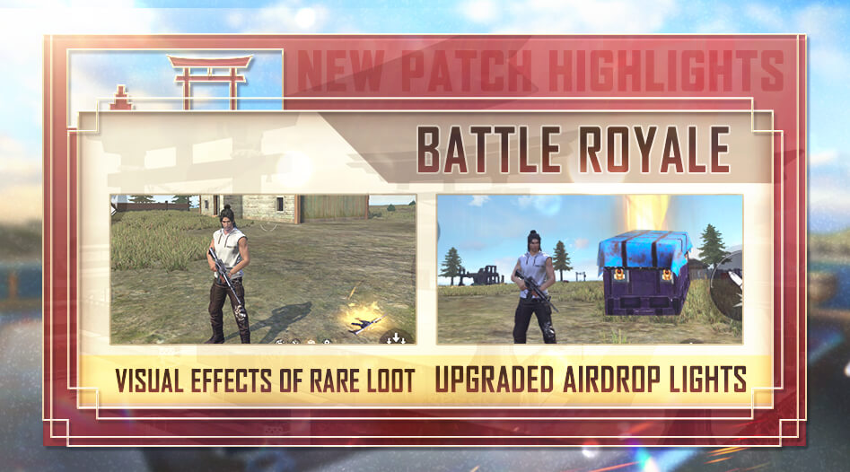
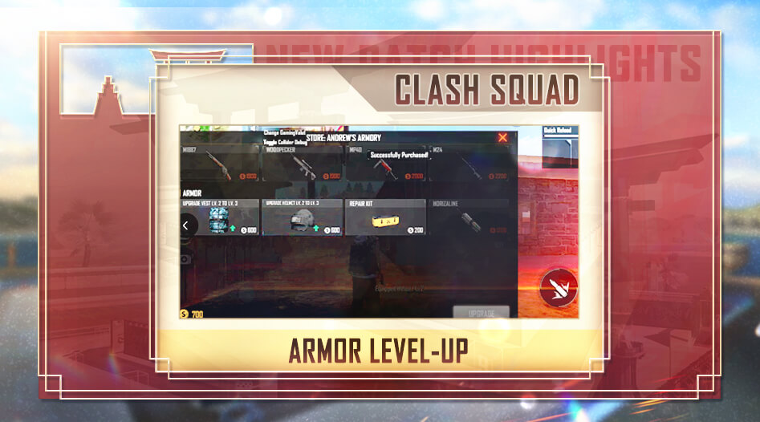
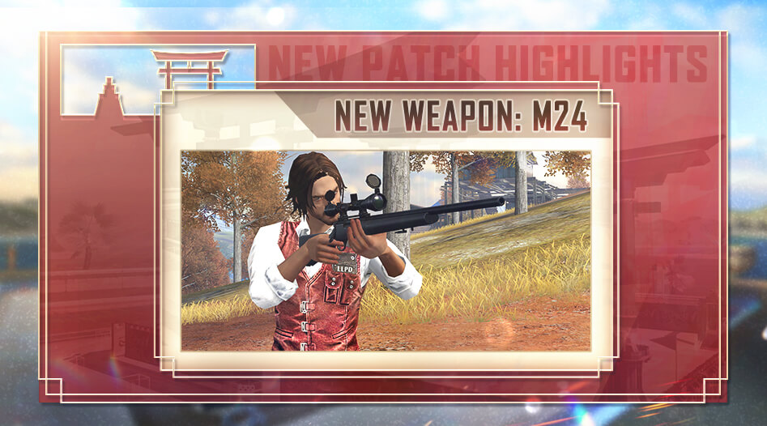
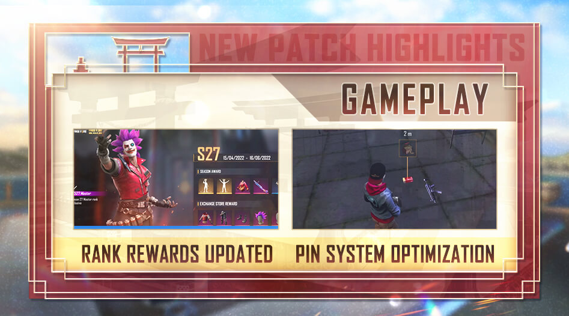
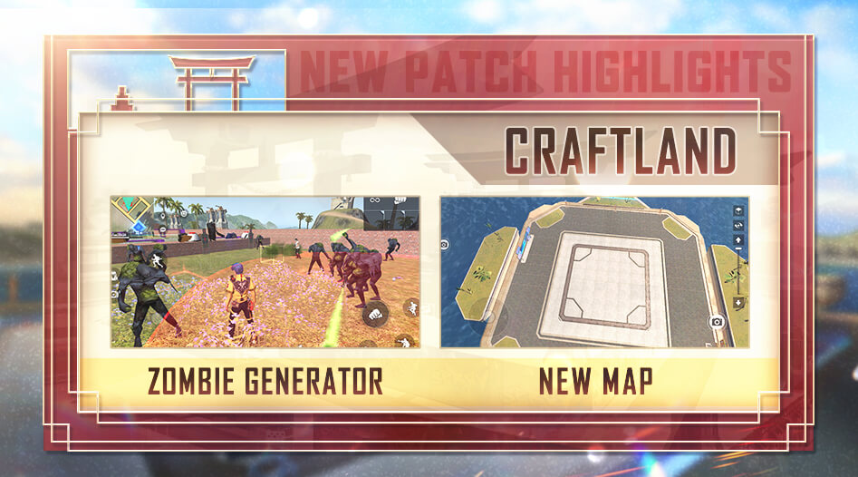

# Free Fire · OB34 · Rampage（2022 年 5 月补丁）

- 公告日期：2022-05-25
- 官方来源：[PATCH NOTES: RAMPAGE](https://ff.garena.com/en/article/735/)
- 审阅日期：2026-09-19
- 46 个分类小节；75 项说明及表格行；5 张官方公告插图。

逐项复核本篇 BR、CS 与通用局内章节；独立玩法和局外内容另列目录处置。未将公告日期当作统一上线日期。全部正文图已归档并按实际图像内容关联。

公告日：2022-05-25。Craftland 中 FF Craftmate 与 Debug Tool 标为 6/2 12:00 GMT+8 可用；其余条目未另列生效时间。

## BR · 大逃杀

### 空投状态与落点提示

- 归属：BR · 大逃杀 / 常规调整
- 原文小节：Battle Royale > Airdrop Enhancements
- 时间：公告日：2022-05-25；原文未列本项统一的精确生效时刻。

BR：稀有物资光效与空投光柱。原文：Battle Royale > Airdrop Enhancements / Visual Effects of Rare Loot。[官方原图](https://cdn.wildflamestudio.com/common/web_event/aswqooiwd/d5830/en-2.jpg) · 947×526。

- 空投被搜刮后，即使仍有物品，光柱也会消失。
- 玩家靠近即将落下的空投时，落点出现信号。
- 含稀有物品的空投用更明亮光柱标记。
- 未被搜刮的空投用脉冲光柱标记。
- 小地图上的空投售货机图标颜色调整。
- 怪物卡车的光柱删除。

### 稀有物资光效分级

- 归属：BR · 大逃杀 / 常规调整
- 原文小节：Battle Royale > Visual Effects of Rare Loot
- 时间：公告日：2022-05-25；原文未列本项统一的精确生效时刻。

- 金色：I级终极武器。
- 金色+：II级终极武器、普通空投武器、升级芯片、Lv.4防弹衣、Lv.4头盔及FF Coin堆（>500）。
- 红色：III级终极武器及升级空投武器。

### 复活点开放时长

- 归属：BR · 大逃杀 / 常规调整
- 原文小节：Battle Royale > Other Battle Royale Mode Adjustments
- 时间：公告日：2022-05-25；原文未列本项统一的精确生效时刻。

- 复活点可用时长600秒→620秒。

### 售货机任务与UAV价格

- 归属：BR · 大逃杀 / 常规调整
- 原文小节：Battle Royale > Other Battle Royale Mode Adjustments
- 时间：公告日：2022-05-25；原文未列本项统一的精确生效时刻。

- 售货机中的悬赏目标任务（Hit List）和无人机（UAV）价格 600→400；该小节未列货币单位。

### 售货机物品池

- 归属：BR · 大逃杀 / 常规调整
- 原文小节：Battle Royale > Other Battle Royale Mode Adjustments
- 时间：公告日：2022-05-25；原文未列本项统一的精确生效时刻。

- 售货机不再提供PLASMA、FAMAS、M60和M4A1。
- 售货机新增M24、UMP、M1014和狙击弹药；狙击弹药仅1组。

### 地面治疗包与冰墙掉落

- 归属：BR · 大逃杀 / 常规调整
- 原文小节：Battle Royale > Other Battle Royale Mode Adjustments
- 时间：公告日：2022-05-25；原文未列本项统一的精确生效时刻。

- 治疗包数量提高15%。
- 地面生成的冰墙减少10%。

### 终极武器与Charge Buster掉落

- 归属：BR · 大逃杀 / 常规调整
- 原文小节：Battle Royale > Other Battle Royale Mode Adjustments
- 时间：公告日：2022-05-25；原文未列本项统一的精确生效时刻。

- 终极版VSS和Kar98k不再在地面生成。
- Charge Buster不再在地面生成，改为在空投和空投售货机中提供。
- 空投售货机的免费武器改为M14和MP5。

### 安全区外伤害节奏

- 归属：BR · 大逃杀 / 常规调整
- 原文小节：Battle Royale > Other Battle Royale Mode Adjustments
- 时间：公告日：2022-05-25；原文未列本项统一的精确生效时刻。

- 首次缩圈后，在安全区外170秒后伤害升至3。
- 第二次缩圈后，在安全区外270秒后伤害升至6。
- 第三次缩圈后，在安全区外360秒后伤害4→最高12，增长速度降低。
- 第四次缩圈后，在安全区外20秒后伤害8→最高24，增长速度降低。
- 新安全区出现时，受伤时长不会刷新。

## CS · 枪王对决

### CS：Bermuda 水坝掩体

- 归属：CS · 枪王对决 / 常规调整
- 原文小节：Clash Squad > Map Balancing Adjustments > Bermuda
- 时间：公告日：2022-05-25；原文未列本项统一的精确生效时刻。

- Bermuda 地图的 Nurek Dam（水坝）调整一侧集装箱位置。

### CS：Kalahari Santa Catarina 出生点

- 归属：CS · 枪王对决 / 常规调整
- 原文小节：Clash Squad > Map Balancing Adjustments > Kalahari
- 时间：公告日：2022-05-25；原文未列本项统一的精确生效时刻。

- Kalahari 地图的 Santa Catarina（船区）将一处出生点水平小幅移动，使双方到船的距离相等。
- CS 移除 Foundation 作战区域。

### CS：Alpine Fusion 出生点

- 归属：CS · 枪王对决 / 常规调整
- 原文小节：Clash Squad > Map Balancing Adjustments > Alpine
- 时间：公告日：2022-05-25；原文未列本项统一的精确生效时刻。

- Alpine 地图的 Fusion 作战区域调整两处出生点，使双方到高地区域的距离相等。

### CS商店护甲升级

- 归属：CS · 枪王对决 / 常规调整
- 原文小节：Clash Squad > Armor Upgrades
- 时间：公告日：2022-05-25；原文未列本项统一的精确生效时刻。

CS 商店：防弹衣和头盔从 2 级升至 3 级，各显示 600 现金。原文：Clash Squad > Armor Upgrades。[官方原图](https://cdn.wildflamestudio.com/common/web_event/aswqooiwd/d5830/en-5.jpg) · 947×526。

- 拥有Lv.2防弹衣时，可用升级按钮将护甲升至Lv.3；原文说明成本为600 CS Cash。
- 可在 CS 商店将头盔升至 3 级；同页配图显示 2→3 级头盔升级价格为 600 CS 现金（正文未列此价格）。

### CS：购买请求完成后自动致谢

- 归属：CS · 枪王对决 / 常规调整
- 原文小节：Other Adjustments > Optimizations
- 时间：公告日：2022-05-25；原文未列本项统一的精确生效时刻。

- 队友满足 CS 商店购买请求时，自动向其发送“谢谢”。

## 通用局内调整

### Wolfrahh：观众条件与爆头增减伤

- 归属：通用局内调整 / 常规调整
- 原文小节：Character > Reworks > Wolfrahh
- 时间：公告日：2022-05-25；原文未列本项统一的精确生效时刻。

原文通用章节，未单列适用模式；不据此推定所有独立玩法规则相同。

- 说明段将所需观众数由 6 降至 3，伤害增益由攻击四肢改为爆头；下列各级增益和上限依原文明细保留。
- 每次淘汰增加1名观众，观众数不会减少；每增加1名观众，承受爆头伤害降低2/3/4/6/8/10%（最高20/22/24/26/28/30%），对敌爆头伤害提高2/3/4/6/8/10%（最高20/22/24/26/28/30%）。

### Dimitri：自救期间移动

- 归属：通用局内调整 / 常规调整
- 原文小节：Character > Reworks > Dimitri
- 时间：公告日：2022-05-25；原文未列本项统一的精确生效时刻。

原文通用章节，未单列适用模式；不据此推定所有独立玩法规则相同。

- 使用Healing Heartbeat自救时可以移动，且不再持续失去HP。

### D-Bee：移动射击加速

- 归属：通用局内调整 / 常规调整
- 原文小节：Character > Reworks > D-Bee
- 时间：公告日：2022-05-25；原文未列本项统一的精确生效时刻。

原文通用章节，未单列适用模式；不据此推定所有独立玩法规则相同。

- 移动中开火的移速提高5/7/9/11/13/15%→10/12/14/16/18/20%；准确度提高20/23/27/32/38/45%。
- 使用不同武器时的移速提高计算方式优化。

### Alok：移速与治疗光环冷却

- 归属：通用局内调整 / 常规调整
- 原文小节：Character > Character Adjustments > Alok
- 时间：公告日：2022-05-25；原文未列本项统一的精确生效时刻。

原文通用章节，未单列适用模式；不据此推定所有独立玩法规则相同。

- 生成5m光环，移速提高10/11/12/13/14/15%，每秒回复5HP，持续5/6/7/8/9/10秒；效果不叠加；冷却45秒→70/66/62/58/54/50秒。

### Skyler：冰墙声波与回复

- 归属：通用局内调整 / 常规调整
- 原文小节：Character > Character Adjustments > Skyler
- 时间：公告日：2022-05-25；原文未列本项统一的精确生效时刻。

原文通用章节，未单列适用模式；不据此推定所有独立玩法规则相同。

- 向前释放声波，在50/58/67/77/88/100m内对5面冰墙造成伤害；冷却60/58/55/51/46/40秒→85/80/75/70/65/60秒。
- 每部署一面冰墙会触发 HP 回复，起始回复量为 4/5/6/7/8/9 点；回复效果不叠加。

### Steffie：防投掷物区域冷却

- 归属：通用局内调整 / 常规调整
- 原文小节：Character > Character Adjustments > Steffie
- 时间：公告日：2022-05-25；原文未列本项统一的精确生效时刻。

原文通用章节，未单列适用模式；不据此推定所有独立玩法规则相同。

- 创建4m区域阻挡投掷物；区域内友军每秒回复10%护甲耐久，敌方弹药伤害降低10/12/14/16/18/20%；持续10/11/12/13/14/15秒，冷却115/110/105/100/95/90秒→85/80/75/70/65/60秒，效果不叠加。

### Chrono：防护力场冷却

- 归属：通用局内调整 / 常规调整
- 原文小节：Character > Character Adjustments > Chrono
- 时间：公告日：2022-05-25；原文未列本项统一的精确生效时刻。

原文通用章节，未单列适用模式；不据此推定所有独立玩法规则相同。

- 力场阻挡800点伤害；身处力场内无法攻击外部敌人；效果持续4/4/5/5/6/6秒，冷却180/164/150/138/128/120秒→160/150/140/130/120/110秒。

### Kenta：正面护盾减伤与冷却

- 归属：通用局内调整 / 常规调整
- 原文小节：Character > Character Adjustments > Kenta
- 时间：公告日：2022-05-25；原文未列本项统一的精确生效时刻。

原文通用章节，未单列适用模式；不据此推定所有独立玩法规则相同。

- 形成5m宽正面护盾，正面武器伤害减免50%→65%；持续2/3/3.5/4/4.5/5秒→5秒，开枪时重置；冷却210/200/190/180/170/160秒→120/110/100/90/80/70秒。

### Xayne：临时生命与破盾增伤

- 归属：通用局内调整 / 常规调整
- 原文小节：Character > Character Adjustments > Xayne
- 时间：公告日：2022-05-25；原文未列本项统一的精确生效时刻。

原文通用章节，未单列适用模式；不据此推定所有独立玩法规则相同。

- 临时HP 80→120（随时间衰减）；对冰墙和护盾伤害提高80/90/100/110/120/130%→100/120/140/160/180/200%；持续15秒→6秒；冷却150/140/130/120/110/100秒。

### Clu：敌人定位时长与冷却

- 归属：通用局内调整 / 常规调整
- 原文小节：Character > Character Adjustments > Clu
- 时间：公告日：2022-05-25；原文未列本项统一的精确生效时刻。

原文通用章节，未单列适用模式；不据此推定所有独立玩法规则相同。

- 定位50/55/60/65/70/75m内未趴下或蹲下的敌人；持续5/5.5/6/6.5/7/7.5秒→5/6/7/8/9/10秒，冷却75/72/69/66/63/60秒→75/70/65/60/55/50秒；敌人位置与队友共享。

### Wukong：灌木伪装期间移速

- 归属：通用局内调整 / 常规调整
- 原文小节：Character > Character Adjustments > Wukong
- 时间：公告日：2022-05-25；原文未列本项统一的精确生效时刻。

原文通用章节，未单列适用模式；不据此推定所有独立玩法规则相同。

- 变为灌木时移速降低20%→10%，持续15秒，冷却200秒；攻击时解除变身，击倒或淘汰敌人时重置冷却。

### Misha：驾驶速度与承伤

- 归属：通用局内调整 / 常规调整
- 原文小节：Character > Character Adjustments > Misha
- 时间：公告日：2022-05-25；原文未列本项统一的精确生效时刻。

原文通用章节，未单列适用模式；不据此推定所有独立玩法规则相同。

- 驾驶移速提高5/6/7/8/11/15/20%→2/3/4/6/8/10%。 原文旧数组有 7 个数值、新数组有 6 个，保留差异，不推定等级对应。
- 在载具内更难被锁定，承受伤害降低5/8/12/17/23/30%→5/6/8/11/15/20%。

### Nairi：冰墙回复与步枪破墙伤害

- 归属：通用局内调整 / 常规调整
- 原文小节：Character > Character Adjustments > Nairi
- 时间：公告日：2022-05-25；原文未列本项统一的精确生效时刻。

原文通用章节，未单列适用模式；不据此推定所有独立玩法规则相同。

- 部署后冰墙每1秒回复当前耐久的20/22/24/26/28/30%；使用AR攻击冰墙的伤害提高20/21/22/23/24/25%→30/31/32/33/34/35%。

### M24：新增狙击枪

- 归属：通用局内调整 / 常规调整
- 原文小节：Weapon and Balance > New Weapon: M24
- 时间：公告日：2022-05-25；原文未列本项统一的精确生效时刻。

原文通用章节，未单列适用模式；不据此推定所有独立玩法规则相同。

新增 M24 狙击枪。原文：Weapon and Balance > New Weapon: M24。[官方原图](https://cdn.wildflamestudio.com/common/web_event/aswqooiwd/d5830/en-4.jpg) · 947×526。

- M24基础伤害88，射速字段0.8（原文未列单位），弹匣15发。

### FAMAS 调整

- 归属：通用局内调整 / 常规调整
- 原文小节：Weapon and Balance > Weapon Adjustments > FAMAS
- 时间：公告日：2022-05-25；原文未列本项统一的精确生效时刻。

原文通用章节，未单列适用模式；不据此推定所有独立玩法规则相同。

- 有效射程-10%。

### M14 调整

- 归属：通用局内调整 / 常规调整
- 原文小节：Weapon and Balance > Weapon Adjustments > M14
- 时间：公告日：2022-05-25；原文未列本项统一的精确生效时刻。

原文通用章节，未单列适用模式；不据此推定所有独立玩法规则相同。

- 伤害-3%，有效射程-4%。

### M4A1-Z 调整

- 归属：通用局内调整 / 常规调整
- 原文小节：Weapon and Balance > Weapon Adjustments > M4A1-Z
- 时间：公告日：2022-05-25；原文未列本项统一的精确生效时刻。

原文通用章节，未单列适用模式；不据此推定所有独立玩法规则相同。

- 射速-3%。

### SCAR 调整

- 归属：通用局内调整 / 常规调整
- 原文小节：Weapon and Balance > Weapon Adjustments > SCAR
- 时间：公告日：2022-05-25；原文未列本项统一的精确生效时刻。

原文通用章节，未单列适用模式；不据此推定所有独立玩法规则相同。

- 护甲穿透+8%。

### GROZA 调整

- 归属：通用局内调整 / 常规调整
- 原文小节：Weapon and Balance > Weapon Adjustments > GROZA
- 时间：公告日：2022-05-25；原文未列本项统一的精确生效时刻。

原文通用章节，未单列适用模式；不据此推定所有独立玩法规则相同。

- 护甲穿透-8%。

### VSS 调整

- 归属：通用局内调整 / 常规调整
- 原文小节：Weapon and Balance > Weapon Adjustments > VSS
- 时间：公告日：2022-05-25；原文未列本项统一的精确生效时刻。

原文通用章节，未单列适用模式；不据此推定所有独立玩法规则相同。

- 射速-10%。

### UMP 调整

- 归属：通用局内调整 / 常规调整
- 原文小节：Weapon and Balance > Weapon Adjustments > UMP
- 时间：公告日：2022-05-25；原文未列本项统一的精确生效时刻。

原文通用章节，未单列适用模式；不据此推定所有独立玩法规则相同。

- 最低伤害-15%。

### Kar98K 调整

- 归属：通用局内调整 / 常规调整
- 原文小节：Weapon and Balance > Weapon Adjustments > Kar98K
- 时间：公告日：2022-05-25；原文未列本项统一的精确生效时刻。

原文通用章节，未单列适用模式；不据此推定所有独立玩法规则相同。

- 射速-10%。

### Kar98K-I 调整

- 归属：通用局内调整 / 常规调整
- 原文小节：Weapon and Balance > Weapon Adjustments > Kar98K-I
- 时间：公告日：2022-05-25；原文未列本项统一的精确生效时刻。

原文通用章节，未单列适用模式；不据此推定所有独立玩法规则相同。

- 切枪时间0.4→0.6，原文未列单位。

### 治疗狙击枪：冷却与弹匣

- 归属：通用局内调整 / 常规调整
- 原文小节：Weapon and Balance > Weapon Adjustments > Treatment Sniper
- 时间：公告日：2022-05-25；原文未列本项统一的精确生效时刻。

原文通用章节，未单列适用模式；不据此推定所有独立玩法规则相同。

- 过热冷却速度+8%，弹匣+50%。

### AC80 调整

- 归属：通用局内调整 / 常规调整
- 原文小节：Weapon and Balance > Weapon Adjustments > AC80
- 时间：公告日：2022-05-25；原文未列本项统一的精确生效时刻。

原文通用章节，未单列适用模式；不据此推定所有独立玩法规则相同。

- 射速-10%。

### M79 调整

- 归属：通用局内调整 / 常规调整
- 原文小节：Weapon and Balance > Weapon Adjustments > M79
- 时间：公告日：2022-05-25；原文未列本项统一的精确生效时刻。

原文通用章节，未单列适用模式；不据此推定所有独立玩法规则相同。

- 伤害-15%，爆炸范围-10%。

### 标记：小地图、倒地使用与队友反馈

- 归属：通用局内调整 / 常规调整
- 原文小节：Gameplay > Pin Function
- 时间：公告日：2022-05-25；原文未列本项统一的精确生效时刻。

原文通用章节，未单列适用模式；不据此推定所有独立玩法规则相同。

段位奖励界面与物品标记；S27 界面日期为 4 月 15 日至 6 月 16 日。原文：Rank System Optimization / Gameplay > Pin Function。[官方原图](https://cdn.wildflamestudio.com/common/web_event/aswqooiwd/d5830/en-3.jpg) · 947×526。

- 已标记位置显示在小地图上。
- 倒地时仍可使用标记。
- 可标记的最远物体/玩家距离提高，但原文未列数值。
- 长按物资列表可标记物品。
- 队友点击“确认”（OK）后，该物品标记对这名队友的持续时间延长。
- 小地图和队伍列表以不同颜色标记队友。
- 发送快捷消息时，队友在队伍列表收到图标通知。

### 枪声视觉提示

- 归属：通用局内调整 / 常规调整
- 原文小节：Gameplay > Visual Alerts for Gunshots
- 时间：公告日：2022-05-25；原文未列本项统一的精确生效时刻。

原文通用章节，未单列适用模式；不据此推定所有独立玩法规则相同。

- 在设置菜单打开枪声提示后，屏幕显示攻击方敌人的方向。

### 角色升级界面：碎片购买

- 归属：通用局内调整 / 常规调整
- 原文小节：Gaming Environment > Character Level-Up
- 时间：公告日：2022-05-25；原文未列本项统一的精确生效时刻。

发生在角色升级配置界面，影响可带入对局的角色技能成长；原文未列对局内获得方式。

- 角色升级界面可用金币购买记忆碎片（Memory Fragments），无需在商城与角色界面之间来回切换。
- 记忆碎片不足时，可用钻石或金币购买剩余碎片；20 个碎片 = 250 金币。

### HUD设置按钮位置

- 归属：通用局内调整 / 常规调整
- 原文小节：Other Adjustments > Optimizations
- 时间：公告日：2022-05-25；原文未列本项统一的精确生效时刻。

原文通用章节，未单列适用模式；不据此推定所有独立玩法规则相同。

- HUD 中“设置”按钮的位置可自定义。

### 局内自动致谢

- 归属：通用局内调整 / 常规调整
- 原文小节：Other Adjustments > Optimizations
- 时间：公告日：2022-05-25；原文未列本项统一的精确生效时刻。

原文通用章节，未单列适用模式；不据此推定所有独立玩法规则相同。

- 他人扶起玩家时，自动向救援者发送“谢谢”。
- 拾取他人标记的物品时，自动向标记者发送“谢谢”。

### 局内点赞界面

- 归属：通用局内调整 / 常规调整
- 原文小节：Other Adjustments > Optimizations
- 时间：公告日：2022-05-25；原文未列本项统一的精确生效时刻。

原文通用章节，未单列适用模式；不据此推定所有独立玩法规则相同。

- 局内点赞设计更新。

### Free Fire MAX 对局性能

- 归属：通用局内调整 / 常规调整
- 原文小节：MAX EXCLUSIVE FEATURES > File Size and Performance Upgrades
- 时间：公告日：2022-05-25；原文未列本项统一的精确生效时刻。

仅Free Fire MAX。

- Free Fire MAX对局中的故障和设备过热发生情况减少；原文未给出性能指标或比例。

## 其他玩法与局外内容（目录摘要）

### 段位系统界面、奖励与任务

白金和钻石段位新增限时史诗武器皮肤；BR/CS 的 Heroic 和 Master 段位提供专属表情；兑换商店每个版本提供专属套装。赛季奖励与升段奖励合并，完成指定场次数可领取（未列场数）。更新段位界面、升段动画和 Master 徽章，大厅更突出段位信息。BR Heroic 用 1～5 星表示进度，每日挑战改为 3 项 BR 排位任务并增加类型。同页配图展示 S27 日期 2022-04-15～2022-06-16，仅为赛季界面日期，不是本补丁生效日期。

原文目录：Rank System Optimization

### 反作弊受害者段位保护

系统检测到玩家被作弊者淘汰后立即启用保护：BR 本场分数为负时不扣分（计算不含每日任务额外 20 分），为正时照常结算；CS 输局不扣段位星及保护分，赢局照常结算。属于段位结算，不推定改变局内淘汰结果。

原文目录：Gaming Environment > Adjustments Tailoring to Victims of Cheats

### Craftland地图与模式编辑器

此前仅 Free Fire MAX 提供的 Craftland 地图及模式编辑功能加入普通 Free Fire，补丁更新后立即可用。属于独立工坊玩法。

原文目录：Craftland > Craftland Map and Mode Editor in Free Fire

### Craftland：Isle of Champs 场景

创作地图场景选择：Origin Land为100×100，Isle of Champs为50×50；属独立Craftland编辑内容。 原文未列地图尺寸单位。

原文目录：Craftland > Isle of Champs

### Craftland：Zombie Spawn

创作工具新增Zombie Spawn，可配置每波数量、间隔、总波数、种类及HP/防御/移速/敌人扫描距离。

原文目录：Craftland > Interactive Item - Zombie Spawn

### Craftland：Tower

新增 Moco 1 防御塔，放置后不能移动；可配置生命值、伤害、防御、攻击间隔和敌人扫描距离。属于 Craftland 独立玩法。

原文目录：Craftland > Interactive Item - Tower

### Craftland：上传、分享与地图槽

地图下载、上传和分享移至 Craftland 主界面；删除编辑器原上传入口；编辑槽与分享槽合并显示地图分享状态。新增 Worktable 工作台，支持新建、编辑、分享、取消分享和删除设计。免费地图槽 1→5，现有地图数据不受影响，已购槽保留；总槽数为 5+N，N 为已解锁付费槽数。

原文目录：Craftland > User Experience for Creators / More Map Slots

### Craftland：FF Craftmate与Debug Tool

可在地图编辑器切换到 FF Craftmate 测试版，通过组合与填写区块设置玩法规则，初期提供 70 多种区块。仅在 Craftmate 下提供调试工具：向友方或敌方加入机器人，上限等于该对局配置的最大总玩家数；支持无敌、回复 HP、自我淘汰及传送命令；运行信息面板显示全部触发事件，说明段另提错误日志。两项均预告于 2022-06-02 12:00（GMT+8）开放。

原文目录：Craftland > FF Craftmate - Beta Version / Debug Tool (FF Craftmate)

### 下载、举报、公会、好友与队伍通知

队伍或房间内下载资源时，显示谁缺少资源及其下载进度；调整举报界面的易用性、公会个人奖励领取功能、好友申请列表，以及队伍已满的通知。

原文目录：Other Adjustments > Download Center Optimization / Optimizations

### 回放与Honor系统覆盖范围

回放支持Bomb Squad与Lone Wolf、Honor系统支持其排位，以及按段位区分Honor扣分，均属独立模式/局外荣誉系统；关联既有模式记录。

原文目录：Other Adjustments > Optimizations

### CS排位队友强退保护

CS排位中队友强退时获得额外保护分，属局外段位结算。

原文目录：Other Adjustments > Optimizations

### Free Fire MAX 下载中心资源

Free Fire MAX 减小文件体积、降低大厅性能消耗；独狼、活动、Alpine 地图及部分收藏资源改由下载中心管理。对局故障与过热另列局内章节。

原文目录：MAX EXCLUSIVE FEATURES > File Size and Performance Upgrades

### Craftland音效、表情与房主显示

创作/社交功能：对局音效输出质量、部分角色表情及队伍中显示大厅房主名称。

原文目录：MAX EXCLUSIVE FEATURES > Other Craftland Optimizations

## 其余原文配图

以下为尚未在上述小节内展示的原文图片，包括局外章节配图。

Craftland：僵尸生成器与新地图场景。原文：Craftland。[官方原图](https://cdn.wildflamestudio.com/common/web_event/aswqooiwd/d5830/en-1.jpg) · 947×526。

## 官方图片索引

正文图片按相关小节展示，版本总览及其他章节插图另列；同一原图只嵌入一次。

- [CS 商店：防弹衣和头盔从 2 级升至 3 级，各显示 600 现金](https://cdn.wildflamestudio.com/common/web_event/aswqooiwd/d5830/en-5.jpg) · 947×526 · 本地 `assets/ff-patches/735-01.jpg`
- [BR：稀有物资光效与空投光柱](https://cdn.wildflamestudio.com/common/web_event/aswqooiwd/d5830/en-2.jpg) · 947×526 · 本地 `assets/ff-patches/735-02.jpg`
- [新增 M24 狙击枪](https://cdn.wildflamestudio.com/common/web_event/aswqooiwd/d5830/en-4.jpg) · 947×526 · 本地 `assets/ff-patches/735-03.jpg`
- [段位奖励界面与物品标记；S27 界面日期为 4 月 15 日至 6 月 16 日](https://cdn.wildflamestudio.com/common/web_event/aswqooiwd/d5830/en-3.jpg) · 947×526 · 本地 `assets/ff-patches/735-04.jpg`
- [Craftland：僵尸生成器与新地图场景](https://cdn.wildflamestudio.com/common/web_event/aswqooiwd/d5830/en-1.jpg) · 947×526 · 本地 `assets/ff-patches/735-05.jpg`

## 版本关联来源

### [OB34官方编号依据](https://ff.garena.com/vn/article/736/)

官方越南同版标题明确OB34：Triệu Tập，角色重做与同版内容对应；地区公告5月24日，本篇5月25日不变。

## 原文目录（对照用）

- Rank System Optimization
- Character
- Reworks
- Character Adjustments
- Alok
- Skyler
- Steffie
- Chrono
- Kenta
- Xayne
- Clu
- Wukong
- Misha
- Nairi
- Clash Squad
- Map Balancing Adjustments
- Armor Upgrades
- Battle Royale
- Airdrop Enhancements
- Visual Effects of Rare Loot
- Other Battle Royale Mode Adjustments
- Weapon and Balance
- Weapon Adjustments
- Gameplay
- Pin Function
- Visual Alerts for Gunshots
- Gaming Environment
- Adjustments Tailoring to Victims of Cheats
- Character Level-Up
- Craftland
- Craftland Map and Mode Editor in Free Fire
- Isle of Champs
- Interactive Item - Zombie Spawn
- Interactive Item - Tower
- User Experience for Creators
- More Map Slots
- FF Craftmate - Beta Version
- Debug Tool (FF Craftmate)
- Other Adjustments
- Download Center Optimization
- Optimizations
- MAX EXCLUSIVE FEATURES
- File Size and Performance Upgrades
- Other Craftland Optimizations
