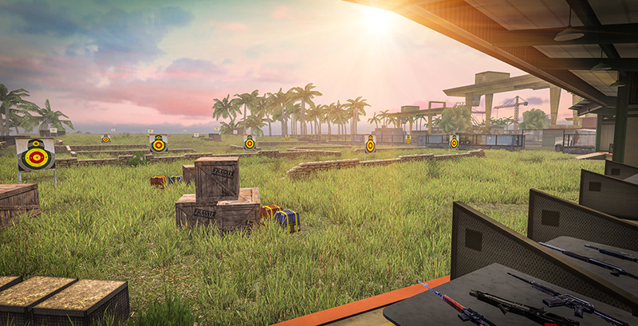
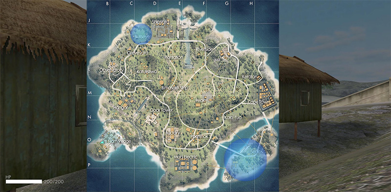
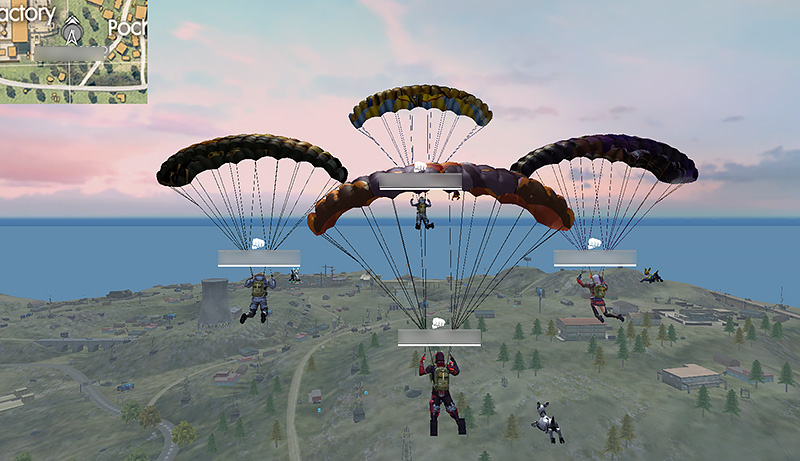
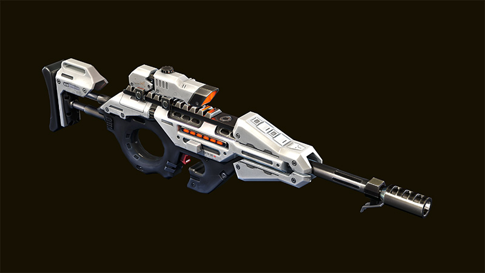
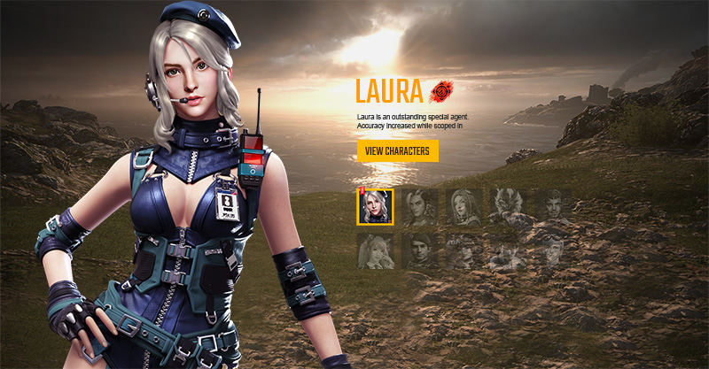
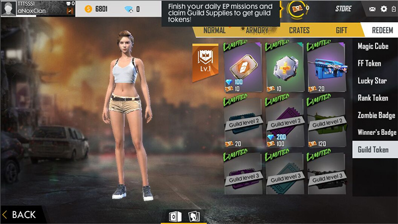
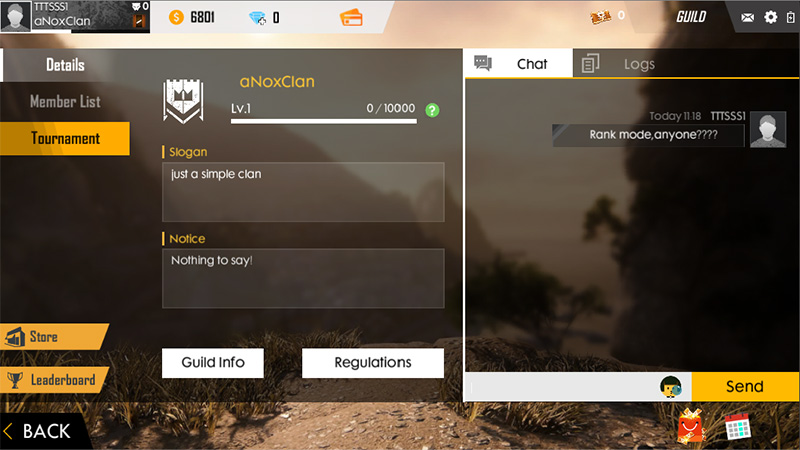
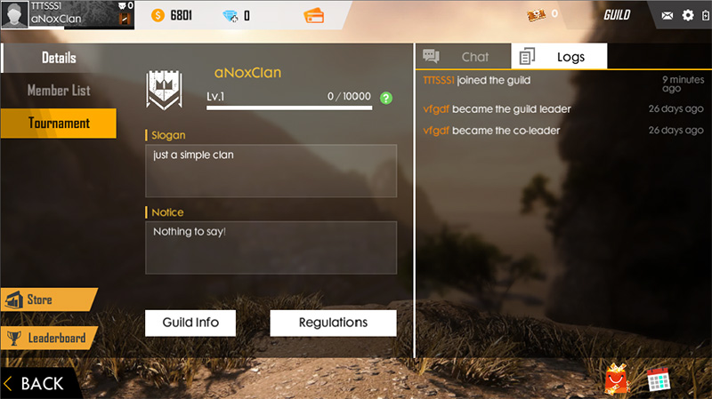
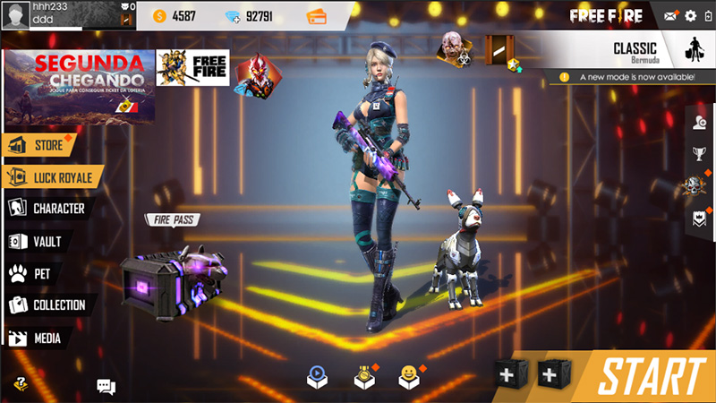

# Free Fire · 2019 年 5 月更新

- 公告日期：2019-05-08
- 官方来源：[THE END IS NEAR...](https://ff.garena.com/en/article/75/)
- 审阅日期：2026-09-19
- 10 个分类小节；14 项说明及表格行；11 张官方公告插图。

主流程逐项对照完整正文，并逐张核看全部11张正文图。地图、资源、装备、角色、移动、射击与局内提示分别记录；独立PvE与局外内容另列处置，不称为整篇逐项全译。

公告日：2019-05-08（官方目录 publishedDateText: 08/05/2019）；正文未另列实际生效日期。

## BR · 大逃杀

### 百慕大新增 Bullseye 区域

- 归属：BR · 大逃杀 / 常规调整
- 原文小节：New Features > New area in Bermuda - Bullseye
- 时间：公告日：2019-05-08（官方目录 publishedDateText: 08/05/2019）；正文未另列实际生效日期。

原文明示 Bermuda。

Bullseye 区域的射击靶、掩体和武器台。原文：New Features > New area in Bermuda - Bullseye。[官方原图](https://cdn.wildflamestudio.com/common/web_event/official/9cbcd5dae8b602.jpg) · 800×409。

- 百慕大新增 Bullseye 区域；同页官方配图展示射击靶、掩体和武器台，正文未列出建筑尺寸与物资配置。

### 新增高物资热区（Hot Zone）

- 归属：BR · 大逃杀 / 常规调整
- 原文小节：New Features > Added Hot Zone
- 时间：公告日：2019-05-08（官方目录 publishedDateText: 08/05/2019）；正文未另列实际生效日期。

正文未单列队列；同页配图明确使用百慕大大逃杀地图，按BR记录，不据单张示意图推定固定生成位置。

百慕大地图上的 Hot Zone 蓝色区域示意。原文：New Features > Added Hot Zone。[官方原图](https://cdn.wildflamestudio.com/common/web_event/official/4a5fd08be65c03.jpg) · 800×393。

- 新增高物资热区（Hot Zone，说明性译名），其中会生成高阶补给。同页配图展示百慕大地图上的蓝色区域；正文未列数量、每局位置或刷新规则。

### 百慕大新增滑索与弹射器

- 归属：BR · 大逃杀 / 常规调整
- 原文小节：New Features > Added additional ziplines and launchers on Bermuda
- 时间：公告日：2019-05-08（官方目录 publishedDateText: 08/05/2019）；正文未另列实际生效日期。

原文明示 Bermuda。

- 百慕大新增额外滑索（ziplines）。
- 百慕大新增额外弹射器（launchers）；数量和具体位置未说明。

### 新增情报装置 Info Box

- 归属：BR · 大逃杀 / 常规调整
- 原文小节：New Features > New Item: Info Box
- 时间：公告日：2019-05-08（官方目录 publishedDateText: 08/05/2019）；正文未另列实际生效日期。

原文未明说队列；安全区及空投语境明确为大逃杀局内信息。

Info Box 情报装置的官方外观图。原文：New Features > New Item: Info Box。[官方原图](https://cdn.wildflamestudio.com/common/web_event/official/8ef8449175c505.jpg) · 800×500。

- 新增情报装置（Info Box，说明性译名），可显示下一个安全区与当前对局内的空投。正文未给出获取方式、显示距离、使用条件或次数。

### 队伍跳伞与跳伞背景音乐

- 归属：BR · 大逃杀 / 常规调整
- 原文小节：New Features > Team Parachuting
- 时间：公告日：2019-05-08（官方目录 publishedDateText: 08/05/2019）；正文未另列实际生效日期。

原文未单列队列，按队伍跳伞的 BR 局内阶段记录。

队伍成员一同跳伞的官方实机画面。原文：New Features > Team Parachuting。[官方原图](https://cdn.wildflamestudio.com/common/web_event/official/8b3174a96d0506.jpg) · 800×461。

- 玩家可与队友一起跳伞；原文未说明跟随条件、队伍人数或取消方式。
- 跳伞期间加入 BGM；曲目及触发范围未说明。

### 弹射器尺寸、镜头与落地动画

- 归属：BR · 大逃杀 / 常规调整
- 原文小节：Optimizations > Player Launcher Optimization
- 时间：公告日：2019-05-08（官方目录 publishedDateText: 08/05/2019）；正文未另列实际生效日期。

原文为弹射器优化；未列明地图与适用队列。

- 为提高可见性而调整弹射器尺寸；具体尺寸未说明。
- 调整弹射器相关镜头和落地动画；原文未说明操作或动画时长。

## CS · 枪王对决

## 通用局内调整

### CG15：蓄力提高伤害

- 归属：通用局内调整 / 常规调整
- 原文小节：New Features > New Weapon: CG15
- 时间：公告日：2019-05-08（官方目录 publishedDateText: 08/05/2019）；正文未另列实际生效日期。

原文未单列 BR、CS 或其他队列。

新增武器 CG15 的官方外观图。原文：New Features > New Weapon: CG15。[官方原图](https://cdn.wildflamestudio.com/common/web_event/official/3f8c33b2e70104.jpg) · 800×450。

- 新增 CG15；官方称其为可蓄力以造成更高伤害的狙击枪。蓄力时间、伤害数值和适用队列未说明。

### Laura：开镜时提高精度

- 归属：通用局内调整 / 常规调整
- 原文小节：New Features > New Character - Laura
- 时间：公告日：2019-05-08（官方目录 publishedDateText: 08/05/2019）；正文未另列实际生效日期。

原文未单列模式。

Laura 角色与开镜精度技能简介。原文：New Features > New Character - Laura。[官方原图](https://cdn.wildflamestudio.com/common/web_event/official/adeb9971cc2207.jpg) · 800×417。

- 新增角色 Laura；技能为开镜（scoped-in）时提高精度。增幅数值、持续条件和适用模式未说明。

### 医疗/手雷使用提示与背包活动物品排序

- 归属：通用局内调整 / 常规调整
- 原文小节：Shop Update > Added an indicator for using medkits and grenades / Event items will be placed in the last spot in the inventory
- 时间：公告日：2019-05-08（官方目录 publishedDateText: 08/05/2019）；正文未另列实际生效日期。

原文未单列模式。

- 新增使用医疗包和手雷时的指示器；指示器形式和适用模式未说明。
- 活动物品会被放在背包最后一个位置。

### 蹲起后短时间降低射击精度

- 归属：通用局内调整 / 常规调整
- 原文小节：Optimizations > Shooting accuracy reduced shortly after un-crouching
- 时间：公告日：2019-05-08（官方目录 publishedDateText: 08/05/2019）；正文未另列实际生效日期。

该条未单列模式，作为通用射击调整单独记录，不与弹射器机制合并。

- 解除下蹲后短时间内降低射击精度；降低幅度和持续时间未说明。

## 其他玩法与局外内容（目录摘要）

### Guild Tokens：完成公会任务

完成公会任务可获得 Guild Tokens，属公会任务与货币系统。

原文目录：New Features > Guild System Upgrad

### Guild Tokens：商店兑换

Guild Tokens 可在 Free Fire Store 兑换专属物品，属局外商店。

原文目录：New Features > Guild System Upgrad

### 公会聊天与日志

新增公会聊天和日志，属社交系统。

原文目录：New Features > Guild System Upgrad

### Zombie Invasion：新增僵尸

独立 PvE 玩法 Zombie Invasion 新增一种僵尸；关联既有模式记录 free-fire-zombie-invasion-2019，不并入 BR/CS/shared。

原文目录：New Features > Zombie Invasion

### 阿拉伯语选项

新增阿拉伯语语言选项，属本地化设置。

原文目录：New Features

### 加载图与大厅背景

新增加载图和大厅背景图，属局外展示内容。

原文目录：New Features

### Luck Royale BGM

Luck Royale 加入新 BGM，属抽奖界面。

原文目录：New Features

### Death Uprising：UI

独立 PvE 玩法 Death Uprising 优化 UI；关联既有模式记录 free-fire-death-uprising-2019。

原文目录：Optimizations > Death Uprising Optimization

### Death Uprising：僵尸基础护甲

Death Uprising 的所有僵尸提高基础护甲；未给出数值。

原文目录：Optimizations > Death Uprising Optimization

### Death Uprising：击杀后随机增益掉落

Death Uprising 中击杀僵尸后有机会掉落随机增益；原文未说明概率或增益表。

原文目录：Optimizations > Death Uprising Optimization

### Death Uprising：武器槽 UI

Death Uprising 优化武器槽 UI。

原文目录：Optimizations > Death Uprising Optimization

### 比赛结果页面

优化比赛结果，属赛后内容。

原文目录：Optimizations

### 宠物 UI

优化宠物 UI；原文未说明为对局内 HUD，因此作为系统界面处理。

原文目录：Optimizations

### 商店武器 PvP/PvE 属性

商店武器显示 PvP 和 PvE 属性，属商店信息。

原文目录：Shop Update

### 新服装与收藏

新增服装和收藏，属外观/收藏。

原文目录：Shop Update

### 2x Exp、Gold、Fragment 图标

重设计 2x Exp、Gold、Fragment 图标以提高可见性，属奖励/商店展示。

原文目录：Shop Update

### 个人资料 Elite Pass 徽章

更新个人资料中的 Elite Pass 徽章展示。

原文目录：Shop Update

### BOOYAH 动画

调整 BOOYAH 动画；原文未说明该动画在对局内触发，因此按结算/展示处理。

原文目录：Shop Update

### 双倍排位分卡说明

为 2x rank points card 加入说明，属道具信息。

原文目录：Shop Update

### 排位赛季奖励详情

为排位赛季奖励加入 details 按钮，属赛季奖励界面。

原文目录：Shop Update

### 多开 Loot Crates

可一次打开多个 Loot Crates，属开箱流程。

原文目录：Shop Update

### 整套装备按钮

加入一次装备整套物品的按钮，属外观装备界面。

原文目录：Shop Update

### Weapon Royale voucher

新增 Weapon Royale voucher，属抽奖代币。

原文目录：Shop Update

### 领取全部 Elite Pass 奖励

加入 Get All 按钮以领取全部 Elite Pass 奖励。

原文目录：Shop Update

### 举报外挂感谢信

成功举报外挂的玩家会收到开发者感谢信，属通知/客服流程。

原文目录：Shop Update

## 其余原文配图

以下为尚未在上述小节内展示的原文图片，包括局外章节配图。

公会代币兑换商店界面。原文：New Features > Guild System Upgrad。[官方原图](https://cdn.wildflamestudio.com/common/web_event/official/a49ec8aaa69008.jpg) · 800×450。

新增公会聊天界面。原文：New Features > Guild System Upgrad。[官方原图](https://cdn.wildflamestudio.com/common/web_event/official/666686fc9c6409.jpg) · 800×450。

新增公会成员变更日志界面。原文：New Features > Guild System Upgrad。[官方原图](https://cdn.wildflamestudio.com/common/web_event/official/4e8ef2d6da6810.jpg) · 800×449。

该版本新增的加载宣传图。原文：New Features > New Loading Image and Lobby Background Image。[官方原图](https://cdn.wildflamestudio.com/common/web_event/official/1e95a1a0724812.jpg) · 800×450。

该版本大厅背景及界面示意。原文：New Features > New Loading Image and Lobby Background Image。[官方原图](https://cdn.wildflamestudio.com/common/web_event/official/975a516f47f213.jpg) · 800×450。

## 官方图片索引

正文图片按相关小节展示，版本总览及其他章节插图另列；同一原图只嵌入一次。

- [Bullseye 区域的射击靶、掩体和武器台](https://cdn.wildflamestudio.com/common/web_event/official/9cbcd5dae8b602.jpg) · 800×409 · 本地 `assets/ff-patches/75-01.jpg`
- [百慕大地图上的 Hot Zone 蓝色区域示意](https://cdn.wildflamestudio.com/common/web_event/official/4a5fd08be65c03.jpg) · 800×393 · 本地 `assets/ff-patches/75-02.jpg`
- [新增武器 CG15 的官方外观图](https://cdn.wildflamestudio.com/common/web_event/official/3f8c33b2e70104.jpg) · 800×450 · 本地 `assets/ff-patches/75-03.jpg`
- [Info Box 情报装置的官方外观图](https://cdn.wildflamestudio.com/common/web_event/official/8ef8449175c505.jpg) · 800×500 · 本地 `assets/ff-patches/75-04.jpg`
- [队伍成员一同跳伞的官方实机画面](https://cdn.wildflamestudio.com/common/web_event/official/8b3174a96d0506.jpg) · 800×461 · 本地 `assets/ff-patches/75-05.jpg`
- [Laura 角色与开镜精度技能简介](https://cdn.wildflamestudio.com/common/web_event/official/adeb9971cc2207.jpg) · 800×417 · 本地 `assets/ff-patches/75-06.jpg`
- [公会代币兑换商店界面](https://cdn.wildflamestudio.com/common/web_event/official/a49ec8aaa69008.jpg) · 800×450 · 本地 `assets/ff-patches/75-07.jpg`
- [新增公会聊天界面](https://cdn.wildflamestudio.com/common/web_event/official/666686fc9c6409.jpg) · 800×450 · 本地 `assets/ff-patches/75-08.jpg`
- [新增公会成员变更日志界面](https://cdn.wildflamestudio.com/common/web_event/official/4e8ef2d6da6810.jpg) · 800×449 · 本地 `assets/ff-patches/75-09.jpg`
- [该版本新增的加载宣传图](https://cdn.wildflamestudio.com/common/web_event/official/1e95a1a0724812.jpg) · 800×450 · 本地 `assets/ff-patches/75-10.jpg`
- [该版本大厅背景及界面示意](https://cdn.wildflamestudio.com/common/web_event/official/975a516f47f213.jpg) · 800×450 · 本地 `assets/ff-patches/75-11.jpg`

## 原文目录（对照用）

- New Features
- Optimizations
- Shop Update
