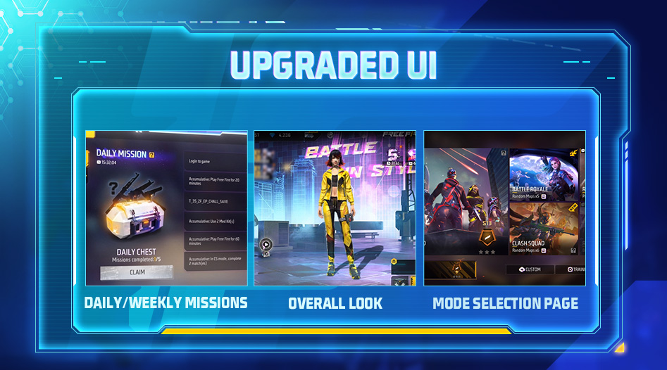
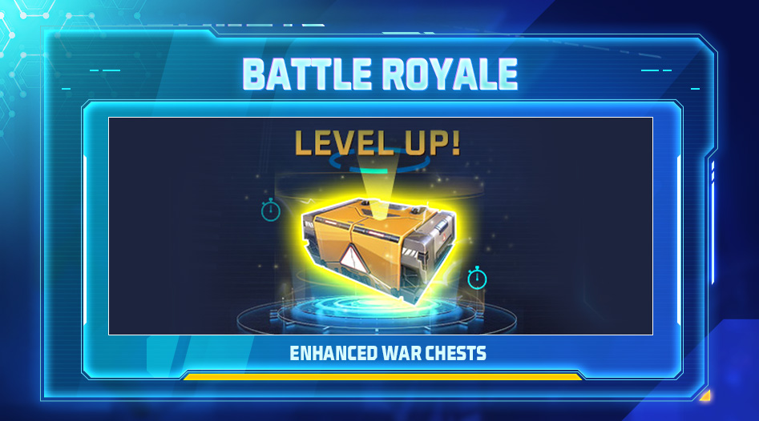
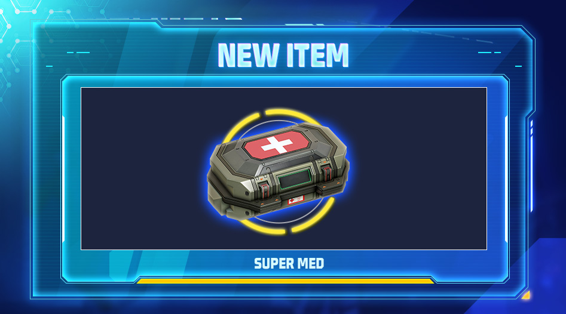
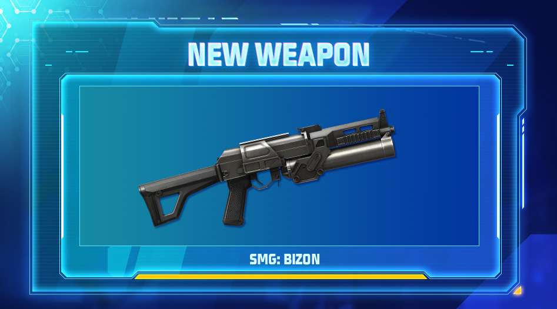
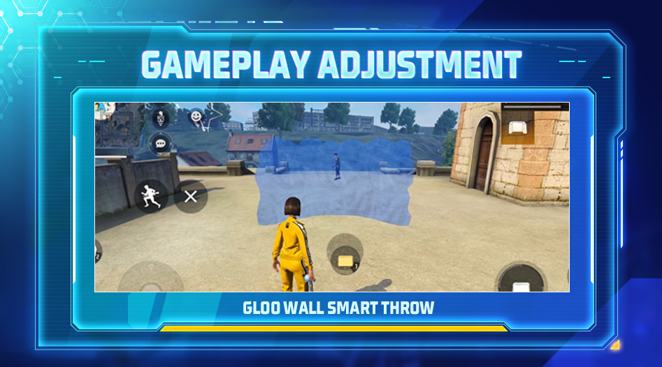
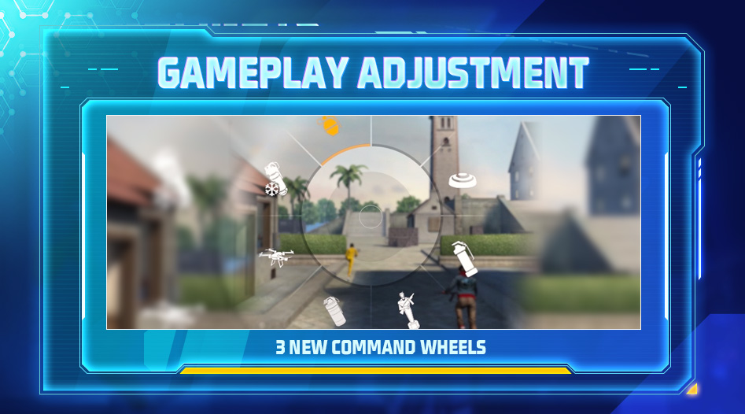

# Free Fire · 2022 年 7 月更新（5 周年）

- 公告日期：2022-07-20
- 官方来源：[PATCH NOTES: 5TH ANNIV.](https://ff.garena.com/en/article/811/)
- 审阅日期：2026-09-19
- 36 个分类小节；56 项说明及表格行；6 张官方公告插图。

逐项复核本篇 BR、CS 与通用局内章节；独立玩法和局外内容另列目录处置。未将公告日期当作统一上线日期。全部正文图已归档并按实际图像内容关联。

公告日：2022-07-20；原文未列全版本统一的精确生效时刻。

周年界面更新：大厅、任务与模式选择。原文：Upgraded UI。[官方原图](https://cdn.wildflamestudio.com/common/web_event/aswqooiwd/ytg7t/en-6.jpg) · 947×526。

## BR · 大逃杀

### BR战备箱等级与刷新

- 归属：BR · 大逃杀 / 常规调整
- 原文小节：Battle Royale > Enhanced War Chests
- 时间：公告日：2022-07-20；原文未列全版本统一的精确生效时刻。

BR：随时间升级的战备箱。原文：Battle Royale > Enhanced War Chests。[官方原图](https://cdn.wildflamestudio.com/common/web_event/aswqooiwd/ytg7t/en-3.jpg) · 947×526。

- 战备箱（War Chest）随对局时间升级，最高 3 级；未列各级升级时间。
- 1 级战备箱首次拾取免费，后续每次随机刷新物品需 100 FF 金币，每次拾取需 300 FF 金币。
- 只要 FF 金币足够，刷新次数不限。
- 高等级箱开出稀有物品的概率更高，未列概率。
- 稀有物品包括超级医疗包（Super Med）、Horizaline 道具、无人机（UAV）、升级芯片和各类空投武器等；该小节未解释 Horizaline 的作用。

### BR最终安全区随机性

- 归属：BR · 大逃杀 / 常规调整
- 原文小节：Battle Royale > Safe Zone Adjustment
- 时间：公告日：2022-07-20；原文未列全版本统一的精确生效时刻。

- BR缩圈逻辑调整，使最终安全区更随机；原文未给出具体公式或时长。

### BR：超级医疗包

- 归属：BR · 大逃杀 / 常规调整
- 原文小节：Battle Royale > Other Battle Royale Mode Adjustments
- 时间：公告日：2022-07-20；原文未列全版本统一的精确生效时刻。

新增超级医疗包（Super Med）。原文：Clash Squad > Other Clash Squad Updates / Battle Royale > Other Battle Royale Mode Adjustments。[官方原图](https://cdn.wildflamestudio.com/common/web_event/aswqooiwd/ytg7t/en-4.jpg) · 947×526。

- 新增超级医疗包（Super Med）：使用耗时 4 秒，在 4 秒内回复 200 HP。

### BR：Bizon

- 归属：BR · 大逃杀 / 常规调整
- 原文小节：Battle Royale > Other Battle Royale Mode Adjustments
- 时间：公告日：2022-07-20；原文未列全版本统一的精确生效时刻。

Bizon 冲锋枪。原文：Weapon and Balance > New Weapon: Bizon。[官方原图](https://cdn.wildflamestudio.com/common/web_event/aswqooiwd/ytg7t/en-5.jpg) · 947×526。

- BR其他调整列出新增武器Bizon；具体属性见Weapon and Balance。

### BR空投售货机地点

- 归属：BR · 大逃杀 / 常规调整
- 原文小节：Battle Royale > Other Battle Royale Mode Adjustments
- 时间：公告日：2022-07-20；原文未列全版本统一的精确生效时刻。

- 空投售货机投放地点增加，原文未列数量或地图。

### BR连杀播报与售货机免费标签

- 归属：BR · 大逃杀 / 常规调整
- 原文小节：Battle Royale > Other Battle Royale Mode Adjustments
- 时间：公告日：2022-07-20；原文未列全版本统一的精确生效时刻。

- 新增连杀播报。
- 售货机免费物品标注“Free”。

### BR安全区外伤害增长

- 归属：BR · 大逃杀 / 常规调整
- 原文小节：Battle Royale > Other Battle Royale Mode Adjustments
- 时间：公告日：2022-07-20；原文未列全版本统一的精确生效时刻。

- 连续在安全区外时，伤害提高所需时间缩短；原文未列具体时长。

## CS · 枪王对决

### CS：Kalahari出生点

- 归属：CS · 枪王对决 / 常规调整
- 原文小节：Clash Squad > Map Balancing Adjustments > Kalahari
- 时间：公告日：2022-07-20；原文未列全版本统一的精确生效时刻。

- Kalahari 的 The Maze（迷宫）与 Council Hall（议事厅）调整出生点，进行小幅水平移动，使双方到高地的距离相等；地名中文为说明性译法。

### CS计分板技能信息

- 归属：CS · 枪王对决 / 常规调整
- 原文小节：Clash Squad > Skills Details on the Scoreboard
- 时间：公告日：2022-07-20；原文未列全版本统一的精确生效时刻。

- CS计分板显示队友主动技能及冷却时间，以及对手主动技能。

### CS自定义房随机增益

- 归属：CS · 枪王对决 / 常规调整
- 原文小节：Clash Squad > Random Buffs
- 时间：公告日：2022-07-20；原文未列全版本统一的精确生效时刻。

- 仅 CS 自定义房：每场有概率随机出现下列一种效果，未给概率。
- 持续回复：未受到敌人攻击时，每秒回复 15 HP。
- 持续扣血：每秒失去 2 HP。
- 生命上限强化：最大 HP 提高至 325。

### CS：超级医疗包

- 归属：CS · 枪王对决 / 常规调整
- 原文小节：Clash Squad > Other Clash Squad Updates
- 时间：公告日：2022-07-20；原文未列全版本统一的精确生效时刻。

- 新增超级医疗包（Super Med）：使用耗时 4 秒，在 4 秒内回复 200 HP；可从空投获得。

### CS Ace点赞与UAV小地图

- 归属：CS · 枪王对决 / 常规调整
- 原文小节：Other Adjustments
- 时间：公告日：2022-07-20；原文未列全版本统一的精确生效时刻。

- CS 中队友完成全歼（Ace）后，可连续为其点赞，最多 10 次。
- CS中使用UAV的小地图显示优化。

### CS排位强退与重连

- 归属：CS · 枪王对决 / 常规调整
- 原文小节：Other Adjustments
- 时间：公告日：2022-07-20；原文未列全版本统一的精确生效时刻。

- CS排位不再支持从设置菜单强退。
- CS排位重连时窗延长；因网络或崩溃意外断线的玩家会在下次登录重连。

## 通用局内调整

### Miguel：Crazy Slayer

- 归属：通用局内调整 / 常规调整
- 原文小节：Character > Skill Rework > Miguel
- 时间：公告日：2022-07-20；原文未列全版本统一的精确生效时刻。

原文通用章节，未单列适用模式；不据此推定所有独立玩法规则相同。

- 获得 30/40/50/60/70/80 EP 的触发条件由淘汰敌人改为击倒敌人；每次回复量不变。

### Andrew：Wolf Pack

- 归属：通用局内调整 / 常规调整
- 原文小节：Character > Skill Adjustments > Andrew
- 时间：公告日：2022-07-20；原文未列全版本统一的精确生效时刻。

原文通用章节，未单列适用模式；不据此推定所有独立玩法规则相同。

- 防弹衣耐久损失降低2/4/6/8/10/12%→10/12/14/16/18/20%。

### Hayato：Art of Blades

- 归属：通用局内调整 / 常规调整
- 原文小节：Character > Skill Adjustments > Hayato
- 时间：公告日：2022-07-20；原文未列全版本统一的精确生效时刻。

原文通用章节，未单列适用模式；不据此推定所有独立玩法规则相同。

- 每最大HP降低10%时，护甲穿透提高7.5/8/8.5/9/9.5/10%→4.5/5/5.5/6/6.5/7%。 原文写 decrease in maximum HP，未另列计算公式；说明段明确讨论觉醒 Hayato。

### Antonio：Gangster’s Spirit

- 归属：通用局内调整 / 常规调整
- 原文小节：Character > Skill Adjustments > Antonio
- 时间：公告日：2022-07-20；原文未列全版本统一的精确生效时刻。

原文通用章节，未单列适用模式；不据此推定所有独立玩法规则相同。

- 回合开始时额外HP 10/15/20/25/30/35→15/20/25/30/35/40。

### Nikita：Firearms Expert

- 归属：通用局内调整 / 常规调整
- 原文小节：Character > Skill Adjustments > Nikita
- 时间：公告日：2022-07-20；原文未列全版本统一的精确生效时刻。

原文通用章节，未单列适用模式；不据此推定所有独立玩法规则相同。

- 装填速度提高14/16/18/20/22/24%；SMG加伤的最后子弹数6→10，伤害10/12/14/16/18/20%→15/18/21/24/27/30%。

### Joseph：Nutty Movement

- 归属：通用局内调整 / 常规调整
- 原文小节：Character > Skill Adjustments > Joseph
- 时间：公告日：2022-07-20；原文未列全版本统一的精确生效时刻。

原文通用章节，未单列适用模式；不据此推定所有独立玩法规则相同。

- 受伤后移动和冲刺速度提高10/12/14/16/18/20%→5/7/9/11/13/15%。

### Bizon：新增SMG

- 归属：通用局内调整 / 常规调整
- 原文小节：Weapon and Balance > New Weapon: Bizon
- 时间：公告日：2022-07-20；原文未列全版本统一的精确生效时刻。

原文通用章节，未单列适用模式；不据此推定所有独立玩法规则相同。

- Bizon 是用于近距离作战的冲锋枪；公告描述其射速高、精度低，未给精度数值。
- Bizon基础伤害29，射速字段0.098（原文未列单位），弹匣30。

### Famas-III 调整

- 归属：通用局内调整 / 常规调整
- 原文小节：Weapon and Balance > Weapon Adjustments > Famas-III
- 时间：公告日：2022-07-20；原文未列全版本统一的精确生效时刻。

原文通用章节，未单列适用模式；不据此推定所有独立玩法规则相同。

- 护甲穿透+5%。

### M14-III 调整

- 归属：通用局内调整 / 常规调整
- 原文小节：Weapon and Balance > Weapon Adjustments > M14-III
- 时间：公告日：2022-07-20；原文未列全版本统一的精确生效时刻。

原文通用章节，未单列适用模式；不据此推定所有独立玩法规则相同。

- 射速-6%。

### Scar 调整

- 归属：通用局内调整 / 常规调整
- 原文小节：Weapon and Balance > Weapon Adjustments > Scar
- 时间：公告日：2022-07-20；原文未列全版本统一的精确生效时刻。

原文通用章节，未单列适用模式；不据此推定所有独立玩法规则相同。

- 伤害+6%。

### G36 调整

- 归属：通用局内调整 / 常规调整
- 原文小节：Weapon and Balance > Weapon Adjustments > G36
- 时间：公告日：2022-07-20；原文未列全版本统一的精确生效时刻。

原文通用章节，未单列适用模式；不据此推定所有独立玩法规则相同。

- G36：近距离突击模式射速 +8%；中距离射程模式准确度 +12%。

### UMP 调整

- 归属：通用局内调整 / 常规调整
- 原文小节：Weapon and Balance > Weapon Adjustments > UMP
- 时间：公告日：2022-07-20；原文未列全版本统一的精确生效时刻。

原文通用章节，未单列适用模式；不据此推定所有独立玩法规则相同。

- 护甲穿透-10%。

### M24 调整

- 归属：通用局内调整 / 常规调整
- 原文小节：Weapon and Balance > Weapon Adjustments > M24
- 时间：公告日：2022-07-20；原文未列全版本统一的精确生效时刻。

原文通用章节，未单列适用模式；不据此推定所有独立玩法规则相同。

- 伤害+8%。

### M1887 调整

- 归属：通用局内调整 / 常规调整
- 原文小节：Weapon and Balance > Weapon Adjustments > M1887
- 时间：公告日：2022-07-20；原文未列全版本统一的精确生效时刻。

原文通用章节，未单列适用模式；不据此推定所有独立玩法规则相同。

- 射速+5%，有效射程+5%，伤害-5%。

### 钩爪枪：切枪、瞄准与落地恢复

- 归属：通用局内调整 / 常规调整
- 原文小节：Weapon and Balance > Weapon Adjustments > Grappling Hook Gun
- 时间：公告日：2022-07-20；原文未列全版本统一的精确生效时刻。

原文通用章节，未单列适用模式；不据此推定所有独立玩法规则相同。

- 移动中支持切枪。
- 支持按住瞄准。
- 落地恢复时间缩短；原文未列时长。

### 冰墙：智能放置

- 归属：通用局内调整 / 常规调整
- 原文小节：Gameplay > Gloo Wall Smart Throw
- 时间：公告日：2022-07-20；原文未列全版本统一的精确生效时刻。

原文通用章节，未单列适用模式；不据此推定所有独立玩法规则相同。

冰墙智能放置：长按瞄准位置。原文：Gameplay > Gloo Wall Smart Throw。[官方原图](https://cdn.wildflamestudio.com/common/web_event/aswqooiwd/ytg7t/en-2.jpg) · 947×526。

- 设置中开启智能放置（Smart Throw）后，轻点冰墙按钮可在面前快速放置。
- 也可长按冰墙按钮瞄准目标位置，松开确认放置。

### 局内指令轮盘

- 归属：通用局内调整 / 常规调整
- 原文小节：Gameplay > In-game Command Wheels
- 时间：公告日：2022-07-20；原文未列全版本统一的精确生效时刻。

原文通用章节，未单列适用模式；不据此推定所有独立玩法规则相同。

快捷消息、投掷物与医疗包指令轮盘。原文：Gameplay > In-game Command Wheels。[官方原图](https://cdn.wildflamestudio.com/common/web_event/aswqooiwd/ytg7t/en-1.jpg) · 947×526。

- 长按“使用”按钮开启指令轮盘。
- 轮盘支持快捷消息、投掷物和医疗包。

### 作弊玩家移除与通知

- 归属：通用局内调整 / 常规调整
- 原文小节：Other Adjustments
- 时间：公告日：2022-07-20；原文未列全版本统一的精确生效时刻。

原文通用章节，未单列适用模式；不据此推定所有独立玩法规则相同。

- 对局中检测到玩家作弊时自动将其移出对局，其余玩家收到系统通知。

### Gold获得视觉提示

- 归属：通用局内调整 / 常规调整
- 原文小节：Other Adjustments
- 时间：公告日：2022-07-20；原文未列全版本统一的精确生效时刻。

原文写 Gold，未明确适用模式、获得途径或是否指局内货币，保留范围疑点，不改称 FF Coins。

- 获得Gold时的视觉提示增强，数额会用特殊效果提示增长。

### Upgrade Chip、Charge Buster与技能图标反馈

- 归属：通用局内调整 / 常规调整
- 原文小节：Other Adjustments
- 时间：公告日：2022-07-20；原文未列全版本统一的精确生效时刻。

原文通用章节，未单列适用模式；不据此推定所有独立玩法规则相同。

- 优化升级芯片的使用体验；未列具体交互变化。
- 优化 Charge Buster 蓄力霰弹枪音效。
- 被动技能激活时技能图标视觉效果优化。
- 被A124沉默时技能图标视觉效果优化。

### 小地图外队友方向与自动拾取排序

- 归属：通用局内调整 / 常规调整
- 原文小节：Other Adjustments
- 时间：公告日：2022-07-20；原文未列全版本统一的精确生效时刻。

原文通用章节，未单列适用模式；不据此推定所有独立玩法规则相同。

- 队友位置超出小地图范围时会被标记以指示方向。
- 地面物资列表按自动拾取设置中的优先级显示。

### 闪光弹命中视觉效果

- 归属：通用局内调整 / 常规调整
- 原文小节：Other Adjustments
- 时间：公告日：2022-07-20；原文未列全版本统一的精确生效时刻。

原文通用章节，未单列适用模式；不据此推定所有独立玩法规则相同。

- 闪光弹命中敌人的视觉效果优化。

### 角色局内语音

- 归属：通用局内调整 / 常规调整
- 原文小节：Other Optimizations > Interactive Character Voices
- 时间：公告日：2022-07-20；原文未列全版本统一的精确生效时刻。

原文通用章节，未单列适用模式；不据此推定所有独立玩法规则相同。

- Kelly、Moco、Hayato、Maxim新增特定局内语音。
- 语音触发情形包括：对局胜利（Booyah）、CS 比分领先或落后、CS 购买装备、进入 BR 候机岛，以及从飞机跳伞。

## 其他玩法与局外内容（目录摘要）

### 整体UI、标志与弹窗

大厅、弹窗、Logo和图标视觉更新，属局外界面。

原文目录：Upgraded UI > Overall look

### BR/CS 匹配地图选择

BR 与 CS 休闲模式分别把地图合并为单一入口，匹配前可多选地图；模式选择页重新排版。属于匹配配置。

原文目录：Upgraded UI

### 日常/周常任务与赛后任务进度

日常/周常任务页重新排版，显示新增的每日宝箱和免费通行证大奖；显示每日任务进度与 EP 徽章，赛后结果页显示任务进度及状态。

原文目录：Upgraded UI > Daily/Weekly missions

### 收藏角色排序

角色收藏后显示在角色页和技能装备页顶部，属局外配置。

原文目录：Other Optimizations > Favorite Character

### 回放视角与集锦

回放新增切换视角按钮，支持第一/第三人称切换；新增击倒、淘汰、助攻、首杀、多重淘汰播报。可按对局表现自动生成高光，切换高光/普通播放，并开关背景音乐。

原文目录：Other Optimizations > Replay Feature Optimization

### 强退Honor保护

队伍只剩一人时，最后玩家强退不扣Honor分，属于局外荣誉结算。

原文目录：Other Adjustments

### 大厅或房间队友静音

大厅或房间内可静音/取消静音队友，属局外社交配置。

原文目录：Other Adjustments

### 预约、队码与好友推荐

对局中接受好友预约后，若好友在队伍中，可向其发送加入请求及私信；队伍代码支持复制粘贴；调整赛后好友推荐。

原文目录：Other Adjustments

### 下载中心资源图标

下载中心资源旁新增差异化奖励图标。

原文目录：Other Adjustments

### Lone Wolf：FF Knife

Lone Wolf模式新增FF Knife武器，属独立玩法。

原文目录：Other Adjustments

### Craftland PVE模板

Craftland 新增两类合作 PVE 模板：冲刺（Creative - Rush）需在与僵尸战斗期间、倒计时结束前，至少 1 名玩家通过每个检查点并到达终点；耐久（Creative - Endurance）需至少 1 名玩家在与僵尸战斗中存活至倒计时结束。

原文目录：Craftland > PVE Gameplay Design Template

### Craftland推荐与评论

Craftland主页显示官方地图推荐及理由；赛后和地图详情页可添加“Pros/Cons”评论标签。

原文目录：Craftland > Recommendation Feature / Map Comments Feature

### Craftland地图编辑器

Craftland 编辑器重新整理 HUD；可复制单个物件与成组物件；物件选择面板调整并新增分类；载具等可移动物可配置为每回合后回到原位；可缩放物件支持改色；新增物件，未列清单。

原文目录：Craftland > Map Editor Optimizations

### Craftland FF Craftmate

FF Craftmate 新增功能区块；新增视觉资源选择功能；部分物件支持脚本编辑；界面编辑新增按钮控件功能。

原文目录：Craftland > FF Craftmate Optimizations

## 官方图片索引

正文图片按相关小节展示，版本总览及其他章节插图另列；同一原图只嵌入一次。

- [周年界面更新：大厅、任务与模式选择](https://cdn.wildflamestudio.com/common/web_event/aswqooiwd/ytg7t/en-6.jpg) · 947×526 · 本地 `assets/ff-patches/811-01.jpg`
- [新增超级医疗包（Super Med）](https://cdn.wildflamestudio.com/common/web_event/aswqooiwd/ytg7t/en-4.jpg) · 947×526 · 本地 `assets/ff-patches/811-02.jpg`
- [BR：随时间升级的战备箱](https://cdn.wildflamestudio.com/common/web_event/aswqooiwd/ytg7t/en-3.jpg) · 947×526 · 本地 `assets/ff-patches/811-03.jpg`
- [Bizon 冲锋枪](https://cdn.wildflamestudio.com/common/web_event/aswqooiwd/ytg7t/en-5.jpg) · 947×526 · 本地 `assets/ff-patches/811-04.jpg`
- [冰墙智能放置：长按瞄准位置](https://cdn.wildflamestudio.com/common/web_event/aswqooiwd/ytg7t/en-2.jpg) · 947×526 · 本地 `assets/ff-patches/811-05.jpg`
- [快捷消息、投掷物与医疗包指令轮盘](https://cdn.wildflamestudio.com/common/web_event/aswqooiwd/ytg7t/en-1.jpg) · 947×526 · 本地 `assets/ff-patches/811-06.jpg`

## 原文目录（对照用）

- Upgraded UI
- Character
- Skill Rework
- Skill Adjustments
- Clash Squad
- Map Balancing Adjustments
- Skills Details on the Scoreboard
- Random Buffs
- Other Clash Squad Updates
- Battle Royale
- Enhanced War Chests
- Safe Zone Adjustment
- Other Battle Royale Mode Adjustments
- Weapon and Balance
- New Weapon: Bizon
- Weapon Adjustments
- Gameplay
- Gloo Wall Smart Throw
- In-game Command Wheels
- Other Optimizations
- Favorite Character
- Replay Feature Optimization
- Interactive Character Voices
- Other Adjustments
- Craftland
- PVE Gameplay Design Template
- Recommendation Feature
- Map Comments Feature
- Map Editor Optimizations
- FF Craftmate Optimizations
