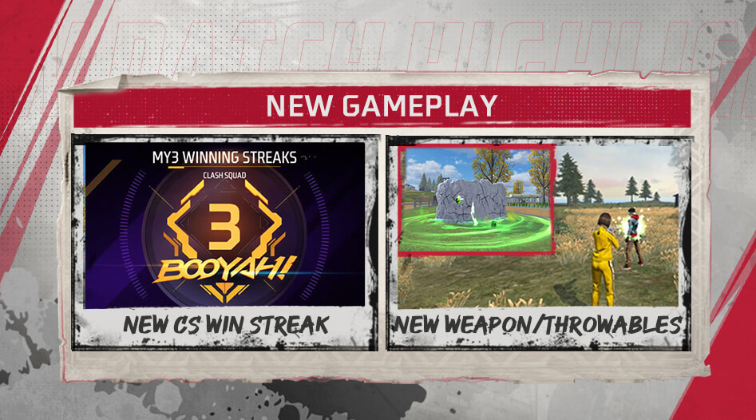
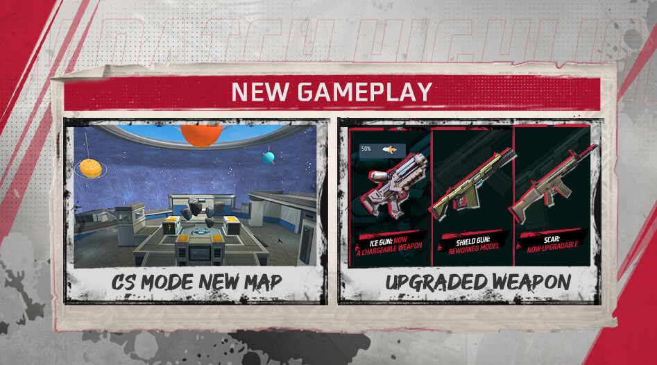
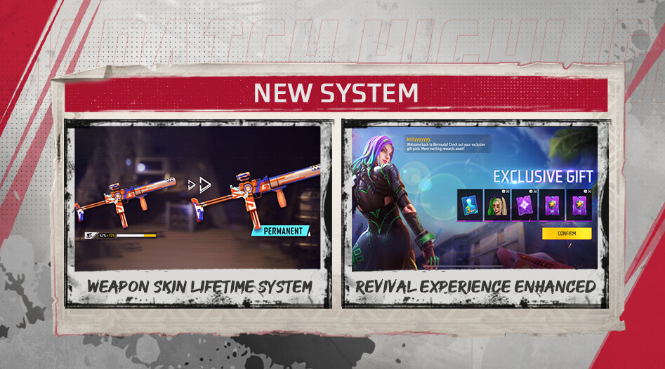

# Free Fire · 2022 年 9 月更新（BOOYAH DAY）

- 公告日期：2022-09-21
- 官方来源：[PATCH NOTES: BOOYAH DAY](https://ff.garena.com/en/article/871/)
- 审阅日期：2026-09-19
- 37 个分类小节；63 项说明及表格行；3 张官方公告插图。

逐项复核本篇 BR、CS 与通用局内章节；独立玩法和局外内容另列目录处置。未将公告日期当作统一上线日期。全部正文图已归档并按实际图像内容关联。

公告日：2022-09-21；Craftland 免费游玩次数和快速加入预告于 2022-09-23 12:00（GMT+8）开放；其余内容未列统一精确生效时刻。

## BR · 大逃杀

### BR复活点掩体、位置与数量

- 归属：BR · 大逃杀 / 常规调整
- 原文小节：Battle Royale > Revival Point Mechanism Adjustments
- 时间：公告日：2022-09-21；本项未另列精确生效时刻。

- 复活点增加柱体，发光显示复活进度并提供掩体。
- 复活点位置固定，不再随机。
- Bermuda、Alpine、Kalahari和Purgatory的复活点8→12。
- 对局开始时，小地图立即显示复活点。

### BR新物资与售货机

- 归属：BR · 大逃杀 / 常规调整
- 原文小节：Battle Royale > Other Battle Royale Mode Adjustments
- 时间：公告日：2022-09-21；本项未另列精确生效时刻。

- 新增地图物资：冰墙消融手雷（Gloo Melter）、治疗激光枪、精确射手步枪握把和霰弹枪枪托；护盾枪（Shield Gun）仅在 NeXTerra 提供。
- 移除加厚防弹衣附件（Vest Thickener）、霰弹枪枪口和双弹匣。
- 售货机新增冰墙消融手雷与狙击枪枪托；护盾枪仅在 NeXTerra 提供。
- 补给任务（Supply Missions）奖励新增冰枪（Ice Gun）。

### BR：治疗激光枪

- 归属：BR · 大逃杀 / 常规调整
- 原文小节：Weapon and Balance > New Weapon: Treatment Laser Gun
- 时间：公告日：2022-09-21；本项未另列精确生效时刻。

CS 三连胜、冰墙消融手雷与治疗激光枪。原文：Clash Squad > Clash Squad Winning Streak / Weapon and Balance。[官方原图](https://cdn.wildflamestudio.com/common/web_event/aswqooiwd/5d4fa/en-1.jpg) · 947×526。

- BR新增治疗武器；每发治疗10，射速字段0.12（原文未列单位），射程20m。

### BR倒地放弃生命

- 归属：BR · 大逃杀 / 常规调整
- 原文小节：Other Adjustments
- 时间：公告日：2022-09-21；本项未另列精确生效时刻。

- BR倒地时可选择放弃生命。

## CS · 枪王对决

### CS：NeXTerra地图区域

- 归属：CS · 枪王对决 / 常规调整
- 原文小节：Clash Squad > New Map
- 时间：公告日：2022-09-21；本项未另列精确生效时刻。

CS 新地图；冰枪可充能、护盾枪模型重做、SCAR 可升级。原文：Clash Squad > New Map / Weapon and Balance > Weapon Balance Adjustments。[官方原图](https://cdn.wildflamestudio.com/common/web_event/aswqooiwd/5d4fa/en-2.jpg) · 947×526。

- NeXTerra 加入普通与排位 CS，开放 7 个作战区域：Intellect Center（智识中心）、Mud Site（泥地区）、Deca Square（德卡广场）、Museum（博物馆）、Grav Labs（重力实验室）、Rust Town（锈蚀小镇）、Farmtopia（农场区）；地名中文为说明性译法。

### CS武器升级系统

- 归属：CS · 枪王对决 / 常规调整
- 原文小节：Clash Squad > Weapon Upgrade System
- 时间：公告日：2022-09-21；本项未另列精确生效时刻。

- CS商店提供可用CS Coins升级的武器。
- MP5可升级为MP5-I/MP5-II/MP5-III。
- FAMAS可升级为FAMAS-I/FAMAS-II/FAMAS-III。
- M60可升级为M60-I/M60-II/M60-III。
- M4A1可升级为M4A1-I/M4A1-II/M4A1-III。
- SCAR可升级为SCAR-I/SCAR-II/SCAR-III。

### CS队友技能组合显示

- 归属：CS · 枪王对决 / 常规调整
- 原文小节：Clash Squad > Teammate Skill Combination Display
- 时间：公告日：2022-09-21；本项未另列精确生效时刻。

- 队友技能组合新增显示位置：队伍大厅、战斗卡和 CS 计分板，便于查看队友携带的技能。

### CS连胜计分板

- 归属：CS · 枪王对决 / 常规调整
- 原文小节：Clash Squad > Clash Squad Winning Streak
- 时间：公告日：2022-09-21；本项未另列精确生效时刻。

- CS连胜在局内计分板显示；连续3胜获得连胜徽章，且Booyah后有连胜动画。

## 通用局内调整

### Tatsuya：Rebel Rush

- 归属：通用局内调整 / 常规调整
- 原文小节：Character > New Character > Tatsuya
- 时间：公告日：2022-09-21；本项未另列精确生效时刻。

原文通用章节，未单列适用模式；不据此推定所有独立玩法规则相同。

- 快速前冲0.2/0.2/0.2/0.3/0.3/0.3秒；冲刺补充时间175/160/150/140/130/120秒；最多积累2次使用，每次之间冷却5秒。

### Dimitri：Healing Heartbeat

- 归属：通用局内调整 / 常规调整
- 原文小节：Character > Skill Balancing Adjustments > Dimitri
- 时间：公告日：2022-09-21；本项未另列精确生效时刻。

原文通用章节，未单列适用模式；不据此推定所有独立玩法规则相同。

- 创建直径3.5m治疗区；区域内使用者与队友每秒HP回复3→5；倒地时可自行恢复起身；持续10/11/12/13/14/15秒，冷却85/80/75/70/65/60秒。

### D-Bee：Bullet Beats

- 归属：通用局内调整 / 常规调整
- 原文小节：Character > Skill Balancing Adjustments > D-Bee
- 时间：公告日：2022-09-21；本项未另列精确生效时刻。

原文通用章节，未单列适用模式；不据此推定所有独立玩法规则相同。

- 移动开火时移速提高10/12/14/16/18/20%→20/22/24/26/28/30%，准确度提高20/23/27/32/38/45%→35/38/42/47/53/60%。

### Nairi：Ice Iron

- 归属：通用局内调整 / 常规调整
- 原文小节：Character > Skill Balancing Adjustments > Nairi
- 时间：公告日：2022-09-21；本项未另列精确生效时刻。

原文通用章节，未单列适用模式；不据此推定所有独立玩法规则相同。

- 部署后冰墙每秒回复当前耐久20/22/24/26/28/30%→40/42/44/46/48/50%；使用AR攻击冰墙伤害提高30/31/32/33/34/35%。

### Miguel：Crazy Slayer

- 归属：通用局内调整 / 常规调整
- 原文小节：Character > Skill Balancing Adjustments > Miguel
- 时间：公告日：2022-09-21；本项未另列精确生效时刻。

原文通用章节，未单列适用模式；不据此推定所有独立玩法规则相同。

- 每次击倒获得EP 30/40/50/60/70/80→100/120/140/160/180/200。

### Laura：Sharp Shooter

- 归属：通用局内调整 / 常规调整
- 原文小节：Character > Skill Balancing Adjustments > Laura
- 时间：公告日：2022-09-21；本项未另列精确生效时刻。

原文通用章节，未单列适用模式；不据此推定所有独立玩法规则相同。

- 开镜时准确度提高10/13/17/22/28/35%→25/28/32/37/43/50%。

### Shirou：Damage Delivered

- 归属：通用局内调整 / 常规调整
- 原文小节：Character > Skill Balancing Adjustments > Shirou
- 时间：公告日：2022-09-21；本项未另列精确生效时刻。

原文通用章节，未单列适用模式；不据此推定所有独立玩法规则相同。

- 被80m→100m内敌人命中时，攻击者标记6秒（仅使用者可见）；对标记敌人的首发子弹额外护甲穿透50/58/67/77/88/100%，冷却25/24/22/19/15/10秒。

### NeXTerra：农场交互设施

- 归属：通用局内调整 / 常规调整
- 原文小节：Map > NeXTerra adjustment
- 时间：公告日：2022-09-21；本项未另列精确生效时刻。

地图章节未限定 BR 或 CS；NeXTerra 在本篇加入 CS，不能只因前一章是 BR 就将本项判为 BR 独占。

- Farmtopia（农场区）中央的旋转木马与二层移动平台启用。

### 新手与回归玩家组队角色进度

- 归属：通用局内调整 / 常规调整
- 原文小节：In-game Experience Optimizations > Team-Up Bonus and Buddy Mart
- 时间：公告日：2022-09-21；本项未另列精确生效时刻。

Buddy Mart奖励商店另列范围外。

- 与新手和回归玩家组队，可加快 LINK 角色解锁进度累积，并获得更多角色碎片；未列增幅。
- 新手和回归玩家获得的组队奖励加成可与同队队友共享。

### 冰墙消融手雷

- 归属：通用局内调整 / 常规调整
- 原文小节：Weapon and Balance > New Throwable: Gloo Melter
- 时间：公告日：2022-09-21；本项未另列精确生效时刻。

原文通用章节，未单列适用模式；不据此推定所有独立玩法规则相同。

- 冰墙消融手雷（Gloo Melter）爆炸后在目标位置形成圆形区域，持续 12 秒，对其中冰墙造成 150 伤害；原文未写伤害间隔，不能改为每秒 150。
- 生效期间，区域内冰墙受到武器攻击时承受双倍伤害；未列区域半径。

### 霰弹枪专用枪托

- 归属：通用局内调整 / 常规调整
- 原文小节：Weapon and Balance > New Attachments > Shotgun Stock
- 时间：公告日：2022-09-21；本项未另列精确生效时刻。

原文通用章节，未单列适用模式；不据此推定所有独立玩法规则相同。

- 保留普通 3 级枪托的准确度加成，装填耗时减少 0.2 秒，切枪耗时减少 0.1 秒。原文属性写 speed 却使用秒数，按耗时说明，不补百分比。

### 精确射手步枪专用握把

- 归属：通用局内调整 / 常规调整
- 原文小节：Weapon and Balance > New Attachments > Marksman Rifle Foregrip
- 时间：公告日：2022-09-21；本项未另列精确生效时刻。

原文通用章节，未单列适用模式；不据此推定所有独立玩法规则相同。

- 在普通Lv.3握把准确度加成基础上，射速+7%，开镜速度+10%。

### 狙击枪专用枪托

- 归属：通用局内调整 / 常规调整
- 原文小节：Weapon and Balance > New Attachments > Sniper Stock
- 时间：公告日：2022-09-21；本项未另列精确生效时刻。

原文通用章节，未单列适用模式；不据此推定所有独立玩法规则相同。

- 在普通Lv.3枪托准确度加成基础上，射速+7%，开镜时移速+10%。

### 霰弹枪爆头距离与配件槽

- 归属：通用局内调整 / 常规调整
- 原文小节：Weapon and Balance > Weapon Balance Adjustments > Shotgun Adjustments
- 时间：公告日：2022-09-21；本项未另列精确生效时刻。

原文通用章节，未单列适用模式；不据此推定所有独立玩法规则相同。

- MAG-7关闭枪口槽；最高爆头伤害距离7m→5m。
- SPAS12关闭枪口槽；最高爆头伤害距离8m→5m，最低爆头伤害距离13m→12m。
- M1887开放握把和枪托槽；最高爆头伤害距离7m→5m。
- M1014最高爆头伤害距离5m→4m。

### SMG、步枪与射手步枪爆头距离

- 归属：通用局内调整 / 常规调整
- 原文小节：Weapon and Balance > Weapon Balance Adjustments
- 时间：公告日：2022-09-21；本项未另列精确生效时刻。

原文通用章节，未单列适用模式；不据此推定所有独立玩法规则相同。

- 除VSS外的SMG最高爆头伤害距离12m→8m。
- 步枪最高爆头伤害距离30m→25m。
- 射手步枪最高爆头伤害距离35m、最低爆头伤害距离60m；最低爆头伤害系数5.5→4。

### PLASMA

- 归属：通用局内调整 / 常规调整
- 原文小节：Weapon and Balance > Weapon Balance Adjustments > PLASMA
- 时间：公告日：2022-09-21；本项未另列精确生效时刻。

原文通用章节，未单列适用模式；不据此推定所有独立玩法规则相同。

- 射速+12%。

### PARAFAL

- 归属：通用局内调整 / 常规调整
- 原文小节：Weapon and Balance > Weapon Balance Adjustments > PARAFAL
- 时间：公告日：2022-09-21；本项未另列精确生效时刻。

原文通用章节，未单列适用模式；不据此推定所有独立玩法规则相同。

- 射速+10%。

### FAMAS-II / FAMAS-III

- 归属：通用局内调整 / 常规调整
- 原文小节：Weapon and Balance > Weapon Balance Adjustments > FAMAS-II / FAMAS-III
- 时间：公告日：2022-09-21；本项未另列精确生效时刻。

原文通用章节，未单列适用模式；不据此推定所有独立玩法规则相同。

- 护甲穿透+5%。

### VSS-II / VSS-III

- 归属：通用局内调整 / 常规调整
- 原文小节：Weapon and Balance > Weapon Balance Adjustments > VSS-II / VSS-III
- 时间：公告日：2022-09-21；本项未另列精确生效时刻。

原文通用章节，未单列适用模式；不据此推定所有独立玩法规则相同。

- 射速-5%。

### M24

- 归属：通用局内调整 / 常规调整
- 原文小节：Weapon and Balance > Weapon Balance Adjustments > M24
- 时间：公告日：2022-09-21；本项未另列精确生效时刻。

原文通用章节，未单列适用模式；不据此推定所有独立玩法规则相同。

- 伤害+10%。

### 反器材发射器：对冰墙伤害

- 归属：通用局内调整 / 常规调整
- 原文小节：Weapon and Balance > Weapon Balance Adjustments > Anti-materiel Launcher
- 时间：公告日：2022-09-21；本项未另列精确生效时刻。

原文通用章节，未单列适用模式；不据此推定所有独立玩法规则相同。

- 对冰墙伤害100→640。

### 冰枪：改为可充能武器

- 归属：通用局内调整 / 常规调整
- 原文小节：Weapon and Balance > Weapon Balance Adjustments > Ice Gun
- 时间：公告日：2022-09-21；本项未另列精确生效时刻。

原文通用章节，未单列适用模式；不据此推定所有独立玩法规则相同。

- 改为可充能武器。

### SCAR升级路线

- 归属：通用局内调整 / 常规调整
- 原文小节：Weapon and Balance > Weapon Balance Adjustments > SCAR
- 时间：公告日：2022-09-21；本项未另列精确生效时刻。

原文通用章节，未单列适用模式；不据此推定所有独立玩法规则相同。

- SCAR成为可升级武器。
- SCAR→SCAR-I提高伤害和射速。
- SCAR-I→SCAR-II提高伤害和射速。
- SCAR-II→SCAR-III提高伤害和准确度。
- 各级增幅未列具体数值。

### 护盾枪：模型重做

- 归属：通用局内调整 / 常规调整
- 原文小节：Weapon and Balance > Weapon Balance Adjustments
- 时间：公告日：2022-09-21；本项未另列精确生效时刻。

原文通用章节，未单列适用模式；不据此推定所有独立玩法规则相同。

- 同页第一张配图标注护盾枪（Shield Gun）模型重做（Reworked Model）；该图未写护盾枪可升级，不将其与旁边的 SCAR 可升级混用。

### Lv.2与Lv.3头盔减伤

- 归属：通用局内调整 / 常规调整
- 原文小节：Weapon and Balance > Weapon Balance Adjustments > Adjusted armor
- 时间：公告日：2022-09-21；本项未另列精确生效时刻。

原文通用章节，未单列适用模式；不据此推定所有独立玩法规则相同。

- 2 级头盔减伤提高 2%。
- 3 级头盔减伤提高 1%。
- 原文未说明这两项是相对增幅还是百分点变化，未补算改后减伤率。

### 新默认HUD

- 归属：通用局内调整 / 常规调整
- 原文小节：Gameplay > New Default HUD
- 时间：公告日：2022-09-21；本项未另列精确生效时刻。

原文通用章节，未单列适用模式；不据此推定所有独立玩法规则相同。

- 自定义HUD界面新增默认HUD，投掷物、冰墙、快捷消息和标记按钮置于屏幕右侧，常用功能按钮更大。

### 护甲附件自动替换

- 归属：通用局内调整 / 常规调整
- 原文小节：Other Adjustments
- 时间：公告日：2022-09-21；本项未另列精确生效时刻。

原文通用章节，未单列适用模式；不据此推定所有独立玩法规则相同。

- 拾取护甲附件时自动替换为更高等级版本。

### 救起姿态与倒地信息

- 归属：通用局内调整 / 常规调整
- 原文小节：Other Adjustments
- 时间：公告日：2022-09-21；本项未另列精确生效时刻。

原文通用章节，未单列适用模式；不据此推定所有独立玩法规则相同。

- 倒地玩家被救起后可选择站立或蹲下。
- 倒地后可查看被淘汰原因和敌人伤害统计。

### 观战快捷消息与音频平衡

- 归属：通用局内调整 / 常规调整
- 原文小节：Other Adjustments
- 时间：公告日：2022-09-21；本项未另列精确生效时刻。

原文通用章节，未单列适用模式；不据此推定所有独立玩法规则相同。

- 观战时可使用快捷消息。
- 音频平衡功能可调整语音消息与音效比例且不影响总音量。

## 其他玩法与局外内容（目录摘要）

### 武器皮肤Lifetime进度

获取同款限时武器皮肤可累积 Lifetime 进度，达到 100% 后永久拥有，即使原限时有效期已结束也适用；图库可查看皮肤清单及其进度。

原文目录：System > Weapon Skins Lifetime Progress

### 段位保护卡与组队段位限制

BR/CS分别有对应限时排位保护卡，排位时自动使用且受段位/赛季/可用性限制；旧卡等量转换为新版本；达到指定段位可获得。非满编队伍有段位范围限制，满编队和休闲模式不适用。

原文目录：In-game Experience Optimizations > Rank and matchmaking adjustments

### 排位团队贡献结算

BR/CS排位救起、治疗队友和复活计入最终分数，明细显示在赛后页，属结算系统。

原文目录：In-game Experience Optimizations > Teamwork Appreciation

### Buddy Mart

与新手或回归玩家组队的过程中可获得伙伴币（Buddy Coins），在新增伙伴商店（Buddy Mart）兑换奖励。第三张配图展示回归礼包界面；不能据图将“Revival Experience”解释为局内复活机制。

原文目录：In-game Experience Optimizations > Team-Up Bonus and Buddy Mart

### Training Grounds与Social Island

Social Zone改为独立Social Island，可从模式选择页底部进入；该岛建有足球场，原文称球场开放后可使用，属独立社交/训练空间。

原文目录：Training Grounds

### 赛后任务、等级、签到与回放按钮

赛后任务加入veteran missions；等级弹窗、每日签到页和回放按钮位置更新，属局外页面。

原文目录：Other Adjustments

### 下载中心与举报反馈

下载中心不再自动下载过旧资源；成功举报后立即得到报告反馈。

原文目录：Other Adjustments

### Craftland Free Plays与Quick Join

Craftland 每周发放免费游玩次数，每周一凌晨 4 点刷新，发布自己的地图可获额外次数；原文未单列刷新时区。地图详情新增“快速加入”，可按所选地图找房，初期仅支持部分热门地图，说明段称房卡免费。两项均预告于 2022-09-23 12:00（GMT+8）开放。

原文目录：Craftland > Free Plays / Quick Join

### Craftland Droid Apocalypse模板

创作模板支持自定义人类/机器人属性、战区地形、回合时长和基础设置，属独立创作玩法。

原文目录：Craftland > Droid Apocalypse Mode Template

### Craftland自定义经济

Craftland Studio 支持自定义货币产出、商店物品与价格；部署售货机实现局内购买，可出售大多数武器装备，配置装备槽及定价，一张地图支持多个商店。

原文目录：Craftland > Customizable Game Economy

### Craftland其他编辑优化

调整部分模式默认地形；改进 Studio 易用性（未列具体操作）；支持全部载具类型；防御塔攻击支持中立设置；更新部分模式封面。

原文目录：Craftland > Other Craftland Optimizations

### CS连胜大厅与赛后展示

CS连胜还在团队大厅和赛后结果页显示，属局外大厅/赛后呈现。

原文目录：Clash Squad > Clash Squad Winning Streak

## 其余原文配图

以下为尚未在上述小节内展示的原文图片，包括局外章节配图。

武器皮肤永久进度与回归玩家礼包界面。原文：System / In-game Experience Optimizations。[官方原图](https://cdn.wildflamestudio.com/common/web_event/aswqooiwd/5d4fa/en-3.jpg) · 947×526。

## 官方图片索引

正文图片按相关小节展示，版本总览及其他章节插图另列；同一原图只嵌入一次。

- [CS 新地图；冰枪可充能、护盾枪模型重做、SCAR 可升级](https://cdn.wildflamestudio.com/common/web_event/aswqooiwd/5d4fa/en-2.jpg) · 947×526 · 本地 `assets/ff-patches/871-01.jpg`
- [CS 三连胜、冰墙消融手雷与治疗激光枪](https://cdn.wildflamestudio.com/common/web_event/aswqooiwd/5d4fa/en-1.jpg) · 947×526 · 本地 `assets/ff-patches/871-02.jpg`
- [武器皮肤永久进度与回归玩家礼包界面](https://cdn.wildflamestudio.com/common/web_event/aswqooiwd/5d4fa/en-3.jpg) · 947×526 · 本地 `assets/ff-patches/871-03.jpg`

## 原文目录（对照用）

- Character
- New Character
- Tatsuya: Impulsive Hothead
- Skill Balancing Adjustments
- Dimitri
- D-Bee
- Nairi
- Miguel
- Laura
- Shirou
- Clash Squad
- New Map
- Weapon Upgrade System
- Teammate Skill Combination Display
- Clash Squad Winning Streak
- Battle Royale
- Revival Point Mechanism Adjustments
- Other Battle Royale Mode Adjustments
- Map
- NeXTerra adjustment
- System
- Weapon Skins Lifetime Progress
- In-game Experience Optimizations
- Team-Up Bonus and Buddy Mart
- Weapon and Balance
- New Weapon: Treatment Laser Gun
- New Throwable: Gloo Melter
- New Attachments
- Weapon Balance Adjustments
- Gameplay
- New Default HUD
- Training Grounds
- Other Adjustments
- Craftland
- Free Plays
- Quick Join
- Droid Apocalypse Mode Template
- Customizable Game Economy
- Other Craftland Optimizations
