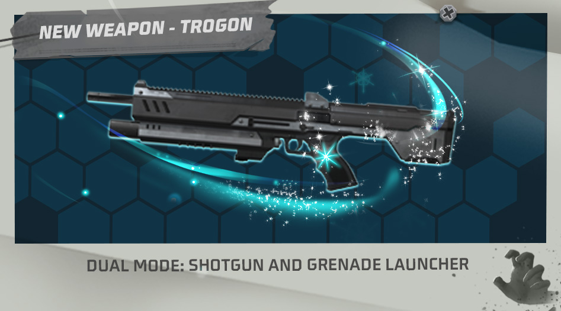
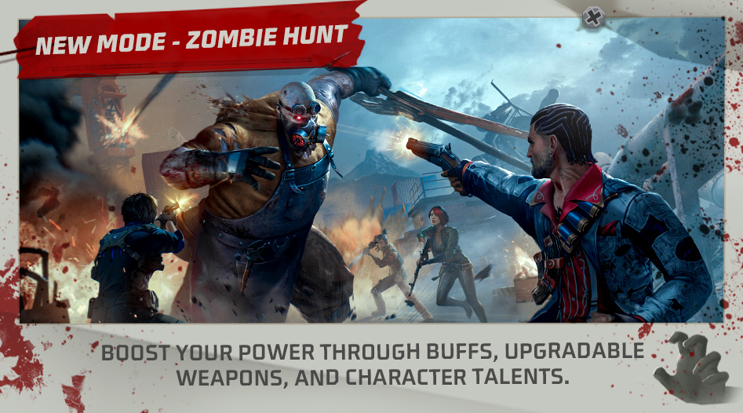
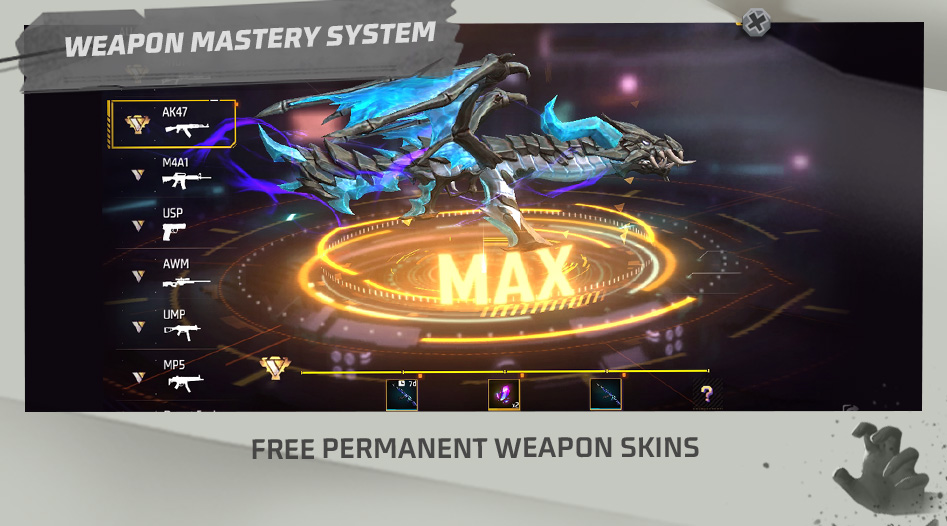

# Free Fire · OB37 · 2022 年 11 月更新

- 公告日期：2022-11-16
- 官方来源：[PATCH NOTES: WINTERLANDS](https://ff.garena.com/en/article/906/)
- 审阅日期：2026-09-19
- 35 个分类小节；85 项说明及表格行；3 张官方公告插图。

逐项复核本篇 BR、CS 与通用局内章节；独立玩法和局外内容另列目录处置。未将公告日期当作统一上线日期。全部正文图已归档并按实际图像内容关联。

公告日：2022-11-16；足球小队12月2日开放，Craftland匹配11月18日14:00（GMT+8）开放；局内常规项未另列精确时刻。

## BR · 大逃杀

### 防御空投

- 归属：BR · 大逃杀 / 常规调整
- 原文小节：Battle Royale > Defense Airdrop
- 时间：公告日：2022-11-16；本项未另列精确生效时刻。

- 在防御区内停留累积进度以解锁稀有空投物资；共3个防御阶段，每阶段给奖励。
- 占领越久解锁物资越好；进度显示在所有玩家小地图。

### BR缩圈时间与大小

- 归属：BR · 大逃杀 / 常规调整
- 原文小节：Battle Royale > Game Pacing Adjustments
- 时间：公告日：2022-11-16；本项未另列精确生效时刻。

第1～6圈的完整时序和大小仅适用于多人BR且不含NeXTerra；该地图多人和单排仅另列第一圈出现时刻。大小原文未说明半径或直径。

- 以下完整时序为非 NeXTerra 的多人 BR，均为开局后的时刻，非持续时长：第1圈出现110→50秒。
- 第1圈缩小/大小：200→130秒；550m→600m。
- 第2圈：出现410→360秒，缩小500→420秒，大小300m→320m。
- 第3圈：出现620→520秒，缩小695→580秒。
- 第4圈：出现770→655秒，缩小830→705秒。
- 第5圈：出现890→765秒，缩小935→800秒。
- 第6圈：出现980→845秒，缩小1010→875秒。
- NeXTerra 多人 BR 仅列首圈出现110→50秒；单排 BR 仅列首圈出现90→50秒。

### BR空投、复活与掉落池

- 归属：BR · 大逃杀 / 常规调整
- 原文小节：Battle Royale > Other Battle Royale Mode Adjustments
- 时间：公告日：2022-11-16；本项未另列精确生效时刻。

- 首个空投220→120秒；首个空投售货机500→360秒。
- 复活点关闭620→520秒；复活所需33→25秒；冷却180→120秒。
- M82B掉率+1%；Lv1背包-40%、Lv2+80%、Lv3+2%；Lv3头盔和防弹衣+1%。
- 机枪邻近弹药1组→2组；SMG邻近弹药1组→1–2组。
- Launch Pad经Secret Clues、空投和防御空投取得；新增Trogon、M1014-I及M1014-III掉落。

### Launch Pad

- 归属：BR · 大逃杀 / 常规调整
- 原文小节：Weapon and Balance > New Item - Launch Pad
- 时间：公告日：2022-11-16；本项未另列精确生效时刻。

- 放在地面后点击“使用”调整弹射方向；弹射按钮显示剩余使用次数。持续120秒，可用4次。

### BR Loadout规则与Bonfire

- 归属：BR · 大逃杀 / 常规调整
- 原文小节：Gameplay > Loadout Upgrades
- 时间：公告日：2022-11-16；本项未另列精确生效时刻。

- 每局只能携带1种战备（Loadout）。
- 篝火：开局3个；每秒回复25 HP、20 EP，持续10秒。
- 补给箱：复活时获得200 FF Coins、AK47和30发步枪弹药。
- 护甲箱：开局获得2级衣盔、2个修理包和200 FF Coins。
- 腿包：额外背包容量100，原文未列单位。
- 扫描：跳伞时揭示附近敌人，落地后继续扫描10秒。
- 空投援助：召唤空投。
- 秘密线索：跳伞时使用，在地图标出补给点，可取得钩爪枪、弹射板与600 FF Coins。
- 赏金代币：跳伞时使用，首次淘汰奖励400 FF Coins、随机配件和1级可升级武器。

## CS · 枪王对决

### CS安全区节奏

- 归属：CS · 枪王对决 / 常规调整
- 原文小节：Clash Squad > Game Pacing Adjustments
- 时间：公告日：2022-11-16；本项未另列精确生效时刻。

- 首圈第25秒→20秒开始缩小，第90秒→70秒完成缩小。

### CS购买阶段备弹

- 归属：CS · 枪王对决 / 常规调整
- 原文小节：Clash Squad > Extra Ammo
- 时间：公告日：2022-11-16；本项未另列精确生效时刻。

- 购买阶段结束时，为已装备武器补充备用弹药。

### CS商店价格与手雷上限

- 归属：CS · 枪王对决 / 常规调整
- 原文小节：Clash Squad > CS Store Cost Adjustments
- 时间：公告日：2022-11-16；本项未另列精确生效时刻。

- 升至3级价格800→1000。
- M4A1和FAMAS价格1100→1000。
- 手雷价格200→300，携带上限2→1。

### CS Loadout

- 归属：CS · 枪王对决 / 常规调整
- 原文小节：Gameplay > Loadout Upgrades
- 时间：公告日：2022-11-16；本项未另列精确生效时刻。

- 每局只能携带1种战备。篝火开局3个，每秒回复25 HP与20 EP，持续10秒。
- 补给箱逐回合开局奖励：第1回合武士刀；第2回合超级医疗包；第3回合2面冰墙；第4回合升级芯片；第5回合冰冻道具（Flash Freeze）、手雷和冰墙；第6回合篝火；第7回合四肢减伤护甲附件（Vest Enlarger）。
- 护甲箱：每回合开局恢复衣盔60%耐久；腿包：可多携带/购买2面冰墙。
- 扫描：本回合首个安全区开始缩小时标记全部敌人3秒，结果不与队友共享。
- 空投援助：从空投额外获得300 CS Cash。
- 赏金代币：每回合开始选择是否使用，前90秒每淘汰一人额外获得300 CS Cash；每局只能在一个回合使用。
- 秘密线索解锁秘密商店：500 CS Cash全队回复满EP；600全队每秒回复5 EP；400全队各得医疗包；2000使全队前10秒移速增加20%。

### CS 商店武器信息

- 归属：CS · 枪王对决 / 常规调整
- 原文小节：Other Adjustments
- 时间：公告日：2022-11-16；本项未另列精确生效时刻。

- 新增信息图标，查看武器详情。

## 通用局内调整

### K：Master of All

- 归属：通用局内调整 / 常规调整
- 原文小节：Character & Pet > K
- 时间：公告日：2022-11-16；本项未另列精确生效时刻。

原文通用章节，未单列适用模式；不据此推定所有独立玩法规则相同。

- 最大 EP 的技能增量由 +50→+20，不是总 EP 上限。柔术模式使6米内友军 EP 转換增益由500%→300/350/400/450/500/600%。
- 心理模式每次回复3 EP，间隔2.2/2/1.8/1.6/1.4/1→统一2秒；回复上限100/110/120/130/140/150→120/140/160/180/200/220 EP。
- 原文末尾写“Mode Switch CS 3s”，未解释CS缩写；仅保留模式切换3秒字段，不把它当作枪王对决专属规则。

### Clu：Tracing Steps

- 归属：通用局内调整 / 常规调整
- 原文小节：Character & Pet > Clu
- 时间：公告日：2022-11-16；本项未另列精确生效时刻。

原文通用章节，未单列适用模式；不据此推定所有独立玩法规则相同。

- 扫描范围50/55/60/65/70/75m→固定65m；不扫描趴下或蹲下敌人，持续5/6/7/8/9/10秒、冷却75/70/65/60/55/50秒，结果与队友共享。

### Nikita：Firearms Expert

- 归属：通用局内调整 / 常规调整
- 原文小节：Character & Pet > Nikita
- 时间：公告日：2022-11-16；本项未另列精确生效时刻。

原文通用章节，未单列适用模式；不据此推定所有独立玩法规则相同。

- 装填速度加成14/16/18/20/22/24%→统一20%；冲锋枪弹匣末尾强化弹数10→10/11/12/13/14/15发，额外伤害15/18/21/24/27/30%。按等级数组保留，不概括为所有等级都提高。

### Arvon：Dinoculars

- 归属：通用局内调整 / 常规调整
- 原文小节：Character & Pet > New Pet - Arvon
- 时间：公告日：2022-11-16；本项未另列精确生效时刻。

原文通用章节，未单列适用模式；不据此推定所有独立玩法规则相同。

- 侦测半径50m区域内任意位置敌人数量，持续3/4/6秒，结果与队友共享；每局最多1/2/3次。

### Trogon双模式

- 归属：通用局内调整 / 常规调整
- 原文小节：Weapon and Balance > New Weapon: Trogon
- 时间：公告日：2022-11-16；本项未另列精确生效时刻。

原文通用章节，未单列适用模式；不据此推定所有独立玩法规则相同。

Trogon双模式：霰弹枪与榴弹发射器。原文：Weapon and Balance > New Weapon: Trogon。[官方原图](https://cdn.wildflamestudio.com/common/web_event/official2.ff.garena.all/202211/4513bc3309ef8952c61add6c555ffa2b.jpg) · 947×526。

- 霰弹枪模式为3连发，伤害26、射程15；榴弹发射器模式伤害100、射程20。
- 原文射程字段15和20未给单位，不擅加米；可在两种射击模式之间切换。

### AN94

- 归属：通用局内调整 / 常规调整
- 原文小节：Weapon and Balance > Weapon Balance Adjustments
- 时间：公告日：2022-11-16；本项未另列精确生效时刻。

原文通用章节，未单列适用模式；不据此推定所有独立玩法规则相同。

- 射速+5%，射程+6%。

### MAC10

- 归属：通用局内调整 / 常规调整
- 原文小节：Weapon and Balance > Weapon Balance Adjustments
- 时间：公告日：2022-11-16；本项未另列精确生效时刻。

原文通用章节，未单列适用模式；不据此推定所有独立玩法规则相同。

- 准确度+5%。

### Thompson

- 归属：通用局内调整 / 常规调整
- 原文小节：Weapon and Balance > Weapon Balance Adjustments
- 时间：公告日：2022-11-16；本项未另列精确生效时刻。

原文通用章节，未单列适用模式；不据此推定所有独立玩法规则相同。

- 移动准确度+10%，射击时移速+10%。

### VSS-I

- 归属：通用局内调整 / 常规调整
- 原文小节：Weapon and Balance > Weapon Balance Adjustments
- 时间：公告日：2022-11-16；本项未另列精确生效时刻。

原文通用章节，未单列适用模式；不据此推定所有独立玩法规则相同。

- 不再持续造成伤害。

### VSS-II

- 归属：通用局内调整 / 常规调整
- 原文小节：Weapon and Balance > Weapon Balance Adjustments
- 时间：公告日：2022-11-16；本项未另列精确生效时刻。

原文通用章节，未单列适用模式；不据此推定所有独立玩法规则相同。

- 不再持续造成伤害。

### M500

- 归属：通用局内调整 / 常规调整
- 原文小节：Weapon and Balance > Weapon Balance Adjustments
- 时间：公告日：2022-11-16；本项未另列精确生效时刻。

原文通用章节，未单列适用模式；不据此推定所有独立玩法规则相同。

- 爆头有效距离-20%，伤害+10%。

### Desert Eagle

- 归属：通用局内调整 / 常规调整
- 原文小节：Weapon and Balance > Weapon Balance Adjustments
- 时间：公告日：2022-11-16；本项未另列精确生效时刻。

原文通用章节，未单列适用模式；不据此推定所有独立玩法规则相同。

- 爆头有效距离-20%，射速+5%。

### Woodpecker

- 归属：通用局内调整 / 常规调整
- 原文小节：Weapon and Balance > Weapon Balance Adjustments
- 时间：公告日：2022-11-16；本项未另列精确生效时刻。

原文通用章节，未单列适用模式；不据此推定所有独立玩法规则相同。

- 伤害有效距离+10%。

### AC80

- 归属：通用局内调整 / 常规调整
- 原文小节：Weapon and Balance > Weapon Balance Adjustments
- 时间：公告日：2022-11-16；本项未另列精确生效时刻。

原文通用章节，未单列适用模式；不据此推定所有独立玩法规则相同。

- 伤害有效距离-10%。

### Kar98k-I

- 归属：通用局内调整 / 常规调整
- 原文小节：Weapon and Balance > Weapon Balance Adjustments
- 时间：公告日：2022-11-16；本项未另列精确生效时刻。

原文通用章节，未单列适用模式；不据此推定所有独立玩法规则相同。

- 移除生物科技瞄准镜。

### Kar98k-II

- 归属：通用局内调整 / 常规调整
- 原文小节：Weapon and Balance > Weapon Balance Adjustments
- 时间：公告日：2022-11-16；本项未另列精确生效时刻。

原文通用章节，未单列适用模式；不据此推定所有独立玩法规则相同。

- 移除生物科技瞄准镜。

### M1014升级路线

- 归属：通用局内调整 / 常规调整
- 原文小节：Weapon and Balance > Other Weapon Adjustments
- 时间：公告日：2022-11-16；本项未另列精确生效时刻。

原文通用章节，未单列适用模式；不据此推定所有独立玩法规则相同。

- M1014 成为新的可升级霰弹枪。
- M1014-I：准确度+15%、射程+15%；II：准确度+20%、射程+15%；III：准确度+30%、射程+15%。

### Treatment Laser Gun队友光环

- 归属：通用局内调整 / 常规调整
- 原文小节：Weapon and Balance > Other Weapon Adjustments
- 时间：公告日：2022-11-16；本项未另列精确生效时刻。

原文通用章节，未单列适用模式；不据此推定所有独立玩法规则相同。

- 隔着障碍治疗队友时，在被治疗者周围显示光环。

### 新小地图

- 归属：通用局内调整 / 常规调整
- 原文小节：Gameplay > New Minimap
- 时间：公告日：2022-11-16；本项未另列精确生效时刻。

原文通用章节，未单列适用模式；不据此推定所有独立玩法规则相同。

- 点小地图置右侧；查看时仍可看战场，点图或右上叉关闭；可标记/取消当前位置，背包打开时自动关闭，查看时可移动或用医疗包。
- 跳伞期所有玩家可见航线；可调整地图显示的复活点、售货机等。

### 新准星与命中反馈

- 归属：通用局内调整 / 常规调整
- 原文小节：Gameplay > New Crosshair
- 时间：公告日：2022-11-16；本项未另列精确生效时刻。

原文通用章节，未单列适用模式；不据此推定所有独立玩法规则相同。

- 近战、霰弹、步枪、射手步枪、治疗枪和榴弹发射器有专属准星；显示装填时长、新命中及击倒特效，均可在设置配置。
- 瞄准时：绿=治疗队友，红=敌人，橙=可破坏物（冰墙或掩体）。

### 角色成长与技能槽成本

- 归属：通用局内调整 / 常规调整
- 原文小节：System > Easier Character Growth
- 时间：公告日：2022-11-16；本项未另列精确生效时刻。

原文通用章节，未单列适用模式；不据此推定所有独立玩法规则相同。

- 角色升级碎片、钻石和金币成本见原表0；技能槽成本见原表1。

| 等级 | 碎片（旧→新） | 钻石（旧→新） | 金币（旧→新） |
|---|---|---|---|
| Lv.1→Lv.2 | 100→100 | 30→20 | 1,250→1,000 |
| Lv.2→Lv.3 | 400→300 | 120→60 | 5,000→3,000 |
| Lv.3→Lv.4 | 1,000→600 | 300→120 | 12,500→6,000 |
| Lv.4→Lv.5 | 2,000→1,000 | 600→200 | 25,000→10,000 |
| Lv.5→Lv.6 | 4,000→1,800 | 1,200→360 | 50,000→18,000 |
| Total | 7,500→3,800 | 2,250→760 | 93,750→38,000 |

| 技能槽 | 钻石（旧→新） | 金币（旧→新） |
|---|---|---|
| 1st Slot | 40→5 | 2,000→250 |
| 2nd Slot | 75→10 | 3,750→500 |
| 3rd Slot | 125→20 | 6,250→1,000 |
| Total | 240→35 | 12,000→1,750 |

### 武器与环境音效

- 归属：通用局内调整 / 常规调整
- 原文小节：Sound Effects Optimization
- 时间：公告日：2022-11-16；本项未另列精确生效时刻。

原文通用章节，未单列适用模式；不据此推定所有独立玩法规则相同。

- 增强音量：VSS、AUG、AR15、Thompson、Kord、Handcannon、Grenade；降低音量：M14、SCAR、AK47。
- 优化骰子（Dice）、无人机、木箱伪装、地雷、喷气鞋、跳跃鞋、迷你炮塔、电动滑板、烟花、降落伞、滑翔翼及局内环境噪声的音效；通用章节未限定BR/CS，不推定这些物品全部存在于常规模式。

### 标记、观战、摔落与界面反馈

- 归属：通用局内调整 / 常规调整
- 原文小节：Other Adjustments
- 时间：公告日：2022-11-16；本项未另列精确生效时刻。

原文通用章节，未单列适用模式；不据此推定所有独立玩法规则相同。

- 标记物品时，队聊显示物品名；长按标记按钮可标记战备箱物品；观战可见队友主动技能。
- 游泳可用自由视角；新增扫描、标记、阻挡敌人的助攻类型。
- 击倒图标统一黄色、淘汰图标统一红色。
- 开始受到坠落伤害的最低高度4→6米；整体坠落伤害降低。
- 原文“Highest fall damage reduction: 190→150”措辞含混，保留数值字段，不将其解释为减伤增加或最大伤害已确定。
- 自定义HUD按钮更醒目。

### M1014 升级与武士刀动作

- 归属：通用局内调整 / 常规调整
- 原文小节：Weapon and Balance > Other Weapon Adjustments
- 时间：公告日：2022-11-16；本项未另列精确生效时刻。

原文通用章节，未单列适用模式；不据此推定所有独立玩法规则相同。

- 武士刀新增专属持握动作；原文未给动作数值或模式限制。

### Free Fire MAX：NeXTerra 地图

- 归属：通用局内调整 / 常规调整
- 原文小节：Other Adjustments
- 时间：公告日：2022-11-16；本项未另列精确生效时刻。

原文通用章节，未单列适用模式；不据此推定所有独立玩法规则相同。

- NeXTerra 加入 Free Fire MAX 客户端。

## 其他玩法与局外内容（目录摘要）

### Zombie Hunt

独立 PVE：Easy/Normal/Hard 三难度，必须先通关当前难度；默认小队，通关 Hard 解锁单人；通 6 关并击败最终 Boss 获胜；尚有至少一名队友存活时，被淘汰后数秒复活；每关后选随机 buff；局内得 Talent Points、在大厅强化永久 Talents；2022-11-16 开放。

原文目录：Mode > Zombie Hunt

### Football Squad

独立 4v4 足球模式：限时内进球最多者胜；可选 Tatsuya（Rebel Rush）前锋或 Chrono（Time Turner）后卫；对局随机获得冰墙或 Flash Freeze；2022-12-02 开放。

原文目录：Mode > Football Squad Mode

### Football Fire

社交岛独立足球：用 Football Shooter 射球，进球多的队伍获胜；一局 6 分钟；2022-11-16 开放。

原文目录：Mode > Football Fire - Social Island

### Bomb Squad 5v5

独立 Bomb Squad：出生区扩大以便进攻/防守沟通；进攻方每人持炸弹且都可引爆；被淘汰者不能被扶起；El Pastelo B 点加油站平台降低、前门加宽；FFWS 期间可参加 Bomb Squad 5v5 Cup。

原文目录：Mode > Bomb Squad 5v5

### Lone Wolf Ice Ground与FF Knife

Ice Ground为独狼新图；独狼FF Knife伤害999、数量10，属独立模式。

原文目录：Map > New Lone Wolf Map - Ice Ground / Weapon and Balance > Weapon Balance Adjustments

### 段位匹配、保护与结算

局外段位系统：CS 开局人数不足时只补入相近段位玩家；赛季开局奖励打完 3 局自动领取、段位战绩入口更易使用、空白处可折叠排行榜、兑换商店物品排序优化、保护分图标有提示；CS 失败方若有段位差会得额外保护分。

原文目录：Rank System Optimizations

### Weapon Mastery与LINK提醒

局外成长/收藏：从 Lobby > Armory > Weapon Mastery 进入；除近战、手榴弹、Ice Gun 外的武器均适用，按熟练度倒序且可置顶；5 阶段 Amateur/Trained/Experienced/Advanced/Pro。BR/CS（不含自定义房）中击杀、造成伤害、爆头与治疗推动进度；Trained 得 7 天稀有皮肤、Experienced 得 2 张 Weapon Royale 券、Advanced 得永久稀有皮肤、Pro 奖励留待下一补丁公布。LINK 则增加醒目领取/关联提醒、技能页未拥有角色的 LINK 按钮、New/Hot 标签。 达到Pro时页面展示庆祝特效；限时拥有角色也视为已拥有，不显示未拥有角色的LINK按钮。

原文目录：System > Weapon Mastery / LINK System Optimizations

### 安全、好友、准备与大厅

局外安全/社交/大厅：安全中心可查看反作弊政策和成功举报；段位保护系统处理队友不当行为，举报反馈更及时；好友列表新增地图、模式、对局时长；准备提醒包含屏幕中央文字、音效、准备按钮视觉效果和可在设置关闭的设备震动。

原文目录：System > Game Environment / Friends List Optimization / Enhanced “Ready” Button

### Craftland房间匹配与标签

独立 Craftland：房间支持匹配，匹配玩家进房且人数足够时自动开局；可组队进房，离房或自建房不解散队伍；匹配中不能邀好友，关闭自动匹配后房间回归正常，房主取消匹配会让通过匹配加入者自动离开。地图标签可多选；开启 Preferred Popular 后只匹配该类别热门地图；页面底部按钮选择标签。两项均于 2022-11-18 14:00 GMT+8 开放。

原文目录：Craftland > Room Matchmaking / Craftland Matchmaking Tags

### Craftland主页、天空、摆放和再编辑

独立 Craftland：主页有新 Categories 页，分类地图按当前游玩人数排序，地图封面和详情布局更新，Subscription 移到 Home；编辑器设置可配夜晚/黄昏天空；Free Placing 开启高级物件摆放；部分地图下载到槽位后可再编辑，但再编辑后的地图不能再次编辑。 自由摆放支持角度、精确位置和堆叠方式。

原文目录：Craftland > Craftland Home Page Optimization / New Night and Dusk Skyboxes / Object Placing Optimization / Edit Other Players’ Map Designs

### Craftland其他编辑优化

独立 Craftland：提高对象成本上限；可缩放对象支持改贴图；僵尸、炮塔、堡垒、集装箱等可破坏对象显示血条；新增 Portal、Trigger Platform、Snowman、Gift Box、Coconut Tree、Bougainvillea、Bush、Barrels、Ducky Float、Jack-O’-Lantern；对象选择信息/图标、编辑流程和选中对象体验优化；Parkour 胜利/结束条件及 PVE 模板的胜利条件/赛果界面优化。

原文目录：Craftland > Other Craftland Optimizations

### 截图分享与MVP点赞

截图后新增快捷分享；MVP公告页新增点赞。

原文目录：Other Adjustments

### 大厅交互音效

局外大厅页面交互音效调整。

原文目录：Sound Effects Optimization > Other Sound Effects Upgrade

## 其余原文配图

以下为尚未在上述小节内展示的原文图片，包括局外章节配图。

僵尸猎杀：增益、升级武器与角色天赋。原文：Mode > Zombie Hunt。[官方原图](https://cdn.wildflamestudio.com/common/web_event/official2.ff.garena.all/202211/d0bdde148dc984c04a1d196d7e4a5d24.jpg) · 947×526。

武器熟练度阶段与皮肤奖励。原文：System > Weapon Mastery。[官方原图](https://cdn.wildflamestudio.com/common/web_event/official2.ff.garena.all/202211/1563ef7b7bb88b2867f89c0eee3432cc.jpg) · 947×526。

## 官方图片索引

正文图片按相关小节展示，版本总览及其他章节插图另列；同一原图只嵌入一次。

- [僵尸猎杀：增益、升级武器与角色天赋](https://cdn.wildflamestudio.com/common/web_event/official2.ff.garena.all/202211/d0bdde148dc984c04a1d196d7e4a5d24.jpg) · 947×526 · 本地 `assets/ff-patches/906-01.jpg`
- [Trogon双模式：霰弹枪与榴弹发射器](https://cdn.wildflamestudio.com/common/web_event/official2.ff.garena.all/202211/4513bc3309ef8952c61add6c555ffa2b.jpg) · 947×526 · 本地 `assets/ff-patches/906-02.jpg`
- [武器熟练度阶段与皮肤奖励](https://cdn.wildflamestudio.com/common/web_event/official2.ff.garena.all/202211/1563ef7b7bb88b2867f89c0eee3432cc.jpg) · 947×526 · 本地 `assets/ff-patches/906-03.jpg`

## 版本关联来源

### [官方关联公告](https://ff.garena.com/en/article/917/)

同日期同正文同3张图的精确镜像，逐篇比较后收录一次。

### [OB37官方编号依据](https://ff.garena.com/vn/article/905/)

官方OB37维护公告指定2022-11-16更新，与本篇同日；同时说明衣柜收藏功能在越南地区延后。

## 原文目录（对照用）

- Mode
- Zombie Hunt
- Football Squad Mode
- Football Fire - Social Island
- Bomb Squad 5v5
- Clash Squad
- Game Pacing Adjustments
- Extra Ammo
- CS Store Cost Adjustments
- Battle Royale
- Defense Airdrop
- Game Pacing Adjustments
- Other Battle Royale Mode Adjustments
- Map
- New Lone Wolf Map - Ice Ground
- Character & Pet
- Skill Balancing Adjustments
- K
- Clu
- Nikita
- New Pet - Arvon
- Weapon and Balance
- New Weapon: Trogon
- New Item - Launch Pad
- Weapon Balance Adjustments
- Other Weapon Adjustments
- Gameplay
- Loadout Upgrades
- New Minimap
- New Crosshair
- Rank System Optimizations
- Clash Squad Matchmaking Logic Optimization
- Rank Interface Optimization
- Clash Squad Protection Points Optimization
- System
- Weapon Mastery
- Easier Character Growth
- LINK System Optimizations
- Game Environment
- Friends List Optimization
- Enhanced “Ready” Button
- Sound Effects Optimization
- Upgraded Sound Effects for Firing and Explosion
- Upgraded Sound Effects for Items
- Other Sound Effects Upgrade
- Other Adjustments
- Craftland
- Room Matchmaking
- Craftland Matchmaking Tags
- Craftland Home Page Optimization
- New Night and Dusk Skyboxes
- Object Placing Optimization
- Edit Other Players’ Map Designs
- Other Craftland Optimizations
